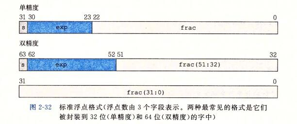
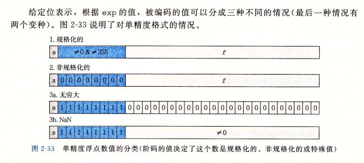

**IEEE浮点表示**

```
符号(sign) ： s 决定这数是负数(s==1)还是正数(s==0)，而对于数值 0 的符号位解释作为特殊情况处理

尾数(significand): M 是一个二进制小数，它的范围是 1~2---e 或者是 0~1---e.

阶码(exponent): E 的作用是对浮点数加权,这个权重是 2 的 E 次幂(可能是负数)。将浮点数的位表示划分为三个字段，分别对这些值进行编码：
  一个单独的符号位 s 直接编码符号 s;
  k 位的阶码字段 exp = e(k-1)...e1 e0 编码阶码 E。 指数部分 2^1 2^222
  n 位小数字段 frac = f(n-1)... f1 f0 编码尾数 M,但是编码出来的值也依赖于阶码字段的值是否等于 0;
```

```
float : s = 1 k = 8 n = 23位  得到一个32位
double: s = 1 k = 11 n = 52位 得到一个64位
```





**情况1：规格化的值**

```
这是最普遍的情况。当 k 的位模式即不全为 0 (数值为0)，也不全为1(单精度 255，双精度 2047)时，都属于这类情况。在这种情况中，阶码字段被解释为以偏置(biased)形式表示的有符号整数。也就是说，阶码的值是 E= e-Bias,其中 e 是无符号数，其位表示为 e(k-1)...e1e0,而Bias 是一个等于 2(k-1) -1(单精度是 127 双精度是 1023)的偏置值。由此产生指数的取值范围，对于单精度是 -126~+127, 而对于双精度是 -1022~+1023.
```

```
因为我们可以调整 e 自然常数 来将 其 0.xxx 调整为 1.xxx
```


