## IEEE浮点表示

```
前一节中谈到的定点表示法不能很有效的表示非常大的数字。
```

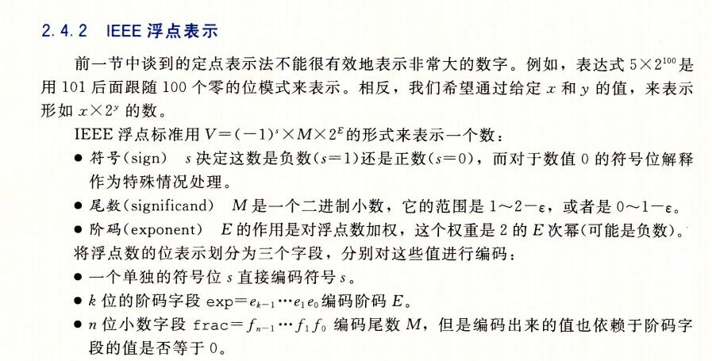


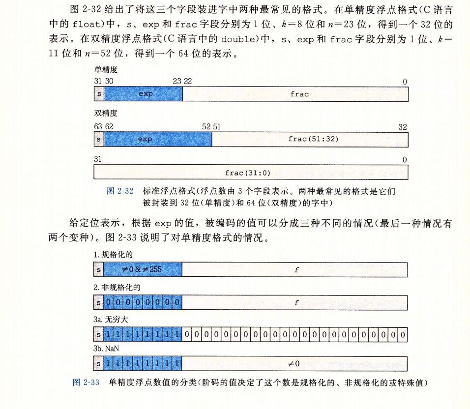

```
s  sign 符号
M   significand 有效位数
E   exponent 指数

V=(-1)^s * M * 2^E

float 32 1 sign 8 exponent  23 significand
double 64 1 sign 11 exponent 52 signifgicand
```


### 情况一：规格化的值

```
这是最普遍的情况。当exp的位模式既不全为0(数值0），也不全为1（单精度数值为 255，双精度 2047）时，都属于这类情况. 在这种情况中，阶码字段被解释为以偏置(biased)形式表示的有符号整数。也就是说，阶码的值是 E = e - bias, 其中 e 是无符号数，其位表示为 e(k-1)...e1e0， 而 bias 是一个 等于 2^(k-1) -1 (单精度是127，双精度是 1023)的偏置值。由此产生指数的取值范围，对于单精度是 -126 ~ +127, 而对于双精度是 -1022 ~ +1023。
```

```
小数字段 frac 被解释为描述小数值 f, 其中 0<= f < 1,其二进制表示为 0.f(n-1)...f1f0,  也就是二进制小数点在最高有效位的左边。尾数定义为 M = 1 + f。有时，这种方式也叫 隐含的以1开头的 (implied leading 1)表示，因为我们可以把M看成一个二进制表达式为 1.f(n-1)...f1f0 的数字。既然我们总是能够调整阶码E，使得尾数 M 在范围 1<=M<2之中，(假设没有溢出)，那么这种表示方法是一种轻松获取一个额外精度位的技巧。既然第一位总是等于 1，那么我们就不需要显示的表示它。
```

```
E=e-bias;
E是阶数位 exponent
e 是阶数的无符号数
Bias 是偏置值  bias = 2^(k-1) - 1
float 32 位 单精度 1 8 23
  bias = 127
  e的范围是 1 ~ 254   2^8  - 1 = 255
  位模式就是 [1,1,0,1,1] 就是二进制的表示模式
  因为 e 不能位模式全为 0，全为 0 就是非规格化的值了。所以 e最小为 1
  因为 e 不能位模式全为 1, 全为 1 就是特殊值了。所以 e 的最小为 254 ， 11110
  
  E的范围就是  1- 127 = -126  254 - 127= 127
  -126 ~ 127
  
double 64 位 双精度  1 11 52  
bias = 1023
e 的范围是 0001, 1110. 1 ~ 2046
E 的范围是 -1022 ~ +1023
```


### 情况二：非规格化的值

```
当阶码域为全0时，所表示的数是非规格化形式。exponent 在这种情况下，阶码值是 E=1-bias,而尾数的值时 M=f , 也就是小数字段的值，不包含隐含的开头的 1。
```

```
旁注： 对于非规格化值为什么要这样设置偏置值
	是阶码值为 1-bias 而不是简单的 -bias 似乎是违反直觉的。我们将很快看到，这种方式提供了一种非规格化值平滑转换到规格化值得方法。
```

```
非规格化数有两个用途。首先，它们提供了一种表示数值0的方法，因为使用规格化数，我们必须总是使 M>=1,因此我们就不能表示 0. 实际上，+0.0的浮点表示的位模式全为全0：符号位是0，阶码字段全为0(表明是一个非规格化值)，而小数域(f小数字段为：f)也全为0，这就得到M=f=0。
令人奇怪的是，当符号位为1，而其他域全为0时，我们得到的值-0.0.根据IEEE的浮点格式，值      +0.0 和 -0.0 在某些方面被认为是不同的，而在其他方面是相同的。

非规格化数的另外一个功能时表示那些非常接近0.0的数。它们提供了一种属性，称为逐渐溢出(gradual underflow),其中，可能的数值分布均匀地接近于0.0。

```


### 情况三：特殊值

```
最后一类数值是当指阶码全为1的时候出现的。当小数域全为0时，得到的值表示无穷，当s=0时是   +最大。当s=1时是 -最大。当我们把两个非常大的数相乘，或者除以零时，无穷能够表示溢出的结果。当小数域为非零时，结果值被称为 “NaN”,即“不是一个数(Not a Number)"的缩写。一些运算的结果不能是实数或无穷，就会返回这样的 NaN 值，比如当计算 根号-1 或者 最大-最大时。在某些应用中，表示未初始化的数据时，它们也很有用处。
```

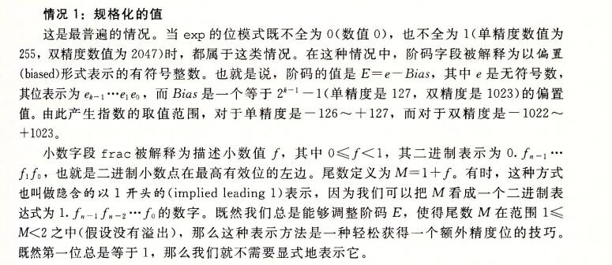


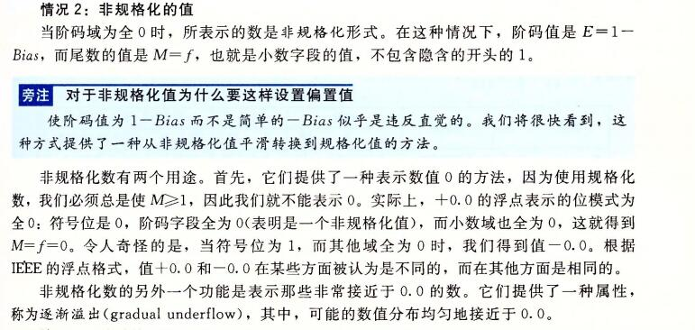


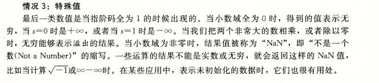


## 数字示例

```
下图展示了一组数值，它们可以用假定的6位格式来表示，有k=3的阶码位和n=2的尾数位。偏置量是2^(3-1) -1 = 3. 图中a部分显示了所有可表示的值(除了NaN).两个无穷值在两个末端。最大数量值得规格化是 +-14. 非规格化数聚集在0的附近。图的b部分中，我们只展示了介于 -1.0 和 +1.0 之间的数值，这样就能够看的更加清楚了。两个零是特殊的非规格化数。可以观察到，那些可表示的数并不是均匀分布的 --- 越靠近原点处它们越稠密。
```

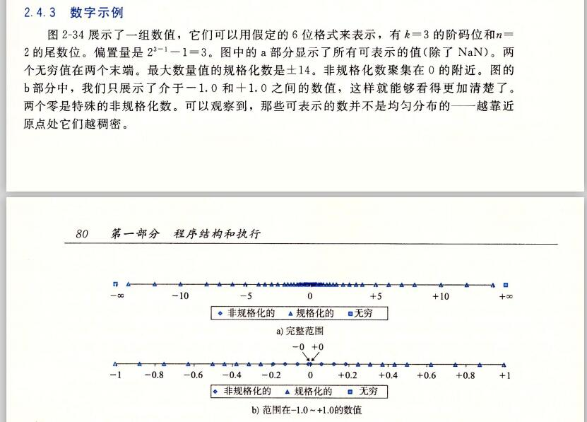


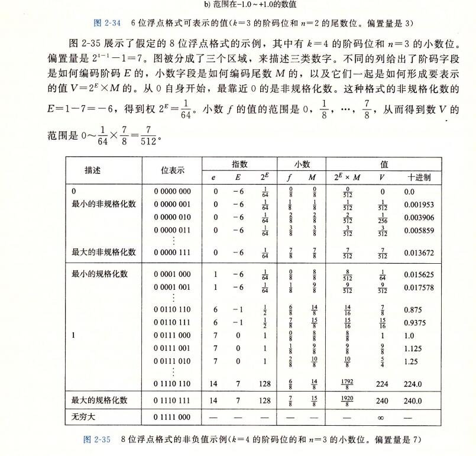


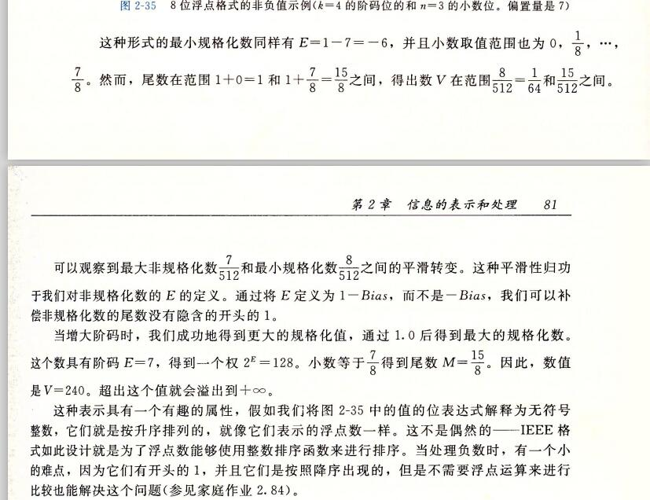


### 一些总结值

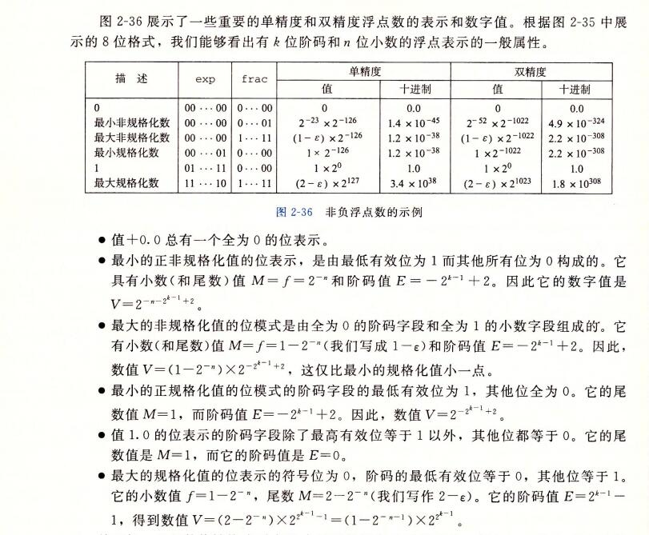


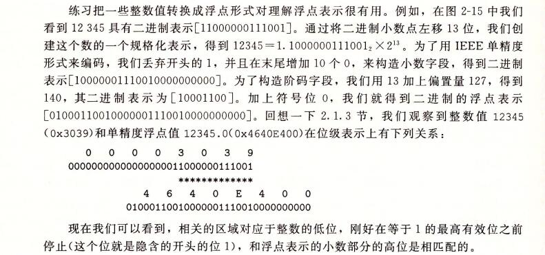


## 舍入

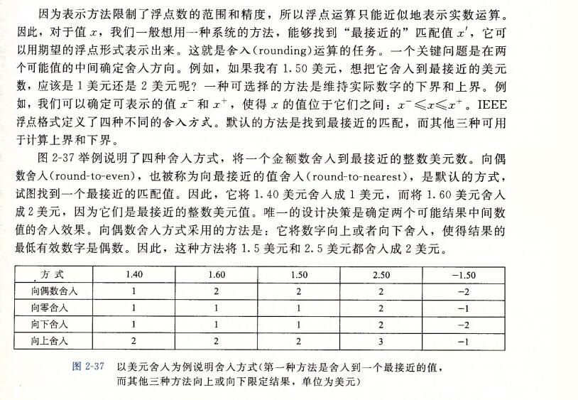


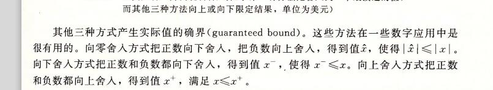


### 为什么要使用偶数舍入

```
使用 4舍 6入，然后 5 的话就向偶数舍入。 就是 2.5 舍入为 2  1.5 舍入为 2
```


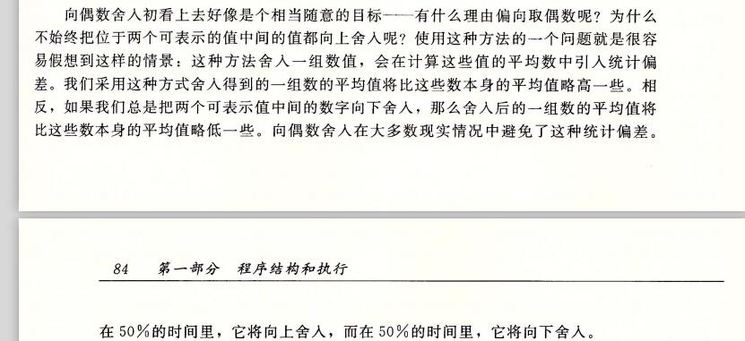


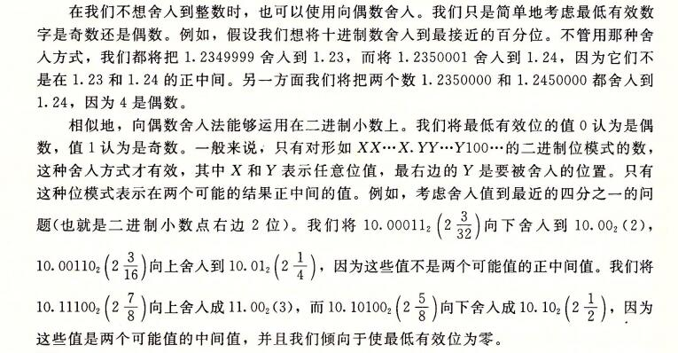


```
   cpu中的运算单元包括：存储执行，整形执行，浮点执行三个单元，其中浮点运算国内以前做的特别少，

原因主要有2个，一是国内对精度的要求并没有那么高，二是浮点运算单元有点难度。今天在这里主要介绍一

下浮点加法运算的过程（浮点运算单元最难的三个模块就是浮点加法，浮点乘法，除法运算）。

       首先国内外现在用的浮点的格式全部都是IEEE754标准，单精度32位，双精度64位，真正计算的时候，

可能会扩展，就像X86  CPU使用了80位的扩展精度，扩展的目的无非是一是扩大表示范围，二十为了复用

逻辑，我们只有掌握其中的原理，怎么扩展并不重要。754的标准网上有很多，不清楚直接百度。

1.  异常检测 ： 主要检测NAN（非数），Denormal，Denormal不同的公司处理不太一样。

2. 对阶，尾数右移：不同阶码尾数不能直接相加减，所以需要对阶，比如1.1 * 2 E 1  + 1.1 * 2 E 2 尾数就不能运算，

对阶，尾数右移，最终阶码一致。

3 . 尾数求和求差：这里会有一些算法，就不详细介绍了，保密。

4. 规格化：把非规格的小数转换为规格化的小数。注意移位的方法。

5. 舍入：四种舍入方法，向上舍入，向下舍入，向最近舍入，直接截去。

6. 后异常检查：三种异常，overflow上溢，underflow下溢，以及计算过程精度的损失叫做精度异常。

以上就是浮点加法的全部过程。

```

## 浮点数的加减法运算

url:https://blog.csdn.net/yanmiao0715/article/details/82261621

详细可以看该地址介绍的浮点数的加减乘除法运算


```
浮点数的规格化：其实浮点数的规格化没什么好说的，基本上是和我们当年学的科学计数法是一个样子的。我们就说一下基数为2的规格化方式：基数为2时，尾数最高为1的数规格化数。规格化时，尾数左移一位，阶码减1；尾数右移一位，阶码加1。当尾数小于等于1的时候，规格化就完成了。 

1）对阶，使得两数的小数点位置对齐。
2）尾数求和，将对阶后的两个尾数按照定点的加减法运算规则计算。
3）规格化，为增加有效数字的位数，提高运算精度，必须将求和（差）后的尾数规格化
4）舍入，为提高精度，要考虑尾数右移时候丢失的数值位
5）溢出判断，判断计算结果是否存在溢出
```

```
 所谓的对阶，就是对阶码进行运算。我们让两个阶码做减法，判断哪个阶码更大，谁大就向谁看齐。同时，两个阶码差几就让对应的尾数向左或者向右移动几位，使得阶码之间的差值为0. 
- 尾数求和就是两个尾数相加，这个没什么好说的，按照定点的运算就可以了。 
- 尾数计算完毕后，需要规格化。 
因为在上面我们讲了浮点数的表示范围，当基数为2的时候，规格化数s的绝对值应该属于[1/2,1)之间，所以当s<0的时候，补码规格化形式为00.1xxxxx，而s>0的时候，补码规格化形式为11.0xxxx。 所以，尾数的最高数值位和符号位不同的时候，就存在两种可能的情况。

这就导致当规格化数小于0的时候，规格化有两种方式。
```

```
因为 v = -1^s * s^E * M 所以其实就是 十进制的运算
-1^s* M   * s^E
把 * s^E 提取出来 然后就计算尾数就好了

就是比如  3*2^4 - 3*2^3 = 
	6*2^3 - 3*2^3 =
	2^3*(6-3)
	= 3*2^3
```


## 浮点数的乘除法运算

浮点数的乘除法运算其实也是基于加减运算的。 
运算步骤如下：

```
1)阶码相加减:按照定点整数的加减法运算方法对两个浮点数的阶码进行加减运算。

2)尾数相乘或相除:按照定点小数的阵列乘除法运算方法对两个浮点数的尾数进行乘除运算。为了保证尾数相除时商的正确性，必须保证被除数尾数的绝对值一定小于除数尾数的绝对值。若被除数尾数的绝对值大于除数尾数的绝对值，需对被除数进行调整，即被除数的尾数每右移1位，阶码加1，直到被除数尾数的绝对值小于除数尾数的绝对值。

3)结果规格化并进行舍入处理:浮点数乘除运算结果的规格化和舍入处理与浮点数加减运算结果的规格化和舍入处理方法相同。并且在浮点数乘除运算的结果中，由于乘积和商的绝对值一定小于1，因此在浮点乘除运算结果进行规格化处理时只存在向左规格化，不可能出现向右规格化。

4)判断溢出:浮点数乘除运算结果的尾数不可能发生溢出，而浮点数运算结果的溢出则根据运算结果中浮点数的阶码来确定，溢出的判定和处理方法与浮点加减运算完全相同。
```

```
其实也就是十进制的相乘相除

因为 v = -1^s * s^E * M 
 -1^s * s^E * M *   -1^s * s^E * M
 这样就算出来了

```


```
浮点数运算的的规格化

 在尾数用补码表示时，规格化浮点数应满足尾数最高数位与符号位不同，如相同就是不满足规格化。
尾数用双符号位补码表示，经过加/减运算之后，可能出现以下六种情况，即
① 00.1 x x … x 
② 11.0 x x … x
③ 00.0 x x … x
④ 11.1 x x … x
⑤ 01.x x x … x
⑥ 10.x x x … x 第①、②种情况，符合规格化数的定义，已是规格化数。 第③、④种情况不是规格化数，需要使尾数左移以实现规格化，这个过程称为左规。尾
浮点数运算的的规格化
浮点数运算的的规格化
浮点数运算的的规格化
数每左移一位，阶码相应减 1，直至成为规格化数为止。
左规可以进行多次。

第⑤、⑥种情况在定点加减运算中称为溢出，但在浮点加减运算中，只表明此时尾数的 绝对值大于 1，而并非真正的溢出。这种情况应将尾数右移以实现规格化。这个过程称为右 规。尾数每右移一位，阶码相应加 1。
右规最多只有一次。

总结：左规处理，及时数往小数点左边走，阶码-1，右规反之。
```

```
为什么 1,2是规格化，因为 1,2直接修改阶码而不用左右移动尾数。
00.1 直接去掉 00 就可以了
11.0 得话 阶数 - 2 就可以了

而 3,4 的话

 00.0 x x … x 移动到 小数点后面第一位是 1 才能算规格化
 11.1 x x … x
```

```
浮点数的表示方法规格化处理

若浮点数用补码表示，则判断运算结果是否为规格化数的方法是
补码形式表示的数，最高位可以看作符号位，机器码左移一位并将原最高位丢掉，只要不溢出，就相当于乘以2.

原最高位丢掉后，原次高位现在成为最高位。只要不溢出，现在的符号位必然和原来相同。也就是说，移位前原最高位和次高位相同，乘以二就不会溢出，否则就会溢出。

浮点形式的机器码，如果其尾数部分是补码形式表示，那么就有如上特性。补码形式的最高一位，就是"数符"。如果小数点就定在符号位之后，那么“数符与尾数小数点后第一位数字”，就是上述的"最高位和次高位"。

我们知道，尾数乘以二并将阶码减一，所代表的算术数相同。同时，左移以后，最右边可以多出位置保留更低位的小数，可以提高精度。

所以，对一个一般的浮点形式，只要尾数乘以二可以不溢出，就进行这种"尾数乘以二并将阶码减一"的变换，可以提高下面计算的精度。反复进行如此变换，直到不能再变换为止，所得到的形式，就称为规格化数。这种变换过程，就称为"规格化"。

所谓"不能再变换"，也就是说尾数乘以二会溢出。如上所述，也就是尾数的"最高位和次高位不相同"。如果小数点就在符号位之后，也就是"数符与尾数小数点后第一位数字相异"。
```


