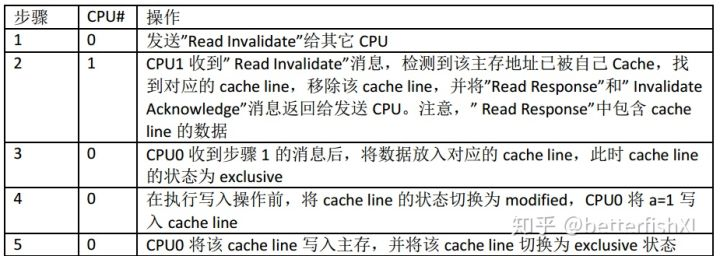

**为什么需要内存屏障**

[为什么需要内存屏障](https://zhuanlan.zhihu.com/p/55767485)

本文主要以[perfbook](https://link.zhihu.com/?target=https%3A//book.douban.com/subject/6957175/)的附录C "Why Memory Barriers"为基础，来总结一下个人对Memory Barriers的一些认识。

```
对称多处理"（Symmetrical Multi-Processing）简称SMP
```

SMP系统中，每个CPU都有自己的Cache，结构如图3所示。


```
显然，同一主存块可以对应到一个或多个CPU的 cache line 中，例如多个线程共用的全局变量。当一份数据放于多个地方时，我们便需要考虑一致性问题。
```

对于图3的CPU Cache，解决一致性问题的方法称为缓存一致性协议（[Cache-Coherence Protocols](https://link.zhihu.com/?target=https%3A//en.wikipedia.org/wiki/Cache_coherence) ）。


### 1、MESI Protocol 中 cache line 的四种状态


### 2、[MESI Protocol](https://link.zhihu.com/?target=https%3A//en.wikipedia.org/wiki/MESI_protocol)中CPU之间的六种消息


注：移除表示将该cache line置为invalid

### 3、常用操作中的状态变化和消息传递

例1：假设变量a的初值为0且在CPU1的cache中，现在CPU0要对a进行写入值为1的操作。




