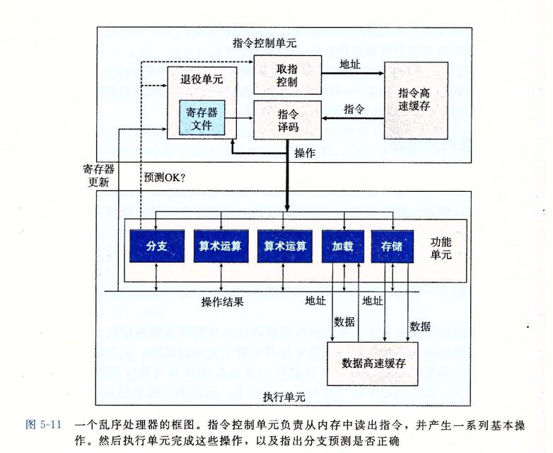

### 1、表示程序性能

```
我们引入度量标准每元素的周期数(Cycles Per Element, CPE),作为一种表示程序性能并指导我们改进代码的方法。CPE 这种度量标准帮助我们在更细节的级别上理解迭代程序的循环性能。这样的度量标准对执行重复计算的程序来说是很适当的，例如处理图像中的像素，或是计算矩阵乘积中的元素。
```

```
处理器活动的顺序是由时钟控制的，时钟提供了某个频率的规律信号，通常用 千兆赫兹(GHz  gigaHz  ,MHz  million),即十亿周期每秒来表示。例如，当表明一个系统有 "4GHz"处理器，这表示处理器时钟运行频率为每秒4* 10^9 个周期。每个时钟周期的时间是时钟频率的倒数(就是说 每个时钟频率需要 1/(4* 10^9) 时间). 
```


## 7、理解现代处理器

```
到目前为止，我们运用的优化都不依赖于目标机器的任何特性。这些优化知识简单的降低了过程调用的开销，以及消除了一些重大的"妨碍优化的因素"，这些因素会给优化编译器造成困难。随着试图进一步提高性能，必须考虑利用处理器微体系结构的优化，也就是处理器用来执行指令的底层系统设计。要想充分提高性能，需要仔细分析程序，同时代码的生成 也要针对目标处理器进行调整。尽管如此，我们还是能够运用一些基本的优化，在很大一类处理器上产生整体的性能提高。我们在这里公布的详细性能结果，对其他机器不一定有同样的效果，但是操作和优化的通用原则对各种各样的机器都适用。
```

```
为了理解改进性能的方法，我们需要理解现代处理器的微体系结构。由于大量的晶体管被集成到一块芯片上，现代微处理器采用了复杂的硬件，试图使程序性能最大化。带来的一个后果就是处理器的实际操作与通过观察机器级程序所察觉的大相径庭。
在代码级上，看上去似乎是一次执行一条指令，每条指令都包括从寄存器或内存取指，执行一个操作，并把结果存回到一个寄存器或内存位置。
在实际的处理器中，是同时对多条指令求值的，这个现象称为指令集并行。

在某些设计中，可以有100或更多挑指令在处理器。
采用一些精细的机制来确保这种并行执行的行为，正好能获得机器级程序要求的顺序语句模型的效果。
现在微处理器取得的了不起的功绩之一是：它们采用复杂而奇异的微处理器结构，其中，多条指令可以并行的执行，同时又呈现出一种简单的顺序执行指令的表象。
```

```
虽然现代微处理器的详细设计超出了本书讲授的范围，对这些微处理器运行的原则有一般性的了解就足够理解它们如何实现指令级并行。
我们会发现两种下界描述了程序的最大性能。
当一系列操作必须按照严格顺序执行时，就会遇到  延迟界限(latency bound),因为在下一条指令开始之前，这条指令必须结束。

当代码中的数据相关限制了处理器利用指令级并行的能力时，延迟界限能够限制程序性能。

吞吐量界限(throughput bound)刻画了处理器功能单元的原始计算能力。这个界限是程序性能的终极限制。
```

### 1、整体操作



### 

```
图5-11 是现代微处理器的一个非常简单化的示意图.我们假想的处理器设计是不太严格的基于近期的 Intel 处理器的结构。这些处理器在工业界称为 超标量(superscalar),意思它可以在每个时钟周期执行多个操作，而且是乱序的(out-of-order),意思就是指令执行的顺序不一定要与它们在机器级程序中的顺序一致。整个设计有两个主要部分:
	指令控制单元(Instruction Control Unit,ICU)
	和执行单元(Execution Unit, EU).
	
前者负责从内存中读出指令序列，并根据这些指令序列生成一组针对程序数据的基本操作;
而后者负责执行这些操作。

和第4章中研究过的按序(in-order)流水线相比，乱序处理器需要更大、更复杂的硬件，但是它们能更好的达到更高的指令级并行度。
```


```
ICU 从指令高速缓存(instruction  cache)中读出指令，指令高速缓存是一个特殊的高速存储器，它包含最近访问的指令。
通常，ICU 会在当前正在执行的指令很早之前 就完成当前指令的取指，这样它才有足够的时间对指令译码，并把操作发送给EU。
不过，一个问题是当程序遇到分支时，程序有两个可能的前进方向。
一种可能会选择分支，控制被传递到分支目标。
另一种可能是，不选择分支，控制被传递到指令序列的下一条指令。
现代处理器采用了一种称为分支预测(branch prediction)的技术，处理器会猜测是否会选择分支，同时还预测分支的目标地址。使用投机执行(speculative execution)的技术，处理器会开始取出位于它预测的分支回跳到的地方的指令，并对指令译码，甚至在它确定分支预测是否正确之前就开始执行这些操作。
如果过后确定分支预测错误，会将状态重新设置到分支点的状态，并开始取出和执行另一个方向上的指令。
标记为取指控制的块包括分支预测，以完成确定取哪些指令的任务。
```

```
指令译码逻辑接收实际的程序指令，并将它们转换成一组基本操作 (有时称为微操作）。
每个这样的操作都完成某个简单的计算任务，例如两个数相加，从内存中读数据，或是向内存写数据。对于具有复杂指令的机器，比如x86处理器，一条指令可以被译码成多个操作。
关于指令如何被译码成操作序列的细节，不同的机器都会不同，这个信息可谓是高度机密。幸运的是，不需要知道某台机器实现的底层细节，我们也能优化自己的程序。
```


```
在一个典型的 x86 实现中，一条只对寄存器操作的指令，例如 add %rax,%rdx 会被转化成一个操作。

另一方面，一条包括一个或多个内存引用的指令，例如 add %rax, 8(%rdx)
会产生多个操作，把内存引用和算术运算 分开。
这条指令会被译码成为三个操作：一个操作从内存中加载一个值到处理器中，一个操作将加载进来的值加上寄存器 %rax 中的值，而一个操作将结果存回到内存。
这种译码逻辑对指令进行分解，允许任务在一组专门的硬件单元之间进行分割。
这些单元可以并行的执行多条指令的不同部分。
```

```
EU接收到来自取指单元的操作。通常，每个时钟周期会接收多个操作。这些操作会被分派到一组 功能单元 中，他们会执行实际的操作中。
这个单元有一个加法器来完成地址计算。
```


