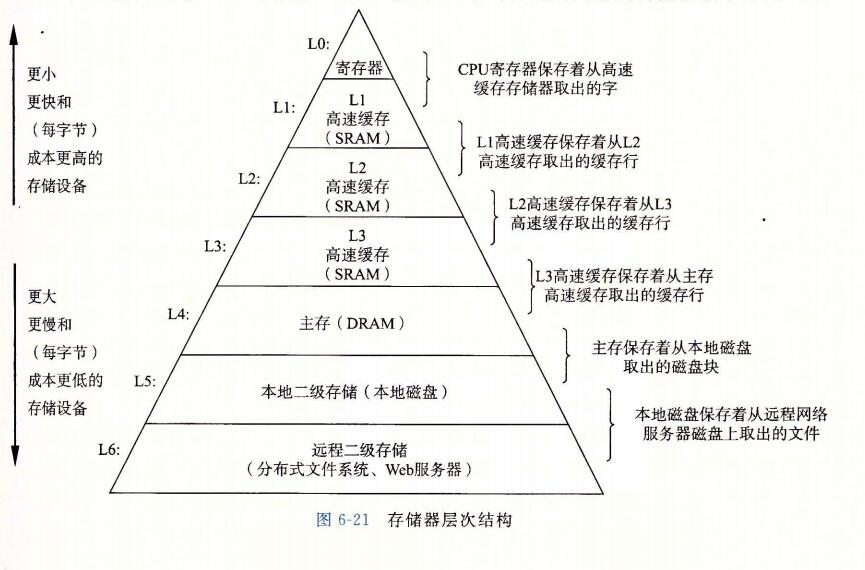
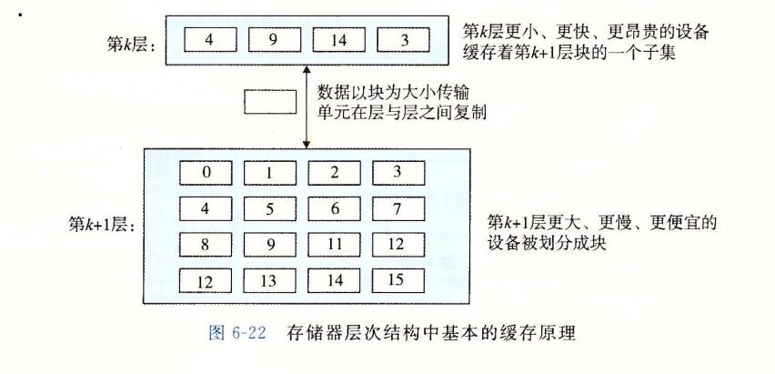
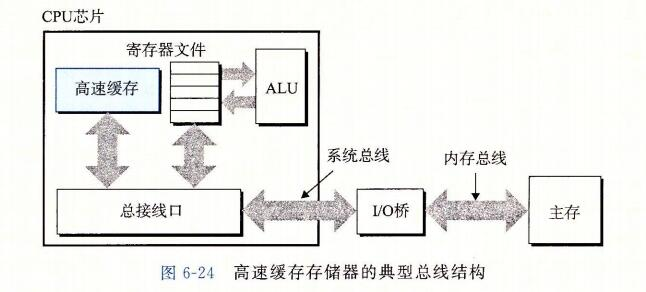
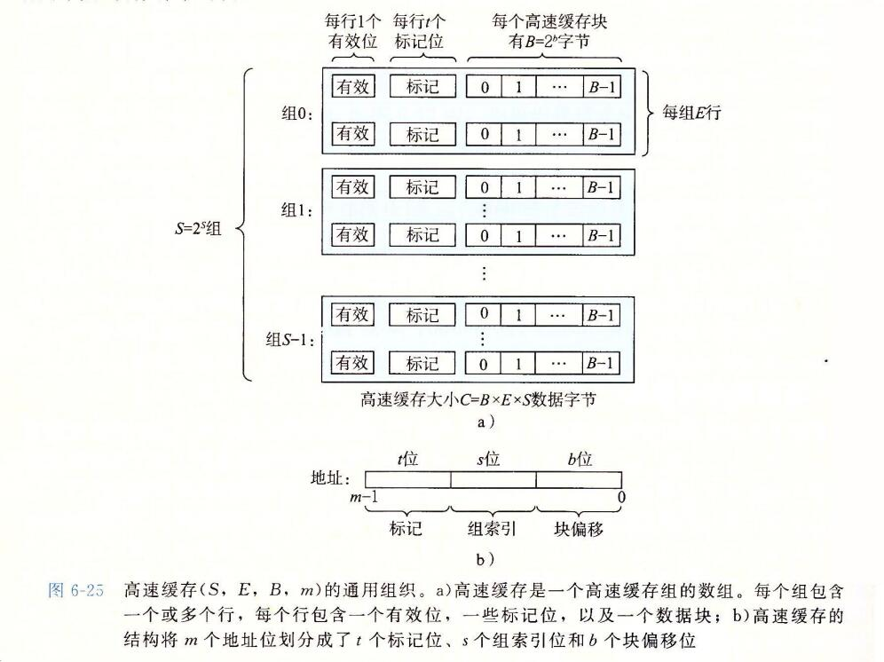
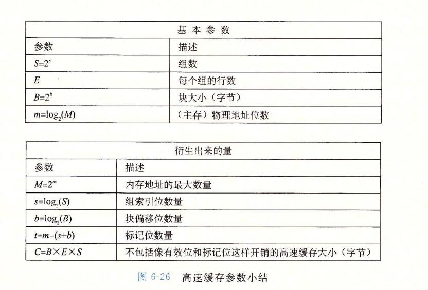
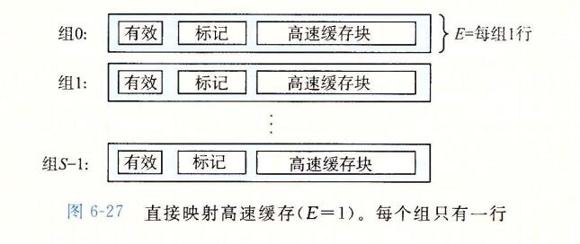
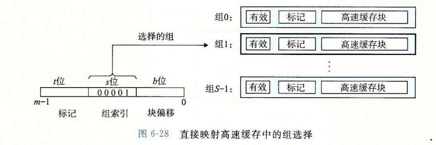

## 3、存储器层次结构

```
6.1节和6.2节描述了存储技术和计算机软件的一些基本的和持久的属性：

存储技术：不同存储技术的访问时间差异很大。速度较快的技术每字节的成本要比速度较慢的技术高，而且容量较小。CPU和主存之间的速度差距在增大。

计算机软件：一个编写良好的程序倾向于展示出良好的局部性。
```

```
计算机中一个喜人的巧合是，硬件和软件的这些基本属性互相补充的很完美。它们这种互相补充的性质使人想到一种组织存储器系统的方法，称为存储器层次结构(memory hierarchy)，所有的现代计算机系统中都使用了这种方法。图6-21展示了一个典型的存储器层次结构。
一般而言，从高层往底层走，存储设备变得更慢、更便宜和更大。
在最高层(L0),是少量快速的CPU寄存器，CPU可以在一个时钟周期内访问它们。
接下来是一个或多个小型到中型的基本SRAM的高速缓存存储器，可以在几个CPU时钟周期内访问他们。
然后是一个大的基于DRAM的主存，可以再几十个到几百个时钟周期内访问它们。
接下来是慢速但是容量很大的本地磁盘。
最后，有些系统甚至包括了一层附加的远程服务器上的磁盘，要通过网络来访问它们。
类似，万维网允许程序访问存储在世界上任何地方的web服务器的远程文件。
```




### 1、存储器层次结构中的缓存

```
一般而言，高速缓存(cache)是一个小而快速的存储设备，它作为存储在更大、也更慢的设备中的数据对象的缓冲区域。使用高速缓存的过程称为缓存(caching).
```

```
存储器层次结构的中心思想是，对于每个K，位于k层的更快更小的存储设备作为位于k+1层的更大更慢的存储设备的缓存。
换句话手，层次结构中的每一层都缓存来自较低一层的数据对象。
例如，本地磁盘作为通过网络从远程磁盘取出的文件(例如web页面)的缓存，主存作为本地磁盘上数据的缓存，以此类推，知道最小缓存--CPU寄存器组。
```

```
图6-22展示了存储器层次结构中缓存的一般性概念。
第k+1层的存储器被划分成连续的数据对象组块(chunk),称为块(block).
每个块都有一个唯一的地址或名字，使之区别于其他的块。
块可以是固定大小的(通常是这样的)，也可以是可变大小的(例如存储在web服务器上的远程HTML文件)。例如，图6-22中的k+1层存储器被划分成16个大小固定的块，编号为0~15.
```



```
类似地，第k层的存储器被划分成较小的块的集合，每个块的大小与k+1层的大小一样。
在任何时刻，第k层的缓存包括第k+1层块的一个子集的副本。例如，在图6-22中，第k层的缓存有4个块的空间，当前包含块4、9、14和3的副本。
```

```
数据总是以块大小为传送单元(transfer unit)在第k层和第k+1层之间来回复制的。
虽然在层次结构中任何一对相邻的层次之间块大小是固定的，但是其他的层次对之间可以有不同的块大小。

例如，在图6-21中，L1和L0之间的传送通常使用的是1个字大小的块。
L2和L1之间(以及L3和L2之间，L4和L3之间)的传送通常使用的是几十字节的块。
而L5和L4之间的传送用的是大小为几百或几千字节的块。
一般而言，层次结构中较低层(离CPU较远)的设备的访问时间较长，因此为了补偿这些较长的访问时间，倾向于使用较大的块。

也就是说块的划分是基于存储器的，基于不同的存储器，划分的块是不一样大的。
比如 L1和L0的块 是一个字的大小。
L1和L2的块就是 几十字节 的大小。
```


#### 1、缓存命中

```
当程序需要第K+1层的某个数据对象d时，它首先在当前存储在第k层的一个块中查找d。
如果d刚好缓存在k层中，那么就是我们所说的缓存命中(cache hit).
该程序直接从第k层读取d，根据存储器层次结构的性质，这要比从第k+1层读取d更快。例如，一个有良好时间局部性的程序可以从块14中读出一个数据对象，得到一个对k层的缓存命中。
```

#### 2、缓存不命中

```
另一方面，如果第k层中没有缓存数据对象d,那么就是我们所说的缓存不命中(cache miss).
当发生缓存不命中时，第k层的缓存从第k+1层缓存中取出包含d的那个块，如果第k层的缓存已经满了，可能就会覆盖现存的一个块。
```

```
覆盖一个现存的块的过程称为 替换(replacing)或驱逐(evicting)这个块。
被驱逐的这个块有时也称为牺牲块(victim block).
决定该替换哪个块是由缓存的替换策略(replacement policy)来控制的。

例如,一个具有随机替换策略的缓存会随机选择一个牺牲块。
一个具有最近最少被使用(LRU least recently used)替换策略的缓存会选择那个最后被访问的时间距现在最远的块。
```

```
在第k层缓存从第k+1层取出那个块之后，程序就能像前面一样从第k层读出d了。
例如，在图6-22中，在第k层中读块12中的一个数据对象，会导致一个缓存不命中，因为块12当前不在第k层缓存中。一旦把块12从第k+1层复制到第k层之后，它会保持在那里，等待稍后的访问。
```

#### 3、缓存不命中的种类

**冷不命中或强制性不命中**

```
区分不同种类的缓存不命中有时候是很有帮助的。如果第k层的缓存是空的，那么对任何数据对象的访问都会不命中。
一个空的缓存有时被称为冷缓存(cold cache),此类不命中称为强制性不命中(compulsory miss)或冷不命中(cold miss)。
冷不命中很重要，因为它们通常是短暂的事件，不会在反复访问存储器使得缓存暖身(warmed up)之后的稳定状态中出现。
```

```
只要发生了不命中，第k层的话缓存就必须执行某个放置策略(placement policy),确定把它从第k+1层中取出的块放在哪里。
最灵活的替换策略是允许来自第k+1层的任何块放在第k层的任何块中。
对于存储器层次结构中高层的缓存(靠近cpu)，它们是用硬件来实现的，而且速度是最优的，这个策略实现起来通常很昂贵，因为随机地放置块，定位起来代价很高。
```

```
因此，硬件缓存通常使用的是更严格的放置策略，这个策略将第k+1层的某个块限制放置在第k层的一个小的子集中(有时只是一个块)。

例如，在图6-22中，我们可以确定第k+1层的块i必须放置在第k层的块(i mod 4)中.
例如，第k+1层的块0、4、8和12会映射到k层的块 0;块1、5、9和13会映射到块1；以此类推
```

**冲突不命中**

```
这种限制性的放置策略会引起一种不命中，称为冲突不命中(conflict miss),在这种情况中，缓存足够大，能够保存被引用的数据对象，但是因为这些对象会映射到同一缓存块，缓存会一直不命中。

例如，在图6-22中，如果程序请求块0，然后块8，然后块0，然后块8，以此类推，在第k层的缓存中，对这两个块的每次引用都会不命中，即使这个缓存总共尅容纳4个块。
```

**容量不命中**

```
程序通常是按照一系列阶段(如循环)来运行的，每个阶段访问缓存块的某个相对稳定不变的集合。

例如，一个嵌套的循环可能会反复地访问同一个数组的元素。这个块的集合称为这个阶段的工作集(working set).
当工作集的大小超过了缓存的大小时，缓存会经历容量不命中(capacity miss).

换句话说就是，缓存太小了，不能处理这个工作集。
```

#### 4、缓存管理

```
正如我们提到过的，存储器层次结构的本质是，每一层存储设备都是较低一层的缓存。
在每一层上，某种形式的逻辑必须管理缓存。
这里，我们的意思是指某个东西要将缓存划分成块，在不同的层之间传送块，判定是命中还是不命中，并处理它们。管理缓存的逻辑可以是硬件、软件，或是两者的结合。
```

```
例如，编译器管理寄存器文件，缓存层次结构的最高层。它决定当发生不命中时何时发射加载，以及确定哪个寄存器来存放数据。
L1 L2 L3层的缓存完全是由内置在缓存中的硬件逻辑来管理的。
在一个有虚拟内存的系统中，DRAM主存作为存储在磁盘上的数据块的缓存，是由操作系统软件和CPU上的地址翻译硬件共同管理的。
对于一个具有想AFS这样的分布式文件系统的机器来说，本地磁盘作为缓存，它是由运行在本地机器上的AFS客户端进程管理的。
在大多数时候，缓存都是自动运行的，不需要程序采取特殊的或显示的行动。
```


### 2、存储器层次结构概念小结

```
概括来说，基于缓存的存储器层次结构行之有效，是因为较慢的存储设备比较快的存储设备更便宜，还因为程序倾向于展示局部性：

利用时间局部性：由于时间局部性，同一数据对象可能会被多次使用。一旦一个数据对象在第一次不命中时被复制到缓存中，我们就会期望后面对该目标有一系列的访问命中。因为缓存比低一层的存储设备更快，对后面的命中的服务会比最开始的不命中快很多。

利用空间局部性：块通常包含有多个数据对象。由于空间局部性，我们会期望后面对该块中其他对象的访问能够补偿不命中后复制该块的花费。
```

```
现代系统中到处都使用了缓存。正如从图6-23中能够看到的那样，CPU芯片、操作系统、分布式文件中和万维网上都使用了缓存。各种各样硬件和软件的组合构成和管理着缓存。
```


## 4、高速缓存存储器

```
早期计算机系统的存储器层次结构只有三层：CPU寄存器、DRAM主存储器和磁盘存储。不过，由于CPU和主存之间逐渐增大的差距，系统设计者被迫在CPU寄存器文件和主存之间插入了一个小的SRAM高速缓存存储器，称为L1高速缓存(一级缓存)，如图6-24所示。L1高速缓存的访问速度几乎和寄存器一样快，典型的是大约4个时钟周期。
```



```
随着CPU和主存之间的性能差距不断增大，系统设计者在L1缓存和主存之间又插入了一个更大的高速缓存，称为L2高速缓存，可以在大约10个时钟周期内访问到它。
有些现代系统还包括有一个更大的高速缓存，称为L3高速缓存，在存储器层次结构中，它位于L2高速缓存和主存之间，可以在大约50个周期内访问到它。虽然安排上有相当多的变化，但是通用原则是一样的。

对于下一节中的讨论，我们会假设一个简单的存储器层次结构，CPU和主存之间只有一个L1高速缓存。
```

### 1、通用的高速缓存存储器组织结构

```
考虑一个计算机系统，其中每个存储器地址有m位，形成 M=2^m 个不同的地址。

如图6-25a所示，这样一个机器的高速缓存被组织成一个有 S=2^s 个高速缓存组(cache set)的数组。
每个组包含 E 个高速缓存行(cache line).

每个行是由一个 B=2^b 字节的数据块(block)组成的，
一个有效位(valid bit)指明这个行是否包含有意义的信息，还有t=m-(b+s)个标记位(tag bit)(是当前块的内存地址的位的一个子集)，它们唯一的标识了存储在这个高速缓存行中的块。
```



```
一般而言，高速缓存的结构可以用元组(S,E,B,m)来描述。
高速缓存的大小(或容量)C指的是所有块的大小的和。标记位和有效位不包括在内。
因此，C=S*E*B

	当一条加载指令指令指示 CPU 从主存地址 A 中读一个字时，它将地址 A 发送到高速缓存。
如果高速缓存正保存着地址 A 处那个字的副本，它就立即将那个字发回给CPU。
那么高速缓存如何知道它是否包含地址A处那个字的副本的呢？
高速缓存的结构使得它能通过简单地检查地址位，找到所请求的字，类似于使用及其简单的哈希函数的哈希表。下面介绍它是如何工作的：
```

```
参数 S 和 B 将 m 个地址位分为了三个字段，如图6-25b所示。
A中 s 个组索引位是一个到 S 组的数组的索引。
第一个组是组0，第二个组是组1，依次类推。
组索引位被解释为一个无符号整数，它告诉我们这个字必须存储在哪个组中。
一旦我们知道了这个字必须放在哪个组中，A中的t个标记位就告诉我们这个组中哪一行包含这个字(如果有的话)。
当且仅当设置了有效位并且改行的标记位与地址A中的标记位相匹配时，组中的这一行才包含这个字。
一旦我们在由组索引标识的组中定位了由标号所标识的行，那么b 个块偏移位给出了在B个字节的数据块中的字偏移。
```




### 2、直接映射高速缓存

```
根据每个组的高速缓存行数E，高速缓存被分为不同的类。
每个组只有一行(E=1)的高速缓存称为直接高速缓存(direct-mapped cache)(见图6-27)。
直接映射高速缓存是最容易实现和理解的，所以我们会以它为例来说明一些高速缓存工作方式的通用概念。
```




```
假设我们有这样一个系统，它有一个CPU、一个寄存器文件、一个L1高速缓存和一个主存。
当 CPU执行一条读内存字w的指令，它向L1高速缓存请求这个字。
如果L1高速缓存有w的一个缓存的副本，那么就得到L1高速缓存命中，高速花奴才嫩会很快抽取出w，并将它返回给CPU。否则就是缓存不命中，当L1高速缓存向主存请求包含w的块的一个副本时，CPU必须等待。
当被请求的块最终从内存到达时，L1高速缓存将这个块存放在它的一个高速缓存行里，从被存储的块中抽取出字w,然后将它返回给CPU.
高速缓存确定一个请求是否命中，然后抽取出被请求的字的过程，分为三步：
1、组选择
2、行匹配
3、字抽取
```

#### 1、直接映射高速缓存的组选择

```
这一步中，高速缓存从w地址中间抽取出s个组索引位。
这些位被解释成一个对应于一个组号的无符号整数。
换句话来说，如果我们把高速缓存看成是一个关于组的一维数组，那么这些组索引位就是一个到这个数组的索引。

图6-28展示了直接映射高速缓存的组选择是如何工作的。
在这个例子中，组索引位 00001(2) 被解释为一个选择组 1 的整数索引。
```




#### 2、直接映射高速缓存中的行匹配

```
在上一步中我们已经选择了某个组 i，接下来的一步就要确定是否有字 w 的一个副本存储在组 i 包含的一个高速缓存行中。
在直接映射高速缓存中这很容易，而且很快，这是因为每个组只有一行。
当且仅当设置了有效位，而且高速缓存行中的标记与w的地址中的标记相匹配时，这一行中包含w的一份副本。
```

```
图6-29展示了直接映射高速缓存中匹配时如何工作的。在这个例子中，选中的组中只有一个高速缓存行。这个行的有效位设置了，所以我们知道标记和块中的位是有意义的。
```


