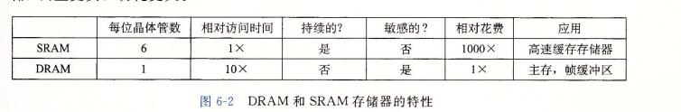
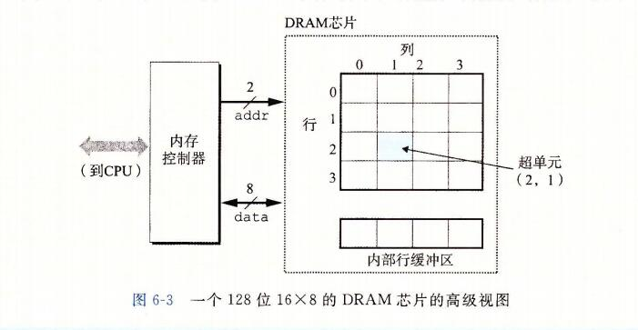

## 存储器层次结构

```
到目前为止，在对系统的研究中，我们依赖于一个简单的计算机系统模型，cpu 执行指令，而存储器系统为cpu 存放指令和数据。在简单模型中，存储器系统时一个线性的字节数组，而CPu 能够在一个常数时间内访问每个 存储器位置。虽然迄今为止这都是一个有效的模型，但是它没有反映现代系统实际工作的方式。
```

```
实际上，存储器系统(memory system)是一个具有不同容量、成本和访问时间的存储设备的层次结构。CPU 寄存器保存着最常用的数据。靠近CPU的小的、快速的高速缓存存储器(cache memory)缓存着 相对慢速的主存储器(main memory)中数据和指令的缓冲区域。
主存缓存存储这 容量较大的、慢速的磁盘上的数据，
而这些磁盘常常又作为存储在通过网络连接的其他机器的磁盘或磁带上的数据的缓冲区域。
```

```
存储器层次结构是可行的，这是因为与下一个更低层次的存储设备相比来说，一个编写良好的程序倾向于更频繁的访问某一个层次上的存储设备。
所以，下一层的存储设备可以更慢一点，也因此可以更大，每个比特位更便宜。整体效果是一个大的存储器池，其成本与层次结构底层最便宜的存储设备相当，但是却以接近于层次结构顶部存储设备的高速率向程序提供数据。
```

```
作为一个程序员，你需要理解存储器层次结构，因为它对应用程序的性能有着巨大的影响。如果你的程序需要的数据是存储在 CPU 寄存器中的，那么在指令的执行期间，在0个周期内就能访问到它。
如果存储在高速缓存中，需要4~75个周期。
如果存储在主存中，需要上百个周期。
而如果存储在磁盘上，需要大约几千万个周期。
```

```
这里就是计算机系统中一个基本而持久的思想：
如果你理解了系统时如何将数据在存储器层次结构中上上下下移动的，那么你就可以编写自己的应用程序，使得它们的数据项存储在层次结构中较高的地方，在那里CPU能更快的访问到它们。
```

```
这个思想围绕着计算机程序的一个称为局部性(locality)的基本属性。具有良好局部性的程序倾向于一次又一次地访问相同的数据项集合，或是倾向于访问邻近的数据项集合。
具有良好局部性的程序比局部性差的程序更多的倾向于从存储器层次结构中较高的层次处访问数据项，因此运行的更快。
```

```
在本章中，我们会看看基础的存储技术 - SRAM 存储器、DRAM 存储器、ROM存储器以及旋转的和固态的硬盘 -- 并描述它们是如何被组织成层次结构的。特别的，我们将注意力集中在高速缓存存储器上，它是作为CPU和主存之间的缓存区域，因为它们对应用程序性能的影响最大。
我们向你展示如何分析C程序的局部性，并且介绍改进你的程序中局部性的技术。
你还会学到一种描绘某台机器上存储器层次结构的性能的有趣方法，称为"存储器山(memory mountain)",它展示出读访问时间是局限性的一个函数。
```

## 1、存储技术

```
计算机技术的成功很大程度上源自于存储技术的巨大进步。早期的计算机只有几千字节的随机访问存储器。
```

### 1、随机访问存储器

```
随机访问存储器(Random-Access Memory,RAM)分为两类：
	静态的和动态的。
静态的RAM(SRAM)比动态(DRAM dynamic) 更快，但也贵得多。
SRAM用来作为高速缓存存储器，既可以在CPU芯片上，也可以在片下。

DRAM(dynamic Random-Access Memory) 用来作为主存以及图形系统的帧缓冲区。
典型的，一个桌面系统的 SRAM 不会超过几兆字节，但是 DRAM 却有几百或几千兆字节。
```

#### 1、静态RAM

```
SRAM 将每个位存储在一个双稳态的(bistable)存储器单元里。每个单元使用一个六晶体管电路来实现的。
这个电路有这样一个属性，它可以无限期地保持在两个不同的电压配置(configuration)或状态(state)之一。其他任何状态都是不稳定的 -- 从不稳定状态开始，电路会迅速地转移到两个稳定状态中的一个。这样一个存储器单元类似于图6-1中画出的倒转的钟摆。
```


```
当钟摆倾斜到最左边或最右边时，它是稳定的。从其他任何位置，钟摆都会倒向一边或另一边。
原则上，钟摆也能在垂直的位置无限期地保持平衡，但是这个状态是 亚稳态的(metastable) -- 最细微的扰动也能使它倒下，并且一旦倒下就永远不会再恢复到垂直的位置。

由于SRAM 存储器单元的双稳态特性，只有有电，它就会永远的保持它的值。即使有干扰(例如电子噪音)来扰乱电压，当干扰消除时，电路就会恢复到稳定值。
```

#### 2、动态RAM

```
DRAM 将每个位存储为对一个电容的充电。这个电容非常小，通常只有大约30毫微微法拉(femtofarad) -- 30*10^-15 法拉。不过，回想一下法拉是一个非常大的计量单位。
DRAM 存储器可以知道的非常密集 -- 每个单元由一个电容和一个访问晶体管组成。
但是，与SRAM不同，DRAM存储器单元对干扰非常敏感。
当电容的电压被扰乱之后，它就永远不会恢复了。
暴露在 光线下会导致电容电压改变。实际上，数码照相机和摄像机中的传感器本本质上就是DRAM单元的阵列。
```

```
很多原因会导致漏电，使得 DRAM 单元在 10~100毫秒时间内失去电荷。
幸运的是，计算机运行的时钟周期是以纳秒来衡量的，所以相对而言这个保持时间是比较长的。
内存系统必须周期性的通过读出，然后重写来刷新内存每一位。
有些系统也使用纠错码，其中计算机的字会被多编码几个位(例如64位的字可能用来72位来编码)，这样一来，电路可以发现并纠正一个字中任何单个的错误位。
```




```
图6-2 总结了SRAM 和 DRAM 存储器的特性，只要有供电，SRAM就会保持不变。
与DRAM不同，它不需要刷新。
SRAM的存取比DRAM快。
SRAM对诸如光和电噪声这样的干扰不敏感。
代价是SRAM单元和DRAM单元使用更多的晶体管，因而密集度低，而且更贵，功耗更大。
```


#### 3、传统的DRAM

```
DRAM 芯片中的单元(位)被分成 d 个超单元(supercell),每个超单元都由 w 个 DRAM 单元组成。一个 d*w 的DRAM总共存储了 dw 位信息。
超单元被组成一个 r 行 c 列的长方形阵列，这里 rc = d.
每个超单元有形如(i,j)的地址，这里i表示行，而j表示列。
```



```
例如，图6-3展示的是一个16*8 的DRAM芯片的组织，有d=16个超单元，每个超单元有
w = 8 位，r=4行，c=4列。
带阴影的方块表示地址(2,1)处的超单元。信息通过称为 引脚(pin) 的外部连接器流入和流出芯片。
每个引脚携带一个1位的信号。
图6-3给出了两组引脚：
	8个data引脚，它们能传送一个字节到芯片或芯片传出一个字节，以及2个addr引脚，它们携带2位的行和列超单元地址。
	其他携带控制信息的引脚没有显示出来。
```

```
旁注： 关于术语的注释
	存储领域从来没有为 DRAM 的阵列元素确定一个标准的名字。计算机架构师倾向于称之为"单元"，使这个术语具有 DRAM 存储单元之意。电路设计者倾向于称之为"字"，使之具有主存一个字之意
```


