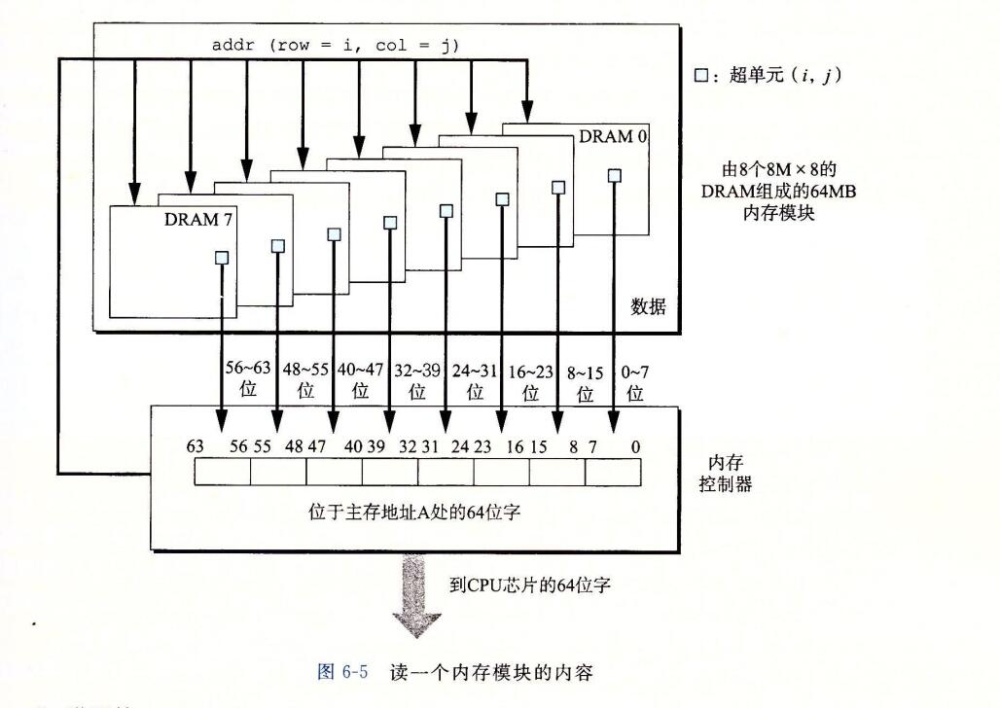
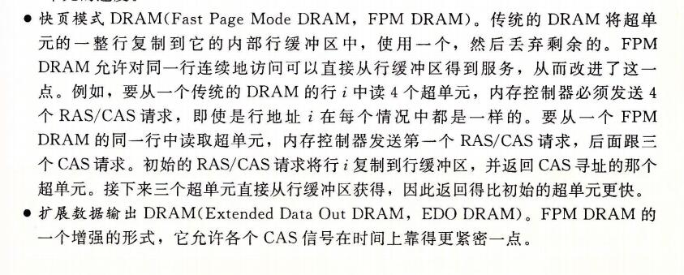

## 存储器层次结构

```
到目前为止，在对系统的研究中，我们依赖于一个简单的计算机系统模型，cpu 执行指令，而存储器系统为cpu 存放指令和数据。在简单模型中，存储器系统时一个线性的字节数组，而CPu 能够在一个常数时间内访问每个 存储器位置。虽然迄今为止这都是一个有效的模型，但是它没有反映现代系统实际工作的方式。
```

```
实际上，存储器系统(memory system)是一个具有不同容量、成本和访问时间的存储设备的层次结构。CPU 寄存器保存着最常用的数据。靠近CPU的小的、快速的高速缓存存储器(cache memory)缓存着 相对慢速的主存储器(main memory)中数据和指令的缓冲区域。
主存缓存存储这 容量较大的、慢速的磁盘上的数据，
而这些磁盘常常又作为存储在通过网络连接的其他机器的磁盘或磁带上的数据的缓冲区域。
```

```
存储器层次结构是可行的，这是因为与下一个更低层次的存储设备相比来说，一个编写良好的程序倾向于更频繁的访问某一个层次上的存储设备。
所以，下一层的存储设备可以更慢一点，也因此可以更大，每个比特位更便宜。整体效果是一个大的存储器池，其成本与层次结构底层最便宜的存储设备相当，但是却以接近于层次结构顶部存储设备的高速率向程序提供数据。
```

```
作为一个程序员，你需要理解存储器层次结构，因为它对应用程序的性能有着巨大的影响。如果你的程序需要的数据是存储在 CPU 寄存器中的，那么在指令的执行期间，在0个周期内就能访问到它。
如果存储在高速缓存中，需要4~75个周期。
如果存储在主存中，需要上百个周期。
而如果存储在磁盘上，需要大约几千万个周期。
```

```
这里就是计算机系统中一个基本而持久的思想：
如果你理解了系统时如何将数据在存储器层次结构中上上下下移动的，那么你就可以编写自己的应用程序，使得它们的数据项存储在层次结构中较高的地方，在那里CPU能更快的访问到它们。
```

```
这个思想围绕着计算机程序的一个称为局部性(locality)的基本属性。具有良好局部性的程序倾向于一次又一次地访问相同的数据项集合，或是倾向于访问邻近的数据项集合。
具有良好局部性的程序比局部性差的程序更多的倾向于从存储器层次结构中较高的层次处访问数据项，因此运行的更快。
```

```
在本章中，我们会看看基础的存储技术 - SRAM 存储器、DRAM 存储器、ROM存储器以及旋转的和固态的硬盘 -- 并描述它们是如何被组织成层次结构的。特别的，我们将注意力集中在高速缓存存储器上，它是作为CPU和主存之间的缓存区域，因为它们对应用程序性能的影响最大。
我们向你展示如何分析C程序的局部性，并且介绍改进你的程序中局部性的技术。
你还会学到一种描绘某台机器上存储器层次结构的性能的有趣方法，称为"存储器山(memory mountain)",它展示出读访问时间是局限性的一个函数。
```

## 1、存储技术

```
计算机技术的成功很大程度上源自于存储技术的巨大进步。早期的计算机只有几千字节的随机访问存储器。
```

### 1、随机访问存储器

```
随机访问存储器(Random-Access Memory,RAM)分为两类：
	静态的和动态的。
静态的RAM(SRAM)比动态(DRAM dynamic) 更快，但也贵得多。
SRAM用来作为高速缓存存储器，既可以在CPU芯片上，也可以在片下。

DRAM(dynamic Random-Access Memory) 用来作为主存以及图形系统的帧缓冲区。
典型的，一个桌面系统的 SRAM 不会超过几兆字节，但是 DRAM 却有几百或几千兆字节。
```

#### 1、静态RAM

```
SRAM 将每个位存储在一个双稳态的(bistable)存储器单元里。每个单元使用一个六晶体管电路来实现的。
这个电路有这样一个属性，它可以无限期地保持在两个不同的电压配置(configuration)或状态(state)之一。其他任何状态都是不稳定的 -- 从不稳定状态开始，电路会迅速地转移到两个稳定状态中的一个。这样一个存储器单元类似于图6-1中画出的倒转的钟摆。
```


```
当钟摆倾斜到最左边或最右边时，它是稳定的。从其他任何位置，钟摆都会倒向一边或另一边。
原则上，钟摆也能在垂直的位置无限期地保持平衡，但是这个状态是 亚稳态的(metastable) -- 最细微的扰动也能使它倒下，并且一旦倒下就永远不会再恢复到垂直的位置。

由于SRAM 存储器单元的双稳态特性，只有有电，它就会永远的保持它的值。即使有干扰(例如电子噪音)来扰乱电压，当干扰消除时，电路就会恢复到稳定值。
```

#### 2、动态RAM

```
DRAM 将每个位存储为对一个电容的充电。这个电容非常小，通常只有大约30毫微微法拉(femtofarad) -- 30*10^-15 法拉。不过，回想一下法拉是一个非常大的计量单位。
DRAM 存储器可以知道的非常密集 -- 每个单元由一个电容和一个访问晶体管组成。
但是，与SRAM不同，DRAM存储器单元对干扰非常敏感。
当电容的电压被扰乱之后，它就永远不会恢复了。
暴露在 光线下会导致电容电压改变。实际上，数码照相机和摄像机中的传感器本本质上就是DRAM单元的阵列。
```

```
很多原因会导致漏电，使得 DRAM 单元在 10~100毫秒时间内失去电荷。
幸运的是，计算机运行的时钟周期是以纳秒来衡量的，所以相对而言这个保持时间是比较长的。
内存系统必须周期性的通过读出，然后重写来刷新内存每一位。
有些系统也使用纠错码，其中计算机的字会被多编码几个位(例如64位的字可能用来72位来编码)，这样一来，电路可以发现并纠正一个字中任何单个的错误位。
```


```
图6-2 总结了SRAM 和 DRAM 存储器的特性，只要有供电，SRAM就会保持不变。
与DRAM不同，它不需要刷新。
SRAM的存取比DRAM快。
SRAM对诸如光和电噪声这样的干扰不敏感。
代价是SRAM单元和DRAM单元使用更多的晶体管，因而密集度低，而且更贵，功耗更大。
```


#### 3、传统的DRAM

```
DRAM 芯片中的单元(位)被分成 d 个超单元(supercell),每个超单元都由 w 个 DRAM 单元组成。一个 d*w 的DRAM总共存储了 dw 位信息。
超单元被组成一个 r 行 c 列的长方形阵列，这里 rc = d.
每个超单元有形如(i,j)的地址，这里i表示行，而j表示列。
```


```
例如，图6-3展示的是一个16*8 的DRAM芯片的组织，有d=16个超单元，每个超单元有
w = 8 位，r=4行，c=4列。
带阴影的方块表示地址(2,1)处的超单元。信息通过称为 引脚(pin) 的外部连接器流入和流出芯片。
每个引脚携带一个1位的信号。
图6-3给出了两组引脚：
	8个data引脚，它们能传送一个字节到芯片或芯片传出一个字节，以及2个addr引脚，它们携带2位的行和列超单元地址。
	其他携带控制信息的引脚没有显示出来。
```

```
旁注： 关于术语的注释
	存储领域从来没有为 DRAM 的阵列元素确定一个标准的名字。计算机架构师倾向于称之为"单元"，使这个术语具有 DRAM 存储单元之意。电路设计者倾向于称之为"字"，使之具有主存一个字之意。为了避免混淆，我们采用无歧义的术语"超单元"。
```


```
每个DRAM 芯片被连接到某个称为"内存控制器(memory controller)"的电路，这个电路可以一次传送 w 位到每个 DRAM 芯片或一次从每个 DRAM 芯片传出 w 位。

为了读出超单元(i,j)的内容，内存控制器将行地址 i 发送到 DRAM, 然后是列地址 j. 
DRAM 把超单元(i,j)的内容发回给控制器作为响应。
行地址i称为 RAS(row access strobe,行访问选通脉冲)请求。
列地址j称为 CAS(column access strobe,列访问 选通脉冲)请求。

主要RAS CAS 请求共享相同的 DRAM 地址引脚。
```


```
例如，要从图6-3中 16*8 的DRAM 中读出超单元(2,1)，内存控制器发送行地址2，如图6-4a 所示。DRAM的响应是将行2的整个内容都复制到一个内部行缓冲区。
接下来，内存控制器发送到列地址1，如图6-4b所示。
DRAM 的响应是从行缓冲区复制到超单元(2,1)中的8位，并把它们发送到内存控制器。
```

```
电路设计者将 DRAM 组织成二维阵列而不是线性数组的一个原因是降低芯片上地址引脚的数量。
如果示例的128位DRAM被组织成一个16超单元的线性数组，地址为0~15，那么芯片会需要4个地址引脚而不是2个。二维阵列组织的缺点是必须分两步发送地址，这增加了访问时间。
```

#### 4、内存模块

```
DRAM 芯片封装在内存模块(memory module)中，它插到主板的扩展槽上。Core i7 系统使用的240个引脚的 双列直插内存模块(Dual Inline Memory Module, DIMM), 它以64位为块传送数据到内存控制器和从内存控制器传出数据。
```



```
图6-5 展示了一个内存模块的基本思想。示例模块用 8 个 64 Mbit 的8M*8 的 DRAM 芯片，总共存储64MB(兆字节)，这8个芯片编号为0~7.
每个超单元存储主存的一个字节，而用相应超单元地址为(i,j)的8个超单元来表示主存中字节地址A处的64位字。一个字分别存储在8个DRAM片里面。
在 图6-5 的示例中，DRAM 0 存储第一个(低位)字节，DRAM1 存储下一个字节，依此类推。
```

```
要取出内存地址A处的一个字，内存控制器将A转换成一个超单元地址(i,j),并将它发送到内存模块，然后内存模块再将i和j广播到每个 DRAM。作为响应，每个DRAM输出它的(i,j)超单元的8位内容。模块中的电路收集这些输出，并把它们合并成一个64位的字，再返回给内存控制器。
```

```
通过将多个内存模块连接到内存控制器，能够聚合成主存。在这种情况中，当控制器收到一个地址A时，控制器选择包含A的模块k,然后将A转换成它的(i,j)的形式，并将(i,j)发送到模块k.
```


#### 5、增强的DRAM

```
有许多种 DRAM 存储器，而生产厂商试图跟上迅速增长的处理器速度，市场上就会定期推出新的种类。每种都是基于传统的DRAM单元，并进行一些优化，提高访问基本DRAM单元的速度。
```




#### 6、非易失性存储器

```
如果断电，DRAM 和 SRAM 会丢失它们的信息，从这个意义上来说，它们是易失的(volatile). 另一方面，非易失性存储器(nonvolatile memory)即使是在关电后，仍然保存着它们的信息。

现在有很多种非易失性存储器。
由于历史原因，虽然ROM中有的类型既可以读也可以想写，但是它们整体上都被称为只读存储器(Read-Only Memory,ROM).
ROM是以它们能够被重编程(写)的次数和对它们进行重编程所用的机制来区分的。
```

```
PROM(Programmable ROM,可编程的ROM)只能被编程一次。PROM的每个存储器单元有一种熔丝(fuse),只能用高电流熔断一次。
```

```
可擦写可编程ROM(Erasable Programmable ROM, EPROM)有一个透明的石英窗口，允许光到达存储单元。紫外线光照射过窗口，EPPROM 单元就被清除为0。
对EPROM编程是通过使用一种把1写入 EPROM 的特殊设备来完成的。
EPROM 能够被擦除和重编程的次数的数量级可以达到1000次。

电子可擦除PROM(Electrically Erasable PROM, EEPROM)类似于EPROM,但是它不需要一个物理上独立的编程设备，因此可以直接在印制电路卡上编程。
EEPROM 能够被编程的次数的数量级可以达到 10^5 次。
```

```
闪存(flash memory)是一类非易失性存储器，基于EEPROM,它已经成为了一种重要的存储技术。
闪存无处不在，为大量的电子设备提供快速而持久的非易失性存储，包括数码相机、手机、音乐播放器、PDA和笔记本、台式机和服务器计算机系统。
在6.1.3节中，我们会仔细研究一种新型的基于闪存的磁盘驱动器，称为固态硬盘(Solid State Disk, SSD),它能提供相对传统旋转磁盘的一种更快速、更强健和更低能耗的选择。
```

```
存储在ROM设备中的程序通常被称为固件(firmware)。当一个计算机系统通电以后，它会运行存储在 ROM 中的固件。一些系统在固件中提供了少量基本的输入和输出函数 --例如PC的BIOS(基本输入/输出系统)例程。复杂的设备，像图像卡和磁盘驱动控制器，也依赖固件翻译来自 CPU 的I/O(输入/输出)请求。
```


