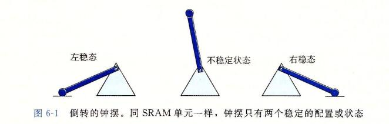

## 存储器层次结构

```
到目前为止，在对系统的研究中，我们依赖于一个简单的计算机系统模型，cpu 执行指令，而存储器系统为cpu 存放指令和数据。在简单模型中，存储器系统时一个线性的字节数组，而CPu 能够在一个常数时间内访问每个 存储器位置。虽然迄今为止这都是一个有效的模型，但是它没有反映现代系统实际工作的方式。
```

```
实际上，存储器系统(memory system)是一个具有不同容量、成本和访问时间的存储设备的层次结构。CPU 寄存器保存着最常用的数据。靠近CPU的小的、快速的高速缓存存储器(cache memory)缓存着 相对慢速的主存储器(main memory)中数据和指令的缓冲区域。
主存缓存存储这 容量较大的、慢速的磁盘上的数据，
而这些磁盘常常又作为存储在通过网络连接的其他机器的磁盘或磁带上的数据的缓冲区域。
```

```
存储器层次结构是可行的，这是因为与下一个更低层次的存储设备相比来说，一个编写良好的程序倾向于更频繁的访问某一个层次上的存储设备。
所以，下一层的存储设备可以更慢一点，也因此可以更大，每个比特位更便宜。整体效果是一个大的存储器池，其成本与层次结构底层最便宜的存储设备相当，但是却以接近于层次结构顶部存储设备的高速率向程序提供数据。
```

```
作为一个程序员，你需要理解存储器层次结构，因为它对应用程序的性能有着巨大的影响。如果你的程序需要的数据是存储在 CPU 寄存器中的，那么在指令的执行期间，在0个周期内就能访问到它。
如果存储在高速缓存中，需要4~75个周期。
如果存储在主存中，需要上百个周期。
而如果存储在磁盘上，需要大约几千万个周期。
```

```
这里就是计算机系统中一个基本而持久的思想：
如果你理解了系统时如何将数据在存储器层次结构中上上下下移动的，那么你就可以编写自己的应用程序，使得它们的数据项存储在层次结构中较高的地方，在那里CPU能更快的访问到它们。
```

```
这个思想围绕着计算机程序的一个称为局部性(locality)的基本属性。具有良好局部性的程序倾向于一次又一次地访问相同的数据项集合，或是倾向于访问邻近的数据项集合。
具有良好局部性的程序比局部性差的程序更多的倾向于从存储器层次结构中较高的层次处访问数据项，因此运行的更快。
```

```
在本章中，我们会看看基础的存储技术 - SRAM 存储器、DRAM 存储器、ROM存储器以及旋转的和固态的硬盘 -- 并描述它们是如何被组织成层次结构的。特别的，我们将注意力集中在高速缓存存储器上，它是作为CPU和主存之间的缓存区域，因为它们对应用程序性能的影响最大。
我们向你展示如何分析C程序的局部性，并且介绍改进你的程序中局部性的技术。
你还会学到一种描绘某台机器上存储器层次结构的性能的有趣方法，称为"存储器山(memory mountain)",它展示出读访问时间是局限性的一个函数。
```

## 1、存储技术

```
计算机技术的成功很大程度上源自于存储技术的巨大进步。早期的计算机只有几千字节的随机访问存储器。
```

### 1、随机访问存储器

```
随机访问存储器(Random-Access Memory,RAM)分为两类：
	静态的和动态的。
静态的RAM(SRAM)比动态(DRAM dynamic) 更快，但也贵得多。
SRAM用来作为高速缓存存储器，既可以在CPU芯片上，也可以在片下。

DRAM(dynamic Random-Access Memory) 用来作为主存以及图形系统的帧缓冲区。
典型的，一个桌面系统的 SRAM 不会超过几兆字节，但是 DRAM 却有几百或几千兆字节。
```

#### 1、静态RAM

```
SRAM 将每个位存储在一个双稳态的(bistable)存储器单元里。每个单元使用一个六晶体管电路来实现的。
这个电路有这样一个属性，它可以无限期地保持在两个不同的电压配置(configuration)或状态(state)之一。其他任何状态都是不稳定的 -- 从不稳定状态开始，电路会迅速地转移到两个稳定状态中的一个。这样一个存储器单元类似于图6-1中画出的倒转的钟摆。
```




