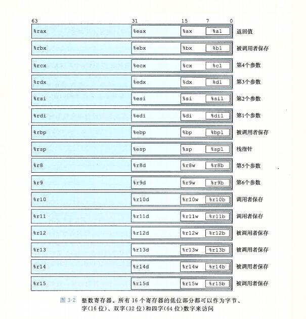
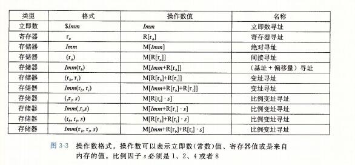
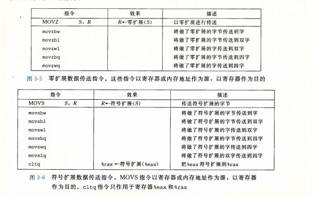
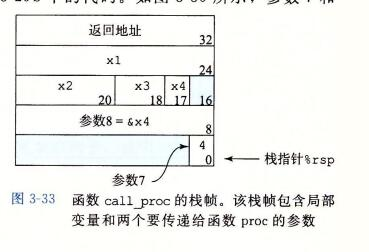

**程序的机器级表示**

## 小端大端

```
Java是平台无关的，默认是大端。在网络上传输数据普遍采用的都是大端。
```

### 小端

```
所谓的小端模式(little-endian),是指数据的高字节保存在内存的高地址中，而数据的低字节保存在内存的低地址中，这种存储模式将地址的高低和数据位权有效的结合起来，高地址部分权值高，低地址部分权值低，和我们的逻辑方法一致。
```

```
例子：
0000430: e684 6c4e 0100 1800 53ef 0100 0100 0000
0000440: b484 6c4e 004e ed00 0000 0000 0100 0000

在小端模式下，前32位应该这样读: 4e 6c 84 e6( 假设int占4个字节)
记忆方法: 地址的增长顺序与值的增长顺序相同
```

### 大端

```
所谓的大端模式(big-endian)，是指数据的高字节，保存在内存的低地址中，而数据的低字节，保存在内存的高地址中，这样的存储模式有点儿类似于把数据当作字符串顺序处理：地址由小向大增加，而数据从高位往低位放。
```


## 1、历史观点

```
计算机执行机器代码，用字节序列编码低级的操作，包括处理数据、管理内存、读写存储设备上的数据，以及利用网络通信。编译器基于编程语言的规则、目标机器的指令集合操作系统遵循的惯例，经过一系列的阶段生成机器代码。 GCC C语言编译器以汇编代码的形式产生输出，汇编代码生成可执行的机器代码。在本章中，我们会近距离地观察机器代码，以及人类可读的表示-汇编代码。

当我们用高级语言编程的时候(例如：C语言，java)，机器屏蔽了程序的细节，即机器级的实现。与此相反，当用汇编代码编程的时候(就像早期的计算)，程序员必须使用指定的程序用来执行计算的低级指令。高级语言提供的抽象级别比较高，大多数时候，在这种抽象级别上工作效率会更高，也更可靠。编译器提供的类型检查能帮助我们发现许多程序错误，并能够保证按照一致的方式来引用和处理数据。通常情况下，使用现代的优化编译器产生的代码至少与一个熟练的汇编语言程序员手工编写的代码一样有效。最大的优点是，用高级语言编写的程序可以在很多不同的机器上编译和执行，而汇编代码则是与特定机器密切相关的。

```

## 2、程序编码

```
计算机系统使用了多种不同形式的抽象，利用更简单的抽象模型来隐藏实现的细节。对于机器级编码来说，其中两种抽象尤为重要。
第一种是由 指令集体系结构或指令集架构· Instruction Set Architecture 来定义机器级程序和格式和行为，它定义了处理器状态、指令的格式，以及每条指令对状态的影响。大多数ISA,包括x86-64,将程序的行为描述成好像每条指令都是按顺序执行的，一条指令结束后，下一条再开始。处理器的硬件远比描述的精细复杂，他们并发的执行许多指令，但是可以采取措施保证整体行为与ISA指定的顺序执行的行为完全一致。

第二个抽象是，机器级程序使用的内存地址时虚拟地址，提供的内存模型看上去是一个非常大的字节数组。存储器系统的实现实现是将多个硬件存储器和操作系统组合起来。
```

```
在整个编译过程中，编译器会完成大部分的工作，将把用C语言提供的相对比较抽象的执行模型表示的程序转化成处理器执行的非常基本的指令。汇编代码表示非常接近于机器代码。于机器代码的二进制格式项目，汇编代码的主要特点是它用可读性更好的文本格式表示。
```

```
程序计数器(通常称为"pc"，在x86-64中用 %rip 表示)，给出将要执行的下一条指令在内存中的地址。

整数寄存器文件包括16个命名的位置，分别存储64位的值。这些寄存器可以存储地址(对应于C语言的指针)或整数数据。有的寄存器被用来记录某些重要的程序状态，而其他的寄存器用来保存临时数据，例如过程的参数和局部变量，以及函数的返回值。

条件码寄存器保存着最近执行的算术或逻辑指令的状态信息。它们用来实现控制或数据流中的条件变化，比如说用来实现if和 while 语句。

一组向量寄存器可以存放一个或者多个整数或浮点数值。
```

```
虽然C语言提供了一种模型，可以再内存中声明和分配各种数据类型的对象，但是机器代码只是简单地将内存看成一个很大的、按字节寻址的数组。C语言中的聚合数据类型，例如数组和结构，在机器代码中用一组连续的字节来表示。即使是对标量数据类型，汇编也不区分有符号和无符号整数，不区分各种类型的指针，甚至于不区分指针和整数。
```

```
程序内存包含：程序的可执行机器代码，操作系统需要的一些信息，用来管理过程调用和返回的运行时栈，以及用户分配的内存块(比如用 malloc 库函数分配的)。正如前面提到的，程序内存用虚拟地址来寻址。在任意给定的时刻，只有有限的一部分虚拟地址被认为是合法的。例如：x86-64的虚拟地址是由64位的字来表示的。在目前的实现中，这些地址的高16位必须设置为0，所以一个地址实际上能够指定的是 2^48 或 64TB 范围内的一个字节。操作系统负责管理虚拟地址空间，将虚拟地址翻译成实际处理器内存中的物理地址。
```

## 3、数据格式

```
由于是从16位体系结构扩展成32位,Intel用术语"字(word)"表示16位数据类型。因此，称32位数为"双字(double words 或 long words)"，称64位数为"四字(quad words)". 标准 int 值存储为双字(32位)。指针(在此用 char * 表示)存储为8字节的四字，64位机器本就预期如此。
```


```
浮点数主要有两种形式:单精度(4字节)值，对应于C语言数据类型float;双精度(8字节)值，对应于C语言数据类型double.x86家族的微处理器历史上实现过对一种特殊的80位(10字节)浮点格式进行全套的浮点运算。

大多数GCC生成的汇编代码指令都有一个字符的后缀，表明操作数的大小。例如：数据传送指令有四个变种：movb传送字节  movw传送字 movl传送双字 movq传送四字。

汇编代码 也用浮点数 l 来表示 double .这不会产生歧义，因为浮点数使用的是一组完全不同的指令和寄存器。
```


## 4、访问信息

```
一个x86-64的中央处理单元(CPU)包含一组16个存储64位值得通用目的寄存器。这些寄存器用来存储整数数据和指针。图3-2显示了这16个寄存器。他们的名字都以%r开头，不过后面还跟着一些不同命名规则的名字，这是由于指令集历史演化造成的。
```



```
指令可以对这16分寄存器的地位字节中存放的不同大小的数据进行操作。字节级操作可以访问最低的字节，16位操作可以访问最低的2个字节，32位操作可以访问最低的4个字节，而64位操作可以访问整个寄存器。

在后面的章节中，我们会展现很多指令，复制和生成1字节、2字节、4字节和8字节值。当这些指令以寄存器作为目标时，对于生成小于8字节结果的指令，寄存器中剩下的字节会怎么样，对此有两条规则：生成1字节和2字节数字的指令会保持剩下的字节不变；生成4字节数字的指令会把高位4个字节置为0.后面这条规则是作为从IA32到x86-64的扩展的一部分而采用的。

其中最特别的是栈指针 %rsp ，用来指明运行时栈的结束位置。有些程序会明确的读写这个寄存器。另外15个寄存器的用法更灵活。少量指令会使用某些特定的寄存器。更重要的是，有一组标准的编程规范控制着如何使用寄存器来管理栈、传递函数参数、从函数的返回值，以及存储局部和临时数据。
```

### 1、操作数指示符

```
大多数指令有一个或多个操作指令数(operated),指示出执行一个操作中要使用的源数据值，以及放置结果的目的的位置。x86-64支持多种操作数格式。源数据值可以以常数形式给出，或是从寄存器或内存中读出。结果可以存放在寄存器或内存中。因此，各种不同的操作数的可能性被分为三种类型。
第一种类型是立即数(immediate),用来表示常数数值。在ATT格式的汇编代码中，立即数的书写方式是“$”后面跟一个用标准C表示法表示的整数，比如：$-577或$0x1F。

第二种类型是寄存器register 它表示某个寄存器的内容，16个寄存器的低位1字节、2字节、4、8字节中的一个作为操作数， 我们用符号 r(a) 来表示任意寄存器a, 用引用 R[r(a)] 来表示它的值，这是将寄存器集合看成一个数组 R，用寄存器标识符作为索引。

第三类操作数是内存引用，它会根据计算出来的地址(通常称为有效地址)访问某个内存位置。因为将内存看成一个很大的字节数组，我们用符号M(b)[Addr] 表示对存储在内存中从地址 Addr 开始的 b 个字节值 的引用。
```

### 寻址

```
表中底部用语法 Imm(r1,r2,s)表示的是最常见的形式。这样的引用有四个组成部分：一个立即数偏移Imm,一个基址寄存器r1,一个变址寄存器r2和一个比例因子s,这里s必须是1、2、4或者8.基址和变址寄存器都必须是64位寄存器。有效地址被计算为 Imm+R[r1]+R[ri]*s 。引用数组元素时，会用到这种通用形式。当引用数组和结构元素时，比较复杂的寻址模式是很有用的。
```




### 2、数据传送指令

```
mov 指令的
源操作数指定的值是一个立即数，存储在寄存器或者内存中。或者 $直接标记的
目的操作数指定一个位置，要么是一个寄存器或者要么是一个内存地址。

x86-64加了一条限制，传送指令的两个操作数不能都指向内存位置。（$不算内存位置， 可以当做寄存器给 mov 指令定义大小）

寄存器部分的大小必须与指令最后一个字符 (b,w,l,q) 指定的大小匹配。

大多数情况中，mov 指令只会更新目的操作数指定的那些寄存器字节或内存位置。唯一的例外是 movl 指令以寄存器作为目的时，它会把寄存器的高位4字节设置为0.

movabsq 是将$8字 8字的立即数 传送到寄存器里面
一般指令不可以传送 8字的立即数
```





### 3、压入和弹出栈数据

```
最后两个数据传送操作可以将数据压入程序栈中，以及从程序栈中弹出数据，正如我们将看到的，栈 在处理过程调用中起到至关重要的作用。栈是一种数据结构，可以添加或者删除值，不过要遵循"后进先出"的原则。通过push操作把数据压入栈中，通过pop操作删除数据；它具有一个属性：弹出的值永远是最近被压入而且仍然才栈中的值。
栈向下增长，这样一来，栈顶元素的地址是所有栈中元素地址最低的。(按照惯例，我们的栈是倒过来画的，栈"顶"在图的底部。)栈指针 %rsp 保存着栈顶元素的地址。
```


```
push
	sub $8 %rsp
	movq %rbp,(%rsp)
	
pop 
	movq (%rsp) %rax
	add $8 %rsp
```


## 5、算术和逻辑操作


```
NEG  NOT 
negative  not

求反 和 求补(不管是正数负数都要 取反 + 1)
的存在的必要性

求补运算是种运算，这种运算是由补码的转换过程升级而来。
有了补码，为什么还要提出求补运算这种新的运算？
要理解求补运算的提出原因，还要从补码说起。

求补运算的运算法则：将一个数（包括正数和负数）所有二进制位（包括符号位和数值位）取反，然后在最低位加上1。

求补运算的适用范围：将减法运算转换为加法运算，而且只能进行这类的运算转换。

求补运算的触发条件：遇到主动给定的减法运算符。比如遇到汇编语言中的SUB，SBB指令。
触发条件必须人为给出，毕竟计算机只是机器，它只做你编程安排好的事，不可能做仅仅在你心中所想的事。

求补运算的转换过程：遇到减法运算符，马上将减法运算符右边数据转换成其补码形式，然后将减法运算符左边的数据加上前面所得的补码形式。例如 3-(2*1) 3-2 00000011(-)00000010 00000011(+)11111110
结果为100000001，最高位第8位自动丢弃变成00000001 ，(-)这里是运算符不再当成数的符号，这是由指令中直接给出的mov ax,3 mov bx,2 sub ax,bx。

例如 5-(-9/3) 5-(-3) 00000101(-)11111101 00000101(+)00000011结果为00001000十进制的8。

求补运算的正确性是如何得到保障的：将运算符当成负号处理了。A-(B)变为A+(-B)，问题是如何用B表示-B，而补码编码刚好能正确地实现这种表达方式。求补运算的正确性是由补码码制的正确性来保障的。
```


### 1、加载有效地址

```
加载有效地址(load effective address)指令 leaq 实际上是movq指令的变形。它的指令形式是从内存读数据到寄存器，但实际上它根本就没有引用内存。它的第一个操作数看上去是一个内存引用，但该指令并不是从指定的位置读入数据，而是将有效地址写入到目的操作数。
```


```
为什么不直接 leaq(,%rdx,12) 呢 ，因为 s 比例因子s,这里s必须是1、2、4或者8
只能是 1,2,4,8
所以必须分开。
```


### 2、一元和二元操作

```
第二组中的操作是一元操作，只有一个操作数，既是源又是目的。这个操作数可以是一个寄存器，也可以是一个内存位置。比如说，指令 incq (%rsp) 会使栈顶的8字节元素加一。

第三组是二元操作，其中，第二个操作数既是源又是目的。
如 subq %rax, %rdx 使寄存器 %rdx 的值减去 %rax 中的值。（将指令解读成 "从 %rdx 中减去 %rax "会有所帮助）

第一个操作数可以是立即数、寄存器或是内存位置。
第二个操作数可以是寄存器或者是内存位置。

注意，当第二个操作数为内存地址时，处理器必须从内存读出值，执行操作，再把结果写回内存。
```

### 3、移位操作

```
最后一组是移位操作，先给出移位量，然后第二项给出的是要移位的数。可以进行算术和逻辑右移。移位量可以是一个立即数，或者放在单字节寄存器 %cl 中。(这些指令很特别，因为只允许以这个特定的寄存器作为操作数)原则上来说，1个字节的移位量使得移位量的编码范围可以达到 2^8 - 1 = 255. x86-64 中， 移位操作对 w 位长的数据值进行操作，移位量是由 %cl 寄存器的低 m 位决定的，这里 2^m = w. 高位会被忽略。所以，例如当寄存器 %cl 的十六进制值为 0xFF 时，指令 salb 会移 7 位，salw 会移 15位 ， sall 会移31位， 而 salq 会移动63位。
```

```
 左移指令有两个名字： SAL 和 SHL 。A代表算术左移  arithmetic  H表示逻辑左移  shift arithmetic left .
 
 SAL 和 SHL 两者的效果是一样的，都是将右边填上 0.右移指令不同，SAR执行算术位移(填上符号位)，而 SHR 执行逻辑位移(填上 0)。移位操作的目的操作数可以是一个寄存器或是一个内存位置。
 
```


### 4、特殊的算术操作

```
两个 64 位有符号或无符号整数相乘得到的乘积需要 128 位来表示。x86-64 指令集对 128 位(16字节)数的操作提供了有限的支持。延续字(2字节)、双字、四字的命名惯例，Intel 吧 16字节的数称为 八字(oct word). 下图描述的是支持产生两个 64 位数字的全 128 位乘积以及整数除法的指令。
```


```
imulq 指令有两种不同的形式。其中一种，是 "双操作数" 乘法指令。它从两个 64 位操作数产生一个 64 位乘积。

此外，x86-64 指令还提供了两条不同的 "单操作数" 乘法指令，以计算两个 64 位值的全 128 位乘积 -- 一个是无符号数乘法 mulq,  而另一个是一个补码乘法(imulq).
这两条指令都要求一个参数必须在寄存器 %rax 中，而另一个作为指令的源操作数给出。然后乘积存放在寄存器 %rdx(高64位)和%rax(低64位)中。虽然 imulq 这个名字可以用于两个不同的乘法操作，但是汇编器能够通过计算操作数的数目，分辨出想用哪条指令。
```


```
可以观察到，存储乘积需要两个 movq 指令： 一个存储低 8 个字节(第4行)，一个存储高 8 个字节(第5行)。由于生成这段代码针对的是小端法机器，所以高位字节存储在大地址，正如地址8(%rdi)表明的那样。
```


```
前面的算术运算表没有列出除法或取模操作。这些操作是由单操作数除法指令来提供的，类似于单操作数乘法指令。有符号除法指令 idivl 将寄存器 %rdx（高64位 寄存器里面代表第三个参数）。和 %rax (低64位 寄存器里面代表返回值)。中的 128 位数作为被除数，而除数作为指令的操作数给出。指令将商存储在寄存器%rax 中，将余数存储在寄存器 %rdx 中。

对于大多数 64 位除法应用来说，除数也常常是一个 64 位的值。这个值应该存放在 %rax 中， %rdx 的位应该设置为 0(无符号运算)或者%rax 的符号位(有符号运算)。后面这个操作可以用指令 cqto 来完成。这条指令不需要操作数 -- 它隐含读出 %rax 的符号位，并将它复制到 %rdx 的所有位. 
```


## 6、控制

### 1、条件码

```
除了整数寄存器，CPU还维护着一组单个位的条件码(condition code) 寄存器，它们描述了最近的算术或逻辑操作的属性。可以检测到这些寄存器来执行条件分支指令。最常用的条件码有：
	CF: 进位标志。最近的操作使最高位产生了进位。可用来检查无符号操作的溢出。
	ZF: 零标志。最近的操作得到的结果为 0
	SF：符号标志。最近的操作得到的结果为负数。
	OF: 溢出标志。
	
CF  carry bit 进位
ZF  ZERO 
SF  SIGN 符号
OF  overflow 溢出
```


```
leaq 指令不改变任何条件码，因为它是用来进行地址计算的。除此之外，图3-10(就是算术指令)。的所有指令都会设置条件码。对于逻辑操作，例如 XOR(^异或)，进位标志和溢出标志会设置成 0。对于移位操作，进位标志将设置为最后一个被移出的位，而溢出的标志设置为 0 。 INC 和 DEC 指令会设置溢出和零标志，但是不会改变进位标志。
```


### 2、CMP 和 TEST 指令


```
除了图 3-10中(算术指令)会设置条件码，还有两类指令(有 8、16、32、64位形式)，它们只设置条件码而不改变任何其他寄存器;

CMP 指令根据两个操作数之差来设置条件码。
除了只设置条件码而不更新目的寄存器之外， CMP 指令与 SUB 指令的行为是一样的。
如果两个操作数相等，这些指令会将零标志设置为 1， 而其他标志可以用来确定两个操作数之间的大小关系。

TEST 指令的行为和 AND 指令一样，除了他们只设置条件码而不改变目的寄存器的值。
典型的用法是，两个操作数是一样的(例如，testq %rax,%rax 用来检查 %rax 是负数，零还是 正数)，或其中的一个操作数是一个掩码，用来指示哪些位应该被测试。
```


### 3、访问条件码

```
条件码通常不会直接读取，常用的使用方法有三种：
1、可以根据条件码的某种组合，将一个字节设置为 0 或者 1

2 可以条件跳转到程序的某个其他的部分。

3、可以有条件的传送数据

对于第一种情况，图3-14中描述的指令根据条件码的某种组合，将一个字节设置为 0 或者 1. 
我们将这一类指令成为 SET 指令; 它们之间的区别就在于它们考虑的条件码的组合是什么，这些指令名字的不同后缀指明了它们所考虑的条件码的组合。
这些指令的后缀表示不同的条件而不是操作数的大小，了解这一点很重要。

例如：指令 setl 和 setb 表示"小于时设置(set less)" 和 "低于时设置(set below)".

一条 SET 指令的目的操作数是低位单字节寄存器元素之一，或是一个字节的内存位置，指令会将这个字节设置成 0 或者 1。为了得到一个 32位 或 64位结果，我们必须对高位清零。
```


```
sete /setz  ZF 1 就是 0
setne/ setnz ~ZF 就是相反

sets SF 符号位是负数就为 1 
setns ~SF 取反

setg/setnle (greater 较大的 less较小的) 大于(有符号大于)
	~(SF^OF)& ~ZF  ~ZF 不等于 0;
	~(SF^OF) 溢出就取反，没有溢出就取 SF ，然后取反，就是大于
	
	greater 大于
	less  小于
	above 超过
	below 低于
```


### 4、跳转指令

```
正常的情况下，指令按照它们出现的顺序一条一条的执行。跳转(jump)指令会导致执行切换到程序中一个全新的位置。在汇编代码中，这些跳转的目的地通常用 一个(label) 指明。
```


### 5、跳转指令的编码

```
虽然我们不关心机器代码格式的细节，但是理解跳转指令的目标如何编码，这对第 7 章研究链接非常重要。此外，它也能帮助理解反汇编器的输出。在汇编代码中，跳转目标用符号标号书写。汇编器，以及后来的连接器，会产生挑战目标的适当编码。跳转指令有几种不同的编码，但是最常用都是 PC 相对的(PC-relative).

也就是，它们会将
目标指令的地址与
紧跟在跳转指令后面那条指令的地址
之间的才差作为编码

这些地址偏移量可以编码为 1、2或4个字节。第二种编码方法是给出"绝对"地址，用4个字节直接指定目标。汇编器和连接器会选择适当的跳转目的编码。
```


### 6、用条件控制来实现条件分支

```
jmp 直接跳转 就是条件控制来实现的
```


### 7、用条件传送来实现条件分支

```
实现条件操作的传统方法是通过使用 控制的条件转移。当条件满足时，程序沿着一条执行路径执行，而条件不满足时，就走另一条路径。这种机制简单而通用，但是在现代处理器上，它可能会非常低效。

一种代替的策略就是使用 数据的条件转移。
控制的条件转移 就是转移 指令。
数据的条件转移 就是转移 数据。

数据的条件转移。这种方法计算一个条件操作的两种结果，然后再根据条件是否满足从中选取一个。只有在一些受限制的情况中，这种策略才可行，但是如果可行，就可以用一条简单的条件传送指令来实现它，条件传送指令更符合现在处理器的性能特性。我们将介绍这一策略，以及它在 x86-64 上的实现。
```


```
为了理解为什么 基于条件数据传送的代码  会比  基于条件控制转移的代码性能要好，我们必须了解一些关于现代处理器如何运行的知识。
处理器通过使用 流水线(pipelining)来获得高性能，在流水线中，一条指令的处理要经过一系列阶段，每个阶段执行所需操作的一小部分(例如,从内存取指令，确定指令类型，从内存读数据，执行算术运算，向内存写数据，以及更新程序计数器)。
这种方法通过重叠连续指令的步骤来获取高性能。

例如,在取一条指令的同时，执行它前面一条指令的算术运算。要做到这一点，要求能够事先确定要执行的指令序列，这样才能保持流水线中充满了待执行的指令。当机器遇到条件跳转(也称为"分支")时，只有当分支条件求值完成之后，才能决定分支往哪边走。
```


```
控制流的执行时间不依赖于数据。
无论数据是什么编译出来使用条件传送的代码所需的时间都是大概一样的。

控制流不依赖于数据，这使得处理器更容易保持流水线是满的。

condition omove equal
```


```
上图列举了x86-64 上一些可用的条件传送指令。每条指令都有两个操作数： 源寄存器
或者内存地址 S, 和目的寄存器 R。与不同的 SET 和跳转指令一样，这些指令的结果取决于条件码的值。

源值可以从内存或源寄存器中读取，但是只有在指定的条件满足时，才会被复制到目的寄存器。

源和目的的值可以是 16 位、32位或64位长。不支持单字节的条件传送。
```


```
无条件指令的操作数的长度显式的编码在指令名中(比如 movw 和 movl),

条件传送指令：
汇编器可以从目标寄存器的名字推断出 条件传送指令 的操作数长度，所以对所有的操作数长度，都可以使用同一个的指令名字。
```

```
 同条件跳转不同，处理器无需预测测试的结果就可以执行条件传送。
 条件跳转
 条件传送
 
 处理器只是读源值(可能是从内存中)，检查条件码，然后要么更新目的寄存器，要么保持不变。
```


```
使用条件传送也不总是会提高代码的效率。例如，条件传送的值需要大量计算，那么相对对应的条件不满足时，这些工作就白费了。

编译器必须考虑 
	浪费的计算
	和由于分支预测错误所造成的性能处罚
之间的相对性能。
```


### 8、循环

```
C语言中提供了多种循环结构，即 do-while、while 和 for.汇编中没有相应的指令存在，可以用条件测试和跳转组合起来实现循环的效果。 
```

#### do-while


#### while


#### for

```
和 while 一样
```


### 9、switch

```
 switch(开关)语句可以根据一个整数索引值进行多重分支(multiway branching).在处理具有多种可能结果的才测试时，这种语句特别有用。它们不仅提高了C代码的可读性，而且通过使用 跳转表(jump table)这种数据结构使得实现更加高效。
 
 跳转表是一个数组，表项 i 是一个代码段的地址，这个代码段实现当开关索引值等于 i 时程序应该才去的动作。
 程序代码用开关索引值来执行一个跳表内的数组引用，确定跳转指令的目标。
 
 和使用一组很长的 if-else 语句想比，使用跳转表的优点是执行开关语句的时间与开关情况的数量无关。 
 
 GCC 根据开关情况的数量和开关情况值的稀疏程度来翻译开关语句。
 
 当开关情况数量比较多(例如：4个以上)，并且值的范围跨度比较小时，就会使用跳转表。
```


```
上图是一个 C 语言 switch 语句的示例。这个例子有些非常有意思的特征，包括情况标号(case label) 跨过一个不连续的区域(对于情况101 和 105 没有标号)，有些情况有多个标号(情况104 和 106)， 而有些情况则会落入其他情况之中(情况102)，因为对应该情况的代码段没有以 break 语句结尾。
```

```
上图 b 图是 使用 GCC 提供的对跳转表的支持，这是对 C 语言的扩展。数组jt 包含7个表项，每个都是一个代码块的地址。这些位置有代码中的标号定义，在 jt 的表项中由代码指针指明，由标号加上"&&"前缀组成。(& 创建一个指向数据值的指针。 && 指向创建一个指向代码位置的指针)
```

```
原始的C代码有针对值 100、102、104、106情况。但是开关变量n可以是任意整数。编译器首先将 n 减去 100， 把取值范围移到0 和 6 之间，创建一个新的程序变量。

补码表示的负数会映射成无符号表示的大正数，利用这一事实，将 Index 看作无符号值，从而进一步简化了分支的可能性。
因此可以通过测试 index 是否大于 6 来判定 index 是否在 0~6 的范围之外。
```


```
执行 switch 语句的关键步骤是通过跳转表来访问代码位置。在第五行 jmp 指令的操作数有前缀"*", 表明这是一个间接跳转，操作数指定一个内存位置，索引有寄存器 &rsi 给出，这个寄存器保存着 index 的值。
```

```
在汇编代码中，跳转表用以下声明表示，我们添加了一些注释：
```


```
这些声明表明，在叫做".rodata"(只读数据，Read-Only-Data)的目标代码文件的段中，应该有一组 7 个"四"字(8个字节)，每个字的值都是与指定的汇编代码标号(例如.L3)相关联的指令地址。标号 .L4标记出这个分配地址的起始。与这个标号相对应的地址会作为间接跳转(第5行)的基地址。
```


## 7、过程

```
过程是软件中一种很重要的抽象。它提供了一种封装代码的方式，用一组指定的参数和一个可选的返回值实现了某种功能。然后，可以在程序中不同的地方调用这个函数。

设计良好的软件用过程作为抽象机制，隐藏某个行为的具体实现，同时又提供了清晰简洁的接口定义，说明要计算的是哪些值，过程会对程序状态产生什么样的影响。不同编码语言中，过程的形式多样：
	函数(function)、方法(method)、子例程(subroutine)、处理函数(handler)等等，但是它们有一些共有的特性。
	
	要提供对过程的机器级支持，必须要处理许多不同的属性。为了讨论方便，假设过程P调用过程 Q， Q执行后返回到 P。这些动作包括下面一个或多个机制:
	
	传递控制： 在进入过程Q的时候，程序计数器必须被设置为 Q 的代码的起始地址，然后在返回时，要把程序计数器设置为 P 中调用 Q 后面哪条指令的地址。
	
	传递数据：P必须能够向 Q 提供一个或多个参数，Q 必须能够向 P 返回一个值。
	
	分配和释放内存：在开始时，Q可能需要为局部变量分配空间，而在返回前，又必须释放这些存储空间。
```

### 1、运行时栈

```
C语言过程调用机制的一个关键特性(大多数其他语言也是如此)在于使用了栈数据结构提供的后进先出的内存管理原则。

在过程P调用过程Q的例子中，可以看到当Q在执行时，P以及所有在向上追溯到P的调用链中的过程，都是暂时被挂起的。当Q运行时，P以及所有在向上追溯到P的调用链中的过程，都是暂时被挂起的。当Q运行时，它只需要为局部变量分配新的存储空间，或者设置到另一个过程的调用。

另一方面，当Q返回时，任何它所分配的局部存储空间都可以被释放。因此，程序可以用栈来管理它的过程所需要的存储空间，栈和程序寄存器存放着传递控制和数据、分配内存所需要的信息。当P调用Q时，控制和数据信息添加到栈尾。当P返回时，这些信息会释放掉。
```

```
X86-64 的栈向低地址方向增长，而栈指针 %rsp 指向栈顶元素。可以用 pushq 和 popq 指令将数据存入栈中或是从栈中取出。 将栈指针减小一个适当的量可以为没有指定初始值的数据在栈上分配空间。类似地，可以通过增加栈指针来释放空间。
```

```
 当 x86-64 过程需要的存储空间超出寄存器能够存放的大小时，就会在栈上分配空间。这个部分称为过程的栈帧(stack fram).
```


```
上图给出了运行时栈的通用结构，包括把它划分为栈帧。当前正在执行的过程的帧总是在栈顶。当过程P调用过程Q时，会把返回地址压入栈中，指明当Q返回时，要从P程序的哪个位置继续执行。我们会把这个返回地址当做P的栈帧的一部分，因为 它存放的是与P相关的状态。

Q的代码会扩展当前栈的边界，分配它的栈帧所需要的空间。
在这个空间中，它可以保存寄存器的值，分配局部变量空间，为它调用的过程设置参数。
大多数过程的栈帧都是定长的，在过程的开始就分配好了。但是有些过程需要边长的帧。
(这个后面讨论)

通过寄存器，过程P可以传递最多6个整数值(也就是指针和整数)，但是如果Q需要更多的参数，P可以再调用Q之前在自己的栈帧里存储好这些参数。
```

```
为了提高空间和时间效率，x86-64过程值分配自己所需要的栈帧部分。例如，许多过程有6个或者更少的参数，那么所有的参数都可以通过寄存器传递。因此，图3-25只画出的某些栈帧部分可以省略。

实际上，许多函数甚至根本不需要栈帧。当所有的局部变量都可以保存在寄存器中，而且该函数不会调用任何其他函数(有时称之为叶子过程，此时把过程调用看做树结构)时，就可以这样处理。
例如，到目前为止我们仔细审视过的所有函数都不需要栈帧。
```


### 2、转移控制

```
将控制从函数 P 转移到函数 Q 只需要简单的把程序计数器(PC)设置为 Q 的代码的起始位置。
不过，当稍后从 Q 返回的时候，处理器必须记录好 它需要继续 P 的执行的代码位置。
在 x86-64 机器中这个信息是用指令 call Q 调用过程 Q 来记录的。
该指令会把地址 A 压入栈中，并将 PC 设置为 Q 的起始地址。
压入的地址 A 被称为返回地址，是紧跟在 call 指令后面的那条指令的地址。
对应的指令 ret 会从栈中弹出地址 A，并把 PC 设置为 A.

call 会把 调用 call 指令后面的那条地址压入栈帧中。并把 PC 设置为要call 到的函数的起始地址。

ret 的时候会将 压入栈帧中的地址弹出。
```


```
call 指令有一个目标，即指明被调用过程起始的指令地址。同跳转一样，调用可以是直接的，也可以是间接的。在汇编代码中，直接调用的目标是一个标号，而间接调用的目标是 * 后面跟一个操作数指示符。
```


### 3、数据传送

```
当调用一个过程时，除了要把 控制传递 给它并在 过程返回 时再传递回来之外，过程调用 还可能包括把 数据作为传输传递，而从过程返回还有可能包括返回一个值。 x86-64中，大部分过程间的数据传送是通过寄存器实现的。例如，我们已经看到无数的函数示例，参数在寄存器 %rdi、%rsi 和其他寄存器中传递。当过程P调用过程Q时，P的代码必须首先把参数复制到适当的寄存器中。类似地，当Q返回到P时，P的代码可以访问寄存器%rax 中的返回值。
```

```
x86-64 中，可以通过寄存器最多传递 6 个整形(例如整数和指针)参数。寄存器使用是有特殊顺序的，寄存器使用的名字取决于要传递的数据类型的大小，如图3-28所示。会根据参数在参数列表中的顺序为它们分配寄存器。可以通过64位寄存器适当的部分访问小于 64位的参数。例如，如果第一个参数是 32 位的，那么可以用 %edi 来访问它。
```


```
如果一个函数有大于 6 个整型参数，超出6个的部分就要通过栈来传递。假设过程 P 调用过程 Q，有 n 个整型参数，且 n > 6。 那么 P 的代码分配的栈帧必须要能容纳 7 到 n 号参数的额存储空间。吧参数 7~n 放到栈上，而参数7位于栈顶。

通过栈传递参数时，所有的数据大小都向 8 的倍数对齐。参数到位以后，程序就可以执行  call 指令将控制转移到过程 Q 了。

过程 Q 可以通过寄存器访问参数，有必要的话也可以通过栈访问。相应的，如果Q也调用了某个有超过6个参数的函数，它也需要在自己的栈帧中为超过 6 个副本的参数分配空间。
```


```
上图 b 中给出  proc 生成的汇编代码。前面 6 个参数通过寄存器传递，后面 2 个通过栈传递， 可以看到，作为过程调用的一部分，返回地址呗压入栈中。因而这两个参数位于相对于栈指针距离为 8 和 16 的位置。在这段代码中，我们可以看到根据操作数的大小，使用了 ADD 指令的不同版本: a1(long) 使用 addq, a2(int)使用 addl,a3(short)使用 addw,而 a4(char)使用 addb.请注意第6行的 movl 指令从内存读入 4 字节，而后面的 addb 指令只使用其中低位一字节。
```


### 4、栈上的局部存储

```
到目前为止我们看到的大多数过程示例都不需要超出寄存器大小的本地存储区域。不过有些时候，局部数据必须存放在内存中，常见的情况包括：
	-寄存器不足够存放所有的本地数据。
	-对一个局部变量使用地址运算符'&'，因此必须能够为它产生一个地址。
	-某些局部变量是数组或结构，因此必须能够通过数组或结构引用被访问到。
```



```
因为当执行指定代码的时候 返回地址已经被压入栈中了。所以局部变量在 返回地址后面。

在程序结束前，会将局部变量清理。 
subq $32, % rsp  
.... 
addq $32, %rsp  
ret
```


### 5、寄存器中的局部存储空间

```
寄存器组是唯一被所有过程共享的资源。虽然在给定时刻只有一个过程是活动的，我们仍然必须确保当一个过程(调用者)调用另一个过程(被调用者)时，被调用者不会覆盖调用者稍后会使用的寄存器值。为此，x86-64 采用了一组统一的寄存器使用惯例，所有过程(包括程序库)都必须遵循。
```

**调用者保存器**

```
根据惯例，寄存器%rbx、%rbp和%r12~%r15 被划分为  被调用者保存寄存器;

当过程 P 调用过程 Q 时，Q必须保存这些寄存器的值，保证它们的值在 Q 返回到 P 时与 Q 被调用时是一样的。过程 Q 保存一个寄存器的值不变，要么就是根本不去改变它，要么就是把原始值压入栈中，改变寄存器的值，然后在返回前从栈中弹出旧值。

压入寄存器的值会在栈帧中创建标号为 "保存的寄存器"的一部分，有了这条惯例，P的代码就能安全的把值存在被调用者保存寄存器中(当然，要先把之前的值保存到栈上)，调用Q，然后继续使用寄存器中的值，不用担心值被破坏。
```

**被调用者保存器**

```
所有其他的寄存器，除了栈指针%rsp，都分类为 调用者保存寄存器。
这就意味着任何函数都能修改它们。可以这样来理解"调用者保存"这个名字：
过程 P 在某个此类寄存器中有局部数据，然后调用过程 Q. 因为 Q 可以随意修改这个寄存器，所以在调用之前首先保存好这个数据时 P (调用者)的责任。
```


```
为什么要 subq $8,%rsp；
x64位需要 16位对齐，为什么要16位对齐？
因为SSE功能（Streaming SIMD Extensions）SSE 正好是 128bit 位的寄存器，所以需要 16字节，为使用SSE做准备。

而这里的为什么要 subq 8 呢？
因为调用新的过程的时候需要 16字节对齐。

因为 pushq %rbp 是 8字节，然后 pushq %rbx 是8字节，然后因为要调用 Q 了，调用Q的时候会把返回地址压入 P 的栈顶，返回地址又是 8 字节，现在就是24字节，还差8字节16字节对齐，所以在 call 之前需要再申请8字节用来字节对齐。所以这里就申请了 8 字节用来字节对齐。
```


```
上图的例子中，函数P 它调用了两次 Q。 在第一次调用中，必须保存 x 的值以备后面使用。类似地，在第二次调用中，也必须保存Q(y)的值。 b 图中可以看到 GCC生成的代码使用了两个 被调用者保存寄存器: %rbp 保存 x 和 %rbx 保存计算出来的Q(y)的值。 在函数的开头，吧这两个寄存器的值保存到栈中(第2~3行)。
因为被调用保存寄存器可能在上一个函数调用中就已经被使用了，所以要把原来的值保存到栈中，然后结束的时候从栈中弹出。

在第一次调用 Q 之前，把参数 X 复制到%rbp(第 5 行)。在第二次调用 Q 之前，把这次调用的结果复制到 %rbx (第8行)。在函数的结尾，(第13~14行)，把它们从栈中弹出，恢复这两个被调用者保存寄存器的值。注意它们的弹出顺序与压入顺序相反，说明了栈的后进先出规则。
```


```
p ：是一个指针变量的名字，标志此指针变量指向的内存地址。

&p : 既然P是变量自然也有地址，&p表示p的地址。变量 p 所在的地址

p : 是 p 指向的地址，比如 p = &a; 就吧 a 的地址给了 p;

*p : 表示此指针指向的内存存放的内容。
```


## 8、数组分配和访问

```
C 语言中的数组是一种将标量数据聚集成更大数据类型的方式。C语言实现数组的方式非常简单，因此很容易翻译成机器代码。C语言的一个不同寻常的特点是可以
产生指向数组中元素的指针，并对这些指针进行运算。
在机器代码中，这些指针会被翻译成地址计算。
```

### 1、基本原则

```
低于数组类型 T 和整型常数 N， 声明如下：
T A[N];

起始位置表示为 X(A)。这个声明有两个效果。
1、他在内存中分配一个 L*N 字节的连续区域，这里L是数据类型T的大小(单位为字节)。

2、它引入了标识符 A, 可以用 A 来作为指向数组开头的指针，这个指针的值就是 X(A)。  就是 数组开头的地址。
那么 *A 应该就是 A[0];
A 就是 A 这个变量所指向的地址。
&A 就是A这个变量在的地址。

可以用 0~N-1 的整数索引来访问该数组元素。数组元素 i 会被存放在地址为 X(A)+L*i(index) 的地方。
```


### 2、指针运算

```
C语言允许对指针进行运算，而计算出来的值会根据该指针引用的数据类型的大小进行伸缩。也就是说，如果 p 是一个指向类型为 T 的数据的指针，p 的值为 x(p).
P 来用来作为数组开头的指针。这个指针的值就是 x(p). x(p) 就是数组开头的指针的内存地址。
那么表达式 p+i 的值为 x(p) + L*I,这里的L是数据类型T的大小。
```

```
 单操作数操作符 '&'和'*' 可以产生指针和间接引用指针。也就是说，对于一个表达某个对象的表达式 AExpr,&AExpr 是给出该对象地址的一个指针。对于一个表示地址的表达式 AExpr, *AExpr 给出该地址处的值。因此，表达式 Expr 与 *&Expr 是等价的。
 
 &P 是该变量所在的内存地址
 P 是该变量指向的地址或者值。
 *P 是获取 P 指向的内存地址的值。如果P 指向的就是值，那么就会将该值当做内存地址查看该内存地址里面的数据。
```


## 9、异质的数据结构

```
C 语言提供了两种将不同类型的对象组合到一起创建数据类型的机制：结构(struc-ture), 用关键字 struct 来声明，将多个对象集合到一个单位中;

联合(union),用关键字 union 来声明，允许用几种不同的类型来引用对象。
```


### 1、结构

```
C语言的 struct 声明创建一个数据类型，将可能不同类型的对象聚合到一个对象中。用名字来引用结构的各个组成部分。类似于数组的实现，结构的所有组成部分都存放在内存中一段连续的区域内，而指向结构的指针就是结构第一个字节的地址。编译器维护关于每个结构类型的信息，指示每个字段(field)的字节偏移。它以这些偏移作为内存引用指令中的位移，从而产生对结构元素的引用。
```


### 3、数据对齐

```
许多计算机系统对基本数据类型的合法地址做出了一些限制，要求某种类型对象的地址必须是某个值K(通常是2、4或8)的倍数。这种对齐限制简化了形成处理器和内存系统之间接口的硬件设计。

例如，假设一个处理器总是从内存中取 8 个字节，则地址必须为 8 的倍数。如果我们能保证将所有的 double 类型数据的地址对齐成 8 的倍数，那么就可以用一个内存操作来读或者写值了。

否则，我们可能需要执行两次内存访问，因为对象可能被分放在两个8字节内存块中。
```

```
无论数据是否对齐，x86-64 硬件都能正确工作。不过，Inter 还是建议要对齐数据以提高内存系统的性能。

对齐原则是任何 K 字节的基本对象的地址必须是 K 的倍数。


各成员变量存放的地址相对于结构的起始地址的偏移量为 size(类型)或其整数倍。

结构的总大小是其成员中最大类型的 sizeof(该类型)整数倍。

所以在定义结构体时最好把结构中的变量按照类型大小从小到大声明，以减少中间的填补空间。


char a;  short b;

* 代表是用来补充的空间
1 *1 2;

这里并不是 Push char 的时候发现第二个参数是 short, 而是 计算 short 的时候，计算 short 的开始内存地址。内存地址/sizeof(short) == 0; 

对象需要的大小计算好以后， 然后计算对象应该存储在哪个 开始内存地址。开始内存地址/sizeof(对象里面最大的那个变量) == 0;


可以看到这条原则会得到如下对齐：
```


```
确保每种数据类型都是按照指定的方式来组织和分配，即每种类型的对象都满足它的对齐限制，就可保证实施对齐。
```


## 11、浮点代码

```
处理器的浮点体系结构包括多个方面，会影响对浮点数据操作的程序如何被映射到机器上，包括：

	-如何存储和访问浮点数值。通常是通过某种寄存器方式来完成、
	-对浮点数据操作的指令。
	-向函数传递浮点数参数和从函数返回浮点结果的规则。
	-函数调用过程中保存寄存器的规则。
	例如一些寄存器被指定为调用者保存，而其他的被指定为被调用者保存。
```


```
标量指一个 单独的数据
向量值一组 数据。
```


```
AVX 浮点体系结构允许数据存储在 16 个 YMM 寄存器中，它们的名字为 %ymm0~%ymm15 . 每个 YMM 寄存器都是 256位(32字节)。当对标量数据操作时，这些寄存器值保存浮点数，而且只使用低 32 位(对于 float)或 64位(对于 double).
汇编代码用寄存器的 SSE XMM 寄存器名字 %xmm0~%xmm15来引用它们，每个XMM 寄存器都是对应着 YMM 寄存器的低 128 位(16字节)。
```


### 1、浮点传送和转换操作

```
图3-46给出了一组在内存和 XMM 寄存器之间以及从一个 XMM 寄存器到另一个不做任何转换的传送浮点数的指令。

意味着它们只对单个而不是一组封装好的数据值进行操作。数据要么保存在内存中(由表的 M32 和 M64 指明)，要么保存在 XMM 寄存器中(在表中用 X 表示)。

无论数据对齐与否，这些指令都能正确执行，不过代码优化规则建议 32 位内存数据满足 4字节对齐，64 位数据满足 8 字节对齐。内存引用的指定方式与整数 MOV 指令的一样，包括偏移量、基址寄存器、变址寄存器和伸缩因子的所有可能的组合。
```


```
vmovss  s：float d:double
	s: single (单精度)
	d: double(双精度)
a:aligned(对齐的)
```

```
GCC 只用标量传送操作从内存传送数据到 XMM 寄存器从 XMM 寄存器传送数据到内存。对于在两个 XMM 寄存器之间传送数据，GCC会使用两种指令之一，即用 vmovaps 传送单精度， vmovapd 传送双精度。指令中的 a 表示 aligned(对齐的)。
荡漾与读写内存时，如果地址不满足16字节对齐，它们会导致异常。但是在两个寄存器之间传送数据，绝不会出现错误对齐的状况。
```


```
下图 3-47 和图 3-48 给出了浮点数和整数数据类型之间以及不同服店格式之间进行转换的指令集合。
这些都是对单个数据值进行操作的标量指令。

图3-47中的指令把一个从 XMM 寄存器或内存中读出的浮点值进行转换，并将结果写入一个通用寄存器(例如 %rax、%ebx 等)。

把浮点值转换成整数时，指令会执行截断(truncation)，把值向 0 进行舍入。

vcvtsi 
	s : 浮点数 ???
	i ： 整数  integer
```


```
图 3-48 中的指令把整数转换成浮点数。它们使用的是不太常见的三操作数格式，有两个源一个目的。
```


#### 单精度转双精度


#### 双精度转单精度


### 2、过程中的浮点代码

```
在 x86-64 中，XMM 寄存器用来向函数传递浮点参数，以及从函数返回浮点值。

	-XMM 寄存器 %xmm0~%xmm7 最多可以传递 8 个浮点参数。按照参数列出的顺序使用这些寄存器。可以通过栈传递额外的浮点参数。
	
	-函数使用寄存器%xmm0 来返回浮点值。
	
	-所有的 XMM 寄存器都是调用者保存的。被调用者可以不用保存就覆盖这些寄存器中任意一个。
	
	
	当函数包含指针、整数和浮点数混合的参数时，指针和整数通过通用寄存器传递，而浮点值通过 XMM 寄存器传递。也就是说，参数到寄存器的映射取决于它们的类型和排列的顺序。
```


### 3、浮点运算操作

```
图3-49描述了一组执行算术运算的标量 AVX2 浮点指令。每条指令有一个(s1)或两个(s1,s2)源操作数,和一个目的操作数D.

第一个源操作数S1 可以是一个 XMM 寄存器或一个内存位置。第二个源操作数和目的操作数都必须是 XMM 寄存器。每个操作都有一条针对单精度的指令和一条针对双精度的指令。结果存放在目的寄存器中。
```


### 4、定义和使用浮点常数


### 5、在浮点代码中使用位级操作


### 6、浮点比较操作


```
浮点比较指令会设置三个条件码 ： 零标志位 ZF
进位标志位 CF    奇偶标志位 PF.

上面将控制的时候没有讲 奇偶标志位 ，因为它在 GCC 产生的 x86 代码中不太常见。对于整数操作，当最近的一次算术或逻辑运算产生的值的最低位字节是偶校验的(即这个字节中有偶数个 1),那么就会设置这个标志位。

不过对于浮点比较，当两个操作数任一个是 NaN 时，就会设置该位。
有个参数为 NaN(Not a number),就认为比较失败了，这个标志位就用来发现这样的条件。 当 x 为 NaN 时，比较 x==x 都会得到 0.
```


```
当任一操作为 NaN 时，就会出现 无序 的情况。可以通过奇偶标志位发现这种情况。通常 jp(jump on parity (平等、奇偶性)) 指令是条件跳转，条件就是浮点数比较得到一个无序的结果。

除了这种情况以外，进位和零标志位的值都和对应的无符号比较一样： 当两个数相等设置ZF; 当 S2 < S1 时，设置CF。像 ja 和 jb 这样的指令可以根据标志位的各种组合进行条件跳转。
```


