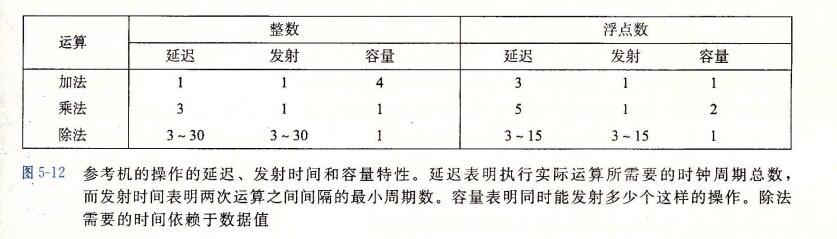

### 1、表示程序性能

```
我们引入度量标准每元素的周期数(Cycles Per Element, CPE),作为一种表示程序性能并指导我们改进代码的方法。CPE 这种度量标准帮助我们在更细节的级别上理解迭代程序的循环性能。这样的度量标准对执行重复计算的程序来说是很适当的，例如处理图像中的像素，或是计算矩阵乘积中的元素。
```

```
处理器活动的顺序是由时钟控制的，时钟提供了某个频率的规律信号，通常用 千兆赫兹(GHz  gigaHz  ,MHz  million),即十亿周期每秒来表示。例如，当表明一个系统有 "4GHz"处理器，这表示处理器时钟运行频率为每秒4* 10^9 个周期。每个时钟周期的时间是时钟频率的倒数(就是说 每个时钟频率需要 1/(4* 10^9) 时间). 
```


## 7、理解现代处理器

```
到目前为止，我们运用的优化都不依赖于目标机器的任何特性。这些优化知识简单的降低了过程调用的开销，以及消除了一些重大的"妨碍优化的因素"，这些因素会给优化编译器造成困难。随着试图进一步提高性能，必须考虑利用处理器微体系结构的优化，也就是处理器用来执行指令的底层系统设计。要想充分提高性能，需要仔细分析程序，同时代码的生成 也要针对目标处理器进行调整。尽管如此，我们还是能够运用一些基本的优化，在很大一类处理器上产生整体的性能提高。我们在这里公布的详细性能结果，对其他机器不一定有同样的效果，但是操作和优化的通用原则对各种各样的机器都适用。
```

```
为了理解改进性能的方法，我们需要理解现代处理器的微体系结构。由于大量的晶体管被集成到一块芯片上，现代微处理器采用了复杂的硬件，试图使程序性能最大化。带来的一个后果就是处理器的实际操作与通过观察机器级程序所察觉的大相径庭。
在代码级上，看上去似乎是一次执行一条指令，每条指令都包括从寄存器或内存取指，执行一个操作，并把结果存回到一个寄存器或内存位置。
在实际的处理器中，是同时对多条指令求值的，这个现象称为指令集并行。

在某些设计中，可以有100或更多挑指令在处理器。
采用一些精细的机制来确保这种并行执行的行为，正好能获得机器级程序要求的顺序语句模型的效果。
现在微处理器取得的了不起的功绩之一是：它们采用复杂而奇异的微处理器结构，其中，多条指令可以并行的执行，同时又呈现出一种简单的顺序执行指令的表象。
```

```
虽然现代微处理器的详细设计超出了本书讲授的范围，对这些微处理器运行的原则有一般性的了解就足够理解它们如何实现指令级并行。
我们会发现两种下界描述了程序的最大性能。
当一系列操作必须按照严格顺序执行时，就会遇到  延迟界限(latency bound),因为在下一条指令开始之前，这条指令必须结束。

当代码中的数据相关限制了处理器利用指令级并行的能力时，延迟界限能够限制程序性能。

吞吐量界限(throughput bound)刻画了处理器功能单元的原始计算能力。这个界限是程序性能的终极限制。
```

### 1、整体操作


```
图5-11 是现代微处理器的一个非常简单化的示意图.我们假想的处理器设计是不太严格的基于近期的 Intel 处理器的结构。这些处理器在工业界称为 超标量(superscalar),意思它可以在每个时钟周期执行多个操作，而且是乱序的(out-of-order),意思就是指令执行的顺序不一定要与它们在机器级程序中的顺序一致。整个设计有两个主要部分:
	指令控制单元(Instruction Control Unit,ICU)
	和执行单元(Execution Unit, EU).
	
前者负责从内存中读出指令序列，并根据这些指令序列生成一组针对程序数据的基本操作;
而后者负责执行这些操作。

和第4章中研究过的按序(in-order)流水线相比，乱序处理器需要更大、更复杂的硬件，但是它们能更好的达到更高的指令级并行度。
```

```
ICU 从指令高速缓存(instruction  cache)中读出指令，指令高速缓存是一个特殊的高速存储器，它包含最近访问的指令。
通常，ICU 会在当前正在执行的指令很早之前 就完成当前指令的取指，这样它才有足够的时间对指令译码，并把操作发送给EU。
不过，一个问题是当程序遇到分支时，程序有两个可能的前进方向。
一种可能会选择分支，控制被传递到分支目标。
另一种可能是，不选择分支，控制被传递到指令序列的下一条指令。
现代处理器采用了一种称为分支预测(branch prediction)的技术，处理器会猜测是否会选择分支，同时还预测分支的目标地址。使用投机执行(speculative execution)的技术，处理器会开始取出位于它预测的分支回跳到的地方的指令，并对指令译码，甚至在它确定分支预测是否正确之前就开始执行这些操作。
如果过后确定分支预测错误，会将状态重新设置到分支点的状态，并开始取出和执行另一个方向上的指令。
标记为取指控制的块包括分支预测，以完成确定取哪些指令的任务。
```

```
指令译码逻辑接收实际的程序指令，并将它们转换成一组基本操作 (有时称为微操作）。
每个这样的操作都完成某个简单的计算任务，例如两个数相加，从内存中读数据，或是向内存写数据。对于具有复杂指令的机器，比如x86处理器，一条指令可以被译码成多个操作。
关于指令如何被译码成操作序列的细节，不同的机器都会不同，这个信息可谓是高度机密。幸运的是，不需要知道某台机器实现的底层细节，我们也能优化自己的程序。
```


```
在一个典型的 x86 实现中，一条只对寄存器操作的指令，例如 add %rax,%rdx 会被转化成一个操作。

另一方面，一条包括一个或多个内存引用的指令，例如 add %rax, 8(%rdx)
会产生多个操作，把内存引用和算术运算 分开。
这条指令会被译码成为三个操作：一个操作从内存中加载一个值到处理器中，一个操作将加载进来的值加上寄存器 %rax 中的值，而一个操作将结果存回到内存。
这种译码逻辑对指令进行分解，允许任务在一组专门的硬件单元之间进行分割。
这些单元可以并行的执行多条指令的不同部分。
```

```
EU接收到来自取指单元的操作。通常，每个时钟周期会接收多个操作。这些操作会被分派到一组 功能单元 中，他们会执行实际的操作中。
这些 功能单元专门用来处理不同类型的操作。
```

```
读写内存是由加载和存储单元实现额。加载单元处理从内存读数据到处理器的操作。
这个单元有一个加法器来完成地址计算。类似，存储单元处理从处理器写数据到内存的操作。它也有一个加法器来完成地址计算。
如图中所示，加载和存储单元通过 数据高速缓存(data cache)来访问内存。数据高速缓存是一个高速存储器，存放着最近访问的数据值。
```

```
使用投机执行技术对操作求值，但是最终结果不会存放在程序寄存器或数据内存中，直到处理器能确定应该实际执行这些指令。
分支操作被送到 EU，不是确定分支该往哪里去，而是确定分支预测是否正确。
如果预测错误，EU会丢弃分支点之后计算出来的结果。它还会发信号给分支单元，说预测错误的，并指出正确的分支目的。
这种情况中，分支单元开始在新的位置取指。如3.6.6节中看到的，这样的预测错误会导致很大的性能开销。在可以取出取出新指令、译码和发送到执行单元之前，要花费一点时间。
```

```
5-11说明不同的功能单元被设计来执行不同的操作。那些标记为执行"算术运算"的单元通常是专门用来执行整数和浮点数操作的不同组合。
随着时间的推移，在单个微处理器芯片上能够集成的晶体管数量越来越多，后续的微处理器型号都增加了功能单元的数量以及每个单元能执行的操作组合，还提升了每个单元的性能。
由于不同程序间所要求的操作变化很大，因此，算术运算单元被特意设计成能够执行各种不同的操作。

比如，有些程序也许会涉及整数操作，而其他则要求许多浮点操作。如果一个功能单元专门执行整数操作，而另一个只能执行浮点操作，那么，这些程序就没有一个能够完全得到多功能单元带来的好处了。
```


```
我们可以看出功能单元的这种组合具有同时执行多个同类型操作的潜力。它有4个功能单元可以执行整数操作，2个单元能执行加载操作，2个单元能执行浮点乘法。稍后我们将看到这些资源对程序获得最大性能所带来的影响。
```

```
在 ICU 中，退役单元(retirement  unit)记录正在进行的处理，并确保它遵守机器级程序的顺序语义。
我们的图中展示了一个 寄存器文件，它包含整数、浮点数和最近的SSE和AVX寄存器，是退役单元的一部分，因为退役单元控制这些寄存器的更新。
指令译码时，关于指令的信息被放置在一个先进先出的队列中。这个信息会一直保持在队列中，直到发生以下两个结果中的一个：
	首先，一旦一条指令的操作完成了，而且所有引起这条指令的分支点也都被确认为预测正确，那么这条指令就可以退役(retired)了，所有对程序寄存器的更新都可以被实际执行了。
	另一方面，如果引起该指令的某个分支点预测错误，这条指令会被清空(flushed),丢弃所有计算出来的结果。通过这种方法，预测错误就不会改变程序的状态了。
```

```
正如我们已经描述的那样，任何对程序寄存器的更新都只会在指令退役时才会发生，只有在处理器能够确信导致这条指令的所有分支都预测正确了，才会这样做。
为了加速一条指令到另一条指令的结果的传送，许多此类信息是在执行单元之间交换的，即图中的"操作结果"。

如图中的箭头所示，执行单元可以直接将结果发送给彼此。这是4.5.5节中简单处理器设计中采用的数据转发技术的更复杂精细版本。
```

```
控制操作数在执行单元间传送的最常用的机制称为 寄存器重命名(register renaming).当一条更新寄存器 r 的指令译码时，产生标记t, 得到一个指向该操作结果的唯一的标识符。条目(r,t)被加入到一张表中，该表维护着每个程序寄存器 r 与会更新该寄存器的操作的标记 t 之间的关联。当随后以寄存器 r 作为操作数的指令译码时，发送到执行单元的操作会把 t 作为操作数源的值。
当某个执行单元完成第一个操作时，会生成一个结果(v,t)，指明标记为 t 的操作产生值 v. 所有等待 t 作为源的操作都能使用 v 作为源值，这就是一种形式的数据转发。通过这种机制，值可以从一个操作直接转发到另一个操作，而不是写到寄存器文件再读出来，使得第二个操作能够在第一个操作完成后尽快开始。
重命名表只包含关于有未进行写操作的寄存器条目。
当一条被译码的指令需要寄存器r, 而又没有标记与这个寄存器相关联，那么可以直接从寄存器文件中获取这个操作数。有了寄存器重命名，即使只有在处理器确定了分支结果之后才能更新寄存器，也可以预测着执行操作的整个序列。
```

### 2、功能单元的性能



```
图5-12 提供了 intel core i7 Haswell 参考机的一些算术运算的性能，有的是测量出来的，有的是引用 Intel 的文献[49].这些时间对于其他处理器来说也是具有代表性的。每个运算都是由以下这些数值来刻画的:
	一个是延迟(latency),它表示完成运算所需要的总时间；
	另一个是发射时间(issue time),它表示两个连续的同类型的运算之间需要的最小时钟周期数; 
	还有一个是容量(capacity),它表示能够执行该运算的功能单元的数量
```


```
我们看到，从整数运算到浮点运算，延迟是增加的。
还可以看到加法和乘法运算的发射时间都为 1，意思是说在每个时钟周期，处理器都可以开始一条新的这样的运算。这种很短的发射时间是通过使用流水线实现的。
流水线化的功能单元实现为一系列的阶段(stage),每个阶段完成一部分的运算。

例如，一个典型浮点数加法器包含三个阶段(所以有三个周期的延迟):一个阶段处理指数值，一个阶段将小数相加，而另一个阶段对结果进行舍入。

算术运算可以连续的通过各个阶段，而不用等待一个操作完成后再开始下一个。
只有当要执行的运算是连续的、逻辑上独立的时候，才能利用这种功能。
发射时间为 1 的功能单元被称为完全流水线化的 (fully pipelined)：
每个时钟周期可以开始一个新的运算。出现容量大于1的运算是由于有多个功能单元，就如前面所述的参考机一样。
```

```
我们还看到，除法器(用于整数和浮点除法，还用来计算浮点平方根)不是完全流水线化的 --- 它的发射时间等于它的延迟。这就意味着在开始一条新运算之前，除法器必须完成整个除法。我们还看到，对于除法的延迟和发射时间是以范围的形式给出的，因为某些被除数和除数的组合比其他的组合需要更多的步骤。除法的长延迟和长发射时间使之成为了一个相对开销很大的运算。
```

```
表达发射时间的一种更常见的方法是指明这个功能单元的最大吞吐量，定义为发射时间的倒数。一个完全流水线化的功能单元有最大的吞吐量，每个时钟周期一个运算，而发射时间较大的功能单元的最大吞吐量比较小。具有多个功能单元可以进一步提高吞吐量。
对于一个容量为C，发射时间为 I 的操作来说，处理器可能获得的吞吐量为每时钟周期 C/I 个操作。比如，我们的参考机可以每个时钟周期执行两个浮点乘法运算。我们将看到如何利用这种能力来提高程序的性能。
```

```
电路设计者可以创建具有各种性能特性的功能单元。创建一个延迟短或使用流水线的单元需要较多的硬件，特别是对于像乘法和浮点操作这样比较复杂的功能。
因为微处理器芯片上，对于这些单元，只有有限的空间，所以 CPU 设计者必须小心的平衡功能单元的数量和它们各自的性能，以获得最优的整体性能。
整数乘法、浮点乘法和加法被认为是重要的操作，即使为了获得低延迟和较高的流水线化程序需要大量的硬件。另一方面，除法相对于不太常用，而且要想实现低延迟或完全流水线化是很困难的。
```


```
延迟界限给出了任何必须按照严格顺序完成合并运算的函数所需要的最小CPE值。根据功能单元产生结果的最大速率，吞吐量界限给出了CPE的最小界限。
例如，因为只有一个整数乘法器，它的发射时间为 1 个时钟周期，处理器不可能支持每个时钟周期大于1条的乘法的速度。
另一方面，四个功能单元都可以执行整数加法，处理器就有可能持续每个周期执行4个操作的速率。不幸的是，因为需要从内存读数据，这造成了另一个吞度量界限。
两个加载单元限制了处理器每个时钟周期最多只能读取两个数据值，从而使得吞吐量界限为0.50 。 我们会展示延迟界限和吞吐量界限对合并函数不同版本的影响。
```

### 3、处理器操作的抽象模型

```
作为分析在现代处理器上执行的机器级程序性能的一个工具，我们会使用程序的数据流(data-flow)表示，这是一种图形化的表示方法，展示了不同操作之间的数据相关时如何限制它们的执行顺序的。这些限制形成了图中的关键路径(critical path),这是一组机器指令所需时钟周期数的一个下界。
```


```
我们可以看到，除了整数加法的情况，这些测量值与处理器的延迟界限是一样的。这不是巧合 -- 它表明这些函数的性能是由所执行的求和或者乘积计算主宰的。
计算n个元素的乘积或者和需要大约 L*n+K 个时钟周期，这里 L 是合并运算的延迟，而 K 表示调用函数和初始化以及终止循环的开销。
因此，CPE就等于延迟界限L.
```

## 9、循环优化

```
1、多个累计变量

2、重新结合变换
```


```
每次迭代内的第一个乘法都不需要等待前一次迭代的累计值就可以执行。因此最小的CPE减少了 2 倍。

只要 load 读取成功了 %rdx 的值， add 可以先行，
然后 %rdx 可以先行，那么第一个 %rax 的 mul 也就可以先行，
所有的运算都卡在了 第二个 mul 那里。
```

```
这里主要的限制流水线的因素就是 标记为"3"的这个 mul,

标记为 1 的这个add 只需要等待 load 指令读取走数据，就可以执行下一个 add,

标记为 2 的指令读取到数据以后，直接进行 mul,完成第一个mul后， 然后就卡在了 标记为"3"的这个 mul,

所以这里主要卡住的只有这个标记为 "3" 的mul. 

因为 标记为 1 的 add 只需要 load 指令取走数据，就可以执行下一个add，所以这里并不会因为 标记为 3 的指令没有执行完成，而无法执行下去。

而是会直接执行下一个 add。
```


`


```
多个累积变量。 对于一个可结合和可交换的合并运算，比如整数加法或乘法，可以通过一组合并运算分割成两个或更多的部分，引入多个累积变量，并在最后合并结果来提高性能。充分利用处理器的吞吐能力。

重新结合变换。通过在计算中添加、删除括号来改变元素的合并方式。重新结合变换能够减少计算中关键路径上操作的数量，通过更好地利用功能单元的流水线能力得到更好的性能。
```


```
累计多个变量和重新结合变换 只有整数编译器才能自动帮其优化。浮点数不会帮其自动优化。

1、累积多个变量
在执行 k*k 循环展开变换时，我们必须考虑是否要保留原始函数的功能。在第二章中已经看到，补码运算是可交换和可结合的，甚至是当溢出的时也是如此。
因此，对于整数数据类型，在所有可能的情况下，优化和不优化计算出的结果都是一样的。编译器可以自动帮其优化。

另一方面，浮点乘法和加法不是可结合的。因此，由于四舍五入或溢出，优化前和优化后可能产生不同的结果。

重新结合变换的理由也和上诉一致。
```

### 用向量指令达到更高的并行度


## 11、一些限制因素

### 1、寄存器溢出

```
循环并行化的好处受汇编代码描述计算的能力限制.如果我们的并行度 p 超过了可用的寄存器数量，那么编译器会诉诸溢出(spilling)，将某些临时值存放到内存中，通常是在运行时堆栈上分配空间。
```


## 12理解内存性能

```
到目前为止我们写的所有代码。以及运行的所有测试，只访问相对比较少量的内存。
例如，我们都是在长度小于1000个元素的向量上测试这些合并函数，数据量不会超过 8000 个字节。
所有的现代处理器都包含一个或多个高速缓存(cache)存储器，以对这样少量的存储器提供快速的访问。
本节会进一步研究涉及加载(从内存读到寄存器)和存储(从寄存器写到内存)操作的程序的性能，只考虑所有的数据都存放在高速缓存中的情况。
```

```
如图5-11所示，现代处理器有专门的功能单元来执行加载和存储操作，这些单元有内部的缓存区来保存未完成的内存操作请求集合。
例如:我们的参考机有两个加载单元，每一个可以保存多达72个未完成的读请求。
它还有一个存储单元，其存储缓冲区能保存最多42个写请求。每个这样的单元通常可以每个时钟周期开始一个操作。
```

### 1、加载的性能

```
一个包含加载操作的程序的性能既依赖于流水线的能力，也依赖于加载单元的延迟。
在参考机上运行合并操作的实验中，我们看到除了使用 SIMD 操作时以外，对任何数据类型组合和合并操作来说，CPE 从没有到过 0.50 以下。
一个制约示例的CPE 的因素是，对于每个被计算的元素，所有的示例都需要从内存读一个值。对两个加载单元而言，其每个时钟周期只能启动一条加载操作，所以 CPE 不可能小于 0.50。对于每个被计算的元素必须加载 k 个值的应用，我们不可能获得低于 k/2 的 CPE. 因为加载单元只有两个，所以最快最快每个时钟周期只能有两个指令.
```

```
到目前为止，我们在示例中还没有看到加载操作的延迟产生的应影响。
加载操作的地址只依赖于循环索引 i, 所以加载操作不会成为限制性能关键路径的一部分。

要确定一台机器上加载操作的延迟，我们可以建立由一系列加载操作组成的一个计算，一条加载操作的结果决定下一条操作的地址。
作为一个例子，考虑函数图 5-31 中的函数 list_len, 它计算一个链表的长度。在这个函数的循环中，变量 1 s 的每个后续值依赖于指针引用 ls -> next 读出的值。测试表明函数 list_len 的 CPE 为 4.00， 我们认为这直接表明了加载操作的延迟。要弄懂这一点，考虑循环的汇编代码：
```


### 2、存储的性能

```
在迄今为止所有的示例中，我们只分析了大部分内存引用都是加载操作的函数，也就是从内存位置读到寄存器中。
与之对应的是存储(store)操作，它将一个寄存器值写到内存。
这个操作的性能，尤其是与加载操作的互相关系，包括一些很细微的问题。
```

```
与加载操作一样，在大多数情况中，存储操作能够在完全流水线化的模式中工作，每个周期开始一条新的存储。例如，考虑图 5-32 中所示的函数，它们将一个长度为 n 的数组 dest 的元素设置为 0.我们测试结果为 CPE 等于 1.00。对于只具有单个存储功能单元的机器，这已经达到了最佳情况。
```


```
与到目前为止我们已经考虑过的其他操作不同，存储操作并不影响任何寄存器值。因此，就其本性来说，一系列存储操作不会产生数据相关。
只有加载操作会受存储操作结果的影响，因为只有加载操作能从由存储操作写的那个位置读回值。
```


```
图5-33 所示的函数 write_read 说明了加载和存储操作之前可能的互相影响。
这幅图也展示了该函数的两个示例执行，是对两元素数组 a 调用的，该数组的初始内容为  -10 和 17，参数 cnt 等于 3.这些执行说明了加载和存储操作的一些细微之处。
```


```
为了理解处理器如何区分这两种情况，以及为什么一种情况比另一种情况运行的慢，我们必须更加仔细的看看加载和存储执行单元，如图 5-34 所示。
存储单元包含一个存储缓存区，它包含已经发射到存储单元而又还没有完成的存储操作的地址和数据，这里的完成包括更新数据高速缓存。
提供这样一个缓冲区，使得一系列存储操作不必等待每个操作都更新高速缓存就能够执行。
当一个加载操作发生时，它必须检查存储缓冲区中的条目，看有没有地址相匹配。
如果有地址相匹配(意味着在写的字节与在读的字节有相同的地址)，它就取出相应的数据条目作为加载操作的结果。
```


```
图 5-35 给出了这个循环代码的数据流表示。指令 movq %rax,(%rsi) 被翻译成两个操作：s_addr 指令计算存储操作的地址，在存储缓冲区创建一个条目，并且设置该条目的地址字段。s_data 设置该条目的数据字段。
正如我们会看到的，两个计算是独立执行的，这对程序的性能来说很重要。应该是值 add 和 sub 是独立运行的
这使得参考机中不同的功能单元来执行这些操作。
```

```
除了由于写和读寄存器造成的操作之间的数据相关，操作符右边的弧线表示这些操作隐含的相关。
特别的，s_addr 操作的地址计算必须在 s_data 操作之前。此外，对指令 movq(%rdi), %rax 译码得到的 load 操作必须检查所有未完成的存储操作的地址，在这个操作和 s_addr 操作之间创建一个数据相关。这张图中 s_data 和 load 操作之前有虚弧线。
这个数据相关是有条件的：
	如果两个地址相同，load 操作必须等待直到 s_data 将它的结果存放到存储缓冲区中.
	
	但是如果两个地址不同，两个操作就可以独立地进行。
```


```
图5-36 说明了 write_read 内循环操作之间的数据相关。在图5-36a 中，重新排列了操作，让相关显得更清楚。我们标出了三个涉及加载和存储操作的相关，希望引起大家特别的注意。
标号为 1 的弧线表示存储地址必须在数据被存储之前计算出来。
标号为 2 的弧线表示需要 load 操作将它的地址与所有未完成的存储操作的地址进行比较。
最后标号为 3 的虚弧线表示条件数据相关，当加载和存储地址相同时会出现。
```


```
图5-36b 说明了当移走那些不直接影响迭代与迭代之间数据流的操作之后，会发生什么。这个数据流图给出两个相关链：
左边的一条，存储、加载和增加数据值(只会对地址相同的情况有效)，右边的一条，减少变量 cnt.
```

```
现在我们可以理解函数 write_read 的性能特征了。图5-37 说明的是内循环的多次迭代形成的数据相关。
对于 图 5-33 示例 A 的情况，有不同的源和目的地址，加载和存储操作可以独立进行，因此唯一的关键路径是由减少变量 cnt 形成的，这使得CPE等于1.0。

对于图 5-33 示例 B 的情况，源地址和目的地址相同，s_data和load 指令之间的数据相关使得关键路径的形成包括了存储、加载和增加数据。我们发现顺序执行这三个操作一共需要7个时钟周期。
```


```
这两个例子说明，内存操作的实现包括许多细微之处。对于寄存器操作，在指令被译码成操作的时候，处理器就可以确定哪些指令会影响其他哪些指令。
另一方面，对于内存操作，只有到计算出加载和存储的地址被计算出来以后，处理器才能确定哪些指令会影响其他的哪些。
高效的处理内存操作对许多程序的性能来说至关重要。内存子系统使用了很多优化，例如当操作可以独立地进行时，就利用了这种潜在的并行性。
```


