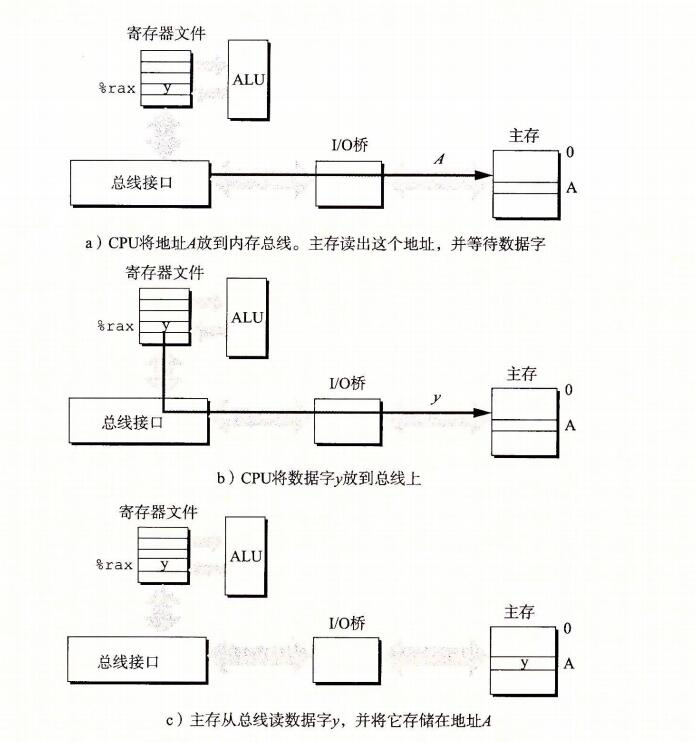

## 存储器层次结构

```
到目前为止，在对系统的研究中，我们依赖于一个简单的计算机系统模型，cpu 执行指令，而存储器系统为cpu 存放指令和数据。在简单模型中，存储器系统时一个线性的字节数组，而CPu 能够在一个常数时间内访问每个 存储器位置。虽然迄今为止这都是一个有效的模型，但是它没有反映现代系统实际工作的方式。
```

```
实际上，存储器系统(memory system)是一个具有不同容量、成本和访问时间的存储设备的层次结构。CPU 寄存器保存着最常用的数据。靠近CPU的小的、快速的高速缓存存储器(cache memory)缓存着 相对慢速的主存储器(main memory)中数据和指令的缓冲区域。
主存缓存存储这 容量较大的、慢速的磁盘上的数据，
而这些磁盘常常又作为存储在通过网络连接的其他机器的磁盘或磁带上的数据的缓冲区域。
```

```
存储器层次结构是可行的，这是因为与下一个更低层次的存储设备相比来说，一个编写良好的程序倾向于更频繁的访问某一个层次上的存储设备。
所以，下一层的存储设备可以更慢一点，也因此可以更大，每个比特位更便宜。整体效果是一个大的存储器池，其成本与层次结构底层最便宜的存储设备相当，但是却以接近于层次结构顶部存储设备的高速率向程序提供数据。
```

```
作为一个程序员，你需要理解存储器层次结构，因为它对应用程序的性能有着巨大的影响。如果你的程序需要的数据是存储在 CPU 寄存器中的，那么在指令的执行期间，在0个周期内就能访问到它。
如果存储在高速缓存中，需要4~75个周期。
如果存储在主存中，需要上百个周期。
而如果存储在磁盘上，需要大约几千万个周期。
```

```
这里就是计算机系统中一个基本而持久的思想：
如果你理解了系统时如何将数据在存储器层次结构中上上下下移动的，那么你就可以编写自己的应用程序，使得它们的数据项存储在层次结构中较高的地方，在那里CPU能更快的访问到它们。
```

```
这个思想围绕着计算机程序的一个称为局部性(locality)的基本属性。具有良好局部性的程序倾向于一次又一次地访问相同的数据项集合，或是倾向于访问邻近的数据项集合。
具有良好局部性的程序比局部性差的程序更多的倾向于从存储器层次结构中较高的层次处访问数据项，因此运行的更快。
```

```
在本章中，我们会看看基础的存储技术 - SRAM 存储器、DRAM 存储器、ROM存储器以及旋转的和固态的硬盘 -- 并描述它们是如何被组织成层次结构的。特别的，我们将注意力集中在高速缓存存储器上，它是作为CPU和主存之间的缓存区域，因为它们对应用程序性能的影响最大。
我们向你展示如何分析C程序的局部性，并且介绍改进你的程序中局部性的技术。
你还会学到一种描绘某台机器上存储器层次结构的性能的有趣方法，称为"存储器山(memory mountain)",它展示出读访问时间是局限性的一个函数。
```

## 1、存储技术

```
计算机技术的成功很大程度上源自于存储技术的巨大进步。早期的计算机只有几千字节的随机访问存储器。
```

### 1、随机访问存储器

```
随机访问存储器(Random-Access Memory,RAM)分为两类：
	静态的和动态的。
静态的RAM(SRAM)比动态(DRAM dynamic) 更快，但也贵得多。
SRAM用来作为高速缓存存储器，既可以在CPU芯片上，也可以在片下。

DRAM(dynamic Random-Access Memory) 用来作为主存以及图形系统的帧缓冲区。
典型的，一个桌面系统的 SRAM 不会超过几兆字节，但是 DRAM 却有几百或几千兆字节。
```

#### 1、静态RAM

```
SRAM 将每个位存储在一个双稳态的(bistable)存储器单元里。每个单元使用一个六晶体管电路来实现的。
这个电路有这样一个属性，它可以无限期地保持在两个不同的电压配置(configuration)或状态(state)之一。其他任何状态都是不稳定的 -- 从不稳定状态开始，电路会迅速地转移到两个稳定状态中的一个。这样一个存储器单元类似于图6-1中画出的倒转的钟摆。
```


```
当钟摆倾斜到最左边或最右边时，它是稳定的。从其他任何位置，钟摆都会倒向一边或另一边。
原则上，钟摆也能在垂直的位置无限期地保持平衡，但是这个状态是 亚稳态的(metastable) -- 最细微的扰动也能使它倒下，并且一旦倒下就永远不会再恢复到垂直的位置。

由于SRAM 存储器单元的双稳态特性，只有有电，它就会永远的保持它的值。即使有干扰(例如电子噪音)来扰乱电压，当干扰消除时，电路就会恢复到稳定值。
```

#### 2、动态RAM

```
DRAM 将每个位存储为对一个电容的充电。这个电容非常小，通常只有大约30毫微微法拉(femtofarad) -- 30*10^-15 法拉。不过，回想一下法拉是一个非常大的计量单位。
DRAM 存储器可以知道的非常密集 -- 每个单元由一个电容和一个访问晶体管组成。
但是，与SRAM不同，DRAM存储器单元对干扰非常敏感。
当电容的电压被扰乱之后，它就永远不会恢复了。
暴露在 光线下会导致电容电压改变。实际上，数码照相机和摄像机中的传感器本本质上就是DRAM单元的阵列。
```

```
很多原因会导致漏电，使得 DRAM 单元在 10~100毫秒时间内失去电荷。
幸运的是，计算机运行的时钟周期是以纳秒来衡量的，所以相对而言这个保持时间是比较长的。
内存系统必须周期性的通过读出，然后重写来刷新内存每一位。
有些系统也使用纠错码，其中计算机的字会被多编码几个位(例如64位的字可能用来72位来编码)，这样一来，电路可以发现并纠正一个字中任何单个的错误位。
```


```
图6-2 总结了SRAM 和 DRAM 存储器的特性，只要有供电，SRAM就会保持不变。
与DRAM不同，它不需要刷新。
SRAM的存取比DRAM快。
SRAM对诸如光和电噪声这样的干扰不敏感。
代价是SRAM单元和DRAM单元使用更多的晶体管，因而密集度低，而且更贵，功耗更大。
```


#### 3、传统的DRAM

```
DRAM 芯片中的单元(位)被分成 d 个超单元(supercell),每个超单元都由 w 个 DRAM 单元组成。一个 d*w 的DRAM总共存储了 dw 位信息。
超单元被组成一个 r 行 c 列的长方形阵列，这里 rc = d.
每个超单元有形如(i,j)的地址，这里i表示行，而j表示列。
```


```
例如，图6-3展示的是一个16*8 的DRAM芯片的组织，有d=16个超单元，每个超单元有
w = 8 位，r=4行，c=4列。
带阴影的方块表示地址(2,1)处的超单元。信息通过称为 引脚(pin) 的外部连接器流入和流出芯片。
每个引脚携带一个1位的信号。
图6-3给出了两组引脚：
	8个data引脚，它们能传送一个字节到芯片或芯片传出一个字节，以及2个addr引脚，它们携带2位的行和列超单元地址。
	其他携带控制信息的引脚没有显示出来。
```

```
旁注： 关于术语的注释
	存储领域从来没有为 DRAM 的阵列元素确定一个标准的名字。计算机架构师倾向于称之为"单元"，使这个术语具有 DRAM 存储单元之意。电路设计者倾向于称之为"字"，使之具有主存一个字之意。为了避免混淆，我们采用无歧义的术语"超单元"。
```


```
每个DRAM 芯片被连接到某个称为"内存控制器(memory controller)"的电路，这个电路可以一次传送 w 位到每个 DRAM 芯片或一次从每个 DRAM 芯片传出 w 位。

为了读出超单元(i,j)的内容，内存控制器将行地址 i 发送到 DRAM, 然后是列地址 j. 
DRAM 把超单元(i,j)的内容发回给控制器作为响应。
行地址i称为 RAS(row access strobe,行访问选通脉冲)请求。
列地址j称为 CAS(column access strobe,列访问 选通脉冲)请求。

主要RAS CAS 请求共享相同的 DRAM 地址引脚。
```


```
例如，要从图6-3中 16*8 的DRAM 中读出超单元(2,1)，内存控制器发送行地址2，如图6-4a 所示。DRAM的响应是将行2的整个内容都复制到一个内部行缓冲区。
接下来，内存控制器发送到列地址1，如图6-4b所示。
DRAM 的响应是从行缓冲区复制到超单元(2,1)中的8位，并把它们发送到内存控制器。
```

```
电路设计者将 DRAM 组织成二维阵列而不是线性数组的一个原因是降低芯片上地址引脚的数量。
如果示例的128位DRAM被组织成一个16超单元的线性数组，地址为0~15，那么芯片会需要4个地址引脚而不是2个。二维阵列组织的缺点是必须分两步发送地址，这增加了访问时间。
```

#### 4、内存模块

```
DRAM 芯片封装在内存模块(memory module)中，它插到主板的扩展槽上。Core i7 系统使用的240个引脚的 双列直插内存模块(Dual Inline Memory Module, DIMM), 它以64位为块传送数据到内存控制器和从内存控制器传出数据。
```


```
图6-5 展示了一个内存模块的基本思想。示例模块用 8 个 64 Mbit 的8M*8 的 DRAM 芯片，总共存储64MB(兆字节)，这8个芯片编号为0~7.
每个超单元存储主存的一个字节，而用相应超单元地址为(i,j)的8个超单元来表示主存中字节地址A处的64位字。一个字分别存储在8个DRAM片里面。
在 图6-5 的示例中，DRAM 0 存储第一个(低位)字节，DRAM1 存储下一个字节，依此类推。
```

```
要取出内存地址A处的一个字，内存控制器将A转换成一个超单元地址(i,j),并将它发送到内存模块，然后内存模块再将i和j广播到每个 DRAM。作为响应，每个DRAM输出它的(i,j)超单元的8位内容。模块中的电路收集这些输出，并把它们合并成一个64位的字，再返回给内存控制器。
```

```
通过将多个内存模块连接到内存控制器，能够聚合成主存。在这种情况中，当控制器收到一个地址A时，控制器选择包含A的模块k,然后将A转换成它的(i,j)的形式，并将(i,j)发送到模块k.
```


#### 5、增强的DRAM

```
有许多种 DRAM 存储器，而生产厂商试图跟上迅速增长的处理器速度，市场上就会定期推出新的种类。每种都是基于传统的DRAM单元，并进行一些优化，提高访问基本DRAM单元的速度。
```


#### 6、非易失性存储器

```
如果断电，DRAM 和 SRAM 会丢失它们的信息，从这个意义上来说，它们是易失的(volatile). 另一方面，非易失性存储器(nonvolatile memory)即使是在关电后，仍然保存着它们的信息。

现在有很多种非易失性存储器。
由于历史原因，虽然ROM中有的类型既可以读也可以想写，但是它们整体上都被称为只读存储器(Read-Only Memory,ROM).
ROM是以它们能够被重编程(写)的次数和对它们进行重编程所用的机制来区分的。
```

```
PROM(Programmable ROM,可编程的ROM)只能被编程一次。PROM的每个存储器单元有一种熔丝(fuse),只能用高电流熔断一次。
```

```
可擦写可编程ROM(Erasable Programmable ROM, EPROM)有一个透明的石英窗口，允许光到达存储单元。紫外线光照射过窗口，EPPROM 单元就被清除为0。
对EPROM编程是通过使用一种把1写入 EPROM 的特殊设备来完成的。
EPROM 能够被擦除和重编程的次数的数量级可以达到1000次。

电子可擦除PROM(Electrically Erasable PROM, EEPROM)类似于EPROM,但是它不需要一个物理上独立的编程设备，因此可以直接在印制电路卡上编程。
EEPROM 能够被编程的次数的数量级可以达到 10^5 次。
```

```
闪存(flash memory)是一类非易失性存储器，基于EEPROM,它已经成为了一种重要的存储技术。
闪存无处不在，为大量的电子设备提供快速而持久的非易失性存储，包括数码相机、手机、音乐播放器、PDA和笔记本、台式机和服务器计算机系统。
在6.1.3节中，我们会仔细研究一种新型的基于闪存的磁盘驱动器，称为固态硬盘(Solid State Disk, SSD),它能提供相对传统旋转磁盘的一种更快速、更强健和更低能耗的选择。
```

```
存储在ROM设备中的程序通常被称为固件(firmware)。当一个计算机系统通电以后，它会运行存储在 ROM 中的固件。一些系统在固件中提供了少量基本的输入和输出函数 --例如PC的BIOS(基本输入/输出系统)例程。复杂的设备，像图像卡和磁盘驱动控制器，也依赖固件翻译来自 CPU 的I/O(输入/输出)请求。
```


#### 7、访问主存

```
数据流通过称为 总线(bus) 的共享电子电路在处理器和DRAM主存之间来来回回。每次CPU和主存之间的数据传送都是通过一系列步骤来完成的，这些步骤称为总线事务(bus transaction).
读事务(read transaction)从主存传送数据到CPU。
写事务(write transtion)从CPU传送数据到主存。
```

```
总线是一组并行的导线，能携带地址、数据和控制信号。
取决于总线的设计，数据和地址信号可以共享同一组导线。
同时，两个以上的设备也能共享同一总线。
控制线携带的信号会同步事务，并识别出当前正在被执行的事务的类型。

例如，当前关注的这个事务是到主存的吗？还是到诸如磁盘控制器这样的其他I/O设备？
这个事务是读还是写？总线上的信息是地址还是数据项？

```


```
图6-6展示了一个示例计算机系统的配置。主要部件是CPU芯片、我们将其成为I/O桥接器(I/P bridge)的芯片组(其中包括内存控制器)，以及组成主存的DRAM内存模块。
这些部件由一对总线连接起来，
其中一条总线是系统总线(memory bus),它连接CPU和I/O桥接器，
另一条总线是内存总线(memory bus),它连接I/O桥接器和内存。

I/O桥接器将系统总线的电子信号翻译成内存总线的电子信号。
正如我们看到的那样，I/O桥也将系统总线和内存总线连接到I/O总线，像磁盘和图形卡这样得 I/O 设备共享 I/O 总线。不过现在，我们将注意力集中在内存总线上。
```


```
考虑当 CPU 执行一个如下加载操作时会发生什么
movq A,%rax

这里，地址A的内容被加载到寄存器%rax中。CPU芯片上称为总线接口(bus interface)的电路在总线上发起读事务。
读事务是由三个步骤组成的。

首先，CPU将地址A放到系统总线上。I/O桥将信号传递到内存总线(图6-7a)。
接下来，主存感觉到内存总线上的地址信号，从内存总线读地址，从DRAM 取出数据字，并将数据写到内存总线。
I/O桥将内存总线信号翻译成系统总线信号，然后沿着系统总线传递(图6-7b)。
最后，CPU感觉到系统总线上的数据，从总线上读数据，并将数据复制到寄存器上%rax(图6-7c).
```


```
反过来，当CPU执行一个像下面的存储操作时
movq %rax,A

这里，寄存器%rax 的内容被写到地址A，CPU发起写事务。同样，有三个基本步骤。首先，CPU将地址放到系统总线上。
内存从内存总线读出地址，并等待数据到达(图6-8a)，接下来，CPU将%rax中的数据字复制到系统总线(图6-8b).最后，主存从内存总线读出数据字，并将这些位存储到DRAM中(图6-8c).
```




### 2、磁盘存储

```
磁盘是广为应用的保存大量数据的存储设备，存储数据的数量级可以达到几百W到几千W兆字节，而基于RAM的存储器只能有几百或几千兆字节。不过，从磁盘上读信息的时间为毫秒级，比从DRAM读慢了10万倍，比从SRAM读慢了100万倍。
```

#### 1、磁盘构造

```
磁盘是由盘片(platter)构成的。
每个盘片有两面或者成为表面(surface),表面覆盖着磁性记录材料。
盘片中央有一个可以旋转的主轴(spindle),它使得盘片以固定的旋转速率(rotational rate)旋转，通常是 5400~15000转每分钟(Revolution Per Minute,RPM).磁盘通常包含一个或多个这样的盘片，并封装在一个密封的容器内。
```


```
图6-9a展示了一个典型的磁盘表面的结构。每个表面是由一组称为磁道(track)的同心圆组成的。
每个磁道被划分为一组扇区(sector).每个扇区包含相等数量的数据位(通常是512字节)，这些数据编码在扇区上的磁性材料中。
扇区之间由一些间隙(gap)分隔开，这些间隙中不存储数据位。
间隙存储用来标识扇区的格式化位。
```

```
磁盘是由一个或多个叠放在一起的盘片组成的，它们被封装在一个密封的包装里，如图6-9b所示。
整个装置通常被称为磁盘驱动器(disk drive),我们通常简称为磁盘(disk).
有时，我们会称磁盘为旋转磁盘(rotating disk)，以使之区别于闪存的固态硬盘(SSD),SSD 是没有移动部分的。
```

```
磁盘制造商通常用术语柱面(cylinder)来描述多个盘片驱动器的构造，这里，柱面是所有盘片表面上到主轴中心距离相等的磁道的集合。
就是所有磁片中半径相同的同心磁道构成“柱面"，意思是这一系列的磁道垂直叠在一起，就形成一个柱面的形状。简单地理解，柱面就是磁道。
比如有 三个盘片，三个盘片都有一个 到主轴中心距离相等的磁道，称为 a1,a2,a3 三个这种距离相等的磁道。这 a1,a2,a3 三个磁盘统称为柱面a。
柱面就是 所有盘片到主轴中心距离相等的 磁道的集合。这样看起来就像一个柱形，所以就叫柱面。

磁道是在磁盘的外圈还是内圈？
由于历史原因 ， 磁盘的0磁道在最外圈（过去的老式硬盘，每条磁道上的簇的数量都是一样多的。也就是说最里面和最外面的磁道的簇的数目是一样的。显然，磁密度越低，数据的安全越有保障。而MBR放在0柱面的，第0个磁道的，第1个簇上面，为了这个关键数据的安全，所以磁道要从最外开始安排。）
```

#### 2、磁盘容量

```
一个磁盘上可以记录的最大位数称为 它的最大容量，或者简称容量。磁盘容量是由以下技术因素决定的：

记录密度(reording density)(位/英寸)：磁道一英寸的段中可以放入的位数。
		
磁道密度(track density)(道/英寸)：从盘片中心出发半径上一英寸的段内可以有的磁道数。

面密度(areal density)(位/平方英寸)：记录密度与磁道密度的乘积。
```

```
磁盘制造商不懈地努力以提高密度(从而增加容量)，而面密度每隔几年就会翻倍。
最初的磁盘，是在面密度很低的时代设计的，将每个磁道分为数目相同的扇区，扇区的数据是由最靠内的磁道能记录的扇区数决定的。为了保持每个磁道有固定的扇区数，越往外的磁道扇区隔得越开。
在面密度相对比较低的时候，这种方法还算合理。不过，随着面密度的提高，扇区之间的间隙(那里没有存储数据位)变得不可接受地大。
因此，现代大容量磁盘使用一种称为多区记录(multiple zone recording)的技术，在这种技术中，柱面的集合被分割成不相交的子集合，称为记录区(recording zone).每个区包含一组连续的柱面。
一个区中的每个柱面中的每条磁道都有相同数量的扇区，这个扇区的数量是由该区中最里面的磁道所能包含的扇区确定的。
```


```
kilo千克 公斤  mega  giga十亿  tera
```


#### 3、磁盘操作


```
磁盘用读/写头(read/write head)来读写存储在磁性表面的位，而读写头连接到一个传动臂(actuator arm)一端，如图6-10a所示。通过沿着半径轴前后移动这个传动臂，驱动器可以将读/写头定位在盘面上的任何磁道上。

这样的机械运动称为寻道(seek).一旦读/写头定位到了期望的磁道上，那么当磁道上的每个定位通过它下面时，读/写头可以感知到这个位的值(读该位)，也可以修改这个位的值(写该位)。
有多个盘片的磁盘针对每个盘面都有一个独立的读/写头，如图6-10b 所示。读/写头垂直排列，一致行为。在任何时刻，所有的读/写头都位于同一个柱面上。
```

```
在传动臂末端的读/写头在磁盘表面高度大约0.1微米处的一层薄薄的气垫上飞翔(就是字面上这个意思)，速度大约为80km/h. 
在这样小的间隙里面，盘面上一粒微小的灰尘都像一块巨石。如果读/写头碰到了这样一块巨石，读/写头会停下来，撞到盘面 -- 所谓的读/写冲撞(head crash). 为此，磁盘总是密封包装的。

磁盘以扇区大小的块来读写数据。对扇区的访问时间(access time)有三个主要的部分：寻道时间(seek time)、旋转时间(rotational latency)和传送时间(transfer time):
```


```
寻道时间：为了读取某个目标扇区的内容，传动臂首先将读/写头定位到包含目标扇区的磁道上。
移动传动臂所需的时间成为寻道时间。
寻道时间T(seek) 依赖于读/写头以前的位置和传动臂在盘面上移动的速度。
现代驱动器中平均寻道时间T(avg seek) 是通过对几千次对随机扇区的寻道求平均值来测量的，通常为 3~9ms.
一次寻道的最大时间 T(max seek)可以高达 20ms.
```

```
旋转时间：一旦读/写头定位到了期望的磁道，驱动器等待目标扇区的第一个位旋转到读/写头下。
这个步骤的性能依赖于当读/写头到达目标扇区时盘面的位置以及磁盘的旋转速度。
在最坏的情况下，读/写头刚刚错过了目标扇区，必须等待磁盘转一整圈。因此，最大旋转延迟(以秒为单位)是：
```


```
传送时间：
	当目标扇区的第一个位位于读/写头下时，驱动器就可以开始读或者写该扇区的内容了。
	一个扇区的传送时间依赖于旋转速度和每条磁道的扇区数目。因此，我们可以粗略的估计一个扇区以秒为单位的平均传送时间如下：
	(就是读完该扇区的数据的时间)，所以是基于旋转速度和扇区大小的。
```


```
这个例子说明了一些很重要的问题：

	访问一个磁盘扇区中512个字节的时间主要是寻道时间和旋转延迟。访问扇区中的第一个字节用了很长时间，但是访问剩下的字节几乎不用时间。

	因为寻道时间和旋转延迟大致相等，所以将寻道时间乘2是估计磁盘访问时间的简单而合理的方法。
	
	对存储在SRAM中的一个64位字的访问时间大约是4ns，对DRAM的访问时间是60ns。
因此，从内存中读一个512个字节扇区大小的块的时间对SRAM来说大约是256ns,对DRAM来说大约是4000ns。磁盘访问时间，大约10ms,是SRAM的大约40 000倍，是DRAM的大约2500倍。
```

#### 4、逻辑磁盘块

```
正如我们看到的那样，现代磁盘构造复杂，有多个盘面，这些盘面上有不同的记录区。为了对操作系统隐藏这样的复杂性，现代磁盘将它们构造呈现为一个简单的视图，
一个B个扇区大小的逻辑块的序列，编号为 0,1,...,B-1。
磁盘封装中有一个小的硬件/固件设备，称为磁盘控制器，维护着逻辑块和实际(物理)磁盘扇区之间的映射关系。

	当操作系统想要执行一个I/O操作时，例如读一个磁盘扇区的数据到主存，操作系统会发送一个命令到磁盘控制器，让它读某个逻辑块号。
	
	控制器上的固件执行一个快速表查找，将一个逻辑块号翻译成一个(盘面，磁道，扇区)的三元组，这个三元组唯一的标识了对应的物理扇区。控制器上的硬件会解释这个三元组，将读/写头移动到适当的柱面，等待扇区移动到读/写头下，将读/写头感知到的位放到控制器上的一个小缓冲区中，然后将它们复制到主存中。
```


#### 5、连接I/O设备

```
例如图形卡、监视器、鼠标、键盘和磁盘这样的输入/输出(I/O)设备，都是通过I/O总线，例如intel 的外围设备互连(Peripheral Component Interconnect, PCI)总线连接到CPU和主存的。

系统总线和内存总线是与CPU相关的，与它们不同，诸如PCI这样的I/O总线设计成与底层CPU无关。

例如，PC和Mac都可以使用PCI 总线。图6-11展示了一个典型的I/O总线结构，它连接了CPU、主存和I/O设备。
```


```
虽然I/O总线比系统总线和内存总线慢，但是它可以容纳种类繁多的第三方I/O设备。
例如，在图6-11中，有三种不同类型的设备连接到总线。
```

```
通用串行总线(Universal Serial Bus, USB)控制器是一个连接到USB总线的设备的中转机构，USB总线是一个广泛使用的标准，连接各种外围I/O设备，包括键盘、鼠标、调制解调器、数码相机、游戏操纵杆、打印机、外部磁盘驱动器和固态硬盘。
USB3.0总线的最大带宽为625MB/s。 USB3.1总线的最大带宽为1250MB/s。

图形卡(或适配器)包含硬件和软件逻辑，它们负责代表CPU在显示器上画像素。

主机总线适配器 将一个或多个磁盘连接到I/O总线，使用的是一个特别的主机总线接口定义的通信协议。
两个最常用的这样的磁盘接口是SCSI(读作 scuzzy)和SATA(读作 sat-uh)。
SCSI磁盘通常比SATA驱动器更快但是也更贵。SCSI主机总线适配器(通常称为SCSI控制器)可以支持多个磁盘驱动器，与SATA适配器不同，它只能支持一个驱动器。
```

```
其他的设备，例如网络适配器，可以通过将适配器插入到主板上空的扩展槽中，从而连接到I/O总线，这些槽提供了到总线的直接电路连接。
```


#### 6、访问磁盘

```
虽然详细描述I/O设备是如何工作的以及如何对它们进行编程超出了我们讨论的范围，但是我们可以给你一个概要的描述。
例如，图6-12总结了当CPU从磁盘读数据时发生的步骤。
```


```
CPU使用一种称为内存映射I/O(memory-mapped I/O)的技术来向I/O设备发射命令(图6-12a)。
在使用内存映射I/O的系统中，地址空间中有一块地址是为与I/O设备通信保留的。
每个这样的地址称为一个I/O端口(I/O port).
当一个设备连接到总线时，它与一个或多个端口相关联(或它被映射到一个或多个端口)。
```


```
来看一个简单的例子，假设磁盘控制器映射到端口 0xa0。随后，CPU可能通过执行三个对地址 0xa0的存储指令，发起磁盘读：
	第一条指令是发送一个命令字，告诉磁盘发起一个读，同时还发送了其他的参数，例如当读完成时，是否中断CPU(我们会在8.1节中讨论中断)。
	第二条指令指明应该读的逻辑块号。
	第三条指令指明应该存储磁盘扇区内容的主存地址。
	
当CPU发出了请求之后，在磁盘执行读的时候，它通常会做些其他的工作。回想一下，一个1GHz 的处理器时钟周期为1ns,在用来读磁盘的16ms时间里，它潜在地可能执行1600万条指令。在传输进行时，只是简单的等待，什么都不做，是一种极大地浪费。

在磁盘控制器收到来自CPU的读命令之后，它将逻辑块号翻译成一个扇区地址，读该扇区的内容，然后讲这些内容直接传送到主存，不需要CPU的干涉(图6-12b).
设备可以自己执行读或者写总线事务而不需要CPU干涉的过程，称为直接内存访问(Direct Memory Access,DMA)。
这种数据传送称为DMA传送(DMA transfer).

在DMA传送完成，磁盘扇区的内容被安全的存储在主存中以后，磁盘控制器通过给CPU发送一个中断信号来通知CPU(图6-12c)。
基本思想是中断会发信号到CPU芯片的一个外部引脚上。这会导致CPU暂停它当前正在做的工作，跳转到一个操作系统例程。这个程序会记录下I/O已经完成，然后将控制返回到CPU被中断的地方。
```

#### 7、固态硬盘

```
固态硬盘(Solid State Disk, SSD)是一种基于闪存的存储技术，在某些情况下是传统旋转磁盘的极有吸引力的代替产品。图6-13展示了它的基本思想。``
```


```
SSD封装插到I/O总线上标准硬盘插槽(通常是USB或SATA)中，行为就和其他硬盘一样，处理来自CPU的读写逻辑磁盘块的请求。
一个SSD封装由一个或多个闪存芯片和闪存翻译层(flash translation layer)组成，闪存芯片代替传统旋转磁盘中的机械驱动器，而闪存翻译层是一个硬件/固件设备，扮演与磁盘控制器相同的角色，将对逻辑块的请求翻译成对底层物理设备的访问。
```


```
图6-14展示了典型SSD的性能特性。注意，读SSD比写要快。
随机读和写的性能差别是由底层闪存基本属性决定的。
如图6-13所示，一个闪存由B个块的序列组成，每个块有P页组成。
通常，页的大小是512字节~4KB，块是由32~128页组成的，块的大小为16KB~512KB。
数据是以页为单位读写的。
只有在一页所属的块整个被擦除之后，才能写这一页(通常是指该块中的所有位都被设置为1)。不过，一旦一个块被擦除了，块中每一个页都可以不需要再进行擦除就写一次。
在大约进行100 000 次重复写之后，块就会磨损坏。一旦一个块磨损之后，就不能再使用了。
```

```
随机写很慢，有两个原因。首先，擦除块需要相对较长的时间，1ms级的，比访问页所需时间要高一个数量级。
其次，如果写操作试图修改一个包含已经有数据(也就是不是全为1)的页P，那么这个块中所有带有用数据的页都必须被复制到一个新(擦除过的)块，然后才能进行对页P的写。
制造商已经刚在闪存翻译层中实现了复杂的逻辑，试图抵消擦写块的高昂代价，最小化内部写的次数，但是随机写的性能不太可能和读一样好。
```

```
比起旋转磁盘，SSD有很多优点。它们由半导体存储器构成，没有移动的部件，因而随机访问时间比旋转磁盘要块，能耗更低，同时也更结实。不过，也有一些缺点。首先，因为反复写之后，闪存块会磨损，所以SSD也容易磨损。
闪存翻译层的平均磨损(wear leveling)逻辑试图通过将擦除平均分布在所有块上来最大化每个块的寿命。
```


## 2、局部性

```
一个编写良好的计算机程序常常具有良好的局部性(locality).也就是，它们倾向于引用邻近于其他最近引用过的数据项的数据项，或者最近引用过的数据项本身。
这种倾向性，被称为局部性原理(principle of locality),是一个持久的概念，对硬件和软件系统的设计和性能都有着极大的影响。
```

```
局部性通常有两种不同的形式：
时间局部性(temporal locality)和空间局部性(spatial locality)

在一个具有良好时间局部性的程序中，被引用过一次的内存位置很可能在不远的将来再被多次引用。
在一个具有良好空间局部性的程序中，如果一个内存位置被引用了一次，那么程序很可能在不远的将来引用附近的一个内存位置。

时间局部性良好的程序:一个内存地址可能会在不久的将来被引用多次
空间局部性良好的程序：一个内存地址被引用了，在不久的将来这个内存地址的附近的内存地址还会被引用
```

```
程序员应该理解局部性原理，因为一般而言，有良好局部性的程序比局部性差的程序运行的更快。
现代计算机系统的各个层次，从硬件到操作系统、再到引用程序，它们的设计都利用了局部性。

在硬件层，局部性原理允许计算机设计者通过引入称为高速缓存存储器的小而快速的存储器来保存最近被引用的指令和数据项，从而提高对主存的访问速度。

在操作系统级，局部性原理允许系统使用主存作为 虚拟地址空间最近被引用块的  高速缓存。类似地，操作系统用主存来缓存磁盘文件系统中最近被使用的磁盘块。

局部性原理在应用程序的设计中也扮演着重要的角色。例如，Web浏览器将最近被引用的文档放在本地磁盘上，利用的就是事件局部性。大容量的web服务器将最近被请求的文档放在前端磁盘高速缓存中，这些缓存能满足对这些文档的请求，而不需要服务器的任何干预。
```

### 1、对程序数据引用的局部性


```
我们说像 sumvec 这样顺序访问一个向量每个元素的函数，具有步长为1的引用模式为 顺序引用模式(sequential reference pattern).

一个连续向量中，每隔k个元素进行访问，就称为步长为k的引用模式(stride-k reference pattern).

步长为1的引用模式是程序中空间局部性常见和重要的来源。一般而言，随着步长的增加，空间局部性下降。
```


### 2、取指令的局部性

```
因为程序指令是存放在内存中的，CPU必须取出(读出)这些指令，所以我们也能够评价一个程序关于取指令的局部性。

例如图6-17中 for 循环体里的指令是按照连续的内存顺序执行的，因此循环有良好的空间局部性。因为循环体会被执行多次，所以它也有很好的时间局部性.
```

```
代码区别于程序数据的一个重要属性是在运行时它是不能被修改的。当程序正在执行时，CPU只从内存中读出它的指令。CPU很少会重写或修改这些指令。
```


### 小结

```
 我们给出了量化评价程序中局部性的一些简单原则：
 
 重复引用相同变量的程序有良好的时间局部性。
 
 对具有步长为k的引用模式的程序，步长越小，空间局部性越好。
 
 对于取指令来说，循环有好的时间和空间局部性。循环体越小，循环迭代次数越多，局部性越好。
```


