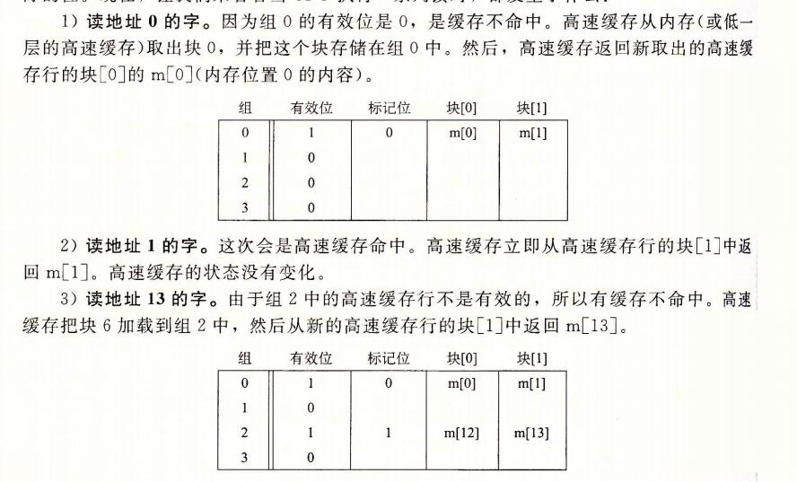

## 3、存储器层次结构

```
6.1节和6.2节描述了存储技术和计算机软件的一些基本的和持久的属性：

存储技术：不同存储技术的访问时间差异很大。速度较快的技术每字节的成本要比速度较慢的技术高，而且容量较小。CPU和主存之间的速度差距在增大。

计算机软件：一个编写良好的程序倾向于展示出良好的局部性。
```

```
计算机中一个喜人的巧合是，硬件和软件的这些基本属性互相补充的很完美。它们这种互相补充的性质使人想到一种组织存储器系统的方法，称为存储器层次结构(memory hierarchy)，所有的现代计算机系统中都使用了这种方法。图6-21展示了一个典型的存储器层次结构。
一般而言，从高层往底层走，存储设备变得更慢、更便宜和更大。
在最高层(L0),是少量快速的CPU寄存器，CPU可以在一个时钟周期内访问它们。
接下来是一个或多个小型到中型的基本SRAM的高速缓存存储器，可以在几个CPU时钟周期内访问他们。
然后是一个大的基于DRAM的主存，可以再几十个到几百个时钟周期内访问它们。
接下来是慢速但是容量很大的本地磁盘。
最后，有些系统甚至包括了一层附加的远程服务器上的磁盘，要通过网络来访问它们。
类似，万维网允许程序访问存储在世界上任何地方的web服务器的远程文件。
```


### 1、存储器层次结构中的缓存

```
一般而言，高速缓存(cache)是一个小而快速的存储设备，它作为存储在更大、也更慢的设备中的数据对象的缓冲区域。使用高速缓存的过程称为缓存(caching).
```

```
存储器层次结构的中心思想是，对于每个K，位于k层的更快更小的存储设备作为位于k+1层的更大更慢的存储设备的缓存。
换句话手，层次结构中的每一层都缓存来自较低一层的数据对象。
例如，本地磁盘作为通过网络从远程磁盘取出的文件(例如web页面)的缓存，主存作为本地磁盘上数据的缓存，以此类推，知道最小缓存--CPU寄存器组。
```

```
图6-22展示了存储器层次结构中缓存的一般性概念。
第k+1层的存储器被划分成连续的数据对象组块(chunk),称为块(block).
每个块都有一个唯一的地址或名字，使之区别于其他的块。
块可以是固定大小的(通常是这样的)，也可以是可变大小的(例如存储在web服务器上的远程HTML文件)。例如，图6-22中的k+1层存储器被划分成16个大小固定的块，编号为0~15.
```


```
类似地，第k层的存储器被划分成较小的块的集合，每个块的大小与k+1层的大小一样。
在任何时刻，第k层的缓存包括第k+1层块的一个子集的副本。例如，在图6-22中，第k层的缓存有4个块的空间，当前包含块4、9、14和3的副本。
```

```
数据总是以块大小为传送单元(transfer unit)在第k层和第k+1层之间来回复制的。
虽然在层次结构中任何一对相邻的层次之间块大小是固定的，但是其他的层次对之间可以有不同的块大小。

例如，在图6-21中，L1和L0之间的传送通常使用的是1个字大小的块。
L2和L1之间(以及L3和L2之间，L4和L3之间)的传送通常使用的是几十字节的块。
而L5和L4之间的传送用的是大小为几百或几千字节的块。
一般而言，层次结构中较低层(离CPU较远)的设备的访问时间较长，因此为了补偿这些较长的访问时间，倾向于使用较大的块。

也就是说块的划分是基于存储器的，基于不同的存储器，划分的块是不一样大的。
比如 L1和L0的块 是一个字的大小。
L1和L2的块就是 几十字节 的大小。
```


#### 1、缓存命中

```
当程序需要第K+1层的某个数据对象d时，它首先在当前存储在第k层的一个块中查找d。
如果d刚好缓存在k层中，那么就是我们所说的缓存命中(cache hit).
该程序直接从第k层读取d，根据存储器层次结构的性质，这要比从第k+1层读取d更快。例如，一个有良好时间局部性的程序可以从块14中读出一个数据对象，得到一个对k层的缓存命中。
```

#### 2、缓存不命中

```
另一方面，如果第k层中没有缓存数据对象d,那么就是我们所说的缓存不命中(cache miss).
当发生缓存不命中时，第k层的缓存从第k+1层缓存中取出包含d的那个块，如果第k层的缓存已经满了，可能就会覆盖现存的一个块。
```

```
覆盖一个现存的块的过程称为 替换(replacing)或驱逐(evicting)这个块。
被驱逐的这个块有时也称为牺牲块(victim block).
决定该替换哪个块是由缓存的替换策略(replacement policy)来控制的。

例如,一个具有随机替换策略的缓存会随机选择一个牺牲块。
一个具有最近最少被使用(LRU least recently used)替换策略的缓存会选择那个最后被访问的时间距现在最远的块。
```

```
在第k层缓存从第k+1层取出那个块之后，程序就能像前面一样从第k层读出d了。
例如，在图6-22中，在第k层中读块12中的一个数据对象，会导致一个缓存不命中，因为块12当前不在第k层缓存中。一旦把块12从第k+1层复制到第k层之后，它会保持在那里，等待稍后的访问。
```

#### 3、缓存不命中的种类

**冷不命中或强制性不命中**

```
区分不同种类的缓存不命中有时候是很有帮助的。如果第k层的缓存是空的，那么对任何数据对象的访问都会不命中。
一个空的缓存有时被称为冷缓存(cold cache),此类不命中称为强制性不命中(compulsory miss)或冷不命中(cold miss)。
冷不命中很重要，因为它们通常是短暂的事件，不会在反复访问存储器使得缓存暖身(warmed up)之后的稳定状态中出现。
```

```
只要发生了不命中，第k层的话缓存就必须执行某个放置策略(placement policy),确定把它从第k+1层中取出的块放在哪里。
最灵活的替换策略是允许来自第k+1层的任何块放在第k层的任何块中。
对于存储器层次结构中高层的缓存(靠近cpu)，它们是用硬件来实现的，而且速度是最优的，这个策略实现起来通常很昂贵，因为随机地放置块，定位起来代价很高。
```

```
因此，硬件缓存通常使用的是更严格的放置策略，这个策略将第k+1层的某个块限制放置在第k层的一个小的子集中(有时只是一个块)。

例如，在图6-22中，我们可以确定第k+1层的块i必须放置在第k层的块(i mod 4)中.
例如，第k+1层的块0、4、8和12会映射到k层的块 0;块1、5、9和13会映射到块1；以此类推
```

**冲突不命中**

```
这种限制性的放置策略会引起一种不命中，称为冲突不命中(conflict miss),在这种情况中，缓存足够大，能够保存被引用的数据对象，但是因为这些对象会映射到同一缓存块，缓存会一直不命中。

例如，在图6-22中，如果程序请求块0，然后块8，然后块0，然后块8，以此类推，在第k层的缓存中，对这两个块的每次引用都会不命中，即使这个缓存总共尅容纳4个块。
```

**容量不命中**

```
程序通常是按照一系列阶段(如循环)来运行的，每个阶段访问缓存块的某个相对稳定不变的集合。

例如，一个嵌套的循环可能会反复地访问同一个数组的元素。这个块的集合称为这个阶段的工作集(working set).
当工作集的大小超过了缓存的大小时，缓存会经历容量不命中(capacity miss).

换句话说就是，缓存太小了，不能处理这个工作集。
```

#### 4、缓存管理

```
正如我们提到过的，存储器层次结构的本质是，每一层存储设备都是较低一层的缓存。
在每一层上，某种形式的逻辑必须管理缓存。
这里，我们的意思是指某个东西要将缓存划分成块，在不同的层之间传送块，判定是命中还是不命中，并处理它们。管理缓存的逻辑可以是硬件、软件，或是两者的结合。
```

```
例如，编译器管理寄存器文件，缓存层次结构的最高层。它决定当发生不命中时何时发射加载，以及确定哪个寄存器来存放数据。
L1 L2 L3层的缓存完全是由内置在缓存中的硬件逻辑来管理的。
在一个有虚拟内存的系统中，DRAM主存作为存储在磁盘上的数据块的缓存，是由操作系统软件和CPU上的地址翻译硬件共同管理的。
对于一个具有想AFS这样的分布式文件系统的机器来说，本地磁盘作为缓存，它是由运行在本地机器上的AFS客户端进程管理的。
在大多数时候，缓存都是自动运行的，不需要程序采取特殊的或显示的行动。
```


### 2、存储器层次结构概念小结

```
概括来说，基于缓存的存储器层次结构行之有效，是因为较慢的存储设备比较快的存储设备更便宜，还因为程序倾向于展示局部性：

利用时间局部性：由于时间局部性，同一数据对象可能会被多次使用。一旦一个数据对象在第一次不命中时被复制到缓存中，我们就会期望后面对该目标有一系列的访问命中。因为缓存比低一层的存储设备更快，对后面的命中的服务会比最开始的不命中快很多。

利用空间局部性：块通常包含有多个数据对象。由于空间局部性，我们会期望后面对该块中其他对象的访问能够补偿不命中后复制该块的花费。
```

```
现代系统中到处都使用了缓存。正如从图6-23中能够看到的那样，CPU芯片、操作系统、分布式文件中和万维网上都使用了缓存。各种各样硬件和软件的组合构成和管理着缓存。
```


## 4、高速缓存存储器

```
早期计算机系统的存储器层次结构只有三层：CPU寄存器、DRAM主存储器和磁盘存储。不过，由于CPU和主存之间逐渐增大的差距，系统设计者被迫在CPU寄存器文件和主存之间插入了一个小的SRAM高速缓存存储器，称为L1高速缓存(一级缓存)，如图6-24所示。L1高速缓存的访问速度几乎和寄存器一样快，典型的是大约4个时钟周期。
```


```
随着CPU和主存之间的性能差距不断增大，系统设计者在L1缓存和主存之间又插入了一个更大的高速缓存，称为L2高速缓存，可以在大约10个时钟周期内访问到它。
有些现代系统还包括有一个更大的高速缓存，称为L3高速缓存，在存储器层次结构中，它位于L2高速缓存和主存之间，可以在大约50个周期内访问到它。虽然安排上有相当多的变化，但是通用原则是一样的。

对于下一节中的讨论，我们会假设一个简单的存储器层次结构，CPU和主存之间只有一个L1高速缓存。
```

### 1、通用的高速缓存存储器组织结构

```
考虑一个计算机系统，其中每个存储器地址有m位，形成 M=2^m 个不同的地址。

如图6-25a所示，这样一个机器的高速缓存被组织成一个有 S=2^s 个高速缓存组(cache set)的数组。
每个组包含 E 个高速缓存行(cache line).

每个行是由一个 B=2^b 字节的数据块(block)组成的，
一个有效位(valid bit)指明这个行是否包含有意义的信息，还有t=m-(b+s)个标记位(tag bit)(是当前块的内存地址的位的一个子集)，它们唯一的标识了存储在这个高速缓存行中的块。
```


```
一般而言，高速缓存的结构可以用元组(S,E,B,m)来描述。
高速缓存的大小(或容量)C指的是所有块的大小的和。标记位和有效位不包括在内。
因此，C=S*E*B

	当一条加载指令指令指示 CPU 从主存地址 A 中读一个字时，它将地址 A 发送到高速缓存。
如果高速缓存正保存着地址 A 处那个字的副本，它就立即将那个字发回给CPU。
那么高速缓存如何知道它是否包含地址A处那个字的副本的呢？
高速缓存的结构使得它能通过简单地检查地址位，找到所请求的字，类似于使用及其简单的哈希函数的哈希表。下面介绍它是如何工作的：
```

```
参数 S 和 B 将 m 个地址位分为了三个字段，如图6-25b所示。
A中 s 个组索引位是一个到 S 组的数组的索引。
第一个组是组0，第二个组是组1，依次类推。
组索引位被解释为一个无符号整数，它告诉我们这个字必须存储在哪个组中。
一旦我们知道了这个字必须放在哪个组中，A中的t个标记位就告诉我们这个组中哪一行包含这个字(如果有的话)。
当且仅当设置了有效位并且改行的标记位与地址A中的标记位相匹配时，组中的这一行才包含这个字。
一旦我们在由组索引标识的组中定位了由标号所标识的行，那么b 个块偏移位给出了在B个字节的数据块中的字偏移。
```


### 2、直接映射高速缓存

```
根据每个组的高速缓存行数E，高速缓存被分为不同的类。
每个组只有一行(E=1)的高速缓存称为直接高速缓存(direct-mapped cache)(见图6-27)。
直接映射高速缓存是最容易实现和理解的，所以我们会以它为例来说明一些高速缓存工作方式的通用概念。
```


```
假设我们有这样一个系统，它有一个CPU、一个寄存器文件、一个L1高速缓存和一个主存。
当 CPU执行一条读内存字w的指令，它向L1高速缓存请求这个字。
如果L1高速缓存有w的一个缓存的副本，那么就得到L1高速缓存命中，高速花奴才嫩会很快抽取出w，并将它返回给CPU。否则就是缓存不命中，当L1高速缓存向主存请求包含w的块的一个副本时，CPU必须等待。
当被请求的块最终从内存到达时，L1高速缓存将这个块存放在它的一个高速缓存行里，从被存储的块中抽取出字w,然后将它返回给CPU.
高速缓存确定一个请求是否命中，然后抽取出被请求的字的过程，分为三步：
1、组选择
2、行匹配
3、字抽取
```

#### 1、直接映射高速缓存的组选择

```
这一步中，高速缓存从w地址中间抽取出s个组索引位。
这些位被解释成一个对应于一个组号的无符号整数。
换句话来说，如果我们把高速缓存看成是一个关于组的一维数组，那么这些组索引位就是一个到这个数组的索引。

图6-28展示了直接映射高速缓存的组选择是如何工作的。
在这个例子中，组索引位 00001(2) 被解释为一个选择组 1 的整数索引。
```


#### 2、直接映射高速缓存中的行匹配

```
在上一步中我们已经选择了某个组 i，接下来的一步就要确定是否有字 w 的一个副本存储在组 i 包含的一个高速缓存行中。
在直接映射高速缓存中这很容易，而且很快，这是因为每个组只有一行。
当且仅当设置了有效位，而且高速缓存行中的标记与w的地址中的标记相匹配时，这一行中包含w的一份副本。
```

```
图6-29展示了直接映射高速缓存中匹配时如何工作的。在这个例子中，选中的组中只有一个高速缓存行。这个行的有效位设置了，所以我们知道标记和块中的位是有意义的。
因为这个高速缓存行中的标记位与地址中的标记位相匹配，所以我们知道我们想要的那个字的一个副本确实存储在这个行中。
换句话说，我们得到一个缓存命中。另一方面，如果有效位没有设置，或者标记不相匹配，那么我们就得到一个缓存不命中。
```


#### 3、直接映射高速缓存中的字选择

```
一旦命中，我们知道w就在这个块中的某个地方。最后一步确定所需要的字在块中是从哪里开始的。
如图6-29所示，块偏移位提供了所需要的字的第一个字节的偏移。就像我们把高速缓存看成一个行的数组一样，我们把块看成一个字节的数组，而字节偏移是倒这个数组的一个索引。在这个示例中，块偏移位是100(2),它表明w的副本时从块中的字节4开始的(我们假设字长为4字节)。
```

#### 4、直接映射高速缓存中不命中的行替换

```
如果缓存不命中，那么它需要从存储器层次结构中的下一层取出被请求的块，然后将新的块存储在组索引位指示的组中的一个高速缓存行中。
一般而言，如果组中都是有效高速缓存行了，那么必须要驱逐一个现存的行。对于直接映射高速缓存来说，每个组只包含有一行，替换策略非常简单：用新取出的行替换当前的行。
```

#### 5、综合：运行中的直接映射高速缓存

```
高速缓存用来选择组和标识行的机制极其简单，因为硬件必须在几个纳秒的时间内完成这些工作。
不过，用这种方式来处理位是很令人困惑的。
一句具体的例子能帮助解释清楚这个过程。假设我们有一个直接映射高速缓存，描述如下：(S,E,B,m) = (4,1,2,4)

换句话说，高速缓存有4个组，每个组一行，每个块2个字节，而地址是4位的。
我们还假设每个字都是单字节的。
```





#### 6、直接映射高速缓存中的冲突不命中

```
冲突不命中在真实的程序中很常见，会导致令人困惑的性能问题。
当程序访问大小为2的幂的数组时，直接映射高速缓存中通常会发生冲突不命中。
例如，考虑一个计算两个向量点积的函数：
```


```
因为用最高位作为组索引的话，相邻的地址全部只用一个组，其他组的高速缓存就用不上了。
```


### 3、组相联高速缓存

```
直接映射高速缓存中冲突不命中造成的问题源于每个组只有一行(或者，按照我们的术语来描述就是E=1)这个限制。

组相联高速缓存(set associative cache)放松了这条限制，所以每个组都保存有多于一个的高速缓存行。
一个 1 < E < C/B 的高速缓存通常称为E路组相联高速缓存。
在下一节中，我们会讨论 E=C/B 这种特殊情况。图6-32展示了一个2路组相联高速缓存的结构。
```


#### 1、组相联高速缓存中的组选择

```
它的组选择与直接映射高速缓存的组选择一样，组索引位标识组。
图6-33总结了这个原理。
```


#### 2、组相联高速缓存中的行匹配和字选择

```
组相联高速缓存中的行匹配比直接映射高速缓存中的更复杂，因为它必须检查多个行的标记位和有效位，以确定所请求的字是否在集合中。
传统的内存时一个值的数组，以地址作为输入，并返回存储在那个地址的值。
另一方面，相联存储器是一个(key,value)对的数组，以key为输入，返回与输入的key相匹配的(key,value)对中value值。
因此，我们可以把组相联高速缓存中的每个组都看成一个小的相联存储器，Key是标记和有效位，而value就是块的内容。
```


```
图6-34展示了相联高速缓存中行匹配的基本思想。
这里的一个重要思想就是组中的任何一行都可以包含任何映射到这个组的内存块。
所以高速缓存必须搜索组中的每一行，寻找一个有效的行，其标记与地址中的标记相匹配。如果高速缓存找到了这样一行，那么我们就命中，块偏移从这个块中选择一个字，和前面一样。
```


#### 3、组相关联高速缓存中不命中时的行替换

```
如果CPU请求的字不在组的任何一行，那么就是缓存不命中，高速缓存必须从内存中取出包含这个字的块。
不过，一旦高速缓存取出了这个块，该替换哪个行呢？
当然，如果有一个空行，那它就是一个很好的候选。但是如果该组中没有空行，那么我们必须从中选择一个非空的行，希望CPU不会很快引用这个被替换的行。
```

```
程序员很难再代码中利用高速缓存替换策略，所以在此我们不会过多的讲述其细节。
最简单的替换策略是随机选择要替换的行.
其他更复杂的策略利用了局部性原理，以使在比较近的将来引用被替换的行的概率最小。
例如，最不常用使用(Least-Frequently-Used, LFU)策略会替换在过去某个时间窗口内引用次数最少的那一行。
最近最少使用(Least-Recently-Used,LRU)策略会替换最后一次访问时间最久远的那一行。
所有这些策略都需要额外的时间和硬件。但是，越往存储器层次结构下面走，远离CPU，一次不命中的开销就会更加昂贵，用更好的替换策略使得不命中最少也变得更加值得了。
```


### 4、全相联高速缓存

```
全相联高速缓存(fully associative cache) 是由一个包含所有高速缓存行的组(即 E=C/B)组成的。图6-35给出了基本结构。
```


#### 1、全相联高速缓存中的组选择

```
全相联高速缓存中的组选择非常简单，因为只有一个组，图6-36做了个小结。注意地址中没有组索引位，地址只被划分成了一个标记和一个块偏移。
```


#### 2、全相联高速缓存中的行匹配和字选择

```
全相联高速缓存中的行匹配和字选择与组相联高速缓存中的是一样的，如图6-37所示。
它们之间的区别主要是规模大小的问题。
```


```
因为高速缓存电路必须并行的搜索许多相匹配的标记，构造一个又大又快的相联高速缓存很困难，而且很昂贵。
因此，全相联高速缓存值适合做小的高速缓存，例如虚拟内存系统中的翻译备用(TLB),它缓存页表项(见9.6.2节)
```

### 5、有关写的问题

```
正如我们看到的，高速缓存关于读的操作非常简单。
首先，在高速缓存中查找所需字w的副本。如果命中，立即返回字w给CPU。如果不命中，从存储器层次结构中较低层中取出包含字w的块，将这个块存储到某个高速缓存行中(可能会驱逐一个有效的行)，然后返回字w.
```

```
写的情况就要复杂一些了。假设我们要写一个已经缓存了的字w(写命中，write hit).
在高速缓存更新了它的w的副本之后，怎么更新w在层次结构中紧接着低一层中的副本呢？
最简单的方法，称为直写(write-through),就是立即将w的高速缓存块写回到紧接着的低一层中。
虽然简单，但是直写的缺点是每次写都会引起总线流量。

另一种方法，称为写回(write-back),尽可能的推迟更新，只有当替换算法要驱逐这个更新过的块时，才把它写到紧接着的低一层中。
由于局部性，写回能显著的减少总线流量，但是它的缺点是增加了复杂性。(一个块好多数据可能都被修改过了，才写回。  不会像直写，块里面的一个字被修改了就要写回到低一层的缓存中。)

高速缓存必须为每个缓存行维护一个额外的修改位(dirty bit),表明这个高速缓存块是否被修改过。
```

```
另一个问题是如何处理写不命中。
一种方法，称为写分配(write-allocate), 加载相应的低一层中的块到高速缓存中，然后更新整个高速缓存块。
写分配试图利用写的空间局部性，但是缺点是每次不命中都会导致一个块从低一层传送到高速缓存。

另一种方法，称为非写分配(not-write-allocate),避开高速缓存，直接把这个字写到低一层中。
直写高速缓存通常是非写分配的。
写回高速缓存通常是写分配的。
```

```
为写操作优化高速缓存是一个细致而困难的问题，在此我们只略讲皮毛。
细节随系统的不同而不同，而且通常是私有的，文档记录不详细。
对于试图编写高速缓存比较友好的程序的程序员来说，我们建议在心里采用一个使用写回和写分配的高速缓存的模型。
这样建议有几个原因：

通常，由于较长的传送时间，存储器层次结构中较低层的缓存更可能使用写回，而不是直写。
例如，虚拟内存系统(用主存作为存储在磁盘上的块的缓存)只使用写回。
但是由于逻辑电路密度的提高，写回的复杂性也越来越不成为阻碍了。
我们在现代系统的所有层次上都能看到写回缓存。所以这种假设符合当前的趋势。

假设使用写回写分配的另一个原因是，它与处理读的方式相对称，因为写回写分配试图利用局部性。
因此，我们可以在高层次上开发我们的程序，展示良好的空间和时间局部性，而不是试图为某一个存储器系统进行优化。
```

### 6、一个真实的高速缓存层次结构的解剖

```
到目前为止，我们一直假设高速缓存值保存程序数据。不过，实际上，高速缓存既保存数据，也保存指令。
Random access memory
只保存指令的高速缓存称为 i-cache(instruct).
只保存程序数据的高速缓存称为d-cache(data).
即保存指令有包括数据的高速缓存称为统一的高速缓存(unified cache).

现代处理器包括独立的i-cache和 d-cache。这样做有很多原因。
有两个独立的高速缓存，处理器能够同时读一个指令字和一个数据字。
i-cache通常是只读的，因此比较简单。
通常会针对不同的访问模式来优化这两个高速缓存，它们可以有不同的块大小，相联度和容量。
使用不同的高速缓存也确保了数据访问不会与指令访问形成冲突不命中，反过来也是一样，代价就是可能会引起容量不命中增加。
```


### 7、高速缓存参数的性能影响

```
有许多指标来衡量高速缓存的性能：

不命中率(miss rate):在一个程序执行或程序的一部分执行期间，内存引用不命中的比率。它是这样计算的：不命中数量/引用数量.

命中率(hit rate)：命中的内存引用比率。它等于 1-不命中率。

命中时间(hit time):从高速缓存传送到一个字到CPU所需的时间，包括组选择、行确认和字选择的时间。对于L1高速缓存来说，命中时间的数量级是几个时钟周期。

不命中处罚(miss penalty)：由于不命中所需要的额外的时间。
L1不命中需要从L2得到服务的处罚，通常是数10个周期；
从L3得到服务的处罚，50个周期
从主存得到服务的处罚，200个周期
```


#### 1、高速缓存大小的影响

```
一方面，较大的高速缓存可能会提高命中率。
另一方面，使大存储器运行的更快总是要难一些的。
结果，较大的高速缓存可能会增加命中时间。
这解释了为什么L1高速缓存比L2高速缓存小，以及为什么L2高速缓存比L3高速缓存小。
```

#### 2、块大小的影响

```
大的块有利有弊。一方面，较大的块能利用程序中可能存在的空间局部性，帮助提高命中率。
不过，对于给定的高速缓存大小，块越大就意味着高速缓存行数越少，这会损害时间局部性比空间局部性更好的程序中的命中率。(因为高速缓存行变少了，所以可能本来能命中的数据，因为行数变少了，变得不能命中了。比如 old:a,b,c,d  now:a,b  就少了 c,d 命中率就变低了)。

较大的块对不命中处罚也有负面影响，因为块越大，传送时间就越长。
现代系统(如  Core i7)会折中使高速缓存块包含64个字节。
```

#### 3、相联度的影响

```
这里的问题是参数E选择的影响，E是每个组中高速缓存行数。
较高的相联度(也就是E的值较大)的优点是降低了高速缓存由于冲突不命中出现抖动的可能性。
不过，较高的相联度会造成较高的成本。
较高的相联度实现起来很昂贵，而且很难使之速度变快。
每一行需要更多的标记位，每一行需要额外的LRU状态位和额外的控制逻辑。
较高的相联度会增加命中时间，因为复杂性增加了，
另外，还会增加不命中的处罚，因为选择牺牲行的复杂度也增加了。
```

```
相联度的选择最终变成了命中时间和不命中处罚之间的折中. 传统上，努力争取时钟频率的高性能系统会为L1高速缓存选择较低的相联度(这里的不命中处罚只是几个周期)，而在不命中处罚比较高的较低层上使用较小的相联度。(感觉应该是较高)。

例如，Inter Core I7 系统中，L1和L2高速缓存是8路组相联的，而L3高速缓存是16路组相联的。
```

#### 4、写策略的影响

```
直写高速缓存比较容易实现，而且能使用独立于高速缓存的写缓冲区(write buffer),用来更新内存。
此外，读不命中开销没这么大，因为它们不会触发内存写。

另一方面，写回高速缓存引起的传送比较少，它允许更多的到内存的带宽用于执行DMA的I/O设备。
此外，越往层次结构下面走，传送时间增加，减少传送的数量就变得更加重要。一般而言，高速缓存越往下层，越可能使用写回而不是直写。
```


#### 旁注 高速缓存行、组和块有什么区别？

```
很容易混淆高速缓存行、组和块之间的区别。让我们来回顾一下这些概念，确保概念清晰：

B=2^b 块：是一个固定大小的信息包，在高速缓存和主存(或下一层高速缓存)之间来回传递。块的大小根据不同的缓存有不同的大小，比如 L1和L2之间是64字节。L2和L3之间可能是128字节。  在 inter core i7 里面 高速缓存之间的块的大小都是 64B,L1总大小是 32KB L2是256KB,L3是8MB

E 行：是高速缓存中的一个容器，存储块以及其他信息(例如有效位和标记位)。

S =2^s 组：是一个或多个行的集合。直接映射高速缓存中的组只由一行组成。组相联和全相联高速缓存中的组是由多个行组成的。


在直接映射高速缓存中，组和行实际上是等价的。不过，在相联高速缓存中，组和行是很不一样的，这两个词不能互换使用。

因为一行总是存储一个块，术语"行"和"块"通常互换使用。
例如，系统专家总是说高速缓存的"行大小"，实际上他们值得是块大小。这样的用法十分普遍，只要你理解块和行之间的区别，它不会造成任何误会。
```


