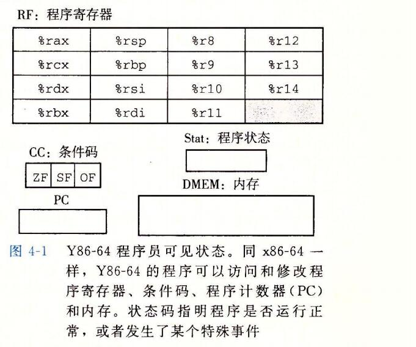
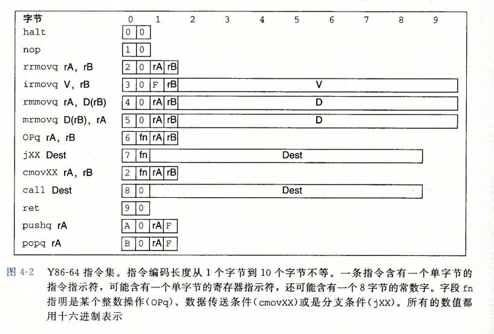

## 字

```
字：
	贯穿整个系统的是一组电子管道，称作总线，它携带信息字节并负责在各个部件见传递。通常总线被设计成传送定长的字节块，也就是字(word).
```


## 1、Y86-64指令集体系结构

```
定义一个指令集体系结构(例如 Y86-64)包括定义各种状态单元、指令集和它们的编码、一组编程规范和异常事件处理。

通过一个简易的自己创建的 指令集体系来了解 x86-64 指令集
```

### 1、程序员可见的状态



```
如上图所示，Y86-64程序中的每条指令都会读取或修改处理器状态的某些部分。这称为程序员可见状态。(这里的程序员即可以是 使用汇编代码的人也可以是产生机器级代码的编译器)

在处理器实现中，只要我们保证机器级程序能够访问程序员可见状态，就不需要完全按照 ISA 暗示的方式来表示和组织这个处理器状态。

上图的14个寄存器
每个程序寄存器存储一个 64 位的字。寄存器 %rsp 被入栈、出栈、调用和返回指令作为栈指针。除此之外，寄存器没有固定的含义或固定值。有3个一位的条件码;ZF SF OF,
zero sign overflow ，它们保存着最近的算术或逻辑指令所造成影响的有关信息。

程序计数器(PC)存放当前正在执行的指令的地址。
```

```
程序状态的最后一个部分是状态码 stat, 它表明程序执行的总体状态。它会指示是正常运行，还是出现了某种异常。
```


### 2、Y86-64指令

```
Y86-64指令的两个内存传送指令中的内存引用的方式是简单的基址和偏移量形式。不支持变址寄存器和寄存器值的伸缩。

OPq(operator(运算符)) 指令 指的是 addq、subq 之类的指令。

特殊指令 halt(停止)：
	halt指令停止指令的执行。 x86-64 中有一个与之相当的指令 hlt.x86-64的应用程序不允许使用这条指令，因为它会导致整个系统暂停运行。对于 y86-64 来说，指令 halt 指令会导致处理器停止，并将状态码设置为 HLT.
```



```
D Dest destination  内存地址
V immediate 立即数
F 表示不用寄存器; 
rA rB 表示寄存器A 寄存器B  register


```


### 3、指令编码

```
图 4-2 还给出了指令的字节级编码。每条指令需要 1~10 个字节不等，这取决于需要哪些字段。
```


