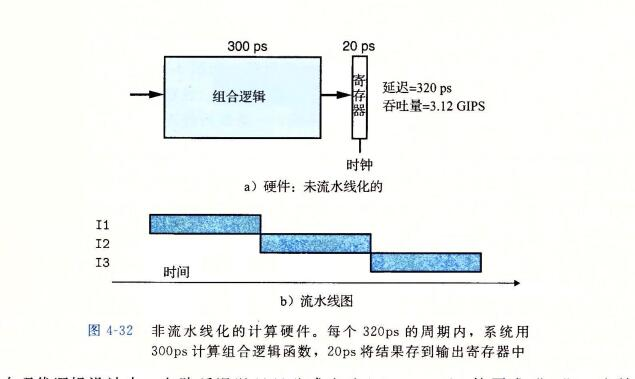

## 字

```
字：
	贯穿整个系统的是一组电子管道，称作总线，它携带信息字节并负责在各个部件见传递。通常总线被设计成传送定长的字节块，也就是字(word).
```

## 组合逻辑(电路)和时序逻辑(电路)

```
数字电路根据逻辑功能的不同特点，可以分成两大类，一类叫组合逻辑电路（简称组合电路），另一类叫做时序逻辑电路（简称时序电路）。

组合逻辑电路在逻辑功能上的特点是任意时刻的输出仅仅取决于该时刻的输入，与电路原来的状态无关。

而时序逻辑电路在逻辑功能上的特点是任意时刻的输出不仅取决于当时的输入信号，而且还取决于电路原来的状态，或者说，还与以前的输入有关。


时序电路，是由最基本的逻辑门电路加上反馈逻辑回路（输出到输入）或器件组合而成的电路，与组合电路最本质的区别在于时序电路具有记忆功能。
```


## 1、Y86-64指令集体系结构

```
定义一个指令集体系结构(例如 Y86-64)包括定义各种状态单元、指令集和它们的编码、一组编程规范和异常事件处理。

通过一个简易的自己创建的 指令集体系来了解 x86-64 指令集
```

### 1、程序员可见的状态


```
如上图所示，Y86-64程序中的每条指令都会读取或修改处理器状态的某些部分。这称为程序员可见状态。(这里的程序员即可以是 使用汇编代码的人也可以是产生机器级代码的编译器)

在处理器实现中，只要我们保证机器级程序能够访问程序员可见状态，就不需要完全按照 ISA 暗示的方式来表示和组织这个处理器状态。

上图的14个寄存器
每个程序寄存器存储一个 64 位的字。寄存器 %rsp 被入栈、出栈、调用和返回指令作为栈指针。除此之外，寄存器没有固定的含义或固定值。有3个一位的条件码;ZF SF OF,
zero sign overflow ，它们保存着最近的算术或逻辑指令所造成影响的有关信息。

程序计数器(PC)存放当前正在执行的指令的地址。
```

```
程序状态的最后一个部分是状态码 stat, 它表明程序执行的总体状态。它会指示是正常运行，还是出现了某种异常。
```


### 2、Y86-64指令

```
Y86-64指令的两个内存传送指令中的内存引用的方式是简单的基址和偏移量形式。不支持变址寄存器和寄存器值的伸缩。

OPq(operator(运算符)) 指令 指的是 addq、subq 之类的指令。

特殊指令 halt(停止)：
	halt指令停止指令的执行。 x86-64 中有一个与之相当的指令 hlt.x86-64的应用程序不允许使用这条指令，因为它会导致整个系统暂停运行。对于 y86-64 来说，指令 halt 指令会导致处理器停止，并将状态码设置为 HLT.
```


```
D Dest destination  内存地址
V immediate 立即数
F 表示不用寄存器; 
rA rB 表示寄存器A 寄存器B  register


```


### 3、指令编码

```
图 4-2 还给出了指令的字节级编码。每条指令需要 1~10 个字节不等，这取决于需要哪些字段。

每条指令的第一个字节表明指令的类型。这个字节分为两个部分，每部分 4 位：
	高 4 位是代码(code)部分，低4位是功能(function)部分。
如图 4-2 所示，代码值为 0~0xB。功能值只有在一组相关指令共用一个代码(code)时才有用。
```


```
如图 4-4 所示，15个程序寄存器中每个都有一个相对应的范围在 0 到 0xE 之间的寄存器标识符(register ID). Y86-64 中的寄存器编号跟 x86-64 中的相同。程序寄存器存在 CPU 中的一个寄存器文件中，

这个寄存器文件就是一个小的、以寄存器ID 作为地址的随机访问存储器。

在指令编码中以及在我们的硬件设计中，当需要指令不应该访问任何寄存器时，就用ID值 0xF 来表示。
```


```
有的指令只有一个字节长，而有的需要操作数的指令编码就更长一些。首先，可能有附加寄存器指示符字节(register specifier byte),指定一个或两个寄存器。
在图4-2中，这些寄存器字段称为 rA- rB。 从指令的汇编代码中可以看到，根据指令类型，指令可以指定用于数据源和目的的寄存器，或是用于地址计算的基址寄存器。

没有寄存器操作数的指令，例如，分支指令和 call 指令，就没有寄存器指示符字节。

那些只需要一个寄存器操作数的指令(irmovq pushq popq)将另一个寄存器指示符 OxF 。这种约定在我们处理器实现中非常有用。
```


```
有些指令需要一个附加的 4 字节常数字(constant word).这个字能作为 irmovq 的立即数数据， rmmovq 和 mrmovq 的地址指示符的偏移量，以及分支指令和调用指令的目的地址。

注意，分支指令和调用指令的目的是一个绝对地址。

所有整数采用小端法编码。
```


### 4、Y86-64异常

```
对 Y86-64 来说，程序员可见的状态 状态码(stat)，它描述程序执行的总体状态。这个代码可能的值如图 4-5 所示。
```


```
代码值 1，命名为 AOK，表示程序执行正常，而其他一些代码则表示发生了某种类型的异常。

代码值 2，命名为 HLT，表示处理器执行了一条 halt 指令。

代码值 3，命名为 ADR，表示处理器试图从一个非法内存地址读或者向一个非法内存地址写，可能是当取指令的时候，也可能是当读或者写数据的时候。我们会限制最大的地址(确切的限定值因实现而异)，任何访问超出这个限定值的地址都会引发 ADR 异常。

代码4，命名为 INS， 表示遇到了非法的指令代码。
```


### 6、一些 Y86-64 指令的详情

```
大多数 Y86-64 指令是以一种直接明了的方式修改程序状态的，所以定义每条指令想要达到的结果并不困难。不过，两个特别的指令的组合需要特别注意一下。

pushq %rsp 和 popq %rsp
```

```
pushq d指令会把栈指针减 8， 并且将一个寄存器值写入内存中。因此，当执行 pushq %rsp 指令时，处理器的行为是不确定的，因为要入栈的寄存器会被同一条指令修改。通常有两种不同的约定： 
	1、压入 %rsp的原始值。
	2、压入减去 8 的 %rsp 的值。
	
	不同处理器的细节可能是不一样的。所以一般编译器并不会用个push 和 pop 指令
```


## 2、逻辑设计和硬件控制语言 HCL

```
 在硬件设计中，用电子电路来计算对位进行运算的函数，以及在各种存储器单元中存储位。大多数现代电路技术都是用信号线上的高电压或低电压表示不同的位值。
 
 在当前的技术中，逻辑 1 是用 1.0 伏特左右的高电压表示的，而逻辑 0 是用 0.0 伏特左右的低电压表示的。要实现一个数字系统需要三个主要的组成部分：
 计算对位进行操作的函数的组合逻辑、
 存储位的存储器单元，
 以及控制存储器单元更新的时钟信号。
 
 HCL (Hardware Control Language)硬件控制语言
```

### 1、逻辑门

```
逻辑门是数字电路的基本计算单元。它们产生的输出，等于它们输入位值的某个布尔函数。

逻辑门只对单个位的数进行操作，而不是整个字。

逻辑门可以 n 路操作， n>2;

比如 输入为 a b c;  a&&b&&cs
```


### 2、组合电路和HCL布尔表达式

```
将很多逻辑门组合成一个网，就能构建计算块(computational block),称为组合电路(combinational circuits).

如何构建这些网有几个限制：

	-每个逻辑门的输入必须连接到下述选项之一：
		1、系统输入(称为主输入)
		2、某个存储器单元的输出
		3、某个逻辑门的输出
	
	-两个或多个逻辑门的输出不能连接在一起。否则它们可能会使线上的信号矛盾，可能会导致一个不合法的电压或电路故障。
	
	-这个网必须是无环的。也就是在网中不能有路径经过一系列的门而形成一个回路，这样的回路会导致该网络计算的函数有歧义。
	
	
```


```
图 4-10 是一个我们觉得非常有用的简单 组合电路的例子。它有两个输入 a 和 b, 有唯一的输出 eq,当 a 和 b 都是 1 (从上面的  AND 门可以看出)或都是 0(从下面的 AND 门可以看出)时，输出为 1. 用 HCL 来写这个网的函数就是 ：
bool eq = (a&&b) || (!a&&!b);

这段代码简单的定义了位级(数据类型 bool 表明了这一点)信号 eq, 它是输入 a 和 b 的函数。从这个例子可以看出 HCL 使用了 C 语言风格的语法， '=' 将一个信号名与一个表达式联系起来。不过同 C 不一样，我们不把它看成执行了一次计算并将结果放入内存中某个位置。相反，它只是给表达式一个名字.
```


```
图 4-11 给出了 另一个简单但很有用的组合电路，称为 多路复用器(multiplexor，通常称为 'MUX') .多路复用器根据输入控制信号的值，从一组不同的数据信号中选一个。

在这个单个位的多路复用器中，两个数据信号是输入位 a 和 b，控制信号是输入位 s。当 s 为 1时，输出等于 a； 而当 s 为 0 时，输出等于 b。

```

### 3、字级的组合电路和 HCL 整数表达式

```
通过将逻辑门组合成大的网，可以构造出能计算更加复杂函数的组合电路。
通常，我们设计能对数据字(word)进行操作的电路。
有一些位级信号，代表一个整数或一些控制模式。
```


```
	处理器中会用到很多种多路复用器，使得我们能根据某些控制条件，从许多源中选出一个滋. 在 HCL 中，多路复用函数式是用 情况表达式(case expression)来描述的。情况表达式的通用格式如下：
```


```
在这段代码中，第二个选择表达式就是 l,表明如果前面没有情况被选中，那就选择这种情况。这是 HCL 中一种指定默认情况的方法。几乎所有的情况表达式都是以此结尾的。

表达式互斥 指的是 A,B 两个条件。
A：{1,2，3} 这三个满足一个就可以了
B:{2,4,5} 这三个满足一个就可以了

此时如果是 2的话  A 或者 B  满足的。因为 A和B里面有交集 这种的就是不互斥的。

A:{1,2}
B:{3,4} 
这种的就是互斥的。 没有交集
```


### 4、ALU

```
组合逻辑电路可以设计成在字级数据上执行许多不同类型的操作。具体的设计已经超出了我们套路的范围。

算术/逻辑单元(ALU)是一种很重要的组合电路，图4-15 是它的一个抽象的图示。这个电路有三个输入：
标号为 A 和 B 的两个数据输入，以及一个控制输入。

根据控制输入的设置，电路会对数据输入执行不同的算术或逻辑操作。
可以看到，这个 ALU 中画的四个操作对应于 Y86-64 指令集支持的四种不同的整数操作，而控制值和这些操作相对应。我们还注意到减法的操作数顺序，是输入B减去输入A。
之所以这样做，是为了使这个顺序与 subq 指令的参数顺序一致。
```


### 5、集合关系

```
在处理器设计中，很多时候都需要将一个信号与许多可能匹配的信号作比较，以此来检测正在处理的某个指令代码是否属于某一类指令代码。
```


### 6、存储器和时钟

```
时序电路，是由最基本的逻辑门电路加上反馈逻辑回路（输出到输入）或器件组合而成的电路，与组合电路最本质的区别在于时序电路具有记忆功能。
```


```
组合电路从本质上讲，不存储任何信息。相反，它们只是简单的响应输入信号，产生等于输入的某个函数的输出。
为了产生时序电路(swquential circuit)，我们必须引入按位存储信息的设备。

存储设备都是由同一个时钟控制的，时钟是一个周期性信号，决定什么时候要把新值加载到设备中。
考虑两类存储器设备：
 - 时钟寄存器(简称寄存器)存储单个位或字。时钟信号控制寄存器加载输入值。
 
 -随机访问存储器(简称内存)存储多个字，用地址来选择该读或该写哪个字。
 随机访问存储器的例子包括：
 	1）处理器的虚拟内存系统，硬件和操作系统结合起来使处理器可以在一个很大的地址空间内访问任意的字;
 	2)寄存器文件，在此，寄存器标识符作为地址。在IA32或Y86-64处理器中，寄存器文件有 15 个寄存器(%rax~%r14).
```

```
正如我们看到的那样，在说到硬件和机器级编码时，"寄存器"这个词是两个有细微差别的事情。
在硬件中，寄存器直接将它的输入和输出线连接到电路的其他部分。

在机器级编码中，寄存器代表的是  CPU 中为数不多的可寻址的字，这里的地址时寄存器ID。这些字通常都存在寄存器文件中，虽然我们会看到硬件有时可以直接将一个字从一个指令传送到另一个指令，以避免先写寄存器文件再读出来的延迟。

需要避免歧义时，我们会分别称呼这两类寄存器为"硬件寄存器"和"程序寄存器"。
```


```
图4-16更详细地说明了一个硬件寄存器以及它是如何工作的。
大多数时候，寄存器都保持在稳定状态(用 x 表示)，产生的输出等于它的当前状态。
信号沿着寄存器前面的组合逻辑传播，这时，产生了一个新的寄存器输入(用 y 表示)，但只要时钟是低电位的，寄存器的输出就仍然保持不变。
当时钟变成高电位的时候，输入信号就加载到寄存器中，称为下一个状态 y, 直到下一个时钟上升沿，这个状态就一直是寄存器的新输出。
关键是寄存器是作为电路不同部分中的组合逻辑之间的屏障。每当每个时钟到达上升沿是时，值才会从寄存器的输入传送到输出。

我们的 Y86-64 处理器会用时钟寄存器保存程序计数器(PC)、条件代码(CC)和程序状态(Stat).
```


```
寄存器文件有两个读端口(A和B)，还有一个写端口(W).这样一个多端口随机访问存储器允许同时进行多个读和写操作。图中所示的寄存器文件中，电路可以读两个程序寄存器的值，同事更新第三个寄存器的状态。
每个端口都有一个地址输入，表明该选择哪个程序寄存器，另外还有一个数据输出或对应该程序寄存器的输入值。
地址是由图 4-4 中编码表示的寄存器标识符。两个读端口有地址输入 srcA 和 srcB("sourceA"和"sourceB" 的缩写)和数据输出 valA 和 valB(value).
写端口有地址输入dstW(destination W),以及数据输入 valW.
```

```
虽然寄存器文件不是组合电路，因为它有内部存储。不过，在我们实现中，从寄存器文件读数据就好像它是一个以地址为输入、数据为输出的一个组合逻辑块。当 srcA 或 srcB  上。例如,将 srcA 设为 3.就会读出程序寄存器 %rbx 的值，然后这个值就会出现在输出 valA 上.
```

```
向寄存器文件写入字是由时钟信号控制的,控制方式类似于将值加载到时钟寄存器.每次时钟上升时,输入 valW 上的值会被写入输入 dstW 上的寄存器ID 指示的程序寄存器。

当dstW 设为特殊的 ID 值 0xF 时，不会写任何程序寄存器。 
```


```
内存类似于寄存器文件。

这个内存有一个地址输入，一个写的数据输入，以及一个读的数据输出。同寄存器文件一样，从内存中读的操作方式类似于组合逻辑: 
	如果我们在输入 address 上 提供一个地址，并将 write 控制信号设置为 0，那么在经过一些延迟之后，存储在那个地址上的值会出现在输出 data 上。
	如果地址超出了范围，error信号会设置为1，否则就设置为 0.
	
	
写内存是由时钟控制的：
我们将 address 设置为期望的地址，将 data in  设置为期望的值，而 write 设置为 1.	然后当我们控制时钟时，只要地址时合法的，就会更新内存中指定的位置。对于读操作来说，如果地址是不合法的， error 信号会被设置为 1.这个信号是由组合逻辑产生的，因为所需要的边界检查纯粹就是地址输入的函数，不涉及任何状态。

读用 write 0. 写用 write 1

寄存器有两个读一个写。
内存有一个读一个写。
```

```
	我们的处理器还包括另外一个只读存储器，用来读指令。在大多数实际系统中，这两个存储器被合并为一个具有双端口的存储器，一个用来读指令，另一个用来读或者写数据。
```


## 3、Y86-64的顺序实现

```
现在已经有了实现 Y86-64 处理器所需要的部件。首先，我们描述一个称为 SEQ(sequential 顺序的)的处理器。每个时钟周期上，SEQ执行处理一条完整指令所需的所有步骤。不过，这需要一个很长的时钟周期时间，因此时钟周期频率会低到不可接受。我们开发 SEQ 的目标就是提供实现最终目的的第一步，我们的最终目的是实现一个高效的、流水线化的处理器。
```

### 1、将处理组织成阶段

```
通常，处理一条指令包括很多操作。将它们组织成某个特殊阶段序列，即使指令的动作差异很大，但所有的指令都遵循统一的序列。每一步的具体处理取决于正在执行的指令。创建这样一个框架，我们就能设计一个充分利用硬件的处理器。
下面是关于各个阶段以及各阶段内执行操作的简略描述：
	
	
```

#### 取指(fetch)

```
取指(fetch): 取指阶段从内存读取指令字节，地址为程序计数器(PC)的值。
从指令中抽取出指令指示符字节的两个四位部分，称为 icode(指令代码) 和 ifun(指令功能)。
它可能取出一个寄存器指示符字节，指明一个或两个寄存器操作数指示符 rA 和 rB.
它还可能取出一个四字常数字 valC. 
它按顺序方式计算当前指令的下一条指令的地址 valP. 
也就是说，valP 等于 PC 的值加上已取出指令的长度。
```

#### 译码(decode)

```
译码阶段从寄存器文件读入最多两个操作数，得到值 valA 和 valB. 
通常，它读入指令 rA 和 rB 字段指明的寄存器，不过有些指令是读寄存器 %rsp 的。
```

#### 执行(execute)

```
在执行阶段, 算术/逻辑单元(ALU)要么执行指令指明的操作(根据 ifun 的值)，计算内存引用的有效地址，要么增加或减少栈指针。得到的值我们称为 valE.在此，也可能设置条件码。
对一条条传送指令来说，这个阶段会检验条件码和传送条件(由 ifun 给出)，如果条件成立，则更新目标寄存器。
同样，对于一条跳转指令来说，这个阶段会决定是不是应该选择分支。
```

#### 访存(memory)

```
访存阶段可以将数据写入内存，或者从内存读出数据。读出的值为 valM.
```

#### 写回(write back)

```
写回阶段最多可以写两个结果到寄存器文件。
```

#### 更新PC(pc  update)

```
将 PC 设置成下一条指令的地址。
```


```
处理器会无限循环，执行这些阶段。在我们简化的实现中，发生任何异常时，处理器就会停止：它执行halt 指令或非法指令，或它试图读或者写非法地址。
在更完整的设计中，处理器会进入异常处理模式，开始执行由异常的类型决定的特殊代码。
```

```
从前面的讲述可以看出，执行一条指令是需要进行很多处理的。
我们不仅必须执行指令所表明的操作，还必须计算地址、更新栈指针，以及确定下一条指令的地址。
幸好每条指令的整个流程都比较相似。
因为我们想使硬件数量尽可能少，并且最终将把它映射到一个二维的集成电路芯片的表面，在设计硬件时，一个非常简单而一致的结构是非常重要的。降低复杂度的一种方法是让不同的指令共享尽量多的硬件。
例如：我们的每个处理器设计都只含有一个算术/逻辑单元，根据所执行的指令类型的不同，它的使用方式也不同。在硬件上复制逻辑块的成本比软件中有重复代码的成本大得多。
```


#### 1、OPq、rrmovq、irmovq

```
整数操作指令的处理遵循上面列出的通用模式。在取指阶段，我们不需要常数字，所以 valP 就计算为 PC+2. 在译码阶段，我们要读两个操作数。
在执行阶段，它们和功能指示符 ifun 一起再提供给  ALU,这样一来 valE 就成为了指令结果。
这个计算使用表达式 valB OP valA 来表达的，这里 OP 代表ifun 指定的操作。
要注意两个参数的 顺序 --- 这个顺序与 Y86-64(和 x86-64)习惯是一致的。
```


```
执行 rrmovq 指令和执行算术运算类似。
不过，不需要取第二个寄存器操作数。我们将 ALU 的第二个输入设为 0，先把它和第一个操作数相加，得到 valE = varA,然后再把这个值写到寄存器文件。

对于 irmovq 的处理于此类似，除了 ALU 的第一个输入为常数值 valC.
另外，因为是长指令格式，对于 irmovq, 程序计数器必须加 10. 所有这些指令都不改变条件码。
```

#### 2、rmmovq、mrmovq


#### 3、pushq、popq


```
popq rA 写的有问题 正确的应该是
取指 
	icode:ifun <-- M1[PC]
	rA:rB <-- M1[PC+1]
	valP <-- PC+2
译码
	valA <-- R[%rsp]
	valB <-- R[%rsp]
执行
	valE <-- valB + 8
访存
	valM <-- M8[valB]
写回
	R[%rsp] <-- valE
	R[rA] <-- valM

M1 表示M里面取一个字节;
```

```
pushq 指令开始时很像我们前面讲过的指令，但是在译码阶段，用 %rsp 作为第二个寄存器操作数的标识符，将栈指针赋值为 valB. 在执行阶段，用ALU将栈指针减8.
减过 8 的值就是内存写的地址，在写回阶段还会存回到 %rsp 中。
```

```
popq 指令的执行与 pushq 的执行类似，除了在译码阶段要读两次栈指针以外。这样做看上去很多余，但是我们会看到让 valA 和 valB 都存放栈指针的值，会使后面的流程跟其他的指令更相似，增强设计的整体一致性。
在执行阶段，用 ALU 给栈指针加 8，但是用没加过 8 的原始值作为内存操作的地址。在写回阶段，要用加过8的栈指针更新栈指针寄存器，还要将寄存器 rA 更新为从内存中读出的值。
```

#### 4、jxx、call、ret


```
同对整数操作一样，我们能够以一种统一的方式处理所有的跳转指令，因为它们的不同只在于判断是否要选择分支的时候。除了不需要一个寄存器指示符字节以外，跳转指令在取指和译码阶段都和前面讲的其他指令类似。
```


### 2、SEQ(sequential) 硬件结构

```
实现所有 Y86-64 指令所需要的计算可以被组织成 6 个基本阶段：取指、译码、执行、访存、写回、更新PC。

图 4-22 给出了一个能执行这些计算的硬件结构的抽象表示。
程序计数器放在了寄存器中，在图中左下角(表明为 "pc").然后，信息沿着线流动(多条线组合在一起就用宽一点的灰线来表示)，先向上，再向右。
同阶段相关的硬件单元(hardward units)负责执行这些处理。在右边，反馈线路向下，包括要写到寄存器文件的更新值，以及更新程序计数器值。
在 SEQ 中，所有硬件单元的处理都在一个时钟周期内完成。这张图省略了一些小的组合逻辑块，还省略了所有用来操作各个硬件单元以及将相应的值路由到这些单元的控制逻辑。稍后会补充这些细节。
我们从下往上画处理器和流程的方法似乎有点奇怪。在开始设计流水线化的处理器时，我们会解释这么画的原因。
```

```
硬件单元与各个处理阶段相关联：

取指(fetch)：将程序计数器寄存器作为地址，指令内存读取指令的字节。PC增加器(PC incrementer) 计算 valP,即增加了的程序计数器。

译码(decode): 寄存器文件有两个读端口 A 和 B，从这两个端口同时读寄存器值 valA 和 val.

执行(execute): 执行阶段会根据指令的类型，将算术/逻辑单元(ALU)用于不同的目的。对整数操作，它要执行指令所指定的运算。对其他指令，它会作为一个加法器来计算增加或减少栈指针，或者计算有效地址，或者只是简单的加 0，将一个输入传递到输出。

条件寄存器(CC)有三个条件码位。ALU负责计算条件码的新值。当执行条件传送指令时，根据条件码和传送条件来计算决定是否更新目标寄存器。同样，当执行一条跳转指令时，会根据条件码和跳转类型来计算分支信号 cnd.

访存：在执行访存操作时，数据内存读出或写入一个内存字。指令和数据内存访问的是相同的内存位置，但是用于不同的目的。

写回：寄存器文件有两个写端口。端口 E 用来写 ALU 计算出来的值，而端口 M 用来写从数据内存中读出的值。

PC更新：程序计数器的新值选择自：valP，下一条指令的地址;valC,调用指令或跳转指令指定的目标地址; valM,从内存读取的返回地址。
```


```
图 4-23 更详细的给出了实现 SEQ 所需要的硬件单元，但是现在线路看的更清楚了。这幅图以及其他的硬件图都是用的是下面的画图惯例。

白色方框表示时钟寄存器。程序计数器PC是SEQ中唯一的时钟寄存器。

浅蓝色方框表示硬件单元：包括内存、ALU等。

灰色圆角矩形表示 控制逻辑快。

白色圆圈表示线路的名字：它们只是线路的标识，而不是什么硬件单元。
中等粗度的线表示 宽度为字长的数据：每条这样的线实际上都代表一簇 64 根线，并列的连在一起，将一个字从硬件的一个部分传送到另一部分。

细线表示 宽度为字节或更窄的数据连接用细线表示。根据线上要携带的值的类型，每条这样的线实际上都代表一簇4根或8根线。

虚线表示 这代表芯片上单元与块之间传递的控制值。
```

### 3、SEQ 的时序

```
在介绍图 4-18~4-21的表时，我们说过要把他们看成使用程序符号写的，那些赋值是从上到下顺序执行的。然而，图4-23中硬件结构的操作运行根本完全不同，一个时钟变化会引发一个经过组合逻辑的流，来执行整个指令.让我们来看看这些硬件怎样实现表中列出的这一行为。
```

```
SEQ 的实现包括组合逻辑和两种存储器设备：时钟寄存器(程序计数器和条件码寄存器)，随机访问存储器(寄存器文件、指令内存和数据内存)。组合逻辑不需要任何时序或控制--只要输入变化了，值就通过逻辑门网络传播。
正如提到过得那样，我们也将读随机访问存储器看成和组合电路一样的操作，根据地址输入产生输出字。对于较小的存储器来说(例如寄存器文件)，这是一个合理的假设，而对于较大的电路来说，可以用特殊的时钟电路来模拟这个效果。由于指令内存只用来读指令，因此我们可以将这个单元看成是组合逻辑。
```

```
现在还剩四个硬件单元需要对它们的时序进行明确的控制--程序计数器、条件码寄存器、数据内存和寄存器文件。
这些单元通过一个时钟信号来控制，它触发将新值装载到寄存器以及将值写到随机访问存储器。

每个时钟周期，程序计数器都会装载新的指令地址。只有在执行整数运算指令时，才会装载条件码寄存器。只有在执行 rmmovq、pushq或call指令时，才会写内存。寄存器文件的两个写端口允许每个时钟周期更新两个程序寄存器，不过我们可以用特殊的寄存器 ID 0xF 作为端口地址，来表明在此端口不应该执行写操作。
```

```
要控制处理器中活动的时序，只需要寄存器和内存的时钟控制，硬件获得了如图4-18~图4-21的表中所示的那些赋值顺序执行一样的效果，即所有的状态更新实际上同时发生，且只在时钟上升开始下一个周期时。之所以能保持这样的等价性，是由于Y86-64指令集的本质，因为我们遵循以下原则组织计算：
```

原则：**从不回读**

**处理器从来不需要为了完成一条指令的执行而去读由该指令更新了的状态**

```
这条原则对实现的成功来说至关重要。
为了说明问题，假设我们对 pushq 指令的实现是先将 %rsp 减8，再将更新后的%rsp值作为写操作的地址。这种方法同前面所说的那个原则相违背。为了执行内存操作，它需要先从寄存器文件中读更新过的栈指针。

然而，我们的实现产生出减后的栈指针值，作为信号 valE,然后再用这个信号即作为寄存器写的数据，也作为内存写的地址。因此，在时钟上升开始下一周期时，处理器就可以同时执行寄存器写和内存写了。
```

```
在举个例子来说明这条原则, 我们可以看到有些指令(整数运算)会设置条件码，有些指令(跳转指令)会读取条件码，但没有指令必须即设置又读取条件码。
虽然要到时钟上升开始下一个周期时，才会设置条件码，但是在任何指令试图读之前，它们都会更新。
```


```
每条指令在一个时钟周期内完成  取指 译码 执行 访存 写回 更新PC。
然后在每条指令结束后都不会立马将状态更新进去。
在下一条指令开始的时候，下一次时钟周期到来 才更新上一条指令设置的数据。
```


### 4、SEQ 阶段的实现

```
本节会设计实现 SEQ 所需要的控制逻辑快的 HCL 描述。 
```


```
除了图 4-18~图4-21中所示的指令以外，还包括了对 nop 和 halt 指令的处理。nop 指令只是简单的经过各个阶段，除了要将 pc 加 1，不进行任何处理

1.”NOP"指令即空指令，
2. 运行该指令时单片机什么都不做，但是会占用一个指令的时间。
3. 当指令间需要有延时（给外部设备足够的响应时间；或是软件的延时等），可以插入“NOP”指令。

halt 指令使得处理器状态被设置为 HLT,导致处理器停止运行。
```

#### 1、取指阶段


```
如图 4-27 所示，取指阶段包括指令内存硬件单元。以 PC 作为第一个字节(字节0)的地址，这个单元一次从内存读出 10 个字节。第一个字节被解释成指令字节，(标号为 "split" 的单元)分为两个4位的数。然后，标号为 "icode" 和 "ifun" 的控制逻辑快计算指令和功能码，或者使之等于从内存读出的值，或者当指令地址不合法时(由信号 imem_error 指明)，使这些值对应于 nop 指令。根据 icode 的值，我们可以计算三个一位的信号(用虚线表示)：

instr_valid: 这个字节对应于一个合法的Y86-64指令吗？这个信号用来发现不合法的指令。

need_regids:这个指令包括一个寄存器指示符字节吗？

need_valC:这个指令包括一个常数字吗？

(当指令地址越界时会产生的) 信号 instr_valid 和 imem_error 在访存阶段被用来产生状态码。
```

```
让我们再来看一个例子，need_regids 的 HCL 描述只是确定了 icode 的值是否为一条带有寄存器指示值字节的指令.
```


```
如图 4-27 所示，从指令内存中读出剩下 9 个字节是寄存器指示符字节和常数字的组合编码。标号为 "Align" 的硬件单元会处理这些字节，将它们放入寄存器字段和常数字中。
当被计算出的信号 need_regids 为 1 时，字节 1 被分开装入寄存器指示符 rA 和 rB 中。否则，这两个字段会被设为 0xF(RNONE),表明这条指令没有指明寄存器。回想一下(图4-2)，任何只有一个寄存器操作数的指令，寄存器指示值字节的另一个字段都设为 0xF(RNONE).

因此，可以将信号 rA 和 rB 看成，要么放着我们想要访问的寄存器，要么表明不需要访问任何寄存器。这个 Align 的单元还产生常数字 valC. 根据信号 need_regids 的值，要么根据字节 1~8来产生 valC，要么根据字节 2~9 来产生。
```

```
PC 增加器硬件单元根据当前的 PC 以及两个信号 need_regids 和 need_valC 的值，产生信号 valP。

对于 PC 的值 p、
need_regids 值 r
以及 need_valC 值 i,
增加器产生值 p+1+r+8i.
```

#### 2、译码和写回阶段

```
图4-28给出了 SEQ 中实现译码和写回阶段的逻辑的详细情况。把这两个阶段联系在一起是因为它们都要访问寄存器文件。

寄存器文件有四个端口。它支持同时进行两个读(在端口A 和 B 上)和两个写(在端口 E 和 M 上)。每个端口都有一个地址连接和一个数据连接，地址连接是一个寄存器id，而数据连接是一组 64 根线路，既可以作为寄存器文件的输出字(对读端口来说)，也可以作为它的输入字(对写端口来说)。

两个读端口的地址输入为 srcA 和 srcB ，而两个写端口的地址输入为 dstE 和 dstM. 如果某个地址端口上的值为特殊标识符 0xF(RNONE),则表明不需要访问寄存器.
```

```
根据指令代码 icode 以及寄存器指示值 rA 和 rB,可能还会根据执行阶段计算出 Cnd 条件信号，图 4-28 底部的四个块产生出四个不同的寄存器文件的寄存器ID。 
寄存器ID srcA 表明应该读哪个寄存器以产生 valA. 所需要的值依赖于指令类型，如图 4-18~图4-21中译码阶段的第一行中所示。

将所有这些条目都整合到一个计算中就得到下面的 srcA 的 HCL 描述(回想 RRSP 是 %rsp 的寄存器id).
```

```
word srcA = [
	icode in {IRRMOVQ, IRMMOVQ, IOPQ, IPUSHQ}: rA
	icode in {IPOPQ, IRET}: RRSP;
	1:: RNONE #Don't need register
]
```

```
寄存器ID dstE 表明写端口 E 的目的寄存器，计算出来的值  valE 将放在那里。图4-18~图4-21 写回阶段第一步表明了这一点。如果我们暂时忽略条件移动指令，综合所有不同指令的目的寄存器，就得到下面的额 dstE 的 HCL 描述：
```

```
WARNING: Conditional move not implemented correctly here

word destE=[
	icode in {IRRMOVEQ} : rB;
	icode in {IIRMOVE, IOPQ} : rB;
	icode in {IPUSQ, IPOPQ, ICALL, IRET}: RRSP;
	1:RNONE; #Don't write any register
]
```


#### 3、执行阶段

```
执行阶段包括算术/逻辑单元(ALU).这个单元根据 alufun 信号设置，对输入 aluA 和 aluB 执行 ADD、SUBTRACT、AND、或 exclusiveor 运算。
如图4-29所示，这些数据和控制信号是由三个控制块产生的。ALU的输出就是 valE 信号。
```

```
在图 4-18 ~ 图4-21 中，执行阶段的第一步就是每条指令的 ALU 计算。列出的操作数 aluB 在前面，后面是 aluA.这样做是为了保证 subq指令是 valB 减去 valA. 可以看到，根据指令的类型，aluA 的值可以是 valA、 valC, 或者是 -8 或 +8.


```

```
因此我们可以用下面的方式来表达产生 aluA 的控制块的行为：

word aluA = [
	icode in {IRRMOVQ, IOPQ} : valA;
	icode in {IIRMOVQ, IRMMOVQ, IMRMOVQ} : valC; i,M都需要valC
	icode in {ICALL, IPUSHQ} : -8;
	icode in{IRET, IPOPQ} : +8;
]
```


```
观察 ALU 在执行阶段执行的操作，可以看到它通常作为加法器来使用。不过，对于OPq 指令，我们希望它使用指令 ifun 字段中编码的操作。因此，可以将 ALU 控制的 HCL 描述写成：

word alufun =[
	icode == IOPQ : ifun;
	1 : ALUADD;
];
```

```
执行阶段还包括条件码寄存器。每次运行时，ALU 都会产生三个条件码相关的信号 -- 零、符号和溢出。不过，我们只希望在执行 OPq 指令时才设置条件码。因此产生了一个信号 set_cc 来控制是否更新该条件码寄存器：

bool set_cc = icode in {IOPQ};

标号为 "cond"的硬件单元会根据条件码和功能码来确定是否进行条件分支或者条件数据传送(图4-3).它产生信号  Cnd，用于设置条件传送的 dstE,也用在条件分支的下一个PC 逻辑中。对于其他指令，取决于指令的功能码和条件码的设置，Cnd 信号可以被设置为 1 或者 0。但是控制逻辑会忽略它。我们省略这个单元的详细设计。
```


#### 4、访存阶段

```
访存阶段的任务就是读或者写程序数据。如图 4-30 所示，两个控制块产生内存地址和内存输入数据(为写操作)的值。

另外两个块产生表明应该执行读操作还是写操作的控制信号。当执行读操作时，数据内存产生值 valM.
```

```
图 4-18~图4-21 的访存阶段给出了每个指令类型所需要的内存操作。可以看到内存读和写的地址总是 valE 或 valA. 这个块用 HCL 描述就是：
```

```
word mem_addr = [
	icode in {IRMMOVQ, IPUSHQ, ICALL, IMRMOVQ}: valE;
	icode in {IPOPQ, IRET} : valA;
]
```


#### 5、更新PC阶段

```
SEQ 中最后一个阶段会产生程序计数器的新值(见图 4-31)。如图4-18~图4-21中最后步骤所示，依据指令的类型和是否要选择分支，新的PC 可能是 valC 、valM 或 valP. 用 HCL 来描述这个选择就是：

word new_pc = [
	#call use instruction constant
	icode == ICALL : valC;
	#taken branch. use instruction constant
	icode == IJXX && Cnd : calC;
	#Completion of RET instruction. Use value from stack
	icode == IRET : valM;
	1 : valP;

]
```


## 4、流水线的通用原理

```
在试图设计一个流水线化的 Y86-64 处理器之前，让我们先来看看流水线化的系统的一些通用属性和原理。

流水线的一个重要特性就是提高了系统的 吞吐量(throughput),也就是单位时间内服务的顾客总数，不过它也会轻微地增加延迟(latency), 也就是服务一个用户所需要的时间。
```

### 1、计算流水线

```
让我们把注意力放到计算流水线上来，这里的"顾客"就是指令，每个阶段完成指令执行的一部分。
图4-32a 给出了一个很简单的非流水线化的硬件系统例子。

它是由一些执行计算的逻辑以及一个保存计算结果的寄存器组成的。
时钟信号控制在每个特定的时间间隔加载寄存器。
```




```
1秒=1000毫秒
1毫秒=1000微妙
1微妙=1000纳秒
1纳秒=1000皮秒

在现代逻辑设计中，电路延迟以纳秒或者皮秒(picosecond, 简写成 "ps"), 也就是10^-12 秒为单位来计算的。在这个例子中，我们假设组合逻辑需要 300ps, 而加载寄存器需要 20 ps。 
图4-32 还给出了一种时序图，称为流水线图(pipeline diagram).
在图中，时间从左向右流动。从上到下写着一组操作(在此称为 i1,i2,i3). 实心的长方形表示这些指令执行的时间。这个实现中，在开始下一条指令之前必须完成前一个。因此，这些方框在垂直方向上并没有相互重叠。

下面这个公式给出了运行这个系统的最大吞吐量：
1ns = 10^-9   ns 是纳秒的意思 
```


```
假设将系统执行的计算分成三个阶段(A、B和C)，每个阶段需要 100ps，如图 4-33 所示。
然后在各个阶段之间放上流水线寄存器(pipeline register), 这样每条指令都会按照三步经过这个系统，从头到尾需要三个完整的时钟周期。

如图4-33中的流水线图所示，只要 i1 从A进入B，就可以让i2进入阶段A了，依次类推。
在稳定状态下，三个阶段都应该是活动的，每个时钟周期，一条指令离开系统，一条新的进入。
从流水线图中第三个时钟周期就能看出这一点，此时，i1是在阶段C，i2在阶段B，而i3是在阶段A。在这个系统中，我们将时钟周期设为100+20 =120ps,得到的吞吐量大约为8.33GIPS。 因为处理一条指令需要 3 个时钟周期，所以这条流水线的延迟就是 3*120 = 360ps.
我们将系统吞吐量提高到原来的 8.33/3.12 =2.67倍，代价是增加了一些硬件，以及延迟的少量增加(360/320=1.12)。延迟变大是由于增加的流水线寄存器的时间开销。
```


### 2、流水线操作的详细说明

```
为了更好地理解流水线是怎样工作的，让我们来详细看看流水线计算的时序和操作。图4-34给出了前面我们看到过得三阶段流水线(图4-33)的流水线图。就想流水线图上方指明的那样，流水线阶段之间的指令转移是由时钟信号来控制的。每隔120ps，信号从0上升至1，开始下一组流水线阶段的计算。
```


```
从这个对流水线操作详细的描述中，我们可以看到减缓时钟不会影响流水线的行为。
信号传播到流水线寄存器的输入，但是直到时钟上升时才会改变寄存器的状态。
另一方面，如果时钟运行的太快，就会有灾难性的后果。
值可能会来不及通过组合逻辑，因此当时钟上升时，寄存器的输入还不是合法的值。
```

```
根据对SEQ处理器时序的讨论，我们看到这种在组合逻辑块之间采用时钟寄存器的简单机制，足够控制流水线中的指令流。随着时钟周而复始地上升下降，不同的指令就会通过流水线的各个阶段，不会互相干扰。
```

### 3、流水线的局限性

#### 1、不一样的划分


```
图4-36展示的系统中和前面一样，我们将计算划分为了三个阶段，但是通过这些阶段的延迟从 50ps 到 150ps 不等。通过所有阶段的延迟和仍然为300ps.
不过，运行适中的速率是由最慢的阶段的延迟限制的。

流水线图表明，每个时钟周期，阶段A都会空闲(用白色方框表示)100ps,而阶段C会空闲 50ps。只有阶段B会一直处于活动状态。我们必须将时钟周期设为 150+20=170ps,得到的吞吐量为5.88GIPS. 另外，由于时钟周期减慢了，延迟也增加到了 510ps.
```

```
对硬件设计者来说，将系统计算设计划分为一组具有相同延迟的阶段是一个严峻的挑战。
通常，处理器中的某些硬件单元，如ALU和内存，是不能被划分成多个延迟较小的单元的。 这就使得创建一组平衡的阶段非常困难。
在设计流水线化的 y86-64 处理器中，我们不会过于关注这一层次，但是理解时序优化在实际系统设计中的重要性还是非常重要的。
```

#### 2、流水线过深，收益反而下降


```
图4-37 说明了流水线技术的另一个局限性。在这个例子中，我们把计算分成了6个阶段，每个阶段需要50ps. 在每对阶段之间插入流水线寄存器就得到了一个六阶段流水线。这个系统的最小时钟周期为 50+20=70ps，吞吐量为 14.29GIPS.因此，通过将流水线的阶段数加倍，我们将性能提高了 14.29/8.33=1.71. 虽然我们将每个计算时钟的时间缩短了两倍，但是由于通过流水线寄存器的延迟，吞吐量并没有加倍。
这个延迟成了流水线吞吐量的一个制约的因素。在我们的新设计中，这个延迟占到了整个时钟周期的 28.6%

本来三个时钟完成 一个指令，三层流水线
现在六个时钟完成一个指令，六层流水线

但是由于流水线寄存器的延迟太高了。
```

```
为了提高时钟频率，现代处理器采用了很深的(15或更多的阶段)流水线。处理器架构师将指令的执行划分成很多非常简单的步骤，这样一来每个阶段的延迟就很小。电路设计者小心地设计流水线寄存器，使其延迟尽可能的小。
芯片设计者也必须小心地设计时钟传播网络，以保证时钟在整个芯片上同时改变。
所有这些都是设计高速微处理面临的挑战。
```


### 4、带反馈的流水线系统

```
到目前为止，我们只考虑一种系统，其中传过流水线的对象，对于x86-64 或 y86-64 这样执行机器程序的系统来说，相邻指令之间很可能是相关的。例如，下面的y86-64指令。
```


## 5、 Y86-64的流水线实现

```
我们终于准备好要开始本章的主要任务 -- 设计一个流水线化的 y86-64 处理器。
首先，对顺序的 SEQ 处理器做一点小的改动，将 PC 的计算挪到取指阶段。
然后，在各个阶段之间加上流水线寄存器。到这个时候，我们的尝试还不能正确处理各种数据和控制相关。不过，做一些修改，就能实现我们的目标 -- 一个高效的、流水线化的实现 Y86-64 ISA 处理器。
```

### 1、SEQ+: 重新安排计算阶段

```
作为实现流水线设计的 一个过渡步骤，我们必须稍微调整一下 SEQ 中五个阶段的顺序，使得更新 PC 阶段在一个时钟周期开始时执行，而不是结束时才执行。
只需要对整体硬件结构做最小的改动，对于流水线阶段中的活动的时序，它能工作的更好。我们称这种修改过的设计为 "SEQ+".

我们移动PC阶段，使得它的逻辑在时钟周期开始时活动，使它计算当前指令的pc值。
tu4-29 给出了 SEQ 和 SEQ+ 在PC计算上的不同之处。
在 SEQ 中(图4-39a)，pc计算发生在时钟周期结束的时候，根据当前时钟周期内计算出的信号值来计算PC寄存器的新值。

在 SEQ+ 中(图4-39b)，我们创建状态寄存器来保存在一条指令执行过程中计算出来的信号。然后，当一个新的时钟周期开始时，这些信号值通过同样的逻辑来计算当前指令的 PC。
我们将这些寄存器标号为 "pIcode"、"pCnd"等等，来指明在任一给定的周期，它们保存的是前一个周期中产生的控制信号

```


```
SEQ+ 中的 pc 奇怪在哪里

SEQ+ 有一个很奇怪的特色，那就是没有硬件寄存器来存放程序计数器。而是根据从前一条指令保存下来的一些状态信息动态的计算 pc.
这就是一个小小的证明--我们可以以一种与ISA隐含着的概念模型不同的方式来实现处理器，只要处理器能正确执行任意的机器语言程序。
我们不需要将状态编码成程序员可见的状态指定的形式，只要处理器能够为任意的程序员可见状态(例如 程序计数器)产生正确的值。在创建流水线化的设计中，我们会更多的使用到这条原则。
```

```
SEQ 到 SEQ+ 中对状态单元的改变是一种很通用的改进的例子，这种改进称为电路重定时(circuit retiming). 
重定时改变了一个系统的状态表示，但是并不改变它的逻辑行为。通常用它来平衡一个流水线系统中各个阶段之间的延迟.
```


```
图4-40给出了 SEQ+ 硬件的一个更为详细的说明。可以看到，其中的硬件单元和控制块与我们在 SEQ 中用到的(图 4-23)一样，只不过 PC 逻辑从上面(在时钟周期结束时活动)移到了下面(在时钟开始时活动)
```


### 2、插入流水线寄存器

```
在创建一个流水线化的 Y86-64 处理器的最初尝试中，我们要在 SEQ+ 的各个阶段之间插入流水线寄存器，并对信号重新排列，得到 PIPE- 处理器，
这里的 "-" 代表这个处理器和最终的处理器设计相比，性能要差一点。 PIPE- 的抽象结构如图 4-41 所示。

流水线寄存器在该图中用黑色方框表示，每个寄存器包括不同的字段，
同两个顺序处理器的硬件结构(图4-23和图4-40)中的圆角框不同，这些白色的方框表示实际的硬件组成。	
```


```
可以看到，pipe- 使用了与顺序设计 SEQ(图4-40)几乎一样的硬件单元，但是有流水线寄存器分隔开这些阶段。两个系统中信号的不同之处在 4.5.3 节中讨论

流水线寄存器按如下方式标号：
F	保存程序计数器的预测值

D	位于取指和译码阶段之间。它保存关于最新取出的指令的信息，即将由译码阶段进行处理。

E	位于译码和执行阶段之间。它保存关于最新译码的指令和从寄存器文件读出的值的信息，即将由执行阶段进行处理。

M	位于执行和访存阶段之间。它保存最新执行的指令的结果，即将由访存阶段进行处理。它还保存着关于用于处理条件转移的分支条件和分支目标的信息

W 位于访存阶段和方框路径之间，反馈路径将计算出来的值提供给寄存器文件写，而当完成 ret 指令时，它还要向 PC 选择逻辑提供返回地址。
```

### 3、对信号进行重新排列和标号

```
顺序实现SEQ 和 SEQ+ 在一个时刻只处理一条指令，因此诸如 valC、scrA 和 valE 这样的信号值有唯一的值。在流水线化的设计中，与各个指令相关联的这些值有多个版本，会随着指令一起流过系统。

例如，在 PIPE- 的详细结构中，有4个标号为 "stat"的白色方框，保存着4条不同指令的状态码。我们需要很小心以确保使用的是正确版本的信号，否则会有很严重的错误，例如将一条指令计算出的结果存放到了另一条指令指定的目的寄存器。
我们采用命名机制，通过在信号名前面加上大写的流水线寄存器名字作为前缀，存储在流水线寄存器中的信号可以唯一的被标识。

例如，4个状态码可以被命名为 D_stat、E_stat、M_stat、W_stat. 
我们还需要引用某些在一个阶段内刚刚被计算出来的信号。他们的命名是在信号名前面加上小写的阶段名的第一个字母作为前缀。
以状态码为例，可以看到在取指和访存阶段中标号为 "stat"的控制逻辑块。因而，这些块的输出被命名为 f_stat 和 m_stat。我们还可以看到整个处理器的实际状态 Stat 是根据流水线寄存器 W 中的状态值，由写回阶段的块计算出来的。
```

```
信号 M_stat 和 m_stat 的差别

在命名系统中，大写的前缀"D"、"E"、"M"、"W" 指的是流水线寄存器，所以 M_stat 指的是流水线寄存器 M 的状态码字段。

小写的前缀 "f"、"d"、"e"、"m" 和 "w" 指的是流水线阶段，所以m_stat 指的是在访存阶段中由控制逻辑块产生出的状态信号。


大写的 D 代表的是流水线寄存器的字段，小写的d指的是引用了d阶段产生的stat.
一个指字段，一个指数据。
```


```
SEQ+ 和 PIPE- 的译码阶段都产生信号 dstE 和 dstM, 它们指明值 valE 和 valM 的目的寄存器。在SEQ+ 中，我们可以将这些信息直接连到寄存器文件写端口的地址输入。在PIPE-中，会在流水线中一直携带这些信号穿过执行和访存阶段，直到写回阶段才送到寄存器文件(如各个阶段的详细描述所示)。我们这样做是为了确保写端口的地址和数据输入是来自同一条指令。
否则，会将处于 写回阶段的指令的值写入，而寄存器ID却来自于处于译码阶段的指令。

作为一条通用原则，我们要保存处于一个流水线阶段中的指令的所有信息。

流水线因为 取指、译码、执行、访存、写回、更新PC
每一步都不会空闲，但是数据却不会混乱。
因为时钟的关系，因为流水线每一个模块一个时间点都只有一个指令运行，然后下个指令要进来的时候，将这个指令的结果保存到流水线寄存器里面，
```

```
PIPE- 中有一个块在相同表示形式的 SEQ+ 中是没有的，那就是译码阶段中标号为 "select A" 的块。我们可以看出，这个块会从来自流水线寄存器D的 valp 或从寄存器文件 A 端口中读出的值中选择一个，作为流水线寄存器 E 的值 valA. 包括这块是为了减少要携带给流水线寄存器 E 和 M 的状态数量。

在所有的指令中，只有 call 在访存阶段需要 valP 的值。只有跳转指令在执行阶段(当不需要进行跳转时)需要 valP 的值(需要跳转的时候就需要 valC 的值)。而这些指令又都不需要从寄存器文件中读出的值。因此我们合并这两个信号，将它们作为信号 valA 携带穿过流水线，从而可以减少流水线寄存器的状态数量。这样做就消除了 SEQ 和 SEQ+ 中标号为 "Data" 的块，这个块完成的是类似的功能。
在硬件设计中，像这样仔细确认信号是如何使用的，然后通过合并信号来减少寄存器状态和线路的数量，是很常见的。
```

```
如图 4-41 所示，我们的流水线寄存器包括一个状态码 stat 字段，开始时是在取指阶段计算出来的，在访存阶段有可能会被修改。在讲完正常指令执行的实现之后，我们会在4.5.6节中讨论如何实现异常事件的处理。到目前为止我们可以说，最系统的方法就是让与每条指令关联的状态码与指令一起通过流水线。
```

### 4、预测下一个pc

```
在PIPI- 设计中，我们采取了一些措施来正确处理控制相关。流水线设计的目的就是每个时钟周期都发射一条新指令，也就是说每个时钟周期都有一条新指令进入执行阶段并最终完成。要是达到这个目的也就意味着吞吐量是每个时钟周期一条指令。

要做到这一点，我们必须在取出当前指令之后，马上确定下一条指令的位置。不幸的是，如果取出的指令是条件分支指令，要到几个周期后，也就是指令通过执行阶段之后，我们才能知道是否要选择分支。类似地，如果取出的指令是 ret, 要到指令通过访存阶段，才能确定返回地址。
```

```
除了条件转移指令和 ret 以外，根据取指阶段中计算出的信息，我们能够确定下一条指令的地址。
对于 call 和 jmp(无条件转移)来说，下一条指令的地址是指指令中的常数字 valC,而对于其他指令来说就是  valP.因此，通过预测 PC 的下一个值，在大多数情况下，我们能达到每个时钟周期发射一条新指令的目的。对于大多数指令类型来说，我们的预测是完全可靠的。
对于条件转移来说，我们既可以预测选择了分支，那么新 PC 值应为 valC,也可以预测没有选择分支，那么新PC值应为 valP. 无论哪种情况，我们都必须以某种方式来处理预测错误的情况，因此此时已经取出并部分执行了错误的指令。
```

```
猜测分支方向并根据猜测开始取指的技术称为分支预测。实际上所有的处理器都采用了某种形式的此类技术。对于预测是否选择分支的有效策略已经进行了广泛的研究。
我们的设计值使用了简单的策略，即总是预测选择了条件分支，因此预测PC的新值为 valC.
```

```
我们的设计使用总是选择(always taken)分支的预测策略。研究表明这个策略的成功率大约为 60%。相反，从不选择(never taken, NT)策略的成功率大约为 40%。

稍微复杂一点的是反向选择、正向不选择(backward taken, forward not-taken)的策略，当分支地址比下一条地址低时就预测选择分支，而分支地址比较高时，就预测不选择分支。这种策略的成功率大约为65%。这种源自一个事实，即循环式由后向分支结束的，而循环通常会执行多次。前向分支用于条件操作，而这种选择的可能性较小。


指令的地址高低：指令是由低向高的，地址1：A指令，地址2：B指令；
地址1 比地址2 小，低

循环因为是
jump: aa
pool:
	xxx
	xxx
aa:	
	jxx:pool
是向后(低，下)跳转的

判断分支是
jxx: 
	pool
	xxx
pool:
	xxx
向下（前）跳转的
```

```
使用
```


