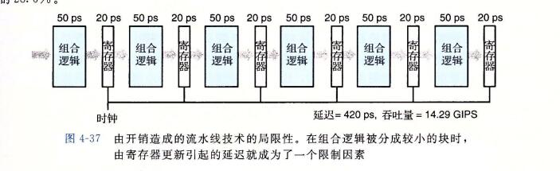
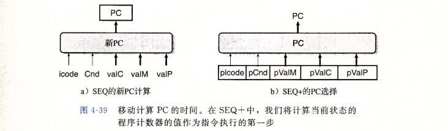
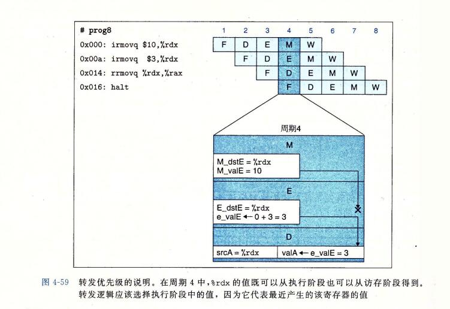

## 4、流水线的通用原理

```
在试图设计一个流水线化的 Y86-64 处理器之前，让我们先来看看流水线化的系统的一些通用属性和原理。

流水线的一个重要特性就是提高了系统的 吞吐量(throughput),也就是单位时间内服务的顾客总数，不过它也会轻微地增加延迟(latency), 也就是服务一个用户所需要的时间。
```

### 1、计算流水线

```
让我们把注意力放到计算流水线上来，这里的"顾客"就是指令，每个阶段完成指令执行的一部分。
图4-32a 给出了一个很简单的非流水线化的硬件系统例子。

它是由一些执行计算的逻辑以及一个保存计算结果的寄存器组成的。
时钟信号控制在每个特定的时间间隔加载寄存器。
```


```
1秒=1000毫秒
1毫秒=1000微妙
1微妙=1000纳秒
1纳秒=1000皮秒

在现代逻辑设计中，电路延迟以纳秒或者皮秒(picosecond, 简写成 "ps"), 也就是10^-12 秒为单位来计算的。在这个例子中，我们假设组合逻辑需要 300ps, 而加载寄存器需要 20 ps。 
图4-32 还给出了一种时序图，称为流水线图(pipeline diagram).
在图中，时间从左向右流动。从上到下写着一组操作(在此称为 i1,i2,i3). 实心的长方形表示这些指令执行的时间。这个实现中，在开始下一条指令之前必须完成前一个。因此，这些方框在垂直方向上并没有相互重叠。

下面这个公式给出了运行这个系统的最大吞吐量：
1ns = 10^-9   ns 是纳秒的意思 
```


```
假设将系统执行的计算分成三个阶段(A、B和C)，每个阶段需要 100ps，如图 4-33 所示。
然后在各个阶段之间放上流水线寄存器(pipeline register), 这样每条指令都会按照三步经过这个系统，从头到尾需要三个完整的时钟周期。

如图4-33中的流水线图所示，只要 i1 从A进入B，就可以让i2进入阶段A了，依次类推。
在稳定状态下，三个阶段都应该是活动的，每个时钟周期，一条指令离开系统，一条新的进入。
从流水线图中第三个时钟周期就能看出这一点，此时，i1是在阶段C，i2在阶段B，而i3是在阶段A。在这个系统中，我们将时钟周期设为100+20 =120ps,得到的吞吐量大约为8.33GIPS。 因为处理一条指令需要 3 个时钟周期，所以这条流水线的延迟就是 3*120 = 360ps.
我们将系统吞吐量提高到原来的 8.33/3.12 =2.67倍，代价是增加了一些硬件，以及延迟的少量增加(360/320=1.12)。延迟变大是由于增加的流水线寄存器的时间开销。
```


### 2、流水线操作的详细说明

```
为了更好地理解流水线是怎样工作的，让我们来详细看看流水线计算的时序和操作。图4-34给出了前面我们看到过得三阶段流水线(图4-33)的流水线图。就想流水线图上方指明的那样，流水线阶段之间的指令转移是由时钟信号来控制的。每隔120ps，信号从0上升至1，开始下一组流水线阶段的计算。
```


```
从这个对流水线操作详细的描述中，我们可以看到减缓时钟不会影响流水线的行为。
信号传播到流水线寄存器的输入，但是直到时钟上升时才会改变寄存器的状态。
另一方面，如果时钟运行的太快，就会有灾难性的后果。
值可能会来不及通过组合逻辑，因此当时钟上升时，寄存器的输入还不是合法的值。
```

```
根据对SEQ处理器时序的讨论，我们看到这种在组合逻辑块之间采用时钟寄存器的简单机制，足够控制流水线中的指令流。随着时钟周而复始地上升下降，不同的指令就会通过流水线的各个阶段，不会互相干扰。
```

### 3、流水线的局限性

#### 1、不一样的划分


```
图4-36展示的系统中和前面一样，我们将计算划分为了三个阶段，但是通过这些阶段的延迟从 50ps 到 150ps 不等。通过所有阶段的延迟和仍然为300ps.
不过，运行适中的速率是由最慢的阶段的延迟限制的。

流水线图表明，每个时钟周期，阶段A都会空闲(用白色方框表示)100ps,而阶段C会空闲 50ps。只有阶段B会一直处于活动状态。我们必须将时钟周期设为 150+20=170ps,得到的吞吐量为5.88GIPS. 另外，由于时钟周期减慢了，延迟也增加到了 510ps.
```

```
对硬件设计者来说，将系统计算设计划分为一组具有相同延迟的阶段是一个严峻的挑战。
通常，处理器中的某些硬件单元，如ALU和内存，是不能被划分成多个延迟较小的单元的。 这就使得创建一组平衡的阶段非常困难。
在设计流水线化的 y86-64 处理器中，我们不会过于关注这一层次，但是理解时序优化在实际系统设计中的重要性还是非常重要的。
```

#### 2、流水线过深，收益反而下降




```
图4-37 说明了流水线技术的另一个局限性。在这个例子中，我们把计算分成了6个阶段，每个阶段需要50ps. 在每对阶段之间插入流水线寄存器就得到了一个六阶段流水线。这个系统的最小时钟周期为 50+20=70ps，吞吐量为 14.29GIPS.因此，通过将流水线的阶段数加倍，我们将性能提高了 14.29/8.33=1.71. 虽然我们将每个计算时钟的时间缩短了两倍，但是由于通过流水线寄存器的延迟，吞吐量并没有加倍。
这个延迟成了流水线吞吐量的一个制约的因素。在我们的新设计中，这个延迟占到了整个时钟周期的 28.6%

本来三个时钟完成 一个指令，三层流水线
现在六个时钟完成一个指令，六层流水线

但是由于流水线寄存器的延迟太高了。
```

```
为了提高时钟频率，现代处理器采用了很深的(15或更多的阶段)流水线。处理器架构师将指令的执行划分成很多非常简单的步骤，这样一来每个阶段的延迟就很小。电路设计者小心地设计流水线寄存器，使其延迟尽可能的小。
芯片设计者也必须小心地设计时钟传播网络，以保证时钟在整个芯片上同时改变。
所有这些都是设计高速微处理面临的挑战。
```


### 4、带反馈的流水线系统

```
到目前为止，我们只考虑一种系统，其中传过流水线的对象，对于x86-64 或 y86-64 这样执行机器程序的系统来说，相邻指令之间很可能是相关的。例如，下面的y86-64指令。
```


## 5、 Y86-64的流水线实现

```
我们终于准备好要开始本章的主要任务 -- 设计一个流水线化的 y86-64 处理器。
首先，对顺序的 SEQ 处理器做一点小的改动，将 PC 的计算挪到取指阶段。
然后，在各个阶段之间加上流水线寄存器。到这个时候，我们的尝试还不能正确处理各种数据和控制相关。不过，做一些修改，就能实现我们的目标 -- 一个高效的、流水线化的实现 Y86-64 ISA 处理器。
```

### 1、SEQ+: 重新安排计算阶段

```
作为实现流水线设计的 一个过渡步骤，我们必须稍微调整一下 SEQ 中五个阶段的顺序，使得更新 PC 阶段在一个时钟周期开始时执行，而不是结束时才执行。
只需要对整体硬件结构做最小的改动，对于流水线阶段中的活动的时序，它能工作的更好。我们称这种修改过的设计为 "SEQ+".

我们移动PC阶段，使得它的逻辑在时钟周期开始时活动，使它计算当前指令的pc值。
tu4-29 给出了 SEQ 和 SEQ+ 在PC计算上的不同之处。
在 SEQ 中(图4-39a)，pc计算发生在时钟周期结束的时候，根据当前时钟周期内计算出的信号值来计算PC寄存器的新值。

在 SEQ+ 中(图4-39b)，我们创建状态寄存器来保存在一条指令执行过程中计算出来的信号。然后，当一个新的时钟周期开始时，这些信号值通过同样的逻辑来计算当前指令的 PC。
我们将这些寄存器标号为 "pIcode"、"pCnd"等等，来指明在任一给定的周期，它们保存的是前一个周期中产生的控制信号

```



```
SEQ+ 中的 pc 奇怪在哪里

SEQ+ 有一个很奇怪的特色，那就是没有硬件寄存器来存放程序计数器。而是根据从前一条指令保存下来的一些状态信息动态的计算 pc.
这就是一个小小的证明--我们可以以一种与ISA隐含着的概念模型不同的方式来实现处理器，只要处理器能正确执行任意的机器语言程序。
我们不需要将状态编码成程序员可见的状态指定的形式，只要处理器能够为任意的程序员可见状态(例如 程序计数器)产生正确的值。在创建流水线化的设计中，我们会更多的使用到这条原则。
```

```
SEQ 到 SEQ+ 中对状态单元的改变是一种很通用的改进的例子，这种改进称为电路重定时(circuit retiming). 
重定时改变了一个系统的状态表示，但是并不改变它的逻辑行为。通常用它来平衡一个流水线系统中各个阶段之间的延迟.
```


```
图4-40给出了 SEQ+ 硬件的一个更为详细的说明。可以看到，其中的硬件单元和控制块与我们在 SEQ 中用到的(图 4-23)一样，只不过 PC 逻辑从上面(在时钟周期结束时活动)移到了下面(在时钟开始时活动)
```


### 2、插入流水线寄存器

```
在创建一个流水线化的 Y86-64 处理器的最初尝试中，我们要在 SEQ+ 的各个阶段之间插入流水线寄存器，并对信号重新排列，得到 PIPE- 处理器，
这里的 "-" 代表这个处理器和最终的处理器设计相比，性能要差一点。 PIPE- 的抽象结构如图 4-41 所示。

流水线寄存器在该图中用黑色方框表示，每个寄存器包括不同的字段，
同两个顺序处理器的硬件结构(图4-23和图4-40)中的圆角框不同，这些白色的方框表示实际的硬件组成。	
```


```
可以看到，pipe- 使用了与顺序设计 SEQ(图4-40)几乎一样的硬件单元，但是有流水线寄存器分隔开这些阶段。两个系统中信号的不同之处在 4.5.3 节中讨论

流水线寄存器按如下方式标号：
F(fetch)	保存程序计数器的预测值 

D(decode)	位于取指和译码阶段之间。它保存关于最新取出的指令的信息，即将由译码阶段进行处理。 

E(execute)	位于译码和执行阶段之间。它保存关于最新译码的指令和从寄存器文件读出的值的信息，即将由执行阶段进行处理。

M(memory)	位于执行和访存阶段之间。它保存最新执行的指令的结果，即将由访存阶段进行处理。它还保存着关于用于处理条件转移的分支条件和分支目标的信息

W(write) 位于访存阶段和方框路径之间，反馈路径将计算出来的值提供给寄存器文件写，而当完成 ret 指令时，它还要向 PC 选择逻辑提供返回地址。
```

### 3、对信号进行重新排列和标号

```
顺序实现SEQ 和 SEQ+ 在一个时刻只处理一条指令，因此诸如 valC、scrA 和 valE 这样的信号值有唯一的值。在流水线化的设计中，与各个指令相关联的这些值有多个版本，会随着指令一起流过系统。

例如，在 PIPE- 的详细结构中，有4个标号为 "stat"的白色方框，保存着4条不同指令的状态码。我们需要很小心以确保使用的是正确版本的信号，否则会有很严重的错误，例如将一条指令计算出的结果存放到了另一条指令指定的目的寄存器。
我们采用命名机制，通过在信号名前面加上大写的流水线寄存器名字作为前缀，存储在流水线寄存器中的信号可以唯一的被标识。

例如，4个状态码可以被命名为 D_stat、E_stat、M_stat、W_stat. 
我们还需要引用某些在一个阶段内刚刚被计算出来的信号。他们的命名是在信号名前面加上小写的阶段名的第一个字母作为前缀。
以状态码为例，可以看到在取指和访存阶段中标号为 "stat"的控制逻辑块。因而，这些块的输出被命名为 f_stat 和 m_stat。我们还可以看到整个处理器的实际状态 Stat 是根据流水线寄存器 W 中的状态值，由写回阶段的块计算出来的。
```

```
信号 M_stat 和 m_stat 的差别

在命名系统中，大写的前缀"D"、"E"、"M"、"W" 指的是流水线寄存器，所以 M_stat 指的是流水线寄存器 M 的状态码字段。

小写的前缀 "f"、"d"、"e"、"m" 和 "w" 指的是流水线阶段，所以m_stat 指的是在访存阶段中由控制逻辑块产生出的状态信号。


大写的 D 代表的是流水线寄存器的字段，小写的d指的是引用了d阶段产生的stat.
一个指字段，一个指数据。


大写的 M 代表是流水线寄存器里面取出来的。
小写的 m 代表是刚刚在此阶段产生的值。还没有来得及存入流水线寄存器。
小写的 m 在下一个周期以后就会变成大写的 M 。(因为要进入下一阶段必须吧值存在流水线寄存器里面，下一个阶段需要使用就变成了从流水线寄存器里面取出来的了)


```


```
SEQ+ 和 PIPE- 的译码阶段都产生信号 dstE 和 dstM, 它们指明值 valE 和 valM 的目的寄存器。在SEQ+ 中，我们可以将这些信息直接连到寄存器文件写端口的地址输入。在PIPE-中，会在流水线中一直携带这些信号穿过执行和访存阶段，直到写回阶段才送到寄存器文件(如各个阶段的详细描述所示)。我们这样做是为了确保写端口的地址和数据输入是来自同一条指令。
否则，会将处于 写回阶段的指令的值写入，而寄存器ID却来自于处于译码阶段的指令。

作为一条通用原则，我们要保存处于一个流水线阶段中的指令的所有信息。

流水线因为 取指、译码、执行、访存、写回、更新PC
每一步都不会空闲，但是数据却不会混乱。
因为时钟的关系，因为流水线每一个模块一个时间点都只有一个指令运行，然后下个指令要进来的时候，将这个指令的结果保存到流水线寄存器里面，
```

```
PIPE- 中有一个块在相同表示形式的 SEQ+ 中是没有的，那就是译码阶段中标号为 "select A" 的块。我们可以看出，这个块会从来自流水线寄存器D的 valp 或从寄存器文件 A 端口中读出的值中选择一个，作为流水线寄存器 E 的值 valA. 包括这块是为了减少要携带给流水线寄存器 E 和 M 的状态数量。

用到 valP的指令只有 call 和 jxx 其他都是用 valA

在所有的指令中，只有 call 在访存阶段需要 valP 的值。只有跳转指令在执行阶段(当不需要进行跳转时)需要 valP 的值(需要跳转的时候就需要 valC 的值)。而这些指令又都不需要从寄存器文件中读出的值。因此我们合并这两个信号，将它们作为信号 valA 携带穿过流水线，从而可以减少流水线寄存器的状态数量。这样做就消除了 SEQ 和 SEQ+ 中标号为 "Data" 的块，这个块完成的是类似的功能。
在硬件设计中，像这样仔细确认信号是如何使用的，然后通过合并信号来减少寄存器状态和线路的数量，是很常见的。
```

```
如图 4-41 所示，我们的流水线寄存器包括一个状态码 stat 字段，开始时是在取指阶段计算出来的，在访存阶段有可能会被修改。在讲完正常指令执行的实现之后，我们会在4.5.6节中讨论如何实现异常事件的处理。到目前为止我们可以说，最系统的方法就是让与每条指令关联的状态码与指令一起通过流水线。
```

### 4、预测下一个pc

```
在PIPI- 设计中，我们采取了一些措施来正确处理控制相关。流水线设计的目的就是每个时钟周期都发射一条新指令，也就是说每个时钟周期都有一条新指令进入执行阶段并最终完成。要是达到这个目的也就意味着吞吐量是每个时钟周期一条指令。

要做到这一点，我们必须在取出当前指令之后，马上确定下一条指令的位置。不幸的是，如果取出的指令是条件分支指令，要到几个周期后，也就是指令通过执行阶段之后，我们才能知道是否要选择分支。类似地，如果取出的指令是 ret, 要到指令通过访存阶段，才能确定返回地址。
```

```
除了条件转移指令和 ret 以外，根据取指阶段中计算出的信息，我们能够确定下一条指令的地址。
对于 call 和 jmp(无条件转移)来说，下一条指令的地址是指指令中的常数字 valC,而对于其他指令来说就是  valP.因此，通过预测 PC 的下一个值，在大多数情况下，我们能达到每个时钟周期发射一条新指令的目的。对于大多数指令类型来说，我们的预测是完全可靠的。
对于条件转移来说，我们既可以预测选择了分支，那么新 PC 值应为 valC,也可以预测没有选择分支，那么新PC值应为 valP. 无论哪种情况，我们都必须以某种方式来处理预测错误的情况，因此此时已经取出并部分执行了错误的指令。
```

```
猜测分支方向并根据猜测开始取指的技术称为分支预测。实际上所有的处理器都采用了某种形式的此类技术。对于预测是否选择分支的有效策略已经进行了广泛的研究。
我们的设计值使用了简单的策略，即总是预测选择了条件分支，因此预测PC的新值为 valC.
```

```
我们的设计使用总是选择(always taken)分支的预测策略。研究表明这个策略的成功率大约为 60%。相反，从不选择(never taken, NT)策略的成功率大约为 40%。

稍微复杂一点的是反向选择、正向不选择(backward taken, forward not-taken)的策略，当分支地址比下一条地址低时就预测选择分支，而分支地址比较高时，就预测不选择分支。这种策略的成功率大约为65%。这种源自一个事实，即循环式由后向分支结束的，而循环通常会执行多次。前向分支用于条件操作，而这种选择的可能性较小。


指令的地址高低：指令是由低向高的，地址1：A指令，地址2：B指令；
地址1 比地址2 小，低

循环因为是
jump: aa
pool:
	xxx
	xxx
aa:	
	jxx:pool
是向后(低，下)跳转的

判断分支是
jxx: 
	pool
	xxx
pool:
	xxx
向下（前）跳转的
```


```
ret 的预测方式
使用栈的返回地址预测

对于大多数程序来说，预测返回值很容易，因为过程调用和返回是成对出现的。大多数函数调用，会返回到调用后的那条指令。
高性能处理器中运用了这个属性，在取指单元中放入一个硬件栈，保存过程调用指令产生的返回地址。
每次执行过程调用指令时，都将其返回地址压入栈中。
当取出一个返回指令时，就从这个栈中弹出顶部的值，作为预测的返回值。

同分支预测一样，在预测错误时，必须提供一个恢复机制，因为还是有调用和返回不匹配的时候。通常，这种预测很可靠。这个硬件栈对程序员来说是不可见的。
```


```
PIPE- 的取值阶段，如果 4-41 底部所示，负责预测 PC 的下一个值，以及为取指选择实际的 PC 。我们可以看到，标号为 "Predict PC"的块会从 PC 增加器计算出的 valP 和取出的指令中得到 valC 中进行选择。
这个值存放在流水线寄存器 F 中，作为程序计数器的预测值。
标号为"Select PC" 的块类似于 SEQ+的PC选择阶段中标号为"PC"的块。

它从三个值中选择一个作为指令内存的地址：
预测的PC，
对于流水线寄存器M的不选择分支的指令来说是 valP 的值(存储在寄存器 M_valA中)，
或是当 ret 指令达到流水线寄存器w(存储在 W_valM)时的返回地址的值。
```


### 5、流水线冒险

```
PIPE- 结构是创建一个流水线化的 Y86-64 处理器的好开端。不过，将流水线技术引入一个带反馈的系统，当相邻指令间存在相关时会导致出现问题。在完成我们的设计之前，必须解决两个问题。
1、数据相关
2、控制相关

数据相关：
	下一条指令会用到这一条指令计算出的结果;
	
控制相关：
	一条指令要确定下一条指令的位置，
	
	例如：在执行跳转、调用或返回指令时。这些相关可能会导致流水线产生计算错误，称为冒险(hazard).
	同相关一样，冒险也可以分为两类：
		数据冒险(data hazard)和控制冒险(control hazard)
		
我们首先关心的是数据冒险，然后再考虑控制冒险。
```


```
图 4-43 描述的是 PIPE- 处理器处理 prog1 指令序列的情况。假设在这个例子以及后面的例子中，程序寄存器初始时值都为0.这段代码将值10和3放入程序寄存器 %rdx 和 %rax, 执行三条 nop 指令，然后将寄存器 %rdx 加到 %rax.

我们重点关注两条 irmovq 指令和 addq 指令之间的数据相关造成的可能的数据冒险。
图的右边是这个指令序列的流水线图。图中突出显示了周期 6 和 7 的流水线阶段。流水线图的下面是周期6中写回活动和周期7中译码活动的扩展说明。
在周期7开始以后，两条 irmovq 都已经通过写回阶段，所以寄存器文件保存着更新过的 %rdx 和 %rax 的值。
因此，当 addq 指令在周期7经过译码阶段时，它可以读到源操作数的正确值。
```


#### 列举数据冒险的类型

```
当一条指令更新后面指令会读到的那些程序状态时，就有可能出现冒险。对于 Y86-64 来说，程序状态包括程序寄存器、程序计数器、内存、条件码寄存器和状态寄存器。让我们来看看在提出的设计中每类状态出现冒险的可能性。
```

```
程序寄存器：
	我们已经认识这种冒险了。出现这种冒险是因为寄存器文件的读写是在不同的阶段进行的，导致不同指令之间可能出现不希望的相互作用。
	
程序计数器：
	更新和读取程序计数器之前的冲突导致了控制冒险。当我们的取值阶段逻辑在取下一条指令之前，正确预测了程序计数器的新值时，就不会产生冒险。预测错误的分支和ret指令需要特殊的处理，下面讲解。
	
内存：
	对数据内存的读和写都发生在访存阶段。在一条读内存的指令到达这个阶段之前，前面所有要写内存的指令都已经完成这个阶段了。 
	另外，在访存阶段中写数据的指令和在取指阶段中的读指令之间可能会有冲突。
因为指令和数据内存访问的是同一个地址空间。只有包含自我修改代码的程序才会发生这种情况，在这样的程序中，指令写内存的一部分，过后会从中取出指令。有些系统有复杂的机制来检测和避免这种冒险，而有些系统只是简单的强制要求程序不应该使用自我修改代码。
为了简便，假设程序不能修改自身，因此我们不需要采取特殊的措施，根据在程序执行过程中对数据内存的修改来修改指令内存.

条件码寄存器:
	在执行阶段中,整数操作会写这些寄存器. 条件传送指令会在执行阶段以及条件转移会在执行阶段以及条件转移会在访存阶段读这些寄存器.
	在条件传送或转移到达执行阶段之前，前面所有的整数操作都已经完成这个阶段了。所以不会发生冒险
	
状态码寄存器：
	指令流经流水线的时候，会影响程序状态。我们采用流水线中的每条指令都与一个状态码相关联的机制，使得当异常发生时，处理器能够有条理地停止。
	

这些分析表明我们只需要处理寄存器数据冒险、控制冒险，以及确保能够正确处理异常。当设计一个复杂系统时，这样的分类分析是很重要的。这样做可确认出系统实现中可能的困难，还可以指导生成用于检查系统正确性的测试程序。
```

#### 1、用暂停来避免数据冒险

```
暂停(stalling)是避免冒险的一种常用技术，暂停时，处理器会停止流水线中一条或多条指令，直到冒险条件不再满足。让一条指令停顿在译码阶段，直到产生它的源操作数的指令通过了写回阶段，这样我们的处理器就能避免数据冒险。


图4-47(prog2)和图4-48(prog4)画出了暂停的效果。
当指令 addq 处于译码阶段时，流水线控制逻辑发现执行、访存或写回阶段中至少有一条指令会更新寄存器 %rdx 或 %rax.处理器不会让 addq 指令带着不正确的结果通过这个阶段,而是会暂停指令，将它阻塞在译码阶段，时间为一个周期(对 prog2 来说)或者三个周期(对 prog4 来说)。对所有这三个程序来说，addq 指令最终都会在周期 7 中得到两个源操作数的正确值，然后继续沿着流水线进行下去。

	将addq指令阻塞在译码阶段时，我们还必须将紧跟其后的 halt 指令阻塞在取指阶段。通过将程序计数器保持不变就能做到这一点，这样一来，会不断的对 halt 指令进行取指，直到暂停结束。
	
	暂停技术就是让一组指令阻塞在它们所处的阶段，而允许其他指令继续通过流水线。那么在本该正常处理 addq 指令的阶段中，我们该做些什么呢？我们使用的处理方法是：每次要把一条指令阻塞在译码阶段，就在执行阶段插入一个气泡。气泡就像一个自动产生的 nop 指令 -- 它不会改变寄存器、内存、条件码或程序状态。
	
	在图4-47和图4-48的流水线图中，白色方框表示的就是气泡。在这些图中，我们用一个 addq 指令的标号为 "D" 的方框标号为 "E" 的方框之间的箭头来表示一个流水线气泡，这些箭头表明，在执行阶段中插入气泡是为了替代 addq 指令，它本来应该经过译码阶段进入执行阶段。
```


```
在使用暂停技术来解决冒险的过程中，我们通过动态地产生和 prop1 流(图4-43)一样的流水线流，有效的执行了程序 prog2 和 prog4 。为 prog2 插入一个气泡，为 prog4 插入3个气泡，与在第2条 irmovq 指令和 addq 指令之间有 3 条 nop 指令，有相同的效果。虽然实现这一机制想当容易，但是得到的 性能并不很好。
一条指令更新一个寄存器，紧跟其后的指令就使用了被更新的寄存器，像这样的情况不胜枚举。这会导致流水线暂定长达三个周期，严重降低了整体的吞吐量。
```


#### 2、用转发来避免数据冒险

```
	PIPE- 的设计是在译码阶段从寄存器文件中读入源操作数，但是对这些源寄存器的写有可能要在写回阶段才能进行。
	与其暂停直到写完成，不如简单的将要写的值传到流水线寄存器 E 作为源操作数。
图4-49用 prog2 周期 6 的流水线图的扩展描述来说明了这一策略。
译码阶段逻辑发现，寄存器%rax是操作数 valB 的源寄存器，而在写端口 E 上还有一个对 %rax 的未进行的写。
它只要简单的将提供到端口E的数据字(信号 W_valE)作为操作数 valB 的值，就能避免暂停。这种将结果值直接从一个流水线阶段传到较早阶段的技术称为 数据转发(data forwarding, 或简称转发，有时称为旁路(bypassing)).

它使得 prog2 的指令能通过流水线而不需要任何暂停。数据转发需要在基本的硬件结构中增加一些额外的数据连接和控制逻辑。
```


```
程序 prog2-prog4 中描述的转发技术的使用都是
将 ALU 产生的以及其目标为写端口 E 的值进行转发，
其实也可以转发从内存中读出的以及其目标为写端口M的值。

从访存阶段，我们可以转发刚刚从数据内存读出的值(m_valM).从写回阶段，我们可以转发对端口 M 未进行的写(信号 W_valM). 这样一共就有五个不同的转发源(e_valE、m_valM、M_valE、W_valM 和 W_valE), 以及两个不同的转发目的(valA 和 valB).
```


```
图4-49~图4-51 的扩展图还表明译码阶段逻辑能够确定是使用来自寄存器文件的值，还是要用转发过来的值。
与每个要写回寄存器文件的值相关的是目的寄存器ID。
逻辑会将这些ID与源寄存器ID srcA 和 srcB 相比较，以此来检测是否需要转发。可能有多个目的寄存器 ID 与一个源 ID 相等。要解决这样的情况，我们必须在各个转发源中建立起优先级关系。在学习转发逻辑的详细设计时，我们会讨论这个内容。
```

```
图4-52给出的是 PIPE 的结构，它是 PIPE- 的扩展，能通过转发处理数据冒险。
将这幅图与 PIPE- 的结构(图4-41)相比，我们可以看到来自五个转发源的值反馈到译码阶段中两个标号为 "Sel+Fwd A"和"Fwd B"的块。标号为 "Sel+Fwd A"的块是 PIPE- 中标号为 "Select A"的块的功能与转发逻辑的结合。它允许流水线寄存器E的valA 为已增加的程序计数器值 valP, 从寄存器文件A端口读出的值，或者某个转发过来的值。标号为 "Fwd B"的块实现的是源操作数 valB 的转发逻辑。
```


#### 3、加载/使用数据冒险

```
有一类数据冒险不能单纯的用转发来解决，因为内存读在流水线发生的比较晚。

图4-53举例说明了 加载/使用冒险(load/use hazard), 其中一条指令(位于地址 0x028 的 mrmovq)从内存中读出寄存器&rax 的值，而下一条指令(位于地址 0x032 的 addq)需要该值作为源操作数。
图的下部是周期7和8的扩展说明，在此假设所有的程序寄存器都初始化为 0，。addq 指令在周期 7 中需要改寄存器的值，但是 mrmovq 指令直到周期 8 才产生出这个值。
为了从 mrmovq "转发到" addq, 转发逻辑不得不将值送回到过去的时间！这显然是不可能的，我们必须找到其他机制来解决这种形式的数据冒险。
```


```
如图4-54所示，我们可以将暂停和转发结合起来，避免加载/使用数据冒险。这个需要修改控制逻辑，但是可以使用现有的旁路路径。当 mrmovq 指令通过执行阶段时，流水线控制逻辑发现译码阶段中的指令(addq)需要从内存中读出的结果。

它会将译码阶段中的指令暂停一个周期，导致执行阶段中插入一个气泡。

```


```
这种用暂停来处理加载/使用冒险的方法称为 加载互锁(load interlock)。加载互锁和转发技术结合起来足以处理所有可能类型的数据冒险。因为只有加载互锁会降低流水线的吞吐量，我们几乎可以实现每个时钟周期发射一条新指令的吞吐量目标。
```


#### 4、避免控制冒险


```
如这张图所示，在周期3中取出 ret指令，并沿着流水线前进，在周期7进入写回阶段。在它经过译码、执行和访存阶段时，流水线不能做任何有用的活动。我们只能在流水线中插入三个气泡。
一旦ret指令达到写回阶段，PC选择逻辑就会将程序计数器设为返回地址，然后取指阶段就会取出位于返回点(地址 0x013)处的 irmovq 指令。
```


### 6、异常处理

```
	正如第8章中将讨论的，处理器中很多事情都会导致异常控制流，此时，程序执行的正常流程被破坏掉。
异常可以由程序执行从内部产生，也可以由某个外部信号从外部产生。我们的指令集体系结构包括三种不同的内部产生的异常：
1)halt 指令。
2)有非法指令和功能码组合的指令
3)取指或数据读写试图访问一个非法地址。

一个更完整的处理器设计应该也能处理外部异常，例如当处理器收到一个网络接口收到新包的信号，xxx。
正确处理异常是任何微处理器设计中很有挑战性的一方面。
异常可能出现在不可预测的时间，需要明确的中断通过处理器流水线的指令流。

我们对这三种内部异常的处理只是让你对正确发现和处理异常的真实复杂性有了解。
```

```
	我们把导致异常的指令称为异常指令(exception instruction).在使用非法指令地址的情况中，没有实际的异常指令，但是想象在非法地址处有一种"虚拟指令"会有所帮助。
	
在简化的 ISA 模型中，我们希望当处理器遇到异常时，会停止，设置适当的状态码，如图4-5所示。看上去应该是到异常指令之前的所有指令都已经完成，而其后的指令都不应该对程序员可见的状态产生任何影响。
在一个更完整的设计中，处理器会继续调用异常处理程序(exception handler),这是操作系统的一部分，但是实现异常处理的这部分超出了本书的讲述范围。
```

```
	在一个流水线化的系统中，异常处理包括一些细节问题。首先，可能同时有多条指令会引起异常。
	
第一个细节：
	例如，在一个流水线操作的周期内，取指阶段中有 halt 指令，而数据内存会报告访存阶段中的指令数据地址越界。我们必须确定处理器应该向操作系统报告哪个异常。
我们必须确定处理器应该向操作系统报告哪个异常。

基本原则是：由流水线中最深的指令引起的异常，优先级越高。

在上面那个例子中，应该报告访存阶段中指令的地址越界。
就机器语言程序来说，访存阶段中的指令本来就应该在取指阶段中的指令开始之前就结束的，所以，只应该向操作系统报告这个异常。

应该是指 虽然 halt 最深，但是 halt  才到取指，还没有报异常。
```


```
第二个细节：
	第二个细节问题是，当首先取出一条指令，开始执行时，导致了一个异常，而后来由于分支预测错误，取消了该指令。下面就是一个程序示例的目标代码：
```


```
在这个程序中，流水线会预测选择分支，因此它会取出并以一个值为 0xFF 的字节作为指令(由汇编代码中 .byte 伪指令产生的)。译码阶段会因此发现一个非法指令异常。稍后，流水线会发现不应该选择分支，因此根本就不应该取出位于地址 0x016 的指令。流水线控制逻辑会取消该条指令，但是我们想要避免出现异常。
```


```
第三个细节：
	第三个细节问题的产生是因为流水线化的 处理器会在不同的阶段更新系统状态的不同部分。有可能会出现这样的情况，一条指令导致了一个异常，它后面的指令在异常指令完成之前改变了部分状态。比如说，考虑下面的代码序列，其中假设不允许用户程序访问64位范围的高端地址：
```


```
	pushq 指令导致一个地址异常，因为减少栈指针会导致它绕回到 0xffff_ffff_ffff_fff8. 访存阶段中会发现这个异常。
在同一周期中，addq指令处于执行阶段，而它会将条件码设置成新的值。这就会违反异常指令之后的所有指令都不能影响状态的要求。
```


```
一般的，通过在流水线结构中加入异常处理逻辑，我们既能够从各个异常中做出正确的选择，也能够避免出现由于分支预测错误取出的指令造成的异常。
这就是为什么我们会在每个流水线寄存器中包括一个状态码 stat.如果一条指令在其处理中于某个阶段产生了一个异常，这个状态 字段就会被设置成指示异常的种类。异常状态和该指令的其他信息一起沿着流水线传播，知道它达到写回阶段。在此，流水线控制逻辑发现出现了异常，并停止执行。

	为了避免异常指令之后的指令更新任何程序员可见的状态，当处于访存或写回阶段中的指令导致异常时，流水线控制逻辑必须禁止更新条件码寄存器或是数据内存。在上面的示例程序中，控制逻辑会发现访存阶段的 pushq 导致了异常，因此应该禁止addq指令更新条件码寄存器。
```

```
Y86-64 只有在取指和读写内存的时候会出现异常。
取指的时候可能会出现 imem_error 和 instr valid 
读写内存的时候可能会出现 dmem_error 

在 SEQ 里面
	stat是在访存的时候更新的
	
在 SEQ+ 里面 stat 是在 写回的时候更新的
```


```
让我们来看看这种处理异常的方法是怎样解决刚才提到的那些细节问题的。当流水线中有一个或多个阶段出现异常时，信息只是简单地存放在流水线寄存器的状态字段中。
异常事件不会对流水线中的指令流有任何影响，除了会禁止流水线中后面的指令更新程序员可见的状态(条件码寄存器和内存)，直到异常指令到达最后的流水线阶段。

因为指令到达写回阶段的顺序与它们在非流水线化的处理器中执行的顺序相同，所以我们可以保证第一条遇到异常的指令会第一个到达写回阶段，此时程序执行会停止，流水线寄存器W中的状态码会被记录为程序状态。
如果去除了某条指令，过后又取消了，那么所有关于这条指令的异常状态信息也都会被取消。所有导致异常的指令后面的指令都不能改变程序员可见的状态。
携带指令的异常状态以及所有其他信息通过流水线的简单原则是处理异常的简单而可靠的机制。


疑问：异常可能是在内存阶段写回数据到内存时候产生的地址越界，因为写回必须是由时钟触发的，在时钟触发以后，进行写回，如果地址越界了就抛出越界error. 
而流水线的下一条指令正在进行执行阶段，执行阶段就有可能更新条件码寄存器CC。
而更新寄存器CC也是通过时钟触发的。


也就是说如果时钟上升以后，先更新 CC ，然后才更新内存写的话，那么内存写里面的抛出异常，暂停 条件码寄存器和内存更新， 但是这个时候CC已经更新了。就违反了，所有导致异常的指令后面的指令都不能改变程序员可见的状态。


```


### 7、PIPE 各阶段的实现

```
现在我们已经创建了 PIPE 的整体结构，PIPE 是我们使用了转发技术的流水线化的Y86-64处理器。它使用了一组与前面顺序设计相同的硬件单元，另外增加了一些流水线寄存器、一些重新配置了的逻辑快，以及增加的流水线控制逻辑。

许多逻辑快与SEQ和SEQ+中相应部件完全相同，
除了我们必须从来自不同流水线寄存器(用大写的流水线寄存器的名字作为前缀)
或来自各个阶段计算(用小写的阶段名字的第一个字母作为前缀)
的信号中选择适当的值。
```


#### 1、PC选择和取指阶段


```
PC 选择逻辑从三个程序计数器源中进行选择。

当一条预测错误的分支进入访存阶段时，会从流水线寄存器M(信号M_valA)中读出该指令 valP的值(指明下一条指令的地址)。

当ret指令进入写回阶段时，会从流水线寄存器W(信号W_valM)中读出返回地址。

其他情况会使用存放在流水线寄存器F(信号F_predPC)中的PC的预测值。
```

```
word f_pc = [
	#Mispredicted branch. fetch at incremented PC
	M_icode == IJXX && !M_Cnd : M_valA;
	#Completion of RET instruction
	W_icode == RET : W_valM;
	#Defalut : use predicted value of PC
];
```

```
当取出的指令为函数调用或跳转时，PC预测逻辑会选择 valC, 否则就会选择  valP:

wrod f_predPC =[
	f_icode in {IJXX, ICALL} : f_valC;
	l:f_valP;
];
```

```
标号为 "Instr valid"、"Need regids"、"Need valC" 的逻辑块和SEQ中的一样，使用了适当命名的源信号。

同SEQ中不一样，我们必须将指令状态的计算分成两个部分。在取指阶段，可以测试由于指令地址越界引起的内存错误，还可以发现非法指令或 halt 指令。
必须推迟到访存阶段才能发现非法数据地址.
```

```
写出信号 f_stat 的HCL代码，提供取出的指令的临时状态
```


#### 2、译码和写回阶段


```
图4-58是PIPE的译码和 写回逻辑的详细说明。标号为"dstE"、"dstM"、"srcA"、"srcB"的块类似于它们在SEQ的实现中的相应部件。我们观察到，提供给写端口的寄存器ID来自于译码阶段。这是因为我们希望进行写的目的寄存器是由写回阶段的指令指定的。
```

```
这个阶段的复杂性主要是跟转发逻辑相关。就像前面提到的那样，标号为"Sel+FwdA"的块扮演两个角色。它为后面的阶段将valP信号合并到 valA 信号，这样可以减少流水线寄存器中状态的数量。它还实现了源操作数 valA 的转发逻辑.


合并信号 valA和valP 的依据是，只有 call 和跳转指令在后面的阶段中需要 valP 的值，而这些指令并不需要从寄存器文件 A 端口中读出的值。
M_valA  JXX 需要
W_valM ret 需要

这个选择是由该阶段的 icode 信号来控制的。当 信号 D_icode 与 call 或 JXX 的指令代码相匹配时，这个块就会选择 D_valP作为它的输出。
```

```
4.5.5 节中提到有 5 个不同的转发源，每个都有一个数据字和一个目的寄存器ID
```

| 数据字 | 寄存器ID | 源数据                      |
| ------ | -------- | --------------------------- |
| e_valE | e_dstE   | ALU 输出                    |
| m_valM | M_dstM   | 内存输出                    |
| M_valE | M_dstE   | 访存阶段中对端口E未进行的写 |
| W_valM | W_dstM   | 写回阶段中对端口M未进行的写 |
| W_valE | W_dstE   | 写回阶段中对端口E未进行的写 |


```
如果不满足任何转发条件，这个块就应该选择 d_rvalA 作为它的输出，也就是从寄存器端口 A 中读出的值。
综上所述，我们得到以下流水线寄存器E的valA新值的 HCL 描述：
word d_vaLA = [
	D_icode in {ICALL, IJXX} : d_valP; use Incremented PC
	d_srcA == e_dstE : e_valE; //ALU 输出
	d_srcA == m_dstM : m_valM; // 内存输出
	d_srcA == M_dstE : M_valE; // 访存阶段中对端口E未进行的写
	d_srcA == W_dstM : W_valM; // 写回阶段中对端口M未进行的写
	d_srcA == W_dstE : W_valE; // 写回阶段中对端口E未进行的写
	l : d_rvalA #Use vale read from register file
];
```

```
上述HCL代码中赋予这个5个转发源的优先级是非常重要的。这种优先级是由HCL代码中检测5个目的寄存器ID的顺序来确定的。如果选择了其他任何顺序，对某些程序来说，流水线就会出错。
```





```
写回阶段的一小部分是保持不变的。如图 5-42所示，整个处理器的状态 Stat 是一个块，是根据流水线寄存器 W 中的状态值计算出来。
状态码应该指明是正常操作(AOK),还是三种异常中的一种。由于流水线寄存器 W 保存着最近完成的指令的状态，很自然地要用这个值来表示整个处理器状态。唯一要考虑的特殊情况是当写回阶段有气泡时。这是正常操作的一部分，因此对于这种情况，我们也喜欢状态码是 AOK:
word Stat = [
	W_stat == SBUB : SAOK;  bubble
	l : W_stat;
]
```

#### 3、执行阶段

```
图4-60展示的是 PIPE 执行阶段的逻辑。这些硬件单元和逻辑块同 SEQ 中的相同，使用的信号做适当的重命名。我们可以看到信号 e_valE 和 e_dstE 作为转发源，指向译码阶段。
一个区别是标号为 "set CC" 的逻辑以信号 m_stat 和 W_stat 作为输入，这个逻辑决定了是否要更新条件码。这些信号被用来检查一条导致异常的指令正在通过后面的流水线阶段的情况，因此，任何对条件码的更新都会被禁止。

这里的 e_Cnd ——> destE 是用于 数据的条件转移 cmovxx 的。
如果符合就设置新值，如果不符合就不设置新值。
```


#### 4、访存阶段

```
图4-61是PIPE 的访存阶段逻辑。将这个逻辑与SEQ的访存阶段(图4-30)相比较，正如我们看到，正如前面提到的那样，PIPE中没有 SEQ 中标号为 "Data"的块。这个块是用来在数据源 valP(对call指令来说)和 valA 中进行选择的，但是这个选择现在由译码阶段中标号为 "Sel+Fwd A" 的块来执行。这个阶段中的其他块都和SEQ中相应的部件相同，采用的信号做适当的重命名。在图中，你还可以看到许多流水线寄存器M和W中的值作为转发和流水线控制逻辑的一部分，提供给电路中其他部分。
```


### 8、流水线控制逻辑

```
现在准备创建流水线控制逻辑，完成我们的 PIPE 设计。这个逻辑必须处理下面 4 种控制情况，这些情况是其他机制(例如数据转发和分支预测)不能处理的：

加载/使用冒险：
	在一条从内存中读出一个值的指令和一条使用该值的指令之间，流水线必须暂停一个周期。
   
处理 ret:
	流水线必须暂停直到 ret 指令到达写回阶段
	
预测错误的分支:
	在分支逻辑发现不应该选择分支之前,分支目标处的几条指令已经进入流水线了.必须取消这些指令,并从跳转指令后面的那条指令开始取指.
	
异常:
	当一条指令导致异常,我们想要禁止后面的指令更新程序员可见状态,并且在异常指令到达写回阶段时,停止执行.
```

#### 1、控制特殊情况所期望的处理

```
只有 mrmovq 和 popq 指令会从内存中读数据。当这两条指令中的任一条处于执行阶段，并且需要该目的寄存器的指令正处在译码阶段时，我们要将第二条指令阻塞在译码阶段，并在下一个周期往执行阶段中插入一个气泡。此后，转发逻辑会解决这个数据冒险。

可以将流水线寄存器D保持为固定状态，由此下一条指令会被再取一次。
总之，实现这个流水线流需要发现冒险的情况下，保持流水线寄存器F和D保持不变，并且在执行阶段中插入气泡。
```


```
图4-62是示例程序中ret指令的实际处理过程。在此可以看到，没有办法在流水线的取值阶段中插入气泡。
每个周期，取值阶段从指令内存中读出一条指令。看看4.5.7节中实现PC预测逻辑的HCL 代码，我们可以看到，对ret指令来说，PC的新值被预测成 valP,也就是下一条指令的地址。
```


```
当分支预测错误发生时，我们已经4.5.5节中描述了所需的流水线操作，并用图4-56进行了说明。当跳转指令到达执行阶段时就可以检测错误。然后在下一个时钟周期，控制逻辑就会在译码和执行段插入气泡，取消两条不正确的已取指令。在同一个时钟周期，流水线将正确的指令读取到取指阶段。
```

```
对于导致异常的指令，我们必须使流水线化的实现符合期望的 ISA 行为，也就是在前面所有的指令结束前，后面的指令不能影响程序的状态。一些因素会使得想达到这些效果比较麻烦：
1、一场在程序执行的两个不同阶段(取指和访存被发现的)
2、程序状态在三个不同阶段(执行、访存和写回)被更新
```

```
在我们的阶段设计中，每个流水线寄存器中会包含一个状态码stat，随着每条指令经过流水线阶段，它会记录指令的状态。当异常发生时，我们将这个信息作为指令状态的一部分记录下来，并且继续取指、译码执行指令，就好像什么都没有出错似的。

当异常指令到达访存阶段时，我们会采取措施防止后面的指令修改程序员可见状态：
1、禁止执行阶段中的指令设置条件码
2、向内存阶段中插入气泡，以禁止向数据内存中写入
3、当写回阶段中有异常指令时，暂停写回阶段，因而暂停了流水线。
```


```
图4-63中的流水线图说明了我们的流水线控制如何处理导致异常的指令后面跟着一条会改变条件码的指令的情况。在周期6，pushq 指令到达访存阶段，产生一个内存错误。在同一个周期，执行阶段中的 addq 指令产生新的条件码的值。在访存或者写回阶段中有一条指令时(通过检查信号 m_stat 和 W_stat，然后将信号 set_cc 设置为0)，禁止设置条件码。在图 4-63的例子中，我们还可以看到既向访存阶段插入了气泡，也在写回阶段暂停了异常指令 -- pushq 指令在写回阶段保持暂停，后面的指令都没有通过执行阶段。
```

```
	对状态信号流水线化，控制条件码的设置，以及控制流水线阶段 ---将这些结合起来，我们实现了对异常的期望的行为：异常指令之前的指令都完成了，而后面的指令对程序员可见的状态都没有影响。
```

#### 2、发现特殊控制条件


```
图 4-64 总结了需要特殊流水线控制的条件。它给出的表达式描述了在哪些条件下会出现这三种特殊情况。
一些简单的组合逻辑块实现了这些表达式，为了在时钟上升开始下一个周期时控制流水线寄存器的活动，这些块必须在时钟周期结束之前产生出结果。

在一个时钟周期内，流水线寄存器D、E和M分别保持这处于译码、执行和访存阶段中的指令的状态。
在到达时钟周期末尾时，信号 d_srcA 和  d_srcB 会被设置为译码阶段中指令的源操作数的寄存器ID.

当ret指令通过流水线时，想要发现它，只要检查译码、执行和访存阶段中指令的指令码。
	IRET IN {D_icode, E_icode, M_icode}
	解决：暂停 F 气泡 D;


发现加载/使用冒险要检查执行阶段中的指令类型(mrmovq或popq)，并把它的目的寄存器和译码阶段中指令的源寄存器相比较。
	E_icode in {mrmovq,popq} && E_destM in {d_srcA,d_srcB}
	解决：暂停 F 暂停 D 气泡 E;
	

当跳转指令在执行阶段时，流水线控制逻辑应该能发现预测错误的分支，这样当指令进入访存阶段时，它就能设置从错误预测中恢复所需要的条件。
当跳转指令处于执行阶段中信号 e_Cnd 指明是否要选择分支。
	E_icode in {JXX} && !e_cnd
	解决：气泡D 气泡E
	
通过检查访存和写回阶段中的指令状态值，就能发现异常指令。对于访存阶段，我们使用在这个阶段中计算出来的信号 m_stat, 而不是流水线寄存器的 M_stat。这个内部信号包含着可能的数据内存地址错误。
```


#### 3、流水线控制机制

```
图4-64是一些低级机制，它们使得流水线控制逻辑能将指令阻塞在流水线寄存器中，或是往流水线中插入一个气泡。
这些机制包括对 4.2.5 节中描述的基本时钟寄存器的小扩展。
假设每个流水线寄存器有两个控制输入：暂停(stall)和气泡(bubble).
这些信号的设置决定了当时钟上升时该如何更新流水线寄存器。
在正常操作下(图4-65a)，这两个输入都设为0，使得寄存器加载它的输入作为新的状态。

当暂停信号设为1时(图4-65b)，禁止更新状态。相反，寄存器会保持它以前的状态。
这使得它可以将指令阻塞在某个流水线阶段中。

当气泡信号设置为1时(图4-65c)，寄存器状态会设置成某个固定的复位配置(reset configuration), 得到一个等效于 nop 指令的状态。一个流水线寄存器的复位配置的0、1模式是由流水线寄存器中字段的集合决定的。

例如，要往流水线寄存器D中插入一个气泡，我们要将 icode 字段设为 INOP，并将 dstE、dstM、srcA和srcB字段设为常数RNONE.

确定复位配置是硬件设计师在设计流水线寄存器时的任务之一。在此我们不讨论细节。

我们会将气泡和暂停信号都设为1看成是出错。
```


```
图4-66中的表给出了各个流水线寄存器在三种特殊情况下应该采取的行动。对每种情况的处理都是对流水线寄存器正常、暂停和气泡操作的某个组合。
在时序方面，流水线寄存器的暂停和气泡控制信号是由组合逻辑块产生的。
当时钟上升时，这些值必须是合法的，使得当下一个时钟周期开始时，每个流水线寄存器要么加载，要么暂停，要么产生气泡。

有了这个对流水线寄存器设计的小扩展，我们就能组合逻辑、时钟寄存器和随机访问存储器这样的基本构建块，来实现一个完整的、包括所有控制的流水线。
```


#### 4、控制条件的组合

```
到目前为止，在我们对特殊流水线控制条件的讨论中，假设在任意一个时钟周期内，最多只能出现一个特殊情况。在设计系统时，一个常见的缺陷是不能处理同时出现多个特殊情况的情形的。
现在来分析这些可能性。我们不需要担心多个程序异常的组合情况。图4-67画出了导致其他三种特殊控制条件的流水线状态。图中所示的是译码、执行和访存阶段的块。暗色方框代表要出现这种条件必须要满足的特别限制。
加载/使用冒险要求执行阶段中的指令将一个值从内存读到寄存器中，同时译码阶段中的指令要以该寄存器作为源操作数。预测错误的分支要求执行阶段中的指令是一个跳转指令。对ret来说有三种可能的情况 --- 指令可以处在译码、执行或访存阶段。当ret指令通过流水线时，前面的流水线阶段都是气泡。
```


```
组合A 中执行阶段中有一条不选择分支的跳转指令，而译码阶段中有一条ret指令。出现这种组合要求 ret 位于不选择分支的目标处。流水线控制逻辑应该发现分支预测错误，因此要取消ret指令。
```


```
组合A:

也就是说，组合情况A的处理与预测错误的分支相似，只不过在取指阶段值暂停。幸运的是，在下一个周期，PC选择逻辑会选择 跳转后面那条指令的地址，而不是预测的程序计数器值，所以流水线寄存器F发生了什么是没有关系的。因此我们得出结论，流水线能正确处理这种组合情况。

因为预测错误分支
气泡D,E 以后，暂停分支暂停了 F。
然后进行下一个周期的流水线。
因为F被暂停了，所以上一个周期并没有更新F流水线寄存器。
但是没有关系因为F里面预测的PC本来就是错误的，在Slect_PC 模块，会将错误的PC抛弃 选择跳转后面那条指令的地址。
```


```
如果同时触发两组动作，控制逻辑会试图暂停 ret 指令来避免加载/使用冒险，同时又会因为 ret 指令而往译码阶段中插入一个气泡。显然，我们不希望流水线同时执行这两组动作。相反，我们希望它只采取针对加载/使用冒险的动作。处理ret指令的动作应该推迟一个周期。
```


#### 5、控制逻辑实现

```
图4-68是流水线控制逻辑的整体结构。根据来自流水线寄存器和流水线阶段的信号，控制逻辑产生流水线寄存器的暂停和气泡控制信号,同时也决定是否要更新条件码寄存器.我们可以将图 4-64 发现条件和图4-66的动作结合起来,产生各个流水线控制信号 HCL 的描述.
```

```
遇到加载/使用冒险或ret指令，流水线寄存器F必须暂停：
bool F_stall = 
	#Conditions for a load/use hazard
	E_icode in {IMRMOVQ, IPOPQ} &&
	E_dstM in {d_srcA, d_scrB} ||
	#Stalling at fetch while ret passes through pipeline
	IRET in {D_icode, E_icode, M_icode};
```


写出 PIPE 实现中信号 D_stall 的 HCL 代码

```
D_stall =
E_icode in {IMRMOVQ,IPOP} &&
D_destM in {d_srcA, d_srcB}
```


```
遇到预测错误的 分支或ret指令，流水线寄存器D必须设置为气泡。不过，正如前面一节中的分析所示，当遇到加载/使用冒险和ret指令组合时，不应该插入气泡：

bool D_bubble = 
#Mispredicted branch
E_icode = JXX && !Cond ||
#Stalling at fetch while ret passes througe pipeline
!(E_icode in {IMRMOVQ,IPOPQ} && E_dstM in {d_srcA, d_srcB})&&
RET in {D_icode, E_icode, M_icode}
```

```
写出PIPE实现中信号 E_bubble 的 HCL 代码

E_bubble = 
E_icode in {JXX} && !e_cond ||
E_icode in {IMRMOVQ,IPOP} && e_dstM in {d_srcA, d_srcB}
```

```
写出PIPE实现中信号 set_cc 的 HCL 代码。该信号只有对 Opq 指令才出现，应该考虑程序异常的影响。

bool set_cc = 
E_icode = IOpq &&
!m_stat in {SADR,SINS,SHLT} && !W_stat in {SADR,SINS,SHLT}


W_stat 的作用是禁止 条件码更新。这样后面已经运行的流水线就能将其全部暂定在执行周期。
```

```
写出PIPE实现中信号 M_bubble 和 W_stall 的HCL代码。

在下一个周期向访存阶段插入气泡需要检查当前周期中访存或者写回阶段中是否有异常。
因为 M 没有办法暂停，如果暂停了 数据还在，下一个回合还是会往内存里面写数据。
所以只能气泡
M_bubble = 
	m_stat in {SADR,SINS,SHLT} || W_stat in {SADR,SINS,SHLT}
	
对于暂停写回阶段，只用检查这个阶段中的指令的状态。如果当访存阶段中有异常指令时我们也暂停了，那么这条指令就不能进入写回阶段。
W_stall = 
	W_stat in {SADR,SINS,SHLT}

反正就是出异常了 气泡M 暂停W

既向访存阶段插入了气泡，也在写回阶段暂停了异常指令 -- xx（出了异常的指令）在写回阶段保持暂停，后面的指令都没有通过执行阶段。
```

现在我们讲完了所有的特殊流水线控制信号的值。在PIPE的完整HCL代码中，所有其他的流水线信号都设为0.


### 9、性能分析

```
我们可以看到，所有需要流水线控制逻辑进行特殊处理的条件，都会导致流水线不能够实现每个时钟周期发射一条新指令的目标。我们可以通过确定往流水线中插入气泡的频率，来衡量这种效率的损失，因为插入气泡会导致未使用的流水线周期。

一条返回指令会产生三个气泡，一个加载/使用冒险会产生一个气泡，而一个预测错误的分支会产生两个。
我们可以通过计算PIPE执行一条指令所需要的平均周期数的估计值，来量化这些处罚对整体性能的影响，这种衡量方法称为CPI(Cycles Per Instruction, 每指令周期数)这种衡量值是流水线平均吞吐量的倒数，不过时间单位是时钟周期，而不是微微秒。这是一个设计体系结构效率的很有用的衡量标准。
```

```
如果我们忽略异常带来的性能损失(异常的定义表明它是很少出现的)，另一种思考 CPI 的方法是，假设我们在处理器上运行某个基准程序，并观察执行阶段的运行。每个周期，执行阶段要么会处理一条指令，然后这条指令继续通过剩下的阶段，直到完成；

要么会处理一个由于三种特殊情况之一而插入的气泡。如果这个阶段一共处理了 Ci 条指令和  Cb 个气泡，那个处理器总共需要大约 Ci+Cb 个时钟周期来执行 Ci 条指令。 我们说 "大约" 是因为忽略了启动指令通过流水线的周期。于是，可以用如下方法来计算这个基准程序的CPI:
```


```
为了估计每种处罚，我们需要知道相关指令(加载、条件转移和返回)的出现频率，以及对每种指令特殊情况出现的频率。对CPI的计算，我们使用下面这组频率(等同于[44] 和[46]中报告的测量值):

加载指令(mrmovq 和 popq) 占所有执行指令的 25%。其中20%会导致加载/使用冒险。

条件分支指令栈所有执行指令的20%。其中60%会选择分支，而40%不选择分支。

返回指令占所有执行指令的 2%

因此，我们可以估计每种处罚，它是指令类型频率、条件出现频率和当条件出现时插入气泡的乘积：
```


```
三种处罚的总和是 0.27，所以得到  CPI 为 1.27

我们的目标是设计一个每个周期发射一条指令的流水线，也就是 CPI 为 1.0 。 虽然没有完全达到目标，但是整体性能已经很不错了。我们还能看到，要想进一步降低 CPI,就应该集中注意力预测错误的分支。
它们占到了整个处罚  0.27中的 0.16，因为条件转移非常常见，我们的预测策略又经常出错，而每次预测错误都要取消两条指令。
```


### 10、未完成的工作

```
我们已经创建了PIPE流水线化的微处理器结构，设计了控制逻辑块，并实现了处理普通流水线不足以处理特殊情况的流水线控制逻辑。不过，PIPE还是缺乏一些实际微处理器设计中所必需的关键特性。我们会强调其中一些，并讨论要增加这些特性需要些什么。
```

#### 1、多周期指令

```
Y86-64 指令集中的所有指令都包括一些简单的操作，例如数字加法。这些操作可以在执行阶段中一个周期处理完。

在一个更完整的指令集中，我们还将实现一些需要更为复杂操作的指令，例如，整数乘法和除法，以及浮点数运算。
在一个像PIPE这样性能中等的处理器中，这些操作的典型执行时间从浮点加法的3或4个周期到整数除法的 64 个周期。为了实现这些指令，我们既需要额外的硬件来执行这些计算，还需要一种机制来协调这些指令的处理与流水线其他部分之间的关系。
```

```
实现多周期指令的一种简单方法就是简单地扩展执行阶段逻辑的功能，添加一些整数和浮点数算术运算单元。一条指令在执行阶段中逗留它所需要的多个时钟周期，会导致取指和译码阶段暂停。这种方法实现起来很简单，但是得到的性能并不是太好。
```

```
通过采用独立于主流水线的特殊硬件功能单元来处理较为复杂的操作，可以得到更好的性能。
通常，有一个功能单元来执行整数乘法和除法，还有一个来执行浮点操作。
当一条指令进入译码阶段时，它可以被发射到特殊单元。在这个特殊单元执行该操作时，流水线会继续处理其他指令。
通常，浮点单元本身也是流水线化的，因此多条指令可以在主流水线和各个单元中并发执行。
```

```
不同单元的操作必须同步，比避免出错。比如说，如果在不同单元执行的各个指令之间有数据相关，控制逻辑可能需要暂停系统的某个部分，直到由系统其他部分处理的操作的结果完成。
单元指的就是 独立于主流水线的特殊硬件功能单元

经常使用各种形式的转发，将结果从系统的一部分传递到其他部分，这和前面PIPE各个阶段之间的转发一样。
虽然与PIPE相比，整个设计变得更为复杂，但还是可以使用暂停、转发以及流水线控制等同样的技术来使整体行为与顺序的ISA模型相匹配。
```

#### 2、与存储系统的接口

```
在对PIPE的描述中，我们假设取指单元和数据内存都可以在一个时钟周期内读或是写内存中任意的位置。
我们还忽略了由自我修改代码造成的可能冒险，在自我修改代码中，一条指令对一个存储区域进行写，而后又从这个区域中读取指令。
进一步说，我们是以存储器位置的虚拟地址来引用它们的，这要求在执行实际的读或写操作之前，要将虚拟地址翻译成物理地址。
显然，要在一个时钟周期内完成所有这些处理是不现实的。
更糟糕的是，要访问的存储器的值可能位于磁盘上，这会需要上百万个时钟周期才能把数据读入到处理器内存中。
```

```
正如将在第6章和第9章中讲述的那样，处理器的存储系统是由多种硬件存储器和管理虚拟内存的操作系统软件共同组成的。
存储系统被组织成一个层次结构，较快但是较小的存储器保持着存储器的一个子集，而较慢但是较大的存储器作为它的后备。
最靠近处理器的一层是高速缓存(cache)存储器，它提供对最常使用的存储器位置的快速访问。
一个典型的处理器有两个第一层高速缓存 -- 一个用于读指令，一个用于读和写数据。


另一种类型的高速缓存存储器，称为 翻译后备缓冲器(Translation Look-aside Buffer, TLB), 它提供了从虚拟地址到物理地址的快速翻译。
将TLB和高速缓存结合起来使用，在大多数时候，确实可能在一个时钟周期内 读指令 并读或是写数据。因此，我们的处理器对访问存储器的简化看法实际上是很合理的。
```

```
虽然高速缓存中保存有最常用引用的存储器位置，但是有时候还会出现高速缓存不命中(miss),也就是有些引用的位置不在高速缓存中。
在最好的情况中，可以从较高层的高速缓存或处理器的主存中找到不命中的数据，这需要3~20个时钟周期。
同时，流水线会简单的暂停，将指令保持在取指或访存阶段，直到高速缓存能够执行读或写操作。
至于流水线设计，通过添加更多的暂停条件到流水线控制逻辑，就能实现这个功能。
高速缓存不命中以及随之而来的与流水线的同步都完全是由硬件来处理的，这样能使所需的时间尽可能地缩短到很少数量的时钟周期。
```


```
在有些情况中，被引用的存储器位置实际上是存储在磁盘存储器上的。此时，硬件会产生一个缺页(page fault)异常信号。 同其他异常一样，这个异常会导致处理器调用操作系统的异常处理程序代码。
然后这段代码会发起一个从磁盘到主存的传送操作。一旦完成，操作系统会返回到原来的程序，而导致缺页指令会被重新执行。
这次，存储器引用将成功，虽然可能会导致高速缓存不命中。

让硬件调用操作系统例程，然后操作系统例程又会将控制返回给硬件，这就使得硬件和系统软件在处理缺页时能协同工作。

因为访问磁盘需要数百万个时钟周期，OS(oprate system)缺页中断处理程序执行的处理所需的几百个时钟周期对性能的影响可以忽略不计。

应该是指 缺页中断处理程序只要几百时钟周期，而访问磁盘要数百万个时钟周期。所以多一个  缺页中断处理程序 也无所谓的。
就是本来可以不用 缺页中断处理程序的，直接cpu读就好了，但是为了拆分就用了 缺页中断处理程序，交给操作系统处理。
```

```
处理器的角度来看，将用暂停来处理短时间的高速缓存不命中 和 用异常处理来处理长时间的缺页 结合起来，能够顾及到存储器访问时由于存储器层次结构引起的所有不可预测性。
```


```
RISC 精简指令集 CISC 复杂指令集
```


## 6、小结

```
我们已经看到，指令集体系结构，即ISA，在处理器行为(就指令集合及其编码而言)和如何时间处理器之间提供了一层抽象。ISA提供了程序执行的一种顺序说明，也就是一条指令执行完了，下一条指令才会开始。
```

```
从 IA32 指令开始，大大简化数据类型、地址模式和指令编码，我们定义了Y86-64指令集。得到的ISA既有RISC指令集的属性，也有CISC指令集的属性。然后，将不同指令组织放到五个阶段中处理，在此，根据被执行的指令的不同，每个阶段中的操作也不相同。据此，我们构造了SEQ处理器，其中每个时钟周期执行一条指令，它会通过所有五个阶段。
```

```
流水线化通过让不同的阶段并行操作，改进了系统的吞吐量性能。在任意一个给定的时刻，多条指令被不同的阶段处理。在引入这种并行性的过程中，我们必须非常小心，以提供与程序的顺序执行相同的程序级行为。通过重新调整SEQ各个部分的顺序,引入流水线,我们得到SEQ+,接着添加流水线寄存器，创建出PIPE- 流水线。

然后，添加了转发逻辑，加速了将结果从一条指令发送到另一条指令，从而提到了流水线的性能。
有几种特殊情况需要额外的流水线控制逻辑来暂停或取消一些流水线阶段。
```

```
我们的设计中包括了一些基本的异常处理机制，在此，保证只有到异常
```


