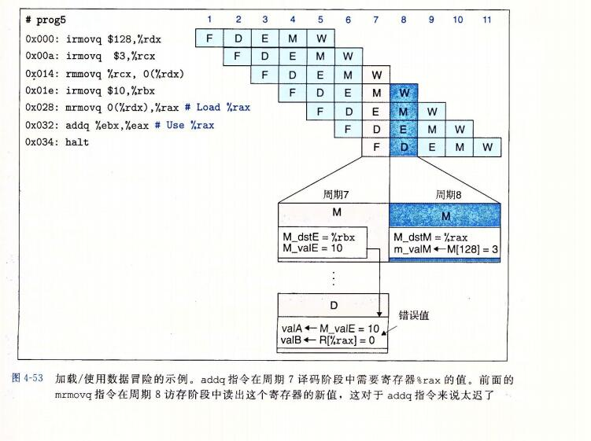

## 4、流水线的通用原理

```
在试图设计一个流水线化的 Y86-64 处理器之前，让我们先来看看流水线化的系统的一些通用属性和原理。

流水线的一个重要特性就是提高了系统的 吞吐量(throughput),也就是单位时间内服务的顾客总数，不过它也会轻微地增加延迟(latency), 也就是服务一个用户所需要的时间。
```

### 1、计算流水线

```
让我们把注意力放到计算流水线上来，这里的"顾客"就是指令，每个阶段完成指令执行的一部分。
图4-32a 给出了一个很简单的非流水线化的硬件系统例子。

它是由一些执行计算的逻辑以及一个保存计算结果的寄存器组成的。
时钟信号控制在每个特定的时间间隔加载寄存器。
```


```
1秒=1000毫秒
1毫秒=1000微妙
1微妙=1000纳秒
1纳秒=1000皮秒

在现代逻辑设计中，电路延迟以纳秒或者皮秒(picosecond, 简写成 "ps"), 也就是10^-12 秒为单位来计算的。在这个例子中，我们假设组合逻辑需要 300ps, 而加载寄存器需要 20 ps。 
图4-32 还给出了一种时序图，称为流水线图(pipeline diagram).
在图中，时间从左向右流动。从上到下写着一组操作(在此称为 i1,i2,i3). 实心的长方形表示这些指令执行的时间。这个实现中，在开始下一条指令之前必须完成前一个。因此，这些方框在垂直方向上并没有相互重叠。

下面这个公式给出了运行这个系统的最大吞吐量：
1ns = 10^-9   ns 是纳秒的意思 
```


```
假设将系统执行的计算分成三个阶段(A、B和C)，每个阶段需要 100ps，如图 4-33 所示。
然后在各个阶段之间放上流水线寄存器(pipeline register), 这样每条指令都会按照三步经过这个系统，从头到尾需要三个完整的时钟周期。

如图4-33中的流水线图所示，只要 i1 从A进入B，就可以让i2进入阶段A了，依次类推。
在稳定状态下，三个阶段都应该是活动的，每个时钟周期，一条指令离开系统，一条新的进入。
从流水线图中第三个时钟周期就能看出这一点，此时，i1是在阶段C，i2在阶段B，而i3是在阶段A。在这个系统中，我们将时钟周期设为100+20 =120ps,得到的吞吐量大约为8.33GIPS。 因为处理一条指令需要 3 个时钟周期，所以这条流水线的延迟就是 3*120 = 360ps.
我们将系统吞吐量提高到原来的 8.33/3.12 =2.67倍，代价是增加了一些硬件，以及延迟的少量增加(360/320=1.12)。延迟变大是由于增加的流水线寄存器的时间开销。
```


### 2、流水线操作的详细说明

```
为了更好地理解流水线是怎样工作的，让我们来详细看看流水线计算的时序和操作。图4-34给出了前面我们看到过得三阶段流水线(图4-33)的流水线图。就想流水线图上方指明的那样，流水线阶段之间的指令转移是由时钟信号来控制的。每隔120ps，信号从0上升至1，开始下一组流水线阶段的计算。
```


```
从这个对流水线操作详细的描述中，我们可以看到减缓时钟不会影响流水线的行为。
信号传播到流水线寄存器的输入，但是直到时钟上升时才会改变寄存器的状态。
另一方面，如果时钟运行的太快，就会有灾难性的后果。
值可能会来不及通过组合逻辑，因此当时钟上升时，寄存器的输入还不是合法的值。
```

```
根据对SEQ处理器时序的讨论，我们看到这种在组合逻辑块之间采用时钟寄存器的简单机制，足够控制流水线中的指令流。随着时钟周而复始地上升下降，不同的指令就会通过流水线的各个阶段，不会互相干扰。
```

### 3、流水线的局限性

#### 1、不一样的划分


```
图4-36展示的系统中和前面一样，我们将计算划分为了三个阶段，但是通过这些阶段的延迟从 50ps 到 150ps 不等。通过所有阶段的延迟和仍然为300ps.
不过，运行适中的速率是由最慢的阶段的延迟限制的。

流水线图表明，每个时钟周期，阶段A都会空闲(用白色方框表示)100ps,而阶段C会空闲 50ps。只有阶段B会一直处于活动状态。我们必须将时钟周期设为 150+20=170ps,得到的吞吐量为5.88GIPS. 另外，由于时钟周期减慢了，延迟也增加到了 510ps.
```

```
对硬件设计者来说，将系统计算设计划分为一组具有相同延迟的阶段是一个严峻的挑战。
通常，处理器中的某些硬件单元，如ALU和内存，是不能被划分成多个延迟较小的单元的。 这就使得创建一组平衡的阶段非常困难。
在设计流水线化的 y86-64 处理器中，我们不会过于关注这一层次，但是理解时序优化在实际系统设计中的重要性还是非常重要的。
```

#### 2、流水线过深，收益反而下降


```
图4-37 说明了流水线技术的另一个局限性。在这个例子中，我们把计算分成了6个阶段，每个阶段需要50ps. 在每对阶段之间插入流水线寄存器就得到了一个六阶段流水线。这个系统的最小时钟周期为 50+20=70ps，吞吐量为 14.29GIPS.因此，通过将流水线的阶段数加倍，我们将性能提高了 14.29/8.33=1.71. 虽然我们将每个计算时钟的时间缩短了两倍，但是由于通过流水线寄存器的延迟，吞吐量并没有加倍。
这个延迟成了流水线吞吐量的一个制约的因素。在我们的新设计中，这个延迟占到了整个时钟周期的 28.6%

本来三个时钟完成 一个指令，三层流水线
现在六个时钟完成一个指令，六层流水线

但是由于流水线寄存器的延迟太高了。
```

```
为了提高时钟频率，现代处理器采用了很深的(15或更多的阶段)流水线。处理器架构师将指令的执行划分成很多非常简单的步骤，这样一来每个阶段的延迟就很小。电路设计者小心地设计流水线寄存器，使其延迟尽可能的小。
芯片设计者也必须小心地设计时钟传播网络，以保证时钟在整个芯片上同时改变。
所有这些都是设计高速微处理面临的挑战。
```


### 4、带反馈的流水线系统

```
到目前为止，我们只考虑一种系统，其中传过流水线的对象，对于x86-64 或 y86-64 这样执行机器程序的系统来说，相邻指令之间很可能是相关的。例如，下面的y86-64指令。
```


## 5、 Y86-64的流水线实现

```
我们终于准备好要开始本章的主要任务 -- 设计一个流水线化的 y86-64 处理器。
首先，对顺序的 SEQ 处理器做一点小的改动，将 PC 的计算挪到取指阶段。
然后，在各个阶段之间加上流水线寄存器。到这个时候，我们的尝试还不能正确处理各种数据和控制相关。不过，做一些修改，就能实现我们的目标 -- 一个高效的、流水线化的实现 Y86-64 ISA 处理器。
```

### 1、SEQ+: 重新安排计算阶段

```
作为实现流水线设计的 一个过渡步骤，我们必须稍微调整一下 SEQ 中五个阶段的顺序，使得更新 PC 阶段在一个时钟周期开始时执行，而不是结束时才执行。
只需要对整体硬件结构做最小的改动，对于流水线阶段中的活动的时序，它能工作的更好。我们称这种修改过的设计为 "SEQ+".

我们移动PC阶段，使得它的逻辑在时钟周期开始时活动，使它计算当前指令的pc值。
tu4-29 给出了 SEQ 和 SEQ+ 在PC计算上的不同之处。
在 SEQ 中(图4-39a)，pc计算发生在时钟周期结束的时候，根据当前时钟周期内计算出的信号值来计算PC寄存器的新值。

在 SEQ+ 中(图4-39b)，我们创建状态寄存器来保存在一条指令执行过程中计算出来的信号。然后，当一个新的时钟周期开始时，这些信号值通过同样的逻辑来计算当前指令的 PC。
我们将这些寄存器标号为 "pIcode"、"pCnd"等等，来指明在任一给定的周期，它们保存的是前一个周期中产生的控制信号

```


```
SEQ+ 中的 pc 奇怪在哪里

SEQ+ 有一个很奇怪的特色，那就是没有硬件寄存器来存放程序计数器。而是根据从前一条指令保存下来的一些状态信息动态的计算 pc.
这就是一个小小的证明--我们可以以一种与ISA隐含着的概念模型不同的方式来实现处理器，只要处理器能正确执行任意的机器语言程序。
我们不需要将状态编码成程序员可见的状态指定的形式，只要处理器能够为任意的程序员可见状态(例如 程序计数器)产生正确的值。在创建流水线化的设计中，我们会更多的使用到这条原则。
```

```
SEQ 到 SEQ+ 中对状态单元的改变是一种很通用的改进的例子，这种改进称为电路重定时(circuit retiming). 
重定时改变了一个系统的状态表示，但是并不改变它的逻辑行为。通常用它来平衡一个流水线系统中各个阶段之间的延迟.
```


```
图4-40给出了 SEQ+ 硬件的一个更为详细的说明。可以看到，其中的硬件单元和控制块与我们在 SEQ 中用到的(图 4-23)一样，只不过 PC 逻辑从上面(在时钟周期结束时活动)移到了下面(在时钟开始时活动)
```


### 2、插入流水线寄存器

```
在创建一个流水线化的 Y86-64 处理器的最初尝试中，我们要在 SEQ+ 的各个阶段之间插入流水线寄存器，并对信号重新排列，得到 PIPE- 处理器，
这里的 "-" 代表这个处理器和最终的处理器设计相比，性能要差一点。 PIPE- 的抽象结构如图 4-41 所示。

流水线寄存器在该图中用黑色方框表示，每个寄存器包括不同的字段，
同两个顺序处理器的硬件结构(图4-23和图4-40)中的圆角框不同，这些白色的方框表示实际的硬件组成。	
```


```
可以看到，pipe- 使用了与顺序设计 SEQ(图4-40)几乎一样的硬件单元，但是有流水线寄存器分隔开这些阶段。两个系统中信号的不同之处在 4.5.3 节中讨论

流水线寄存器按如下方式标号：
F	保存程序计数器的预测值

D	位于取指和译码阶段之间。它保存关于最新取出的指令的信息，即将由译码阶段进行处理。

E	位于译码和执行阶段之间。它保存关于最新译码的指令和从寄存器文件读出的值的信息，即将由执行阶段进行处理。

M	位于执行和访存阶段之间。它保存最新执行的指令的结果，即将由访存阶段进行处理。它还保存着关于用于处理条件转移的分支条件和分支目标的信息

W 位于访存阶段和方框路径之间，反馈路径将计算出来的值提供给寄存器文件写，而当完成 ret 指令时，它还要向 PC 选择逻辑提供返回地址。
```

### 3、对信号进行重新排列和标号

```
顺序实现SEQ 和 SEQ+ 在一个时刻只处理一条指令，因此诸如 valC、scrA 和 valE 这样的信号值有唯一的值。在流水线化的设计中，与各个指令相关联的这些值有多个版本，会随着指令一起流过系统。

例如，在 PIPE- 的详细结构中，有4个标号为 "stat"的白色方框，保存着4条不同指令的状态码。我们需要很小心以确保使用的是正确版本的信号，否则会有很严重的错误，例如将一条指令计算出的结果存放到了另一条指令指定的目的寄存器。
我们采用命名机制，通过在信号名前面加上大写的流水线寄存器名字作为前缀，存储在流水线寄存器中的信号可以唯一的被标识。

例如，4个状态码可以被命名为 D_stat、E_stat、M_stat、W_stat. 
我们还需要引用某些在一个阶段内刚刚被计算出来的信号。他们的命名是在信号名前面加上小写的阶段名的第一个字母作为前缀。
以状态码为例，可以看到在取指和访存阶段中标号为 "stat"的控制逻辑块。因而，这些块的输出被命名为 f_stat 和 m_stat。我们还可以看到整个处理器的实际状态 Stat 是根据流水线寄存器 W 中的状态值，由写回阶段的块计算出来的。
```

```
信号 M_stat 和 m_stat 的差别

在命名系统中，大写的前缀"D"、"E"、"M"、"W" 指的是流水线寄存器，所以 M_stat 指的是流水线寄存器 M 的状态码字段。

小写的前缀 "f"、"d"、"e"、"m" 和 "w" 指的是流水线阶段，所以m_stat 指的是在访存阶段中由控制逻辑块产生出的状态信号。


大写的 D 代表的是流水线寄存器的字段，小写的d指的是引用了d阶段产生的stat.
一个指字段，一个指数据。


大写的 M 代表是流水线寄存器里面取出来的。
小写的 m 代表是刚刚在此阶段产生的值。还没有来得及存入流水线寄存器。
小写的 m 在下一个周期以后就会变成大写的 M 。(因为要进入下一阶段必须吧值存在流水线寄存器里面，下一个阶段需要使用就变成了从流水线寄存器里面取出来的了)


```


```
SEQ+ 和 PIPE- 的译码阶段都产生信号 dstE 和 dstM, 它们指明值 valE 和 valM 的目的寄存器。在SEQ+ 中，我们可以将这些信息直接连到寄存器文件写端口的地址输入。在PIPE-中，会在流水线中一直携带这些信号穿过执行和访存阶段，直到写回阶段才送到寄存器文件(如各个阶段的详细描述所示)。我们这样做是为了确保写端口的地址和数据输入是来自同一条指令。
否则，会将处于 写回阶段的指令的值写入，而寄存器ID却来自于处于译码阶段的指令。

作为一条通用原则，我们要保存处于一个流水线阶段中的指令的所有信息。

流水线因为 取指、译码、执行、访存、写回、更新PC
每一步都不会空闲，但是数据却不会混乱。
因为时钟的关系，因为流水线每一个模块一个时间点都只有一个指令运行，然后下个指令要进来的时候，将这个指令的结果保存到流水线寄存器里面，
```

```
PIPE- 中有一个块在相同表示形式的 SEQ+ 中是没有的，那就是译码阶段中标号为 "select A" 的块。我们可以看出，这个块会从来自流水线寄存器D的 valp 或从寄存器文件 A 端口中读出的值中选择一个，作为流水线寄存器 E 的值 valA. 包括这块是为了减少要携带给流水线寄存器 E 和 M 的状态数量。

用到 valP的指令只有 call 和 jxx 其他都是用 valA

在所有的指令中，只有 call 在访存阶段需要 valP 的值。只有跳转指令在执行阶段(当不需要进行跳转时)需要 valP 的值(需要跳转的时候就需要 valC 的值)。而这些指令又都不需要从寄存器文件中读出的值。因此我们合并这两个信号，将它们作为信号 valA 携带穿过流水线，从而可以减少流水线寄存器的状态数量。这样做就消除了 SEQ 和 SEQ+ 中标号为 "Data" 的块，这个块完成的是类似的功能。
在硬件设计中，像这样仔细确认信号是如何使用的，然后通过合并信号来减少寄存器状态和线路的数量，是很常见的。
```

```
如图 4-41 所示，我们的流水线寄存器包括一个状态码 stat 字段，开始时是在取指阶段计算出来的，在访存阶段有可能会被修改。在讲完正常指令执行的实现之后，我们会在4.5.6节中讨论如何实现异常事件的处理。到目前为止我们可以说，最系统的方法就是让与每条指令关联的状态码与指令一起通过流水线。
```

### 4、预测下一个pc

```
在PIPI- 设计中，我们采取了一些措施来正确处理控制相关。流水线设计的目的就是每个时钟周期都发射一条新指令，也就是说每个时钟周期都有一条新指令进入执行阶段并最终完成。要是达到这个目的也就意味着吞吐量是每个时钟周期一条指令。

要做到这一点，我们必须在取出当前指令之后，马上确定下一条指令的位置。不幸的是，如果取出的指令是条件分支指令，要到几个周期后，也就是指令通过执行阶段之后，我们才能知道是否要选择分支。类似地，如果取出的指令是 ret, 要到指令通过访存阶段，才能确定返回地址。
```

```
除了条件转移指令和 ret 以外，根据取指阶段中计算出的信息，我们能够确定下一条指令的地址。
对于 call 和 jmp(无条件转移)来说，下一条指令的地址是指指令中的常数字 valC,而对于其他指令来说就是  valP.因此，通过预测 PC 的下一个值，在大多数情况下，我们能达到每个时钟周期发射一条新指令的目的。对于大多数指令类型来说，我们的预测是完全可靠的。
对于条件转移来说，我们既可以预测选择了分支，那么新 PC 值应为 valC,也可以预测没有选择分支，那么新PC值应为 valP. 无论哪种情况，我们都必须以某种方式来处理预测错误的情况，因此此时已经取出并部分执行了错误的指令。
```

```
猜测分支方向并根据猜测开始取指的技术称为分支预测。实际上所有的处理器都采用了某种形式的此类技术。对于预测是否选择分支的有效策略已经进行了广泛的研究。
我们的设计值使用了简单的策略，即总是预测选择了条件分支，因此预测PC的新值为 valC.
```

```
我们的设计使用总是选择(always taken)分支的预测策略。研究表明这个策略的成功率大约为 60%。相反，从不选择(never taken, NT)策略的成功率大约为 40%。

稍微复杂一点的是反向选择、正向不选择(backward taken, forward not-taken)的策略，当分支地址比下一条地址低时就预测选择分支，而分支地址比较高时，就预测不选择分支。这种策略的成功率大约为65%。这种源自一个事实，即循环式由后向分支结束的，而循环通常会执行多次。前向分支用于条件操作，而这种选择的可能性较小。


指令的地址高低：指令是由低向高的，地址1：A指令，地址2：B指令；
地址1 比地址2 小，低

循环因为是
jump: aa
pool:
	xxx
	xxx
aa:	
	jxx:pool
是向后(低，下)跳转的

判断分支是
jxx: 
	pool
	xxx
pool:
	xxx
向下（前）跳转的
```


```
ret 的预测方式
使用栈的返回地址预测

对于大多数程序来说，预测返回值很容易，因为过程调用和返回是成对出现的。大多数函数调用，会返回到调用后的那条指令。
高性能处理器中运用了这个属性，在取指单元中放入一个硬件栈，保存过程调用指令产生的返回地址。
每次执行过程调用指令时，都将其返回地址压入栈中。
当取出一个返回指令时，就从这个栈中弹出顶部的值，作为预测的返回值。

同分支预测一样，在预测错误时，必须提供一个恢复机制，因为还是有调用和返回不匹配的时候。通常，这种预测很可靠。这个硬件栈对程序员来说是不可见的。
```


```
PIPE- 的取值阶段，如果 4-41 底部所示，负责预测 PC 的下一个值，以及为取指选择实际的 PC 。我们可以看到，标号为 "Predict PC"的块会从 PC 增加器计算出的 valP 和取出的指令中得到 valC 中进行选择。
这个值存放在流水线寄存器 F 中，作为程序计数器的预测值。
标号为"Select PC" 的块类似于 SEQ+的PC选择阶段中标号为"PC"的块。

它从三个值中选择一个作为指令内存的地址：
预测的PC，
对于流水线寄存器M的不选择分支的指令来说是 valP 的值(存储在寄存器 M_valA中)，
或是当 ret 指令达到流水线寄存器w(存储在 W_valM)时的返回地址的值。
```


### 5、流水线冒险

```
PIPE- 结构是创建一个流水线化的 Y86-64 处理器的好开端。不过，将流水线技术引入一个带反馈的系统，当相邻指令间存在相关时会导致出现问题。在完成我们的设计之前，必须解决两个问题。
1、数据相关
2、控制相关

数据相关：
	下一条指令会用到这一条指令计算出的结果;
	
控制相关：
	一条指令要确定下一条指令的位置，
	
	例如：在执行跳转、调用或返回指令时。这些相关可能会导致流水线产生计算错误，称为冒险(hazard).
	同相关一样，冒险也可以分为两类：
		数据冒险(data hazard)和控制冒险(control hazard)
		
我们首先关心的是数据冒险，然后再考虑控制冒险。
```


```
图 4-43 描述的是 PIPE- 处理器处理 prog1 指令序列的情况。假设在这个例子以及后面的例子中，程序寄存器初始时值都为0.这段代码将值10和3放入程序寄存器 %rdx 和 %rax, 执行三条 nop 指令，然后将寄存器 %rdx 加到 %rax.

我们重点关注两条 irmovq 指令和 addq 指令之间的数据相关造成的可能的数据冒险。
图的右边是这个指令序列的流水线图。图中突出显示了周期 6 和 7 的流水线阶段。流水线图的下面是周期6中写回活动和周期7中译码活动的扩展说明。
在周期7开始以后，两条 irmovq 都已经通过写回阶段，所以寄存器文件保存着更新过的 %rdx 和 %rax 的值。
因此，当 addq 指令在周期7经过译码阶段时，它可以读到源操作数的正确值。
```


#### 列举数据冒险的类型

```
当一条指令更新后面指令会读到的那些程序状态时，就有可能出现冒险。对于 Y86-64 来说，程序状态包括程序寄存器、程序计数器、内存、条件码寄存器和状态寄存器。让我们来看看在提出的设计中每类状态出现冒险的可能性。
```

```
程序寄存器：
	我们已经认识这种冒险了。出现这种冒险是因为寄存器文件的读写是在不同的阶段进行的，导致不同指令之间可能出现不希望的相互作用。
	
程序计数器：
	更新和读取程序计数器之前的冲突导致了控制冒险。当我们的取值阶段逻辑在取下一条指令之前，正确预测了程序计数器的新值时，就不会产生冒险。预测错误的分支和ret指令需要特殊的处理，下面讲解。
	
内存：
	对数据内存的读和写都发生在访存阶段。在一条读内存的指令到达这个阶段之前，前面所有要写内存的指令都已经完成这个阶段了。 
	另外，在访存阶段中写数据的指令和在取指阶段中的读指令之间可能会有冲突。
因为指令和数据内存访问的是同一个地址空间。只有包含自我修改代码的程序才会发生这种情况，在这样的程序中，指令写内存的一部分，过后会从中取出指令。有些系统有复杂的机制来检测和避免这种冒险，而有些系统只是简单的强制要求程序不应该使用自我修改代码。
为了简便，假设程序不能修改自身，因此我们不需要采取特殊的措施，根据在程序执行过程中对数据内存的修改来修改指令内存.

条件码寄存器:
	在执行阶段中,整数操作会写这些寄存器. 条件传送指令会在执行阶段以及条件转移会在执行阶段以及条件转移会在访存阶段读这些寄存器.
	在条件传送或转移到达执行阶段之前，前面所有的整数操作都已经完成这个阶段了。所以不会发生冒险
	
状态码寄存器：
	指令流经流水线的时候，会影响程序状态。我们采用流水线中的每条指令都与一个状态码相关联的机制，使得当异常发生时，处理器能够有条理地停止。
	

这些分析表明我们只需要处理寄存器数据冒险、控制冒险，以及确保能够正确处理异常。当设计一个复杂系统时，这样的分类分析是很重要的。这样做可确认出系统实现中可能的困难，还可以指导生成用于检查系统正确性的测试程序。
```

#### 1、用暂停来避免数据冒险

```
暂停(stalling)是避免冒险的一种常用技术，暂停时，处理器会停止流水线中一条或多条指令，直到冒险条件不再满足。让一条指令停顿在译码阶段，直到产生它的源操作数的指令通过了写回阶段，这样我们的处理器就能避免数据冒险。


图4-47(prog2)和图4-48(prog4)画出了暂停的效果。
当指令 addq 处于译码阶段时，流水线控制逻辑发现执行、访存或写回阶段中至少有一条指令会更新寄存器 %rdx 或 %rax.处理器不会让 addq 指令带着不正确的结果通过这个阶段,而是会暂停指令，将它阻塞在译码阶段，时间为一个周期(对 prog2 来说)或者三个周期(对 prog4 来说)。对所有这三个程序来说，addq 指令最终都会在周期 7 中得到两个源操作数的正确值，然后继续沿着流水线进行下去。

	将addq指令阻塞在译码阶段时，我们还必须将紧跟其后的 halt 指令阻塞在取指阶段。通过将程序计数器保持不变就能做到这一点，这样一来，会不断的对 halt 指令进行取指，直到暂停结束。
	
	暂停技术就是让一组指令阻塞在它们所处的阶段，而允许其他指令继续通过流水线。那么在本该正常处理 addq 指令的阶段中，我们该做些什么呢？我们使用的处理方法是：每次要把一条指令阻塞在译码阶段，就在执行阶段插入一个气泡。气泡就像一个自动产生的 nop 指令 -- 它不会改变寄存器、内存、条件码或程序状态。
	
	在图4-47和图4-48的流水线图中，白色方框表示的就是气泡。在这些图中，我们用一个 addq 指令的标号为 "D" 的方框标号为 "E" 的方框之间的箭头来表示一个流水线气泡，这些箭头表明，在执行阶段中插入气泡是为了替代 addq 指令，它本来应该经过译码阶段进入执行阶段。
```


```
在使用暂停技术来解决冒险的过程中，我们通过动态地产生和 prop1 流(图4-43)一样的流水线流，有效的执行了程序 prog2 和 prog4 。为 prog2 插入一个气泡，为 prog4 插入3个气泡，与在第2条 irmovq 指令和 addq 指令之间有 3 条 nop 指令，有相同的效果。虽然实现这一机制想当容易，但是得到的 性能并不很好。
一条指令更新一个寄存器，紧跟其后的指令就使用了被更新的寄存器，像这样的情况不胜枚举。这会导致流水线暂定长达三个周期，严重降低了整体的吞吐量。
```


#### 2、用转发来避免数据冒险

```
	PIPE- 的设计是在译码阶段从寄存器文件中读入源操作数，但是对这些源寄存器的写有可能要在写回阶段才能进行。
	与其暂停直到写完成，不如简单的将要写的值传到流水线寄存器 E 作为源操作数。
图4-49用 prog2 周期 6 的流水线图的扩展描述来说明了这一策略。
译码阶段逻辑发现，寄存器%rax是操作数 valB 的源寄存器，而在写端口 E 上还有一个对 %rax 的未进行的写。
它只要简单的将提供到端口E的数据字(信号 W_valE)作为操作数 valB 的值，就能避免暂停。这种将结果值直接从一个流水线阶段传到较早阶段的技术称为 数据转发(data forwarding, 或简称转发，有时称为旁路(bypassing)).

它使得 prog2 的指令能通过流水线而不需要任何暂停。数据转发需要在基本的硬件结构中增加一些额外的数据连接和控制逻辑。
```


```
程序 prog2-prog4 中描述的转发技术的使用都是
将 ALU 产生的以及其目标为写端口 E 的值进行转发，
其实也可以转发从内存中读出的以及其目标为写端口M的值。

从访存阶段，我们可以转发刚刚从数据内存读出的值(m_valM).从写回阶段，我们可以转发对端口 M 未进行的写(信号 W_valM). 这样一共就有五个不同的转发源(e_valE、m_valM、M_valE、W_valM 和 W_valE), 以及两个不同的转发目的(valA 和 valB).
```


```
图4-49~图4-51 的扩展图还表明译码阶段逻辑能够确定是使用来自寄存器文件的值，还是要用转发过来的值。
与每个要写回寄存器文件的值相关的是目的寄存器ID。
逻辑会将这些ID与源寄存器ID srcA 和 srcB 相比较，以此来检测是否需要转发。可能有多个目的寄存器 ID 与一个源 ID 相等。要解决这样的情况，我们必须在各个转发源中建立起优先级关系。在学习转发逻辑的详细设计时，我们会讨论这个内容。
```

```
图4-52给出的是 PIPE 的结构，它是 PIPE- 的扩展，能通过转发处理数据冒险。
将这幅图与 PIPE- 的结构(图4-41)相比，我们可以看到来自五个转发源的值反馈到译码阶段中两个标号为 "Sel+Fwd A"和"Fwd B"的块。标号为 "Sel+Fwd A"的块是 PIPE- 中标号为 "Select A"的块的功能与转发逻辑的结合。它允许流水线寄存器E的valA 为已增加的程序计数器值 valP, 从寄存器文件A端口读出的值，或者某个转发过来的值。标号为 "Fwd B"的块实现的是源操作数 valB 的转发逻辑。
```


#### 3、加载/使用数据冒险

```
有一类数据冒险不能单纯的用转发来解决，因为内存读在流水线发生的比较晚。

图4-53举例说明了 加载/使用冒险(load/use hazard), 其中一条指令(位于地址 0x028 的 mrmovq)从内存中读出寄存器&rax 的值，而下一条指令(位于地址 0x032 的 addq)需要该值作为源操作数。
图的下部是周期7和8的扩展说明，在此假设所有的程序寄存器都初始化为 0，。addq 指令在周期 7 中需要改寄存器的值，但是 mrmovq 指令直到周期 8 才产生出这个值。
为了从 mrmovq "转发到" addq, 转发逻辑不得不将值送回到过去的时间！这显然是不可能的，我们必须找到其他机制来解决这种形式的数据冒险。
```




```
如图4-54所示，我们可以将暂停和转发结合起来，避免加载/使用数据冒险。这个需要修改控制逻辑，但是可以使用现有的旁路路径。当 mrmovq 指令通过执行阶段时，流水线控制逻辑发现译码阶段中的指令(addq)需要从内存中读出的结果。

它会将译码阶段中的指令暂停一个周期，导致执行阶段中插入一个气泡。

```


```
这种用暂停来处理加载/使用冒险的方法称为 加载互锁(load interlock)。加载互锁和转发技术结合起来足以处理所有可能类型的数据冒险。因为只有加载互锁会降低流水线的吞吐量，我们几乎可以实现每个时钟周期发射一条新指令的吞吐量目标。
```


#### 4、避免控制冒险


```
如这张图所示，在周期3中取出 ret指令，并沿着流水线前进，在周期7进入写回阶段。在它经过译码、执行和访存阶段时，流水线不能做任何有用的活动。我们只能在流水线中插入三个气泡。
一旦ret指令达到写回阶段，PC选择逻辑就会将程序计数器设为返回地址，然后取指阶段就会取出位于返回点(地址 0x013)处的 irmovq 指令。
```


