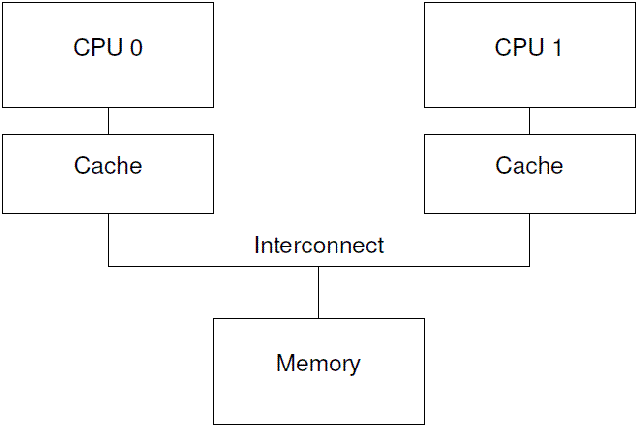
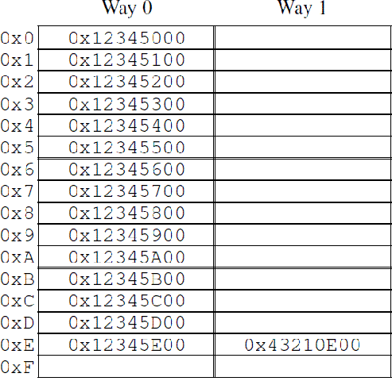

## 一、前言

```
到底是什么原因导致 CPU 的设计者吧 memory barrir 这样的大招强加给可怜的，不知情的 SMP(Symmetrical Multi-Processing， 多核处理器)软件设计者？
```

```
一言蔽之，性能，因为对内存访问顺序的重排可以获取更好的性能，如果某些场合下，程序的逻辑正确性需要内存访问顺序和 program order 一致，例如：同步原语，那么 SMP 软件工程师可以使用 memory barrier 这样的工具阻止  CPU 对内存访问的优化。
```

```
如果你想了解更多，需要充分理解 CPU cache 是如何工作的以及如何让 CPU cache 更好的工作，本文的主要内容包括：
1、描述 cache 的结构。
2、描述 cache-coherency protocol 如果保证 cache 一致性
3、描述 store buffers 和 invalidate queues 如何获取更好的性能。
```

```
在本文中，我们将了解到 memory barrier 为何是一个必须存在的"邪恶的东西"，一方面，它对性能或扩展性有很大的杀伤力，另外一方面，为了程序的逻辑正确，memory barrier 这个"邪恶的东西"必须存在。

而之所以会有 memory barrier 这个"邪恶的东西"是由于 CPU 的速度快于(数量级的差异)memory 以及他们之间的互连器件(interconnect)。
```

## 二、Cache structure

```
现代  CPU 的速度要远快与 memory system。
一个2006年的CPU可以每ns执行10条指令，但是却需要几十个ns来从main memory中获取数据。这个速度的差异（超过2个数量级）使得现代CPU一般会有几个MB的cache。当然这些cache可以分成若干的level，最靠近CPU那个level的cache可以在一个cycle内完成memory的访问。我们抽象现代计算机系统的cache结构如下：
```



```
CPU cache 和 memory 系统使用固定大小的数据块来进行交互，这个数据块被称为 cache line, cache line 的 size 一般是 2的整数次幂，根据设计的不同，从16B到256B不等。当CPU首次访问某个数据的时候，它没有在cpu cache中，我们称之为cache miss（更准确的说法是startup或者warmup cache miss）。在这种情况下，cpu需要花费几百个cycle去把该数据对应的cacheline从memory中加载到cpu cache中，而在这个过程中，cpu只能是等待那个耗时内存操作完成。一旦完成了cpu cache数据的加载，随后的访问会由于数据在cache中而使得cpu全速运行。
```

```
运行一段时间之后，cpu cache的所有cacheline都会被填充有效的数据，这时候的，要加载新的数据到cache中必须将其他原来有效的cache数据“强制驱离”（一般选择最近最少使用的那些cacheline）。
这种cache miss被称为capacity miss，因为CPU cache的容量有限，必须为新数据找到空闲的cacheline。
有的时候，即便是cache中还有idle的cacheline，旧的cache数据也会被“强制驱离”，以便为新的数据加载到cacheline中做准备。
当然，这是和cache的组织有关。
size比较大的cache往往实现成hash table（为了硬件性能），所有的cache line被分成了若干个固定大小的hash buckets（更专业的术语叫做set），这些hash buckets之间不是形成链表，而是类似阵列，具体如下图所示：
```



```
L1L2L3 缓存部分省略不写了

毫无疑问，系统中的各个CPU在进行数据访问的时候有自己的视角（通过自己的cpu cache），因此小心的维持数据的一致性变得非常重要。
如果不仔细的进行设计，有可能在各个cpu这对自己特定的CPU cache进行加载cacheline、设置cacheline无效、将数据写入cacheline等动作中，把事情搞糟糕，例如数据丢失，或者更糟糕一些，不同的cpu在各自cache中看到不同的值。这些问题可以通过cachecoherency protocols来保证，也就是下一节的内容。
```

 

## 三、cachecoherency protocols

```
Cache-coherency 协议用来管理 cacheline 的状态，从而避免数据丢失或者数据一致性问题。
这些协议可能非常复杂，定义几十个状态，本节我们只关心MESI cache-coherence 协议中的四个状态。
```

### 1、MESI状态

```
MESI 是 "modified","exclusive","shared","invalid" 首字母的大写，当使用 MESI cache-coherence 协议的时候，cacheline 可以处于这四个状态中的一个，因此，HW 工程师设计 cache 的时候，除了物理地址和具体的数据之外，还需要为每一个 cacheline 设计一个 2-bit 的 tag 来标识该 cacheline 的状态。
```

````
处于 modified 状态的 cacheline 说明近期有过来自对应 cpu 的写操作，同时也说明该数据不会存在其他 cpu 对应的 cache 中。
因此，处于 modified 状态的 cacheline 也可以说是被该 CPU 独占。

而又因为只有该 CPU 的cache 保存了最新的数据(最终的 memory 中都没有更新)，所以，该 cache 需要对该数据负责到底。

例如根据请求，该cache 将数据及其控制权传递到其他 cache 中，或者 cache 需要负责将数据写回到 memory 中，而这些操作都需要在 reuse 该 cache line 之前完成。
````

```
eclusive 和 modified 状态非常相似，唯一的区别就是对应 CPU 还没有修改 cacheline 中的数据，也正因为还没有修改数据，因此 memory 中对应的 data 也是最新的。
在 exclusive 状态下，cpu 也可以不通知其他 CPU cache 而直接对 cacheline 进行操作，因此，exclusive 状态也可以被认为是被该cpu 独占。

由于 memory 中的数据和 cacheline 中的数据都是最新的，因此，cpu 不需对 exclusive 状态的 cacheline 执行写回的操作或者将数据以及归属权转交其他 cpu cache，而直接 reuse 该 cacheline(将 cache line 中的数据丢弃，用作他用)。
```

```
处于 share 状态的 cacheline, 其数据可能在一个或者多个 cpu cache 中，因此，处于这种状态的 cache line， CPU 不能直接修改 cacheline 的数据，而是需要首先和其他 CPU cache 进行沟通。

和exclusive状态类似，处于share状态的cacheline对应的memory中的数据也是最新的，因此，cpu也可以直接丢弃cacheline中的数据而不必将其转交给其他CPU cache或者写回到memory中。
```

```
处于 invaild 状态的 cacheline 是空的，没有数据。
当新的数据要进入 cache 的时候，优选状态是invalid的cacheline，之所以如此是因为如果选中其他状态的cacheline，则说明需要替换cacheline数据，而未来如果再次访问这个被替换掉的cacheline数据的时候将遇到开销非常大的cache miss。
```

```
由于所有的CPU需要通过其cache看到一致性的数据，因此cache-coherence协议被用来协调cacheline数据在系统中的移动。
```

### 2、MESI protocol messages

```
在上节中描述的各种状态的迁移需要CPU之间的通信，如果所有CPU都是在一个共享的总线上的时候，下面的message就足够了：
```

#### 1、read

```
read message 用来获取指定物理地址上 的 cacheline 数据。
就是要用这个 read 来获取这个 物理地址的最新数据。
这个数据可能是来自于内存，也可能是来自于其他cpu 缓存(modified 状态)。


```

#### 2、read response

