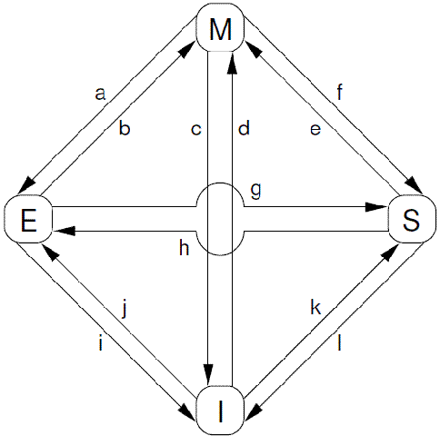
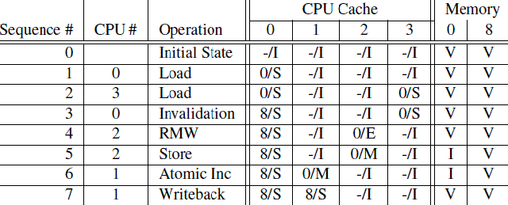
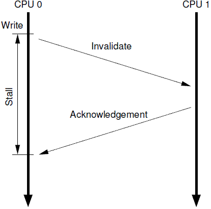
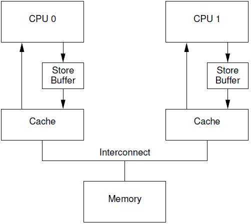

## 一、前言

```
到底是什么原因导致 CPU 的设计者吧 memory barrir 这样的大招强加给可怜的，不知情的 SMP(Symmetrical Multi-Processing， 多核处理器)软件设计者？
```

```
一言蔽之，性能，因为对内存访问顺序的重排可以获取更好的性能，如果某些场合下，程序的逻辑正确性需要内存访问顺序和 program order 一致，例如：同步原语，那么 SMP 软件工程师可以使用 memory barrier 这样的工具阻止  CPU 对内存访问的优化。
```

```
如果你想了解更多，需要充分理解 CPU cache 是如何工作的以及如何让 CPU cache 更好的工作，本文的主要内容包括：
1、描述 cache 的结构。
2、描述 cache-coherency protocol 如果保证 cache 一致性
3、描述 store buffers 和 invalidate queues 如何获取更好的性能。
```

```
在本文中，我们将了解到 memory barrier 为何是一个必须存在的"邪恶的东西"，一方面，它对性能或扩展性有很大的杀伤力，另外一方面，为了程序的逻辑正确，memory barrier 这个"邪恶的东西"必须存在。

而之所以会有 memory barrier 这个"邪恶的东西"是由于 CPU 的速度快于(数量级的差异)memory 以及他们之间的互连器件(interconnect)。
```

## 二、Cache structure

```
现代  CPU 的速度要远快与 memory system。
一个2006年的CPU可以每ns执行10条指令，但是却需要几十个ns来从main memory中获取数据。这个速度的差异（超过2个数量级）使得现代CPU一般会有几个MB的cache。当然这些cache可以分成若干的level，最靠近CPU那个level的cache可以在一个cycle内完成memory的访问。我们抽象现代计算机系统的cache结构如下：
```


```
CPU cache 和 memory 系统使用固定大小的数据块来进行交互，这个数据块被称为 cache line, cache line 的 size 一般是 2的整数次幂，根据设计的不同，从16B到256B不等。当CPU首次访问某个数据的时候，它没有在cpu cache中，我们称之为cache miss（更准确的说法是startup或者warmup cache miss）。在这种情况下，cpu需要花费几百个cycle去把该数据对应的cacheline从memory中加载到cpu cache中，而在这个过程中，cpu只能是等待那个耗时内存操作完成。一旦完成了cpu cache数据的加载，随后的访问会由于数据在cache中而使得cpu全速运行。
```

```
运行一段时间之后，cpu cache的所有cacheline都会被填充有效的数据，这时候的，要加载新的数据到cache中必须将其他原来有效的cache数据“强制驱离”（一般选择最近最少使用的那些cacheline）。
这种cache miss被称为capacity miss，因为CPU cache的容量有限，必须为新数据找到空闲的cacheline。
有的时候，即便是cache中还有idle的cacheline，旧的cache数据也会被“强制驱离”，以便为新的数据加载到cacheline中做准备。
当然，这是和cache的组织有关。
size比较大的cache往往实现成hash table（为了硬件性能），所有的cache line被分成了若干个固定大小的hash buckets（更专业的术语叫做set），这些hash buckets之间不是形成链表，而是类似阵列，具体如下图所示：
```


```
L1L2L3 缓存部分省略不写了

毫无疑问，系统中的各个CPU在进行数据访问的时候有自己的视角（通过自己的cpu cache），因此小心的维持数据的一致性变得非常重要。
如果不仔细的进行设计，有可能在各个cpu这对自己特定的CPU cache进行加载cacheline、设置cacheline无效、将数据写入cacheline等动作中，把事情搞糟糕，例如数据丢失，或者更糟糕一些，不同的cpu在各自cache中看到不同的值。这些问题可以通过cachecoherency protocols来保证，也就是下一节的内容。
```

 

## 三、cachecoherency protocols

```
Cache-coherency 协议用来管理 cacheline 的状态，从而避免数据丢失或者数据一致性问题。
这些协议可能非常复杂，定义几十个状态，本节我们只关心MESI cache-coherence 协议中的四个状态。
```

### 1、MESI状态

```
MESI 是 "modified","exclusive","shared","invalid" 首字母的大写，当使用 MESI cache-coherence 协议的时候，cacheline 可以处于这四个状态中的一个，因此，HW 工程师设计 cache 的时候，除了物理地址和具体的数据之外，还需要为每一个 cacheline 设计一个 2-bit 的 tag 来标识该 cacheline 的状态。
```

````
处于 modified 状态的 cacheline 说明近期有过来自对应 cpu 的写操作，同时也说明该数据不会存在其他 cpu 对应的 cache 中。
因此，处于 modified 状态的 cacheline 也可以说是被该 CPU 独占。

而又因为只有该 CPU 的cache 保存了最新的数据(最终的 memory 中都没有更新)，所以，该 cache 需要对该数据负责到底。

例如根据请求，该cache 将数据及其控制权传递到其他 cache 中，或者 cache 需要负责将数据写回到 memory 中，而这些操作都需要在 reuse 该 cache line 之前完成。
````

```
eclusive 和 modified 状态非常相似，唯一的区别就是对应 CPU 还没有修改 cacheline 中的数据，也正因为还没有修改数据，因此 memory 中对应的 data 也是最新的。
在 exclusive 状态下，cpu 也可以不通知其他 CPU cache 而直接对 cacheline 进行操作，因此，exclusive 状态也可以被认为是被该cpu 独占。

由于 memory 中的数据和 cacheline 中的数据都是最新的，因此，cpu 不需对 exclusive 状态的 cacheline 执行写回的操作或者将数据以及归属权转交其他 cpu cache，而直接 reuse 该 cacheline(将 cache line 中的数据丢弃，用作他用)。
```

```
处于 share 状态的 cacheline, 其数据可能在一个或者多个 cpu cache 中，因此，处于这种状态的 cache line， CPU 不能直接修改 cacheline 的数据，而是需要首先和其他 CPU cache 进行沟通。

和exclusive状态类似，处于share状态的cacheline对应的memory中的数据也是最新的，因此，cpu也可以直接丢弃cacheline中的数据而不必将其转交给其他CPU cache或者写回到memory中。
```

```
处于 invaild 状态的 cacheline 是空的，没有数据。
当新的数据要进入 cache 的时候，优选状态是invalid的cacheline，之所以如此是因为如果选中其他状态的cacheline，则说明需要替换cacheline数据，而未来如果再次访问这个被替换掉的cacheline数据的时候将遇到开销非常大的cache miss。
```

```
由于所有的CPU需要通过其cache看到一致性的数据，因此cache-coherence协议被用来协调cacheline数据在系统中的移动。
```

### 2、MESI protocol messages

```
在上节中描述的各种状态的迁移需要CPU之间的通信，如果所有CPU都是在一个共享的总线上的时候，下面的message就足够了：
```

#### 1、read

```
read message 用来获取指定物理地址上 的 cacheline 数据。
就是要用这个 read 来获取这个 物理地址的最新数据。
这个数据可能是来自于内存，也可能是来自于其他cpu 缓存(modified 状态)。


```

#### 2、read response

```
该message包括两个参数，一个是地址，另外一个是写回的数据。
该消息用在modified状态的cacheline被驱逐出境（给其他数据腾出地方）的时候发出，该命名用来将最新的数据写回到memory（或者其他的CPU cache中）。
```

```
有意思的是基于共享内存的多核系统其底层是基于消息传递的计算机系统。这也就意味着由多个SMP 机器组成的共享内存的cluster系统在两个不同的level上使用了消息传递机制，一个是SMP内部的message passing，另外一个是SMP机器之间的。
```


### 3、MESI State Diagram

```
根据protocol message的发送和接收情况，cacheline会在“modified”, “exclusive”, “shared”, 和 “invalid”这四个状态之间迁移，具体如下图所示：
```



```
对上图中的状态迁移解释如下：
```

#### 1、transition(a)

```
cache可以通过writeback transaction将一个cacheline的数据写回到memory中（或者下一级cache中），这时候，该cacheline的状态从Modified迁移到Exclusive状态。对于cpu而言，cacheline中的数据仍然是最新的，而且是该cpu独占的，因此可以不通知其他cpu cache而直接修改之。
```

#### 2、Transition (b)

```
在Exclusive状态下，cpu可以直接将数据写入cacheline，不需要其他操作。
相应的，该cacheline状态从Exclusive状态迁移到Modified状态。
这个状态迁移过程不涉及bus上的Transaction（即无需MESI Protocol Messages的交互）。
```

#### 3、Transition (c)

```
CPU 在总线上收到一个read invalidate的请求，同时，该请求是针对一个处于modified状态的cacheline.
在这种情况下，CPU必须该cacheline状态设置为无效，并且用read response”和“invalidate acknowledge来回应收到的read invalidate的请求，完成整个bus transaction。

一旦完成这个transaction，数据被送往其他cpu cache中，本地的copy已经不存在了。
```

#### 4、Transition(d)

```
CPU需要执行一个原子的readmodify-write操作，并且其cache中没有缓存数据，这时候，CPU就会在总线上发送一个read invalidate用来请求数据，同时想独自霸占对该数据的所有权。
该CPU的cache可以通过read response获取数据并加载cacheline，同时，为了确保其独占的权利，必须收集所有其他cpu发来的invalidate acknowledge之后（其他cpu没有local copy），完成整个bus transaction。
```

#### 5、Transition (e)

```
CPU需要执行一个原子的readmodify-write操作，并且其local cache中有read only的缓存数据（cacheline处于shared状态），这时候，CPU就会在总线上发送一个invalidate请求其他cpu清空自己的local copy，以便完成其独自霸占对该数据的所有权的梦想。

同样的，该cpu必须收集所有其他cpu发来的invalidate acknowledge之后，才算完成整个bus transaction。
```

#### 6、Transition (f)

```
在本cpu独自享受独占数据的时候，其他的cpu发起read请求，希望获取数据，这时候，本cpu必须以其local cacheline的数据回应，并以read response回应之前总线上的read请求。

这时候，本cpu失去了独占权，该cacheline状态从Modified状态变成shared状态（有可能也会进行写回的动作）。
```

#### 7、Transition (g)

```
这个迁移和f类似，只不过开始cacheline的状态是exclusive，cacheline和memory的数据都是最新的，不存在写回的问题。

总线上的操作也是在收到read请求之后，以read response回应。
```

#### 8、Transition (h)

```
如果cpu认为自己很快就会启动对处于shared状态的cacheline进行write操作，因此想提前先霸占上该数据。
因此，该cpu会发送invalidate敦促其他cpu清空自己的local copy，当收到全部其他cpu的invalidate acknowledge之后，transaction完成，本cpu上对应的cacheline从shared状态切换exclusive状态。


还有另外一种方法也可以完成这个状态切换：当所有其他的cpu对其local copy的cacheline进行替换操作，同时将cacheline中的数据设为无效（主要是为了为新的数据腾些地方），这时候，本cpu坐享其成，直接获得了对该数据的独占权。
```

#### 9、Transition (i)

```
其他的CPU进行一个原子的read-modify-write操作，但是，数据在本cpu的cacheline中，因此，其他的那个CPU会发送read invalidate，请求对该数据以及独占权。
本cpu回送read response”和“invalidate acknowledge”，一方面把数据转移到其他cpu的cache中，另外一方面，清空自己的cacheline。
```

#### 10、Transition (j)

```
cpu想要进行write的操作但是数据不在local cache中，因此，该cpu首先发送了read invalidate启动了一次总线transaction。
在收到read response回应拿到数据，并且收集所有其他cpu发来的invalidate acknowledge之后（确保其他cpu没有local copy），完成整个bus transaction。
当write操作完成之后，该cacheline的状态会从Exclusive状态迁移到Modified状态。
```

#### 11、Transition (k)

```
本CPU执行读操作，发现local cache没有数据，因此通过read发起一次bus transaction，来自其他的cpu local cache或者memory会通过read response回应，从而将该cacheline从Invalid状态迁移到shared状态。
```

#### 12、Transition (l)

```
cacheline处于shared状态的时候，说明在多个cpu的local cache中存在副本，因此，这些cacheline中的数据都是read only的，一旦其中一个cpu想要执行数据写入的动作，必须先通过invalidate获取该数据的独占权，而其他的CPU会以invalidate acknowledge回应，清空数据并将其cacheline从shared状态修改成invalid状态。
```


### 4、MESI protocol Example

```
OK，在理解了各种cacheline状态、各种MESI协议消息以及状态迁移的描述之后，我们从cache line数据的角度来看看MESI协议是如何运作的。开始，数据保存在memory的0地址中，随后，该数据会穿行在四个CPU的local cache中。为了方便起见，我们让CPU local cache使用最简单的Direct-mapped的组织形式。具体的过程可以参考下面的图片：
```



```
最开始的时候：
sequence 0:
	各个cpu cache中的cacheline都是Invalid状态，而Memory中的数据都保存了最新的数据。
	
sequence 1:
	CPU 0执行了load操作，将address 0的数据加载到寄存器，这个操作使得保存0地址数据的那个cacheline从invalid状态迁移到shared状态。(因为不知道其他cpu上是否还有该数据，就默认为 shared 状态)
	
sequence 2：
	随后（sequence 2），CPU3也对0地址执行了load操作，导致其local cache上对应的cacheline也切换到shared状态。当然，这时候，memory仍然是最新的。
	
sequence 3：
	CPU 0执行了对地址8的load操作，由于地址0和地址8都是选择同一个cache set，而且，我们之前已经说过，该cache是direct-mapped的（即每个set只有一个cacheline），因此需要首先清空该cacheline中的数据（该操作被称为Invalidation），由于cacheline的状态是shared，因此，不需要通知其他CPU。Invalidation local cache上的cacheline之后，cpu 0的load操作将该cacheline状态修改成Shared状态（保存地址8的数据）。
	
sequence 4：
	CPU 2也开始执行load操作了（sequence 4），虽然是load操作，但是CPU知道程序随后会修改该值（不是原子操作的read-modify-write，否就是迁移到Modified状态了，也不是单纯的load操作，否则会迁移到shared状态），因此向总线发送了read invalidate命令，一方面获取该数据（自己的local cache中没有地址0的数据），另外，CPU 2想独占该数据（因为随后要write）。这个操作导致CPU 3的cacheline迁移到invalid状态。当然，这时候，memory仍然是最新的有效数据。
	上面为什么一定要 read invalidate 而不能直接 invalidate 呢？ write 又不需要知道那个地址原先的值。
	因为写之前必须要获取那个地址呀，原理就是那样，L1缓存必须要获取那个地址，然后才能写
	
	
	
	
Sequence 5：
	由于准备工作做的比较充分（Exclusive状态，独占该数据），cpu直接修改cacheline中的数据（对应地址0），从而将其状态迁移到modified状态，同时要注意的是：memory中的数据已经失效，不是最新的数据了，任何其他CPU发起对地址0的load操作都不能从memory中读取，而是通过嗅探（snoop）的方式从CPU 2的local cache中获取。
	
sequence 6：
	在sequence 6中，CPU 1对地址0的数据执行原子的加1操作，这时候CPU 1会发出read invalidate命令，将地址0的数据从CPU 2的cacheline中嗅探得到，同时通过invalidate其他CPU local cache的内容而获得独占性的数据访问权。这时候，CPU 2中的cacheline状态变成invalid状态，而CPU 1将从invalid状态迁移到modified状态。
	
sequence 7:
	最后（sequence 7），CPU 1对地址8进行load操作，由于cacheline被地址0占据，因此需要首先将其驱逐出cache，于是执行write back操作将地址0的数据写回到memory，同时发送read命名，从CPU 0的cache中获得数据加载其cacheline，最后，CPU1的cache变成shared状态（保存地址8的数据）。由于执行了write back操作，memory中地址0的数据又变成最新的有效数据了。
```


## 四、Stores Result in Unnecessary Stalls

```
在上面的现代计算机cache结构图，我们可以看出，针对某些特定地址的数据（在一个cacheline中）重复的进行读写，这种结构可以获得很好的性能，不过，对于第一次写，其性能非常差。下面的这个图可以展示为何写性能差：
```



```
cpu 0发起一次对某个地址的写操作，但是local cache没有数据，该数据在CPU 1的local cache中，因此，为了完成写操作，CPU 0发出invalidate的命令，invalidate其他CPU的cache数据。只有完成了这些总线上的transaction之后，CPU 0才能正在发起写的操作，这是一个漫长的等待过程。
```

```
但是，其实没必要等待这么长的时间，毕竟，物理CPU 1中的cacheline保存有什么样子的数据，其实都没有意义，这个值都会被CPU 0新写入的值覆盖的。
```


### 1、Store buffers

```
有一种可以阻止cpu进入无聊等待状态的方法就是在CPU和cache之间增加store buffer这个HW block，如下图所示：
```



```
一旦增加了store buffer，那么cpu0无需等待其他CPU的相应，只需要将要修改的内容放入store buffer，然后继续执行就OK了。
当cacheline完成了bus transaction，并更新了cacheline的状态后，要修改的数据将从store buffer进入cacheline。
```

```
这些store buffer对于cpu而言是local的，如果系统是硬件多线程， 那么每一个cpu core拥有自己私有的stroe buffer，一个cpu只能访问自己私有的那个store buffer。
在上图中，cpu 0不能访问cpu1的store buffer，反之亦然。
之所以做这样的限制是为了模块划分（各个cpu core模块关心自己的事情，让cache系统维护自己的操作），让硬件设计变得简单一些。
store buffer增加了CPU连续写的性能，同时把各个CPU之间的通信的任务交给维护cache一致性的协议。
即便给每个CPU分配私有的store buffer，仍然引入了一些复杂性，我们会在下面两个小节中描述。
```


### 2、Store Forwarding

```

```


