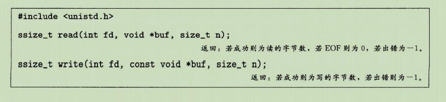
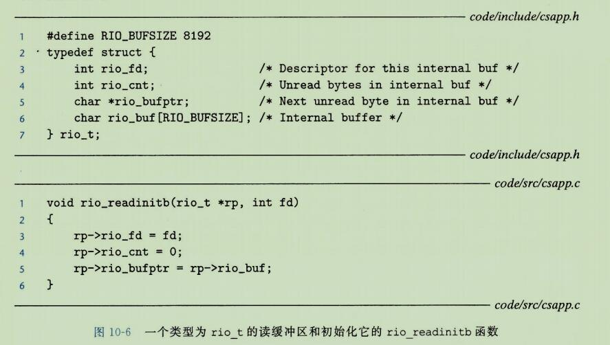

**10、系统级I/O**

```
输入/输出(I/O)是在主存和外部设备(例如磁盘驱动器、终端和网络)之间复制数据的过程。
输入操作时从 I/O 设备复制数据到主存。
而输出操作时从主存复制到 I/O 设备
```


## 1、Unix I/O

```
一个Linux 文件就是一个 m 个字节的序列：
B0,B1,...Bk,...Bm-1

所有的I/O设备(例如网络、磁盘和终端)都被模型化为文件，而所有的输入和输出都被当做对相应文件的读和写来执行。
这种设备优雅的映射为文件的方式，允许 Linux 内核引出一个简单、低级的应用接口，称为 Unix I/O, 这使得所有的输入和输出都能以一种统一且一致的方式来执行：
```

```
打开文件：
	一个应用程序通过要求内核打开相应的文件，来宣告它想要访问一个 I/O 设备。
	内核返回一个小的非负整数，叫做描述符，它在后续对此文件的所有操作中标识这个文件。
	内核记录有关这个打开文件的所有信息。
	应用程序只需记住这个描述符。
```

```
linux shell 创建的每个进程开始时都有三个打开的文件：
	标准输入(描述符为 0)、标准输出(描述符为 1)和标准错误(描述符为 2)。
头文件<unistd.h>定义了常量 STDIN_FILENO   STDOUT_FILENO   STDERR_FILENO, 它们可用来代替显式的描述符值。
```

```
改变当前的文件位置(应该就是我们在文件的的光标这类的)：
	对于每个打开的文件，内核保持着一个文件位置 k, 初始为0。
这个文件位置是从文件开头起始的字节偏移量。(就是用来标识当前位置与文件开头起始的字节之间的距离，一开始当前文件位置就在文件开头起始的字节，所以文件位置为 0)
应用程序能够通过执行 seek 操作，显式的设置文件的当前位置为k。
```

```
读写文件：
	一个读操作就是从文件复制到 n>0 个字节到内存，从当前文件位置 k 开始，然后将 k 增加到 k+n。
	给定一个大小为 m 个字节的文件，当 k>=m 时执行读操作会触发一个称为 end-of-file(EOF)的条件，应用程序能检测到这个条件。
	在文件结尾处并没有明确的"EOF 符号"。
```

```
类似的，写操作就是从内存复制 n>0 个字节到一个文件，从当前文件位置 k  开始，然后更新 K。
```

```
关闭文件:
	当应用完成了对文件的访问之后，它就通知内核关闭这个文件。
作为响应，内核释放文件打开时创建的数据结构，并将这个描述符恢复到可用的描述符池中。
无论一个进程因为何种原因终止时，内核都会关闭所有打开的文件并释放它们的内存资源。
```


## 2、文件

```
每个 Linux文件都有一个类型(type)来表明它在系统中的角色：
```

```
普通文件(regular file)包含任意数据。
	应用程序常常要区分文本文件(text file)和二进制文件(binary file)，
文本文件是只含有 ASCII 或 Unicode 字符的普通文件;
二进制文件是所有其他文件。
对于内核而言，文本文件和二进制文件没有区别。

	Linux 文本文件包含了一个文本行(text line)序列，其中每一行都是一个字符序列，以一个新行符("/n")结束。
	新行符与ASCII的换行符(LF)是一样的，其数字值为 0x0a。
```

```
目录(directory)是包含这一组链接(link)的文件，其中每个链接都将一个文件名(filename)映射到一个文件，这个文件可能是另一个目录。
每个目录至少含有两个条目：
	"." 是到该目录自身的链接，
	以及".."是到目录层次结构(见下文)中父目录(parent directory)的链接。
	你可以用 mkdir 命令创建一个目录，用 ls 查看其内容，用 rmdir 删除该目录。
```

```
套接字(socket)是用来与另一个进程进行网络通信的文件(11.4节)。
```

```
其他文件类型包含命名通道(named pipe)、符号链接(symbolic link),以及字符和块设备(character and block device),这些不在本书的讨论范畴。
```

```
Linux 内核将所有文件都组织成一个目录层次结构(directory hierarchy),由名为/(斜杠)的根目录确定。
系统中的每个文件都是根目录的直接或间接的后代。
图10-1显示了 Linux 系统的目录层次结构的一部分。
```


```
作为其上下文的一部分，每个进程都有一个当前工作目录(current working directory) 来确定其在目录层次结构中的当前位置。
你可以用 cd 命令来修改 shell 中的当前工作目录。
```

```
目录层次结构中的位置用路径名(pathname)来指定。
路径名是一个字符串，包括一个可选斜杠。其后紧跟一系列的文件名，文件名之间用斜杠分隔。
路径名有两种格式：
```


## 3、打开和关闭文件

### 1、open函数

```
进程是通过调用 open 函数来打开一个已存在的文件或者创建一个新文件的：
```


```
open 函数将 filename 转换为一个文件描述符，并且返回描述符数字。
返回的描述符总是在进程中当前没有打开的最小描述符。
flags参数指明了进程打算如何访问这个文件：
O_RDONLY : 只读
O_WRONLY : 只写
O_RDWR   : 可读可写
```

```
例如，下面的代码说明如何以读的方式打开一个已存在的文件：
fd = Open("foo.txt", O_RDONLY, 0);
```

```
flags 参数也可以是一个或者更多位的掩码的或，为写提供给一些额外的指示：
O_CREATE: 如果文件不存在，就创建它的一个截断的(truncated)(空)文件。

O_TRUNC: 如果文件已经存在，就截断它。

O_APPEND: 在每次写操作前，设置文件位置到文件的结尾处。
```

```
fd = Open("foo.txt", O_WRONLY|O_APPEND, 0);
```

```
mode 参数指定了新文件的访问权限位。
这些位的符号名字如图 10-2所示。
```


```
作为上下文的一部分，每个进程都有一个 umask, 它是通过调用 umask 函数来设置的。
当进程通过带某个 mode 参数的 open 函数调用来创建一个新文件时，文件的访问权限位被设置为 mode&~umask。 
```


### 2、close函数


## 4、读和写文件

```
应用程序是通过分别调用 read 和 write 函数来执行输入和输出的 。
```



```
read 函数从描述符为 fd 的当前文件位置复制最多 n 个字节到内存位置 buf。
返回值 -1 表示一个错误，而返回值 0 表示 EOF。
否则，返回值表示的是实际传送的字节数量。
```

```
write 函数从内存位置 buf 复制至多 n 个字节到描述符 fd 的当前文件位置。
```


```
在某些情况下,read 和 write 传送的字节比应用程序要求的要少。
这些不足值(short count)不表示有错误。
出现这样的情况的原因有：
```


## 5、用 RIO 包健壮地读写

```
在这一小节里，我们会讲述一个 I/O 包，称为 RIO(Robust I/O, 健壮的 I/O)包，它会自动为你处理上文中所述的不足值。
在像网络程序这样容易出现不足值的应用中，RIO包提供了方便、健壮和高效的 I/O。
RIO提供了两类不同的函数：
```

```
无缓冲的 输入输出函数：
	这些函数直接在内存和文件之间传送数据，没有应用级缓冲。
它们对将二进制数据读写到网络和从网络读写二进制数据尤其有用。
```

```
带缓冲的输入函数：
	这些函数允许你高效的从文件中读取文本行和二进制数据，这些文件的内容缓存在应用级缓冲区内，类似于为 printf 这样的标准I/O函数提供的缓冲区。
	与[110]中讲述的带缓冲的I/O例程不同，带缓冲的 RIO 输入函数是线程安全的(12.7.1节)，它在同一个描述符上可以被交错的调用。
	例如，你可以从一个描述符中读一些文本行，然后读取一些二进制数据，接着再多读取一些文本行。
```

```
我们讲述 RIO 例程有两个原因。
第一，在接下来的两章中，我们开发的网络应用中使用了它们。
第二，通过学习这些例程的代码，你将总体上对 UnixI/O 有更深入的了解。
```


### 1、RIO的无缓冲的输入输出函数

```
通过调用 rio_readn 和 rio_writen 函数，应用程序可以在内存和文件之间直接传送数据。
```


```
rio_readn 函数从描述符fd的当前文件位置最多传送 n 个字节到内存位置 usrbuf。
类似地， rio_writen 函数从位置 usrbuf 传送 n 个字节到描述符 fd。
rio_read 函数在遇到 EOF 时只能返回一个不足值。
rio_writen 函数绝不会返回不足值。
对同一个描述符，可以任意交错的调用 rio_readn 和 rio_writen。
```

```
图 10-4显示了 rio——readn 和 rio_writen 的代码。
注意，如果 rio_readn 和 rio_writen 函数被一个从应用信号处理程序的返回中断，那么每个函数都会手动的重启 read 或 write。
为了尽可能的有较好的可移植性，我们允许被中断的系统调用，且在必要时重启它们。
```


### 2、RIO 的带缓冲的输入函数

```
假设我们要编写一个程序来计算文本文件中文本行的数量，该如何来实现呢？
一种方法就是用 read 函数来一次一个字节的从文件传送到用户内存，检查每个字节来查找换行符。
这个方法的缺点是效率不是很高，没读取文件中的一个字节都要求陷入内核。
```

```
一种更好的方法是调用一个包装函数(rio_readlineb), 它从一个内部读缓冲区复制一个文本行，当缓冲区变空时，会自动的调用 read 重新填满缓冲区。
对于既包含文本行也包含二进制数据的文件(例如 11.5.3 节中描述的 HTTP 响应)，我们也提供了一个 rio_readn 带缓冲区的版本，叫做 rio_readnb,  它从和 rio_readblineb 一样的读缓冲区中传送原始字节。
```


```
每打开一个描述符，都会调用一次 rio_radinitb 函数。
它将描述符 fd 和地址 rp 处的一个类型为 rio_t 的读缓冲区联系起来。

rio_readlineb 函数从文件 rp 读出下一个文本行(包括结尾的换行符)，将它复制到内存位置 usrbuf, 并且用 NULL(零)字符来结束这个文本行。
rio_readlineb 函数最多读 maxlen - 1 个字节，余下的一个字符留给结尾的 NULL 字符。
超过 maxlen - 1 字节的文本行被截断，并用一个 NULL 字符结束。
```


```
rio_readnb 函数从文件 rp 最多读 n 个字节到内存位置 usrbuf。对同一个描述符，对 rio_readlineb 和 rio_readnb 的调用可以任意交叉进行。
然而，对这些带缓冲的函数的调用却不应和无缓冲的 rio_readn 函数交叉使用。
```


```
本书的剩下的部分中将给出大量的RIO函数的示例。
图10-5 展示了如何使用 RIO 函数来一次一行的从标准输入复制一个文本文件到标准输出。
```


```
图10-6 展示了一个读缓冲区的格式，以及初始化它们的 rio_readinitb 函数的代码。
rio_readinitb 函数创建了一个空的读缓冲区，并且将一个打开的文件描述符和这个缓冲区联系起来。
```



```
RIO 读程序的核心是图 10-7 所示的 rio_read 函数。
rio_read 函数是 Linux read 函数的还缓冲的版本。
当调用 rio_read 要求读 n 个字节时，读缓冲区内有 rp->rio_cnt 个未读字节。
如果缓冲区为空，那么会通过调用 read 再填满它。
这个 read 调用收到一个不足值并不是错误，只不过读缓冲区是填充了一部分。
一旦缓冲区非空，rio_read 就从读缓冲区复制 n 和 rp->rio_cnt 中较小值个字节到用户缓冲区，并返回复制的字节数。
```


## 6、读取文件元数据

```
应用程序能够通过调用 stat 和 fstat 函数，检索到关于文件的信息(有时也称为文件的元数据(metadata))。
```


```
stat 函数以一个文件名作为输入，并填写如图10-9所示的一个 stat 数据结构中的各个成员。
fstat 函数是相似的，只不过是以文件描述符而不是文件名作为输入。
当我们在 11.5 节中讨论 web 服务器时，会需要 stat 数据结构中的 st_mode 和 st_szie 成员，其他成员则不在我们的讨论之列。
```


```
st_size 成员包含了文件的字节数大小。
st_mode 成员则编码了文件访问许可证(图10-2)和文件类型(10.2节)。
Linux 在 sys/stat.h 定义了宏谓词来确定 st_mode 成员的文件类型：

S_ISREG(m)。这是一个普通文件吗？
S_ISDIR(m)。这是一个目录文件吗？
S_ISSOCK(m)。这是一个网络套接字吗？
```

```
图10-10展示了我们会如何使用这些宏和 stat 函数来读取和解释一个文件 st_mode 位。
```


## 7、读取目录文件


## 8、共享文件

```
可以用许多不同的方式来共享 lunux 文件。
除非你很清楚内核是如何表示打开的文件，否则文件共享的概念想当难懂。
内核用三个相关的数据结构来表示打开的文件：
```

```
描述符表(descriptor table)。
每个进程都有它独立的描述符表，它的表项是由进程打开的文件描述符来索引的。
每个打开的描述符表项指向文件表中的一个表项。
```

```
文件表(file table)。
打开文件的集合是由一张文件表来表示的，所有的进程共享这张表。
每个文件表的表项组成(针对我们的目的)包括当前的文件位置、引用计数(reference count)(即当前指向该表项的描述符表项数)，以及一个指向 v-node 表中对应表项的指针。
关闭一个描述符会减少相应的文件表项中的引用计数。
内核不会删除这个文件表表项，知道它的引用计数为零。
```

```
v-node 表(v-node table)。
同文件表一样，所有进程共享这张 v-node 表。每个表项包含 stat 结构中的大多数信息，包括 st_mode 和 st_size 成员。
```


```
如图 10-13 所示，多个描述符也可以通过不同的文件表项来引用同一个文件。
例如，如果以同一个 filename 调用 open 函数两次，就会发生这种情况。
关键思想是每个描述符都有它自己的文件位置，所以对不同描述符的读操作可以从文件的不同位置获取数据。
```


**练习题**


## 9、I/O 重定向

```
Linux shell 提供了 I/O 重定向操作符，允许用户将磁盘文件和标准输入输出联系起来。
例如，键入
linux> ls > foo.txt
```

```
使得  shell 加载和执行 ls 程序，将标准输出重定向到磁盘文件 foo.txt。


就如我们将在 11.5 中看到的那样，当一个 WEB 服务器代表客户端运行 CGI 程序时，它就执行一种相似类型的重定向。
那么I/O重定向是如何工作的呢？一种方式是使用 dup2 函数。
```


```
dup2 函数复制描述符表项 oldfd 到描述符表项 newfd, 覆盖描述符表项 newfd 以前的内容。
如果 newfd 已经打开了，dup2会在复制 oldfd 之前关闭 newfd。
```

```
假设在调用 dup2(4,1)之前，我们的状态如图10-12所示，其中描述符1(标准输出)对应于文件A(比如一个终端)，描述符4对应于文件B(比如一个磁盘文件)。
A和B的引用计数都等于1。

图10-15显示了调用 dup2(4,1)之后的情况。
两个描述符现在都指向文件B;文件A已经被关闭了，并且它的文件表和 v-node 表表项也被删除了;文件B的引用计数已经增加了。
从此以后，任何写到标准输出的数据都被重定向到文件B。
```


## 10、标准I/O


## 11、综合： 我该使用哪些 I/O 函数


