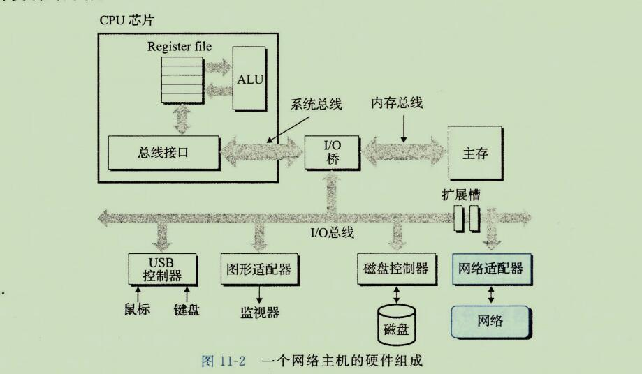

**网络编程**

## 1、客户端-服务器编程模式

```
每个网络应用都是基于客户端-服务器模型的。
采用这个模型，一个应用是由一个服务器进程和一个或者多个客户端进程组成。
服务器管理某种资源，并且通过操作这种资源来为它的客户端提供某种服务。

例如，一个web服务器管理着一组磁盘文件，它会代表客户端进行检索和执行。
一个FTP服务器管理着一组磁盘文件，它会为客户端进行存储和检索。
相似的，一个电子邮件服务器管理着一些文件，它为客户端进行读和更新。
```

```
客户端-服务器模式中的基本操作是事务(transaction)(见图11-1)。
一个客户端-服务器事务由以下四步组成。

1)当一个客户端需要服务时，它向服务器发送一个请求，发起一个事务。
例如，当Web服务器需要一个文件时，它就发送一个请求给web服务器。

2)服务器收到请求后，解释它，并以适当的方式操作它的资源。
例如，当web服务器收到浏览器发出的请求后，它就读一个磁盘文件。

3)服务器给客户端发送一个响应，并等待下一个请求。
例如，web服务器将文件发送回客户端。

4)客户端收到响应并处理它。
例如，当web浏览器收到来自服务器的一页后，就在屏幕上显示此页。
```


```
认识到客户端和服务器是进程，而不是常提到的机器或者主机，这是很重要的。
一台主机可以同时运行许多不同的客户端和服务器，而且一个客户端和服务器的事务可以在一台或是不同的主机上。无论客户端和服务器是怎样映射到主机上的客户端-服务器模型都是先相同的。
```


## 2、网络

```
客户端和服务器通常运行在不同的主机上，并且通过计算机网络的硬件和软件资源来通信。
网络是很复杂的系统，在这里我们只想了解一点皮毛。
我们的目标是从程序员的角度给你一个切实可行的思维模型。

对主机而言，网络只是又一种I/O设备，是数据源和数据接收方，如图11-2所示。
```



```
一个插到I/O总线扩展槽的适配器提供了到网络的物理接口。
从网络上接收到的数据从适配器经过I/O和内存总线复制到内存，通常是通过DMA传送。
相似的，数据也能从内存复制到网络。
```

```
物理上而言，网络是一个按照地理远近组成的层次系统。
最底层是 LAN(Local Area Network,局域网)，在一个建筑或者校园范围内。
迄今为止，最流行的局域网技术是以太网(Ethernet),它是由施乐公司帕洛阿尔托研究中心(Xerox PARC)在20世纪70年中期提出的。
以太网技术被证明是适应力极强的，从3Mb/s 演变到了 10Gb/s。
```


```
一个以太网段(Ethernet segment)包括一些电缆(通常是双绞线)和一个叫做集线器的小盒子，如图11-3所示。
以太网通常跨越一些小的区域，例如某建筑物的一个房间或者一个楼层。
每根电缆都有相同的最大位带宽，通过是100Mb/s 或者 1Gb/s。
一端连接到主机的适配器，而另一端则连接到集线器的一个端口上。
集线器不加分辨的将从一个端口上收到的每个位复制到其他所有的端口上。
因此，每台主机都能看到每个位。
```

```
每个以太网适配器都有一个全球唯一的48位地址，它存储在这个适配器的非易失性存储器上。
一台主机可以发送一段位(称为帧(frame))到这个网段内的其他任何主机。
每个帧包括一些固定数量的头部(header)位,用来标识此帧的源和目的地址以及此帧的长度，此后紧随的就是数据位的有效载荷(payload)。
每个主机适配器都能看到这个帧，但是只有目的主机实际读取它。
```


