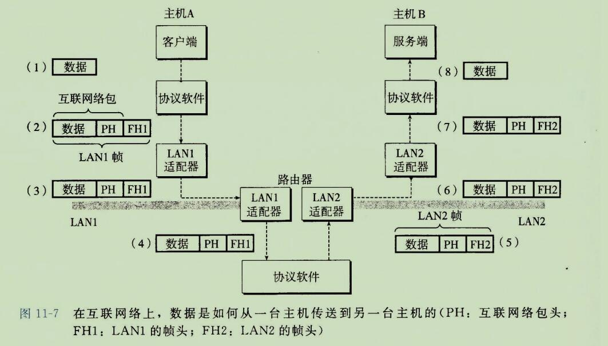
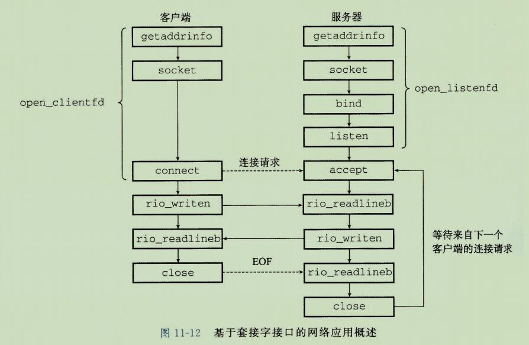
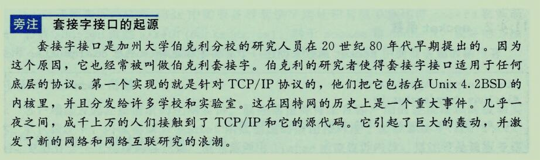

**网络编程**

## 1、客户端-服务器编程模式

```
每个网络应用都是基于客户端-服务器模型的。
采用这个模型，一个应用是由一个服务器进程和一个或者多个客户端进程组成。
服务器管理某种资源，并且通过操作这种资源来为它的客户端提供某种服务。

例如，一个web服务器管理着一组磁盘文件，它会代表客户端进行检索和执行。
一个FTP服务器管理着一组磁盘文件，它会为客户端进行存储和检索。
相似的，一个电子邮件服务器管理着一些文件，它为客户端进行读和更新。
```

```
客户端-服务器模式中的基本操作是事务(transaction)(见图11-1)。
一个客户端-服务器事务由以下四步组成。

1)当一个客户端需要服务时，它向服务器发送一个请求，发起一个事务。
例如，当Web服务器需要一个文件时，它就发送一个请求给web服务器。

2)服务器收到请求后，解释它，并以适当的方式操作它的资源。
例如，当web服务器收到浏览器发出的请求后，它就读一个磁盘文件。

3)服务器给客户端发送一个响应，并等待下一个请求。
例如，web服务器将文件发送回客户端。

4)客户端收到响应并处理它。
例如，当web浏览器收到来自服务器的一页后，就在屏幕上显示此页。
```


```
认识到客户端和服务器是进程，而不是常提到的机器或者主机，这是很重要的。
一台主机可以同时运行许多不同的客户端和服务器，而且一个客户端和服务器的事务可以在一台或是不同的主机上。无论客户端和服务器是怎样映射到主机上的客户端-服务器模型都是先相同的。
```


## 2、网络

```
客户端和服务器通常运行在不同的主机上，并且通过计算机网络的硬件和软件资源来通信。
网络是很复杂的系统，在这里我们只想了解一点皮毛。
我们的目标是从程序员的角度给你一个切实可行的思维模型。

对主机而言，网络只是又一种I/O设备，是数据源和数据接收方，如图11-2所示。
```


```
一个插到I/O总线扩展槽的适配器提供了到网络的物理接口。
从网络上接收到的数据从适配器经过I/O和内存总线复制到内存，通常是通过DMA传送。
相似的，数据也能从内存复制到网络。
```

```
物理上而言，网络是一个按照地理远近组成的层次系统。
最底层是 LAN(Local Area Network,局域网)，在一个建筑或者校园范围内。
迄今为止，最流行的局域网技术是以太网(Ethernet),它是由施乐公司帕洛阿尔托研究中心(Xerox PARC)在20世纪70年中期提出的。
以太网技术被证明是适应力极强的，从3Mb/s 演变到了 10Gb/s。
```


```
一个以太网段(Ethernet segment)包括一些电缆(通常是双绞线)和一个叫做集线器的小盒子，如图11-3所示。
以太网通常跨越一些小的区域，例如某建筑物的一个房间或者一个楼层。
每根电缆都有相同的最大位带宽，通过是100Mb/s 或者 1Gb/s。
一端连接到主机的适配器，而另一端则连接到集线器的一个端口上。
集线器不加分辨的将从一个端口上收到的每个位复制到其他所有的端口上。
因此，每台主机都能看到每个位。
```

```
每个以太网适配器都有一个全球唯一的48位地址，它存储在这个适配器的非易失性存储器上。
一台主机可以发送一段位(称为帧(frame))到这个网段内的其他任何主机。
每个帧包括一些固定数量的头部(header)位,用来标识此帧的源和目的地址以及此帧的长度，此后紧随的就是数据位的有效载荷(payload)。
每个主机适配器都能看到这个帧，但是只有目的主机实际读取它。
```

```
使用一些电缆和佳作网桥(bridge)的小盒子，多个以太网段可以连接成较大的局域网，称为桥接以太网(bridge Ethernet), 如图11-4所示。
桥接以太网能够跨越整个建筑物或者校区。
再一个桥接以太网里，一些电缆连接网桥与网桥，而另外一些连接网桥和集线器。
这些电缆的带宽可以是不同的。
在我们的示例中，网桥与网桥之间的电缆有1Gb/s 的带宽，而四根网桥和集线器之间电缆的带宽却是100Mb/s。
```


```
集线器连接了一个个网络适配器，成为了一个以太网段，而网桥将一个个集线器，也就是以太网段连接起来，变成了一个以太网。
而最流行的局域网技术就是以太网。
局域网是一个建筑或者一个校园范围内。
```

```
网桥比集线器更充分的利用了电缆带宽。
利用一种聪明的分配算法，它们随着时间自动学习哪个主机可以通过哪个端口可达。
例如，如果主机A发送一个帧到同网段上的主机B, 当该帧到达网桥X的输入端口时，X就讲丢弃此帧，因而节省了其他网段上的带宽。
然而，如果主机A发送一个帧到一个不同网段上的主机C，那么网桥X只会把此帧复制到和网桥Y相连的端口上，网桥Y只会把此帧复制到与主机 C 的网段连接的端口。 
```

```
为了简化局域网的表示，我们将把集线器和网桥以及连接他们的电缆画成一根水平线，如图11-5所示。
```


```
在层次的更高级别中，多个不兼容的局域网可以通过叫做路由器(router)的特殊计算机连接起来，组成一个 internet(互联网络)。

每台路由器对于它所连接到的每个网络都有一个适配器(端口)。
路由器也能连接高速点到点电话连接，这是称为 WAN(Wide-Area Network，广域网)的网络示例，之所以这么叫是因为它们覆盖的地理范围比局域网的大。
一般而言，路由器可以用来由各种局域网和广域网构建互联网络。

例如，图11-6 展示了一个互联网络的示例，3台路由器连接了一对局域网和一对广域网。
```

```
一般来说互联网就是国际互联网的简称，国际互联网就是Internet，所以互联网=Internet；
广域网是网络专业的一个专业术语，通常特指跨接很大物理范围的计算机网络，一般要超过几十公里，比如某公司总部在北京，分公司在上海，这两个地方的分别有各自的局域网，这两个局域网通过自建或者租用通讯线路的方式连接起来就构成了一个广域网络。
所以国际互联网是广域网的一种。

广域网是网络的一个类别，国际互联网是广域网的一个实例。就像山羊是一种羊，但是羊不一定就是山羊。
```


```
互联网络至关重要的特性是，它能由采用完全不同和不兼容技术的各种局域网和广域网组成。
每台主机和其他每台主机都是物理相连的，但是如何能够让某台主机跨过所有这些不兼容的网络发送数据位到另一台目的主机呢？
```

```
解决方法是一层运行在每台主机和路由器上的协议软件，它消除了不同网络之间的差异。
这个软件实现一种协议，这种协议控制主机和路由器如何协同工作来实现数据传输。

这种协议必须提供两种基本能力：
```

```
命名机制。
	
	不同的局域网技术有不同和不兼容的方式来为主机分配地址。
	互联网络协议通过定义一种一致的主机地址格式消除了这些差异。
	每台主机会被分配至少一个这种互联网络地址(internet address)，这个地址唯一的标识了这台主机。
	
	
传送机制：

	在电缆上编码位和将这些位封装成帧方面，不同的联网技术有不同的和不兼容的方式。
	互联网络协议通过定义一种把数据位捆扎成不连续的片(称为包)的统一方式，从而消除了这些差异。
	一个包是由包头和有效载荷组成的，其中包头包括包的大小以及源主机和目的主机的地址，有效载荷包括从源主机发出的数据位。
```



```
图11-7展示了主机和路由器如何使用互联网络协议在不兼容的局域网间传送数据的一个示例。
```

```
这个互联网络示例由两个局域网通过一台路由器连接而成。
一个客户端运行在主机 A 上，主机 A 与 LAN1 相连，它发送遗传数据字节到运行在主机 B 上的服务器端，主机 B 则连接在 LAN2 上。
这个过程有 8 个基本步骤：

1、运行在主机 A 上的客户端进行一个系统调用，从客户端的虚拟地址空间复制数据到内核缓冲区中。

2、主机 A 上的协议软件通过在数据前附加互联网络包头和 LAN1 帧头，创建了一个 LAN1 的帧。
互联网络包头寻址到互联网络主机B。
LAN1 帧头寻址到路由器。
然后它传送此帧到适配器。
注意，LAN1帧的有效载荷是一个互联网络包，而互联网络包的有效载荷是实际的用户数据。
这种封装是基本的网络互连方法之一。

3、LAN1 适配器复制该帧到网络上。

4、当此帧到达路由器时，路由器的LAN1 适配器从电缆上读取它，并把它传送到协议软件。

5、路由器从互联网络包头中提取出目的互联网络地址，并用它作为路由表的索引，确定向哪里转发这个包，在本例中是 LAN2。
路由器剥落旧的 LAN1 的帧头，加上寻址到主机 B 的新的 LAN2 帧头，并把得到的帧传送到适配器。

6、路由器的 LAN2 适配器复制该帧到网络上。

7、当此帧到达主机 B 时，它的适配器从电缆上读到此帧，并将它传送到协议软件。

8、最后，主机B上的协议软件剥落包头和帧头。
当服务器进行一个读取这些数据的系统调用时，协议软件最终得到的数据复制到服务器的虚拟地址空间。


包头是用来在路由器上进行路由的 可以用来查找目的主机。相应的局域网适配器应该可以通过 ip 地址找到 用来在局域网里使用的目的主机的  地址的。
局域网包头是用来在局域网范围内寻址的。
```

```
当然，在这里我们掩盖了许多很难的问题。
如果不同的网络有不同帧大小的最大值，该怎么办呢？
路由器如何知道该往哪里转发帧呢？
当网络拓扑变化时，如何通知路由器？
如果一个包丢失了又会如何呢？
虽然如此，我们的示例抓住了互联网络思想的精髓，封装是关键。
```


## 3、全球 IP 因特网

```
全球 IP 因特网是最著名和最成功的互联网络实现。
从 1969 年起，它就一这样或那样的形式存在了。
虽然因特网的内部体系结构复杂而且不断变化，但是自从20世纪80年代早期以来，客户端-服务器应用的组织就一直保持着相当的稳定。

图 11-8 展示了一个因特网客户端-服务器应用程序的基本硬件和软件组织。
```


```
每台因特网主机都运行实现 TCP/IP协议(transmission Control Protocol/ Internet Protocol, 传输控制协议/互联网络协议)的软件，几乎每个现代计算机系统都支持这个协议。
因特网的客户端和服务器混合使用套接字接口函数和 Unix I/O 函数来进行通信(我们将在 11.4 节中介绍套接字接口)。
通常将套接字函数实现为系统调用，这些系统调用会陷入内核，并调用各种内核模式的 TCP/IP 函数。
```

```
TCP/IP 世纪是一个协议族，其中每一个都提供不同的功能。
例如, IP 协议提供基本的命名方法和递送机制，这种递送机制能够从一台因特网主机往其他主机发送包，也叫做数据报(datagram)。
IP 机制从某种意义上而言是不可靠的，因为，如果数据报在网络中丢失或者重复，它并不会试图恢复。
UDP(Unreliable Datagram Protocol, 不可靠数据报协议)稍微扩展了 IP 协议，这样一来，包可以在进程间而不是在主机间传送。
TCP(Transimission Control Protocol) 是一个构建在 IP 之上的复杂协议，提供了进程间可靠得的全双工(双向的)连接。
为了简化讨论，我们将TCP/IP 看做是一个单独的整体协议。
我们将不讨论它的内部工作，值讨论TCP和IP为应用程序提供的某些基本功能。
我们将不讨论UDP。

从程序员的角度，我们可以吧因特网看做一个世界范围的主机集合，满足以下特性：
1、主机集合被映射为一组32位的IP地址。
2、这组IP地址呗映射为一组称为因特网域名(Internet domain name)的标识符。
3、因特网主机上的进程能够通过连接(connection)和任何其他因特网主机上的进程通信。

接下来三节将更加详细地讨论这些基本的因特网概念。
```


### 1、IP地址

```
一个IP地址就是一个32位无符号整数。
网络程序IP地址存放在如图11-9所示的IP地址结构中。
```


```
标量类型（Scalar type）是相对复合类型（Compound type）来说的：标量类型只能有一个值，而复合类型可以包含多个值。复合类型是由标量类型构成的。

在C语言中，整数类型（int、short、long等）、字符类型（char、wchar_t等）、枚举类型（enum）、小数类型（float、double等）、布尔类型（bool）都属于标量类型，一份标量类型的数据只能包含一个值。例如：
```

```
把一个标量地址存放在结构中，是套接字接口早期实现的不幸产物。
为IP地址定义一个标量类型应该更有意义，但是现在更改已经太迟了，因为已经有大量应用是基于此的。
```

```
因为因特网主机可以有不同的主机字节顺序，TCP/IP 为任意整数数据项定义了统一的网络字节顺序(network byte  order)(大端字节顺序)，例如IP地址，它放在包头中跨过网络被携带。
在IP地址结构中存放的地址总是以(大端法)网络字节顺序存放的，即使主机字节顺序(host byte order)是小端法。
Unix 提供了下面这样的函数在网络和主机字节顺序间实现转换。
```


```
n 代表 network
h 代表 host
```

```
htonl 函数将 32 位整数由主机字节顺序转换为网络字节顺序。
ntohl 函数将 32 位整数从网络字节顺序转换为主机字节顺序。
htons 和 ntohs 为 16位无符号整数执行相应的转换。
注意没有对应的处理64位值的函数。
```

```
点分十进制表示法：
每一组数字都是十进制，组与组之间用"."分隔
区别于ipv6的冒分16进制 internet protocol version 6
就是用冒号分隔每一组数，每组数用16进制表示

IP地址通常是以一种称为 点分十进制表示法 来表示的，这里, 每个字节由它的十进制值表示，并且用句点和其他字节间分开。

例如, 128.2.194.242 就是地址 0x8002c2f2 的点分十进制表示。
在Linux 系统上，你能够使用 HOSTNAME 命令来确定你自己主机的点分十进制地址：
```


```
在这些函数名中，"n"代表网络，"p"代表表示。
它们可以处理32位 IPv4 地址(AF_INET(就像这里展示的那样))，
或者128位 IPv6 地址(AF_INET6)(这部分我们不讲)。
```

```
	inet_pton函数将一个点分十进制串(src)转换为一个二进制的网络字节顺序的IP地址(dst)。
	如果 src 没有指向一个合法的点分十进制字符串，那么该函数就返回 0。
	任何其他错误会返回-1，并设置 errno。
	相似的， inet_ntop 函数将一个二进制的网络字节顺序的IP地址(src)转换为它所对应的点分十进制表示，并把得到的以null结尾的字符串的最多 size 个字节复制到 dst。
```


### 2、因特网域名

```
因特网客户端和服务器互相通信时使用的是 IP 地址。
然而，对于人们而言，大整数是很难记住的，所以因特网也定义了一组更加人性化的域名(domain name),以及一种将域名映射到 IP 地址的机制。
域名是一串用句点分隔的单词(字母、数字和破折号)，例如 www.baidu.com 。

域名集合形成了一个层次结构，每个域名编码了它在这个层次中的位置。
通过一个示例你将很容易理解这点。
```


```
图11-10展示了域名层次结构的一部分。
层次结构可以表示为一棵树。
树的节点表示域名，反向到根的路径形成了域名。
子树称为子域(subdomain)。
层次结构中的第一层是一个未命名的根节点。

下一层是一组一级域名(first-level domain name),由非营利组织 ICANN 定义。
常见的第一层域名包括 com、edu、gov、org 和 net。

下一层是二级(second-level)域名，例如 cmu.edu,这些域名是由 ICANN 的各个授权代理按照先到先服务的基础分配的。
一旦一个组织得到了一个二级域名，那么它就可以在这个子域中创建任何新的域名了，例如 cs.cmu.edu。
```

```
因特网定义了域名集合和IP地址集合之间的映射。
知道1988年，这个映射都是通过一个叫做 HOSTS.TXT 的文本文件来手工维护的。
从那以后，这个映射是通过分布世界范围内的数据库(称为 DNS(Domain name system, 域名系统))来维护的。
从概念上而言，DNS数据库由上百万的主机条目结构(host entry structure)组成，其中每条定义了一组域名和一组IP地址之间的映射。
从数学意义上来讲，可以认为每条主机条目就是一个域名和IP地址的等价类。
```

```
我们可以用 Linux 的 NSLOOKUP 程序来探究 DNS 映射的一些属性，这个程序能展示与某个 IP 地址对应的域名。
```


```
在最简单的情况中，一个域名和一个IP地址之间是一一映射：
```


```
然而，在某些情况下，多个域名可以映射为同一个 IP 地址：
```


```
在最通常的情况下，多个域名可以映射到同一组的多个IP地址：
```


```
最后，我们注意到某些合法的域名没有映射到任何IP地址：
```


### 3、因特网连接

```
因特网客户端和服务器通过在连接上发送和接受字节流来通信。
从连接一堆进程的意义上而言，连接是点对点的。
从数据可以同时双向流动的角度而言，它是全双工的。
并且从(物理上损害以外)由源进程发出的字节流最终被目的进程以它发出的顺序收到它的角度来说，它是可靠的。
```

```
一个套接字是连接的一个端点。
每个套接字都有相应的套接字地址，是由一个因特网地址和一个16位正式端口组成的，用 "地址：端口"来表示。

当客户端发起一个连接请求时，客户端套接字地址中的端口是由内核自动分配的，称为临时端口(ephemeral port)。
然而，服务器套接字地址中的端口通常是某个知名端口，是和这个服务相对应的。
例如，Web 服务器通常是使用端口 80，而电子邮件服务器使用端口25。
每个具有知名端口的服务都有一个对应的知名的服务名。
例如，Web服务的知名名字是 http， email 的知名名字是 smtp。
文件 /etc/services 包含一张这台机器提供的知名名字和知名端口之间的映射。

ip   对应于 domain name
port 对应于 服务名  例如：80 对应 http 
```

```
一个连接是由它两端的套接字地址唯一确定的。
这对套接字地址叫做套接字对(socket pair)，由下列元组来表示：
(cliaddr:cliport, servaddr:servport)
cliaddr 是由客户端的 IP 地址， 
cliport 是客户端的端口， 
servaddr 是服务器的IP地址， 
servport 是服务器的端口 

例如，图11-11 展示了一个  Web 客户端和一个 web 服务器之间的连接。
```


```
ARPANET
TCP/IP标准协议
DNS
NSFNET
现代因特网架构
```


## 4、套接字接口

```
套接字接口(socket interface)是一组函数，它们和 Unix I/O 函数结合起来，用以创建网络应用。
大多数现代系统上都实现套接字接口，包括所有的 Unix 变种、Windows 和 Macintosh 系统。
图11-12 给煮了一个典型的客户端-服务器事务的上下文中的套接字接口概述。
当讨论各个函数时，你可以使用这张图来作为向导图。
```





### 1、套接字地址结构

```
从 Linux 内核的角度来看，一个套接字就是通信的一个端点。
从 Linux 程序的角度来看，套接字就是一个有相应描述符的打开文件。
```

```
因特网的套接字地址存放在如图 11-13 所示的类型为 sockaddr_in 的16字节结构中。
对于因特网应用，sin_family(协议类型) 成员是 AF_INET, 
sin_port 成员是一个16位端口号，
而 sin_addr 成员就是一个32位的IP地址。
IP地址和端口号总是以网络字节顺序(大端法)存放的。
```


```
connect、bind 和 accept 函数要求一个指向与协议相关的套接字地址结构的指针。
套接字结构的设计者面临的问题是，如何定义这些函数，使之能接受各种类型的套接字地址结构。
今天我们可是使用通用的 void* 指针，但是那时在 C 中并不存在这种类型的指针。
解决办法是定义套接字函数要求一个指向通用 sockaddr 结构(图11-13)的指针，
首先，创建sockaddr_in 然后将 sockaddr_in 强制转换为 sockaddr 这个通用结构，
然后要求应用程序将与协议特定的结构的指针强制转换成这个通用结构。
```


```
为什么 sockaddr_in 和 sockaddr 可以互相转换？
因为他们的内存一样大。
```


```
sockaddr_in 和 sockaddr  内存一样大 可以互相转换，那么 sockaddr_in6 呢？
sockaddr_in6 有28字节。
```

```
其实 sockaddr 和 sockaddr_in 之间的转换很容易理解，因为他们开头一样，内存大小也一样，但是 sockaddr 和 sockaddr_in6 之间的转换就有点让人搞不懂了，其实你有可能被结构所占的内存迷惑了，这几个结构在作为参数时基本上都是以指针的形式传入的。
我们拿函数 bind() 为例，这个函数一共接收三个参数，
第一个为监听的文件描述符，
第二个参数时 sockaddr* 类型，
第三个参数时传入指针原结构的内存大小，
所以有了后两个信息，无所谓结构怎样变化，因为他们的头都是一样的，也就是 uint16 sa_family, 那么我们也能根据这个头做处理。

原本我没有看过 bind()函数的的源代码，但是可以猜想一下：
```


### 2、socket 函数

```
客户端和服务器使用 socket 函数来创建一个套接字描述符(socket descriptor)。
```


```
如果想要使套接字成为连接的一个端点，就用如下硬编码的参数来调用 socket 函数：
domain 是使用的协议类型 是32位IP地址还是64位IP地址。

type 为数据传输方式/套接字类型，常用的有 SOCK_STREAM（流格式套接字/面向连接的套接字） 和 SOCK_DGRAM（数据报套接字/无连接的套接字）

protocol 表示传输协议，常用的有 IPPROTO_TCP 和 IPPTOTO_UDP，分别表示 TCP 传输协议和 UDP 传输协议。

正如大家所想，一般情况下有了 af 和 type 两个参数就可以创建套接字了，操作系统会自动推演出协议类型，除非遇到这样的情况：有两种不同的协议支持同一种地址类型和数据传输类型。如果我们不指明使用哪种协议，操作系统是没办法自动推演的。
所以 protocol 也可以直接填 0。socket方法会自动推断出 protocol是哪种类型的。

clinetfd = Socket(AF_INET, SOCK_STREAM, 0);
其中，AF_INET 表明我们正在使用 32 位 IP 地址，而 SOCK_STREAM 表示这个套接字是连接的一个端点。
不过最好的方法是用 getaddrinfo 函数(11.4.7节)来自动生成这些参数，这样代码就与协议无关了。
我们会在 11.4.8节中向你展示如何配合 socket 函数来使用 getaddrinfo。
```

```
socket 返回的 cllentfd 描述符仅是部分打开的，还不能用于读写。
如何完成打开套接字的工作，取决于我们是客户端还是服务器。
下一节描述当我们是客户端时如何完成的打开套接字的工作。
```


### 3、connect 函数


```
connect 函数试图与套接字地址为 addr 的服务器建立一个因特网连接，其中 addrlen 是 sizeof(sockaddr_in)。
connect 函数会阻塞，一直到连接成功建立或是发生错误。
如果成功，clientfd 描述符现在就准备好可以读写了，并且得到的连接是由套接字对 (x:y, addr.sin_addr:addr.sin_port)
刻画的，其中 x 表示客户端的 IP 地址，而 y 表示临时端口，它唯一的确定了客户端主机上的客户端进程。
对于 socket, 最好的方法是用 getaddrinfo 来为 connect 提供参数(见11.4.8节)。
```


### 4、bind 函数

```
剩下的套接字函数 -- bind、listen 和 accpet，服务器用它们来和客户端建立连接。
```


```
bind 函数是告诉内核将 addr 中的服务器套接字地址和套接字描述符 sockfd 联系起来。
```

### 5、listen 函数

```
客户端时发起连接请求的主动实体。
服务器是等待来自客户端的连接请求的被动实体。
默认情况下，内核会认为 socket 函数创建的描述符对应于主动套接字(active socket), 它存在于一个连接的客户端。
服务器调用 listen 函数告诉内核，描述符是被服务器而不是客户端使用的。
```


 ```
listen 函数将 sockfd 从一个主动套接字转化为一个监听套接字(listening socket), 该套接字可以接受来自客户端端的连接请求。
backlog(积压) 参数暗示了内核在开始决绝连接请求之前，队列中要排队的未完成的连接请求的数量。(简而言之就是，队列中未完成的连接请求的数量超过了 backlog，内核就会拒绝连接请求)。

通常我们会把它设置为一个较大的值，比如 1024。
 ```

### 6、accept 函数


```
listenfd 是 socket()返回的文件描述符
sockaddr *addr：指向struct sockaddr的指针，用于返回客户端的协议地址
*addrlen：返回协议地址的长度

连接的客户端的协议地址和端口会存放在 sockaddr *addr 里面返回给我们。
```

```
accept 函数等待来自客户端的连接请求到达侦听描述符 listenfd, 然后在 addr 中填写客户端的套接字地址，并返回一个已连接描述符(connected descriptor)，这个描述符可被用来利用 Unix I/O 函数与客户端通信。
```

```
监听描述符和已连接描述符之间的区别使很多人感到迷惑。
监听描述符是作为客户端连接请求的一个端点。
它通常被创建一次，并存在于服务器的整个生命周期。
已连接描述符是客户端和服务器之间已经建立起来了的连接的一个端点。
服务器每次接受请求时都会创建一次，它只存在于服务器为一个客户端服务的过程中。
```


```
图11-14描绘了监听描述符和已连接描述符的角色。
在第一步中，服务器调用 accept，等待连接请求到达监听描述符，具体的我们设定为描述符3。
回忆一下，描述符0~2是预留给了标准文件的。

在第二步中，客户端调用 connect 函数，发送一个连接请求到 Listenfd。
第三步，accept 函数打开了一个新的连接描述符 connfd(我们假设是描述符4)，在 clientfd 和 connfd 之间建立连接，随后返回 connfd 给应用程序。
客户端也从 connect 返回，在这一点以后，客户端和服务器就可以分别通过读和写 clientfd 和 connfd 来回传送数据了。
```


