## **5、Web 服务器**

### 1、Web 基础

```
web 客户端和服务器之间的互交用的是一个基于文本的应用级协议，叫做 HTTP(Hypertext Transfer Protocol, 超文本传输协议)。
HTTP 是一个简单的协议。
一个web客户端(即浏览器)打开一个到服务器的因特网连接，并且请求某些内容。
服务器响应所请求的内容，然后关闭连接。(服务器主动关闭连接？)
浏览器读取这些内容，并把它显示在屏幕上。
```

```
web 服务和常规的文件检索服务(例如FTP)有什么区别呢？
主要的区别是 web 内容可以用一种叫做 HTML(Hypertext markup language，超文本标记语言)的语言来编写。
一个HTML 程序(页)包含指令(标记)，它们告诉浏览器如何显示这页中的各种文本和图形对象。
```

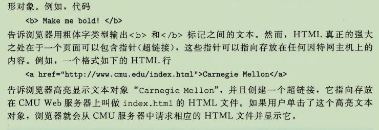

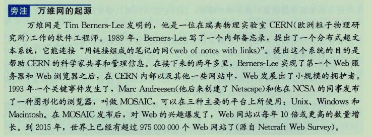


2、Web 内容 

```
对于 Web 客户端和服务器而言，内容是与一个 MIME(Multipurpose Internet Mail Extensions, 多用途的网际邮件扩充协议)类型相关的字节序列。
图 11-23 展示了一些常用的 MIME 类型。
```

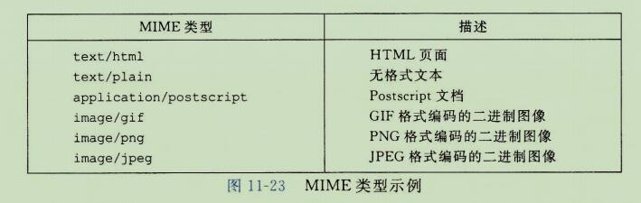

```
Web 服务器以两种不同的方式向客户端提供内容：
取一个磁盘文件，并将它的内容返回给客户端。
磁盘文件称为静态内容(static content)，而返回文件给客户端的过程称为 服务静态内容(serving static content)。

运行一个可执行文件，并将它的输出返回给客户端。
运行时可执行文件产生的输出称为 动态内容(dynamic content),而运行程序并返回它的输出到客户端的过程称为 服务动态内容(serving dynamic content)。
```


```
每条由 Web 服务器返回的内容都是和它管理的某个文件相关联的。
这些文件中的每一个都有一个唯一的名字，叫做 URL(Universal Resource Locator, 通用资源定位符)。
```

```
例如，URL  http://www.google.com:80/index.html

表示因特网主机 www.google.com 上一个称为 /index.html 的HTML 文件，它是由一个监听端口 80 的 Web 服务器管理的。
端口是可选的，默认为知名的 HTTP 端口 80。
可执行文件的 URL 可以在文件名后包括程序参数。
"?" 字符分隔文件名和参数，而且每个参数都用 "&" 字符分隔开。
例如，URL 

http://www.baidu.com:8000/index/addr?1&2

标识了一个叫做 /index/addr 的可执行文件，会带两个参数字符串 1和2 来调用它。


在事务过程中，客户端和服务器使用的是 URL 的不同部分。
例如，客户端使用前缀 http://www.google.com:80
来决定与哪类服务器联系，服务器在哪里，以及它监听的端口号是多少。
服务器使用后缀 /index.html
来发现它文件系统中的文件，并确定请求的是静态内容还是动态内容。
```

```
关于服务器如果解释一个URL的后缀，有几点需要理解：

1、确定一个 URL 指向的是静态内容还是动态内容没有标准的规则。
每个服务器对它所管理的文件都有自己的规则。
一种经典的(老式的)方法是，确定一组目录，例如 cgi-bin，所有的可执行文件都必须存放在这些目录中。

2、后缀中的最开始的那个 "/" 不表示 Linux 的根目录。
相反，它表示的是被请求内容类型的主目录。

3、最小的URL的后缀是"/"字符，所有服务器将其扩展为某个默认的主页，例如 /index.html。
这解释了为什么简单的在浏览器中键入一个域名就可以取出一个网站的主页。
浏览器在URL后添加缺失的 "/", 并将之传递给服务器，服务器又把 "/" 扩展到某个默认的文件名。
划重点：最小的URL的后缀是"/"字符
意思是：如果一个网址没有 URI，那么默认就为 "/" 这就是最小URI；
```


### 3、HTTP 事务

```
因为 HTTP 是基于在因特网连接上传送的文本行的，我们可以使用 Linux 的TELNET 程序来和因特网的任何Web服务器执行事务。
```

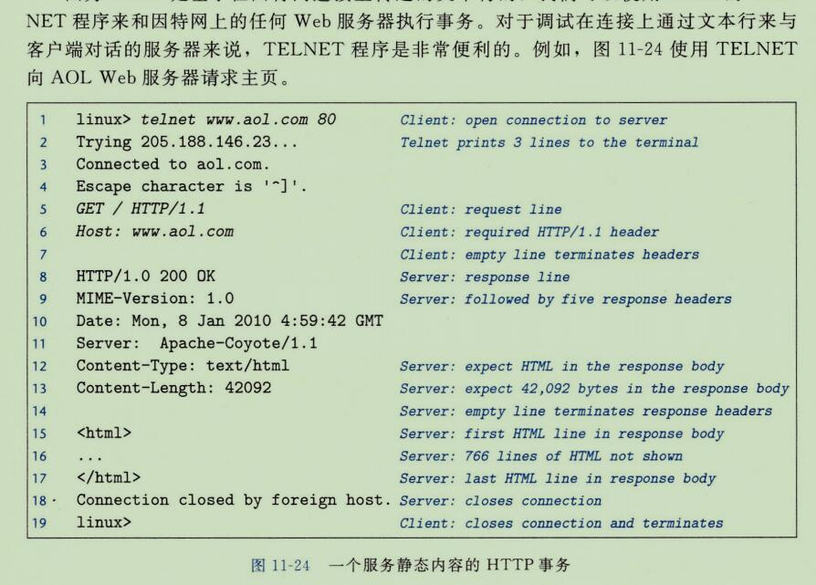


```
在第 1 行，我们从 Linux shell 运行 TELNET, 要求它打开一个到 AOL Web 服务器的连接。
TELNET 向终端打印三行输出，打开连接，然后等待我们输入文本(第 5 行)。
Escape character is '^]'; ^]是指 ctrl+]; 
在 cmd 里面按 ctrl+] 就会出现 ^]。
意思是按Ctrl+]会呼出telnet的命令行!

每次输入一个文本行，并键入回车键，TELNET 会读取该行，在后面加上回车和换行符号(在 C 的表示中 "\r\n")，并且将这一行发送到服务器。这是和 HTTP 标准相符的，HTTP 标准要求每个文本行都由一对回车和换行符来结束。
为了发起事务，我们输入一个 HTTP 请求(第5~7行)。
服务器返回 HTTP 响应(第8~17行)，然后关闭连接(第18行)。
```

#### 1、HTTP 请求

```
一个 HTTP 请求的组成是这样的：一个请求行(request line)(第5行)，后面跟随零个或更多个请求报头(request header)(第6行)，在跟随一个空的文本行来终止报头列表(第 7 行)。一个请求行的形式是 
method URI version
```

```
GET 方法指导服务器生成和返回 URI(Uniform Resource Identifier, 统一资源标识符)标识的内容。
URI 是相应的 URL 的后缀，包括文件名和可选的参数。
```

```
请求行中的 version 字段表明了该请求遵循的 HTTP 的版本。
最新的 HTTP 版本是 HTTP/1.1。
HTTP/1.0 是从 1996 年沿用至今的老版本。
HTTP/1.1 定义了一些附加的报头，为诸如缓冲和安全等高级特性提供支持，它还支持一种机制，允许客户端和服务器在同一条持久连接(persistent connection)上执行多个事务。
在实际中，两个版本是互相兼容的，因为 HTTP/1.0 的客户端和服务器会简单地忽略 HTTP/1.1 的报头。
```

```
总的来说，第5行的请求行要求服务器取出并返回 HTML 文件 /index.html。
它也告知服务器请求剩下的部分是 HTTP/1.1 格式的。
```

```
请求报头为服务器提供了格外的信息，例如浏览器的商标名，或者浏览器理解的 MIME 类型。请求报头的格式为
header-name:header-data
```

```
针对 我们的目的，唯一需要关注的报头是 Host 报头(第6行)，这个报头在 HTTP/1.1 请求中是被需要的，而在 HTTP/1.0 请求中是不需要的。

代理缓存(proxy cache)会使用 Host 报头，这个代理缓存有时作为浏览器和管理被请求文件的原始服务器(origin server)的中介。
客户端和原始服务器之间，可以有多个代理,即所谓的代理链(proxy chain)。
Host 报头中的数据指示了原始服务器的域名，使得代理链中的代理能够判断它是否可以在本地缓存中拥有一个被请求内容的副本。

就是 HOST  报头是被 代理缓存使用的。
```

```
继续图 11-24 中的示例，第 7 行的空文本行(通过在键盘上键入回车键生成的)终止了报头，并指示服务器发送被请求的 HTML 文件。
```


#### 2、HTTP 响应

```
HTTP 响应和 HTTP 请求是相似的。
一个HTTP响应的组成是这样的：一个响应行(response line)(第8行)，
后面跟随着零个或更多的响应报头(response header)(第9~13行)，
再跟随一个终止报头的空行(第14行)，在跟随一个响应主体(response body)(第15~17行)。
一个响应行的格式是
version status-code status-message
```

```
version 字段描述的是响应遵循的 HTTP 版本。
状态码(status-code)是一个3位的正整数，指明对请求的处理。
状态消息(status message)给出与错误代码等价的英文描述。
图11-25列出了一些常见的状态码，以及它们相应的消息。
```

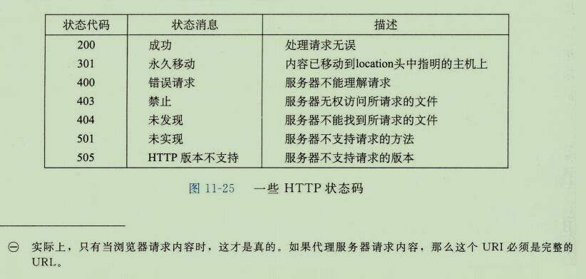

```
第9~13行的响应报头提供了关于响应的附加信息。
针对我们的目的，两个最重要的报头是 Content-Type(第12行)，它告诉客户端响应主体中内容的 MIME 类型; 以及Content-Length(第13行)，用来指示响应主体的字节大小。

第14行的终止响应报头的空文本行，其后跟随着响应主体，响应主体包含着被请求的内容。
```


#### 4、服务动态内容


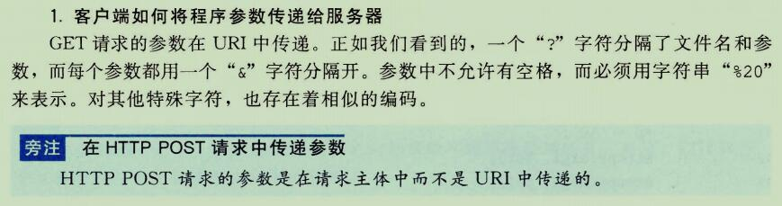

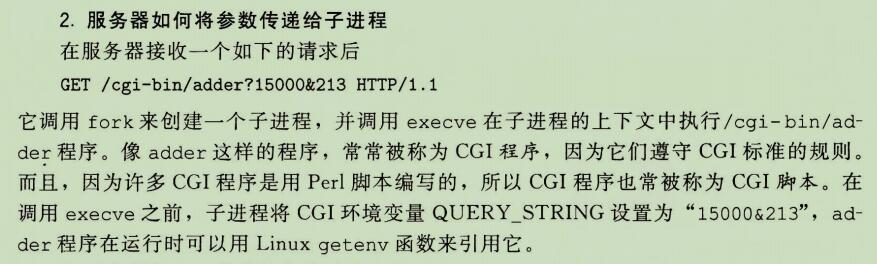

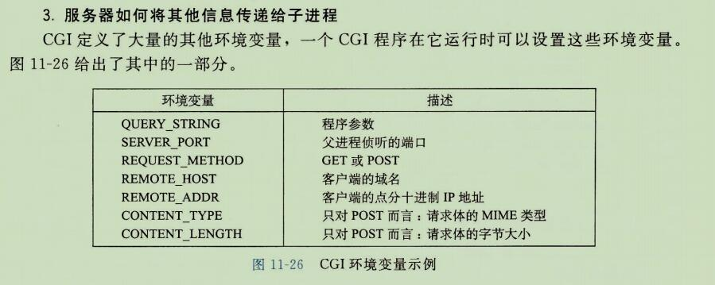

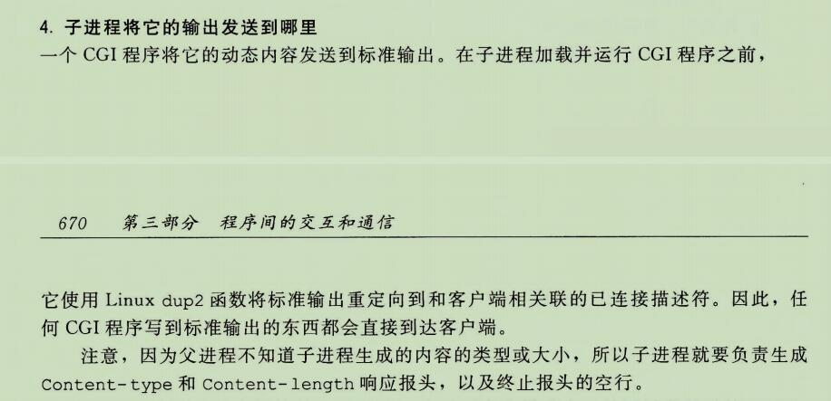

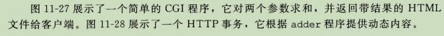

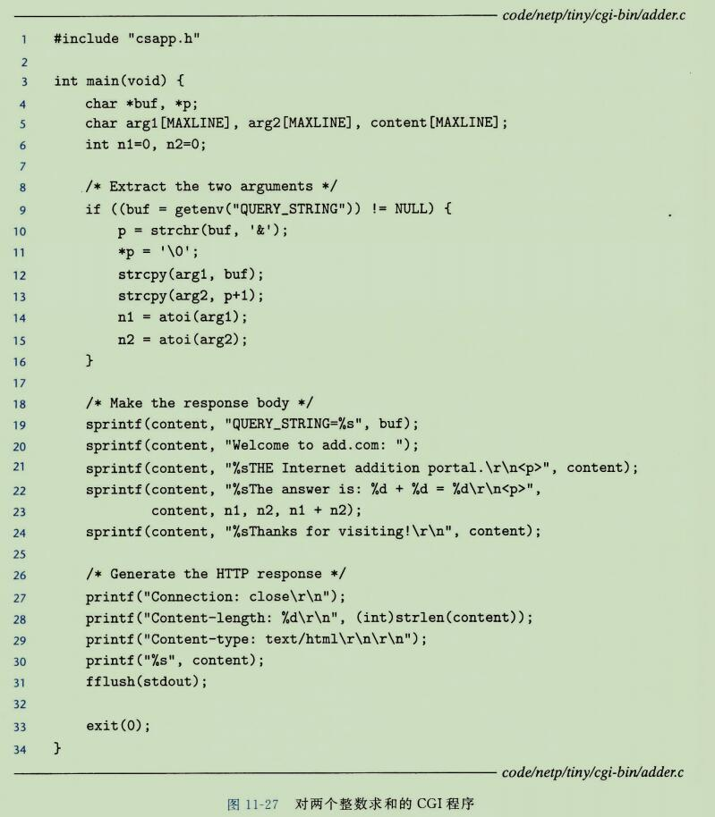

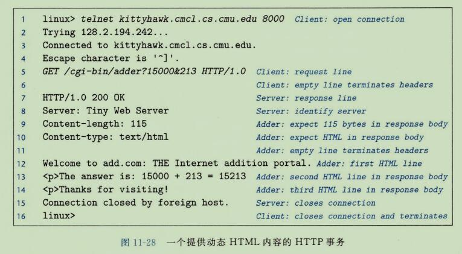


