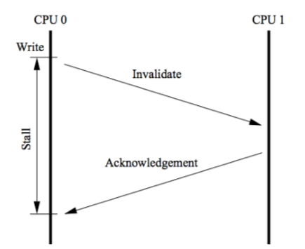
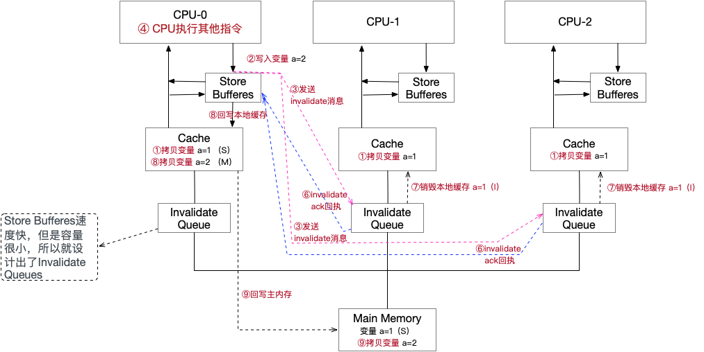

## 1、Linux Futex的设计和实现

### 引子

```
在编译2.6内核的时候，你会在编译选项中看到[*] Enable futex support这一项，上网查，有的资料会告诉你"不选这个内核不一定能正确的运行使用glibc的程序"，那futex是什么？和glibc又有什么关系呢？
```

### 1、什么是 Futex

```
Futex 是 Fast Userspace muTexes 的缩写，，由Hubertus Franke, Matthew Kirkwood, Ingo Molnar and Rusty Russell共同设计完成。几位都是linux领域的专家，其中可能Ingo Molnar大家更熟悉一些，毕竟是O(1)调度器和CFS的实现者。
```

```
Futex 英文翻译过来就是快速用户空间互斥体。
其设计思想其实不难理解，在传统的Unix系统中，System V IPC(inter process communication)，如 semaphores, msgqueues, sockets还有文件锁机制(flock())等进程间同步机制都是对一个内核对象操作来完成的，这个内核对象对要同步的进程都是可见的，其提供了共享 的状态信息和原子操作。
当进程间要同步的时候必须要通过系统调用(如 semop())在内核中完成。
可是经过研究发现，很多同步是无竞争的，即某个进程进入互斥区，到再从某个互斥区出来这段时间，常常是没有进程也要进这个互斥区或者请求同意同步变量的。
但是在这种情况下，这个进程也要陷入内核区看看有没有人和它竞争，退出的时候还要陷入内核区看看有没有进程等待在同一同步变量上。
这些不必要的系统调用(或者说内核陷入)造成了大量的性能开销。
为了解决这个问题，Futex就应运而生，Futex 是一种用户态和内核态混合的同步机制。
首先，同步的进程间通过 mmap 共享一段内存，futex变量就位于这段共享的内存中且操作是原子的，当进程尝试进入互斥区或者退出互斥区的时候，先去查看共享内存中的 futex 变量，如果没有竞争发生，则只修改 futex，而不用再执行系统调用了。

当通过访问 futex 变量告诉进程有竞争发生，则还是得执行系统调用去完成相应的处理(wait 或者 wake up)。
简单的说，futex 就是通过在用户态的检查，(motivation)如果了解到没有竞争就不用陷入内核了，大大提高了 low-contention 时候的效率。
Linux 从2.5.7 开始支持 Futex。
```

### 2、Futex 系统调用

```
Futex 是一种用户态和内核态混合机制，所以需要两个部分合作完成，linux 上提供了 sys_futex 系统调用，对进程竞争情况下的同步处理提供支持。
```

```
其原型和系统调用号为
    #include <linux/futex.h>
    #include <sys/time.h>
    int futex (int *uaddr, int op, int val, const struct timespec *timeout,int *uaddr2, int val3);
    #define __NR_futex              
    

虽然参数有点长，其实常用的就是前面三个，后面 timeout 大家都能理解，其他的也常被 ignore。

uaddr就是用户态下共享内存的地址，里面存放的是一个对齐的整型计数器。
    op存放着操作类型。定义的有5中，这里我简单的介绍一下两种，剩下的感兴趣的自己去man futex
    FUTEX_WAIT: 原子性的检查uaddr中计数器的值是否为val,如果是则让进程休眠，直到FUTEX_WAKE或者超时(time-out)。也就是把进程挂到uaddr相对应的等待队列上去。
    FUTEX_WAKE: 最多唤醒val个等待在uaddr上进程。
    
    
可见FUTEX_WAIT和FUTEX_WAKE只是用来挂起或者唤醒进程，当然这部分工作也只能在内核态下完成。有些人尝试着直接使用futex系统调 用来实现进程同步，并寄希望获得futex的性能优势，这是有问题的。应该区分futex同步机制和futex系统调用。futex同步机制还包括用户态 下的操作，我们将在下节提到。
```


### 3、Futex 同步机制

```
所有 Futex 同步操作都应该从用户空间开始，首先创建一个 futex 同步变量，也就是位于共享内存的一个整型计数器。
当进程尝试持有锁或者要进入互斥区的时候，对 futex 执行 "down" 操作，即原子性的给 futex 同步变量减 1。
如果同步变量变为 0，则没有竞争发生，进程照常执行。
如果同步变量是个负数，则意味着有竞争发生，需要调用 futex 系统调用的 futex_wake 操作唤醒一个或者多个等待进程。

这里的原子性加减通常是用 CAS(compare and swap) 完成的，与平台相关。
CAS 的基本形式是：CAS(addr, old, new), 当addr 中存放的值等于 old 时，用 new 对其替换。
在x86 平台上有专门的一条指令来完成它：cmpchg
```

```
可见：futex 是从用户态开始，由用户态和核心态协调完成的。
```


### 4、进/线程利用 futex同步

```
进程或者线程都可以利用 futex 来进行同步。
对于线程，情况比较简单，因为线程共享虚拟内存空间，虚拟地址就可以唯一的表示出 futex 变量，即线程用同样的虚拟地址来访问futex变量。

对于进程，情况相对复杂，因为进程有独立的虚拟内存空间，只有用过 mmap()让它们共享一段地址空间来使用 futex 变量。
每个进程用来访问 futex 的虚拟地址可以是不一样的，只要系统知道所有的这些虚拟地址都映射到同一物理内存地址，并用物理内存地址来唯一标识 futex 变量。
```

### 小结

```
1、futex 变量的特征：
	1、位于共享的用户空间中。
	2、是一个32位的整型。
	3、对它的操作时原子的。
	
2、Futex 在程序 low-contention 的时候能获得比传统同步机制更好的性能。

3、不要直接使用 Futex 系统调用

4、Futex 同步机制可以用于进程间同步，也可以用于线程间同步。
```


## 2、Linux 中的线程同步机制（二）-in Glibc

```
在linux 中进行多线程开发，同步是不可回避的一个问题。
在 POSIX 标准中定义了三种线程同步机制：Mutexes(互斥量)，
Condition variables(条件变量) 和 POSIX Semaphores(信号量)。

NPTL 基本上实现了 POSIX,而glibc 又使用 NPTL 作为自己的线程库。
因此 glibc 中包含了这三种同步机制的实现(当然还包括其他的同步机制，如APUE里提到的读写锁)。
```

```
Glibc 中常用的线程同步方式举例：
Semaphore
变量定义：    sem_t sem;
初始化：      sem_init(&sem,0,1);
进入加锁:     sem_wait(&sem);
退出解锁:     sem_post(&sem);

Mutex
变量定义：    pthread_mutex_t mut;
初始化：      pthread_mutex_init(&mut,NULL);
进入加锁:     pthread_mutex_lock(&mut);
退出解锁:     pthread_mutex_unlock(&mut);
```

```
这些用于同步的函数和 futex 有什么关系？下面让我们来看一看

线程互斥锁pthread_mutex_t的实现原理：

pthread_mutex_lock:
atomic_dec(pthread_mutex_t.value);
if(pthread_mutex_t.value!=0)
futex(WAIT)
else
success

pthread_mutex_unlock:
atomic_inc(pthread_mutex_t.value);
if(pthread_mutex_t.value!=1)
futex(WAKEUP)
else
success
```

```
Semaphores

进入互斥区的时候，会执行sem_wait(sem_t *sem)，sem_wait的实现如下：
int sem_wait (sem_t *sem)
{
int *futex = (int *) sem;
if (atomic_decrement_if_positive (futex) > 0)
    return 0;
int   err = lll_futex_wait (futex, 0);
    return -1;
}


int sem_post (sem_t *sem)
{
int *futex = (int *) sem;
int nr = atomic_increment_val (futex);
int err = lll_futex_wake (futex, nr);
return 0;
}
```


```
atomic_decrement_if_postive()的语义就是如果传入参数是正数就将其原子性的减一并立即返回。
如果信号量为正，在 semaphores 的语义中意味着没有竞争发生，如果没有竞争，就给信号量减一后直接返回了。

如果传入参数不是正数，即意味着有竞争，调用lll_futex_wait(futex,0),lll_futex_wait是个宏，展开后为：
#define lll_futex_wait(futex, val) \
({                                          \
    ...
    __asm __volatile (LLL_EBX_LOAD                          \
              LLL_ENTER_KERNEL                          \
              LLL_EBX_LOAD                          \
              : "=a" (__status)                          \
              : "0" (SYS_futex), LLL_EBX_REG (futex), "S" (0),          \
            "c" (FUTEX_WAIT), "d" (_val),                  \
            "i" (offsetof (tcbhead_t, sysinfo))              \
              : "memory");                          \
    ...                                      \
})

可以看到当发生竞争的时候，sem_wait 会调用SYS_futex 系统调用，并在 val=0 的时候执行 FUTEX_WAIT, 让当前线程休眠。
```

```
从这例子我们可以看出，在 Semaphores 的实现过程中使用了 futex, 不仅仅是说其使用了 futex 系统调用(再重申一遍只使用 futex 系统调用是不够的)，而是整个建立在 futex 机制上，包括用户态下的操作和核心态下的操作。
其实对于其他 glibc 的同步机制来说也是一样，都采纳了 futex 作为其基础。

所以才会在futex的manual中说：对于大多数程序员不需要直接使用futexes，取而代之的是依靠建立在futex之上 的系统库，如NPTL线程库(most programmers will in fact not be using futexes directly but instead rely on system libraries built on them, such as the NPTL pthreads implementation)。所以才会有如果在编译内核的时候不 Enable futex support，就"不一定能正确的运行使用Glibc的程序"。
```


小结

```
1、Glibc 中的所提供的线程同步方式，如大家所熟知的 Mutex Semaphore 等，大多都构造于 futex 之上了，除了特殊情况，大家没必要再去实现自己的 futex 同步原语。
```


## 3、Linux中的线程同步机制(三)--Practice

```
上回说到 Glibc 中(NPTL)的线程同步方式如 Mutex，semaphore 等都使用了 futex 作为其基础。
那么实际使用是什么样子，又会碰到什么问题呢？
```

```
先来看一个使用semaphore同步的例子。

sem_t sem_a;
void *task1();

int main(void){
int ret=0;
pthread_t thrd1;
sem_init(&sem_a,0,1);
ret=pthread_create(&thrd1,NULL,task1,NULL); //创建子线程
pthread_join(thrd1,NULL); //等待子线程结束
}

void *task1()
{
int sval = 0;
sem_wait(&sem_a); //持有信号量
sleep(5); //do_nothing
sem_getvalue(&sem_a,&sval);
printf("sem value = %d\n",sval);
sem_post(&sem_a); //释放信号量
}

```

```
程序很简单，我们在主线程(执行main的线程)中创建了一个线程，并用 join 等待其结束。
在子线程中，先持有信号量，然后休息一会儿，再释放信号量，结束。

因为这段代码中只有一个线程使用信号量，也就是没有线程间竞争发生，按照futex的理论，因为没有竞争，所以说有的锁操作都将在用户态完成，而不会执行系统调用而陷入内核。

我们用 strace来跟踪一下这段程序的执行过程中所发生的系统调用:
...
20533 futex(0xb7db1be8, FUTEX_WAIT, 20534, NULL <unfinished ...>
20534 futex(0x8049870, FUTEX_WAKE, 1)   = 0
20533 <... futex resumed> )             = 0

20533是main线程的id,20534是其子线程的id。出乎我们意料之外的是这段程序还是发生了两次futex系统调用，我们来分析一下这分别是什么原因造成的。
```

```
1、出人意料的 "sem_post()"
20534 futex(0x8049870, FUTEX_WAKE, 1) = 0
子线程还是执行了 FUTEX_WAKE 的系统调用，就是在 sem_post(&sem_a) 的时候，请求内核唤醒一个等待在  sem_a 上的线程，其返回值是 0，表示现在并没有线程等待在 sem_a (这是当然的，因为就这么一个线程在使用 sem_a)，这次futex系统调用白做了。

这似乎和 Futex 的理论有些出入，我们再来看一下 sem_post 的实现。
int sem_post (sem_t *sem)
{
int *futex = (int *) sem;
int nr = atomic_increment_val (futex);
int err = lll_futex_wake (futex, nr);
return 0;
}

我们看到,Glibc 在实现 sem_post 的时候给 futex 原子性的加上1后，不管futex的值是什么，都执行了 lll_futex_wake(),即futex(FUTEX_WAKE)系统调用。

在第二部分中，我们分析了 sem_wait的实现，当没有竞争的时候是不会有 futex 调用的，现在看来真的是这样，但是在 sem_post 的时候，无论有无竞争，都会调用sys_futex(),为什么会这样呢？
我觉得应该结合 semaphore 的语义来理解。

在 semaphore 的语义中，sem_wait()的意思是:"挂起当前进程，直到 semaphore 的值为非 0，它会原子性的减少 semaphore 计数值"

我们可以看到 semaphore 中是通过0或者非0来判断阻塞或者非阻塞线程。
即无论有多少线程在竞争这把锁，只要使用了 semaphore， semaphore 的值都会是 0 。
这样，当线程退出互斥区，执行sem_post(),释放 semaphore 的时候，将其值由 0 改为 1，并不知道是否有线程阻塞在这个 semaphore 上，所以只好不管怎么样都执行 futex(uaddr, FUTEX_WATE,1)尝试着唤醒一个进程。

而相反的，当sem_wait()，如果semaphore由1变0，则意味着没有竞争发生，所以不必去执行futex系统调 用。

我们假设一下，如果抛开这个语义，如果允许semaphore值为负，则也可以在sem_post()的时候，实现futex机制。
```

```
2、半路杀出的"pthread_join()"
在Glibc中，pthread_join也是用futex系统调用实现的。程序中的pthread_join(thrd1,NULL); 就对应着 
20533 futex(0xb7db1be8, FUTEX_WAIT, 20534, NULL <unfinished ...>
很 好解释，主线程要等待子线程(id号20534上)结束的时候，调用futex(FUTEX_WAIT)，并把var参数设置为要等待的子线程号 (20534)，然后等待在一个地址为0xb7db1be8的futex变量上。当子线程结束后，系统会负责把主线程唤醒。于是主线程就
20533 <... futex resumed> )             = 0
恢复运行了。
要注意的是，如果在执行pthread_join()的时候，要join的线程已经结束了，就不会再调用futex()阻塞当前进程了。

```

**小结**

```
1. 虽然semaphore，mutex等同步方式构建在futex同步机制之上。然而受其语义等的限制，并没有完全按futex最初的设计实现。
2. pthread_join()等函数也是调用futex来实现的。
3. 不同的同步方式都有其不同的语义，不同的性能特征，适合于不同的场景。我们在使用过程中要知道他们的共性，也得了解它们之间的差异。这样才能更好的理解多线程场景，写出更高质量的多线程程序。
```


## 4、原子操作实现原理

```
关于 x86 原子操作指令的说明：
cmpxchg 比较交换指令，其语义为：

int CompareAndExchange(int *ptr, int old, int new)
{
int actual = *ptr;
if (actual == old)
*ptr = new;
return actual;
}
```

```
关于 smp 下的原子操作的一些说明：
原子操作时不可分割的，在执行完毕不会被人会其他任务或事件中断。
在单处理器系统(UniProcessor)中，能够在单条指令中完成的操作都可以认为是"原子操作"，因为中断只能发生于指令之间。
这也是某些 CPU 指令系统引入了 test_and_set、test_and_clear等指令用于临界资源互斥的原因。
在对称多处理器(Symmetric Multi-Processor)结构中就不同了，由于系统中有多个处理器在独立的运行，即使能在单条指令中完成的操作也有可能受到干扰。
```

```
在x86 平台上，CPU提供了在指令执行期间对总线加锁的手段。
CPU芯片上有一条引线 #HLOCK pin， 如果汇编语言的程序中在一条指令前面加上前缀"LOCK",经过汇编以后的机器代码就使CPU在执行这条指令的时候吧 #HLOCK pin 的电位拉低，持续到这条指令结束时放开，从而把总线锁住，这样同一总线上别的 CPU 就暂时不能通过总线访问了，保证了这条指令在多处理环境中的原子性。

然而，并不是所有的指令前面都可以加lock前缀的，只有ADD, ADC, AND, BTC, BTR, BTS, CMPXCHG,DEC, INC, NEG, NOT, OR, SBB, SUB, XOR, XADD, 和 XCHG指令前面可以加lock指令，实现原子操作。
```

**32位IA-32处理器使用基于对缓存加锁或总线加锁的方式来实现多处理器之间的原子操作。处理器如何实现原子操作**

**处理器自动保证基本内存操作的原子性**

```
首先处理器会自动保证基本的内存操作的原子性。
处理器保证从系统内存当中读取或者写入一个字节是原子的，意思是当一个处理器读取一个字节时，其他处理器不能访问这个字节的内存地址。
奔腾6和最新的处理器能自动保证单处理器对同一个缓存行里进行16/32/64位的操作是原子的，但是复杂的内存操作处理器不能自动保证其原子性，比如跨总线宽度，跨多个缓存行，跨页表的访问。

但是处理器提供总线锁定和缓存锁定两个机制来保证复杂内存操作的原子性。
```

### 使用总线锁保证原子性

```
第一个机制是通过总线锁保证原子性。
如果多个处理器同时对共享变量进行读改写(i++就是经典的读改写操作)，那么共享变量就会被多个处理器同时进行操作，这样读改写操作就不是原子的，操作完之后共享变量的值会和期望的不一致，
举个例子：如果i=1,我们进行两次i++操作，我们期望的结果是3，但是有可能结果是2。

原因是有可能多个处理器同时从各自的缓存中读取变量i, 分别进行加一操作，然后分别写入系统内存当中。
那么想要保证读改写共享变量的操作是原子的，就必须保证CPU1读改写共享变量的时候，CPU2不能操作缓存了该共享变量内存地址的缓存。

处理器使用总线锁就是来解决这个问题的。
所谓总线锁就是使用处理器提供的一个 LOCK# 信号，当一个处理器在总线上输出此信号时，其他处理器的请求将被阻塞住，那么该处理器就可以独占使用共享内存。
```

## 使用缓存锁保证原子性

```
第二个机制是通过缓存锁定保证原子性。
在同一时刻我们只需要保证对某个地址的操作时原子性即可，但总线锁定把CPU和内存之间通信锁住了，
这使得锁定期间，其他处理器不能操作其他内存地址的数据，所以总线锁定的开销比较大，最近的处理器在某些场合下使用缓存锁定代替总线锁定来进行优化。
```

```
频繁使用的内存会缓存在处理器L1,L2,L3高速缓存里，那么原子操作就可以直接在处理器内部缓存中进行，并不需要声明总线锁，在奔腾6和最近的处理器中可以使用"缓存锁定"的方式来实现复杂的原子性。
所谓"缓存锁定"就是如果缓存在处理器缓存行中 内存区域在LOCK操作期间被锁定，当它执行锁操作会写内存时，处理器不在总线上声明LOCK#信号，而是修改内存的内存地址，并允许它的缓存一致性机制来保证操作的原子性，因为缓存一致性机制会阻止同时修改被两个以上处理器缓存的内存区域数据，当其他处理器回写已被锁定的缓存行的数据时会起缓存行无效，
```

```
但是有两种情况下处理器不会使用缓存锁定。第一种情况是：当操作的数据不能被缓存在处理器内部，或操作的数据跨多个缓存行（cache line），则处理器会调用总线锁定。第二种情况是：有些处理器不支持缓存锁定。对于Inter486和奔腾处理器,就算锁定的内存区域在处理器的缓存行中也会调用总线锁定。
```

## MESI

```
MESI大致的意思是：若干个CPU核心通过ringbus连到一起。每个核心都维护自己的Cache的状态。如果对于同一份内存数据在多个核里都有cache，则状态都为S（shared）。一旦有一核心改了这个数据（状态变成了M），其他核心就能瞬间通过ringbus感知到这个修改，从而把自己的cache状态变成I（Invalid），并且从标记为M的cache中读过来。同时，这个数据会被原子的写回到主存。最终，cache的状态又会变为S。这相当于给cache本身单独做了一套总线（要不怎么叫ring bus），避免了真的锁总线。

作者：大宽宽
链接：https://www.zhihu.com/question/65372648/answer/415311977
来源：知乎
著作权归作者所有。商业转载请联系作者获得授权，非商业转载请注明出处。
```

```
缓存锁(使用 MESI 实现)，应该是默认就存在的。不然多核cpu根本没法运行。
```

### **MESI 优化和他们引入的问题**

```
缓存的一致性消息传递是要时间的，这就使其切换时会产生延迟。
当一个缓存被切换状态时，其他缓存收到消息完成各自的切换并且发出回应消息这么一长串的时间中 CPU 都会等待所有缓存响应完成。
可能出现的阻塞都会导致各种各样的性能问题和稳定性问题。
```

```
比如你需要修改本地缓存中的一条信息，那么你必须将 I(无效)状态通知到其他拥有该缓存数据的 CPU 缓存中，并且等待确认。
等待确认的过程中会阻塞处理器，这会降低 处理器的性能。
因为这个等待远远比一个指令的执行时间长的多。
```

### 缓存一致性

```
为了达到数据访问的一致，需要各个处理器在访问缓存时遵循一些协议，在读写时根据协议来操作，常见的协议有 MSI、MESI、MOSI 等。
最常见的就是 MESI 协议：

MESI 表示缓存行的四种状态，分别是：
1、M(modify) 表示共享数据只缓存在当前 CPU 缓存中，并且是被修改状态，也就是缓存的数据和主内存中的数据不一致。

2、E(Exclusive) 表示缓存的独占状态，数据只缓存在当前 CPU 缓存中，并且没有被修改。

3、S(Shared) 表示数据可能被多个 CPU 缓存，并且各个缓存中的数据和主内存数据一致。

4、I(Invalid) 表示缓存已经失效。

在 MESI 协议中，每个缓存的缓存控制器不仅知道自己的 读写操作，而且也监听(snoop)其它 Cache 的读写操作。
```

```
对于 MESI 协议，从 CPU 读写角度来说会遵循以下原则:

CPU 读请求:缓存处于 M、E、S 状态都可以被读取，I 状 态 CPU 只能从主存中读取数据。

CPU 写请求:缓存处于 M、E 状态才可以被写。对于 S 状 态的写，需要将其他 CPU 中缓存行置为无效才可写 
```

### MESI 优化带来的可见性问题

```
CPU 缓存行的状态是通过消息传递来进行的。
如果 CPU0 要对一个在缓存中共享的变量进行写入，首先发送一个失效的消息给到其他缓存了该数据的 CPU。
并且要等到他们的确认回执。
CPU0 在这段时间内都会处于阻塞状态。


```



```
为了避免阻塞带来的资源浪费。在 cpu 中引入 了 Store Bufferes（存储缓存） 和 Invalidate Queue（无效队列）。

CPU0 写入共享数据时，直接把数据写入到 store bufferes 中，同时发送 invalidate 消息，然后继续去处理其他指令。

当收到其他所有 CPU 发送了 invalidate ACK消息时，再将 store bufferes 中的数据数据存储至 cache 中。最后再从本地Cache同步到主内存。
```



```
但是 cpu 中引入 Store Bufferes 优化存在两个问题：

1、第⑥、⑦步骤中，由于Invalidate消息进入队列后就给CPU-0返回了响应，不能保证第⑦步骤一定完成。

2、引入了 Store Bufferes 后，处理器会先尝试从 Store Bufferes 中读取值，如果 Store Bufferes 中有数据，则直接从Store Bufferes 中读取，否则就再从本地Cache中读取，从Store Bufferes读取数据存在脏读。

3、处理器不会发送任何消息给所处理的缓存条目，直到它处理Invalidate。
```

### CPU 层面的内存屏障

```
内存屏障就是将 Store Bufferes 中的指令写入到内存，从而使得其他访问同一共享内存的线程的可见性。

Store Memory Barrier(a.k.a. ST, SMB, smp_wmb)是一条告诉处理器在执行这之后的指令之前，应用所有已经在存储缓存（store buffer）中的保存的指令。

Load Memory Barrier (a.k.a. LD, RMB, smp_rmb)是一条告诉处理器在执行任何的加载前，先应用所有已经在失效队列中的失效操作的指令。
```


