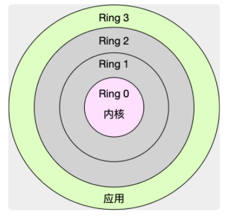
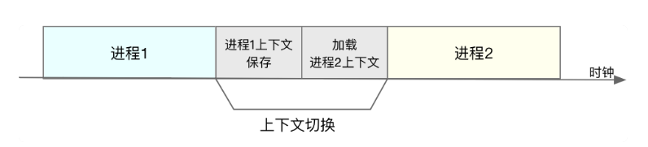

# 1、上下文切换(第一种理解)

```
上下文切换有：
进程上下文切换，中断上下文切换，线程上下文切换
```

## 1、进程上下文切换

```
进程运行态为内核运行态和进程运行态。
内核空间态资源包括内核的堆栈、寄存器等；
用户空间态资源包括虚拟内存、栈、变量、正文、数据等
```



```
系统调用(软中断)在内核态完成的，需要进行2次CPU上下文切换(用户空间->内核空间->用户空间)，不涉及用户资源，也不会切换进程
```



```
进程是由内核来管理和调度的，进程的切换只能发生在内核态。
所以进程的上下文不仅包括了用户空间的资源，也包括内核空间的资源。
```

```
进程上下文切换过程：
	1、接收切换信号，挂起进程，记录当前进程的虚拟内存，栈等资源存储;
	2、将这个进程在CPU中的上下文状态存储起来
	3、然后在内存中检索下一个进程的上下文
	4、并将其加载到CPU的寄存器中恢复
	5、还需要刷新进程的虚拟内存和用户栈
	6、最后跳转程序计数器所指向的位置(即跳转到进程被中断时的代码行)，以恢复该进程。
```

```
下列将会触发进程上下文切换的场景：

(a)、根据调度策略，将CPU时间划片为对应的时间片，当时间片耗尽，当前进程必须挂起。
(b)、资源不足的，在获取到足够资源之前进程挂起。
(c)、进程sleep挂起进程。
(d)、高优先级进程导致当前进度挂起
(e)、硬件中断，导致当前进程挂起
```

## 2、线程上下文切换的 过程

(1)、不同进程之间的线程上下文切换，其过程和进程上下文切换大致相同。
(2)、线程内部的线程进上下文切换。不需要切换进程的用户资源，只需要切换线程私有的数据和寄存器等。
这会比进程上下文进程切换消耗的资源少，所以多线程相比多进程的优势。


## 3、 中断上下文切换，如何理解？

为了快速响应硬件的事件(如USB接入)，中断处理会打断进程的正常调度和执行，转而调用中断处理程序，

响应设备事件。而打断其它进程执行时，需要进行上下文切换。中断事件过多，会无谓的消耗CPU资源，导致进程处理时间延长。

**对于一个CPU来说，中断处理比进程拥有更高的优先级**


# 2、上下文切换(另外一个博客)

[经常说的CPU上下文切换是什么意思？（上）](https://www.jianshu.com/p/4393a4537eca)


```
时候看系统的资源利用率，我们会发现，cpu的use值不搞但sys值特别高，同时负载也会比较高，这时我们就会比较疑惑，我程序明明用的cpu很少啊，为什么负载特别高？嗯 原因就是上下文切换了。
```

```
我们都知道，Linux是一个多任务的操作系统，它支持远大于CPU数量的任务同时运行，当然，这些任务实际上并不是真正的在同时运行，而是因为系统在很短的时间内，将CPU轮流分配给他们，造成很多任务同时运行的错觉。
```

```
在每个任务运行前，CPU都需要知道任务从哪里加载，又是从哪里开始运行，也就是说，需要系统事先帮他设置好 cpu寄存器和程序计数器(program counter)。
```

```
CPU上下文
CPU寄存器，是 CPU内置的容量小、但速度极快的内存。
程序计数器，则是用来存储CPU正在执行的指令的位置，或者即将执行的下一条指令的位置。
他们都是CPU在运行任何任务前，必须依赖的环境，因此也被叫做CPU上下文。
```

```
cpu上下文切换
CPU上下文切换，就是先把前一个任务的CPU上下文(也就是CPU寄存器和程序计数器)保存起来，然后加载新任务的上下文，到这些寄存器和程序计数器，最后再跳转到程序计数器所指的新位置，运行新任务。
```

```
而保存下来的上下文，会存储在系统内核中，并在任务重新调度执行的时候再加载进来。
这样就能保证任务原来的状态不受影响，让任务看起来还是连续运行。
```

```
我猜肯定会有人说，CPU上下文切换无非就是更新了CPU寄存器的值嘛，但这些寄存器，本身就是为了快速运行任务而设计的，为什么会影响系统的CPU性能呢？

在回答这个问题前，不知道你有没有想过，操作系统管理的这些"任务"到底是什么呢？

也许你会说，任务就是进程，或者说任务就是线程，是的进程和线程是最常见的任务，但是除此之外，还有没有其他任务呢？

不要忘了，硬件通过触发信号，会导致中断处理程序的调用，这也是一种常见的任务。

所以，根据任务的不同，CPU的上下文切换就可以分为几个不同的常见，也就是进程上下文切换,线程上下文切换以及中断上下文切换。

下面我们看下如何理解这几个不通的上下文切换，以及他们为什么会引发CPU性能相关的问题。

```

## 1、进程上下文切换

```
Linux 按照特权等级，把进程的运行空间分为内核空间和用户空间，分别对应着下图中。CPU特权等级的Ring0 和 Ring3。
```


```
内核空间(Ring 0)具有最高权限，可以直接访问所有资源
用户空间(Ring 3)只能访问受限资源，不能直接访问内存等硬件设备，必须通过系统调用陷入到内核中，才能访问这些特权资源。
```

```
换个角度看，也就是说，进程既可以在用户空间运行，又可以在内核空间运行。
进程在用户空间运行被称为进程的用户态，
而陷入内核空间的时候，又被称为进程的内核态。
```

```
从用户态到内核态的转变，需要通过系统调用来完成，比如当我们查看文件内容时，就需要多次系统调用来完成：首先调用open()打开文件，然后调用read()读取文件内容，并调用write()将内容写到标准输出，最后再调用close()关闭文件。
```

```
那么，系统调用的 过程有没有发生CPU上下文切换呢？答案是肯定的。
```

```
系统调用的时候 
CPU寄存器里原来用户态的指令位置，需要先保存起来。
接着，为了执行内核态代码，CPU寄存器需要更新为内核指令的新位置。
最后才是跳转到内核态运行内核任务。
```

```
而系统调用结束后，CPU寄存器需要恢复原来保存的用户态，然后再切换到用户空间，继续运行进程，所以一次系统调用的过程，其实是发生了两次CPU上下文切换。
```

```
不过，需要注意的是，系统调用过程中，并不会涉及到虚拟内存等进程用户态的资源，也不会切换进程。
这跟我们通常所说的进程上下文切换是不一样的。

进程上下文切换，是指从一个进程切换到另一个进程运行。
而系统调用过程中一直是同一个进程在运行。

所以，系统调用过程通常称为特权模式切换，而不是上下文切换。
但实际上系统调用过程中，CPU的上下文切换还是无法避免的。

因为上下文切换通常默认指的是 进程上下文切换而不是CPU上下文切换。
```


