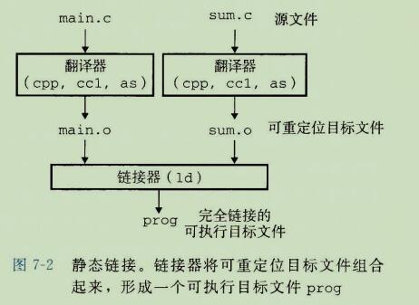

**链接**

```
链接(linking)是将各种代码和数据片段收集并组合成一个单一的文件的过程，这个文件可被加载(复制)到内存并执行。
链接可以执行于编译时(compile time),也就是在源代码被翻译成机器代码时;
也可以执行于加载时(load time),也就是在程序被加载器(loader)加载到内存并执行；
甚至可以执行于运行时(run time),也就是由应用程序来执行。

在早期的计算机系统中，链接是手动执行的。在现代系统中，链接是由叫做链接器(linker)的程序自动执行的。
```

```
链接器在软件开发中扮演一个关键的角色，因为它们使得分离编译(separate compilation) 成为可能。
我们不用将一个大型的应用程序组织为一个巨大的源文件，而是可以把它分解为更小、更好管理的模块，可以独立地修改和编译这些模块。
当我们改变这些模块中的一个时，只需简单的重新编译它，并重新链接应用，而不必重新编译其他文件。
```


## 1、编译器驱动程序




```
大多数编译系统提供编译器驱动程序(compiler driver),它代表用户在需要时调用语言与处理器、编译器、汇编器和链接器。
```

```
图7-2概括了驱动程序在将示例陈旭从ASCII码源文件翻译成可执行目标文件时的行为。(如果你想看看这些步骤， 用 - v 选项来运行GCC)。
驱动程序首先运行C 预处理器(cpp)，它将C的源程序 main.c翻译成一个ASCII码的中间文件 main.i;s
cpp [other arguments] main.c /tep/main.i
```

```
接下来，驱动程序运行C 编译器(ccl)，它将 main.i 翻译成一个 ASCII 汇编文件 main.s 

ccl /tmp/main.i -Og[other arguments] -o /tmp/main.s
```

```
然后，驱动程序运行汇编器(as),它将 main.s 翻译成一个可重定位目标文件(relocatable object file)

as[other arguments] -o /tmp/main.o /tmp/main.s
```

```
驱动程序经过相同过程生成 sum.o。 最后，它运行链接器程序 ld, 将 main.o 和 sum.o 以及一些必要的系统目标文件组合起来，创建一个可执行目标文件(executable object file)prog.

ld -o grog [system object files and args] /tmp/main.o /tmp/sum.o

要运行可执行文件 prog,我们在 linux shell 的命令行上输入它的名字：

linux> ./prog

shell 调用操作系统中一个叫做加载器(loader)的函数，它将可执行文件 prog 中的代码和数据复制到内存，然后将控制转移到这个程序的开头。
```


## 2、静态链接

```
先 linux LD 程序这样的静态链接器(static linker)以一组可重定位目标文件和命令行参数作为输入，生成一个完全链接的、可以加载和运行的可执行目标文件作为输出。

输入的可重定位目标文件由各种不同的代码和数据节(section)组成，每一节都是一个连续的字节序列。
指令在一节中，初始化了的全局变量在另一节中，而未初始化的变量又在另外一节中。
```


```
为了构造可执行文件,链接器必须完成两个主要任务：

符号解析(symbol resolution)。
	目标文件定义和引用符号，每个符号对应于一个函数、一个全局变量或一个静态变量(即C语言中任何以 static 属性声明的变量)。
	符号解析的目的是将每个符号引用正好和一个符号定义关联起来。
	

重定位(relocation)
	编译器和汇编器生成从地址0开始的代码和数据节。
	链接器通过把每个符号定义与一个内存位置关联起来，从而重定位这些节，然后修改所有对这些符号的引用，使得它们指向这个内存位置。
	链接器使用汇编器产生的重定位条目(relocation entry)的详细指令，不加甄别的执行这样的重定位。
```

```
接下来的章节将更加详细的描述这些任务。在你阅读的时候，要记住关于链接器的一个基本事实：
目标文件纯粹是字节块的集合。
这些块中，有些包含程序代码，有些包含程序数据，而其他的则包含引导链接器和加载器的数据结构。
链接器将这些块连接起来，确定被连接块的运行时位置，并且修改代码和数据块中的各种位置。链接器对目标机器了解甚少。产生目标文件的编译器和汇编器已经完成了大部分工作。
```


## 3、目标文件

```
目标文件有三种形式：
可重定位目标文件。
	包含二进制代码和数据，其形式可以在编译时与其他可重定位目标文件合并起来，创建一个可执行目标文件。	
	
可执行目标文件。
	包含二进制代码和数据，其形式可以被直接复制到内存并执行。

共享目标文件。
	一种特殊类型的可重定位目标文件，可以在加载或者运行时被动态的加载进内存并链接。
```

```
编译器和汇编器生成可重定位目标文件(包括共享目标文件)。
链接器生成可执行目标文件。
从技术上来说，一个目标模块(object module)就是一个字节序列，而一个目标文件(object file)就是一个以文件形式存放在磁盘中的目标模块。
不过我们会互换的使用这些术语。

```

```
目标文件是按照特定的目标文件格式来组织的，各个系统的目标文件格式都不相同。

从贝尔实验室诞生的第一个Unix 系统使用的是 a.out 格式(直到今天，可执行文件仍然称为 a.out 文件)。
现在 x86-64Linux 和Unix 系统使用可执行可链接格式(executable and Linkable format, ELF)。
尽管我们的讨论集中在ELF上，但是不管是哪种格式，基本的概念是相似的。
```


## 4、可重定位目标文件


```
图7-3展示了一个典型的ELF可重定位目标文件的格式。
ELF头(ELF header)以一个16字节的序列开始，这个序列描述了生成该文件的系统的字的大小和字节顺序。

ELF头剩下的部分包含帮助链接器语法分析和解析目标文件的信息。
其中包括ELF头的大小、目标文件的类型(如可重定位、可执行或共享的)、机器类型(如x86-64)、节头部表(section header table)的文件偏移，以及节头部表条目的大小和数量。

不同节的位置和大小是由节头部表描述的，其中目标文件中每个节都有一个固定大小的条目(entry)
```

```
加载ELF头和节头部表之间的都是节。
一个典型的ELF可重定位目标文件包含下面几个节：

.text: 已编译程序的机器代码

.rodata: 只读数据，比如 printf 语句中的格式串和开关语句的跳转表。

.data: 已初始化的全局和静态C变量。局部C变量在运行时被保存在栈中，既不出现在 .data节中，也不出现在 .bss 节中。

better save space
.bss: 未初始化的全局和静态C变量，以及所有被初始化为0的全局或静态变量。在目标文件中这个节不占据实际空间，它仅仅是一个占位符。目标文件格式区分已初始化和未初始化是为了空间效率：在目标文件中，未初始化变量不需要占据任何实际的磁盘空间。在运行时，在内存中分配这些变量，初始化值为0.

.symtab: 一个符号表，它存放 在程序中定义和引用的函数和全局变量的信息。.symtab 符号表不包括局部变量的条目。
每个重定位目标文件在 .symtab 中都有一张符号表。

.rel.text: 一个.text 节中位置的列表，当链接器把这个目标文件和其他文件组合时，需要修改这些位置。
一般而言，任何调用外部函数或者引用全局变量的指令都需要修改。
另一方面，调用本地函数的指令则不需要修改。
注意，可执行目标文件中并不需要重定位信息，因此通常省略，除非用户显式的指示链接器包含这些信息。

.rel.data: 被模块引用或定义的所有全局变量的重定位信息。一般而言，任何已初始化的全局变量，如果它的初始值是一个全局变量地址或者外部定义函数的地址，都需要被修改。

.debug: 一个调式符号表，其条目是程序中定义的局部变量和类型定义，程序中定义和引用的全局变量，以及原始的C源文件。只有以 -g 选项调用编译器驱动程序时，才会得到这张表。

.line: 原始C源程序中的行号和 .text 节中机器指令之间的映射。只有以-g 选项调用编译器驱动程序时，才会得到这张表。

.strtab: 一个字符表，其内容包括 .symtab 和 .debug 节中的符号表，以及节头部的节名字。
字符串表就是以 null 结尾的字符串的序列。
```

```
为什么未初始化的数据称为 .bss

用术语.bss 来表示未初始化的数据是很普遍的。它起始于 IBM 704汇编语言(大约在1957年)中"块存储开始(Block Storage Start)"指令的首字母缩写，并沿用至今。
一种记住 .data和.bss节之间区别的简单方法就是吧"bss"看成是"更好的节省空间 better save space"的缩写。
```


## 5、符号和符号表

```
每个可重定位目标模块m都有一个符号表，它包含m定义和引用的符号的信息。
在链接器上下文中，有三种不同的符号：
	
	由模块m定义并能被其他模块引用的全局符号。全局链接器符号 对应于非静态的C函数和全局变量。
	
	由其他模块定义并被模块m引用的全局符号。这些符号称为外部符号，对应于在其他模块中定义的非静态C函数和全局变量。
	
	只被模块m定义和引用的局部符号。它们对应于带 static 属性的C函数和全局变量。这些符号在模块m中任何位置可见，但是不能被其他模块引用。
	
	这里的定义为就是 例子的意思吧
	全局符号 例子：比如 非静态的C函数和全局变量。
```

```
认识到本地链接器符号和本地程序变量不同是很重要的。
.symtab 中的符号表不包含对应于本地非静态程序变量的任何符号。
这些符号在运行时在栈中被管理，链接器对此类符号不感兴趣。
```

```
C  static 的本地过程变量是不在栈中管理的。
相反，编译器在.data或.bss中为每个定义分配空间，并在符号表中 创建一个有唯一名字的本地链接器符号。
```


```
符号表是由汇编器构造的，使用编译器输出到汇编语言 .s 文件中的符号。
.symtab 节包含 ELF符号表。这张符号表包含一个条目的数组。
图7-4展示了每个条目的格式。
```


```
name 是字符串表中的字节偏移，指向符号的以 null 结尾的字符串名字。
这些表里面的str 都是存在 strtab 节中的，所以名字也是

value是符号的地址。对于可重定位的模块来说，value是距定义目标的节的起始位置的偏移。
对于可执行目标文件来说，该值是一个绝对运行时地址。
value 指的应该是比如这个符号定义在 .data, 就是 .data节的起始位置的偏移。
也就是在 .data这个偏移量那里定义了这个符号。


size： 是目标的大小(以字节为单位)。应该是符号的大小

type：通常是要么是数据，要么是函数


符号表还可以包含各个节的条目，以及对应原始源文件的路径名的条目。
所以这些目标的类型也有所不同。

binding 字段表示符号是本地的还是全局的。 
```

```
每个符号都被分配到目标文件的某个节，由 section 字段表示，该字段也是一个到节头部表的索引。
有三个伪节(pseudo section), 它们在节头部表中是没有条目的：
ABS 代表不该被重定位的符号; 
UNDEF 代表未定义的符号，也就是在本目标模块中引用，但是却在其他地方定义的符号;
COMMON 表示还未被分配位置的未初始化的数据目标。

对于COMMON符号，value字段给出对齐要求，而size给出最小的大小。

注意，只有可重定位目标文件中才有这些伪节，可执行目标文件中是没有的。
```

```
COMMON 和 .bss 的区别很细微。现代的GCC版本根据以下规则来将可重定位目标文件中的符号分配到 COMMON 和 .bss中：
COMMON   未初始化的全局变量
.bss     未初始化的静态变量，以及初始化为0的全局或静态变量

采用这种看上去很绝对的区分方式的原因来自于链接器执行符号解析的方式，我们会在 7.6节中加以解释。
```


## 6、符号解析

```
链接器解析符号引用的方法是 将每个引用与 它输入的可重定位目标文件的符号表中的一个确定的符号定义 关联起来。

对于那些 引用和定义 都是在相同模块中的局部符号的引用，符号解析是非常简单明了的。
编译器只允许每个模块中每个局部符号有一个定义。
静态局部变量也会有本地链接器符号，编译器还要确保它们拥有唯一的名字。

局部变量就是 static 修饰的变量， 全局变量就是 没有static修饰的变量。
外部变量就是被其他模块定义 并被本模块引用的变量，在本模块称为外部变量
```

```
不过，对全局符号的引用解析就棘手的多。
当编译器遇到一个不是在当前模块中定义的符号(变量或函数名)时，会假设该符号是在其他模块中定义的，生成一个链接器符号表条目，并把它交给链接器处理。
如果链接器在它的任何输入模块中都找不到这个被引用符号的定义，就输出一条(通常很难阅读的)错误信息并终止。

比如：
```


### 1、链接器如何解析多重定义的全局符号

```
链接器的输入是一组可重定位目标模块。每个模块定义一组符号，有些是局部的(只对定义该符号的模块可见)，有些是全局的(对其他模块也可见)。
如果多个模块定义同名的全局符号，会发生什么呢？
下面是Linux编译系统采用的方法。
```

```
在编译时，编译器会向汇编器输出每个全局符号，或者是强(strong)或者是弱(weak),而汇编器把这个信息隐含的编码在可重定位目标文件的符号表里。

函数和已初始化的全局变量是强符号，未初始化的全局变量是弱符号。
```

```
根据强弱符号的定义，Linux 链接器使用下面的规则来处理多重定义的符号名：
规则 1：不允许有多个同名的强符号。
规则 2：如果有一个强符号和多个弱符号同名，那么选择强符号
规则 3：如果有多个弱符号同名，那么从这些弱符号中任意选择一个。
```


```
在7.5节中，我们看到了编译器如何按照一个看似绝对的规则来吧符号分配为 COMMON 和 .bss。

实际上，采用这个惯例是由于在某些情况中链接器允许多个模块定义同名的全局符号。
当编译器在翻译某个模块时，遇到一个弱全局符号，
	比如说 x，它并不知道其他模块是否也定义了 x, 如果是，它无法预测链接器该使用 x的多重定义中的哪一个。
	所以编译器把x分配成 COMMON，把决定权留给链接器。另一方面，如果x初始化为0，那么它是一个强符号(因此根据规则2必须是唯一的)，所以编译器可以很自信的将它分配成 .bss。类似的，静态符号的构造就必须是唯一的，所以编译器可以自信的把它们分配成 .data 或 .bss。
```


### 2、与静态库链接


