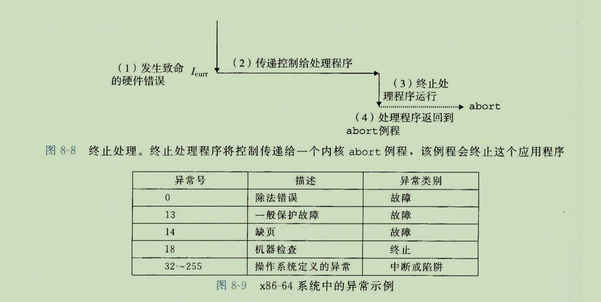
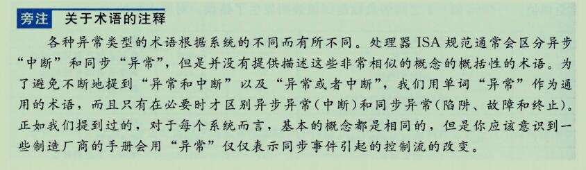

**异常控制流**

```
非本地跳转(即违反通用的调用/返回栈规则的跳转)
```

```
从给处理器加电开始，知道你断电为止，程序计数器假设一个值的序列
a(0),a(1),...,a(n-1)

其中，每个a(k)是某个相应指令I(k)的地址。
每次从a(k)到a(k+1)的过渡称为控制转移(control transfer).
这样的控制转移序列叫做处理器的控制流(flow of control 或 control flow).

最简单的一种控制流是一个"平滑的"序列，其中每个 I(k)和I(k+1)在内存中都是相邻的。这种平滑流的突变(也就是I(k+1)与I(k)不相邻)通常是由诸如跳转、调用和返回这样的一些熟悉的指令造成的。
这样一些指令都是必要的机制，使得程序能够对由程序变量表示的内部程序状态中的变化做出反应。

但是系统也必须能够对系统状态的变化做出反应，这些系统状态不是被内部程序变量捕获的，而且也不一定要和程序的执行相关。
比如，一个硬件定时器定期产生信号，这个事件必须得到 处理。包到达网络适配器后，必须放在内存中。程序向磁盘请求数据，然后休眠，直到被通知说数据已就绪。当子进程终止时，创造这些子进程的父进程必须得到通知。

现代系统通过使控制流发生突变来对这些情况作出反应。一般而言，我们把这些突变称为异常控制流(Exceptional control flow, ECF).
异常控制流发生在计算机系统的各个层次。
比如，在硬件层，硬件检测到的事件会触发控制突然转移到异常处理程序
在操作系统层，内核通过上下文切换将控制从一个用户进程转移到另一个用户进程。
在应用层，一个进程可以发送信号到另一个进程，而接收者会将控制突然转移到它的一个信号处理程序。一个程序可以通过回避通常的栈规则，并执行到其他函数中任意位置的非本地跳转来对错误做出反应。
```

```
作为程序员，理解ECF很重要，这有很多原因：
理解ECF将帮助你理解重要的系统概念。ECF是操作系统用来实现I/O、进程和虚拟内存的基本机制。在能够真正理解这些重要概念之前，你必须理解ECF。

理解ECF将帮助你理解应用 程序时如何与操作系统交互的。应用程序通过使用一个叫做陷阱(trap)或者系统调用(system call)的ECF形式，向操作系统请求服务。
比如，向磁盘写数据、从网络读取数据、创建一个新进程，以及终止当前进程，都是通过应用程序调用系统调用来实现的。理解基本的系统调用机制将帮助你理解这些服务是如何提供给应用的。

理解ECF将帮助你编写有趣的新应用程序。操作系统为应用程序提供了强大的ECF机制，用来创建新进程、等待进程终止、通知其他进程系统中的异常事件，以及检测和响应这些事件。如果理解了这些ECF机制，那么你就能用它们来编写诸如 Unix shell 和web服务器之类有趣程序了。

理解ECF将帮助你理解并发。ECF是计算机系统中实现并发的基本机制。在运行中的并发的例子有：中断应用程序执行的异常处理程序，在时间上重叠执行的进程和线程，以及中断应用程序执行的信号处理程序。理解ECF是理解并发的第一步。我们会在第12章中更详细的研究并发。

理解ECF将帮助你理解软件异常如何工作。像C++ 和 java 这样的语言通过 try、catch 以及 throw 语句来提供软件异常机制。软件异常允许程序进行非本地跳转(即违反通用的调用/返回栈规则的跳转)来响应错误情况。非本地跳转是一种应用层ECF，在 C中是通过 setjmp 和 longjmp函数提供的。理解这些低级函数将帮助你理解高级软件异常如何得以实现。
```

```
对系统的学习，到目前为止你已经了解了应用是如何与硬件交互的。本章的重要性在于你讲开始学习应用是如何与擦偶作系统交互的。
有趣的是，这些交互都是围绕着ECF的。我们将描述存在于一个计算机系统中所有层次上的各种形式的 ECF。从异常开始，异常位于硬件和操作系统交界的部分。
我们还会讨论系统调用，它们是为应用程序提供到操作系统的入口点的异常。
然后我们会提升抽象的层次，描述进程和信号，它们位于应用和操作系统的交界之处。最后讨论非本地跳转，这是ECF的一种应用层形式。
```


## 1、异常

```
异常是异常控制流的一种形式，它一部分由硬件实现，一部分由操作系统实现。
因为有一个部分是由硬件实现的，所以具体细节将随系统的不同而有所不同。然而，对于每个系统而言，基本的思想都是相同的。在这一节中我们的目的是让你对异常和异常处理有一个一般性的了解，并且想你揭示现在计算机系统的一个经常令人感到迷惑的方面。
```

```
异常(exception)就是控制流中的突变，用来响应处理器状态中的某些变化。图8-1展示了基本的思想。
```


```
在图中，当处理器状态中发生一个重要的变化时，处理器正在执行某个当前指令 I(curr).
在处理器中，状态被编码为不同的位和信号。状态变化称为事件(event).事件可能和当前指令的执行直接相关。
比如，发生虚拟内存缺页、算术溢出，或者一条指令试图除以零。
另一方面，事件也可能和当前指令的执行没有关系。
比如，一个系统定时器产生信号或者一个I/O请求完成。
```

```
在任何情况下，当处理器检测到有事件发生时，它就会通过一张叫做异常表(exception table)的跳转表，进行一个间接过程调用(异常)，到一个专门设计用来处理这类事件的操作系统子程序(异常处理程序(exception handler))。
当异常处理程序完成处理后，根据引起异常的类型，会发生以下3种情况的一种：
1、处理程序将控制返回给当前指令 I(curr),即当事件发生时正在执行的指令。
2、处理程序将控制返回给I(next),如果没有发生异常将会执行的下一条指令。
3、处理程序终止被中断的程序。
```


### 1、异常处理

```
异常可能会难以理解，因为处理异常需要硬件和软件紧密合作。很容易搞混哪个部分执行哪个任务。让我们更详细地来看看硬件和软件的分工吧。
```

```
系统中可能的每种类型的异常都分配了一个唯一的非负整数的异常号(exception number).
其中一些号码是由处理器的设计者分配的，其他号码是由操作系统内核(操作系统常驻内存的部分)的设计者分配的。
前者的示例包括被零除、缺页、内存访问违例、断点以及算术运算溢出。
后者的示例包括系统调用和来自外部I/O设备的信号。
```

```
在系统启动时(当计算机重启或加电时)，操作系统分配和初始化一张称为异常表的跳转表，使得表目k包含异常k的处理程序的地址。图8-2展示了异常表的格式。
```


```
在运行时(当系统在执行某个程序时)，处理器检测到发生了一个事件，并且确定了相应的异常号k。随后，处理器触发异常，方法是执行间接过程调用，通过异常表的表目k，转到相应的处理程序。
图8-3展示了处理器如何使用异常表来形成适当的异常处理程序的地址。
异常号是到异常表中的索引，异常表的起始地址放在一个叫做异常标记址寄存器(exception table base register)的特殊CPU寄存器里。
```


```
异常类似于过程调用，但是有一些重要的不同之处：
1、过程调用时，在跳转到处理程序之前，处理器将返回地址压入栈中。然而，根据异常的类型，返回地址要么是当前指令(当事件发生时正在执行的指令)，要么是下一条指令(如果事件不发生，将会在当前指令后执行的指令)。

2、处理器也把一些额外的处理器状态压入到栈中，在处理器程序返回时，重新开始执行被中断的程序会需要这些状态。比如，x86-64系统会将包含当前条件码的 EFLAGS寄存器和其他内容压入栈中。

3、如果控制从用户程序转移到内核，所有这些项目都被压入到内核栈中，而不是压到用户栈中。

4、异常处理程序运行在内核模式下，这意味着它们对所有的系统资源都有完全的访问权限。

一旦硬件触发了异常，剩下的工作就是由异常处理程序在软件中完成。在处理程序处理完事件之后，它通过执行一条特殊的"从中断返回"指令，可选的返回到被中断的程序，该指令将适当的状态弹回到处理器的控制和数据寄存器中，如果异常中断的是一个用户程序，就将状态恢复为用户模式，然后将控制返回给被中断的程序。
```

### 2、异常的类别

```
异常可以分为四类：中断(interrupt)、陷阱(trap)、故障(fault)、终止(abort)。下图对这些类别的属性做了小结。
```


```
异常的类别，
异步异常是由处理器外部的I/O设备中的事件产生的。
同步异常是执行一条指令的直接产物。
```


#### 1、中断

```
中断是异步发生的，是来自处理器外部的I/O设备的信号的结果。
硬件中断不是由任何一条专门的指令造成的，从这个意义上来说它是异步的。
硬件中断的异常处理程序常常称为中断处理程序(interrupt handler).
```

```
图8-5概述了一个中断的处理。I/O设备，例如网络适配器、磁盘控制器和定时器芯片，通过向处理器芯片上的一个引脚发信号，并将异常号放到系统总线上，来触发中断，这个异常号标识了引起中断的设备。
```


```
在当前指令完成执行之后，处理器注意到中断引脚的电压变高了，就从系统总线读取异常号，然后调用适当的中断处理程序。当处理程序返回时，它就将控制返回给下一条指令(也即如果没有发生中断，在控制流中会在当前指令之后的那条指令)。
结果是程序继续执行，就好像没有发生过中断一样。
```

```
剩下的异常类型(陷阱、故障和终止)是同步发生的，是执行当前指令的结果。我们把这类指令叫做故障指令(faulting instruction).
```

#### 2、陷阱和系统调用

```
陷阱是有意的异常，是执行一条指令的结果。就像中断处理程序一样，陷阱处理程序将控制返回到下一条指令。
陷阱最重要的用途是在用户程序和内核之间提供一个像过程一样的接口，叫做系统调用。
```

```
用户程序经常需要向内核请求服务，比如读一个文件(read)、创建一个新的进程(fork)、加载一个新的程序(execve),或者终止当前进程(exit).
为了允许对这些内核服务的受控的访问，处理器提供了一条特殊的"stscall n"指令，当用户程序想要请求服务 n 时，可以执行这条指令。
执行 syscall 指令会导致一个到异常处理程序的陷阱，这个处理程序解析参数，并调用适当的内核程序。 
图8-6 概述了一个系统调用的处理。
```


```
从程序员的角度来看，系统调用和普通的函数调用是一样的。然而，它们的实现非常不同。
普通的函数运行在用户模式中，用户模式限制了函数可以执行的指令的类型，而且它们只能访问与调用函数相同的栈。
系统调用运行在内核模式中，内核模式允许系统调用执行特权指令，并访问定义在内核中的栈。
```

#### 3、故障

```
故障由错误情况引起，它可能能够被故障处理程序修正。
当故障发生时，处理器将控制转移给故障处理程序。
如果处理程序能够修正这个错误情况，它就将控制返回到引起故障的指令，从而重新执行它。
否则，处理程序返回到内核中的 abort 例程，abort 例程会终止引起故障的应用程序。
图8-7概述了一个故障的处理。
```


```
一个经典的故障示例是缺页异常，当指令引用一个虚拟地址，而与该地址相对应的物理页面不在内存中，因此必须从磁盘中取出时，就会发生故障。
就像我们将在第9章中看到的那样，一个页面就是虚拟内存的一个连续的块(典型的是4KB).缺页处理程序从磁盘加载适当的页面，然后将控制返回给引起故障的指令。当指令再次执行时，相应的物理页面已经驻留在内存中了，指令就可以没有故障的运行完成了。
```

#### 4、终止

```
终止是不可恢复的致命错误造成的结果，通常是一些硬件错误，比如 DRAM 或者 SRAM 位被损坏时发生的奇偶错误。
终止处理程序从不将控制返回给应用程序。如图8-8所示，处理程序将控制返回给一个abort 例程，该例程会终止这个应用程序。
```


### 3、Linux/x86-64 系统中的异常

```
为了使描述更具体，让我们来看看为 x86-64 系统定义的一些异常。
有高达256种不同的异常类型[50]。0~31的号码对应的是由 Intel 架构师定义的异常，因此对任何x86-64系统都是一样的。32~255的号码对应的是操作系统定义的中断和陷阱。
图8-9展示了一些示例。
```




#### 1、Linux/x86-64故障和终止

```
除法错误。
	当应用试图除以零时，或者当一个除法指令的结果对于目标操作数来说太大了的时候，就会发生除法错误(异常 0)。Unix 不会试图从除法错误中恢复，而是选择终止程序。Linux shell 通常会把除法错误报告为"浮点异常(Floating exception)".
```

```
一般保护故障。
	许多原因都会导致不为人知的一般保护故障(异常13)，通常是因为一个程序引用了一个未定义的虚拟内存区域，或者因为程序试图写一个只读的文本段。
Linux 不会尝试恢复这类故障。
Linux shell 通常会把这种一般保护故障报告为"段故障(Segmentation fault)"
```

```
缺页(异常14)
	缺页是会重新执行产生故障的指令的一个异常示例。处理程序将适当的磁盘上虚拟内存的一个页面映射到物理内存的一个页面，然后重新执行这条产生故障的指令。
	我们将在第9章中看到缺页时如何工作的细节。
```

```
机器检查。 机器检查(异常18)是在导致故障的指令执行中检测到致命的硬件错误时发生的。 机器检查处理程序从不返回控制给应用程序。
```


#### 2、Linux/86-64 系统调用

```
Linux 提供几百种系统调用，当应用程序想要请求内核服务时可以使用，包括读文件、写文件或是创建一个新进程。 
图8-10给出了一些常见的 Linux 系统调用。
每个系统调用都有一个唯一的整数号，对应于一个到内核中跳转表的偏移量。(注意：这个跳转表和异常表不一样。)
```

```
	C程序用 syscall 函数可以直接调用任何系统调用。
然而，实际中几乎没必要这么做。对于大多数系统调用，标准C库提供了一组方便包装函数。
这些包装函数将参数打包到一起，以适当的系统调用指令陷入内核，然后将系统调用的返回状态传递回调用程序。
在，本书中，我们将系统调用和与它们相关联的包装函数都称为 系统级函数，这两个术语可以互换的使用。
```

```
在X86-64系统上，系统调用是通过一条称为 syscall 的陷阱指令来提供的。
研究程序能够如何使用这条指令来直接调用 Linux 系统调用时很有趣的。
所有到 Linux 系统调用的参数都是通过通用寄存器而不是栈传递的。

按照惯例，寄存器 %rax 包含系统调用号，寄存器 %rdi %rsi %rdx %r10 %r9 %r8 包含最多6个参数。
第一个参数在 %rdi 中，第二个在 %rsi 中，以此类推。从系统调用返回时，寄存器%rcx 和 %r11 都会被破坏，%rax 包含返回值。 -4095 到 -1 之间的负数返回值表明发生了错误，对应于负的 errno.
```





## 2、进程

```
异常是允许操作系统系统内核提供进程(process)概念的基本构造块，进程是计算机科学中最深刻、最成功的概念之一。
```

```
在现代系统上运行一个程序时，我们会得到一个假象，就好像我们的程序时系统中当前运行的唯一的程序一样。
我们的程序好像是独占地使用处理器和内存。处理器就好像是无间断的一条接一条地执行我们程序中的指令。
最后我们的程序中的代码和数据好像是系统内存中唯一的对象。这些假象都是通过进程的概念提供给我们的。
```

```
进程的经典定义就是一个执行中程序的实例。
系统中的每个程序都运行在某个进程的上下文(context)中。
上下文是由程序正确运行所需的状态组成的。
这个状态包括存放在内存中的程序的代码和数据，它的栈、通用目的寄存器的内存、程序计数器、环境变量以及打开文件描述符的集合。
```

```
每次用户通过向 shell 输入一个可执行文件的名字，运行程序时，shell 就会创建一个新的进程，然后在这个新进程的上下文中运行这个可执行目标文件。
应用程序也能够创建新进程，并且在这个新进程的上下文中运行它们自己的代码或其他应用程序。
```

```
关于操作系统如何实现进程的细节的讨论超出了本书的范围。反之，我们将关注进程提供给应用程序的关键抽象：
一个独立的逻辑控制流，它提供一个假象，好像我们的程序独占的使用处理器。
一个私有的地址空间，它提供一个假象，好像我们的程序独占的使用内存系统。
```


### 1、逻辑控制流

```
即使在系统中通常有许多其他程序在运行，进程也可以向每个程序提供一种假象，好像它在独占的使用处理器.

如果想用调式器单步执行程序，我们会看到一系列的程序计数器(PC)的值，这些值唯一的对应于包含在程序的可以执行目标文件中的指令，或是包含在运动时动态链接到程序的共享对象中的指令。这个PC值的序列叫做逻辑控制流，或者简称逻辑流。
```


```
考虑一个运行着三个进程的系统，如图8-12所示。
处理器的一个物理控制流被分成了三个逻辑流，每个进程一个。
每个竖直的条表示了一个进程的逻辑流的一部分。
在这个例子中，三个逻辑流的执行时交错的。
进程A运行了一会儿，然后是进程B开始运行完成。然后，进程C运行了一会儿，进程A接着运行知道完成。最后，进程C可以运行结束了。
```

```
图8-12的关键点在于进程是轮流使用处理器的。
每个进程执行它的流的一部分，然后被抢占(prempted)(暂时挂起)，然后轮到其他进程。
对于一个运行在这些进程之一的上下文中的程序，它看上去像是在独占地使用处理器。
唯一的反面例证是，如果我们精确地测量每条指令使用的时间，会发现在程序中一些指令的执行之间，CPU好像会周期性的停顿。然后，每次处理器停顿，它随后会继续执行我们的程序，并不改变程序内存位置或寄存器的内容。
```

### 2、并发流

```
计算机系统中逻辑流有许多不同的形式。
异常处理程序、进程、信号处理程序、线程和java进程都是逻辑流的例子。

一个逻辑流的执行在时间上与另一个流重叠，称为并发流(concurrent flow)，这两个流被称为并发的运行。更准确的说，流X和Y互相并发，当且仅当X在Y开始之后和Y结束之前开始.
```

```
多个流并发的执行的一般现象被称为并发(concurrency)。
一个进程和其他进程轮流运行的概念称为多任务(multitasking)。
一个进程执行它的控制流的一部分的每个时间段叫做时间片(time slice)。
因此，多任务也叫做时间分片(time slicing).
```

```
注意，并发流的思想与流运行的处理器核数或者计算机数无关。如果两个流在时间上重叠，那么它们就是并发的额，即使它们是运行在同一个处理器上。
不过，有时我们会发现确认并行流是很有帮助的，它是并发流的一个真子集。

如果两个流并发的运行在不同的处理器核或者计算机上，那么我们从称它们为并行流(parallel flow), 它们并行地运行(running in parallel)，且并行的执行(parallel execution).
```

### 3、私有地址空间

```
进程也为每个程序提供一种假象，好像它独占的使用系统地址空间。
在一台n位地址的机器上，地址空间是 2^n 个可能地址的集合，0，1,...,2^n-1。
进程为每个程序提供它自己的私有地址空间。
一般而言，和这个空间中某个地址相关联的那个内存字节是不能被其他进程读或者写的，
从这个意义上来说，这个地址空间是私有的。
```

```
尽管和每个私有地址空间相关联的内存的内容一般是不同的，但是每个这样的空间都有相同的通用结构。
比如,图8-13 展示了一个 x86-64Linux 进程的地址空间的组织结构。
```


```
地址空间底部是保留给用户程序的，包括通常的代码、数据、堆和栈段。
代码段总是从地址 0x400000 开始。
```


