## 5、信号

```
到目前为止对异常控制流的学习中，我们已经看到了硬件和软件是如何合作以提供基本的底层异常机制的。
我们也看到了操作系统如何利用异常来支持进程上下文切换的异常控制流形式。
在本节中，我们将研究一种更高层的软件形式的异常，称为 Linux 信号，它允许进程和内核中断其他进程。
```

```
一个信号就是一条小消息，它通知进程系统中发生了一个某种类型的事件。

每种信号类型都对应于某种系统事件。
底层的硬件异常是由内核异常处理程序处理的，正常情况下，对用户进程而言是不可见的。
信号提供了一种机制，通知用户进程发生了这些异常。
```

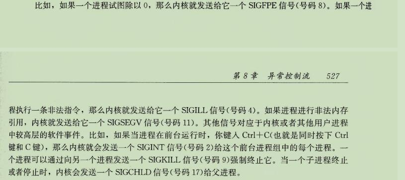

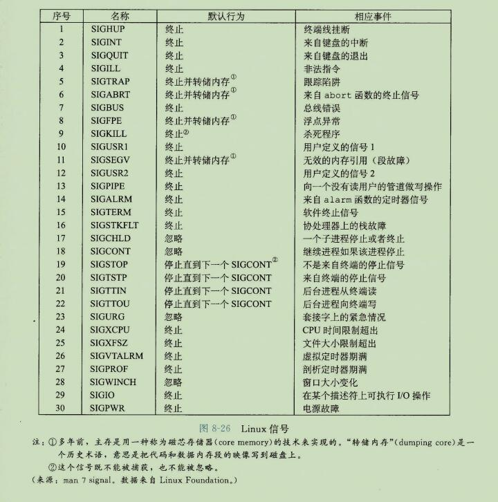


### 1、信号术语

```
传送一个信号到目的进程是由两个不同步骤组成的：

发送信号
	内核通过更新目的进程上下文中的某个状态，发送(递送)一个信号给目的进程。
	发送信号可以有如下两种原因：
	1、内核检测到一个系统事件，比如除零错误或者子进程终止。
	2、一个进程调用了 kill 函数，显式的要求内核发送一个信号给目的进程。
	
一个进程可以发送信号给它自己。
```

```
接收信号：
	当目的进程被内核 强迫以某种方式对信号的发送做出反应时，它就接收了信号。
	进程可以忽略这个信号，终止或者通过执行一个称为 信号处理程序(signal handler)的用户层函数捕获这个信号。
	
	图8-27给出了信号处理程序捕获信号的基本思想。
```

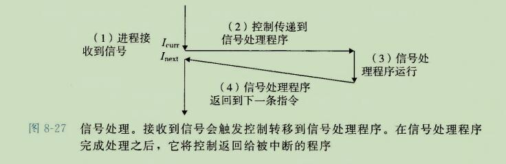

```
一个发出而没有被接收的信号叫做待处理信号(pending signal)。
在任何时刻，一种类型至多只会有一个待处理信号。
如果一个进程有一个类型为K的待处理信号，那么任何接下来发送到这个进程的类型为k的信号都不会排队等待;它们只是被简单的丢弃。
一个进程可以有选择性地阻塞接收某种信号。
当一种信号被阻塞时，它仍可以被发送，但是产生的待处理信号不会被接收，直到进程取消对这种信号的阻塞。
```

```
一个待处理信号最多只能被接收一次。内核为每个进程在 pending 位向量中维护着待处理信号的集合，而在 blocked 位向量中维护着被阻塞的信号集合。
只要传送了一个类型为 K 的信号，内核就会设置 pending 中的第 k 位，而只要接收了一个类型为 k 的信号，内核就会清除 Pending 中的第 k 位。
```


### 2、发送信号

```
Unix 系统提供了大量向进程发送信号的机制。
所有这些机制都是基于进程组(process group)这个概念的。
```

1、进程组

```
每个进程都只属于一个进程组，进程组是由一个正整数进程组ID来标识的。

getpgrp函数返回当前进程的进程组ID。
```

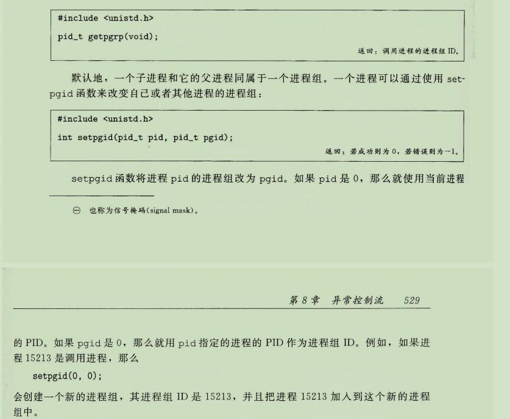

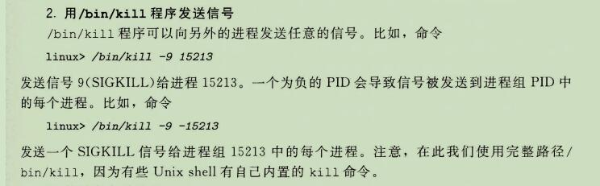

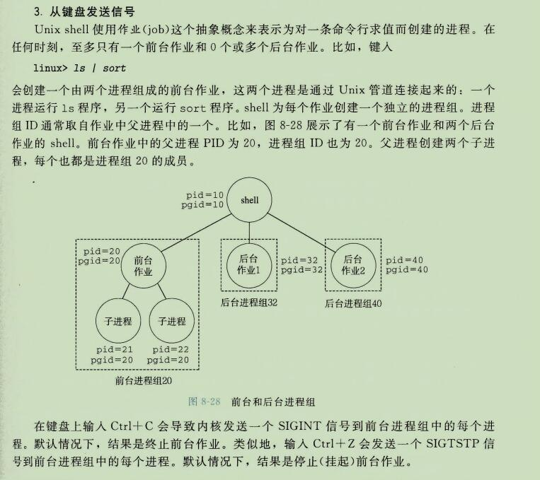

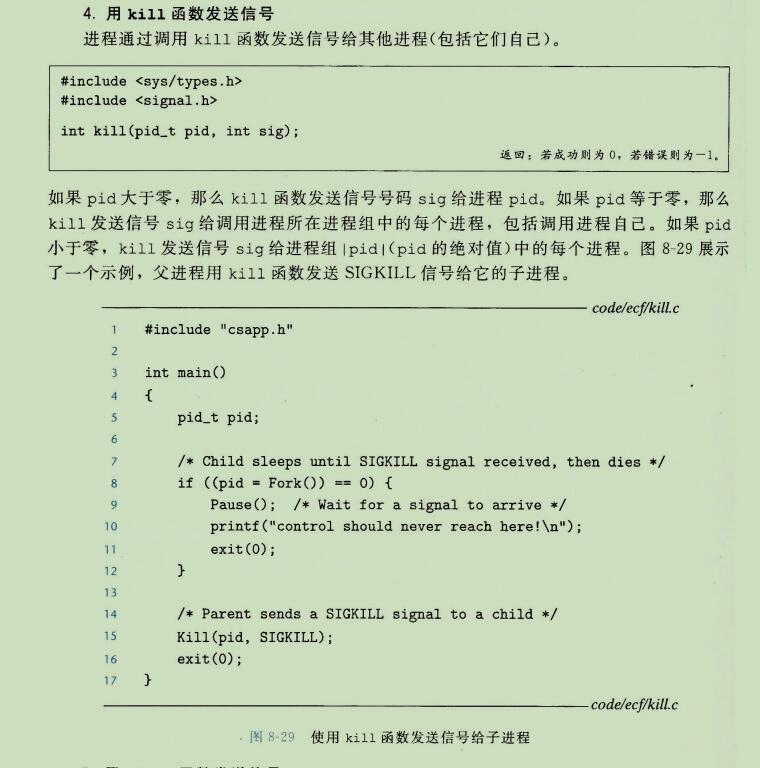

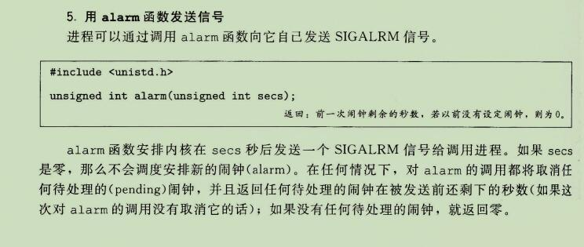

### 3、接收信号

```
当内核吧进程 P 从内核模式切换到用户模式时(例如，从系统调用返回或是完成了一次上下文切换)，它会检查进程 p 的未被阻塞的待处理信号的集合(pending&~blocked)。
如果这个集合为空(通常情况下)，那么内核将控制传递到 p 的逻辑控制流中的下一条指令(I(next))。
然而，如何集合是非空的，那么内核选择集合中的某个信号k(通常是最小的k)，并且强制 p 接收信号k。收到这个信号会触发进程采取某种行为。
一旦进程完成了这个行为，那么控制就传递回 p 的逻辑控制流中的下一条指令(Inext)
先接收信号 然后再进行某种行为。

每个信号类型都有一个预定义的默认行为，是下面中的一种：
1、进程终止
2、进程终止并转储内存(意思是把代码和数据段的映象写到磁盘上)
3、进程停止(挂起)直到被 SIGCONT 信号重启。
4、进程忽略该信号。
```

```
图8-26展示了与每个信号类型相关联的默认行为。
比如，收到 SIGKILL 的默认行为就是终止接收进程。另外，接收到  SIGCHLD 的默认行为就是忽略这个信号。进程可以通过使用 signal 函数修改和信号相关联的默认行为。
唯一的例外是 SIGSTOP 和 SIGKILL ，它们的默认行为是不能修改的。
```

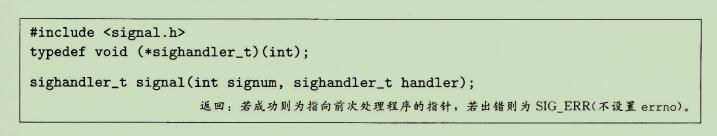

```
signal 函数可以通过下列三种方法之一来改变和信号 signum 相关联的行为：
1、如果 handler 是 SIG_IGN, 那么忽略类型为 signum 的信号。
2、如果 handler 是 SIG_DFL, 那么类型为 signum 的信号行为恢复默认行为。
3、否则，handler 就是用户定义的函数的地址，这个函数被称为信号处理程序，只要进程接收到一个类型为 signum 的信号，就会调用这个程序。
通过把处理程序的地址传递进 signal 函数从而改变默认行为，这叫做设置信号处理程序(installing the hadnler)。
调用信号处理程序被称为捕获信号。
执行信号处理程序被称为处理信号。
```

```
当一个进程捕获了一个类型为 k 的信号时，会调用为信号k设置的处理程序，一个整数参数被设置为 k。
这个参数允许同一个处理函数捕获不同类型的信号。
```

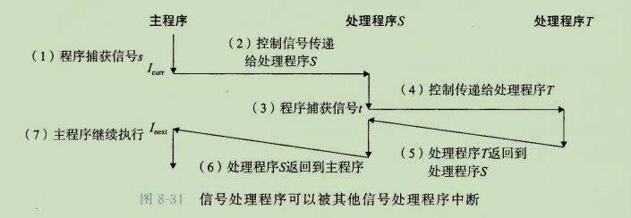

```
信号处理程序可以被其他信号处理程序中断，如图8-31所示。
在这个例子中，主程序捕获到信号 s, 该信号会中断主程序，将控制转移到处理程序S。
S在运行时，程序捕获信号 t!=s,该信号会中断S,控制转移到处理程序T。
当T返回时，S从它被中断的地方继续执行。最后，S返回，控制传送回主程序。
主程序从它被中断的地方继续执行。

就是有可能你在执行S，然后异常定时中断来了，就又到了检测待处理信号的集合了，然后发现不为空，就取出了 T，执行T的，T的执行完了，返回之前的指令，就返回到了S的处理程序。
```


### 4、阻塞和解除阻塞信号

````
Linux 提供阻塞信号的隐式和显式的机制：
隐式阻塞机制： 内核默认阻塞任何的当前处理程序正在处理信号类型的待处理的信号。
例如，图8-31中，假设程序捕获了信号s，当前正在运行处理程序S。
如果发送给该进程另一个信号s,那么直到处理程序S返回，s会变成待处理而没有接收。
````

#### 显式阻塞机制：

```
应用程序可以使用 sigprocmask 函数和它的辅助函数，明确的阻塞和解除阻塞选定的信号。
```

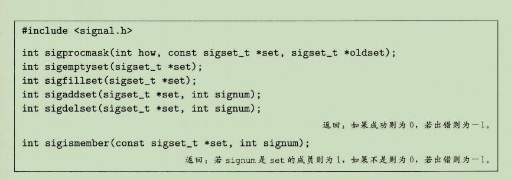

```
sigprocmask 函数改变当前阻塞的信号集合(8.5.1节中描述的 blocked 位向量)。
具体的行为依赖于 how 的值：
SIG_BLOCK
	把set 中的信号添加到 blocked中(blocked = blocked|set)
SIG_UNBLOCK
	从blocked中删除set中的信号(blocked=blockd & ~set)
SIG_SETMASK
	block=set
如果 oldset 非空，那么blocked位向量之前的值保存在oldset中。
```

```
使用下述函数对set信号集合进程操作：
sigemptyset 初始化set为空集合。
sigfillset 函数把每个信号都添加到set中
sigaddset 函数吧 signum 添加到 set
sigdelset 从 set 中删除 signum
sigismember 如果 signnum 是 set 的成员，那么返回 1，否则返回 0
```

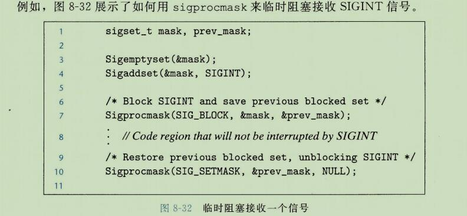

#### 编写信号处理程序

##### 正确的信号处理器

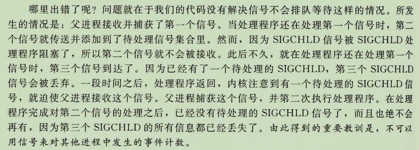


##### 可移植的信号处理

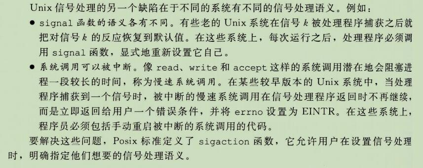

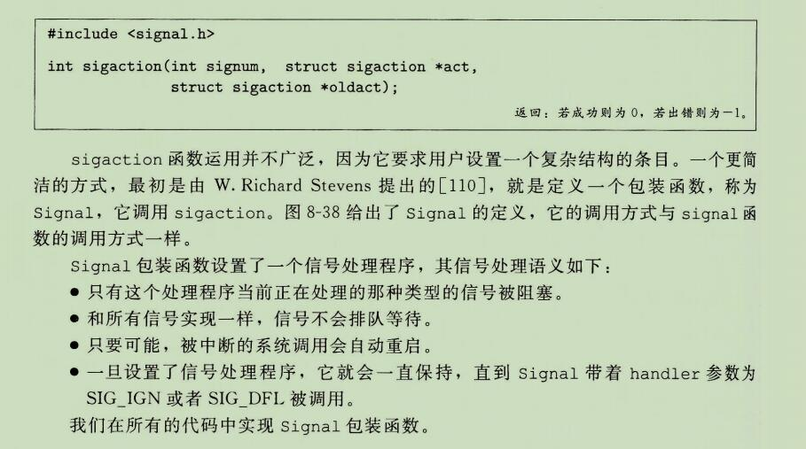

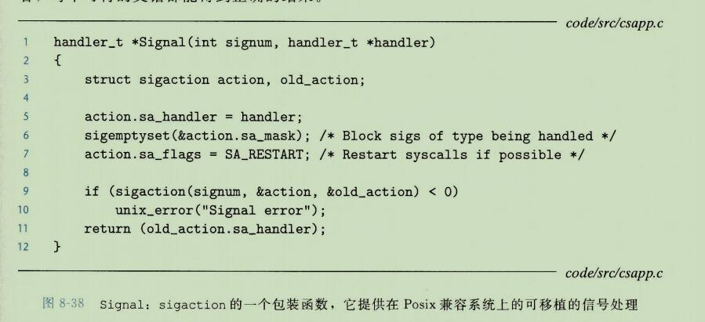


## 6、非本地跳转

```
C语言提供了一种用户级异常控制流形式，称为非本地跳转(nonlocal jump),它将控制直接从一个函数转移到另一个当前正在执行的函数，而不需要经过正常的调用-返回序列。
非本地跳转是通过 setjmp 和 longjmp 函数来提供的。
```

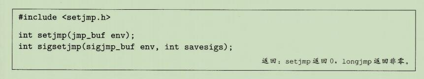

```
setjmp 函数在 env 缓冲区中保存当前调用环境。
以供后面的  longjmp 使用，并返回 0。
调用环境包括程序计数器、栈指针和通用目的寄存器。

出于某种超出本书描述范围的原因，setjmp返回的值不能被赋值给变量：
不过它可以安全的用在 switch 或条件语句的测试中。
```

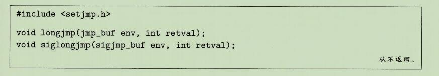

```
longjmp 函数从 env 缓冲区中恢复调用环境，然后触发一个从最近一次初始化 env 的 setjmp 调用的返回。
然后 setjmp 返回，并带有非零的返回值 retval。
```

```
第一眼看过去，setjmp 和 longjmp 之间的互相关系令人迷惑。
setjmp 函数只被调用一次，但返回多次：
一次是当第一次调用 setjmp，而调用环境保存在缓冲区 env 中时，一次是为每个相应的 longjmp 调用。
另一方面，longjmp 函数被调用一次，但从不返回。
```

```
非本地跳转的一个重要应用就是允许从一个深层嵌套的函数调用中立即返回，通常是由检测到某个错误情况引起的。
如果在一个深层嵌套的函数调用中发现了一个错误情况，我们可以使用非本地跳转直接返回到一个普通的本地化的错误处理程序，而不是费力地解开调用栈。
```

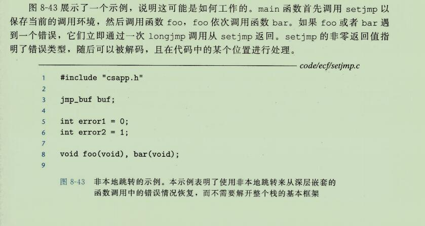

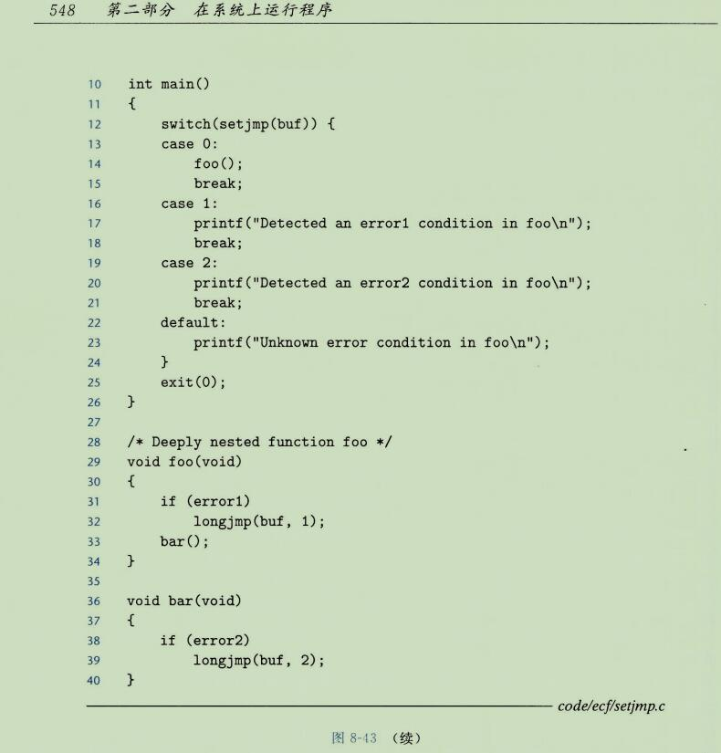


```
longjmp允许它跳过所有中间调用的特性  可能产生意外的后果。

例如，如果中间函数调用中分配了某些数据结构，本来预期在函数结尾处释放它们，那么这些释放代码会被跳过，因而会产生内存泄露。
```

````
非本地跳转的另一个重要的应用是时一个信号处理程序分支到一个特殊的代码位置，而不是返回到被信号到达中断了的指令的位置。
````

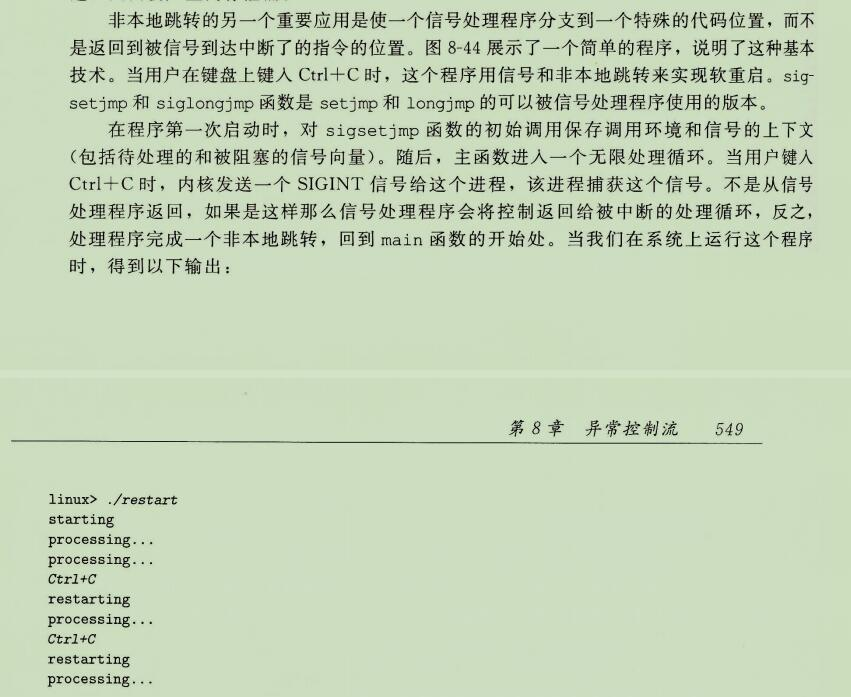

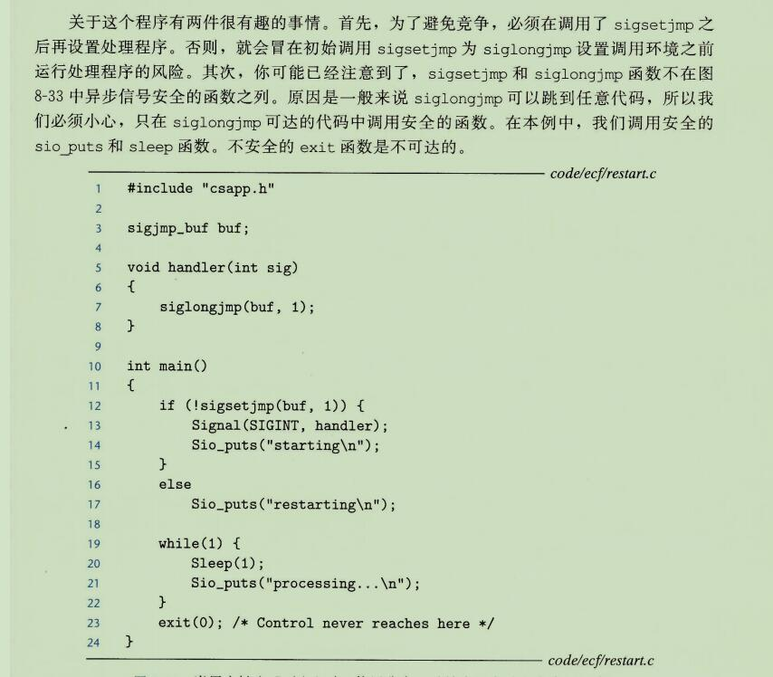


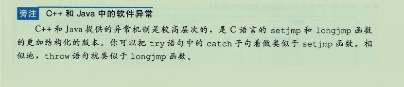


什么叫慢系统调用？

```
“快速”和“慢速”系统调用的区别接近于非阻塞与阻塞，但这次是从内核实施者的角度来看。

快速系统调用是已知能够在不阻塞或等待的情况下完成的系统调用。当内核遇到快速系统调用时，它知道它可以立即执行系统调用，并保持相同的进程调度。

另一方面，慢速系统调用可能需要等待另一个任务完成，因此内核必须准备暂停调用进程并运行其他任务。
```

[慢系统调用](https://blog.csdn.net/xiangguiwang/article/details/79865328)

```
为啥慢系统调用会中断，猜测因为要等待其他硬件返回，所以CPU其实在中断的时候已经是空闲等待状态的了。

信号什么时候处理：内核返回到用户模式的时候;也可以说系统调用返回时。

慢系统调用调用：进行进程调度，然后后面进程再调度回来，然后处理信号，直接跳转到下一个指令，慢系统调用就失败。
然后重启慢系统调用。

理解的应该是错的。
目前就知道慢系统调用会被信号中断！！！！
```


