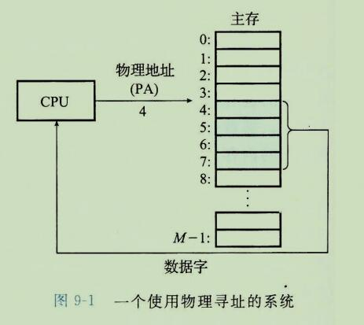
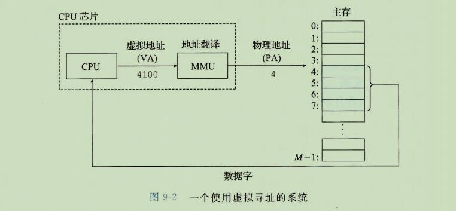
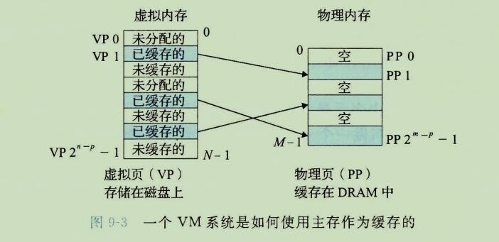

**虚拟内存**

```
一个系统中的进程是与其他进程共享 CPU 和主存资源的。
然而，共享内存会形成一些特殊的挑战。
随着对CPU需求的增长，进程以某种合理的平滑方式慢了下来。
但是如果太多的进程需要太多的内存，那么它们中的一些就根本无法运行。
当一个程序没有空间可用时，那就是它运气不好了。
内存还很容易被破坏。
如果某个进程不小心写了另一个进程使用的内存，它就可能以某种完全和程序逻辑无关的令人迷惑的方式失败。
```

```
为了更加有效的管理内存并且少出错，现代系统提供了一种对主存的抽象概念，叫做虚拟内存(VM)。
虚拟内存是硬件异常、硬件地址翻译、主存、磁盘文件和内核软件的完美交互，它为每个进程提供了一个大的、一致的和私有的地址空间。
通过一个很清晰的机制，虚拟内存提供了三个重要的能力：

1、它将主存看成是一个存储在磁盘上的地址空间的高速缓存，在主存中只保存活动区域，并根据需要在磁盘和主存之间来回传送数据，通过这种方式，它高效的使用了主存。

2、它为每个进程提供了一致的地址空间，从而简化了内存管理。

3、它保护了每个进程的地址空间不被其他进程破坏。
```

```
虚拟内存时计算机系统最重要的概念之一。
它成功的一个主要原因就是因为它是沉默地、自动的工作，不需要应用程序员的任何干涉。
既然虚拟内存在幕后工作的如此之好，为什么程序员还需要理解它呢？有以下几点原因：
```

```
虚拟内存是核心的。
虚拟内存遍及计算机系统的所有层面，在硬件异常、汇编器、链接器、加载器、共享对象、文件和进程的设计中扮演着重要角色。

虚拟内存是强大的。
虚拟内存给予应用程序强大的能力，可以创建和销毁内存片(chunk)、将内存片映射到磁盘文件的某个部分，以及与其他程序共享内存。
比如，你知道可以通过读写内存位置 读或者修改一个磁盘文件的内容吗？
理解虚拟内存将帮助你利用它的强大功能在应用程序中添加动力。

虚拟内存是危险的。
每次应用程序引用一个变量、间接引用一个指针，或者调用一个诸如 malloc 这样的动态分配程序时，它就会和虚拟内存发生交互。
如果虚拟内存使用不当，应用将遇到"复杂危险"或者"保护错误"，它可能在崩溃之前还默默运行了几个小时，或者是最令人惊慌的，运行完成却产生不正确的结果。
理解虚拟内存以及诸如 malloc 之类的管理虚拟内存的分配程序，可以帮助你避免这些错误。
```

```
这一章从两个角度来看虚拟内存。
本章的前一部分描述虚拟内存是如何工作的。
后一部分描述的是应用程序如何使用和管理虚拟内存。
无可避免的事实是虚拟内存很复杂，本章很多地方都反映了这一点。
好消息是如果你掌握这些细节，你就能够手工模拟一个小系统的虚拟内存机制，而且虚拟内存的概念将永远不再神秘。

第二部分是建立在这种理解之上的，向你展示了如何在程序中使用和管理虚拟内存。
你将学会如何通过显式的内存映射和对象 malloc 程序这样的动态内存分配器的调用来管理虚拟内存。
你还将了解到C程序中的大多数常见的与内存有关的错误，并学会如何避免它们的出现。
```


## 1、物理和虚拟寻址

```
计算机系统的主存被组织成一个由M个连续的字节大小的单元组成的数组。
每字节都有一个唯一的 物理地址(physical Address,PA)。
第一个字节的地址为0,接下来的字节地址为1，再下一个为2，依次类推。
给定这种简单的结构，CPU访问内存的最自然的方式就是使用物理地址。
我们把这种方式称为物理寻址(physical addressing)。
```

```
图9-1展示了一个物理寻址的示例，该示例的上下文是一条加载指令，它读取从物理地址4处开始的4字节字。当CPU执行这条加载指令时，会生成一个有效物理地址，通过内存总线，把它传递给主存。
主存取出物理地址4处开始的4字节字，并将它返回给CPU，CPU会将它存放在一个寄存器里。
```



```
早期的PC使用物理寻址，而且诸如数字信号处理器、嵌入式微控制器以及 Cray 超级计算机这样的系统仍然使用这种寻址方式。
然而，现代处理器使用的是一种称为虚拟寻址(virtual addressing)的寻址方式，参见图 9-2。
```




```
使用虚拟寻址，CPU通过生成一个虚拟地址(Virtual Address,VA)来访问主存，这个虚拟地址在被传送到内存之前先转换成适当的物理地址。
将一个虚拟地址转换为物理地址的任务叫做地址翻译(addresss translation)。
就像异常处理一样，地址翻译需要CPU硬件和操作系统之间的紧密合作。CPU芯片上叫做内存管理单元(Memory Managerment Unit, MMU)的专门硬件，利用存放在主存中的查询表来动态翻译虚拟地址，该表的内容由操作系统管理。
```


## 2、地址空间

```
地址空间(address space)是一个非负整数地址的有序集合：
{0,1,2,3,...}
如果地址空间的整数是连续的，那么我们说它是一个线性地址空间(linear address space)。
为了简化讨论，我们总是假设使用的是线性地址空间。
```

```
在一个带虚拟内存的系统中，CPU从一个有N=2^n 个地址空间中生成虚拟地址，这个地址空间称为 虚拟地址空间(vitual address space):
{0,1,2,...,N-1}

一个地址空间的大小是由表示最大地址所需要的位数来描述的。
例如，一个包含 N=2^n 个地址的虚拟空间就叫做一个 n 位地址空间。
现代系统通常支持32位或者64位虚拟地址空间。
```

```
一个系统还有一个物理地址空间(physical address space),对应于系统中物理内存的 M 个字节：
{0,1,2,...,M-1}
M不要求是 2 的幂，但是为了简化讨论，我们假设 M=2^m。
```

```
地址空间的概念是很重要的，因为它清楚的区分了数据对象(字节)和它们的属性(地址)。
一旦认识到了这种区别，那么我们就可以将其推广，允许每个数据对象有多个独立的地址，
其中每个地址都选自一个不同的地址空间。
这就是虚拟内存的基本思想。
主存中的每字节都有一个选自虚拟地址空间的虚拟地址和一个选自物理地址空间的物理地址。
```


## 3、虚拟内存作为缓存的工具

```
概念上而言，虚拟内存被组织为一个由存放在磁盘上的 N 个连续的字节大小的单元组成的数组。
每字节都有一个唯一的虚拟地址，作为到数组的索引。
磁盘上数组的内容被缓存在主存中。
和存储器层次结构中其他缓存一样，磁盘(较低层)上的数据被分割为称为虚拟页(Virtual Page, VP)的大小固定的块来处理这个问题。
每个虚拟页的大小为 P = 2^p 字节。
类似的，物理内存被分割为物理页(Physical Page, PP),大小也为 P 字节(物理页也被称为 页帧(page frame))。
```

```
在任意时刻，虚拟页面的集合都分为三个不相交的子集：
未分配的：VM系统还未分配(或者创建)的页。
	未分配的块没有任何数据和它们相关联，因此也就不占用任何磁盘空间。

缓存的：当前已缓存在物理内存中的已分配页。

未缓存的: 未缓存在物理内存中的已分配页。
```

```
图9-3的示例展示了一个有 8 个虚拟页的小虚拟内存。
虚拟页 0 和 3 还没有被分配，因此在磁盘上还不存在。
虚拟页 1、4和6被缓存在物理内存中。
页2、5和7已经被分配了，但是当前并未缓存在主存中。
```




### 1、DRAM缓存的组织结构

```
为了有助于清晰理解存储层次结构中不同的缓存概念，我们将使用术语 SRAM 缓存来表示位于 CPU 和主存之间的 L1、L2和L3高速缓存，并且用术语DRAM缓存来表示虚拟内存系统的缓存，它在主存中缓存虚拟页。
```

```
在存储层次结构中，DRAM缓存的位置对它的组织结构有很大的影响。
回想一下，DRAM比SRAM要慢大约 10 倍，而磁盘要比 DRAM 慢大约 100 000 多倍。
因此，DRAM 缓存中的不命中比起SRAM缓存中的不命中要昂贵的多，这是因为DRAM缓存不命中要由磁盘来服务，而SRAM缓存不命中通常是由基于DRAM的主存来服务的。
而且，从每磁盘的一个扇区读取第一个字节的时间开销比起读这个扇区中连续的字节要慢大约 100 000 倍。归根到底，DRAM缓存的组织结构完全是由巨大的不命中开销的磁盘驱动的。
```

```
因为大的不命中处罚和访问第一个字节的开销，虚拟页往往很大，通常是 4KB~2MB。
由于大的不命中处罚，DRAM缓存是全关联的，即任何虚拟页都可以放置在任何的物理页中。
不命中时的喜欢策略也很重要，因为替换错了虚拟页的处罚也非常之高。
因此，与硬件对SRAM缓存相比，操作系统对DRAM缓存使用了更复杂精密的替换算法。
最后，因为对磁盘的访问时间很长，DRAM缓存总是使用写回，而不是直写。
```


### 2、页表

```
同任何缓存一样，虚拟内存系统必须有某种方法来判定一个虚拟页是否缓存在DRAM中的某个地方。
如果是，系统还必须确定这个虚拟页存放在哪个物理页中。
如果不命中，系统必须判断这个虚拟页存放在磁盘的哪个位置，在物理内存中选择一个牺牲也，并将虚拟页从磁盘复制到DRAM中，替换这个牺牲页。
```

```
这些功能是由软硬件联合提供的，包括操作系统软件、MMU(内存管理单元)中的地址翻译硬件和一个存放在物理内存中叫做页表(page table)的数据结构，页表将虚拟页映射到物理页。
每次地址翻译硬件将一个虚拟地址转换为物理地址时，都会读取页表。
操作系统负责维护页表的内容，以及在磁盘与DRAM之间来回传送页。
```

```
图9-4展示了一个页表的基本组织结构。
页表就是一个页表条目(Page table entry,PTE)的数组。
虚拟地址空间中的每个页在页表中一个固定偏移量处都有一个 PTE。
为了我们的目的，我们将假设每个PTE是由一个有效位(valid bit)和一个 n 位地址字段组成的。
有效位表明了该虚拟页当前是否被缓存在DRAM中。如果设置了有效位，那么地址字段就表示DRAM中相应的物理页的起始位置，
```


