**虚拟内存**

```
一个系统中的进程是与其他进程共享 CPU 和主存资源的。
然而，共享内存会形成一些特殊的挑战。
随着对CPU需求的增长，进程以某种合理的平滑方式慢了下来。
但是如果太多的进程需要太多的内存，那么它们中的一些就根本无法运行。
当一个程序没有空间可用时，那就是它运气不好了。
内存还很容易被破坏。
如果某个进程不小心写了另一个进程使用的内存，它就可能以某种完全和程序逻辑无关的令人迷惑的方式失败。
```

```
为了更加有效的管理内存并且少出错，现代系统提供了一种对主存的抽象概念，叫做虚拟内存(VM)。
虚拟内存是硬件异常、硬件地址翻译、主存、磁盘文件和内核软件的完美交互，它为每个进程提供了一个大的、一致的和私有的地址空间。
通过一个很清晰的机制，虚拟内存提供了三个重要的能力：

1、它将主存看成是一个存储在磁盘上的地址空间的高速缓存，在主存中只保存活动区域，并根据需要在磁盘和主存之间来回传送数据，通过这种方式，它高效的使用了主存。

2、它为每个进程提供了一致的地址空间，从而简化了内存管理。

3、它保护了每个进程的地址空间不被其他进程破坏。
```

```
虚拟内存时计算机系统最重要的概念之一。
它成功的一个主要原因就是因为它是沉默地、自动的工作，不需要应用程序员的任何干涉。
既然虚拟内存在幕后工作的如此之好，为什么程序员还需要理解它呢？有以下几点原因：
```

```
虚拟内存是核心的。
虚拟内存遍及计算机系统的所有层面，在硬件异常、汇编器、链接器、加载器、共享对象、文件和进程的设计中扮演着重要角色。

虚拟内存是强大的。
虚拟内存给予应用程序强大的能力，可以创建和销毁内存片(chunk)、将内存片映射到磁盘文件的某个部分，以及与其他程序共享内存。
比如，你知道可以通过读写内存位置 读或者修改一个磁盘文件的内容吗？
理解虚拟内存将帮助你利用它的强大功能在应用程序中添加动力。

虚拟内存是危险的。
每次应用程序引用一个变量、间接引用一个指针，或者调用一个诸如 malloc 这样的动态分配程序时，它就会和虚拟内存发生交互。
如果虚拟内存使用不当，应用将遇到"复杂危险"或者"保护错误"，它可能在崩溃之前还默默运行了几个小时，或者是最令人惊慌的，运行完成却产生不正确的结果。
理解虚拟内存以及诸如 malloc 之类的管理虚拟内存的分配程序，可以帮助你避免这些错误。
```

```
这一章从两个角度来看虚拟内存。
本章的前一部分描述虚拟内存是如何工作的。
后一部分描述的是应用程序如何使用和管理虚拟内存。
无可避免的事实是虚拟内存很复杂，本章很多地方都反映了这一点。
好消息是如果你掌握这些细节，你就能够手工模拟一个小系统的虚拟内存机制，而且虚拟内存的概念将永远不再神秘。

第二部分是建立在这种理解之上的，向你展示了如何在程序中使用和管理虚拟内存。
你将学会如何通过显式的内存映射和对象 malloc 程序这样的动态内存分配器的调用来管理虚拟内存。
你还将了解到C程序中的大多数常见的与内存有关的错误，并学会如何避免它们的出现。
```


## 1、物理和虚拟寻址

```
计算机系统的主存被组织成一个由M个连续的字节大小的单元组成的数组。
每字节都有一个唯一的 物理地址(physical Address,PA)。
第一个字节的地址为0,接下来的字节地址为1，再下一个为2，依次类推。
给定这种简单的结构，CPU访问内存的最自然的方式就是使用物理地址。
我们把这种方式称为物理寻址(physical addressing)。
```

```
图9-1展示了一个物理寻址的示例，该示例的上下文是一条加载指令，它读取从物理地址4处开始的4字节字。当CPU执行这条加载指令时，会生成一个有效物理地址，通过内存总线，把它传递给主存。
主存取出物理地址4处开始的4字节字，并将它返回给CPU，CPU会将它存放在一个寄存器里。
```


```
早期的PC使用物理寻址，而且诸如数字信号处理器、嵌入式微控制器以及 Cray 超级计算机这样的系统仍然使用这种寻址方式。
然而，现代处理器使用的是一种称为虚拟寻址(virtual addressing)的寻址方式，参见图 9-2。
```


```
使用虚拟寻址，CPU通过生成一个虚拟地址(Virtual Address,VA)来访问主存，这个虚拟地址在被传送到内存之前先转换成适当的物理地址。
将一个虚拟地址转换为物理地址的任务叫做地址翻译(addresss translation)。
就像异常处理一样，地址翻译需要CPU硬件和操作系统之间的紧密合作。CPU芯片上叫做内存管理单元(Memory Managerment Unit, MMU)的专门硬件，利用存放在主存中的查询表来动态翻译虚拟地址，该表的内容由操作系统管理。
```


## 2、地址空间

```
地址空间(address space)是一个非负整数地址的有序集合：
{0,1,2,3,...}
如果地址空间的整数是连续的，那么我们说它是一个线性地址空间(linear address space)。
为了简化讨论，我们总是假设使用的是线性地址空间。
```

```
在一个带虚拟内存的系统中，CPU从一个有N=2^n 个地址空间中生成虚拟地址，这个地址空间称为 虚拟地址空间(vitual address space):
{0,1,2,...,N-1}

一个地址空间的大小是由表示最大地址所需要的位数来描述的。
例如，一个包含 N=2^n 个地址的虚拟空间就叫做一个 n 位地址空间。
现代系统通常支持32位或者64位虚拟地址空间。
```

```
一个系统还有一个物理地址空间(physical address space),对应于系统中物理内存的 M 个字节：
{0,1,2,...,M-1}
M不要求是 2 的幂，但是为了简化讨论，我们假设 M=2^m。
```

```
地址空间的概念是很重要的，因为它清楚的区分了数据对象(字节)和它们的属性(地址)。
一旦认识到了这种区别，那么我们就可以将其推广，允许每个数据对象有多个独立的地址，
其中每个地址都选自一个不同的地址空间。
这就是虚拟内存的基本思想。
主存中的每字节都有一个选自虚拟地址空间的虚拟地址和一个选自物理地址空间的物理地址。
```


## 3、虚拟内存作为缓存的工具

```
概念上而言，虚拟内存被组织为一个由存放在磁盘上的 N 个连续的字节大小的单元组成的数组。
每字节都有一个唯一的虚拟地址，作为到数组的索引。
磁盘上数组的内容被缓存在主存中。
和存储器层次结构中其他缓存一样，磁盘(较低层)上的数据被分割为称为虚拟页(Virtual Page, VP)的大小固定的块来处理这个问题。
每个虚拟页的大小为 P = 2^p 字节。
类似的，物理内存被分割为物理页(Physical Page, PP),大小也为 P 字节(物理页也被称为 页帧(page frame))。
```

```
在任意时刻，虚拟页面的集合都分为三个不相交的子集：
未分配的：VM系统还未分配(或者创建)的页。
	未分配的块没有任何数据和它们相关联，因此也就不占用任何磁盘空间。

缓存的：当前已缓存在物理内存中的已分配页。

未缓存的: 未缓存在物理内存中的已分配页。
```

```
图9-3的示例展示了一个有 8 个虚拟页的小虚拟内存。
虚拟页 0 和 3 还没有被分配，因此在磁盘上还不存在。
虚拟页 1、4和6被缓存在物理内存中。
页2、5和7已经被分配了，但是当前并未缓存在主存中。
```


### 1、DRAM缓存的组织结构

```
为了有助于清晰理解存储层次结构中不同的缓存概念，我们将使用术语 SRAM 缓存来表示位于 CPU 和主存之间的 L1、L2和L3高速缓存，并且用术语DRAM缓存来表示虚拟内存系统的缓存，它在主存中缓存虚拟页。
```

```
在存储层次结构中，DRAM缓存的位置对它的组织结构有很大的影响。
回想一下，DRAM比SRAM要慢大约 10 倍，而磁盘要比 DRAM 慢大约 100 000 多倍。
因此，DRAM 缓存中的不命中比起SRAM缓存中的不命中要昂贵的多，这是因为DRAM缓存不命中要由磁盘来服务，而SRAM缓存不命中通常是由基于DRAM的主存来服务的。
而且，从每磁盘的一个扇区读取第一个字节的时间开销比起读这个扇区中连续的字节要慢大约 100 000 倍。归根到底，DRAM缓存的组织结构完全是由巨大的不命中开销的磁盘驱动的。
```

```
因为大的不命中处罚和访问第一个字节的开销，虚拟页往往很大，通常是 4KB~2MB。
由于大的不命中处罚，DRAM缓存是全关联的，即任何虚拟页都可以放置在任何的物理页中。
不命中时的喜欢策略也很重要，因为替换错了虚拟页的处罚也非常之高。
因此，与硬件对SRAM缓存相比，操作系统对DRAM缓存使用了更复杂精密的替换算法。
最后，因为对磁盘的访问时间很长，DRAM缓存总是使用写回，而不是直写。
```


### 2、页表

```
同任何缓存一样，虚拟内存系统必须有某种方法来判定一个虚拟页是否缓存在DRAM中的某个地方。
如果是，系统还必须确定这个虚拟页存放在哪个物理页中。
如果不命中，系统必须判断这个虚拟页存放在磁盘的哪个位置，在物理内存中选择一个牺牲也，并将虚拟页从磁盘复制到DRAM中，替换这个牺牲页。
```

```
这些功能是由软硬件联合提供的，包括操作系统软件、MMU(内存管理单元)中的地址翻译硬件和一个存放在物理内存中叫做页表(page table)的数据结构，页表将虚拟页映射到物理页。
每次地址翻译硬件将一个虚拟地址转换为物理地址时，都会读取页表。
操作系统负责维护页表的内容，以及在磁盘与DRAM之间来回传送页。
```

```
图9-4展示了一个页表的基本组织结构。
页表就是一个页表条目(Page table entry,PTE)的数组。
虚拟地址空间中的每个页在页表中一个固定偏移量处都有一个 PTE。
为了我们的目的，我们将假设每个PTE是由一个有效位(valid bit)和一个 n 位地址字段组成的。
有效位表明了该虚拟页当前是否被缓存在DRAM中。
如果设置了有效位，那么地址字段就表示DRAM中相应的物理页的起始位置，这个物理页中缓存了该虚拟页。
如果没有设置有效位，那么一个空地址表示整个虚拟页还未被分配。
否则，这个地址就指向虚拟页在磁盘上的起始位置。
```

```
图9-4中的示例展示了一个有8个虚拟页和4个物理页的系统的页表。
四个虚拟页(VP1 VP2 VP4 VP7)当前被缓存在 DRAM 中。
两个页(VP0 VP5)还未被分配，而剩下的页(VP3 VP6)已经被分配了，但是当前还未被缓存。

图9-4中有一个要点要注意，因为DRAM缓存是全相联的，所以任意物理页都可以包含任意虚拟页。
```

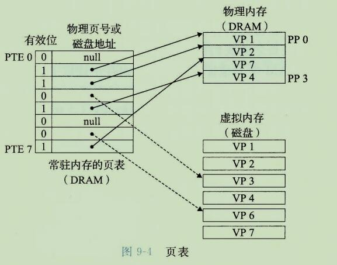


### 3、页命中

```
考虑一下当CPU想要读包含在VP2中的虚拟内存的一个字时会发生什么(图9-5)，VP2被缓存在DRAM中。
使用我们将在9.6节中详细描述的一种技术，地址翻译硬件将虚拟地址作为一个索引来定位 PTE 2，并从内存中读取它。因为设置了有效位，那么地址翻译硬件就知道 VP2 是缓存在内存中的了。
所以它使用 PTE 中的物理内存地址(该地址指向 PP1 中缓存页的起始位置)，构造出这个字的物理地址。
```

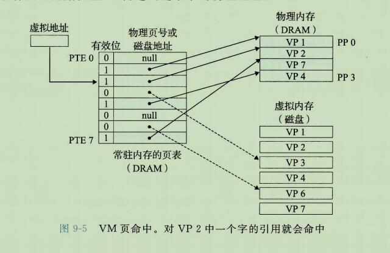


### 4、缺页

```
在虚拟内存的习惯说法中，DRAM缓存不命中称为 缺页(page fault)。
图9-6展示了在缺页之前我们的示例页表的状态。
CPU引用了 VP3 中的一个字，VP3 并未缓存在 DRAM 中。
地址翻译硬件从内存中读取 PTE3, 从有效位推断出  VP3 未被缓存，并且触发一个缺页异常。
```

```
缺页异常调用内核中的缺页异常处理程序，该程序会选择一个牺牲页，在此例中就是存放在 PP3 中的 VP4。
如果VP4 已经被修改了，那么内核就会将它复制会磁盘。
无论哪种情况，内核都会修改 VP4 的页表条目，反映出VP4不再缓存在主存中这一事实。
```

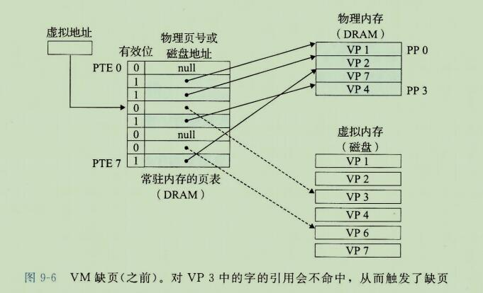

```
接下来，内核从磁盘复制 VP3 到内存中的 PP3，更新PTE3，随后返回。
当异常处理程序返回时，它会重新启动缺页的指令，该指令会把导致缺页的虚拟地址重发送到地址翻译硬件。
但是现在，VP3 已经缓存在主存中了，那么页命中也能由地址翻译硬件正常处理了。

图9-7展示了在缺页之后我们的示例页表的状态。
```

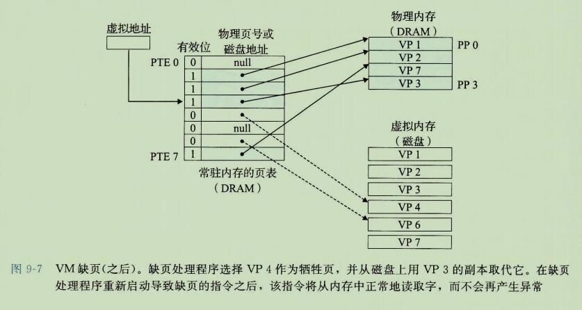


```
虚拟内存是在20世纪60年代早期发明的，远在CPU-内存之间差距的加大引发产生 SRAM 缓存之前。
因此，虚拟内存系统使用了和 SRAM 缓存不同的术语，即使它们的许多概念是相似的。

在虚拟内存的习惯说法中，块被称为页。
在磁盘和内存之间传送页的活动叫做交换(swapping)或者页面调度(paging)。
页从磁盘换入(或者页面调入)DRAM和从DRAM换出(或者页面调出)磁盘。

一直等待，直到最后时刻，也就是当有不命中发生时，才换入页面的这种策略称为 按需页面调度(demand paging)。
也可以采用其他的方法，例如尝试着预测不命中，在页面实际被引用之前就换入页面。
然而，所有现代系统都使用的是按需页面调度的方式。
```


### 5、分配页面

```
图9-8展示了当操作系统分配一个新的虚拟内存页时对我们示例页表的影响，
例如，调用 malloc 的结果。
在这个示例中，VP5的分配过程是在磁盘上创建空间并更新 PTE 5，使它指向磁盘上这个新创建的页面。
```

### 6、又是局部性救了我们

```
当我们中的许多人都了解了虚拟内存之后，我们的第一印象通常是它的效率应该是非常低。
因为不命中的处罚很大，我们担心页面调度会破坏程序性能。
实际上，虚拟内存工作得相当好，这主要归功于我们的老朋友局部性(locality)。

尽管在整个运行过程中程序引用的不同页面的总数可能超出物理内存总的大小，但是局部性原则保证了在任意时刻，程序将趋向于在一个较小的活动页面(active page)集合上工作，整个集合叫做工作集(working set)或者常驻集合(resident set)。

在初始开销，也就是将工作集合页面调度到内存中之后，接下来对这个工作集的引用将导致命中，而不会产生额外的磁盘流量。
```

```
只要我们的程序有好的时间局部性，虚拟内存系统就能工作的相当好。
但是，当然不是所有的程序都能展现良好的事件局部性。
如果工作集的大小超出了物理内存的大小，那么程序将产生一种不幸的状态，叫做抖动(thrashing)，这时页面将不断的换进换出。
虽然虚拟内存通常是有效的，但是如果一个程序性能慢得像爬一样，那么聪明的程序员会考虑是不是发生了抖动。
```

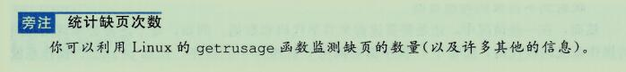


## 4、虚拟内存作为内存管理的工具

```
在上一节中，我们看到虚拟内存是如何提供一种机制，利用 DRAM 缓存来自通常更大的虚拟地址空间的页面。
有趣的是，一些早期的系统，比如 DEC PDP-11/70, 支持的是一个比物理内存更小的虚拟地址空间。
然而，虚拟地址仍然是一个有用的机制，因为它大大地简化了内存管理，并提供了一种自然的保护内存的方法。
```

```
到目前为止，我们都假设有一个单独的页表，将一个虚拟地址空间映射到物理地址空间。
实际上，操作系统为每个进程提供了一个独立的页表，因而也就是一个独立的虚拟地址空间。
图9-9展示了基本思想。
在这个示例中，进程 i 的页表将 VP1 映射到PP2，VP2映射到PP7。
相似的，进程j的页表将VP1映射到PP7。
相似地，进程j的页表将VP2映射到PP10。
注意，多个虚拟页面可以映射到同一个共享物理页面上。
```

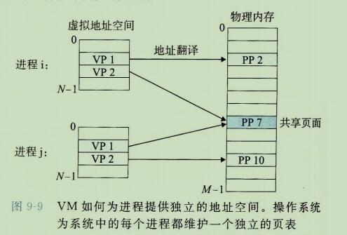

```
按需页面调度和独立的虚拟地址空间的结合，对系统中内存的使用和管理造成了深远的影响。
特别地，VM简化了链接和加载、代码和数据共享，以及应用程序的内存分配。
```

```
简化连接：
	独立的地址空间允许每个进程的内存映射使用相同的基本格式，而不管代码和数据实际存放在物理内存的何处。
	例如，像我们在图8-13中看到的，一个给定的 Linux 系统上的每个进程都使用类似的内存格式。
	对于64位地址空间，代码段总是从虚拟地址 0x400000 开始。
	数据段跟在代码段之后，中间有一段符合要求的对齐空白。
	栈占据用户进程地址空间最高的部分，并向下生长。
	这样的一致性极大地简化了链接器的设计和实现，允许链接器生成完全链接的可执行文件，这些可执行文件是独立于物理内存中代码和数据的最终位置。
```

```
简化加载
	虚拟内存还使得容易想内存中加载可执行文件和共享对象文件。
	要把目标文件中 .text 和 .data 节加载到一个新创建的进程中，Linux 加载器为代码和数据段分配虚拟页，把它们标记为无效的(即未被缓存的)，将页表条目指向目标文件中适当的位置。
	有趣的是，加载器不从磁盘到内存实际复制任何数据。
	在每个页初次被引用时，要么是CPU取指令时引用，要么是一条正在执行的指令应用一个内存位置时引用的，虚拟内存系统会按照需要自动地调入数据页。

将一组连续的虚拟页映射到任意一个文件中的任意位置的表示法称作内存映射(memory mapping)。
Linux 提供一个称为 map 的系统调用，允许应用程序自己做内存映射。
我们会在 9.8 节中更详细地描述应用级内存映射。
```

```
简化共享。
	独立地址空间为操作系统提供了一个管理用户进程和操作系统自身之间共享的一致机制。
	一般而言，每个进程都有自己私有的代码、数据、堆和栈区域，是不和其他进程共享的。在这种情况中，操作系统创建页表，将相应的虚拟页映射到不连续的物理页面。
	
	然而，在一些情况中，还是需要进程来共享代码和数据。
	例如，每个进程必须调用相同的操作系统内核代码，而每个C程序都会调用C标准库中的程序，比如 printf。
	操作系统通过将不同进程中适当的虚拟页面映射到相同的物理页面，从而安排多个进程共享这部分代码的一个副本，而不是在每个进程中都包括单独的内核和C标准库的副本，如图9-9所示。
```

```
简化内存分配。
	虚拟内存为向用户进程提供一个简单的分配额外内存的机制。
	当一个运行在用户进程中的程序要求额外的堆空间时(如调用 malloc 的结果)，操作系统分配一个适当数字(比如 k)个连续的虚拟内存页面，并且将它们映射到物理内存中任意位置的 k 个任意的物理页面。
	由于页表工作的方式，操作系统没有必要分配 k 个连续的物理内存页面。
	页面可以随机的分散在物理内存中。
```

## 5、虚拟内存作为内存保护的工具

```
任何现代计算机系统必须为操作系统提供手段来控制对内存系统的访问。
不应该允许一个用户进程修改它的只读代码段。
而且也不允许它读或修改任何内核中的代码和数据结构。
不应该允许它读或者写其他进程的私有内存，并且不允许它修改任何与其他进程共享的虚拟页面，除非所有的共享者都显式的允许它这么做(通过调用明确的进程间通信系统调用)。
```

```
就像我们所看到的，提供独立的地址空间使得区分不同进程的私有内存变得容易。
但是，地址翻译机制可以以一种自然的方式扩展到提供更好的访问控制。
因为每次CPU生成一个地址时，地址翻译硬件都会读一个 PTE，所以通过PTE上添加一些额外的许可位来控制对一个虚拟页面内存的访问 十分简单。
图9-10展示了大致的思想。
```

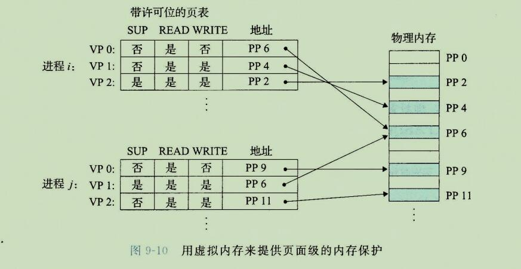

```
在这个示例中，每个PTE中已经添加了三个许可位。
SUP位表示进程是否必须运行在内核(超级用户)模式下才能访问该页。
运行在内核模式中的进程可以访问任何页面，但是运行在用户模式中的进程只允许访问那些 SUP 为0的页面。

READ 位和 WRITE 位控制对页面的读和写访问。
例如，进程i运行在用户模式下，那么它有读VP0和读写VP1的权限。然而它不允许访问VP2。

如果一条指令违反了这些许可条件，那么CPU就触发一个一般保护故障，将控制传递给一个内核中异常处理程序。
Linux shell 一般将这种异常报告为"段错误(segmentation fault)"。
```


## 6、地址翻译

```
这一节讲述的是地址翻译的基础知识。
我们的目标是让你了解硬件在支持虚拟内存中的角色，并给出足够多的细节使得你可以亲手演示一些具体的示例。
不过，要记住我们省略了大量的细节，尤其是和时序相关的细节，虽然这些细节对硬件设计者来说非常重要，但是超出了我们讨论的范围。
图9-11概括了 我们在这节里将要使用的所有符号。
```

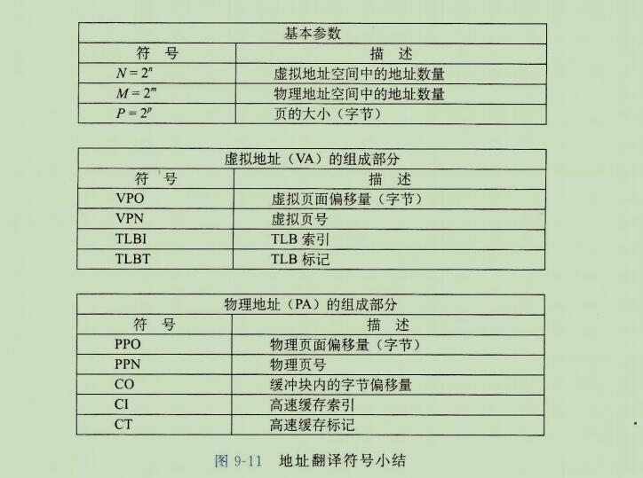


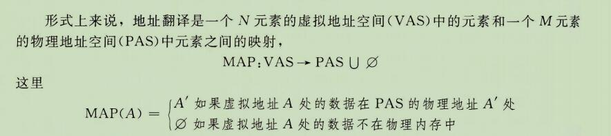


```
图9-12展示了 MMU 如何利用页表来实现这种映射。
CPU中的一个控制寄存器，页表基址寄存器(PageTable Base Register,PTBR)指向当前页表。
n位的虚拟地址包含两部分：
一个p位的虚拟页面偏移(Virtual Page Offset, VPO)和一个(n-p)位的虚拟页号(Virtual Page Number, VPN)。
MMU利用 VPN 来选择适当的 PTE。
例如，VPN 0 选择PTE 0,VPN1 选择 PTE1，以此类推。
将页表条目中物理页号(Physical Page Number,PPN)和虚拟地址中的VPO串联起来，就得到相应的物理地址。
注意，因为物理和虚拟页面都是P字节的，所以物理页面偏移(Physical Page Offset，PPO)和VPO是相同的。
```

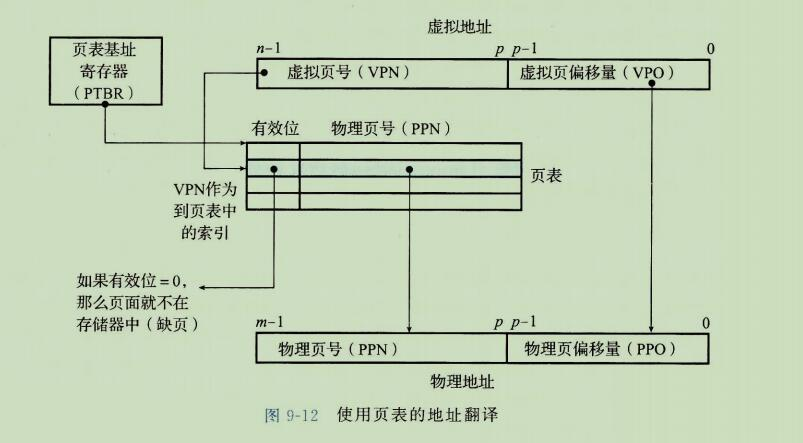

```
图9-13a 展示了当页面命中时，CPU硬件执行的步骤。
第一步：处理器生成一个虚拟地址，并把它传送给 MMU。
第二步：MMU生成PTE地址，并从高速缓存/主存请求得到它。
第三步：高速缓存/主存向MMU返回PTE。
第四步：MMU构造物理地址，并把它传送给高速缓存/主存。
第五步：高速缓存/主存返回所请求的数据字给处理器。
```

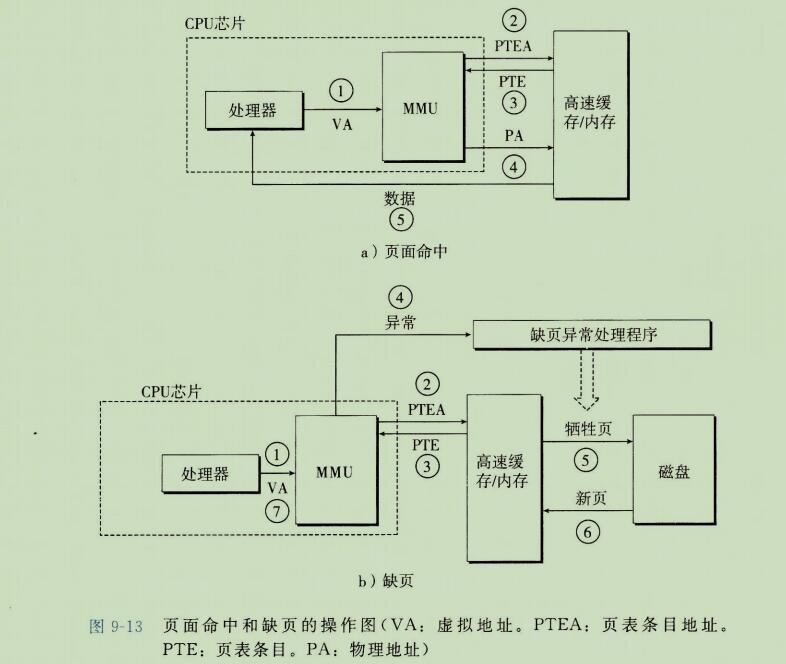


```
页面命中完全是由硬件来处理的，与之不同的是，处理缺页要求硬件和操作系统内核协作完成，如图 9-13b 所示。
第一步和第三步：和图9-13a中的第一步到第三步相同。
第四步：PTE中的有效位是零，所以MMU出发了一次异常，传递CPU中的控制到操作系统内核中缺页异常处理程序。
第五步：缺页处理程序确定出物理内存中的牺牲页，如果这个页面已经被修改了，则把它换出到磁盘。
第六步：缺页处理程序页面调入新的页面，并更新内存中的PTE。

第七步：缺页处理程序返回到原来的进程，再次执行导致缺页的指令。
CPU将引起缺页的虚拟地址重新发送给MMU。
因为虚拟页面现在已经缓存在物理内存中，所以就会命中，在MMU执行了图9-13b中的步骤之后，主存就会将所请求字返回给处理器。
```

### 1、结合高速缓存和 虚拟内存

```
在任何既使用虚拟内存有使用 SRAM 高速缓存的系统中，都有应该使用虚拟地址还是使用物理地址来访问 SRAM 高速缓存的问题。
尽管关于这个折中的详细讨论已经超出了我们的讨论范围，但是大多数系统时选择物理寻址的。
使用物理寻址，多个进程同时在高速缓存中有存储块和共享来自相同虚拟页面的块成为很简单的事情。
而且，高速缓存无需处理保护问题，因为访问权限的检查是地址翻译过程中的一部分。
```

```
9-14展示了一个物理寻址的高速缓存如何和虚拟内存结合起来。
主要的思路是地址翻译发生在高速缓存查找之前。
注意，页表条目可以缓存，就像其他的数据字一样。
```

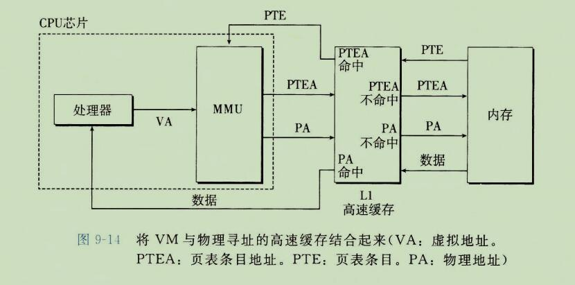


### 2、利用 TLB 加速地址翻译

```
正如我们看到的，每次CPU产生一个虚拟地址，MMU就必须查阅一个PTE，以便将虚拟地址翻译为物理地址。
在最糟糕的情况下，这会要求从内存多取一次数据，代价是几十到几百周期。
如果PTE 碰巧缓存在L1中，那么开销就下降到1个或2个周期。
然而，许多系统都试图取消即使是这样的开销，它们在MMU中包括了一个关于PTE的小的缓存，称为翻译后备缓冲器(Translation Lookaside Buffer,TLB)。
```

```
TLB 是一个小的、虚拟寻址的缓存，其中每一行都保存着一个由单个 PTE 组成的块。
TLB 通常有高度的相联度。
如图 9-15 所示，用于组选择和行匹配的索引和标记字段是从虚拟地址中的虚拟页号中提取出来的。
如果  TLB 有 T=2^t 个组，那么 TLB 索引(TLBI index)是由VPN的 t 个最低位组成的，而 TLB 标记(TLBT tab)是由VPN 中剩余的位组成的。 
就是高速缓存的 组相联 全相联 直接关联 啥的规则     标记位 组 偏移量
```

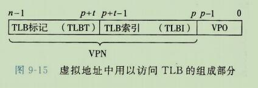


```
图9-16a 展示了当TLB命中时(通常情况)所包括的步骤。
这里的关键点是，所有的地址翻译步骤都是在芯片上的 MMU 中执行的，因此非常快。
```

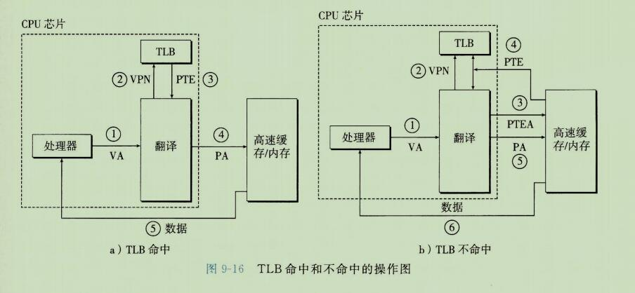

```
第一步：CPU产生一个虚拟地址
第二步和第三步：MMU从TLB中取出相应的PTE。
第四步：MMU将这个虚拟地址翻译成一个物理地址，并且将它发送到高速缓存/主存。
第五步：高速缓存/主存将所请求的数据字返回给CPU。

当TLB不命中时，MMU必须从L1缓存中取出相应的PTE，如图 9-16b所示。
新取出的 PTE 存放在 TLB 中，可能会覆盖一个已经存在的条目。
```


### 3、多级页表

```
到目前为止，我们一直假设系统只用一个单独的页表来进行地址翻译。
但是如果我们有一个32位的地址空间、4KB的页面和一个4字节的PTE，那么即使应用所引用的只是虚拟地址空间中很小的一部分，也总是需要一个 4MB 的页表驻留在内存中。
对于地址空间为64位的系统来说，问题将变得更复杂。
```

```
用来压缩页表的常用方法是使用层次结构的页表。用一个具体的示例是最容易理解这个思想的。
假设32位虚拟地址空间被分为4kb的页，而每个页表条目都是4字节。
还假设在这一时刻，虚拟地址空间有如下形式：
	内存的前2K个页面分配给了代码和数据，接下来的6K个页面还未分配，再接下来的1023个页面也未分配，接下来的1个页面分配给了用户栈。(这里的 K 指的是数量的单位  2K = 2*1024个页面)。
	
	图9-17展示了我们如何为这个虚拟地址空间构造一个两级的页表层次结构。
```

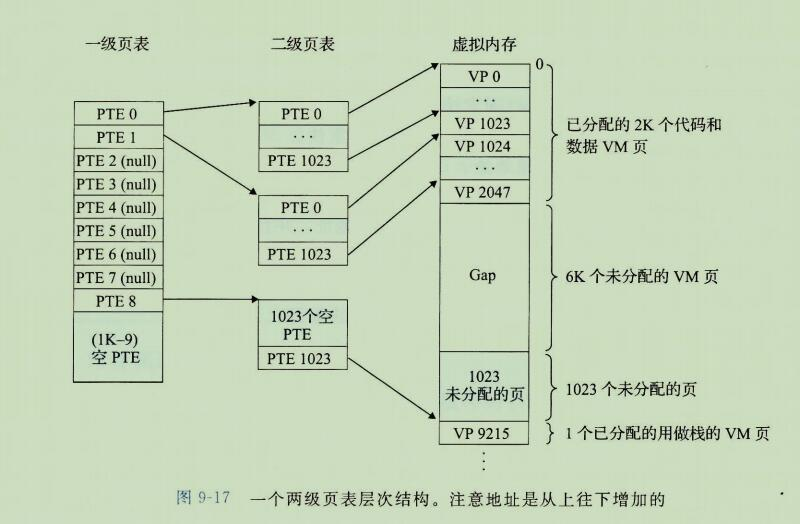

```
一级页表中的每个 PTE 负责映射虚拟地址空间中一个 4MB的片(chunk)，这里每个片都是由1024个连续的页面组成的。
比如，PTE0映射第一片，PTE1映射接下来的一片，以此类推。
假设地址空间是4GB，1024个PTE已经足够覆盖整个空间了。

如果片 i 中的每个页面都未被分配，那么一级PTE i 就为空。
例如，图9-17中，片2~7是未被分配的。
然而，如果在片 i 中至少有一个页时分配了的，那么一级PTE i 就指向一个二级页表的基址。
例如，在图 9-17中，片 0、1和8的所有或者部分已被分配，所以它们的一级PTE就指向二级页表。
```

```
二级页表中的每个PTE都负责映射一个 4KB 的虚拟内存页面，就像我们查看只有一级的页表一样。
注意，使用4字节的PTE，每个一级和二级页表都是4KB字节，这刚好和一个页面的大小是一样的。
```

```
这种方法从两个方面减少了内存要求。
第一，如果一级页表中的一个PTE是空的，那么相应的二级页表就根本不会存在。
这代表着一种巨大的潜在节约，因为对于一个典型的程序，4GB的虚拟地址空间的大部分都会是未分配的。
第二，只有一级页表才需要总是在主存中;虚拟内存系统可以在需要时创建、页面调入或调出 二级页表，这就减少了主存的压力;
只有最经常使用的二级页表才需要缓存在主存中。
```

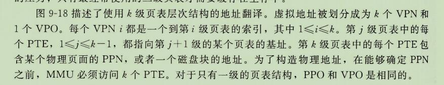

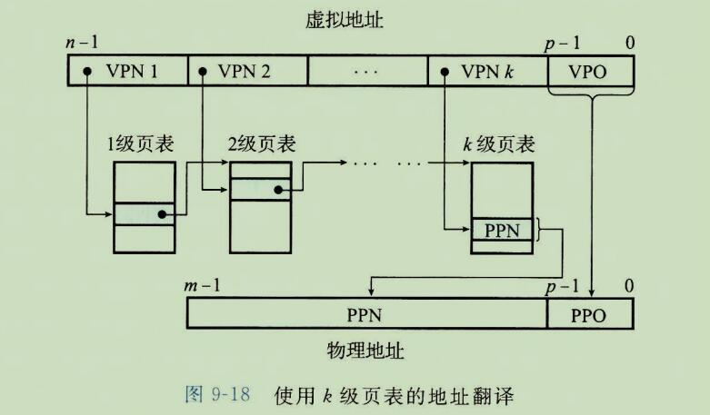

```
访问 k 个 PTE，第一眼看上去昂贵而不切实际。
然而，这里 TLB 能够起作用，正是通过将不同层次上页表的 PTE 缓存起来。
实际上，带多级页表的地址翻译并不比单级页表慢的多。
```


### 4、综合：端到端的地址翻译

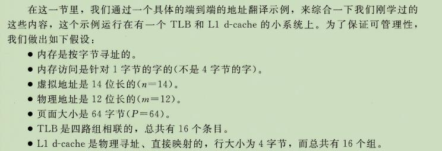

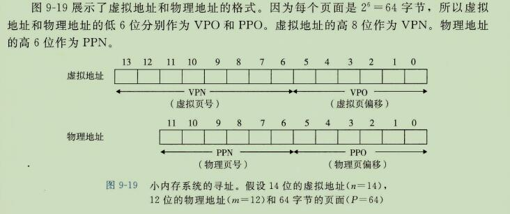

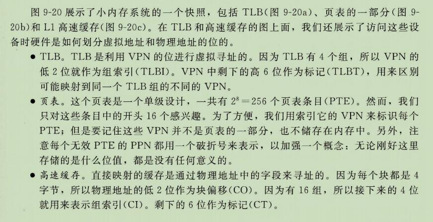

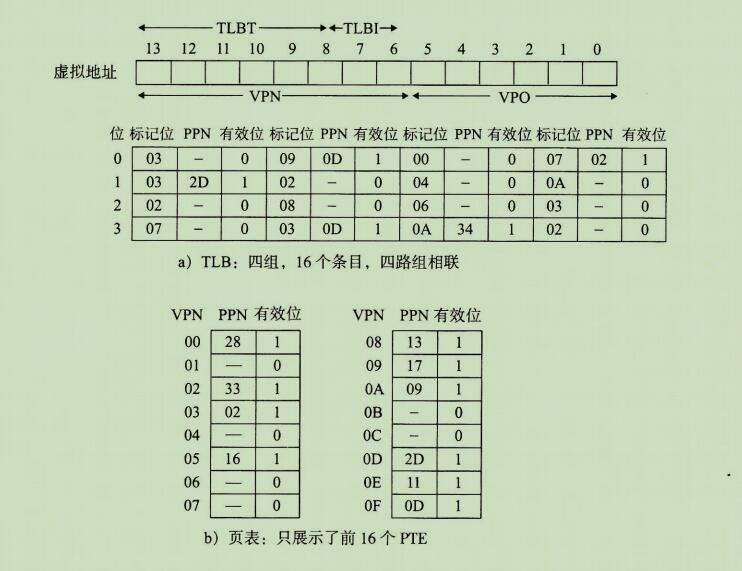

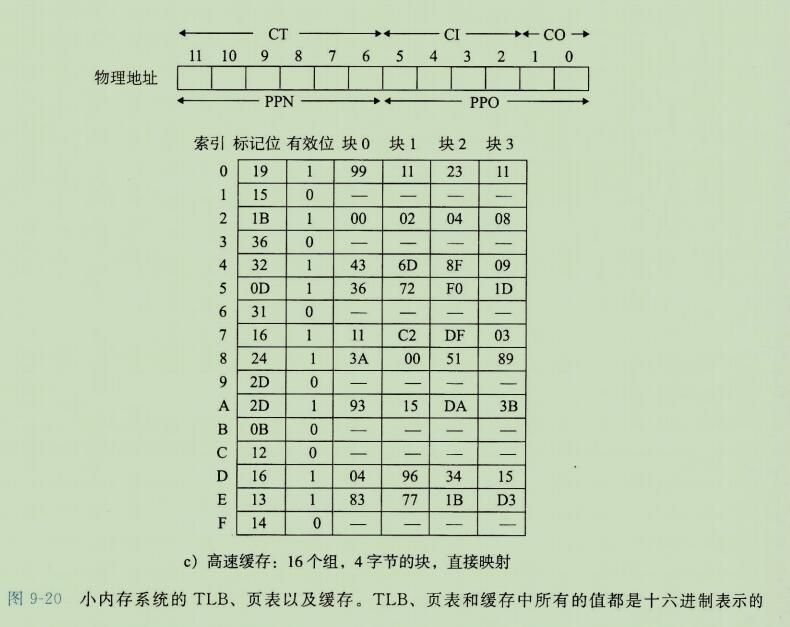

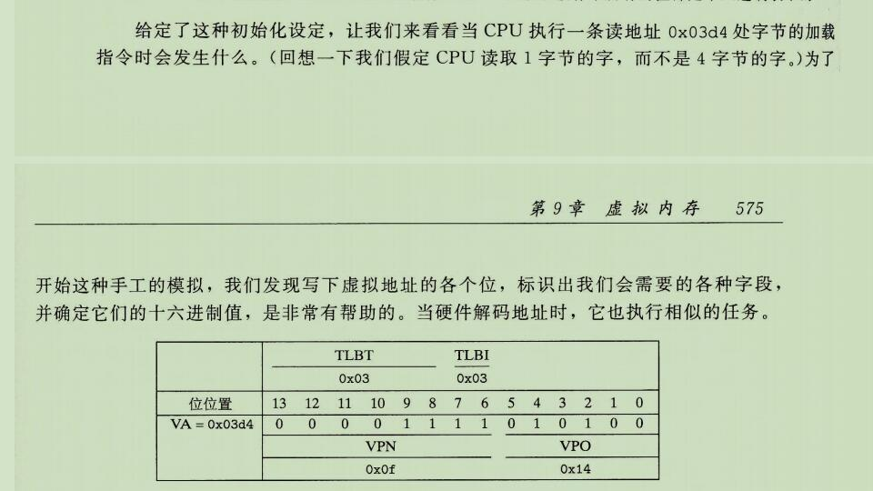

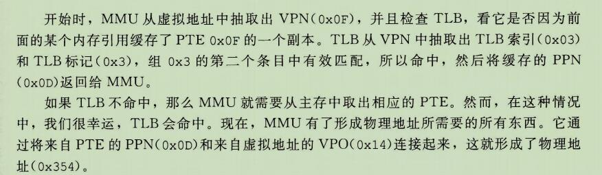

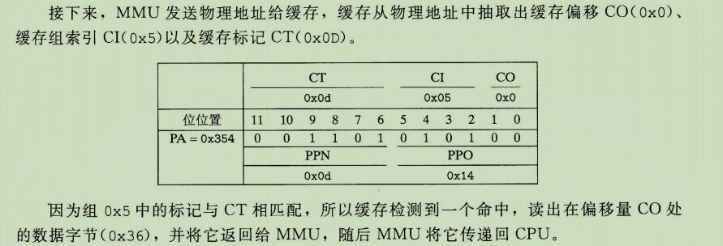


## 7、Core i7地址翻译

```
我们以一个
```


```
图9-22总结了完成的 Core i7地址翻译过程，从 cpu 产生虚拟地址的时刻 一直到来自内存的数据字到达  CPU。
Core i7 采用四级页表层次结构。
每个进程有它自己私有的页表层次结构。
当一个 Linux 进程在运行时，虽然 Core i7 体系结构允许页表换进换出，但是与已分配了的页相关联的页表都是驻留在内存中的。

CR3 控制器指向第一级页表(L1)的起始位置。
CR3 的值
```


