## 8、内存映射

### 12、综合：实现一个简单的分配器

```
构造一个分配器是一件富有挑战性的任务。
设计空间很大，有多种块格式、空闲链表格式，以及放置、分割和合并策略可供选择。

另一个挑战就是你经常被迫在类型系统的安全和熟悉的限定之外编程，依赖于容易出错的指针强制类型转换的指针运算，这些操作都属于典型的底层系统编码。
```


#### 1、通用分配器设计

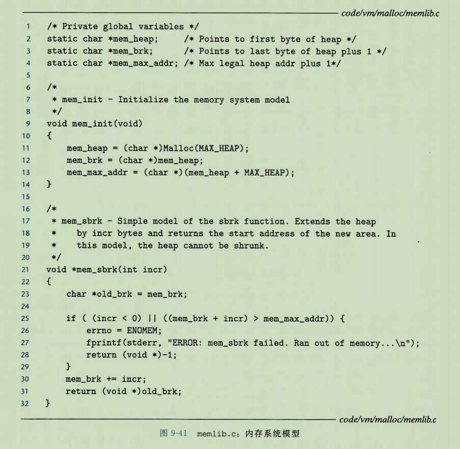

```
我们的分配器使用如图9-41所示的 memlib.c 包所提供的的一个内存系统模型。模型的目的在于允许 我们在不干涉已存在的系统层 malloc 包的情况下，运行分配器。
```

```
mem_init 函数将对于堆来说可用的虚拟内存模型化为一个大的、双字对齐的字节数组。
在mem_heap和mem_brk 之间的字节表示已分配的虚拟内存。
mem_brk 之后的字节表示未分配的虚拟内存。
分配器通过调用 mem_sbrk 函数来请求额外的堆内存，这个函数和系统的 sbrk 函数的接口相同，而且语义也相同，除了它会拒绝收缩堆的请求。
```


```
mm_init 函数初始化分配器，如果成功就返回0，否则就返回 -1。
mm_malloc 和 mm_free 函数与它们对应的系统函数有相同的接口和语义。
分配器使用如图 9-39所示的块格式。
最小块的大小为 16 字节。
空闲链表组织成为一个隐式空闲链表，具有如图 9-42所示的恒定形式。
```

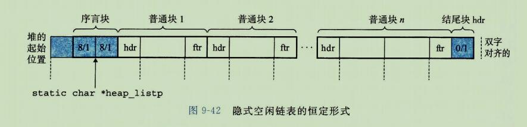

```
第一个字是一个双字边界对齐的不使用的填充字。
填充后面紧跟着一个特殊的序言块(prologue block),
这是一个8字节的已分配块，只由一个头部和一个脚部组成。
序言块是在初始化时创建的，并且永不释放。
在序言块后紧跟着零个或者多个由 malloc 或者 free 调用创建的普通块。
堆总是以一个特殊的结尾块(epilogue block)来结束，这个块是一个大小为零的已分配块，只由一个头部组成。

序言块和结尾块是一种消除合并时边界的条件的技巧。
分配器使用一个单独的私有(static)全局变量(heap_listp),它总是指向序言块。(作为一个小优化，我们可以让它指向下一个块，而不是整个序言块。)
```


#### 2、操作空闲链表的基本常数和宏

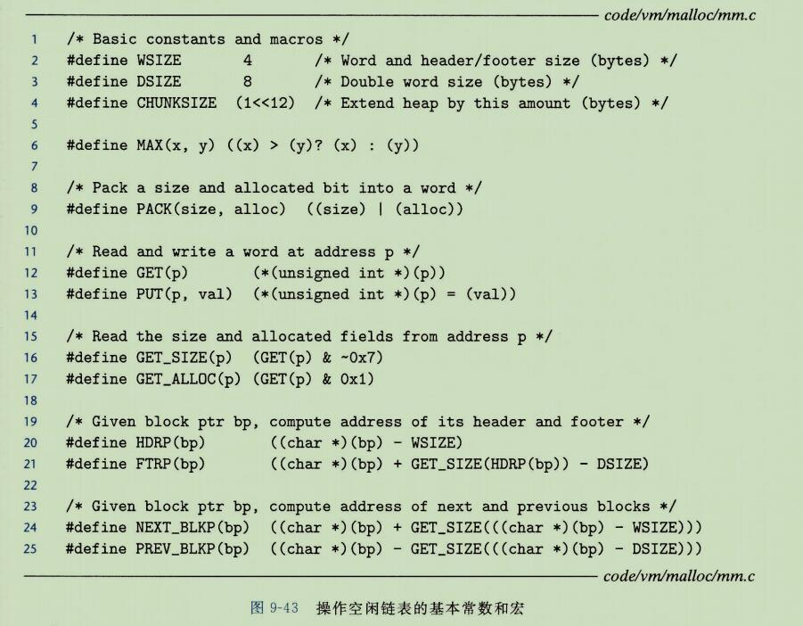


#### 3、创建初始化空闲链表

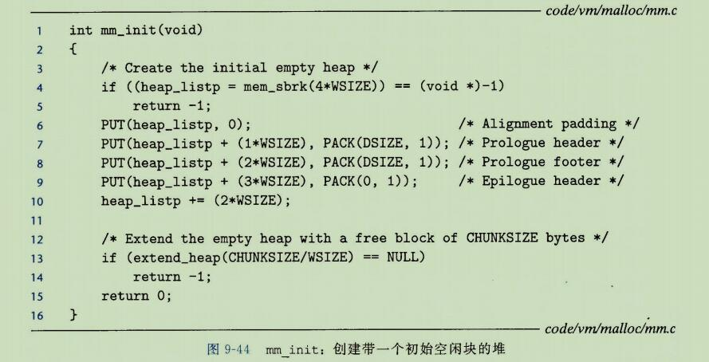

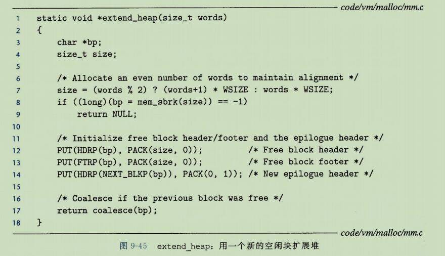

```
在调用 mm_malloc 或者 mm_free 之前，应用必须调用 mm_init 函数来初始化堆(见图9-44)。 
```

```
mm_init 函数从内存系统得到4个字，并将它们初始化，创建一个空的空闲链表(第4~10行)。
然后它调用 extendheap 函数(图9-45)，这个函数将堆扩展 CHUNKSIZE 字节，并且创建初始的空闲块。
此刻分配器已经初始化了，并且准备好接收来自应用的分配和释放请求。
```

```
extend_heap 函数会在两种不同的环境中被调用：
1、当堆被初始化时;
2、当mm_malloc 不能找到一个合适的匹配块时。
为了保持对齐，extend_heap 将请求大小向上舍入为最接近的2字(8字节)的倍数，然后向内存系统请求额外的堆空间(请求7~9行)。
```

```
extend_heap 函数的剩余部分(第12~17行)有点儿微妙。
堆开始于一个双字对齐的边界，并且每次对 extend_heap 地调用都返回一个块，该块的大小时双字的整数倍。
因此，对 mem_sbrk 的每次调用都返回一个双字对齐的内存片，紧跟在结尾块的头部后面。
这个头部变成了新的空闲块的头部(第12行)，并且这个片的最后一个字变成了新的结尾块的头部(第14行)。
最后，在很有可能出现的前一个堆以一个空闲块结束的情况下中，我们调用 coalesce 函数来合并两个空闲块，并返回指向合并后的块的块指针(第17行)。
```


#### 4、释放和合并块

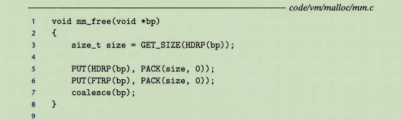

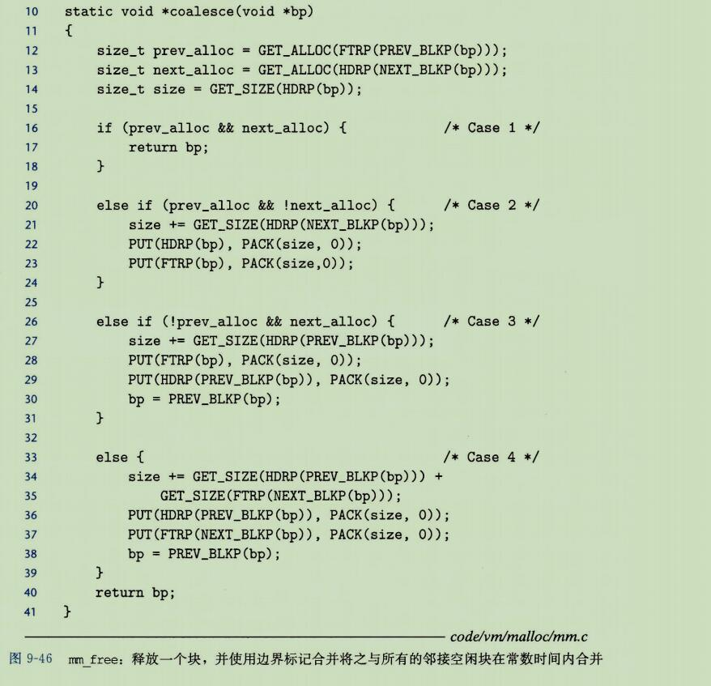

```
应用通过调用 mm_free 函数(图9-46)来释放一个以前分配的块，这个函数释放所请求的块(bp),然后使用 9.9.11 节中描述的边界标记合并技术将之与邻接的空闲块合并起来。
```

```
coalesce 函数中的代码是图9-40中勾画的四种情况的一种简单的实现。
这里有一个微妙的方面。
我们选择的空闲链表格式(它的序言块和结尾块总是标记为已分配)允许我们忽略潜在的麻烦边界情况，也就是，请求块bp 在堆的起始处或者是在堆的结尾处。
如果没有这些特殊块，代码将换乱的多，更加容易出错，并且更慢，因为我们不得不在每次释放请求时，都去检查这些并不常见的边界情况。
```

#### 5、分配块

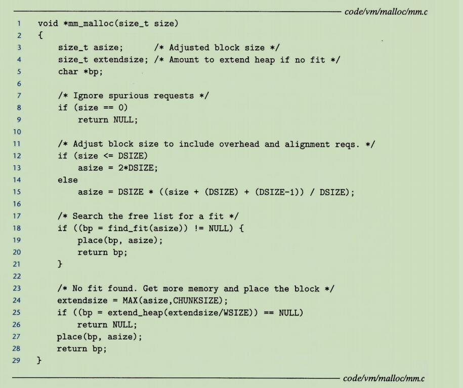

```
一旦分配器调整了请求的大小，它就会搜索空闲链表，寻找一个合适的空闲块(第18行)。
如果有合适的，那么分配器就放置这个请求块，并可选的分割出多余的部分(第19行)，然后返回新分配的地址。
```

```
如果分配器不能够发现一个匹配的块，那么就用一个空闲块来扩展堆(第24-26行)，把请求块放置在这个新的空闲块里，可选的分割这个块(第27行)，然后返回一个指针，指向这个新分配的块。
```


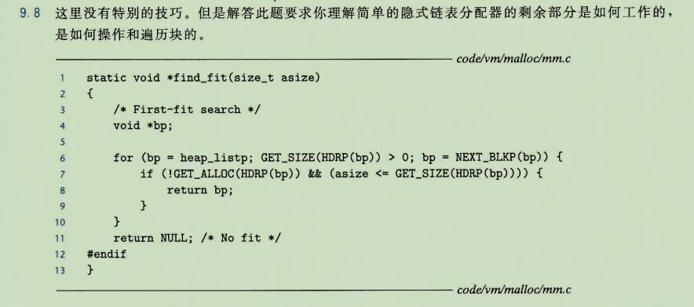

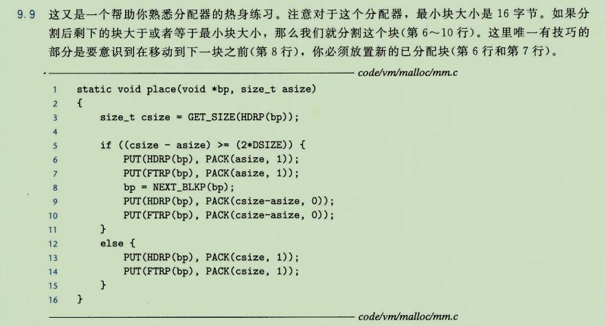


### 13、显式空闲链表

```
隐式空闲链表为我们提供了一种介绍一些基本分配器概念的简单方法。
然而，因为块分配与堆块的总数呈线性关系，所以对于通用的分配器，隐式空闲链表是不适合的(尽管对于堆块数量预先就知道是很小的特殊的分配器来说它是可以的)。
```

```
一种更好的的方法是将空闲块组织为某种形式的显示数据结构。
因为根据定义，程序不需要一个空闲块的主体，所以实现这个数据结构的指针可以存放在这些空闲块的主体里面。

例如，堆可以组织成一个双向空闲的列表，在每个空间块中，都包含一个pred(前驱)和succ(后继)指针，如图9-48所示。
```

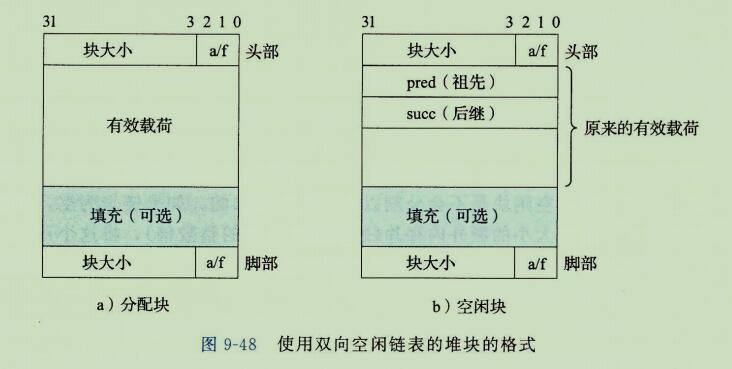

```
使用双向链表而不是隐式空闲链表，使首次适配的分配时间从块总数的线性时间减少到了空闲块数量的线性时间。
不过，释放一个块的时间可以是线性的，也可能是个常数，这取决于我们所选择的空闲链表中块的排序策略。
```

```
一种方法是用后进先出(LIFO)的顺序维护链表，将新释放的块放置在链表的开始处。
使用LIFO的顺序和首次适配的放置策略，分配器会最先检查最近使用过的块。
在这种情况下，释放一个块可以在常数时间内完成。
如果使用了边界标记，那么合并也可以在常数时间内完成。
```

```
另一种方法是按照地址顺序来维护链表，其中链表中每个块的地址都小于它后继的地址。
在这种情况下，释放一个块需要线性时间的搜索来定位合适的前驱。
平衡点在于，按照地址排序的首次适配比LIFO排序的首次适配有更高的内存利用率，接近最佳适配的利用率。
```

```
一般而言，显示链表的缺点是空闲块必须足够大，以包含所有需要的指针，以及头部和可能的脚部。
这就导致了更大的最小块大小，也潜在的提高了内部碎片的程度。
```


### 14、分离的空闲链表

```
就像我们已经看到的，一个使用单向空闲块链表的分配器与空闲块数量呈线性关系的时间来分配块。
一种流行的减少分配时间的方法，通常称为分离存储(segregated storage), 就是维护多个空闲链表，其中每个链表中的块有大致相等的大小。
一般的思路是将所有可能的块大小分成一些等价类，也叫做大小类(size class)。
有很多方式来定义大小类。
例如，我们可以根据2的幂来划分块大小：
```


```
分配器维护着一个空闲链表数组，每个大小类一个空闲链表，按照大小的升序排列。
当分配器需要一个大小为 n 的块时，它就搜索相应的空闲链表。
如果不能找到合适的块与之匹配，它就搜索下一个链表，以此类推。
```

```
有关动态内存分配的文献描述了几十种分离存储方法，主要的区别在于
它们如何定义大小类，
何时进行合并，
何时向操作系统请求额外的堆内存，
是否允许分割，
等等。

为了使你大致了解有哪些可能性，我们会描述两种基本的方法：
简单分离存储(simple segergated) 和分离适配(segregated fit)。
```


#### 1、简单分离存储

```
使用简单分离存储，每个大小类的空闲链表包含大小相等的块，每个块的大小就是这个大小类中最大元素的大小。

例如，如果某个大小类定义为{17~32}，那么这个类的空闲链表全由大小为32的块组成。
```

```
为了分配一个给定的块，我们检查相应的空闲链表。
如果链表非空，我们简单的分配其中第一块的全部。
空闲块是不会分割以满足分配请求的。
如果链表为空，分配器就向操作系统请求一个固定大小的额外内存片(通常是页大小的整数倍)，将这个片分成大小相等的块，并将这些块连接起来形成新的空闲链表。
要释放一个块，分配器只要简单的将这个块插入到相应的空闲链表的前部。
```

```
这种简单的方法有许多的优点。
分配和释放快都是很快的常数时间操作。
而且，每个片中都是大小相等的块，不分割，不合并，这意味着每个块只有很少的内存开销。
由于每个片只有大小相同的块，那么一个已分配块的大小就可以从它的地址中推断出来。(怎么推断？ 在大小类是连续的虚拟内存的前提下，大小类里面记录着内存片的起始和结束地址？)
因为没有合并，所以已分配块的头部就不需要一个已分配/空闲标记。
因此已分配块不需要头部，同时因为没有合并，它们也不需要脚部。
因为分配和释放操作都是在空闲链表的起始处操作，所以链表只需要是单向的，而不用是双向的。
关键点在于，在任何块中都需要的唯一字段是每个空闲块中的一个字的 succ 指针，因此最小块大小就是一个字。
```

```
一个显著的缺点是，简单分离存储很容易造成内部和外部碎片。
因为空闲块是不会被分割的，所以可能会造成内部碎片。
更糟的是，因为不会合并空闲块，所以某些引用模式会引起极多的外部碎片。
```


#### 2、分离适配

```
使用这种方法，分配器维护着一个空闲链表的数组。
每个空闲链表是和一个大小类相关联的，并且被组织成某种类型的显式或隐式链表。
每个链表包含潜在的大小不同的块，这些块的大小是大小类的成员。
有多种不同的分离适配分配器。
这里，我们描述了一种简单的版本。
```

```
为了分配一个块，必须确定请求的大小类，并且对适当的空闲链表做首次适配，查找一个合适的块。
如果找到了一个，那么就(可选的)分割它，并将剩余的部分插入到适当的空闲链表中。
如果找不到合适的块，那么就搜索下一个更大的大小类的空闲链表。
如此重复，直到找到一个合适的块。
为什么会找不到(? 可能这个大小类只是规定了可以存储 最小4字节最大40字节的块，但是现有的块可能只有20字节。然后我们要申请的内存可能是30字节)。

如果空闲链表中没有合适的块，那么就向操作系统请求额外的堆内存，从这个新的堆内存中分配出一个块，将剩余部分放置在适当的大小类中。
要释放一个块，我们执行合并，并将结果放置到相应的空闲链表中。
```

```
分离适配方法是一种常见的选择，C标准库中提供的GUN malloc 包就是采用的这种方法，因为这种方法及快速，堆内存的使用也很有效率。
搜索时间减少了，因为搜索被限制在堆的某个部分，而不是整个堆。
内存利用率得到了改善，因为有一个有趣的事实：
对分离空闲链表的简单的首次适配搜索，其内存利用率近似于对整个堆的最佳适配搜索的内存利用率。
```

#### 3、伙伴系统

```
伙伴系统(buddy system)是分离适配的一种特例，其中每个大小类都是 2 的幂。
基本的思路是假设一个堆的大小为 2^m 个字，我们为每个块大小 2^k 维护一个分离空闲链表，其中 0 <= k <= m。
请求块大小向上舍入到最接近的2的幂。
最开始时，只有一个大小为 2^m 个字的空闲块。
也就是说最开始只有一个堆大小的空闲块。
```

```
为了分配一个大小为 2^k 的块，我们找到第一个可用的、大小为 2^j 的块，其中 k<=j<=m。
如果 j=k,那么我们就完成了。
(为什么 j=k 一定成立？因为 j 是2的n次方， k 也是2的n次方，k不断的二分，总会等于 j 的。 这就相当于 k 不断的吧次方-1 ，直到k的次方==j的次方。)

否则，我们递归地二分割这个块，直到 j = k。
当我们进行这样的分割时，每个剩下的半块(也叫做伙伴)被放置在相应的空闲链表中。
要释放一个大小为 2^k 的块，我们继续合并空闲的伙伴。
当遇到一个已分配的伙伴时，我们就停止合并。
```


```
伙伴系统分配器的主要优点是它的快速搜索和快速合并。
主要缺点是要求块大小为2的幂可能导致显著的内存碎片。
因此，伙伴系统分配器不适用通用目的的工作负载。
然而，对于某些特定应用的工作负载，其中块大小预先知道是2的幂，伙伴系统分配器就很有吸引力了。
```

```
判断一个存储块的伙伴的位置时，采用的方法为：如果该存储块的起始地址为 p，大小为 2^k，则其伙伴所在的起始地址为：
```


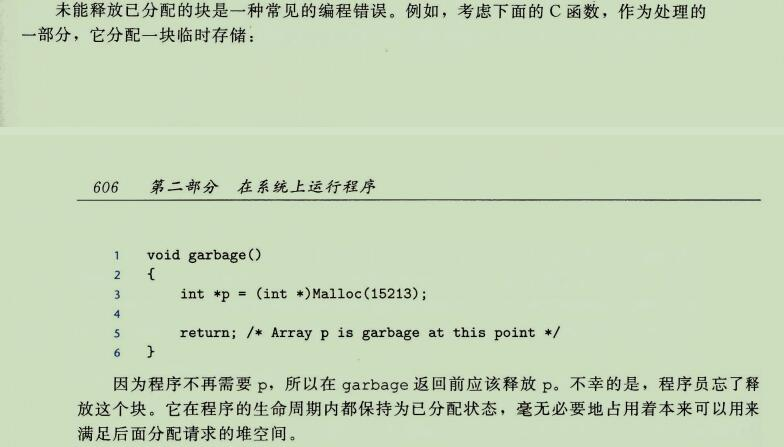

[伙伴系统详解](https://www.jianshu.com/p/c791c9581ccd)

```
判断伙伴的位置：
p 是当前块的起始位置(头部位置)
k 是当前块的大小 2^k
```


