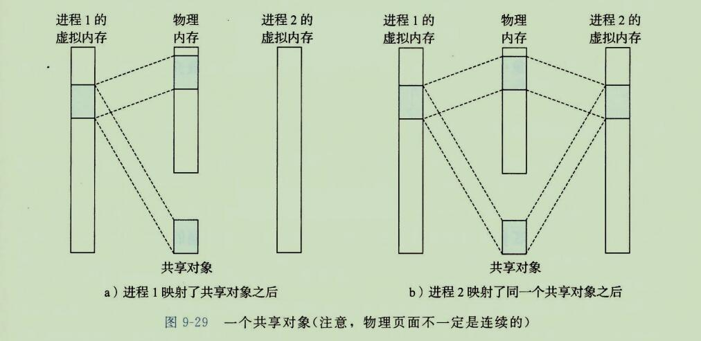
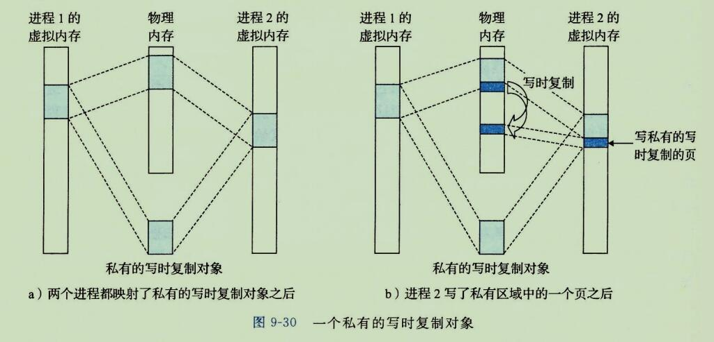
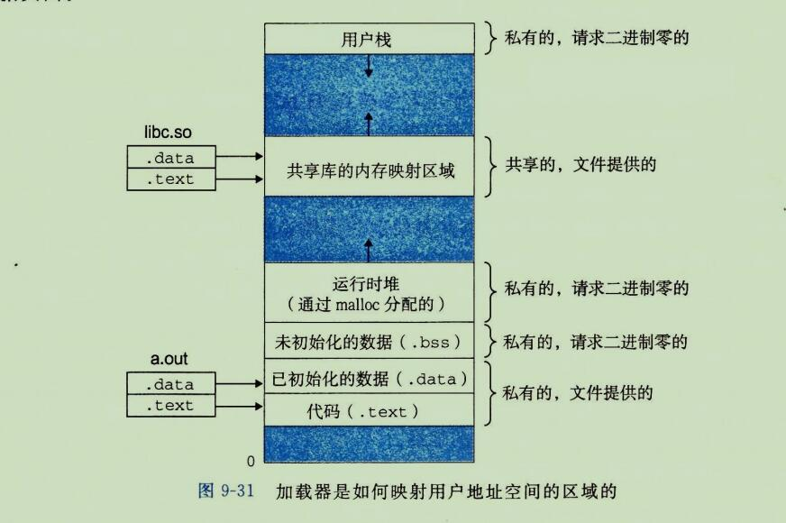
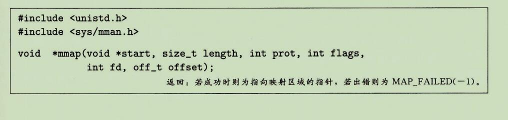
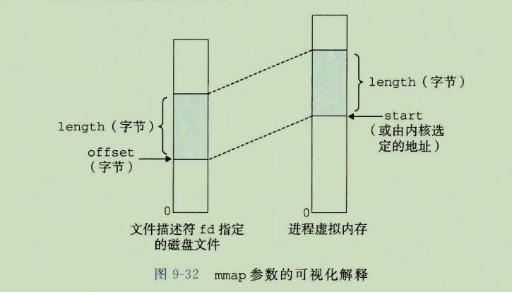
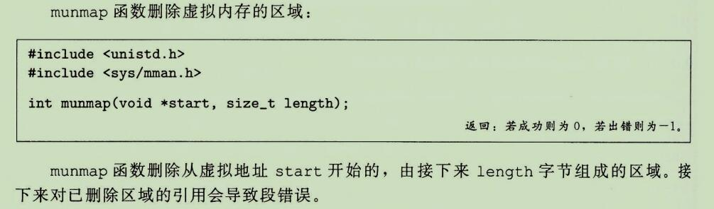

## 8、内存映射

```
需要说明一点，并不是所有物理内存中交换出来的数据都会被放到 Swap 中(如果这样的话，Swap 就会不堪重负)，有相当一部分数据被直接交换到文件系统。
例如，有的程序会打开一些文件，对文件进行读写(其实每个程序都至少要打开一个文件，那就是运行程序本身)，当需要将这些程序的内存空间交换出去时，就没有必要将文件部分的数据放到 swap 空间中了，而可以直接将其放到文件里去。
如果是读文件操作，那么内存数据被直接释放，不需要交换出来，因为下次需要时，可直接从文件系统恢复;
如果是写文件，只需要将变化的数据保存到文件中，以便恢复。
但是那些用 malloc 和 new 函数生成的对象的数据则不同，它们需要 swap 空间，因为它们在文件系统中没有相应的"储备"文件，因此被称作"匿名"(Anonymous)内存数据。
这类数据还包括堆栈中的一些状态和变量数据等。
所以说,Swap 空间是"匿名"数据的交换空间。
```


```
Linux 通过将一个虚拟内存区域与一个磁盘上的对象(object)关联起来，以初始化这个虚拟内存区域的内容，这个过程称为内存映射(memory mapping)。
虚拟内存区域可以映射到两种类型的对象中的一种：
```

```
1、Linux 文件系统中的普通文件：
一个区域可以映射到一个普通文件的连续部分，例如一个可执行文件。
文件区(section)被分为页大小的片，每一片包含一个虚拟页面的初始内容。
因为按需进行页面调度，所以这些虚拟页面没有实际交换进入物理内存，直到CPU第一次引用到页面(即发射一个虚拟地址，落在地址空间这个页面的范围之内)。
如果区域比文件区要大，那么就用零来填充这个区域的余下部分。
```

```
2、匿名文件：
一个区域也可以映射到一个匿名文件，匿名文件是由内核创建的，包含的全是二进制零。
CPU第一次引用这样一个区域内的虚拟页面时，内核就在物理内存中找到一个合适的牺牲页面，如果该页面被修改过，就将这个页面换出来，用二进制零覆盖牺牲页面并更新页表，将这个页面标记为是驻留在内存中的。
注意在磁盘和内存之间并没有实际的数据传送。
因为这个原因，映射到匿名文件的区域中的页面有时也叫做请求二进制零的页(demand-zero page)。
```

```
无论在哪种情况中，一旦一个虚拟页面被初始化了，它就在一个由内核维护的专门的交换文件(swap file)之间换来换去。
交换文件也叫做交换空间(swap space)或者交换区域(swap area)。
需要意识到很重要的一点是，在任何时刻，交换空间都限制着当前运行着的进程能够分配的虚拟页面的总数。
```


### 1、再看共享对象

```
内存映射的概念来源于一个聪明的发现：如果虚拟内存系统可以集成到传统的文件系统中，那么就能提供一种简单而高效的把程序和数据加载到内存中的方法。
```

````
正如我们已经看到的，进程这一抽象能够为每个进程提供自己私有的虚拟地址空间，可以免受其他进程的错误读写。
不过，许多进程有同样的只读代码区域。
例如，每个运行 Linux shell 程序 bash 的进程有相同的代码区域。
而且，许多程序需要访问只读运行时库代码的相同副本。
例如，每个C程序都需要来自标准C库的诸如printf 这样的函数。
那么，如果每个进程都在物理内存中保持这些常用代码的副本，那就是极端的浪费了。
幸运的是，内存映射给我们提供了一种清晰的机制，用来控制多个进程如何共享对象。
````

```
一个对象可以被映射到虚拟内存的一个区域，要么作为共享对象，要么作为私有对象。
如果一个进程将一个共享对象映射到它的虚拟地址空间的一个区域内，那么这个进程对这个区域的任何写操作，对于那些也把这个共享对象映射到它们虚拟内存的其他进程而言，也是可见的。
而且，这些变化也会反应在磁盘上的原始对象中。
```

```
另一方面，对于一个映射到私有对象区域做的改变，对于其他进程来说是不可见的，并且进程对这个区域所做的任何写操作都不会反映在磁盘的对象中。一个映射到共享对象的虚拟内存区域叫做共享区域。
类似地，也有私有区域。
```

```
假设进程1将一个共享对象映射到它的虚拟内存的一个区域中，如图9-29a所示。
现在假设进程2将同一个共享对象映射到它的地址空间(并不一定要和进程1相同的虚拟地址处，如图 9-29b所示)。
```



```
因为每个对象都有一个唯一的文件名，内核可以迅速的判定进程1已经映射了这个对象，而且可以使进程2中的页表条目指向相应的物理页面。
关键点在于即使对象被映射到了多个共享区域，物理内存也只需要存放共享对象的一个副本。
为了方便，我们将物理页面显示为连续的，但是在一般情况下当然不是这样的。
```

```
私有对象使用一种叫做写时复制(copy-on-write)的巧妙技术被映射到虚拟内存中。
一个私有对象开始生命周期的方式基本上与共享对象的一样，在物理内存中只保存有私有对象的一份副本。
比如，图9-30a展示了一种情况，其中两个进程将一个私有对象映射到它们虚拟内存的不同区域，但是共享这个对象同一个物理副本。
对于每个映射私有对象的进程，相应私有区域的页表条目都被标记为只读，并且区域结构被标记为私有的写时复制。
只要没有进程试图写它自己的私有区域，它们就可以继续共享物理内存中对象的一个单独副本。
然而，只要有一个进程试图写私有区域内的某个页面，那么这个写操作就会触发一个保护故障。
```

```
当故障处理程序注意到保护异常是由于进程试图写私有的写时复制区域中的一个页面而引起的，它就会在物理内存中创建这个页面的一个新副本，更新页表条目指向这个新的副本，然后恢复这个页面的可写权限，如图9-30b 所示。
当故障处理程序返回时，CPU重新执行这个写操作，现在在新创建的页面上这个写操作就可以正常执行了。
```



```
通过延迟私有对象中的副本直到最后可能的时刻，写时复制最充分地使用了稀有的物理内存。
```

### 2、再看  fork 函数

```
既然我们理解了虚拟内存和内存映射，那么我们可以清晰的直到 fork 函数是如何创建一个带有自己独立虚拟地址空间的新进程的。
```

```
当fork 函数被当前进程调用时，内核为新进程创建各种数据结构，并分配给它一个唯一的 PID。
为了给这个新进程创建虚拟内存，它创建了当前进程的 mm_struct、区域结构和页表的远样副本。
它将两个进程中的每个页面都标记为只读，并将两个进程中的每个区域结构都标记为私有的写时复制。
```

```
当 fork 在新进程中返回时，新进程现在的虚拟内存刚好和调用 fork 时存在的虚拟内存相同。
当这两个进程中的任一个后来进行写操作时，写时复制机制就会创建新页面，因此，也就为每个进程保持了私有地址空间的抽象概念。

至于原有的对象什么时候会消失，应该有个引用数啥的吧，引用数为0 就直接消失啥的。这个应该是由虚拟内存维护的。
```

### 3、再看 execve 函数

```
虚拟内存和内存映射在将程序加载到内存的过程中也扮演着关键的角色。
既然已经理解了这些概念，我们就能理解 execve 函数实际上是如何加载和执行程序的。
假设运行在当前进程中的程序执行了如下的 execve 调用：
execve("a.out",NULL,NULL);

正如在第8章中学到的，execve 函数在当前进程中加载并运行可执行目标文件 a.out 中的程序，用 a.out 程序有效的替代当前程序。
加载并运行 a.out 需要以下几个步骤：
```

```
删除已存在的用户区域。
删除当前进程虚拟地址的用户部分中的已存在的区域结构。
```

```
映射私有区域。
为新程序的代码、数据、bss和栈区域创建新的区域结构。
所有这些新的区域都是私有的、写时复制的。
代码和数据区域被映射为 a.out 文件中的 .text和 .data 区。
bss区域是请求二进制零的，映射到匿名文件，其大小包含在 a.out 中。
栈和堆区域也是请求二进制零的，初始长度为零。
图9-31概括了私有区域的不同映射。
```

```
映射共享区域。
如果 a.out 程序与共享对象(或目标)链接，比如标准C库 libc.so，那么这些对象都是动态链接到这个程序的，然后再映射到用户虚拟地址空间中的共享区域内。
```

```
设置程序计数器(PC)。
execve 做的最后一件事情就是设置当前进程上下文中的程序计数器，使之指向代码区域的入口点。
```

```
下一次调度这个进程时，它就从这个入口点开始执行。
Linux 将根据需要换入代码和数据页面。
```




### 4、使用mmap函数的用户级内存映射

```
Linux 进程可以使用 mmap 函数来创建新的虚拟内存区域，并将对象映射到这些区域中。
```



```
mmap 函数要求内核创建一个新的虚拟内存区域，最好是从地址 start 开始的一个区域，并将文件描述符 fd 指定的对象的一个连续的片(chunk)映射到这个新的区域。
连续的对象片大小为 length 字节，从距文件开始处偏移量为 offset 字节的地方开始。
start 地址仅仅是一个暗示，通常被定义为 NULL。
为了我们的目的，我们总是假设起始地址为 NULL。
图9-32描述了这些参数的意义。
```



```
参数 prot 包含描述新映射的虚拟内存区域的访问权限位(即在相应区域结构中的 vm_prot 位)。

PROT_EXEC: 这个区域内的页面由可以被CPU执行的指令组成。
PROT_READ: 这个区域内的页面可读。
PROT_WRITE: 这个区域内的页面可以写。
PROT_NONE: 这个区域内的页面不能被访问。
```

```
参数 flags 由描述被映射对象类型的位组成。
如果设置了 MAP_ANON 标记为，那么被映射的对象就是一个匿名对象，而相应的虚拟页面是请求二进制零的。
MAP_PRIVATE 表示被映射的对象是一个私有的、写时复制的对象，
而MAP_SHARED 表示是一个共享对象。
```

```
例如
bufp = Mmap(NULL,size,PROT_READ,MAP_PRIVATE|MAP_ANON,0,0);
让内核创建一个新的包含 size 字节的只读、私有、请求二进制零的虚拟内存区域。
如果调用成功，那么bufp 包含新区域的地址。
```




