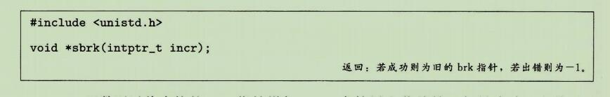
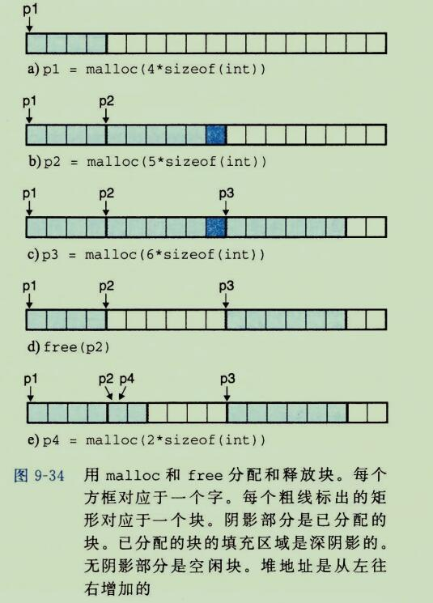
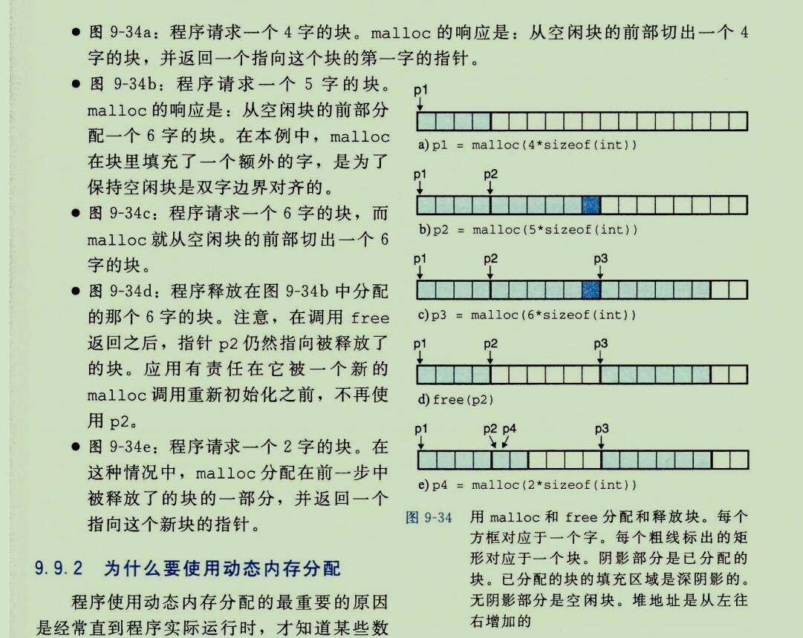
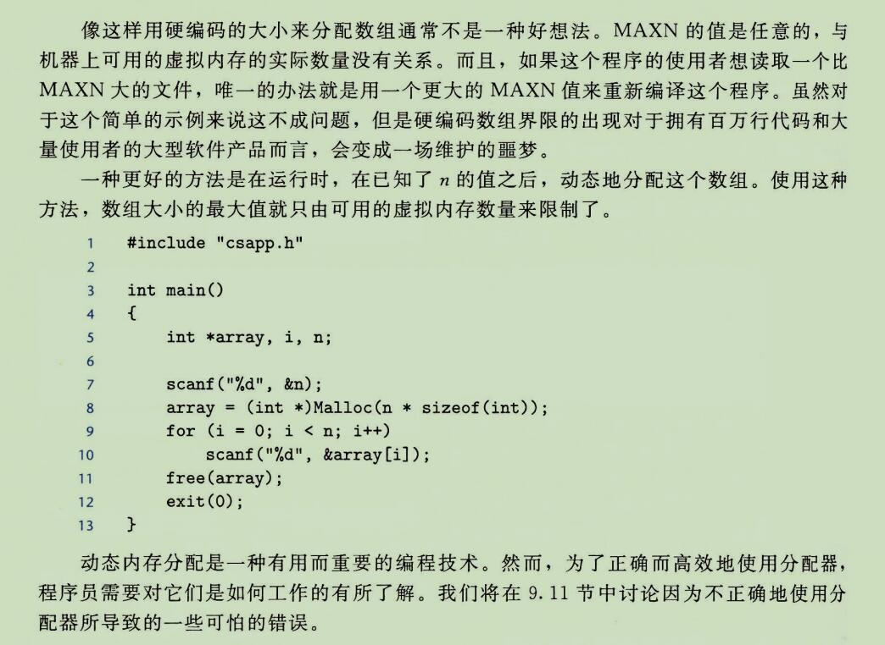
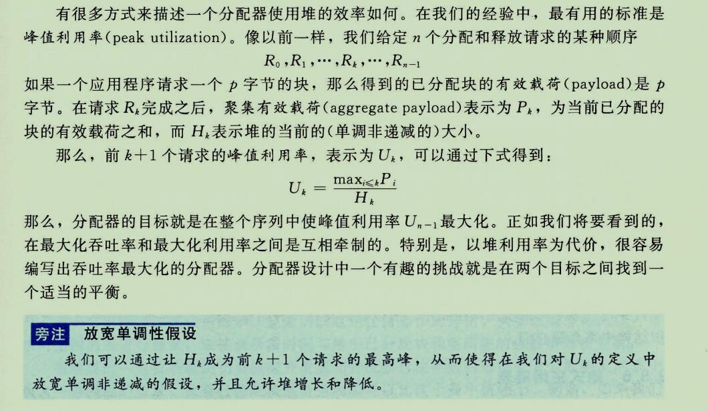
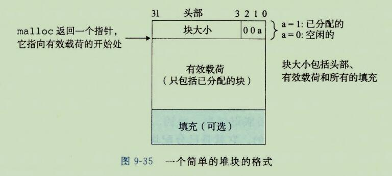
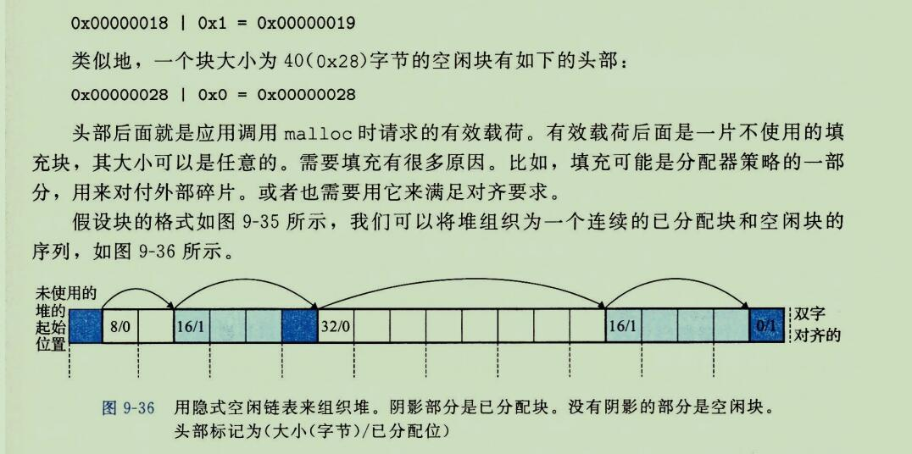

## 8、内存映射

```
需要说明一点，并不是所有物理内存中交换出来的数据都会被放到 Swap 中(如果这样的话，Swap 就会不堪重负)，有相当一部分数据被直接交换到文件系统。
例如，有的程序会打开一些文件，对文件进行读写(其实每个程序都至少要打开一个文件，那就是运行程序本身)，当需要将这些程序的内存空间交换出去时，就没有必要将文件部分的数据放到 swap 空间中了，而可以直接将其放到文件里去。
如果是读文件操作，那么内存数据被直接释放，不需要交换出来，因为下次需要时，可直接从文件系统恢复;
如果是写文件，只需要将变化的数据保存到文件中，以便恢复。
但是那些用 malloc 和 new 函数生成的对象的数据则不同，它们需要 swap 空间，因为它们在文件系统中没有相应的"储备"文件，因此被称作"匿名"(Anonymous)内存数据。
这类数据还包括堆栈中的一些状态和变量数据等。
所以说,Swap 空间是"匿名"数据的交换空间。
```


```
Linux 通过将一个虚拟内存区域与一个磁盘上的对象(object)关联起来，以初始化这个虚拟内存区域的内容，这个过程称为内存映射(memory mapping)。
虚拟内存区域可以映射到两种类型的对象中的一种：
```

```
1、Linux 文件系统中的普通文件：
一个区域可以映射到一个普通文件的连续部分，例如一个可执行文件。
文件区(section)被分为页大小的片，每一片包含一个虚拟页面的初始内容。
因为按需进行页面调度，所以这些虚拟页面没有实际交换进入物理内存，直到CPU第一次引用到页面(即发射一个虚拟地址，落在地址空间这个页面的范围之内)。
如果区域比文件区要大，那么就用零来填充这个区域的余下部分。
```

```
2、匿名文件：
一个区域也可以映射到一个匿名文件，匿名文件是由内核创建的，包含的全是二进制零。
CPU第一次引用这样一个区域内的虚拟页面时，内核就在物理内存中找到一个合适的牺牲页面，如果该页面被修改过，就将这个页面换出来，用二进制零覆盖牺牲页面并更新页表，将这个页面标记为是驻留在内存中的。
注意在磁盘和内存之间并没有实际的数据传送。
因为这个原因，映射到匿名文件的区域中的页面有时也叫做请求二进制零的页(demand-zero page)。
```

```
无论在哪种情况中，一旦一个虚拟页面被初始化了，它就在一个由内核维护的专门的交换文件(swap file)之间换来换去。
交换文件也叫做交换空间(swap space)或者交换区域(swap area)。
需要意识到很重要的一点是，在任何时刻，交换空间都限制着当前运行着的进程能够分配的虚拟页面的总数。
```


### 1、再看共享对象

```
内存映射的概念来源于一个聪明的发现：如果虚拟内存系统可以集成到传统的文件系统中，那么就能提供一种简单而高效的把程序和数据加载到内存中的方法。
```

````
正如我们已经看到的，进程这一抽象能够为每个进程提供自己私有的虚拟地址空间，可以免受其他进程的错误读写。
不过，许多进程有同样的只读代码区域。
例如，每个运行 Linux shell 程序 bash 的进程有相同的代码区域。
而且，许多程序需要访问只读运行时库代码的相同副本。
例如，每个C程序都需要来自标准C库的诸如printf 这样的函数。
那么，如果每个进程都在物理内存中保持这些常用代码的副本，那就是极端的浪费了。
幸运的是，内存映射给我们提供了一种清晰的机制，用来控制多个进程如何共享对象。
````

```
一个对象可以被映射到虚拟内存的一个区域，要么作为共享对象，要么作为私有对象。
如果一个进程将一个共享对象映射到它的虚拟地址空间的一个区域内，那么这个进程对这个区域的任何写操作，对于那些也把这个共享对象映射到它们虚拟内存的其他进程而言，也是可见的。
而且，这些变化也会反应在磁盘上的原始对象中。
```

```
另一方面，对于一个映射到私有对象区域做的改变，对于其他进程来说是不可见的，并且进程对这个区域所做的任何写操作都不会反映在磁盘的对象中。一个映射到共享对象的虚拟内存区域叫做共享区域。
类似地，也有私有区域。
```

```
假设进程1将一个共享对象映射到它的虚拟内存的一个区域中，如图9-29a所示。
现在假设进程2将同一个共享对象映射到它的地址空间(并不一定要和进程1相同的虚拟地址处，如图 9-29b所示)。
```


```
因为每个对象都有一个唯一的文件名，内核可以迅速的判定进程1已经映射了这个对象，而且可以使进程2中的页表条目指向相应的物理页面。
关键点在于即使对象被映射到了多个共享区域，物理内存也只需要存放共享对象的一个副本。
为了方便，我们将物理页面显示为连续的，但是在一般情况下当然不是这样的。
```

```
私有对象使用一种叫做写时复制(copy-on-write)的巧妙技术被映射到虚拟内存中。
一个私有对象开始生命周期的方式基本上与共享对象的一样，在物理内存中只保存有私有对象的一份副本。
比如，图9-30a展示了一种情况，其中两个进程将一个私有对象映射到它们虚拟内存的不同区域，但是共享这个对象同一个物理副本。
对于每个映射私有对象的进程，相应私有区域的页表条目都被标记为只读，并且区域结构被标记为私有的写时复制。
只要没有进程试图写它自己的私有区域，它们就可以继续共享物理内存中对象的一个单独副本。
然而，只要有一个进程试图写私有区域内的某个页面，那么这个写操作就会触发一个保护故障。
```

```
当故障处理程序注意到保护异常是由于进程试图写私有的写时复制区域中的一个页面而引起的，它就会在物理内存中创建这个页面的一个新副本，更新页表条目指向这个新的副本，然后恢复这个页面的可写权限，如图9-30b 所示。
当故障处理程序返回时，CPU重新执行这个写操作，现在在新创建的页面上这个写操作就可以正常执行了。
```


```
通过延迟私有对象中的副本直到最后可能的时刻，写时复制最充分地使用了稀有的物理内存。
```

### 2、再看  fork 函数

```
既然我们理解了虚拟内存和内存映射，那么我们可以清晰的直到 fork 函数是如何创建一个带有自己独立虚拟地址空间的新进程的。
```

```
当fork 函数被当前进程调用时，内核为新进程创建各种数据结构，并分配给它一个唯一的 PID。
为了给这个新进程创建虚拟内存，它创建了当前进程的 mm_struct、区域结构和页表的远样副本。
它将两个进程中的每个页面都标记为只读，并将两个进程中的每个区域结构都标记为私有的写时复制。
```

```
当 fork 在新进程中返回时，新进程现在的虚拟内存刚好和调用 fork 时存在的虚拟内存相同。
当这两个进程中的任一个后来进行写操作时，写时复制机制就会创建新页面，因此，也就为每个进程保持了私有地址空间的抽象概念。

至于原有的对象什么时候会消失，应该有个引用数啥的吧，引用数为0 就直接消失啥的。这个应该是由虚拟内存维护的。
```

### 3、再看 execve 函数

```
虚拟内存和内存映射在将程序加载到内存的过程中也扮演着关键的角色。
既然已经理解了这些概念，我们就能理解 execve 函数实际上是如何加载和执行程序的。
假设运行在当前进程中的程序执行了如下的 execve 调用：
execve("a.out",NULL,NULL);

正如在第8章中学到的，execve 函数在当前进程中加载并运行可执行目标文件 a.out 中的程序，用 a.out 程序有效的替代当前程序。
加载并运行 a.out 需要以下几个步骤：
```

```
删除已存在的用户区域。
删除当前进程虚拟地址的用户部分中的已存在的区域结构。
```

```
映射私有区域。
为新程序的代码、数据、bss和栈区域创建新的区域结构。
所有这些新的区域都是私有的、写时复制的。
代码和数据区域被映射为 a.out 文件中的 .text和 .data 区。
bss区域是请求二进制零的，映射到匿名文件，其大小包含在 a.out 中。
栈和堆区域也是请求二进制零的，初始长度为零。
图9-31概括了私有区域的不同映射。
```

```
映射共享区域。
如果 a.out 程序与共享对象(或目标)链接，比如标准C库 libc.so，那么这些对象都是动态链接到这个程序的，然后再映射到用户虚拟地址空间中的共享区域内。
```

```
设置程序计数器(PC)。
execve 做的最后一件事情就是设置当前进程上下文中的程序计数器，使之指向代码区域的入口点。
```

```
下一次调度这个进程时，它就从这个入口点开始执行。
Linux 将根据需要换入代码和数据页面。
```


### 4、使用mmap函数的用户级内存映射

```
Linux 进程可以使用 mmap 函数来创建新的虚拟内存区域，并将对象映射到这些区域中。
```


```
mmap 函数要求内核创建一个新的虚拟内存区域，最好是从地址 start 开始的一个区域，并将文件描述符 fd 指定的对象的一个连续的片(chunk)映射到这个新的区域。
连续的对象片大小为 length 字节，从距文件开始处偏移量为 offset 字节的地方开始。
start 地址仅仅是一个暗示，通常被定义为 NULL。
为了我们的目的，我们总是假设起始地址为 NULL。
图9-32描述了这些参数的意义。
```


```
参数 prot 包含描述新映射的虚拟内存区域的访问权限位(即在相应区域结构中的 vm_prot 位)。

PROT_EXEC: 这个区域内的页面由可以被CPU执行的指令组成。
PROT_READ: 这个区域内的页面可读。
PROT_WRITE: 这个区域内的页面可以写。
PROT_NONE: 这个区域内的页面不能被访问。
```

```
参数 flags 由描述被映射对象类型的位组成。
如果设置了 MAP_ANON 标记为，那么被映射的对象就是一个匿名对象，而相应的虚拟页面是请求二进制零的。
MAP_PRIVATE 表示被映射的对象是一个私有的、写时复制的对象，
而MAP_SHARED 表示是一个共享对象。
```

```
例如
bufp = Mmap(NULL,size,PROT_READ,MAP_PRIVATE|MAP_ANON,0,0);
让内核创建一个新的包含 size 字节的只读、私有、请求二进制零的虚拟内存区域。
如果调用成功，那么bufp 包含新区域的地址。
```


## 9、动态内存分配

```
虽然可以使用低级的 mmap 和 munmap 函数来创建和删除虚拟内存的区域，但是 C 程序员还是会觉得当运行时需要额外虚拟内存时，用动态内存分配器(dynamic memory allocator) 更方便，也有更好的可移植性。
```

```
动态内存分配器维护着一个进程的虚拟内存区域，称为堆(heap)(见图 9-33)。
系统之间细节不同，但是不失通用性，假设堆是一个请求二进制零的区域，它紧接在未初始化的数据区域后开始，并向上生长(向更高的地址)。
对于每个进程，内核维护着一个变量 brk (读做 "break")，它指向堆的顶部。
```

```
分配器将堆视为一组不同大小的块(block)的集合来维护。
每个块就是一个连续的虚拟内存片(chunk), 要么是已分配的，要么是空闲的。
已分配的块显式的保留为供应用程序使用。
空闲块可用来分配。
空间块保持已分配状态，直到它被释放，这种释放要么是应用程序显式执行的，要么是内存分配器自身隐式执行的。
```

```
分配器有两种基本风格。
两种风格都要求应用显式的分配块。
它们的不同之处在于由哪个实体来负责释放已分配的块。
```

```
显式分配器(explicit allocator),
要求应用显式的释放任何已分配的块。
例如，C标准库提供一种叫做 malloc 程序包的显式分配器。
C程序通过调用 malloc 函数来分配一个块，并通过调用 free 函数来释放一个块。
C++ 中的 new 和 delete 操作符与 C 中的 malloce 和 free 想当。
```

```
隐式分配器(implicit allocator)，
另一方面，要求分配器检测一个已分配块何时不再被程序所使用，那么就释放这个块。
隐式分配器也叫做垃圾收集器(garbage collector),而自动释放未使用的已分配的块的过程叫做垃圾收集(garbage collection)。
例如，诸如 lisp、ML 以及 java 之类的高级语言就依赖垃圾收集来释放已分配的块。
```

```
本节剩下的部分讨论的是显式分配器的设计和实现。
我们将在 9.10 节中讨论隐式分配器。
为了更具体，我们的讨论集中于管理堆内存的分配器。
然而，应该明白内存分配是一个普遍的概念，可以出现在各种上下文中。
例如，图形处理密集的应用程序就经常使用标准分配器来要求获得一大块虚拟内存，然后使用与应用相关的分配器来管理内存，在该块中创建和销毁图形的节点。
```


### 1、malloc 和 free 函数

```
C标准库提供了一个称为 malloc 程序包的显示分配器。
程序通过调用 malloc 函数来从堆中分配块。
```


```
malloc 函数返回一个指针，指向大小为至少 size 字节的内存块，这个块会为可能包含在这个块内的任何数据对象类型做对齐。

实际中，对齐依赖于编译代码在32位模式(gcc -m32)还是64位模式(默认的)中运行的。
在32位模式中，malloc返回的块的地址总是 8 的倍数。
在64位模式中，malloc返回的块的地址总是 16 的倍数。
```

[malloc(malloc在32位编译系统中分配的地址会8字节对齐，64为编译系统中会8或者16字节对齐)](https://blog.csdn.net/sweetfather/article/details/79798962?utm_source=blogxgwz1)

```
32位不是只要 4字节对齐就好了嘛
64位不是只要 8字节对齐不就好了嘛

32位如果是4字节对齐的话，那么 long 类型的变量就不对齐了，所以需要 8 字节对齐。还有是因为 mcalloc 有头和尾，mcalloc 一个块一个字大小，头和尾都要占用一个字，所以...。
```

[Linux内存分配小结--malloc、brk、mmap](https://blog.csdn.net/gfgdsg/article/details/42709943)

```
malloc 底层是用 brk 和 mmap 实现的

1、brk是将数据段(.data)的最高地址指针_edata往高地址推；

2、mmap是在进程的虚拟地址空间中（堆和栈中间，称为文件映射区域的地方）找一块空闲的虚拟内存。

128k 以上的内存用 mmap 来分配,128kb以下的用 brk 来分配。
mmap 的缺点：
	每次分配都会产生缺页系统调用，系统调用会产生cpu上下文切换，消耗比较大。
优点：没有内存碎片

brk 是将 数据段(.data)的最高地址指针 _edata 往高处推；
brk 缺点：会产生系统碎片，因为堆的段的地址是连续的，不断地申请内存块，和释放内存块，内存块有大的小的，总有些内存块太小了，不能用来分配，这些小的内存块就是内存碎片。

优点：因为 brk 分配内存以后，可以不进行释放，而是用应用进行内存块分配，这样的话对于操作系统来说已经占有了这些内存，我们进行用应用分配的话，就不会产生缺页系统调用。速度快

为什么 128kb 以上要用 mmap 。128kb 以上的可能已申请的空闲的块的里面没有这么大的，那么就会去再次扩大堆的总内存。
如果有很多个的话 堆内存可能会被撑爆。
就是会产生很多的内存碎片。
```


[缺页](https://www.zhihu.com/question/48960471)

```
malloc申请的就是虚拟内存（嗯，没有VMM的OS除外。）。
剩下是VMM的事情，VMM在不同操作系统的具体实现细节不同。大概过程如：先检查虚拟内存空间大小是否足够，接物理内存加交换区大小是否足够。
分配空间成功，实际还没有分配实际物理页面。
等程序访问这个新分配内存空间时，操作系统就会把虚拟页面和物理页面映射进来，如果物理内存不足会触发页面置换，把其它不常访问的物理页面置换到交换区上，腾出物理内存进行虚拟页面与物理页面映射。
对于那些被置换交换区上的页面，如果再被其它程序访问时，会触发缺页中断，进行页面置换，把这些页面置换到物理内存上。
```


```
如果 malloc 遇到问题(例如，程序要求的内存块比可用的虚拟内存还要大)，那么它就返回 null，并设置 errno。
malloc 不初始化它返回的内存。
那些想要已初始化的动态内存的应用程序可以使用 calloc,calloc 是一个基于malloc 的瘦包装函数，它将分配的内存初始化为零。
想要改变一个以前已分配块的大小，可以使用  realloc 函数。

动态内存分配器，例如 malloc，可以通过使用 mmap 和 munmap 函数，显示地分配和释放堆内存，或者还可以使用 sbrk 函数：
```



```
sbrk 函数通过将内核的 brk 指针增加 incr 来扩展和收缩堆。
如果成功，它就返回 brk 的旧值，否则，它就返回 -1，并将 errno 设置 ENOMEM。
如果 incr 为零，那么 sbrk 就返回 brk 的当前值。
用一个为负的 incr 来调用 sbrk 时合法的，而且很巧妙，因为返回值(brk 的旧值)指向距新堆顶向上 ads(incr)字节处。

程序是通过调用 free 函数来释放已分配的堆块。
```


```
ptr 参数必须指向一个从 malloc、calloc 或者 realloc 获得的已分配块的起始位置。
如果不是，那么 free 的行为就是未定义的。
更糟的是，既然它上面都不返回，free 就不会告诉应用出现了错误。
就像我们将在 9.11 节里看到的，这会产生一些令人迷惑的运行时错误。
```


```
图 9-34 展示了一个 malloc 和 free 实现是如何管理一个 C 程序的 16 字的(非常)小的堆的。
每个方框代表了一个 4 字节的字。
粗线标出的矩形对应于已分配块(有阴影的)和空闲块(无阴影的)。
初始时，堆是由一个大小为16个字的、双字对齐的、空闲块组成的。
(本节中，我们假设分配器返回的块是8字节双字边界对齐的。)
```






### 2、为什么要使用动态内存分配





### 3、分配器的要求和目标

```
显示分配器必须在一些想当严格的约束条件下工作：

处理任意请求序列：
	一个应用可以有任意的分配请求和释放请求序列，只要满足约束条件：
	每个释放请求必须对应于一个当前已分配块，这个块是由一个以前的分配请求获得的。
	因此，分配器不可以假设分配和释放请求的顺序。
	例如，分配器不能假设所有的分配请求都有相匹配的释放请求，或者有相匹配的分配和空闲请求是嵌套的。
	

立即响应请求。
	分配器必须立即响应分配请求。
	因此，不允许分配器为了提高性能重新排列或缓冲请求。


只使用堆
	为了使分配器是可扩展的，分配器使用的任何非标量数据结构都必须保存在堆里。


对齐块(对齐要求)
	分配器必须对齐块，使得它们可以保存任何类型的数据对象。
	
不修改已分配的块
	分配器只能操作或者改变空闲块。
	特别是，一旦块被分配了，就不允许修改或者移动它了。
	因此，诸如压缩已分配块这样的技术是不允许使用的。
```

```
在这些限制条件下，分配器的编写者试图实现吞吐率最大化和内存使用率最大化，而两个性能目标通常是互相冲突的。

目标1：最大化吞吐率。
假定n哥分配和释放请求的某种序列：
R0,R1,...,Rk,...Rn-1
我们希望一个分配器的吞吐率最大化，吞吐率定义为每个单位时间里完成的请求数。
例如，如果一个分配器在1秒内完成 500 个分配请求和 500 个释放请求，那么它的吞吐率就是每秒 1000 次操作。
一般而言，我们可以通过使满足分配和释放请求的平均时间最小化吞吐率最大化。
正如我们会看到的，开发一个具有合理性能的分配器并不困难，所谓合理性能是指一个分配请求的最糟运行时间与空闲块的数量成线性关系，而一个释放请求的运行时间是个常数。


目标2：最大化内存利用率。
天真的程序员经常不正确的假设虚拟内存时一个无限的资源。
实际上，一个系统中被所有进程分配的虚拟内存的全部数量是受磁盘上交换空间的数量限制的。
好的程序员知道虚拟内存是一个有限的空间，必须高效得使用。
对于可能被要求分配和释放大块内存的动态内存分配器来说，尤其如此。
```




### 4、碎片

```
造成堆利用率很低的主要原因是一种称为 碎片(fragmentation)的现象，当虽然有未使用的内存但不能用来满足分配请求时，就发生这种现象。

有两种形式的碎片：内部碎片(internal fragmentation)和外部碎片(external fragmentation)。
```

```
内部碎片
	内部碎片是在一个已分配块 比 有效载荷大时发生的。
	很多原因都可能造成这个问题。
	例如，一个分配器的实现可能对已分配块强加一个最小的大小值，而这个大小要比某个请求的有效载荷大。
	或者，就如我们在图9-34b 中看到的，分配器可能增加块大小以满足对齐约束条件。

	内部碎片的量化是简单明了的。
	它就是已分配块大小和它们的有效载荷大小之差的和。
	因此，在任意时刻，内部碎片的数量只取决于以前请求的模式和分配器的实现方式。
	头和尾应该不算内存碎片，填充块才算是内存碎片。就是没有实际上使用的碎片。
```

```
外部碎片
	外部碎片是当空闲内存合计起来足够满足一个分配请求，但是没有一个单独的空闲块足够大可以来处理这个请求时发生的。
	例如，如果图9-34e中的请求要求6个字，而不是2个字，那么如果不向内核请求额外的虚拟内存就无法满足这个请求，即使在堆中仍然有6个空闲的字。
	问题的产生时由于这6个字时分在两个空闲块中的。
```

```
外部碎片比内部碎片的量化要困难的多，因为它不仅取决于以前请求的模式和分配器的实现方式，还取决于将来请求的模式。


例如，假设在k个请求之后，所有空闲块的大小都恰好是4个字。
这个堆会有外部碎片吗？
答案取决于将来请求的模式。
如果将来所有的分配请求都要求小于或者等于4个字的块，那么就不会有外部碎片。
另一方面，如果有一个或者多个请求要求比4个字大的块，那么这个堆就会有外部碎片。

因为外部碎片难以量化且不可能预测，所以分配器通常采用启发式策略来试图维持少量的大空闲块，而不是维持大量的小空闲块。
```

### 5、实现问题


```
空闲块组织：我们如何记录空闲块？
放置：我们如何选择一个合适的空闲块来放置一个新分配的块？
分割：在将一个新分配的块放置到某个空闲块之后，我们如何处理这个空闲块中的剩余部分？
合并：我们如何处理一个刚刚被释放的块？

本节剩下的部分将更详细的讨论这些问题。
因为像放置、分割以及合并这个的基本技术贯穿在许多不同的空闲块组织中，所以我们将在一种叫做隐式空闲链表的简单空闲块组织结构中来介绍它们。
```

### 6、隐式空闲链表

```
任何实际的分配器都需要一些数据结构，允许它来区别块边界，以及区别已分配块和空闲块。
大多数分配器将这些想信息嵌入块本身。
一个简单的方法如图9-35所示。
```



```
在这种情况中，一个块是由一个字的头部、有效载荷，以及可能的一些额外的填充组成的。
头部编码了这个块的大小(包括头部和所有的填充)，以及这个块是已分配的还是空闲的。
如果我们强加一个双字对齐约束条件，那么块大小总是8的倍数，且块大小最低3位总是零。
因此，我们只需要内存大小的29个高位，释放剩余的3位来编码其他信息。
在这种情况中，我们用其中的最低位(已分配位)来指明这个块是已分配的还是空闲的。

例如，我们有一个已分配块，大小为24(0x18)字节。那么他的头部将是：
```



```
我们称这种结构为隐式空闲链表，是因为空闲块是通过头部中的大小字段隐含地连接着的。
分配器可以通过遍历堆中所有的块，从而间接的遍历整个空闲块的集合。
注意，我们需要某种特殊标记的结束块，整个示例中，就是一个设置了已分配位而大小为零的终止头部(terminating header)。
```


