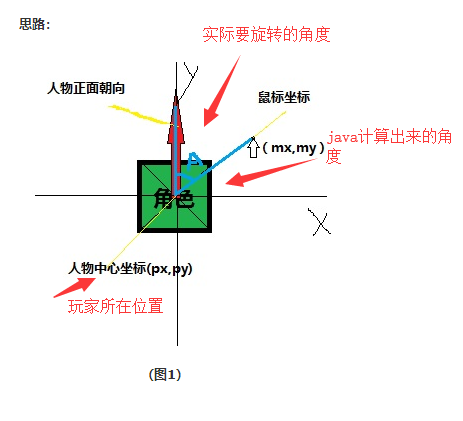

1、先上代码

[[如何获得两点之间顺时针旋转的角度]](https://www.cnblogs.com/worldFulcrum/p/5573927.html)

```
 /**
     * 获取2点之间基于方向 float
     * 根据两点组成的直线在x z平面的角度，顺时针
     *
     * @param srcV3 起始点
     * @param tgtV3 目标点
     * @return 角度
     */
    public static double degrees(Vector3f srcV3, Vector3f tgtV3) {
        return toUnityDegrees(angle(srcV3, tgtV3));
    }
    
     /**
     * java弧度转unity角度
     *
     * @param angle
     * @return
     */
    private static double toUnityDegrees(double angle) {
        return 90 - Math.toDegrees(angle);
    }
    
      /**
     * 获取2点之间的弧度方向
     *
     * @param srcV3 起始点
     * @param tgtV3 目标点
     * @return 弧度
     */
    private static double angle(Vector3f srcV3, Vector3f tgtV3) {
        double x = tgtV3.getX() - srcV3.getX();
        double z = tgtV3.getZ() - srcV3.getZ();
        double angle = Math.atan2(z, x);
        if (angle < 0) {
            angle += Math.PI * 2;
        }
        return angle;
    }
```

```
首先看图
```



```
首先计算 人物当前位置 -> 目标位置 向量距离 x 轴逆时针的角度; 就是 java计算出来的角度

使用方法 Math.atan2(z, x); 就计算出来了。

然后因为角色要旋转的角度为 实际要旋转的角度。  
所以你需要 90- java计算出来的角度 = 实际要旋转的角度。

为什么  90- java计算出来的角度 = 实际要旋转的角度

首先我们计算出来的角度是逆时针 基于 x的;
我们需要顺时针, 就变成了 -x;
然后我们是基于 y 轴的, 
所以我们还需要 +90; 
因为基于x顺时针  和基于 y 顺时针 差90度;

所以就变成了 90+(-Degrees);
```

