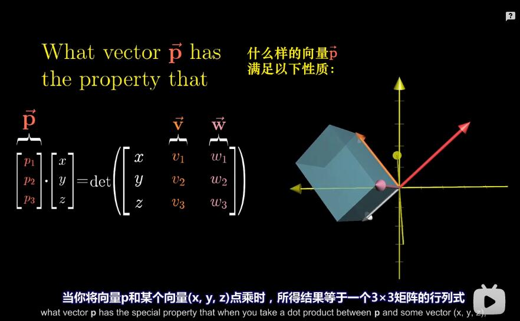

## 07、点积与对偶性

### 点积的标准解释

```
传统上，点积是线性代数课程中很靠前的内容，
作者把它放在如此的靠后，看起来似乎很奇怪，
虽然引入点积的标准方法只需要向量的基础认识即可，
但是要进一步理解点积所发挥的作用，
只能从线性变换的角度才能完成，
只有通过线性变换才 能真正理解，

不过在此之前，我先简单介绍引入点积的标准方法，

```


```
如果你有两个维度相同的向量，
或是两个长度相同的数组，
求它们的点积，就是将相应坐标配对，
求出每一对坐标的乘积，
然后将结果相加。
```


```
这个计算有一个优美的几何解释，
要求两个向量v和w的点积，
想象将向量w朝着过原点和向量v终点的直线上投影，
将投影的长度与向量v的长度相乘，
你就得到了它们的点积， v点乘w

点积和顺序无关

v向量和w向量

v*w = |v|*|w|投影
或者 |v|投影 *|w|

而投影 又 |v|投影 = cos * |v|
```


```
除非w的投影与v的方向相反，这种情况下点积为负值
```


```
所以当两个向量的指向大致相同时，它们的点积为正，

当它们互相垂直时，意味着一个向量在另一个向量上的投影为零向量。
它们的点积为零。

而当它们的指向基本相反时，它们的点积为负。
```


```
因为点积和顺序无关，所以v和w谁向谁投影算出来的结果应该是一致的。
可是从图来看，这两种投影相乘完全看不出一样。

现在看看，这种解释异常的不对称，它对两个向量的处理完全不同，
所以我初次学习时，点积与顺序无关让我感到惊讶，
你可以将v投影到w上，将v的投影长度与w的长度相乘，
我说，你不觉得这是两个完全不同的过程嘛？
为什么结果会相同？


```


```
下面从直观上说说为什么点积和顺序无关

如果v和w的长度恰好相同，我们可以利用其中的对称性，
因为w向v上投影，并将w的投影长度和v的长度相乘，
和v向w上投影，并将v的投影长度和w的长度相乘互为镜像。

现在如果你将其中一个(比如v)缩放若干倍(比如两倍)，
使得它们的长度不同，对称性就被破坏了，

但是我们可以这样理解2v和w这两个新向量的点积，
如果你认为w向v上投影，
那么2v点乘w就应该恰好是v点乘w的两倍,
(2v).(w) = 2(v.w)
这是因为，将v放大为原来的两倍并不改变w的投影长度，
但是被投影的向量长度变为原来的两倍，


另一方面，假设你想将v投影到w上，
我们将v变为原来的两倍，这次是投影的长度变为原来的两倍，
但是被投影的向量长度保持不变，
所以总体效果仍然只是点积变为两倍，
所以说，即使这种情况下的对称性被破坏了，
在两种理解方式下，缩放向量对点积结果的影响是相同的。
```


```
初次学习的时候，我还遇到了另一个让我困惑的大问题，
为什么点积的这一运算过程，也就是对应坐标相乘并将结果相加，和投影有所联系？

令人最满意的答案来自于 对偶性。
```


### 用线性变换的方式来解释点积和投影的关系


```
我现在将数轴复制一份，然后保持0在原点，将它斜放置在空间中，
现在考虑这样一个二维向量，它的终点落在这条数轴1上，
我给它起个名字，就叫"u帽"。

如果我们将二维向量直接投影到这条数轴上，
实际上，我们就这样定义了一个从二维向量到数的函数，
更重要的是，这个函数是线性的，因为它顺利通过了线性检验，
即直线上等距分布的点在投影到数轴上后仍然等距分布，
```


```
u是二维空间的一个向量，而它碰巧又落在这条数轴上，
```


```
根据这个投影，我们定义了一个从二维向量到数的线性变换，
所以我们就能够找到描述这个变换的1x2矩阵，
为了找到这个矩阵，我们把这条斜着的数轴放大来看，
```


```
我们需要考虑变换后i帽和j帽的位置，因为它们就是矩阵的列，
这一部分非常漂亮，
我们可以通过精妙的对称性进行推理，

因为 i帽和u帽都是单位向量，
所以将i帽向u帽所在直线投影
与u帽向x轴投影看上去完全对称，

所以说,如果要问i帽在投影之后落在哪个数上，
答案就应该是u帽向x轴投影所得到的数，
而u帽向x轴投影得到的数就是u帽的横坐标，

因此根据对称性，将i帽向斜着的数轴上投影所得到的数，
就是u帽的横坐标。

以上推理过程对j帽几乎一致。
u帽的y坐标也给出了j帽向斜着的数轴上投影所得到的数。
```

```
所以描述投影变换的1x2矩阵的两列，
就分别是u帽的两个坐标，
而空间中任意向量经过投影变换的结果，
也就是投影矩阵与这个向量相乘，
和这个向量与u帽的点积在计算上完全相同。
```


```
这就是为什么与单位向量的点积可以解读为，将向量投影到单位向量所在的直线上所得到的投影值。
```


#### 那非单位向量呢


```
比如说，还是这个单位向量 u帽，不过我们把它放大为原来的3倍，
数值上说，它的每个坐标都被放大为原来的3倍，
所以要寻找与这个向量相关的投影矩阵，
实际上就是之前i帽和j帽投影得到的值的3倍，

更普遍的说，因为这个变换是线性的，意味着这个新矩阵可以看作，
将任何向量朝斜着的数轴上投影，然后将结果乘以3.

这就是为什么向量与给定非单位向量的点积可以解读为，
首先将朝给定向量上投影，然后与给定向量长度相乘。

这里看出了 点积等于 v*w=|v|*|w|投影长度

这里可以这么看，
1、先找到 v向量代表的线性变化
这个v向量的线性变换的矩阵怎么找呢？
因为v向量线性变换在数轴上的长度是N倍的u帽;
那么这个线性变化就是
N(ux,uy);
先投影再缩放。

所以 向量w 要应用 v的线性变换
结果就是 |w|的投影 * |v|
v*w = N(ux,uy) * w
N = |v|
(ux,uy)*w = |w|
```

```
将任意平面向量投影到某单位向量u上是一个线性变换，其矩阵通过关于对称性的讨论可知即包含这个单位向量u两个坐标的一个一行矩阵U，因此将任意向量v投影至这一向量上的结果即Uv结果刚好为u和v坐标的对应相乘，与u和v的点积相同，因此说明了点积具有投影的性质，再通过点积和投影的线性性可知即使u不是单位向量同样的结果也成立。
```

```
这集讲了，任取一单位向量u，设坐标为（a，b）。
首先证明（1,0）投影到u上的“带正负号的长度”恰为a（画图用所谓的对偶性证明），（0,1）的恰为b。
则进一步，可以直观的想象（x，0）的投影“长度”为ax。
再进一步，直观想象对于任取的向量（x，y），该向量分两步走，先向右x，再向上y，则在“整个平面投影到u的方向的直线”的过程中，可以直观地想象“向右x”这一运动过程被投影到“向u所指的方向上运动ax”，“向上y”同理，因此（x，y）投影到u上的“带正负号的长度”就应该是为ax+by。
再进一步，设u方向上有一向量（ca，cb），c不为1，显然其“带正负的长度”为c。（ca,cb）点乘（x，y），按代数定义应为cax+cby，但换一种形式可以理解为c（ax+by），即“长度c”与“投影长度”ax+by的积。
```

```
点积定义为两向量对应坐标的乘积之和。
由于点积关于各输入是线性的，因此对于某个固定的向量u，
将u与任意向量作点积是整个向量空间上的线性函数(将整个空间映射到1维实数)，
因为向量空间上的线性函数都可以由一个一行的矩阵来表示，
因此任意一个向量都可以看成一个一行矩阵，即向量和一行矩阵是同一回事。


```


```
思考下这个过程，
我们有一个从二维空间到数轴的线性变换，
它并不是由向量数值或点积运算定义得到的，
而只是通过将空间投影到给定数轴上来定义，
因为这个变换是线性的，所以它必然可以用某个 1x2矩阵来描述，
而又因为1x2矩阵和二维向量的计算过程，
和转置矩阵并求点积的计算过程相同，
所以这个投影变换必然会与某个二维向量相关，

这里给你的启发是，你在任何时候看到一个线性变换，
它的输出空间是一维数轴，
无论它是如何定义的，空间中会存在唯一的向量v与之相关，
就这一意义而言，应用变换和与向量v做点积是一样的。
```


```
上面的例子是数学中"对偶性"的一个实例，
对偶性贯穿数学始终，在多个方面均有体现，
而实际定义它确是比较棘手的，
粗略的说，它指的是，
两种数学事物之间自然而又出乎意料的对应关系，


对于你刚刚学到的情况而言，
你可以说一个向量的对偶是由它定义的线性变换，
一个多维空间到一维空间的线性变换的对偶是多维空间中的某个特定向量，


总结一下，表面上看，点积是理解投影的有利几何工具，
并且方便检验两个向量的指向是否相同，
这大概也是你需要记住的点积中最重要的部分，
不过更进一步讲，
两个向量点乘，就是将其中一个向量转化为线性变换，
同样，在数值上强调它可能显得没有意义，
因为只是两种看上去恰好相似的计算过程而已，
但是我认为这一过程非常重要，
因为从始至终你都在和向量打交道，
一旦你真正了解了向量的"个性"，
有时你就会意识到，不把它看作空间中的箭头，
而把它看作线性变换的物质载体，会更容易理解向量，
向量就仿佛是一个特定变换的概念性记号，
因为对我们来说，想象空间中的向量比想象整个空间移动到数轴上更加容易。
```


## 08、叉积的标准介绍

### 1、二维叉积


```
假如你有两个向量v和w，考虑它们所张成的平行四边形，
这句话的意思是，你取一份v的副本，将它的起点移到w的终点，
再取一份w的副本，将它的起点移到v的终点。
屏幕上显示的这四个向量围成了一个平行四边形。

v和w的叉积(写作X形乘积符号) 就是这个平行四边形的面积。
```

### 2、二维叉积定向问题


```
vxw，如果v在w的右侧， 
那么v叉乘(cross)w 为正，并且值等于平行四边形的面积。
```


```
vxw，如果v在w的左侧，
那么v叉乘(cross)w 为负，并且值等于平行四边形的相反数
```


```
就是说，顺序会对叉积有影响，
如果你不计算w叉乘v,
而是交换两者位置计算，
那么叉积就是之前计算结果的相反数，

```


```
我用来记住顺序的方法是，
当你按序求两个基向量的叉积，即i帽叉乘j帽，
结果应该是正的，
 
实际上，基向量的顺序就是定向的基础，
因为i帽在j帽的右侧，
所以我记得w在w的右侧时,v叉乘w为正，

```

### 3、二维叉积怎么求面积

```
直接用行列式 就可以求面积
```

### 4、叉积的一些直观感受


```
比如说，你可能注意到一点，当两个向量垂直，
或者至少是接近垂直时，
和它们指向接近时相比，
此时的叉积更大，

因为当两条边接近垂直时，平行四边形的面积会更大，
```


```
你可能还注意到了一些其他东西，
如果你放大其中一个向量，比如将v放大为3倍，
那么平行四边形的面积也同时放大为3倍。
这也就是说，3v叉乘w正好是v叉乘w的3倍，
```


```
严格的讲，我刚才描述的东西并不是叉积，
真正的叉积是通过两个三维向量生成一个新的三维向量，
```


```
和之前一样，我们还是要考虑这两个向量围成的平行四边形，
而这个平行四边形的面积依然会发挥重要的作用，
说的具体一些，比如这两个向量围成的平行四边形的面积为2.5,
但是我之前提到，叉积的结果不是一个数，而是一个向量，

这个向量的长度就是平行四边形的面积，在这里也就是2.5，
而这个向量的方向与平行四边形(所在的面)垂直，

但是是哪边呢？(平面 有上面和下面两面)

因为长度为2.5并且垂直于给定面的向量有两个，

```


```
这里就要用到右手定则，
右手食指指向v的方向，
伸出中指指向w的方向，
当你把大拇指竖起来时，它所指的方向就是叉积的方向，
```


```
对于更一般的情况，如果你愿意的话，
这里有个公式可以让你记忆，
但是它可以由一个三阶行列式代替，使这种运算记忆起来更加简洁，

这一过程乍一看非常奇怪，
你写下一个三阶矩阵，
第二列和第三列分别为v和w的坐标，
第一列却是基向量i帽，j帽和k帽，
然后计算这个矩阵的行列式，
很明显，令人糊涂的地方在这里，

让一个向量作为一个矩阵元究竟是什么意思呢？
```


```
老师经常告诉学生，这只是符号上的技巧，
假装i帽、j帽和k帽都是数，当你进行计算时，
最终得到的是这三个基向量的线性组合，
学生也只是相信，这个线性组合所决定的向量，
是唯一一个与v和w垂直，
长度为v和w围成的平行四边形的面积，
并且遵循右手定则的向量。
```


## 09、以线性变换的眼光看叉积


```
你可以通过蛮力计算来验证 叉乘的意义 这些事实。
```


### 1、对偶性的思想

```
每当你看到一个(多维)空间到数轴的线性变换时，
它都与那个空间中的唯一一个向量对应，也就是说，
应用线性变换和与这个向量点乘等价，

数值上说，这是因为这类线性变换可以用一个只有一行的矩阵描述，

这里的收获在于，每当你看到一个从空间到数轴的线性变换，
你都能找到一个向量，被称为这个变换的对偶向量，
使得应用线性变换和与对偶向量点乘等价。
```


### 2、总体计划


```
我要做的是定义一个从三维到数轴的特定线性变换，
并且它时根据v和w来定义的。

然后当我们将这个变换与三维空间中的对偶向量关联时，
这个对偶向量就会是v和w的叉积。

之所以这么做，是因为理解这个变换能够解释清楚叉积计算过程和几何含义之间的关系。
```


白色的向量是 xyz, 其他依次根据矩阵的列的颜色进行辨认

```
如果你不知道三维向量的叉积并且尝试去外推，
你可能会想，它涉及三个向量u、v和w。
将它们的坐标作为一个3x3矩阵的列。
然后计算这个矩阵的行列式。

而且正如你从第五章里面学到的，
从几何上讲，这个行列式给出了三个向量张成的平行六面体的体积，
外加一个正负号，取决于这三个向量是否满足右手定则，
当然，你们都知道这不是三维向量的叉积，
真正的三维向量的叉积接收两个向量并输出一个向量，

但是，它并不是接收三个向量并输出一个数，
不过这个想法已经非常接近真实的叉积了，
将第一向量u看作可变向量，比如(x,y,z)，
而v和w保持不变，

那么我们就有一个从三维空间到数轴的函数了。
你输入一个向量(xyz)，然后通过矩阵的行列式得到一个数。

这个向量的第一列是(xyz),其余两项是常向量v和w的坐标，
这个函数的几何意义是，对于任一输入的向量(x,y,z)
你都考虑由它和v与w确定的平行六面体，
得到它的体积，然后根据定向确定符号，

我们为什么要做这个？
这个函数从哪里来的？
为什么要这样定义？
不知道
```


```
这个函数一个至关重要的性质在于它是线性的，
为什么是线性的？
因为按照前面说的，行列式就是三个向量所夹的平行六面体的体积。
这个平行六面体的底面积是定下来的，所以如果高是线性的体积就是线性的。

你长度为1的高 和长度为2的高,输入都是倍数;因为他们平行等距，所以是线性的。

一旦知道它是线性的，你就知道可以通过矩阵乘法来描述这个函数，
因为矩阵就是用来描述线性变换的，所以这个函数可以用矩阵来代替。

具体的说，因为这个函数从三维空间到一维空间，
就会存在一个1x3矩阵来代表这个变换，
```


```
而对偶性的整体思路是，从多维空间到一维空间的变换的特别之处，
在于你可以把矩阵立起来，并且将整个变换看作与这个特定向量的点积，
我们要找的就是这个特殊的三维向量，我称之为p。

使得p与其他任一向量(x,y,z)的点积等于一个3x3矩阵的行列式，
这个3x3矩阵的第一列为(x,y,z),
其余两列分别为v和w的坐标，

稍后会说到这个过程的几何意义，
但是我们先专注于它的计算意义，

p与向量(x,y,z)点乘给出的结果是，
某个数乘以x，加上某个数乘以y,加上某个数乘以z,
这里的某个数就是p的坐标，

但是当你计算等号右侧的行列式时，你可以将其整理为，
某个数乘以x，加上某个数乘以y,加上某个数乘以z,

这里的某些常数涉及了v和w的坐标的特定组合，
因此这些常数，也就是v和w坐标的特定组合，
就是我们寻找的向量p的坐标。

等号右侧的过程，
对于那些进行过叉积计算的人来说是很熟悉的，
像这样合并x、y和z前面的常数项，

和把i帽、j帽、k帽放进矩阵第一列进行计算，然后合并各项前面的系数没有区别，
在矩阵中插入i帽、j帽和k帽不过是在传递一个信号，
告诉我们应该把这些系数解读为一个向量的坐标，
因此这一切都在说明，这个奇怪的运算过程可以看做是以下问题的答案
```



```
当你将向量p和某个向量(x,y,z)点乘时，所得结果等于一个3x3矩阵的行列式，
这个矩阵的第一列为(x,y,z)，其余两列为v和w的坐标，
什么样的向量才能满足这一特殊性质？
```


###  从几何部分来回答上面这个问题


```
记住一点，向量p与其他向量的点积的几何解释，
是将其他向量投影到p上，
然后将投影长度与p的长度相乘，
```


```
考虑到这一点，对于我们所关心的平行六面体的体积，我来说明一种思考方法，

首先获得由v和w确定的平行四边形的面积，
乘以向量(x,y,z)在垂直于平行四边形方向上的分量(就是平行六面体的高)，

换句话说，我们找到的线性函数对于给定向量的作用，
是将这个向量投影到垂直于v和w的直线上，
然后将投影长度与v和w张成的平行四边形的面积相乘，

但是，这和垂直于v和w且长度为平行四边形面积的向量于(x,y,z)点乘是同一回事。

但是 为什么能把  平行四边形面积和 p 对等起来？
如果p不等于 并行四边形面积有可能会算出和 平行六面体的体积一样的值嘛？
反证法证P垂直：
若垂直Px(投影)=底面积xh，而投影长度一定不等于h,若xyz是任意向量等式是不可能恒成立的。


更重要的是，如果你选择了合适的向量方向，
点积为正的情况就会与(x,y,z)、v和q满足右手定则的情况相吻合，
这意味着我们找到了一个向量p。
```

```
若向量p“膜长等于平行四边形且方向垂直于平行四边形”，是满足条件的”，这里牵扯到向量p的唯一性，up并没有提，我在这里简单解释一下：因为不同的向量对应的是不同的线性变换，所以若你找到了一个符合条件的向量，那这个向量就是仅存的惟一的。

有无数个p 使得p与xyz的点积等于六面体体积
xyz 都能找到无数条p使得二者点积为六面体体积

你说对了一点，对任一特定的xyz,都能找到无数条p使得二者点积为六面体体积。但是只有垂直于vw平面的那一个p才能使“所有的xyz”和p的点积等于六面体体积。
```

```
最后一部分说明了，为什么p一定要是垂直于uv平面，以及p与xyz的点乘等价于uv和xyz的叉乘行列式，首先行列式代表了平行四面体体积，而uv所得的平行四边形面积与xyz在垂直数轴上投影的乘积正是p与xyz的点积，
叉乘线性变换所得的结果唯一，即p唯一，若p不垂直于uv，则p大小不等于平行四边形面积，且不同的xyz导致了不同的p，p不唯一。
```

```
证明线性变换在自然基底下矩阵表示的唯一性(思路)
假设矩阵A，A'都是线性变换的变换矩阵则
Ax=y
A'x=y
对任意(x,y)都成立
两式子相减得到
(A-A')x=0对于任意x恒成立
所以矩阵(A-A')对应的线性方程(A-A')x＝0的解空间满秩
根据线性方程解空间性质，得到r(A-A')=0，所以A-A'=0, A=A'

X=AE=BE，那么（A-B）E=0，因此A-B=0，这与A不等B矛盾，反证完毕。
```


```
p.xyz = 
x vx wx
y vy wy
z vz wz 行列式

p.xyz  = |p| * |xyz|在p上的投影

x vx wx
y vy wy
z vz wz
矩阵的行列式 = 平行六面体;
= h*底面积;
因为vw是固定的;所以 vw = 底面积
那么 h = xyz垂直在vw上的垂直线


|p| * |xyz|在p上的投影 = xyz垂直在vw上的垂直线 * vw

如果p = vw的面积;且p垂直于vw;
那么这个等式就可以成立;

而又因为 p.xyz 是线性变换，线性变换的矩阵具有唯一性;
也就是说 p = vw;且p垂直于vw;是唯一的解;

是会有其他的p在某种情况下xyz时，也会让 p*xyz=行列式;
但是只有p=vw的时候，才能让 p*xyz=行列式 恒成立;

```


