## 09、基变量


```
如果我在二维空间中有一个向量，我们就有一种用坐标表示它的标准方法。
在这种情况下，这个向量的坐标为(3,2)，
也就意味着从它的起点到它的尖端，需要向右移动3个单位，并且向上移动2个单位，
现在以更加线性代数的方法来描述坐标，
是将这些看作拉伸或压缩向量的标量，

你将第一个坐标看作缩放i帽的标量，
i帽就是指向右方且长度为1的向量，

第二个坐标看作缩放j帽的标量，
j帽就是指向正上方且长度为1的向量，
这两个经过缩放的向量的和就是坐标所要描述的向量，

你可以把这两个特殊的向量，
看作封装于我们这个坐标系中的隐含假设，
第一个数字表示向右的运动，
第二个数字表示向上的运动，
长度单位的确切大小，
上面的所有事实都和 i帽 和j帽的选取有密切联系，
因为这两个向量正是标量缩放的对象，
```


```
发生在向量与一组数之间的任意一种转化，都被称为一个坐标系，
而其中两个特殊的向量，i帽 和 j帽，
被称为这个标准坐标系的基向量，

我想在此讨论的是使用另一组基向量的思想，
使用不同的基向量会怎么样？

```


```
比如说你有一个朋友 -路人A，她使用着一组不同的基向量，我将称为b1和b2,
她的第一个基向量b1指向右上方，
她的第二个基向量b2指向左上方，

现在再看看之前我所是展示的向量，
也就是根据i帽和j帽这组基向量，
你我会用坐标3,2来描述的那个向量，

路人A其实会用坐标(5/3,1/3)来描述它，
这意味着，根据她的两个基向量，获得那个向量的方法是，
b1乘以5/3,b2乘以1/3，再将两个结果相加，
很快我就会向你展示如何计算出这两个数 5/3和1/3，
```


```
总之，无论何时路人A用坐标来描述一个向量，
她将第一个坐标乘以b1,第二个坐标乘以b2,
然后将结果相加，
她最终得到的向量，会和你我认为的相同坐标向量完全不同.
```


```
更确切的说一说这里的设定，
对于她的第一个基向量b1,我们会用坐标2,1来描述，
而对于她的第二个基向量b2，我们用(-1,1)来描述， 

但是更重要的一点是，从她的角度来看，
在她的坐标系中，这两个向量的坐标为(1,0)和(0,1),
因为它们就是定义坐标(1,0)(0,1)含义的向量，
```


```
所以，我们实际上说着不同的语言，
虽然我们都在关注空间中的同一个向量，
但是路人A用不同的语言和数字来描述它。
```

```
我再快速讲讲我是如何表示这些东西的，
在制作二维空间的动画时，我通常使用这样的方形网络，
但是网格只是一个框架，提供了一种将坐标系可视化的途径，
因此它依赖于我们对基的选择，

空间本身并没有内蕴的网格，
路人A可能会画出她自己的网格，
它同样是一个人为的框架，
也只不过是有助于理解她的坐标含义的可视化工具，

但是她的原点会和我们的原点重合，
因为 大家在坐标(0,0)的含义上达成了共识，
它就是任何向量乘以0时，
你所得到的的坐标，

但是她的坐标轴的方向和网格间距会有所不同，
这依赖于她对基的选择，

在这一切都构建完毕后，
```


```
一个很自然的问题是:
	我们如何在不同坐标系之间进行转化？
	
比如说，如果路人A用坐标(-1,2)描述一个向量，
那么这个向量在我们坐标系中如何描述？

从我们的角度来看,b1的坐标为(2,1)，b2的坐标为(-1,1),

所以实际上，我们可以直接计算-1乘以b1 加上 2乘以b2,
因为它们都是在我们坐标系中表示的，
计算之后你得到了一个坐标为(-4,1)的向量，
我们就是这样来描述她所认为的向量(-1,2)的，
这里发生的过程，也就是用某个向量的特定坐标与她的基向量数乘，
然后将结果相加，看起来有些眼熟，
这就是矩阵向量乘法，
这个矩阵的列代表的是用我们的语言表达的路人A的基向量，
```


```
实际上，一旦你将矩阵向量乘法理解为应用一个特定的线性变换，
就会有一种非常直观的方法来考虑这里发生的事，

一个矩阵的列为路人A的基向量，这个矩阵可以看作一个线性变换，
它将我们的基向量i帽和j帽，也就是我们眼中的(1,0)和(0,1),
变换为路人A的基向量，也就是她眼中的(1,0)和(0,1),
```


```
我们来看看对我们所想的向量(-1,2)应用变换是什么意思，
在线性变换之前，我们所想的向量是我们的基向量的一种特定线性组合，
-1乘以i帽，加上2乘以j帽，
而线性变换的一个重要特性在于，
变换后的向量仍旧是相同的线性组合，不过使用的是新的基向量，

因此这个矩阵所做的，
是将我们对路人A的向量的误解，变换为她提到的真正向量，
```


```
我还记得当初学习这部分内容时，我总感觉它是颠倒的，
从几何上说，这个矩阵将我们的网格变换为路人A的网格，
但是从数值上来说，这是用她的语言来描述转化为我们的语言来描述，
```

```
最终让我恍然大悟的是，
把它看作将我们对路人A的向量的误解，
也就是在我们坐标系中具有相同坐标的向量，
变换为她真正想表示的向量，
```

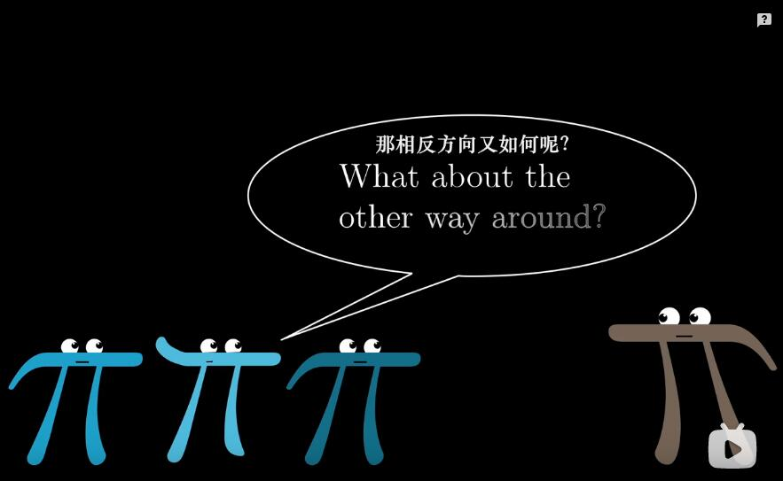

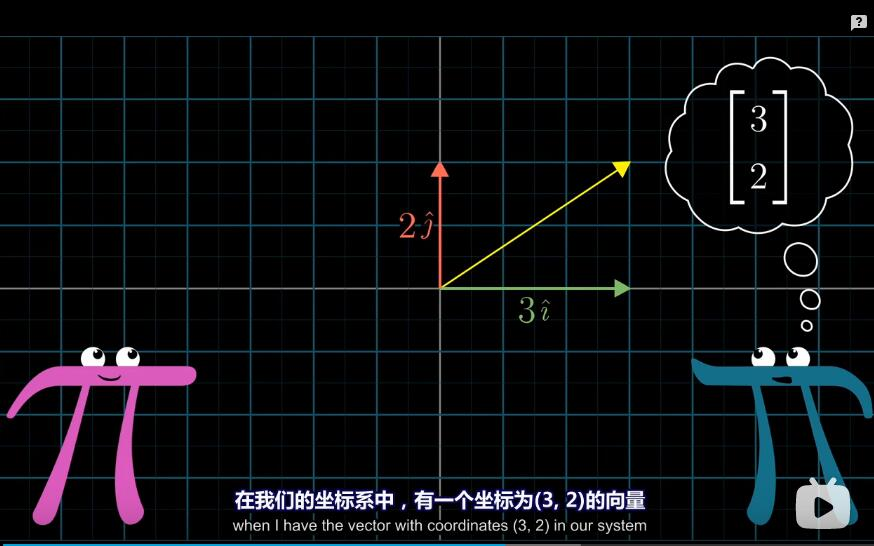

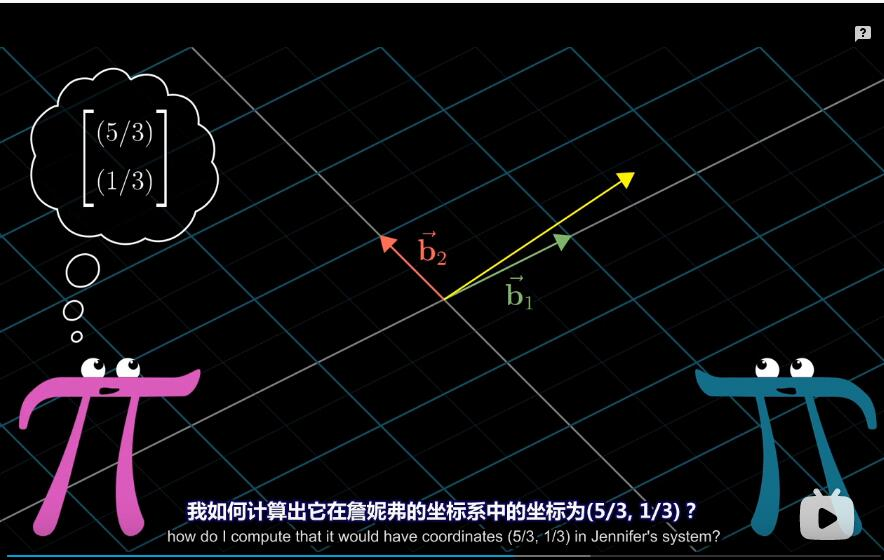

```
在我们坐标系中，有一个坐标为(3,2)的向量，
我如何计算出它在路人A的坐标系中的坐标为(5/3,1/3)？

你可以看第二张图, 线性变换到 第一张图,(这个操作简称为矩阵A)
然后因为3,2是第一张图的3,2;
所以3,2是把矩阵A作为基向量而表示的坐标;
所以 我们用 矩阵A *(3,2) 就是路人A的向量了。

因为矩阵A是指 路人A的基向量变换为我们的基向量，
所以 就是我们的基向量变换为路人A的基向量的 矩阵的逆;
```

```
路人A表示的向量坐标(2,3) ——> 我们的向量坐标

路人A的向量坐标 = 2*i + 3*j

1、首先我们要表示路人A的基向量;(其实是一个线性变换矩阵)
2、因为2,3 只是放大了 路人A的基向量;所以我们把 矩阵*(2,3)就是我们的向量坐标

我们的向量坐标(2,3) ——>  路人A表示的向量坐标(2,3) 
我们的向量坐标 = 2*i + 3*j

1、首先路人A要在他的坐标系中表示我们的基向量;(其实是一个线性变换矩阵)
2、因为2,3只是我们的基向量的缩放;所以路人A只要把 矩阵*(2,3)就是路人A的向量坐标


比如说，如果路人A用坐标(-1,2)描述一个向量，
那么这个向量在我们坐标系中如何描述？

从我们的角度来看,b1的坐标为(2,1)，b2的坐标为(-1,1),
所以实际上，我们可以直接计算-1乘以b1 加上 2乘以b2,


如果是我们用坐标(-1,2)描述一个向量呢,
其实就是 -1*i, 2*j
那么这个向量在路人A坐标系中如何描述?

从路人A的角度来看，i 和 j的坐标为...
所以实际上，我们可以直接计算 ...*-1, ...*2;
```

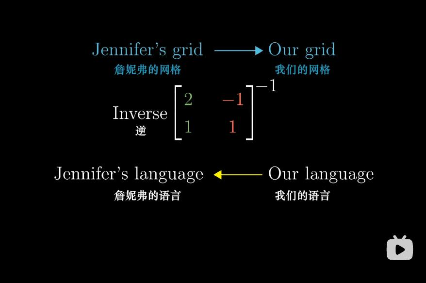

```
之前的基变换矩阵从路人A的语言转换到我们的语言，
你就此入手，取这个矩阵的逆。
```

```
以上就是如何在坐标系之间对单个向量的描述进行互相转换，
一个矩阵的列代表的是路人A的基向量，却是用我们的坐标来描述，
对于一个向量，这个矩阵将她的语言描述转换为我们的语言描述，

逆矩阵则与之相反。
```


```
不过，向量并不是唯一用坐标表示的东西，

前面在说向量的在不同基变换;
下面说矩阵在不同的基向量;

重要的是，接下来的内容里，你需要熟悉矩阵代表线性变换，
以及矩阵乘积对应于线性变换复合这两点，
```

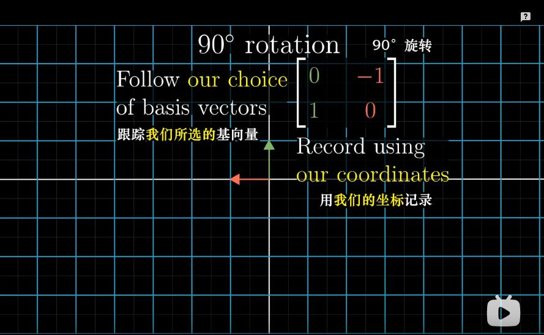

```
考虑某个线性变换，比如逆时针旋转90，
你我用矩阵代表它的时候，我们是在跟踪i帽和j帽的去向，
i帽在变换后处于 0,1，而j帽在变换后处于坐标(-1,0)
这些坐标也就成为了矩阵的列，
但是这种表示与我们对基向量的选择密切相关，
因为我们跟踪的是i帽和j帽，
```

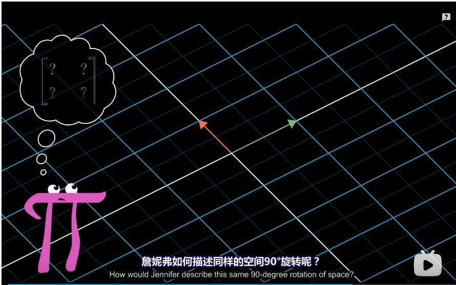

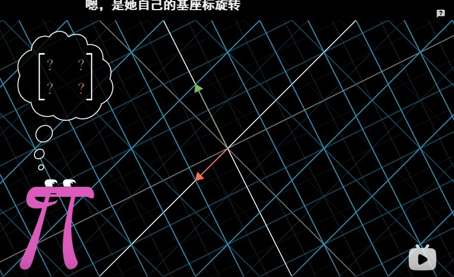

```
路人A如何描述同样的空间90旋转呢？

你可能会尝试直接将旋转矩阵的列转换成用路人A的语言描述，
但是这样不行，
这些列代表的是i帽和j帽的去向，
但是路人A想要的矩阵需要代表她的基向量的去向，
并且是用她的语言来描述，

可以这样想，0,1 -1,0 代表的是基向量的旋转90后的基向量的值，
但是路人A的基向量网格可能并不是垂直的，所以 路人A的 0,1 -1,0 可能并不是90°。
```

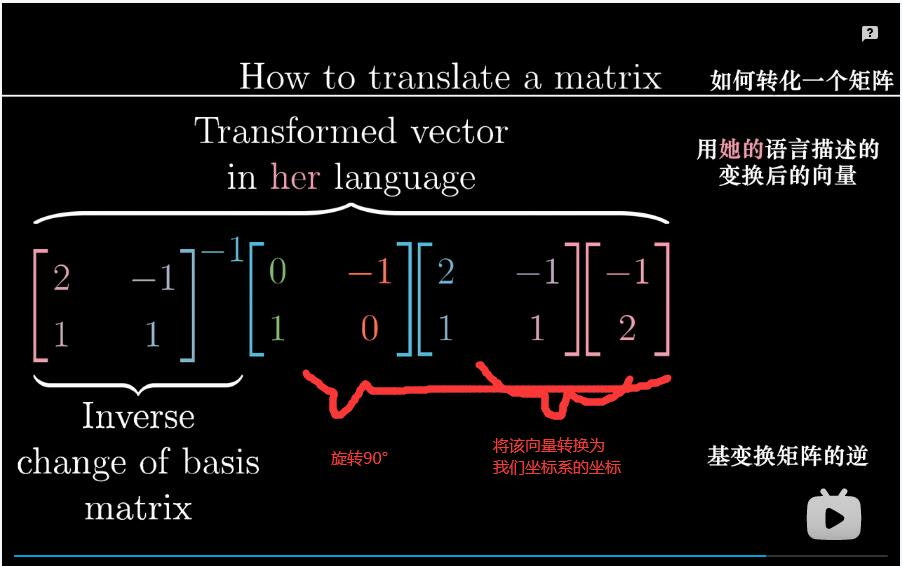

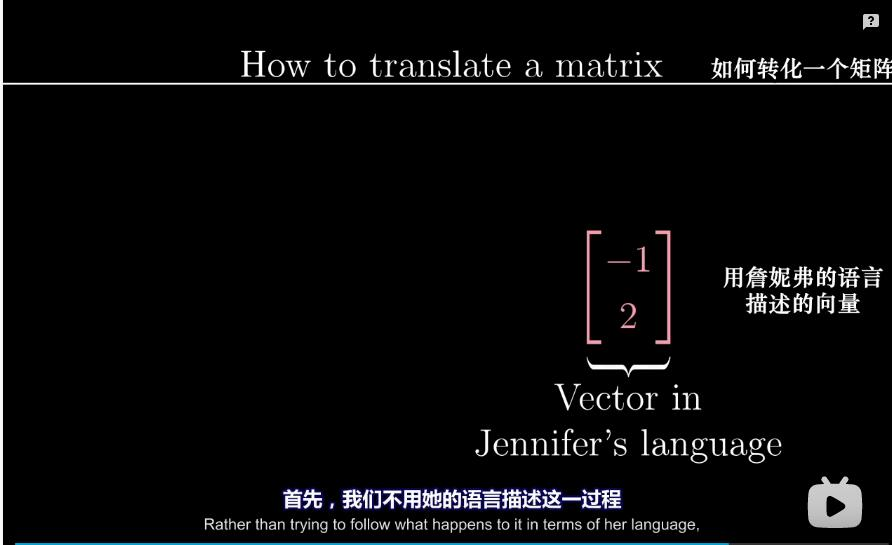

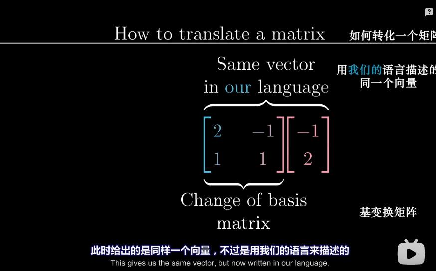

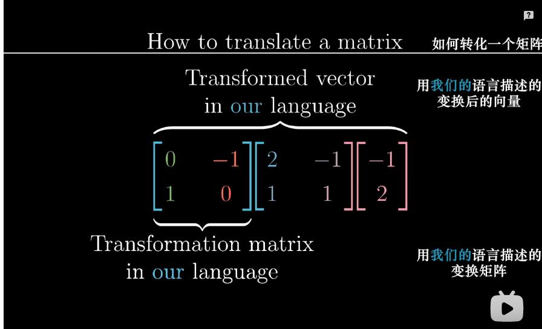

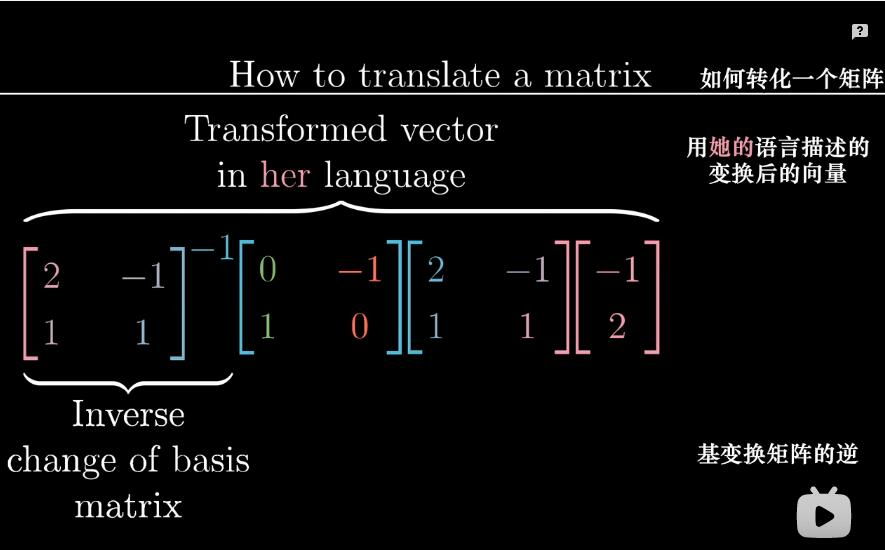

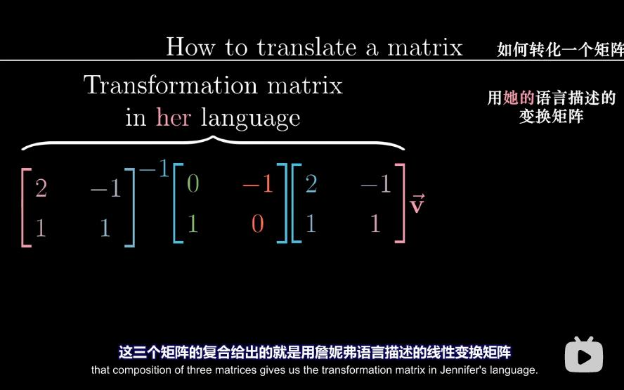

```
这个过程通常是这样的，
从路人A的语言描述的任一向量出发，
首先，我们不用她的语言描述这一过程，

而是用基向量矩阵转换为用我们的语言描述，
这个矩阵的列代表的是用我们的语言描述的她的基向量，
此时给出的同样是一个向量，不过是用我们的语言描述的，

然后，将所得结果左乘线性变换矩阵，
此时给出的是变换后的向量，但仍然是用我们的语言来描述的，

到最后一步，
像之前一样将所得结果左乘基变换矩阵的逆，
从而得到变换后的向量，然后是用路人A的语言来描述的，
```

```
因为我们能够对路人A语言描述的任一向量做同样的事，
首先应用基变换，
然后应用线性变换，
最后应用基变换的逆，
这三个矩阵的复合给出的就是用路人A语言描述的线性变换矩阵，
它接收路人A语言描述的向量，
并输出用路人A语言描述的变换后的向量，
```

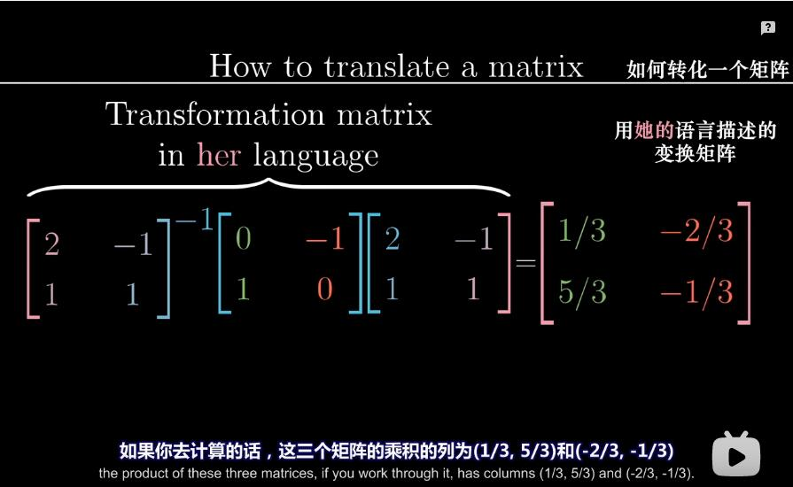

```
对于目前的例子而言，
路人A的基向量用我们的语言来描述，是(2,1)和(-1,1),
线性变换是90°旋转，
如果你去计算的话，这三个矩阵的列为...(看图);

所以，如果路人A用这个矩阵与她坐标系中的一个向量相乘，
结果就是在她坐标系中描述的该向量旋转90°的结果。
```

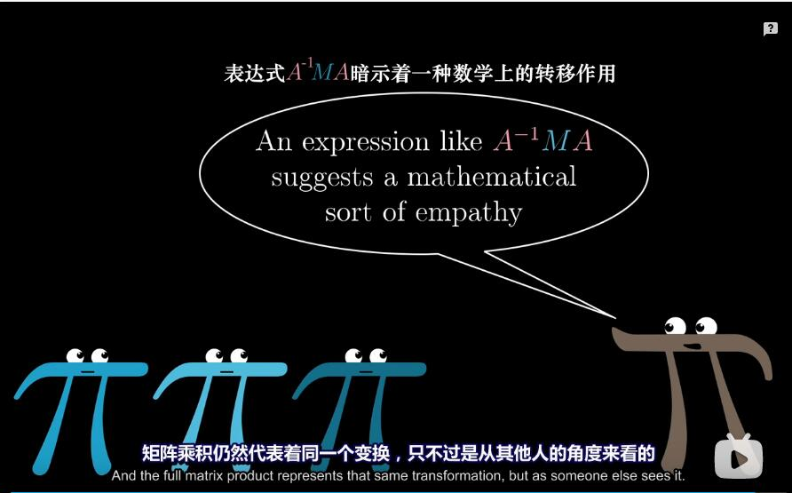

```
总的来说，每当你看到这样一个表达式:
A逆乘以M乘以A，
这就暗示着一种数学上的转移作用，
中间的矩阵代表一种你所见的变换，
而外侧两个矩阵代表着转移作用，也就是视角上的转化，


矩阵乘积仍然代表着同一个变换，只不过是从其他人的角度来看的。
```


