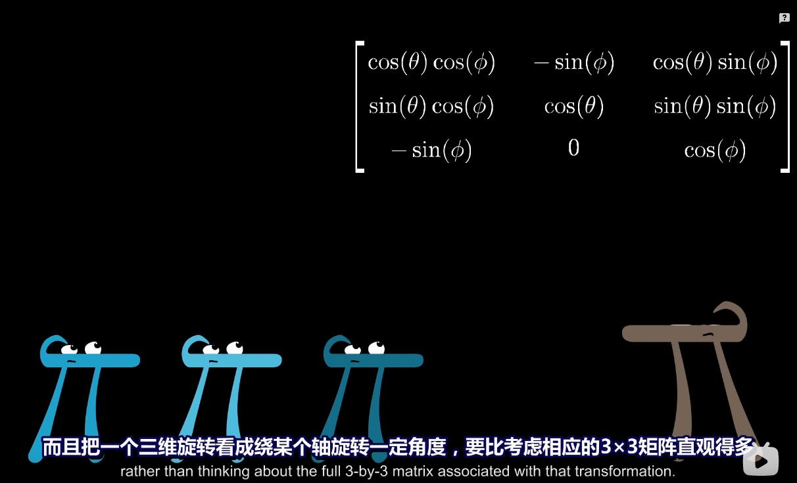

##  特征向量

```
特征向量与特征值 是许多学生认为非常不直观的一个话题，

"为什么要这么做"以及"它究竟意味着什么"之类的问题，
通常都淹没在计算的海洋中无人问津，
我怀疑原因并不在于特征的东西特别复杂或缺乏说明，
实际上，相对而言它更加直接，
而且我认为大部分的书也提供了良好的解释，
```


```
问题在于，只有对之前讲的内容有充分的几何直观，你才能真正理解它，
这里最重要的是，你需要了解如何将矩阵看作线性变换，

但你也需要熟悉其他的内容，例如行列式、线性方程组和基变换，
通常而言，对特征的东西感到疑惑，更多的是因为以上内容的薄弱基础，
而不是在于特征向量与特征值本身，
```


```
首先，考虑二维空间中的某个线性变换，
比如现在展示的这个，
它将基向量i帽变换到坐标(3,0)，j帽变换到坐标(1,2)
所以如果用矩阵来表达，它的列就是(3,0)和(1,2),

我们关注它对一个特定向量的作用，
并且考虑这个向量张成的空间，也就是通过原点和向量尖端的直线，

大部分向量在变换中都离开了其张成的空间，
我的意思是，如果向量正好落在这条直线上，感觉更像是巧合，

不过，某些特殊向量的确留在它们张成的空间里，
意味着矩阵对它的作用仅仅是拉伸或者压缩而已，
如同一个标量。
```


```
在这个例子中，基向量i帽就是这样一个特殊向量，
i帽张成的空间是x轴，而且从矩阵的第一列可以看出，
i帽变成了原来的3倍，仍然留在x轴上，

此外，因为线性变换的性质，
x轴上的任何其他向量都只是被拉伸为原来的3倍，
因此也就留在它们张成的空间里，
```


```
有一个略显隐蔽的向量(-1,1)，它在变换中也留在自己张成的空间里，
最终被拉伸为原来的2倍，

同上，线性性质暗示着一点，
处在它所张成的对角线上的其他任何一个向量，
也仅仅被拉伸为原来的二倍，

对这个变换而言，
以上就是所拥有这一特殊性质(留在它们张成的空间里)的向量，
x轴上的向量被拉伸为原来的3倍，
而这条对角线上的向量被拉伸为原来的2倍，

任何其他向量在变换中都有或多或少的旋转，
从而离开它张成的直线，

估计你已经猜到了，这些特殊向量就被称为变换的"特征向量"，
每个特征向量都有一个所属的值，被称为"特征值"。
即衡量特征向量在变换中拉伸或压缩比例的因子，


特征向量：
对于这个变换而言，向量在变换后并没有离开自己在变换前张成的空间，这种向量就被称为特征向量。

特征值：
	特征向量在变换后被缩放的值。
```


## 特征值可以为负


```
当然，拉伸和压缩或者特征值恰好为正，并没有特殊的地方，

举个例子，你可以有一个属于特征值 -1/2的特征向量，
意味着这个向量被反向，并且被压缩为原来的1/2，

但重点在于，它停留在它张成的直线上，并未发生旋转，
```


## 特征向量在三维上的用途





```
若想知道为什么它有用途并且值得研究，
那就考虑一个三维空间中的旋转，
如果你能找到这个旋转的特征向量，
也就是留在它张成的空间里的向量，
那么你找到的就是旋转轴，

而且把一个三维旋转看成绕某个轴旋转一定角度，
要比考虑相应的3x3矩阵直观的多，

顺便一提，在这种情况下，相应的特征值必须为 1，
因为旋转并不缩放任何一个向量，
所以向量的长度保持不变，
```

## 特征向量和特征值计算思想

```
对于任一矩阵描述的线性变换，
你可以通过将矩阵的列看作变换后的基向量来理解它，
但是，理解线性变换作用的关键往往较少依赖于你的特定坐标系，

更好的方法是求出它的特征向量和特征值.
```


```
用符号表示的话，以下就是特征向量的概念。

A是表示某个变换的矩阵，
v是特征向量，
λ 是一个数，也就是对应的特征值，

这个等式是说，矩阵向量乘积，也就是A乘以v,
等于特征向量v乘以某个数，

因此求解矩阵A的特征向量和特征值，
实际上就是求解使得这个等式成立的向量v和数 λ。
```


```
乍一看，求解这个等式有些棘手，
因为等号左侧代表的是矩阵向量乘积，
但是等号右侧代表的是向量数乘，


所以我们首先将等号右侧重写为某个矩阵向量乘积，
其中矩阵的作用效果是将任一向量乘以 λ。

这个矩阵的列代表着变换后的基向量，
而每个基向量仅仅与 λ 相乘。
所以这个矩阵的对角元均为 λ，其余位置都是 0。

通常的书写方法是提出因子 λ，写作λ乘以 I;

这里的 I 就是单位矩阵，对角元均为 1,
现在两侧都是矩阵向量乘积的形式，
我们就能将等号右侧的东西移到左侧，然后提出因子 v.

现在我们得到的是一个新的矩阵 - A减去 λ乘以单位矩阵，
我们就寻找一个向量v，使得这个新矩阵与v相乘结果为零向量，
如果v本身就是零向量的话，这个等式恒成立。

我们想要的是一个非零特征向量，
当仅当矩阵代表的变换将空间压缩到更低的维度时，
才会存在一个非零向量，使得矩阵和它的乘积为零向量，
而空间压缩对应的就是矩阵的行列式为零，
```


```
举个例子，假设你有一个矩阵，列为(2,1)和(2,3),

考虑每个对角元都减去某个变量 λ，
现在想象一下，逐渐调整 λ 的值，
当λ的值改变时，
矩阵本身发生改变，因此行列式也在改变，
目标在于找到一个λ使得这个行列式为零，
也就是调整后的变换将空间压缩到一个更低的维度上，
在这个例子中，λ等于1时恰到好处，

当然，如果我选择其他的矩阵，
特征值不一定是1，λ取其他值时才能使行列式为零，
这看起来有点复杂，不过我们来解释这个过程的意思。

当λ等于1时，A减去λ乘以单位阵将空间压缩到一条直线上，
这意味着存在一个非零向量v,
使得A减去λ乘以单位阵的结果乘以v等于零向量。

记住一点，我们关注它，是因为它意味着A乘以v等于λ乘以v,
也就是手向量v是A的一个特征向量，
在变换中停留在它张成的空间里，

在这个例子中，v对应的特征值是1，所以它实际上保持不变，
```

### 例子


```
为了了解这个过程，我们重温一下视频开头的例子，
这个矩阵的列是(3,0)和(1,2),
为了求解特征值 λ，
将矩阵的对角线减去λ，然后计算行列式，

这样我们就得到了一个关于λ的二次多项式(3-λ)(2-λ),

只有当这个行列式为零时，λ才会是特征值，
你就能推断出，所有可能的特征值是λ等于2和λ等于3。

为了求出属于某个特征值的特征向量，比如λ等于2，
将λ的值带入矩阵中，
然后求解出在这个对角线变化的矩阵变换后成为零的向量。

为什么上面的操作可以求出这个特征值所属的特征向量？
因为(A-λI)*v = 0;之前推出来的这个公式
v不就是特征向量嘛;

如果进行计算，如同求解其他线性方程组一样，
你会发现所有的解全部落在由向量(-1,1)张成的对角线上，
与之对应的，就是原始的矩阵(3,0)(1,2)将这些向量拉伸为原来的2倍。
```

## 旋转矩阵的特征向量


```
不过，二维线性变换不一定有特征向量，
举个例子，考虑这样一个90度的旋转，
它并没有特征向量，因为每一个向量都发生了旋转并离开了其张成的空间，

如果你真的尝试去计算它的特征值，注意一下会发生什么，

矩阵的列为(0,1)和(-1,0),
对角元减去λ后，然后寻找行列式为0的情形，
在这个例子中，你会得到多项式λ^2 + 1,
这个多项式的根只能是 虚数 i与-i，

没有实数解表明它没有特征向量，
```


## 剪切矩阵的特征向量


```
另一个很有意思并且值得思考的例子是剪切变换，
它保持i帽不变，将j帽向右移动一个单位，
所以矩阵的列为(1,0)和(1,1),
所有x轴上的向量都是属于特征值1的特征向量，因为它们都保持不变，
实际上，这些就是所有的特征向量，
当你将对角元减去λ，然后计算行列式，
你得到的是(1-λ)^2,
这个多项式唯一的根是λ等于1，

这和几何上得到的"所有特征向量均属于特征值1"的结果一致，
```

## 属于单个特征值的特征向量可以不止在一条直线上


```
可能会出现只有一个特征值，但是特征向量不止在一条直线上的情况。
```


```
一个简单的例子试讲所有向量变为两倍的矩阵，
唯一的特征值是2，但是平面内每一个向量都是属于这个特征值的特征向量，
```


## 特征基


```
如果我们的基向量恰好是特征向量，来看看会发生什么，
比如说，可能i帽变为原来的(-1)倍，j帽变为原来的2倍，
将它们的新坐标作为矩阵的列，
注意，它们的倍数-1和2，也就是i帽和j帽所属的特征值，
位于矩阵的对角线上，而其他元素均为0，
```


```
除了对角元以外其他元素均为0的矩阵被称为对角矩阵，这非常合理，
解读它的方法是，所有基向量都是特征向量，
对角元是他们所属的特征值，
```


```
对角矩阵在很多方面都更容易处理，
其中一个更重要的方面是，矩阵与自己多次相乘的结果更容易计算，
因为对角矩阵仅仅让基向量与某个特征值相乘，
所以多次应用矩阵乘法，比如100次，
也只是将每个基向量与对应特征值的100次幂相乘，

相比较下，尝试计算一个非对角矩阵的100次幂，
真的去试试看，这就是场噩梦，
```


```
当然对于基向量同时也是特征向量的情况，你很可能不像它那么幸运，
但是如果你的变换有许多特征向量，就像视频开始时的例子一样，
多到你能选出一个张成全空间的集合，
那么你就能变换你的坐标系，使得这些特征向量就是基坐标，

我们可以用基变换来将 特征向量转变为基坐标，
取出你想用作新基的向量的坐标，
在这里指的是两个特征向量， 

然后将坐标作为一个矩阵的列，这个矩阵就是基变换矩阵，
在右侧写下基变换矩阵，
在左侧卸下基变换矩阵的逆，
当你将原始的变换夹在两个矩阵中间时，
所得的矩阵代表的是同一个变换，
不过是从新基向量所构成的坐标系的角度来看的，

用特征向量来完成这件事的意义在于，
这个新矩阵必然是对角的，并且对角元为对应的特征值，
这是因为，它所处的坐标系的基向量在变换中只进行了缩放，

一组基向量(同样是特征向量)构成的集合被称为一组"特征基"，这也非常合理。

所以，如果你要计算这个矩阵的100次幂，
一种更容易的做法是先变换到特征基，
在那个坐标系中计算100次幂，
然后转换回标准坐标系，
```


```
不是所有变换都能进行这一过程，
比如剪切变换，它的特征向量不够多，并不能张成全空间，
但是如果你能找到一组特征基，矩阵运算就会变得非常轻松，
```


