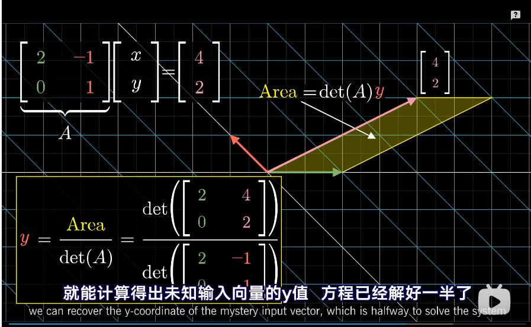

```
在之前的视频，我们曾讨论过线性方程组，
我刻意没有提及它们实际的解法，
虽然这些单纯的数字计算完全可以留给计算机完成，
但是，深入了解这些计算方法是一个很好的途径，
来检验你是否透彻了解了具体的细节，
因为这连接着理论和实际，
今天要说的 是其中一个计算法则背后的几何原理，
这个方法叫克莱姆法则。
```

```
但是是先我要说明，克莱姆法则并不是计算线性方程组最好的方法，
比如高斯消元法，会算的更快。
```


```
好，那么我们从一些线性方程组讲起，
这里有x和y两个未知数 和两个方程式，
原则上 只要未知数和方程的个数一样，
我们所说的都适用。

我们可以把这个方程组看作对[x;y]向量的一个已知的矩阵变换，
而且变换后的结果已知，在这里是[-4,-2],

注意 矩阵的列向量反映了矩阵是如何变换的，
分别告诉你基向量变换后的位置，
所以问题变成了，哪个输入向量[x,y]，在变换后会成为[-4,-2],

一种思路是，我们已知的向量，
是矩阵列向量的一个线性组合，
x乘以基向量i 加上 y乘以基向量j，
但是我们希望能准确的计算出x与y的值，
注意，这里的结果取决于矩阵变换是否降维，
也就是说行列式为0，
这种情况下， 要么任何输入向量都不会变换到给定的输出向量，
要么有无数个向量都会变换到给定的向量，
```


```
但在这个视频里，我们将只讨论非零行列式的情况，
意味着线性变换后维数依然相同，
每一个输入向量有且仅有一个输出向量，
且每一个输出向量也仅对应一个输入向量，
```


## 错误演示


```
这个未知输入向量的x坐标，
等于它与第一个基向量[1,0]的点积，
同样，它的y坐标是与第二个基向量[0,1]的点积，

所以也许你希望在矩阵变换后，
变换后的未知向量，与变换后的两个基向量的点积，
也等于原来的x和y坐标，
那样就太完美了，因为这三个变换后的向量都是已知的，
```


```
好了只剩一个问题，这个假设是不成立的，
对大多数线性变换来说，点积会随着变换而改变，

比如说，有两个向量大致指向同一个方向，点积为正，
在变换后被拉远，
像这样它们的点积就变成了负数了，

类似的，就算两个向量互相垂直，点积为零，比如两个基向量，
我们也无法保证它们在变换后依然互相垂直，点积依然为零，
```


```
在这些例子中，点积并不是一定是不变的，
而可能会变大，因为大部分向量被拉伸，
事实上，哪些不改变点积的矩阵变换，
有一个特殊的名字，正交变换，
它们使基向量在变换后依然保持单位长度，且相互垂直，
可以想成是旋转矩阵，

相当于刚体运动，没有拉伸，压缩或变形，
用正交矩阵来求解线性系统非常简单，
因为点积保持不变。
所以已知的输出向量和矩阵的列向量的点积，
分别等同于未知输入向量和各向量的点积，
也就是输入向量的每一个坐标，
因此，在特殊情况下，
x等于第一列向量已知向量的点积，
y等于第二列向量与已知向量的点积，
```


## 用行列式表示

```
虽然这个思路对大多数线性方程组都不成立，
但它给了我们一个方向去思考，
有没有另一种对输入向量坐标值的几何解释，
能在矩阵变换后保持不变呢？

如果你非常熟悉行列式，你可能会想到一个很棒的想法。
```


```
这个有第一个基向量i和未知的输入向量[x,y]组成的并行四边形，
面积是 长度为1的底，乘上与底边垂直的高，
面积也就是 输入向量的y坐标，
因此，我们拐了个弯，用这个平行四边形的面积来表示y值，
更准确的来说，你应该考虑这个平行四边形的有向面积，
如果向量的y坐标为负，则四边形面积也为负，
前提是你把基向量i放在第一位来定义平行四边形，

x同理
```


```
好了，为什么要把坐标值和面积或体积联系起来呢？
因为当你做矩阵变换后，
平行四边形的面积不一定保持不变，
可能成比例增大或减小，
但注意！这正是行列式的关键，
所有面积伸缩的比例都是一样的，
都等于给定的变换矩阵的行列式。
```





```
比如考虑一个新的平行四边形，
第一条边是变换后的第一基向量，(也就是矩阵的第一列),
第二条边是变换后的(x,y)，那它的面积是多大呢？

其实这就是我们之前提及的平行四边形的变换，
而变换前，面积是未知输入向量的y的坐标值，
所以变换后的面积等于矩阵的行列式乘以y值，

所以可以用输出的平行四边形面积，除以矩阵的行列式计算出y,
那么怎么计算出面积呢？

既然我们已知最终变换后的向量，
毕竟这是一个线性方程组，
那么，可以构造一个新矩阵，第一列和我们原先的矩阵相同，
而第二列是输出向量，然后取新矩阵的行列式，
你看我们只需要使用到变换后的两个向量，
也就是矩阵的列向量和已知输出向量，
就能计算得出未知输入向量y的值，方程已经解好一半了。

x同理。

思路：
首先我们可以利用行列式 在矩阵变换后的比例一样;
可以先用已知变换前的向量和基向量来构成一个平行四边形;
这个平行四边形的底是基向量就是1; 高就是垂直基向量的值;
也就是变换前的向量的(x或y),
这个平行四边形和基向量构成的行列式的比例为(x或y)，

那么变换后的向量和基向量构成的平行四边形的面积和变换后的基向量构成的行列式的比例是不是也是(x或y)呢？
这样就求出了xy的值。
```


