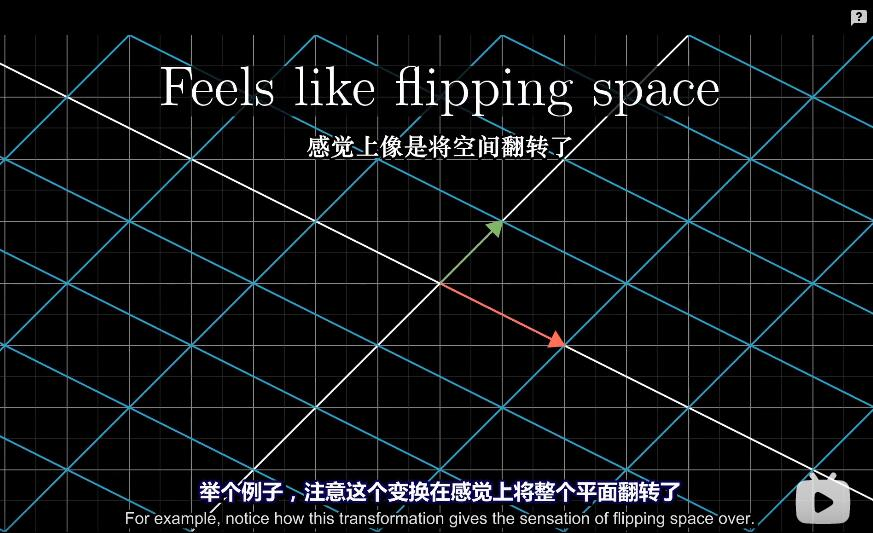
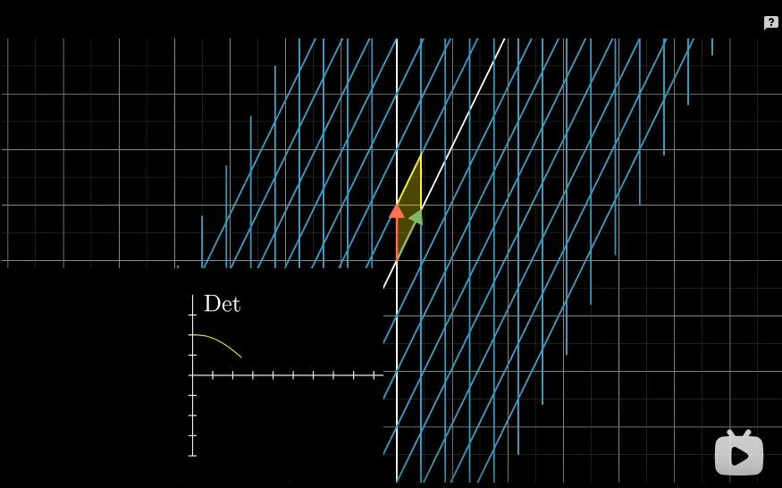
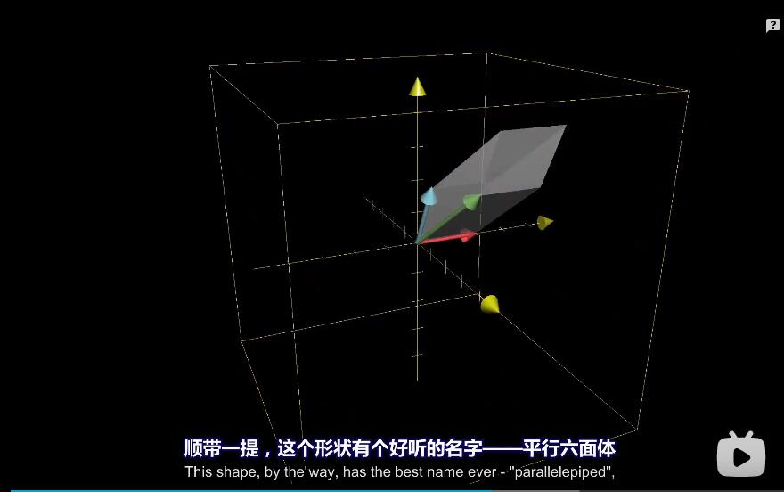
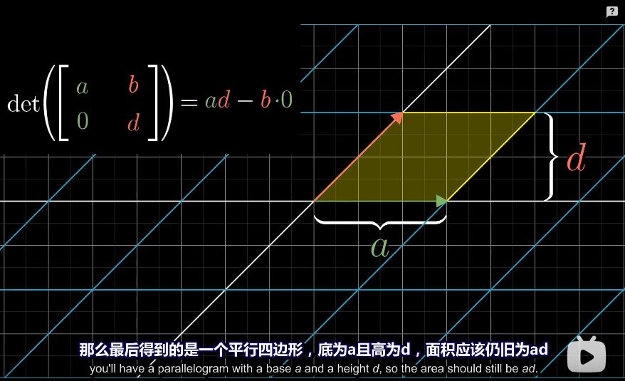
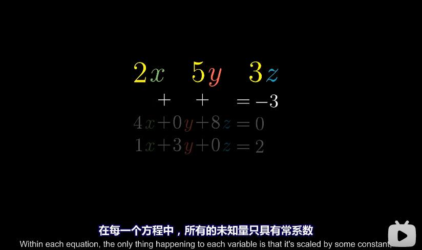
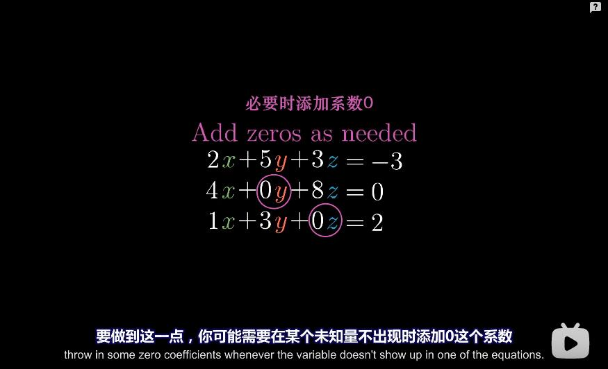
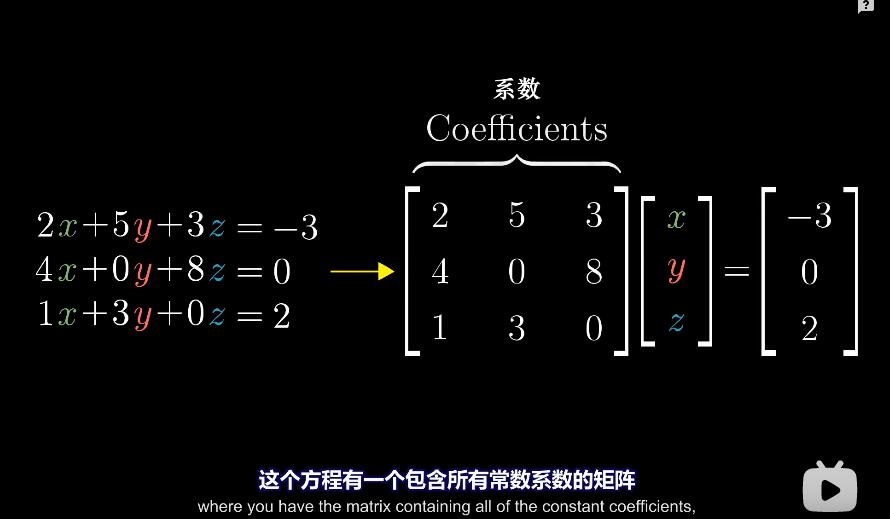
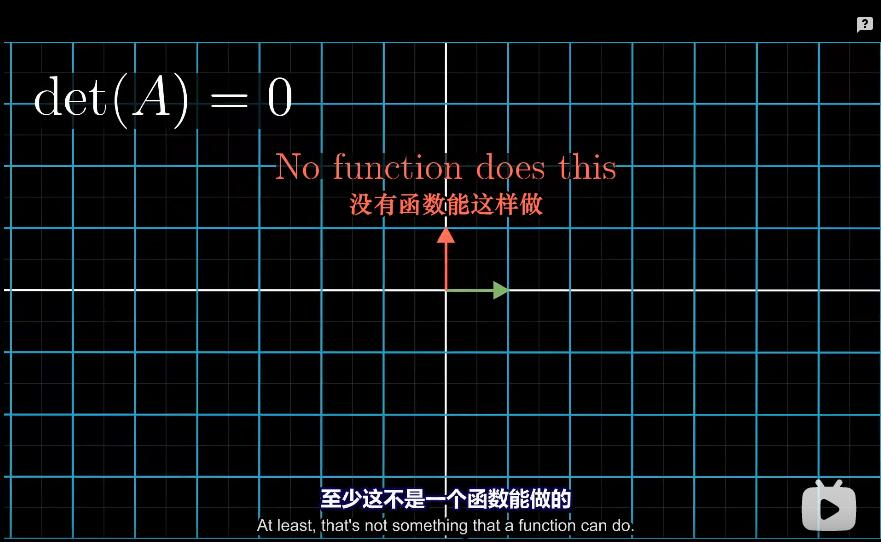

```
除了零行列式之外，我们还有特定术语来描述它们，
当变换的结果为一条直线时，也就是说结果是一维的，
我们称这个变换的秩为1，
如果变换后的向量落在某个二维平面上，
我们就称这个变换的秩为2，
所以说"秩"代表着变换后空间的维数，
```

### 列空间


```
不管是一条直线、一个平面还是三维空间等，所有可能的变换结果的集合，被称为矩阵的"列空间"。
```


```
矩阵的列告诉你基向量变换后的位置，
这些变换后的基向量张成的空间就是所有可能的变换结果，
换句话说，列空间就是矩阵的列所张成的空间。
所以更精确的秩的定义是列空间的维数。

```

## 满秩


```
当秩达到最大值时，意味着秩与列数相等，
我们称之为“满秩”。
```


## 向量是什么？

```
一般来说，有三种看待向量的观点，看似不同却有所关联
```


```
1、物理专业学生的向量是空间的箭头，决定一个向量的是它的长度和它所指的方向。
但是只要以上两个特征相同，你就可以自由移动一个向量而保持它不变。

2、从计算机专业的学生的角度看，向量是有序的数字列表

3、数学专业的学生 向量可以是任何东西，只要保证两个向量相加以及数字与向量相乘是有意义的即可。
```


```
向量加法和向量数乘贯穿线性代数始终，二者起着很重要的作用。


```


```
|-2|
|3 |
这对数指导你如何从原点(向量起点)出发到达它的尖端(向量终点)。

第一个数-2 告诉你沿着X轴走多远。
第二个数3 告诉你沿着Y轴走多远。

为了把向量
|-2|
|3 |
-2,3
和点(,)区分开;
惯用的方法是把这对数竖着写，然后用方括号括起来

每一个对数对应一个向量；
一个向量对应一个对数
```

```
向量相加是把 两个向量的 x y 都相加起来; 变成一个新的对数；
我们可以把每个向量看作一种特定的运动,即在空间中朝着某个方向迈出一定距离。
所以你可以把向量看作它描述了一种运动方式；

向量加法
|x1| + |x2| = |x1+x2|
|y1|   |y2|   |y1+y2|
```

```
向量数乘
就是把向量缩短或增长
+是正向 -是将其反向
这种拉伸或压缩，有时又使向量反向的过程称为 "缩放"scaling
几何角度看湿缩放，实际上就是数乘

而我们选择的 2、1/3、-1.8 或其他任何数，
他们用于缩放向量，被称为"标量" scalar

数字在线性代数中起到的主要作用就是缩放向量。
所以"标量"和"数字"两个词通常在这里可以互相替换

n*|x| = |nx|
  |y|   |ny|
```

```
线性代数 主要体现在它能够在各种计算中互相转换，

线性代数为数据分析提供了一条将大量数据列表概念化、可视化的渠道。
它让数据样式变得非常明晰，并让你大致了解特定运算的意义。

另一方面，线性代数给物理学家和计算机图形程序员提供了一种语言。
让他们通过计算机能处理的数字来描述并操控空间。
```


## 线性组合 张成的空间 基


```
当你看到一对描述向量的数时，比如(3,-2),
我想让你将每个坐标都看作标量,也就是说它们如何拉伸或压缩一个向量。
在x,y坐标系中，有两个非常特别的向量， 
一个指向正右方，长度为1，通常被称为"i帽"或者x方向的单位向量。
另一个指向正上方，长度为1，通常被称为"j帽"或者y方向的单位向量。
```


```
现在我们想象 向量(3,-2)的x坐标是一个标量，
它将i帽拉伸为原来的3倍
将j帽反向并拉伸为原来的 2 倍

从这个角度去看，这个向量实际上是两个经过缩放的向量的和。
缩放向量并相加 这一概念至关重要
```


#### 基向量


```
i帽和j帽两个向量有这特殊的名称，它们合起来被称为坐标系的基。

这是在说，当你把坐标看作标量时，基向量实际上就是这些标量缩放的对象。
```

```
当我们根据这两个特殊的基向量构建坐标系时，也浮现了一个有趣而微妙的问题，如果我们选择不同的基向量会怎么样？

我们完全可以选择不同的基向量，获得一个合理的新坐标系。

每当我们用数字描述向量时，它都依赖于我们正在使用的基。
```


#### 线性组合


```
两个数乘向量的和被称为这两个向量的线性组合。  
av + bw 是 v与w的线性组合; a和b 是标量。
```


#### 张成的空间


```
v与w全部线性组合构成的向量集合称为"张成的空间"

两个向量张成的空间实际上是问 仅通过向量加法和向量数乘这两种基础运算，你能获得的所有可能向量的集合是什么。
```


#### 怎么看待向量

```
单个向量看作箭头
多个向量看作点
```

#### 线性相关


```
如果一组向量中至少有一个是多余的，没有对张成空间做出任何贡献。
你有多个向量，并且可以移除其中一个而不减少张成的空间。
当发生这种情况时，我们称它们是"线性相关"的。

这里的多个 和所有向量 都是指的是 对数；

也可以这样说 一个向量和一组中的一个向量共线，该组向量我们就称之为线性相关
```


#### 线性无关


```
如果所有的向量都给张成的空间增添了新的维度。
它们就被称为是线性无关的。
```


#### 基的严格定义


```
空间的一组基的严格定义是这样的：张成该空间的一个线性无关向量的集合。

应该可以理解为 所有线性无关的向量集合 都可以被称为基
或者是空间里面的一组基 就是张成该空间的一个线性无关的向量集合？

向量空间的一组基是张成该空间的一个线性无关向量集
```


## 矩阵和线性变换

### 线性变换

```
本质就是 输入一对变量 输出一对变量
变换 其实就是函数。

线性变换这个变换 这个词在暗示你用运动去思考
那么我们怎么理解整个变换呢？
我们可以想象每一个输入向量都移动到对应输出向量的位置。
```


```
线性代数限制在一种特殊类型的变换上，这种变换更容易理解，称为"线性变换"。
直观的说，如果一个变换具有以下两条性质，我们就称它是线性的。
1、直线在变换后仍然保持为直线，不能有所弯曲。
2、原点必须保持固定
```


举几个不是线性变换的例子


```
总的来说，你应该吧线性变换看作是"保持网格线平行且等距分布"的变换
```


### 数值描述线性变换

```
部分线性变换很容易思考，比如关于原点的旋转。
部分能难思考

我们如何用数值描述线性变换？
```


```
实际结果是，你只需要记录两个基向量i帽和j帽变换后的位置。其他所有的向量都会随之而动。 
```

例子


```
如果我们运用一些变换，并且跟随这三个向量的运动，
根据网格线保持平行且等距分布的性质有一个重要的推论.
因为网格线保持平行且等距分布;所以变换只是将其i帽 j帽缩放。

所以变换后的向量v的位置,是-1与变换后的i帽之积，加上2与变换后的j帽之积。
换句话说，向量v是i帽和j帽的一个特定线性组合。
那么变换后的向量v也是变换后i帽和j帽的同样的线性组合。

这意味着你可以值根据变换后的i帽和j帽，就可以推断出变换后的v.
```

```
我们只需要记录变换后的i帽和j帽，我们就可以推断出任意向量在变换之后的位置。而完全不用关心变换的过程
```


```
以上内容是在说，一个二维线性变换仅由四个数字完全确定

变换后的i帽的两个坐标和变换后的j帽的两个坐标
```


```
通常我们将这些坐标包装在一个2x2的格子中，称它为2x2矩阵。
你可以把它的列理解为两个特殊的向量，即变换后的i帽和j帽。

照这样的描述来说 矩阵就是描述线性变换的东西，
矩阵里面的两个列装着线性变换的结果 i和j帽。
```

```
如果你有一个描述线性变换的2x2矩阵，以及一个给定的向量。
```


### 列线性相关


```
这里的倍数指的是进行向量数乘;

其中一个向量是另一个向量的倍数，那么这个线性变换将整个二维空间挤压到它们所在的一条直线上，也就是两个线性相关向量所张成的一维空间。
```


总之

```
线性变换是操纵空间的一种手段，它保持网格线平行且等距分布，并且保持原点不动

令人高兴的是，这种变换只需要几个数字就能描述清楚。
这些数字就是变换后的基坐标，以这些坐标为列所构成的矩阵为我们提供了一种描述线性变换的语言。 
而矩阵向量乘法就是计算线性变换作用于给定向量的一种途径。

这里最重要的一点是，每当你看到一个矩阵时，你都可以把它解读为对空间的一种特定变换。
一旦真正消化了这些内容，你就在深刻理解线性代数上占据了极佳的位置。
```


## 矩阵乘法与线性变换复合


#### 线性变换复合


```
这个新的线性变换通常被称为前两个独立变换的"复合变换"
```


```
两个矩阵相乘有着几何意义，也就是两个线性变换相继作用，
```


#### 矩阵乘法


```
这里第一个矩阵变换后的基坐标是 efgh;
我们可以将eg 和 fh 想象成是一个普通的向量;然后继续使用 abcd 进行线性变换;
首先 
|a b| |e| = |ae bg| = |ae+bg|
|c d| |g|   |ce dg|   |ce+dg|
这里首先对acbd进行线性组成
线性组成就是对向量x,y进行和标量(eg)数乘;然后相加形成新的向量;

先对(a,c)*e 然后 (bd)*g 然后 (a,c)*e+(bd)*g = 新的向量
这里就对 eg 向量完成了线性变换;

然后同理再对 fh 进行线性变换；


矩阵相加 矩阵相乘
缩放：就是使用标量对向量进行伸长缩短或者反向操作；

线性组合 就是在二维中将两个向量进行数乘然后相加;
基坐标：基坐标的出现就可以把所有向量都想象成是标量;都是对基坐标的缩放; 
张开的空间：就是一组向量所有有可能的线性组合的集合就是张开的空间
张开的空间其实就是问这组向量仅用向量相加和向量相乘可以变换出多少向量.

基坐标的严格定义 一组基坐标就是空间中所有线性无关张开的空间的向量集合。

线性无关：就是一组向量增加或减少随便一个向量都不会减少张开空间的维度
线性相关:如果一组向量中至少有一个是多余的，没有对张成空间做出任何贡献。
你有多个向量，并且可以移除其中一个而不减少张成的空间。

线性变换：
变换是指函数；输入一个向量 就能输出一个向量
线性变换的话有两个前提
1、直线变换后还是直线
2、变换后不能离开原点

```


```
矩阵不满足交换律 但是满足结合律
交换律 ：先旋转90° 再剪切
和先剪切 再旋转90°
是不一样的 可以脑子里想象一下。
```


```
这里先 C 然后(BA)复合变换是一样的;
还是先 CB 在A;
因为其实没有任何变化

这里我们可以把C当做是要变换的向量;
然后AB 是变换矩阵;
那么其实是一样的；因为变换的顺序并没有变过。
这里其实就是AB要不要先变成复合变换
```


## 05、行列式


```
行列式表示的就是这个线性变换后的面积;
```


```
无论一个方格如何变换，对其他大小的方格来说，都或有相同的变换，这是由“网格线保持平行且等距分布”这一事实推断得出的。
```


```
这个特殊的缩放比例，即线性变换改变面积的比例，被称为这个变换的行列式
```

### 行列式为0


```
如果一个二维线性变换的行列式为0，说明它将整个平面压缩到一条线，甚至一个点上，因此此时任何区域的面积都变成了0。

这个例子相当重要，
这就是说只要检验一个矩阵的行列式是否为0，我们就能了解这个矩阵所代表的的变换是否将空间压缩到更小的维度上。

```


### 行列式负值




```
这和定向的概念有关，
举个例子，注意这个变换在感觉上将整个平面翻转了。
如果你将二维空间想象为一张纸，这个变换像是将纸翻转到了另一面，
我们称类似的这样的变换改变了空间的定向。
```


```
另一种方式是根据i帽和j帽来考虑。
注意在初始状态时，j帽在i帽的左边。
如果在变换之后，j帽处于i帽的右边。
那么空间定向就发生了改变。
```


```
当空间定向改变的情况发生时，行列式为负，但是行列式的绝对值依然表示区域面积的缩放比例。
```

### 为什么负的面积与定向改变相关

```
那么，负的面积缩放比例为什么会自然的用来描述定向改变呢？

考虑i帽逐渐接近j帽所形成的一系列变换，
```





```
考虑i帽逐渐接近j帽所形成的一系列变换，
当i帽靠近j帽时，空间也被压缩的更严重，
这意味着行列式趋近于0，当i帽和j帽完全重合时，行列式为0，
如果i帽继续沿着这个方向运动，
行列式继续减小为负值难道不是一件很自然的事吗？
```


### 三维线性变换行列式




```
三维下 行列式给出的是体积缩放比例。

```


```
行列式为0则意味着整个空间被压缩为零体积的东西，
也就是一个平面或一条直线，或者更极端的情况下，一个点。
这就是在说矩阵的列线性相关。
```

### 负值行列式


```
右手法则：
右手食指指向i帽的方向，伸出中指指向j帽的方向，当你把大拇指竖起来时，它就正好指向k帽的方向。

如果在变换后你仍然可以这么做，那么定向没有发生改变，行列式为正。
否则，如果在变换后你只能用左手这么做，说明定向发生了改变，行列式为负。
```


### 怎么计算行列式


```
假设b和c恰好为0，那么a告诉你i帽在x轴方向的伸缩比例，d 会告诉你j帽在y轴方向的伸缩比例。

因为其他项均为0，所以ad给出的是单位正方形伸缩后形成的矩形面积。
```



```
即使b和c其中只有一项为0,那么最后得到的是一个平行四边形，底为a且高为d，面积应该仍然为ad。
```


## 06、逆矩阵、列空间与零空间

### 线性方程组





```
在每一个方程中，所有的未知量只具有常系数。
这些未知量之间只进行加和。
也就是说没有幂次，没有奇怪的函数，没有未知量间的乘积等等。
```








```
你可能注意到了，这和矩阵向量乘法非常相似，
实际上，你可以将所有的方程合并为一个向量方程，
这个方程有一个包含所有常数系数的矩阵
一个包含所有未知量的向量
以及它们乘积所得到的一个常数向量

```


```
矩阵A代表一种线性变换，
所以求解Ax=v 意味着我们去寻找一个向量x，
使得它在变换后与 v 重合

你完全可以只考虑对空间变形，以及变换前后向量的重叠，
就将多个未知量互相混合的复杂方程组印入脑中。
```


```
方程的解依赖于 矩阵A所代表的变换
是将空间挤压到一条线或一个点等低维空间
还是保持像初始状态一样的完整二维空间
```


```
我们将它们分为两种情况：
A的行列式为零和A的行列式不为零
```


#### 1、行列式不为零的情况


```
在这种情况下，有且仅有一个向量(在变换后)与v重合，
并且你可以通过逆向进行变换来找到这个向量，

```

#### 逆变换


```
当你逆向进行变换时，它实际上对应了另一个线性变换，通常被称为 "A的逆"， 记为 A^(-1).

A逆是满足以下性质的唯一变换，
首先应用A代表的变换，再应用A逆代表的变换，你会回到原始状态，
两个变换相继作用在代数上体现为矩阵乘法，
所以A逆的核心性质在于 A逆乘以A等于一个"什么都不做"的矩阵。

这个"什么都不做"的变换被称为"恒等变换"。
```


```
什么所不做 就是 A^-1 * A 矩阵以后;  
还是保持原点; 就是 i = (1,0) j=(0,1)
其实就是 A逆矩阵 * A矩阵 以后 = 单位向量


可以用矩阵乘法来证明;
一个复合变换 = 两个变换相乘
复合变换的最终变换=(1,0)(0,1);  所以不管这两个变换最终怎么变换结果都是 (1,0)(0,1);

为什么最开始都是  (1,0)(0,1)
因为我们将 (1,0)(0,1) 当做了单位向量

其他所有的向量都是 单位向量的缩放
比如 (4,0)(0,4) 
是基于单位向量的缩放;
如果你要改变单位向量为 (0,1)(1,0); 那么其实 (4,0)(0,4) 这个向量就不是这么表示的了;


为什么A逆矩阵 * A矩阵 以后 = 单位向量
因为  A逆矩阵 * A矩阵  = 什么都不做

什么都不做 就相当于 一个矩阵*一个单位向量。。。

一个矩阵*一个单位向量 =  一个矩阵 * 什么都不做
A逆矩阵 * A矩阵  = 什么都不做

```


```
一旦你找到了A 的逆(实践中你可以用计算机完成)
你就能在两边同乘A的逆矩阵来求解向量方程

```


```
为什么矩阵行列式是零 方程存在无数解呢？
可以想象一下变成0的话 那么就是x,y重叠在了一起；
那么其他所有的向量都会重叠在一起; 所以他们有无数解;
因为所有的向量乘 行列式为0的向量 都会等于 0;

如果矩阵行列式是非零 那么方程存在唯一解
```





```
当 det=0时，与这个方程组相关的变换将空间压缩到更低的维度上，
此时没有逆变换，
你不能将一条线"解压缩"为一个平面，
(因为所有的二维向量都可以压缩到一条直线 
  (1,0)(2,0)(3,0) 如果压缩到一条直线上的话，其实都是压缩到x=0的点上;这个时候你想逆向还原的话，是不可能的;因为你丢失了 y 轴的数据; 就是说所有这个点上的y轴都可以压缩为 x=0 这个点
)

至少这不是一个函数能做的，
这样就会要求将一个单独的向量变换成一整条线的向量，
但是一个函数只能将一个输入变换为一个输出，


这里可以想象你先用一张纸,在纸上的一条直线上 涂满点，然后将其揉成一条线的纸，一条线上的纸的那个点，其实对躺开的纸来说，是一条直线。

没有办法找到这个点是由那个直线上的点压缩而成的。
```


```
如果
A 行列式为0
v 向量正好在直线上
解存在; 

就是说 x 有解;

A行列式为0,V在直线上,那么线性变换可以变换成 v
否则A矩阵这个线性变换无法变换成 V;

因为A没有逆矩阵;
```

### 秩


```
你可能注意到一些零行列式的情况比其他的更加严格

比如说一个3x3的矩阵，
当它将空间压缩为一条直线时，与平面相比，解存在的难度更高了，
即使两种情况下行列式均为零。
除了零行列式之外，我们还有特定术语来描述它们，

当变换的结果为一条直线时，也就是说结果是一维的，
我们称这个变换的秩为1，

如果变换后端的向量落在某个二维平面上，
我们称这个变换的秩为2，
所以说秩 代表着变换后的空间的维数，
```

### 列空间


```
不管是一条直线、一个平面还是三维空间等，所有可能的变换结果的集合，
被称为矩阵的"列空间"。

你大概也猜到了这个名字的来源了吧
矩阵的列告诉你基变量变换后的位置，
这些变换后的基向量张成的空间就是所有可能的变换结果，

换句话说，列空间就是矩阵的列所张成的空间。
所以更精确的秩的定义是列空间的维数
```

### 满秩


```
当秩达到最大值时，意味着秩与列数相等，
我们称之为满秩。
```


### 零向量


```
注意，零向量一定会被包含在列空间中，
因为线性变换必须保持原点位置不变。
对一个满秩变换来说，唯一能在变换后落在原点的就是零向量自身，
(因为是满秩，所以不可能降维，所以只能有一个向量在原点)。

但是对一个非满秩的矩阵来说，它将空间压缩到一个更低的维度上，
也就是说会有一系列向量在变换后成为零向量，

举个例子，如果一个二维线性变换将空间压缩到一条直线上，
那么沿某个不同方向直线上的所有向量就会被压缩到原点。
```

 

```
变换后落在原点的向量的集合，被称为矩阵的"零空间"或"核"，
变换后一些向量落在零向量上，而"零空间"正是这些向量所构成的空，
```

 

```
对线性方程组来说，当向量v恰好为零向量时，零空间给出的就是这个向量方程所有可能的解。
```

### 6p总结

 


```
列空间的概念让我们清楚什么时候存在解，
为什么列空间会让我们清楚什么时候存在解呢？
Ax=v
因为列空间是A矩阵这个线性变换张成的空间;
所以如果A矩阵的列空间 里面有 v; 那么说明 x 有解;
如果列空间里面没有 v;说明 x 无解;

因为没有任何缩放可以使 A矩阵缩放为v;
```


```
1 2 x = 2
1 2 y   3

1x + 2y = 2 
1x + 2y = 3


```

