## 07、点积与对偶性

### 点积的标准解释

```
传统上，点积是线性代数课程中很靠前的内容，
作者把它放在如此的靠后，看起来似乎很奇怪，
虽然引入点积的标准方法只需要向量的基础认识即可，
但是要进一步理解点积所发挥的作用，
只能从线性变换的角度才能完成，
只有通过线性变换才 能真正理解，

不过在此之前，我先简单介绍引入点积的标准方法，

```


```
如果你有两个维度相同的向量，
或是两个长度相同的数组，
求它们的点积，就是将相应坐标配对，
求出每一对坐标的乘积，
然后将结果相加。
```

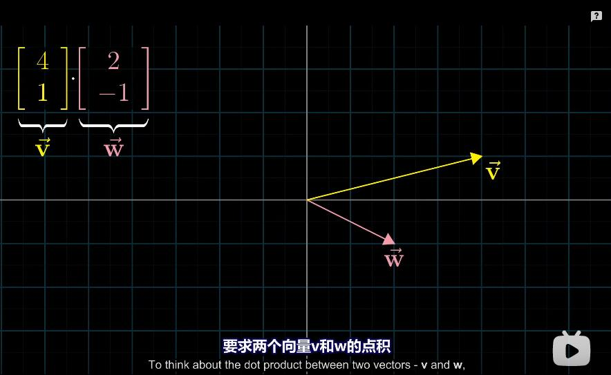


```
这个计算有一个优美的几何解释，
要求两个向量v和w的点积，
想象将向量w朝着过原点和向量v终点的直线上投影，
将投影的长度与向量v的长度相乘，
你就得到了它们的点积， v点乘w

点积和顺序无关

v向量和w向量

v*w = |v|*|w|投影
或者 |v|投影 *|w|

而投影 又 |v|投影 = cos * |v|
```


```
除非w的投影与v的方向相反，这种情况下点积为负值
```

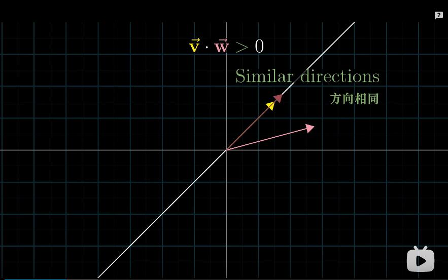


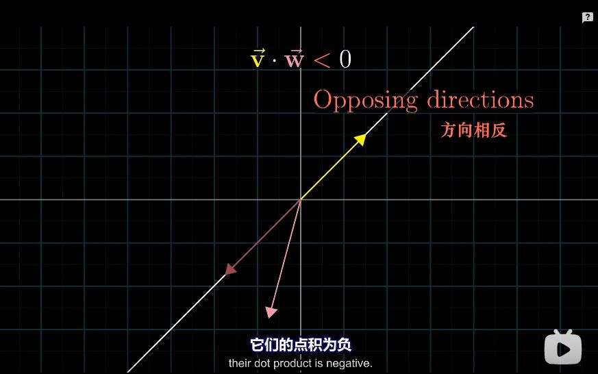

```
所以当两个向量的指向大致相同时，它们的点积为正，

当它们互相垂直时，意味着一个向量在另一个向量上的投影为零向量。
它们的点积为零。

而当它们的指向基本相反时，它们的点积为负。
```


```
因为点积和顺序无关，所以v和w谁向谁投影算出来的结果应该是一致的。
可是从图来看，这两种投影相乘完全看不出一样。

现在看看，这种解释异常的不对称，它对两个向量的处理完全不同，
所以我初次学习时，点积与顺序无关让我感到惊讶，
你可以将v投影到w上，将v的投影长度与w的长度相乘，
我说，你不觉得这是两个完全不同的过程嘛？
为什么结果会相同？


```


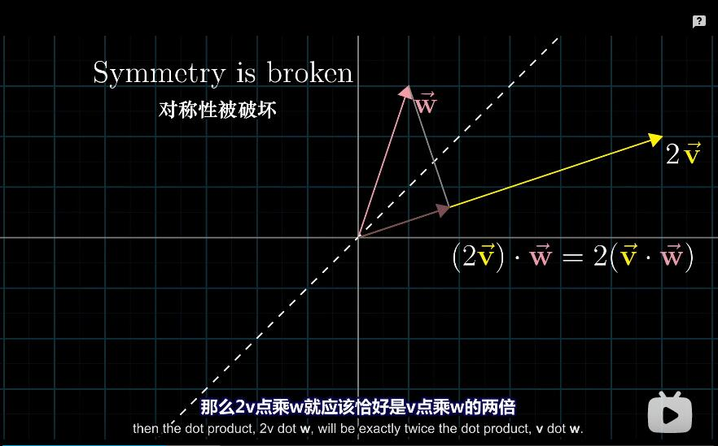


```
下面从直观上说说为什么点积和顺序无关

如果v和w的长度恰好相同，我们可以利用其中的对称性，
因为w向v上投影，并将w的投影长度和v的长度相乘，
和v向w上投影，并将v的投影长度和w的长度相乘互为镜像。

现在如果你将其中一个(比如v)缩放若干倍(比如两倍)，
使得它们的长度不同，对称性就被破坏了，

但是我们可以这样理解2v和w这两个新向量的点积，
如果你认为w向v上投影，
那么2v点乘w就应该恰好是v点乘w的两倍,
(2v).(w) = 2(v.w)
这是因为，将v放大为原来的两倍并不改变w的投影长度，
但是被投影的向量长度变为原来的两倍，


另一方面，假设你想将v投影到w上，
我们将v变为原来的两倍，这次是投影的长度变为原来的两倍，
但是被投影的向量长度保持不变，
所以总体效果仍然只是点积变为两倍，
所以说，即使这种情况下的对称性被破坏了，
在两种理解方式下，缩放向量对点积结果的影响是相同的。
```


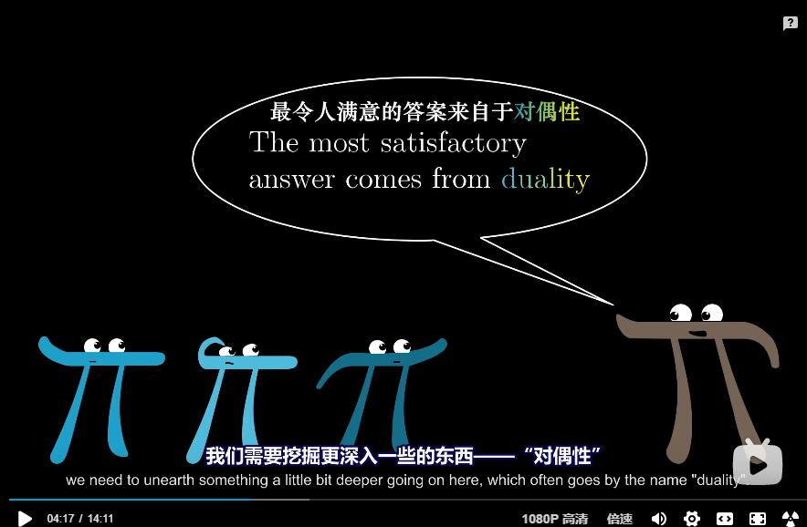

```
初次学习的时候，我还遇到了另一个让我困惑的大问题，
为什么点积的这一运算过程，也就是对应坐标相乘并将结果相加，和投影有所联系？

令人最满意的答案来自于 对偶性。
```


### 用线性变换的方式来解释点积和投影的关系

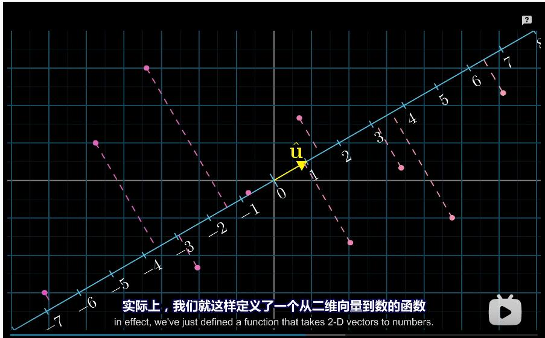

```
我现在将数轴复制一份，然后保持0在原点，将它斜放置在空间中，
现在考虑这样一个二维向量，它的终点落在这条数轴1上，
我给它起个名字，就叫"u帽"。

如果我们将二维向量直接投影到这条数轴上，
实际上，我们就这样定义了一个从二维向量到数的函数，
更重要的是，这个函数是线性的，因为它顺利通过了线性检验，
即直线上等距分布的点在投影到数轴上后仍然等距分布，
```


```
u是二维空间的一个向量，而它碰巧又落在这条数轴上，
```


```
根据这个投影，我们定义了一个从二维向量到数的线性变换，
所以我们就能够找到描述这个变换的1x2矩阵，
为了找到这个矩阵，我们把这条斜着的数轴放大来看，
```

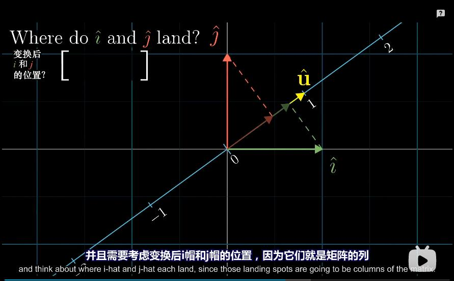

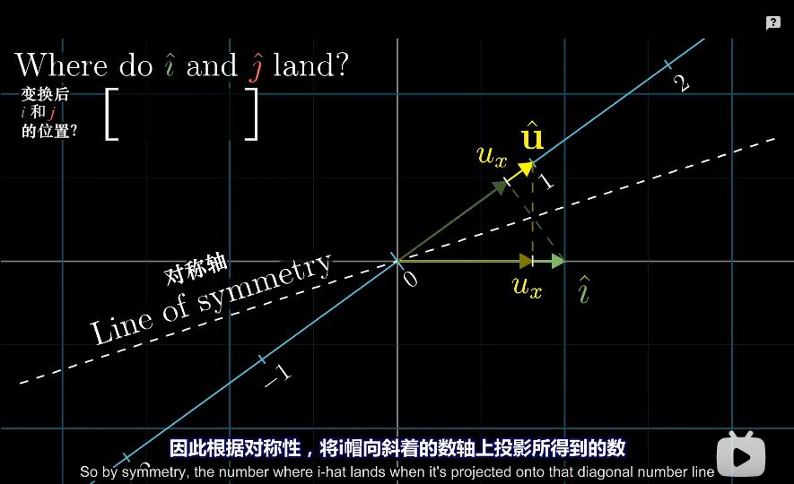

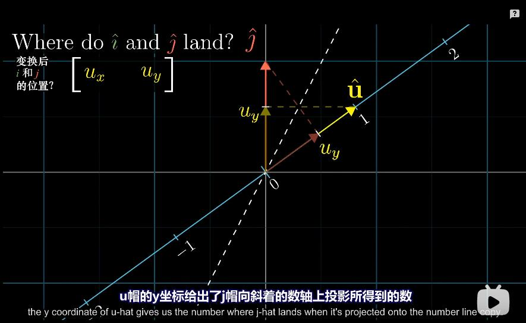

```
我们需要考虑变换后i帽和j帽的位置，因为它们就是矩阵的列，
这一部分非常漂亮，
我们可以通过精妙的对称性进行推理，

因为 i帽和u帽都是单位向量，
所以将i帽向u帽所在直线投影
与u帽向x轴投影看上去完全对称，

所以说,如果要问i帽在投影之后落在哪个数上，
答案就应该是u帽向x轴投影所得到的数，
而u帽向x轴投影得到的数就是u帽的横坐标，

因此根据对称性，将i帽向斜着的数轴上投影所得到的数，
就是u帽的横坐标。

以上推理过程对j帽几乎一致。
u帽的y坐标也给出了j帽向斜着的数轴上投影所得到的数。
```

```
所以描述投影变换的1x2矩阵的两列，
就分别是u帽的两个坐标，
而空间中任意向量经过投影变换的结果，
也就是投影矩阵与这个向量相乘，
和这个向量与u帽的点积在计算上完全相同。
```

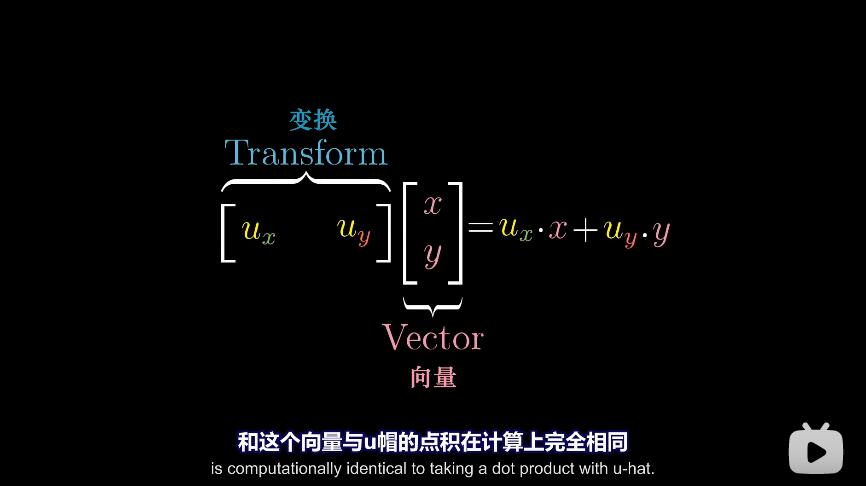

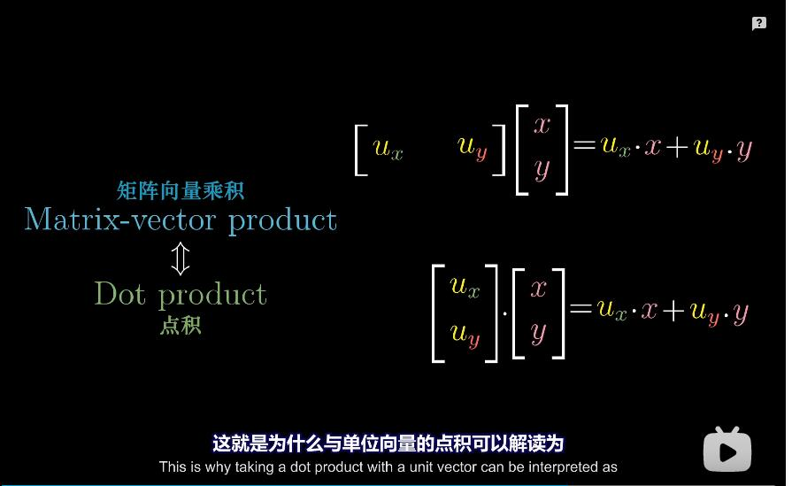

```
这就是为什么与单位向量的点积可以解读为，将向量投影到单位向量所在的直线上所得到的投影值。
```


#### 那非单位向量呢

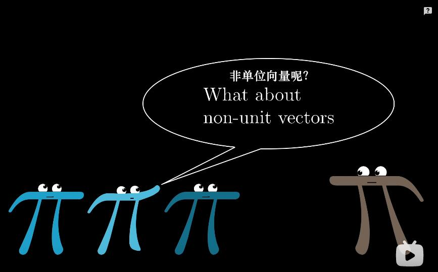


```
比如说，还是这个单位向量 u帽，不过我们把它放大为原来的3倍，
数值上说，它的每个坐标都被放大为原来的3倍，
所以要寻找与这个向量相关的投影矩阵，
实际上就是之前i帽和j帽投影得到的值的3倍，

更普遍的说，因为这个变换是线性的，意味着这个新矩阵可以看作，
将任何向量朝斜着的数轴上投影，然后将结果乘以3.

这就是为什么向量与给定非单位向量的点积可以解读为，
首先将朝给定向量上投影，然后与给定向量长度相乘。

这里看出了 点积等于 v*w=|v|*|w|投影长度

这里可以这么看，
1、先找到 v向量代表的线性变化
这个v向量的线性变换的矩阵怎么找呢？
因为v向量线性变换在数轴上的长度是N倍的u帽;
那么这个线性变化就是
N(ux,uy);
先投影再缩放。

所以 向量w 要应用 v的线性变换
结果就是 |w|的投影 * |v|
v*w = N(ux,uy) * w
N = |v|
(ux,uy)*w = |w|
```

```
将任意平面向量投影到某单位向量u上是一个线性变换，其矩阵通过关于对称性的讨论可知即包含这个单位向量u两个坐标的一个一行矩阵U，因此将任意向量v投影至这一向量上的结果即Uv结果刚好为u和v坐标的对应相乘，与u和v的点积相同，因此说明了点积具有投影的性质，再通过点积和投影的线性性可知即使u不是单位向量同样的结果也成立。
```

```
这集讲了，任取一单位向量u，设坐标为（a，b）。
首先证明（1,0）投影到u上的“带正负号的长度”恰为a（画图用所谓的对偶性证明），（0,1）的恰为b。
则进一步，可以直观的想象（x，0）的投影“长度”为ax。
再进一步，直观想象对于任取的向量（x，y），该向量分两步走，先向右x，再向上y，则在“整个平面投影到u的方向的直线”的过程中，可以直观地想象“向右x”这一运动过程被投影到“向u所指的方向上运动ax”，“向上y”同理，因此（x，y）投影到u上的“带正负号的长度”就应该是为ax+by。
再进一步，设u方向上有一向量（ca，cb），c不为1，显然其“带正负的长度”为c。（ca,cb）点乘（x，y），按代数定义应为cax+cby，但换一种形式可以理解为c（ax+by），即“长度c”与“投影长度”ax+by的积。
```

```
点积定义为两向量对应坐标的乘积之和。
由于点积关于各输入是线性的，因此对于某个固定的向量u，
将u与任意向量作点积是整个向量空间上的线性函数(将整个空间映射到1维实数)，
因为向量空间上的线性函数都可以由一个一行的矩阵来表示，
因此任意一个向量都可以看成一个一行矩阵，即向量和一行矩阵是同一回事。


```


```
思考下这个过程，
我们有一个从二维空间到数轴的线性变换，
它并不是由向量数值或点积运算定义得到的，
而只是通过将空间投影到给定数轴上来定义，
因为这个变换是线性的，所以它必然可以用某个 1x2矩阵来描述，
而又因为1x2矩阵和二维向量的计算过程，
和转置矩阵并求点积的计算过程相同，
所以这个投影变换必然会与某个二维向量相关，

这里给你的启发是，你在任何时候看到一个线性变换，
它的输出空间是一维数轴，
无论它是如何定义的，空间中会存在唯一的向量v与之相关，
就这一意义而言，应用变换和与向量v做点积是一样的。
```

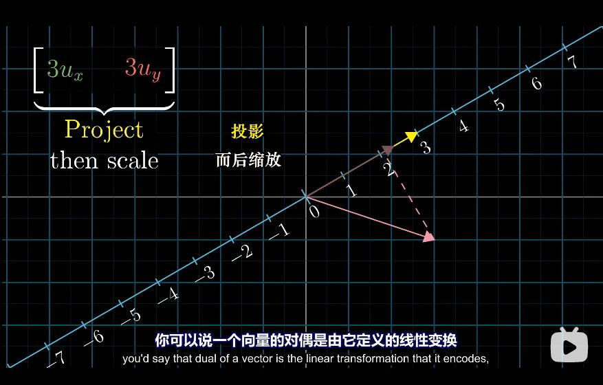


```
上面的例子是数学中"对偶性"的一个实例，
对偶性贯穿数学始终，在多个方面均有体现，
而实际定义它确是比较棘手的，
粗略的说，它指的是，
两种数学事物之间自然而又出乎意料的对应关系，


对于你刚刚学到的情况而言，
你可以说一个向量的对偶是由它定义的线性变换，
一个多维空间到一维空间的线性变换的对偶是多维空间中的某个特定向量，


总结一下，表面上看，点积是理解投影的有利几何工具，
并且方便检验两个向量的指向是否相同，
这大概也是你需要记住的点积中最重要的部分，
不过更进一步讲，
两个向量点乘，就是将其中一个向量转化为线性变换，
同样，在数值上强调它可能显得没有意义，
因为只是两种看上去恰好相似的计算过程而已，
但是我认为这一过程非常重要，
因为从始至终你都在和向量打交道，
一旦你真正了解了向量的"个性"，
有时你就会意识到，不把它看作空间中的箭头，
而把它看作线性变换的物质载体，会更容易理解向量，
向量就仿佛是一个特定变换的概念性记号，
因为对我们来说，想象空间中的向量比想象整个空间移动到数轴上更加容易。
```

