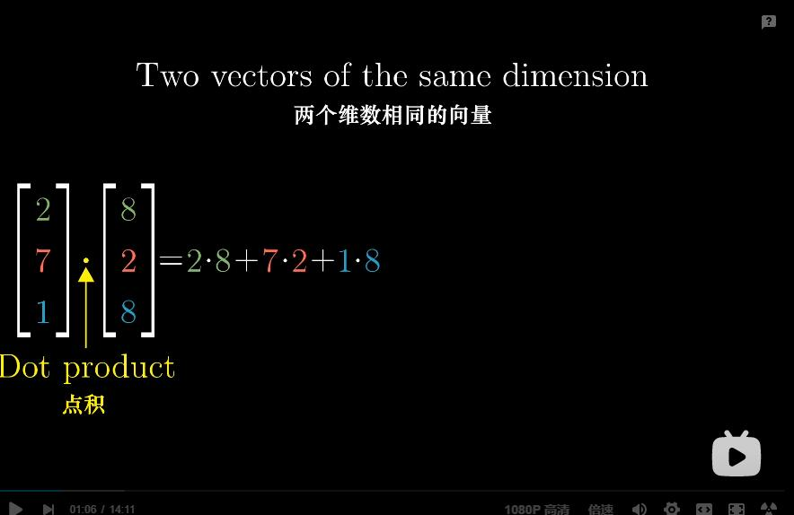
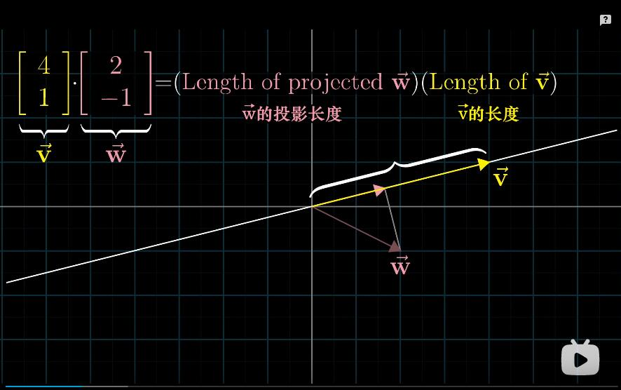
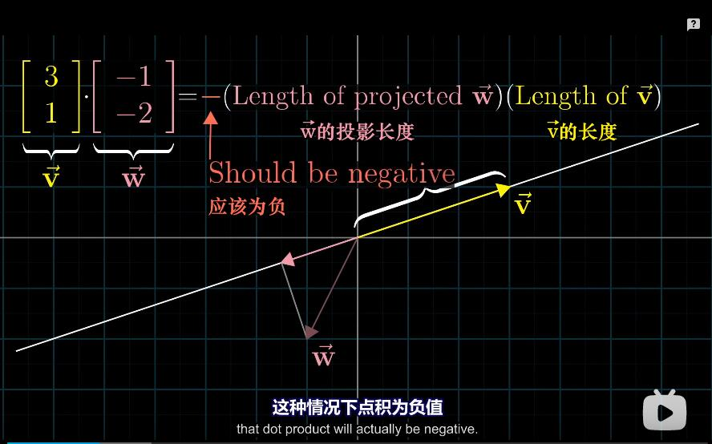

## 07、点积与对偶性

```
传统上，点积是线性代数课程中很靠前的内容，
作者把它放在如此的靠后，看起来似乎很奇怪，
虽然引入点积的标准方法只需要向量的基础认识即可，
但是要进一步理解点积所发挥的作用，
只能从线性变换的角度才能完成，
只有通过线性变换才 能真正理解，

不过在此之前，我先简单介绍引入点积的标准方法，

```



```
如果你有两个维度相同的向量，
或是两个长度相同的数组，
求它们的点积，就是将相应坐标配对，
求出每一对坐标的乘积，
然后将结果相加。
```




```
这个计算有一个优美的几何解释，
要求两个向量v和w的点积，
想象将向量w朝着过原点和向量v终点的直线上投影，
将投影的长度与向量v的长度相乘，
你就得到了它们的点积， v点乘w
```



```
除非w的投影与v的方向相反，这种情况下点积为负值
```


```
所以当两个向量的指向大致相同时，它们的点积为正，
当它们
```


