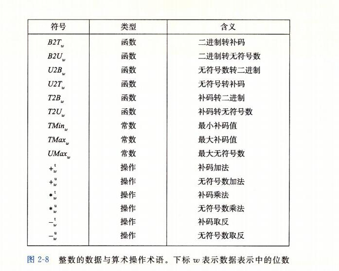
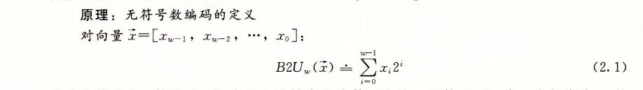
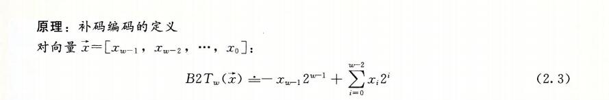
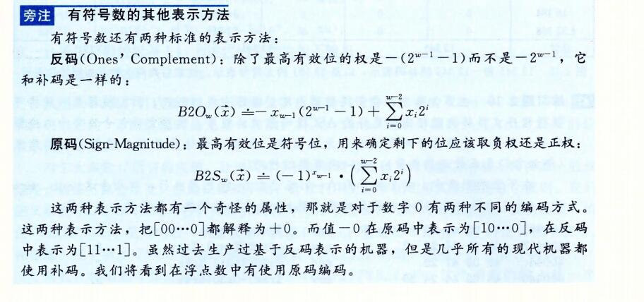
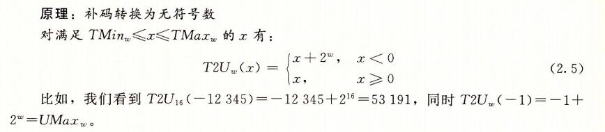
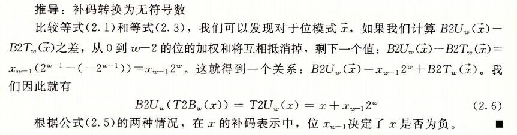
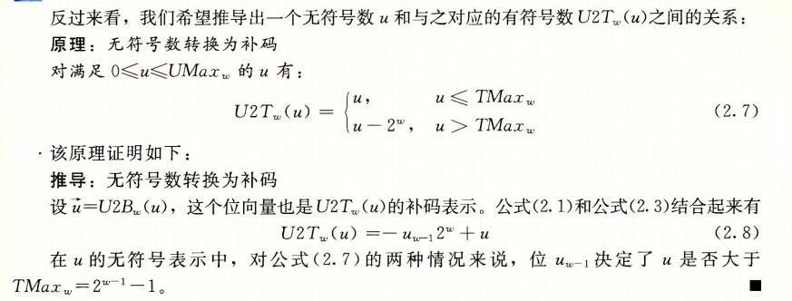

```
b=binary u = unsigned t=signed 有符号的
```

## 无符号



```java
 W代表位数 一共有几位
            w-1
B2U(w)(x)= 	∑  x(i)*2^i 
			i=0
			
举例子
B2U(4)([1011]) = 1*2^3 + 0*2^2 + 1*2^1 + 1*2^0

最小值是用[00000]
最大值使用[11111]
所以
            w-1
UMax(w)  = 	∑  2^i = 2w - 1
			i=0 
```

## 补码



```
补码编码

x = [x(w-1),x(w-2),...,x(0)]

                  			w-2
B2T(w)(x)=-x(w-1)2^(w-1) +	∑  x(i)*2^i 
			      			i=0
			      			
最高有效位 x(w-1)也称为符号位，它的"权重"为 -2^w-1, 是无符号表示中权重的负数。

			      			
TMin(4) = ([1000]) 
所以 Tmin(w) = -2^(w-1)
TMax(4) = ([0111])
所以 
            w-2
TMax(w)  = 	∑  2^i = 2^(w-1) - 1
			i=0 
```

反码和原码



```
补码 2^w - x
反码 [111...1] - x
```


## 无符号和有符号之间的转换

```
对于大多数C语言的实现，处理同样字长的有符号数和无符号数之间互相转换的一般规则是：
数值可能会改变，但是位模式不变。让我们用更数学化的形式来描述这个规则。我们定义函数U2B(W) 和 T2B(w)，他们将数值映射为无符号数和补码形式的位表示。也就是说，给定 0 <= x <= UMax 范围内的一个整数 x，函数   U2B(w)(x)会给出x的唯一的w位无符号表示。
相似地，当x满足 TMin(w) <= x <= TMax(w)， 函数T2Bw(x)会给出x的唯一的w位补码表示。

1+UMax(w) = 2^w

```



```
因为 因为符号位是 1 就是 2w 之前就是减去2w， 现在 就给 x+2w 加回来就正常了


```



``` 

			w-1
B2U(w)(x)= 	∑  x(i)*2^i 
			i=0
			
                  			w-2
B2T(w)(x)=-x(w-1)2^(w-1) +	∑  x(i)*2^i 
			      			i=0
			      			
B2U(x) - B2T(x) = 
 从 0位到w-2的位的加权和互相抵消掉。剩下一个值：
 B2U(x) - B2T(x) = x(w-1)^(2^(w-1) - (-2^(w-1))) = x(w-1)*2^w.
 这就得到一个关系：B2U(x) = x(w-1)*2^w + B2T(x);
 因此我们就有
  B2U(T2B(x)) = T2U(x) = x+x(w-1)*2^w
  因为B2T(x) 就是 x 的十进制
```


## 无符号转换为补码




## 扩展一个数字的位

```
一个常见的运算实在不同字长的整数之间转换，同时又保持数值不变。当然，当目标数据类型太小以至于不能表示想要的值时，这根本就是不可能的。然而，从一个较小的数据类型转换到一个较大的类型，应该总是可能的。
```


