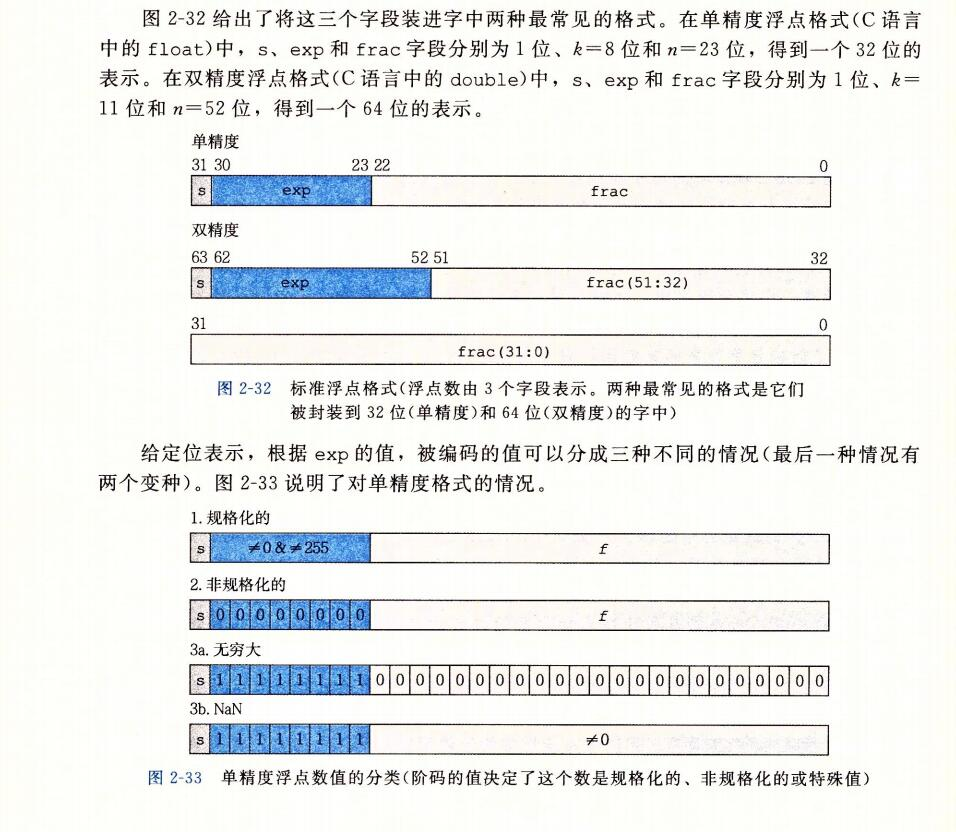

## IEEE浮点表示

```
前一节中谈到的定点表示法不能很有效的表示非常大的数字。
```




```
s  sign 符号
M   significand 有效位数
E   exponent 指数

V=(-1)^s * M * 2^E

float 32 1 sign 8 exponent  23 significand
double 64 1 sign 11 exponent 52 signifgicand
```


### 情况一：规格化的值

```
这是最普遍的情况。当exp的位模式既不全为0(数值0），也不全为1（单精度数值为 255，双精度 2047）时，都属于这类情况. 在这种情况中，阶码字段被解释为以偏置(biased)形式表示的有符号整数。也就是说，阶码的值是 E = e - bias, 其中 e 是无符号数，其位表示为 e(k-1)...e1e0， 而 bias 是一个 等于 2^(k-1) -1 (单精度是127，双精度是 1023)的偏置值。由此产生指数的取值范围，对于单精度是 -126 ~ +127, 而对于双精度是 -1022 ~ +1023。
```

```
小数字段 frac 被解释为描述小数值 f, 其中 0<= f < 1,其二进制表示为 0.f(n-1)...f1f0,  也就是二进制小数点在最高有效位的左边。尾数定义为 M = 1 + f。有时，这种方式也叫 隐含的以1开头的 (implied leading 1)表示，因为我们可以把M看成一个二进制表达式为 1.f(n-1)...f1f0 的数字。既然我们总是能够调整阶码E，使得尾数 M 在范围 1<=M<2之中，(假设没有溢出)，那么这种表示方法是一种轻松获取一个额外精度位的技巧。既然第一位总是等于 1，那么我们就不需要显示的表示它。
```

```
E=e-bias;
E是阶数位 exponent
e 是阶数的无符号数
Bias 是偏置值  bias = 2^(k-1) - 1
float 32 位 单精度 1 8 23
  bias = 127
  e的范围是 1 ~ 254   2^8  - 1 = 255
  位模式就是 [1,1,0,1,1] 就是二进制的表示模式
  因为 e 不能位模式全为 0，全为 0 就是非规格化的值了。所以 e最小为 1
  因为 e 不能位模式全为 1, 全为 1 就是特殊值了。所以 e 的最小为 254 ， 11110
  
  E的范围就是  1- 127 = -126  254 - 127= 127
  -126 ~ 127
  
double 64 位 双精度  1 11 52  
bias = 1023
e 的范围是 0001, 1110. 1 ~ 2046
E 的范围是 -1022 ~ +1023
```


### 情况二：非规格化的值

```
当阶码域为全0时，所表示的数是非规格化形式。exponent 在这种情况下，阶码值是 E=1-bias,而尾数的值时 M=f , 也就是小数字段的值，不包含隐含的开头的 1。
```

```
旁注： 对于非规格化值为什么要这样设置偏置值
	是阶码值为 1-bias 而不是简单的 -bias 似乎是违反直觉的。我们将很快看到，这种方式提供了一种非规格化值平滑转换到规格化值得方法。
```

```
非规格化数有两个用途。首先，它们提供了一种表示数值0的方法，因为使用规格化数，我们必须总是使 M>=1,因此我们就不能表示 0. 实际上，+0.0的浮点表示的位模式全为全0：符号位是0，阶码字段全为0(表明是一个非规格化值)，而小数域(f小数字段为：f)也全为0，这就得到M=f=0。
令人奇怪的是，当符号位为1，而其他域全为0时，我们得到的值-0.0.根据IEEE的浮点格式，值      +0.0 和 -0.0 在某些方面被认为是不同的，而在其他方面是相同的。

非规格化数的另外一个功能时表示那些非常接近0.0的数。它们提供了一种属性，称为逐渐溢出(gradual underflow),其中，可能的数值分布均匀地接近于0.0。

```


### 情况三：特殊值

```
最后一类数值是当指阶码全为1的时候出现的。当小数域全为0时，得到的值表示无穷，当s=0时是   +最大。当s=1时是 -最大。当我们把两个非常大的数相乘，或者除以零时，无穷能够表示溢出的结果。
```


