## 1、物理层的基本概念

```
...
```

## 2、数据通信的基础知识

### 1、数据通信系统的模型

```
下面我们通过一个最简单的例子来说明数据通信系统的模型。
这个例子就是两个PC经过电话机的连线，再经过公用电话进行通信。
```

```
如果2-1所示，一个数据通信系统可划分为三大部分，即源系统(或发送端、发送方)、传输系统(或传输网络)和目的系统(或接受端、接收方)。
```

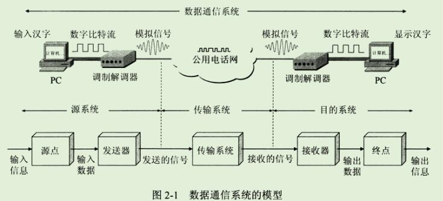

```
源系统一般包括以下两个部分：
源点(source):源点设备产生要传输的数据，例如，从PC的键盘输入汉字，PC产生输出的数字比特流。
源点又称为源站，或信源。

发送器：通常，源点生成的数字比特流要通过发送器编码后才能够才传输系统中进行传输。
典型的发送器就是调制器。
现在很多PC实用内置的解调器(包含调制器和解调器)，用户在PC外面看不见调制解调器。

接收器：接收传输系统传送过来的信号，并把它转换为能够被目的设备处理的信息。
典型的接收器就是解调器，它把来自传输线路上的模拟信号进行解调，提取出在发送端置入的消息，还原出发送端产生的数字比特流。

终点(destination)：终点设备从接收器获取传送来的数字比特流，然后把信息输出(例如，把汉字在PC屏幕上显示出来)。
终点又称为目的站，或信宿。
```

```
通信的目的是传送消息(message)。
数据(data)是运送消息的实体。
信号(signal)则是数据的电气或电磁的表现。
```

```
根据信号中代表消息的参数的取值方式不同，信号可分为两大类：
1、模拟信号，或连续信号 -- 代表消息的参数的取值是连续的。
例如在图2-1中，用户家中的调制解调器到电话端局之间的用户线上传送的都是模拟信号。

2、数字信号，或离散信号 -- 代表消息的参数的取值是离散的。
例如在图2-1中，用户家中的 PC 到调制解调器之间，或者在电话网中继线上传送的就是数字信号。
在使用时间域(或简称为时域)的波形表示数学信号时，则代表不同离散数值的基本波形就称为码元。
在使用二进制编码时，只有两种码元，一种代表0状态 而另一种代表1状态。
```

### 2、有关信道的几个基本概念

```
在许多情况下，我们要使用"信道(channel)"这一名词。
信道和电路并不等同。
信道一般都是用来表示向某一个方向传送信息的媒体。
因此，一条通信电路往往包含一条发送信道和一条接收信道
```

```
从信道的双方信息交互的方式来看，可以有以下三种基本方式：

1、单向通信
	又称为单工通信，即只能有一个方向的通信而没有反方向的交互。
	无线电广播或有线电广播以及电视广播就属于这种类型。
	
2、双向交替通信
	又称为半双工通信，即通信的双方都可以发送信息，但不能双方同时发送(当然也不能同时接收)。
	这种通信方式是一方发送另一方接收，过一段时间后再反过来。
	
3、双向同时通信
	又称为全双工通信，即通信的双方可以同时发送和接收信息。
	单向通信只需要一条信道，而双向交替通信或双向通信则需要两条信道(每个方向各一条)。
	显然，双向同时通信的传输效率最高。
```

```
来自信源的信号常称为基带信号(即基本频带信号)。
像计算机输出的代表各种文字或图像文件的数据信号都属于基带信号。
基带信号往往包含有较多的低频成份，甚至有直流成分，而许多信道并不能传输这种低频分量或直流分量。
为了解决这一问题，就必须对基带信号进行调制(modulation)。
```

```
调制可分为两大类。

一类是仅仅对基带信号的波形进行变换，使它能够与信道特性相适应。
变换后的信号仍然是基带信号。
这类调制称为基带调制。
由于这种基带调制是把数字信号转换为另一种形式的数字信号，因此大家更愿意把这种过程称为编码(coding)。


另一类调制则需要使用载波(carrier)进行调制，把基带信号的频率范围搬移到较高的频段，并转换为模拟信号，这样就能更好的再模拟信道中传输。
经过载波调制后的信号称为带通信号(即仅在一段频率范围内能够通过信道)，而是用载波的调制称为带通调制。
```

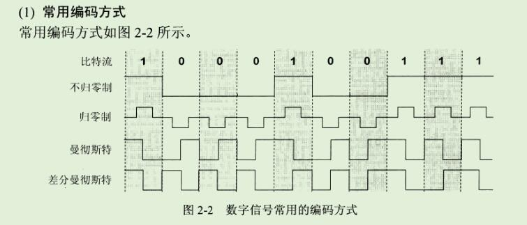

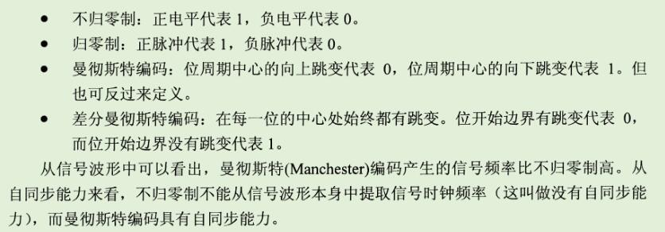


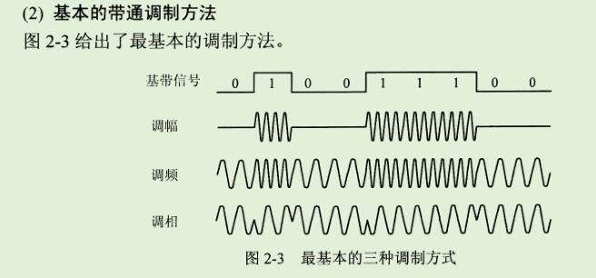

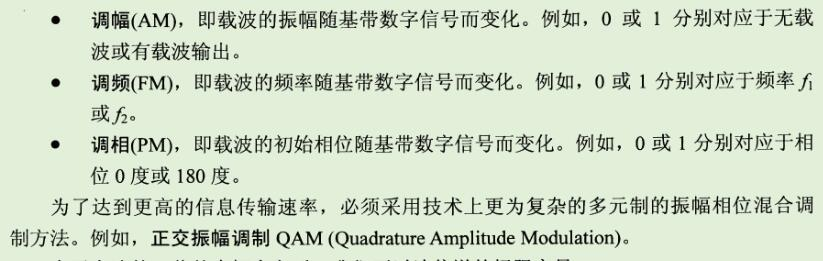


### 3、信道的极限容量

```
几十年来，通信领域的学者一直在努力寻找提高数据传输速率的途径。
这个问题很复杂，因为任何实际的信道都不是理想的，在传输信号时会产生 各种失真。
我们知道，数字通信的优点就是：
在接收端只要我们能从失真的波形识别出原来的信号，那么这种失真对通信质量就没有影响。
例如，图2-4(a)表示信号通过实际的信道后虽然有失真，但在接收端还可识别原来的码元。
但图2-4(b)就不同了，这时失真已经很严重，在接收端无法识别码元是1还是0。
码元传输的速率越高，或信号传输的距离越远，或噪声干扰越大，或传输媒体质量越差，在接收端的波形的失真就越严重。
```

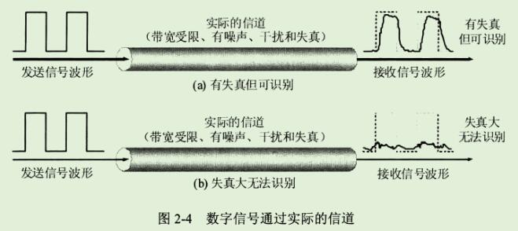

```
从概念上来讲，限制码元在信道上的传输速率的因素有以下两个。
1、信道能够通过的频率范围
具体的信道所能通过的频率返回总是有限的。
信号中的许多高频分量往往不能通过信道。
像图2-4所示的发送信号是一种典型的矩形脉冲信号，它包含很丰富的高频分量。
如果信号中的高频分量在传输时受到衰减，那么在接收端收到的波形前沿和后沿就变得不那么陡峭了，每一个码元所占的时间界限也不再是明确的，而是前后都拖了"尾巴"。
这样，在接收端收到的信号波形就失去了码元之间的清晰界限。
这种现象叫做"码间串扰"。
严重的码间串扰使得本来分得很清楚的一串码元变得模糊而无法识别。

在任何信道中，码元的传输的速率是有上限的，传输速率超过此上限，就会出现严重的码间串扰的问题，使接收端对码元的判决成为不可能。
```

```
如果信道的频带越宽，也就是能够通过的信号高频分量越多，那么就可以用更高的速率传送码元而不出现码间串扰。
```

2、信噪比

```
噪声存在于所有电子设备和通信信道中。
由于噪声是随机产生的，它的瞬间值有时候会很大。
因此噪声会使接收端对码元的判决产生错误(1误判为0 或 0误判为1)。
但噪声的影响是相对的。
如果信号相对较强，那么噪声的影响就相对较小。
因此，信噪比就很重要。
所谓信噪比就是信号的评价功率和噪声的平均功率之比，常记为 S/N，并用分贝(dB)作为度量单位。
```

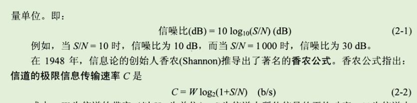

```
式中，W为信道的带宽(以 Hz 为单位); S 为信道内所传信号的平均功率; N 为信道内部的高斯噪声功率。
```

```
香农公式表明，信道的带宽或信道中的信噪比越大，信息的极限传输速率就越高。
香农公式指出了信息传输速率的上限。
香农公式的意义在于：只要信息传输速率低于信道的极限信息传输速率，就一定可以找到某种办法来实现无差错的传输。
```

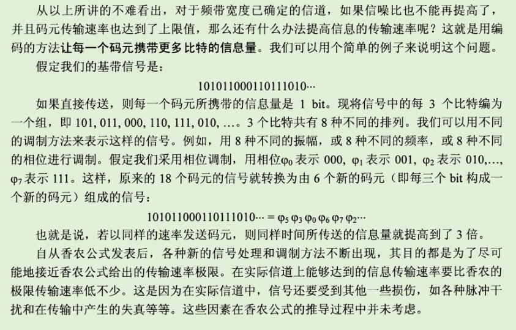


## 3、物理层下面的传输媒体

```
传输媒体是数据传输系统中在发送器和接收器之间的物理通路。
分为 引导型传输媒体 和 非引导型传输媒体。

引导型传输媒体就是电磁波被导引沿着固体媒体(铜线，光纤)传播。
非引导型传输媒体就是指自由空间，无线传输。
```

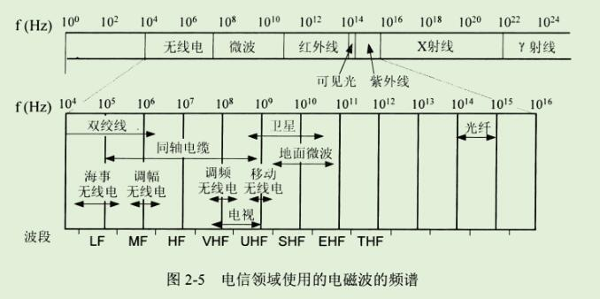


## 4、信道复用技术

### 1、频分复用、时分复用、统计时分复用

```
复用(multiplexing) 是通信技术中的基本概念。
在计算机网络中的信道广泛的使用各种复用技术。
```

```
图2-13(a)表示A1,B1,C1分别使用一个单独的信道和 A2 B2 C2 进行通信，总共需要三个信道。
但如果在发送端使用一个复用器，就可以让大家合起来使用一个共享信道进行通信。
在接收端再使用分用器，把合起来传输的信息分别送到相应的终点。

图2-13(b)是复用的示意图。
当然，复用要付出一定代价(共享信道由于带宽较大因而费用也较高，再加上复用器和分用器)。
但如果复用的信道数量比较大，那么在经济上还是合算的。
```

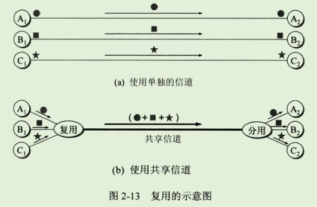


```
最基本的复用就是频分复用 FDM(frequency division multiplexing) 和 时分复用 TDM(time division multiplexing)。

频分复用最简单，其特点如图 2-14(a)所示。
用户在分配到一定的频带后，在通信过程中自始至终都占用这个频带。
可见频分复用的所有用户在同样的时间占用不同的带宽资源(请注意，这里的带宽是频率带宽而不是数据的发送速率)。

而时分复用是将时间划分为一段段等长的时分复用帧(TDM 帧)。
每一个时分复用的用户在每一个TDM帧中占用固定序号的时隙。
为了简单起见，在图2-14(b)中只画出了4个用户A，B,C,D。
每一个用户所占用的时隙是周期性的出现(其周期就是TDM帧的长度)。
因此TDM信号也称为等时(isochronous)信号。
可以看出，时分复用的所有用户是在不同的时间占用同样的带宽频率。
这两种复用方法的优点是技术比较成熟，但缺点不够灵活。
时分复用则更有利于数字信号的传输。
```

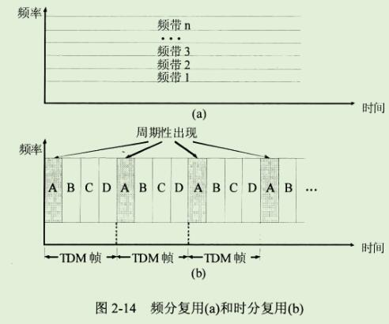

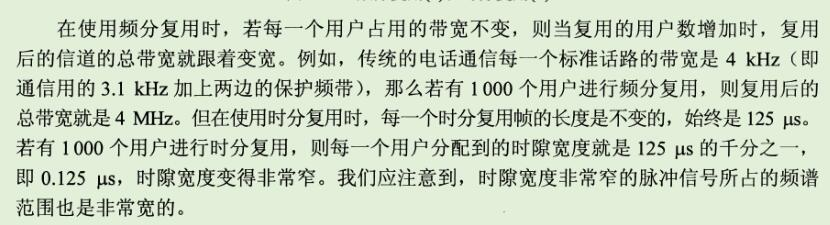

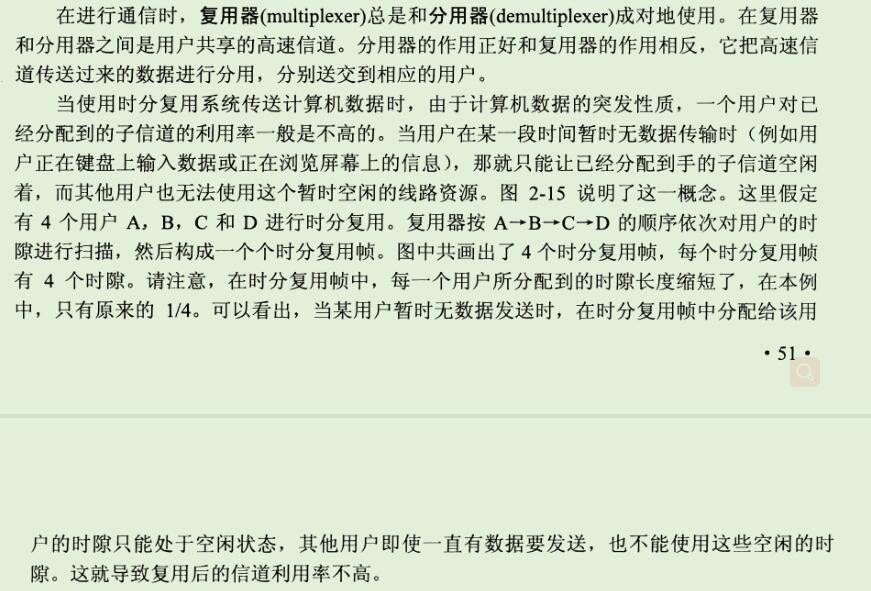

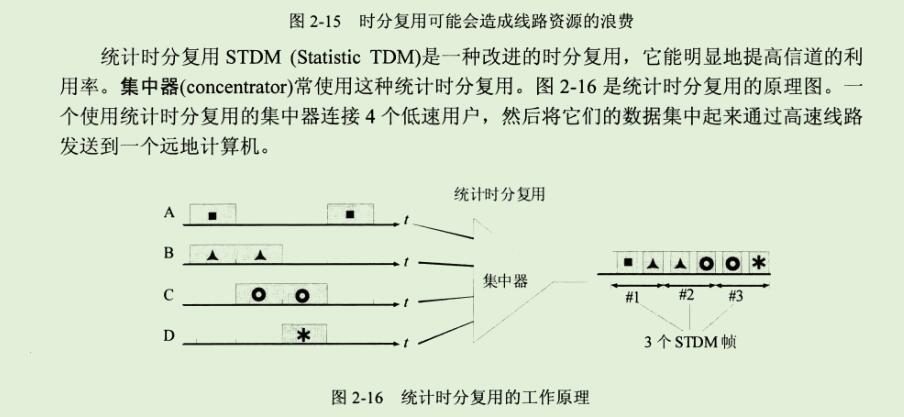

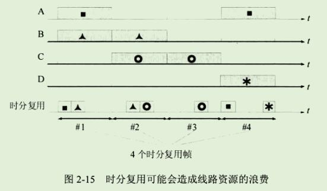

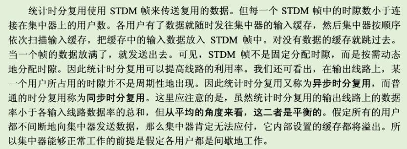

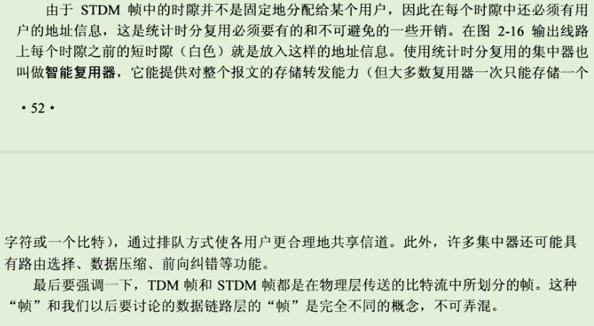

### 2、波分复用

```
波分复用WDM(Wavelength Division Multiplexing)
就是光的频分复用。

光纤技术的应用使得数据的传输速率空前提高。
现在人们借用传统的载波电话的频分复用的概念，就能做到使用一根光纤来同时传输多个频率很接近的光载波信号。
这样就使光纤的传输能力可成倍的提高。
由于光载波的频率很高，因此习惯上用波长而不用频率来表示所使用的的光载波。

最初，人们只能在一根光纤上复用两路光载波信号。
这种复用方式称为波分复用 WDM。
随着技术的发展，在一根光纤上复用的光载波信号的路数越来越多。
现在已经能做到在一根光纤上复用几十路或更多路数的光载波信号。
于是就使用了密集波分复用 DWDM(Dense Wavelength Division Multiplexing)这一名词。

```

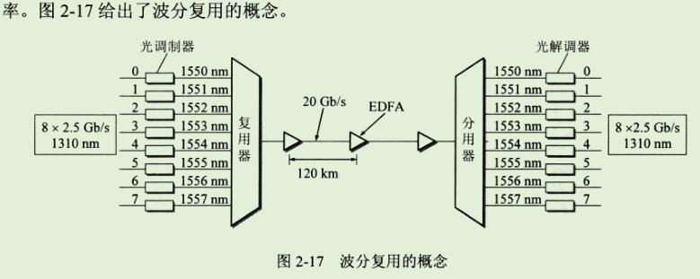

```
图2-17表示8路传输速率均为 2.5Gb/s 的光载波(其波长均为1310nm)经光的调制后，分别将波长变换到1550~1557nm,每个光载波相隔1nm(这只是为了说明问题方便。实际上，对于密集波分雇佣，光载波的间隔一般是0.8或1.6nm)。
这8个波长很接近的光载波经过光复用器(波分复用的复用器又称为合波器)后，就在一根光纤中传输。
因此，在一根光纤上数据传输的总速率就达到了 8*2.5Gb/s。
但光信号传输了一段距离后就会衰减，因此对衰减了的光信号必须进行放大才能继续传输。
现在已经有了很好的掺铒光纤放大器EDFA(Erbium Doped Fiber Amplifier)。
它是一种光放大器，不需要像以前那样复杂，先把光信号转换成电信号，经过电放大器放大后，再转换成光信号。
掺铒光纤放大器EDFA不需要进行光电转换而直接怼光信号进行放大，并且在1550nm波长附近有35nm(即4.2THz)频带范围提供较均匀的、最高可达 40~50dB的增益。
两个光纤放大器之间的光缆线路可达 120km，而光复用器和光分用器(波分用的分用器又称为分波器)之间的无光点转换距离可达600km(只需放入4个EDFA光纤放大器)。
```

```
https://zhidao.baidu.com/question/646722944778164565.html

目前，无中继放大器的光信号传输距离可以达到120km，另外，因为出现了以掺铒光纤放大器为代表的光放大器，所以光纤的损耗特性已经不再是限制传输距离的主要因素。限制光纤传输距离和传输容量的主要因素是光纤的色散特性和非线性特性。
```


### 3、码分复用

```
http://bbs.kaoyan.com/t3990842p1

https://zhidao.baidu.com/question/288241811.html

在n维空间里最多有几个两两互相垂直的向量？
最多n个向量两两相交。n+1个向量必成线形
```


```
码分复用 CDM(Code Division Multiplexing) 是另一种共享信道的方法。
实际上，人们更常用的名词是 码分多址CDMA(Code Division Multiple Access)。
每一个用户可以在同样的时间使用同样的频带进行通信。
由于各用户使用经过特殊挑选的不同码型，因此各用户之间不会造成干扰。
码分复用最初是用于军事通信的，因为这种系统发送的信号有很强的抗干扰能力，其频谱类似于白噪声，不易被敌人发现。
随着技术的进步，CDMA设备的价格和体积都大幅度下降，因而现在已广泛使用在民间的移动通信中，特别是在无线局域网中。
采用 CDMA 可提高通信的话音质量和数据传输的可靠性，减少干扰对通信的影响，增大通信系统的容量(是使用 GSM 的4-5倍)，降低手机的平均发射功率等等。
```

```
在CDMA中，每一个比特时间再划分为 m 个短的间隔，称为码片(chip)。
通常 m 的值是 64 或 128。
在下面的原理性说明中，为了画图简单起见，我们设 m 为 8。

使用 CDMA 的每一个站被指派一个唯一的 m bit 码片序列(chip sequence)。
一个站如果要发送比特 1,则发送它自己的 m bit 码片序列。
如果要发送比特 0，则发送该码片序列的二进制反码。

例如，指派给S站的 8 bit码片序列是 00011011。
当S发送比特1时，它就发送序列 00011011。
发S发送比特1时，他就发送序列 11100100。

为了方便，我们按照惯例将码片中的 0 写为 -1;将1写为 +1。
因此S站的码片序列是(-1-1-1+1+1-1+1+1)。
```

```
现假定 S 站要发送信息的数据率为 b b/s。
由于每一个比特要转换成 m 个比特的码片，
因此S站实际上发送的数据率提高到 mb b/s，同时S站所占用的频带宽度也提高到原来数值的 m 倍。
这种通信方式是扩频(spread spectrum)通信中的一种。
扩频通信通常有两大类。
一种是直接序列扩频DSSS(Direct Sequence Spread Spectrum),如上面讲的使用码片序列就是这一类。
另一种是跳频扩频FHSS（Frequency Hopping Spread Spectrum).
```

```
CDMA 系统的一个重要特点就是这种体制给每一个站分配的码片序列不仅必须各不相同，并且还必须互相正交(orthogonal)。
在实用的系统中是使用 伪随机码序列。
```

```
用数学公式可以很清楚的表示码片序列的这种关系。
令向量 S 表示站 S 的码片向量，再令 T 表示其他任何站的码片向量。
两个不同站的码片序列正交，就是向量 S 和 T 的规格化内积(inner product)都是 0:
```

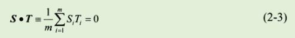

````
例如，向量S 为 (-1-1-1+1+1-1+1+1), 
同时设向量 T 为(-1-1+1-1+1+1+1-1),
这相当于T站的码片序列为 00101110。
将向量S和T的各分量值带入(2-3)式就可看出这两个码片序列是正交的。
不仅如此，向量S和各站码片反码的向量的内积也是0。
另外一点也很重要，即任何一个码片向量和该码片向量自己的规格化内积都是1：
````

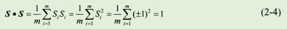

```
而一个码片向量和该码片反码的向量的规格化值是 -1。
这从(2-4)式可以很清楚的看出，因为求和的各项都变成-1。
```

```
现在假定在一个 CDMA 系统中有很多站都在互相通信，每一个站所发送的是数据比特和本站的码片序列的乘积，
因而是本站的码片序列(相当于发送比特1)和改码片序列的二进制反码(相当于发送比特0)的组合序列，或什么也不发送(相当于没有数据发送)。
我们还假定所有的站所发送的码片序列都是同步的，即所有的码片序列都在同一个时刻开始。
利用全球定位系统GPS就不难做到这一点。
```

```
现假定有一个 X 站要接收 S  站发送的数据。
X 站就必须知道 S 站所持有的码片序列。
X站使用它得到的码片向量S 与接收到的未知信号进行求内积的运算。
X站接收到的信号时各个站发送的码片序列之和。
根据上面的公式(2-3)和(2-4)，在根据叠加原理(假定各种信号经过信道到达接收端是叠加的关系)，那么求内积得到的结果是：
所有其他站的信号都被过滤掉(其内积的相关项都是0)，而只剩下S站发送的信号。
当 S 站发送比特 1 时，在 X 站计算内积的结果是 +1,当S站发送比特0时，内积的结果是 -1。
```

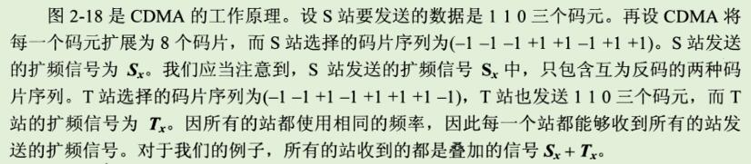

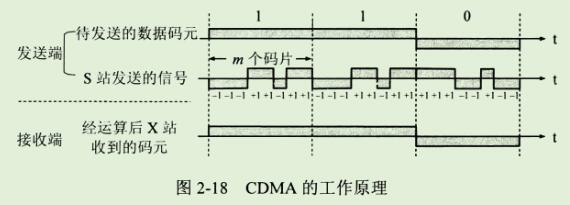

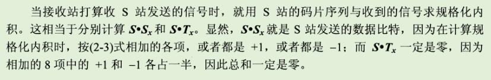

## 5、数字传输系统

## 6、宽带接入技术

```
在第一章中已经讲过，用户要连接到因特网，必须先连接到某个 ISP，以便获得上网所需的IP地址。
在因特网的发展初期，用户都是利用电话的用户线通过调制解调器连接到 ISP 的，经过多年的努力，从电话的用户线接入到因特网的速率最高只能达到 56Kb/s。
为了提高用户的上网速率，近年来已经有多种宽带技术进入用户的家庭。
然而目前"宽带"尚无统一的定义。
有人认为只要接入到因特网的速率远大于 56kb/s 就是宽带。
美国联邦通信委员会 FCC 认为只要双向速率之和超过 200kb/s 就是宽带。
```


