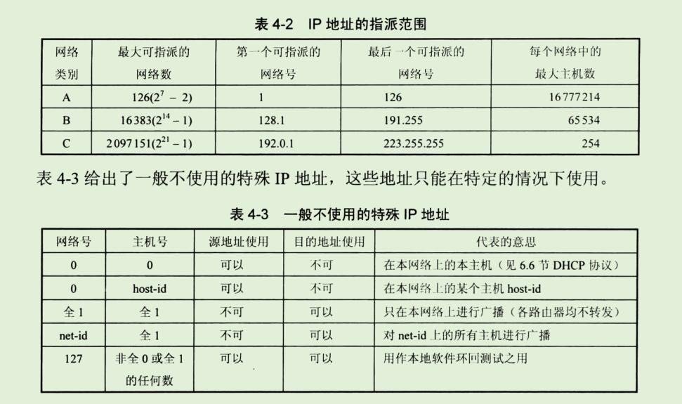

```
本章讨论网络互连问题，也就是讨论多个网络通过路由器互联成为一个互连网络(互联网)的各种问题。

在介绍网络层提供的两种不同服务后，就进入本章的核心内容---网际协议IP，这是本书的一个重点内容。
只有深入的掌握了IP协议的主要内容，才能理解因特网是怎么样工作的。

本章还要讨论网际控制报文协议 ICMP 和几种常用的路由选择协议，以及IP多播的概念。
最后简要的介绍虚拟专用网 VPN和网络地址转换NAT。
```

百度百科ARP协议

[百度百科ARP协议](https://baike.baidu.com/item/ARP/609343?fromtitle=ARP%E5%8D%8F%E8%AE%AE&fromid=1742212&fr=aladdin)

## ARP地址解析协议

```
地址解析协议，即ARP(Address Resolution Protocol)，是根据IP地址获取物理地址的一个TCP/IP协议。
主机发送信息时将包含目标IP地址的ARP请求广播到局域网上的所有主机，并接收返回消息，以此确定目标的物理地址;
收到返回消息后将该IP地址和物理地址存入本机ARP缓存中并保留一定时间，下次请求时直接查询ARP缓存以节约资源。
地址解析协议是建立在网络中各个主机互相信任的基础上的，局域网络上的主机可以自主发送ARP应答消息，其他主机收到应答报文时不会检测该报文的真实性就会将其记入本机ARP缓存;
由此攻击者就可以向某一主机发送伪ARP应答报文，使其发送的信息无法到达预期的主机或到达错误的主机，这就构成了一个ARP欺骗。

ARP命令可用于查询本机ARP缓存中IP地址和MAC地址的对应关系、添加或删除静态对应关系等。
相关协议有RARP、代理ARP。NDP用于在IPV6汇总代替地址解析协议。
```

### 功能

```
地址解析协议有互联网工程任务组(IETF)d在1982年11月发布的RFC826中描述指定。

地址解析协议是IPv4中必不可少的协议，而IPv4是使用较为广泛的互联网协议版本(IPv6仍然处在部署的初期)。

OSI模型把网络工作分为7层，IP地址在OSI模型的第三层，MAC地址在第二层，彼此不直接打交道。
在通过以太网发送IP数据包时，需要先封装第三层（32位IP地址）、第二层（48位MAC地址）的报头，但由于发送时只知道目标IP地址，不知道其MAC地址，又不能跨第二、三层，所以需要使用地址解析协议。使用地址解析协议，可根据网络层IP数据包包头中的IP地址信息解析出目标硬件地址（MAC地址）信息，以保证通信的顺利进行。
```

### 原理

```
工作过程
主机A的IP地址为192.168.1.1，MAC地址为0A-11-22-33-44-01；
主机B的IP地址为192.168.1.2，MAC地址为0A-11-22-33-44-02；

当主机A要与主机B通信时，地址解析协议可以将主机B的IP地址(192.168.1.2)解析成主机B的MAC地址，以下为工作流程：

1、根据主机A上的路由表内容，IP确定用于访问主机B的转发IP地址是192.168.1.2。
然后A主机在自己本地ARP缓存中检查主机B的匹配MAC地址。

2、如果主机A在ARP缓存中没有找到映射，她将询问192.169.1.2的硬件地址，从而将ARP请求帧广播到本地网络上的所有主机。
源主机A的IP地址和MAC地址都包括在ARP请求中。
本地网络上的每一台主机都接收到ARP请求并且检查是否与自己的IP地址匹配。
如果主机发现请求的IP地址与自己的IP地址不匹配，它将丢弃ARP请求。

3、主机B确定ARP请求中IP地址与自己的IP地址匹配，则将主机A的IP地址和MAC地址映射添加到本地ARP缓存中。

4、主机B将包含其MAC地址的ARP回去消息直接发送回主机A.

5、当主机A收到从主机B发来的ARP回复消息时，会用主机B的IP和MAC地址映射更新ARP缓存。
本机缓存是有生存期的，生存期结束以后，将再次重复上面的过程。
主机B的MAC地址一旦确定，主机A就能向主机B发送IP通信了。
```

#### ARP缓存

```
ARP缓存是个用来存储IP地址和MAC地址的缓冲区，其本质就是一个IP地址 ->MAC地址的对应表，表中每一个条目分别记录了网络上其他主机的IP地址和对应的MAC地址。
每一个以太网或令牌环网络适配器都有自己单独的表。
当地址解析协议被询问一个已知IP地址节点的MAC地址时，先在ARP缓存中查看，若存在，就直接返回与之对应的MAC地址，若不存在，才发送ARP请求向局域网查询。
```

```
为了使广播量最小，ARP维护IP地址到MAC地址映射的缓存以便将来使用。
ARP缓存可以包含动态和静态项目。
动态项目随时间添加和删除。
每个动态ARP缓存项的潜在生命周期是10分钟。
新加到缓存中的项目带有时间戳，如果某个项目添加后两分钟内没有再使用，则此项目过期并从ARP缓存中删除;
如果某个项目已经在使用，则又收到2分钟的生命周期，一直到10分钟最长生命周期。
静态项目一直保留在缓存中，直到重新启动计算机为止。
```

### ARP命令

```
ARP缓存中包含一个或多个表，它们用于存储IP地址及其经过解析的MAC地址。ARP命令用于查询本机ARP缓存中IP地址-->MAC地址的对应关系、添加或删除静态对应关系等。如果在没有参数的情况下使用，ARP命令将显示帮助信息。
```

#### 常见用法

```
arp -a 或 arp -g
用于查看缓存中的所有项目。
-a -g参数的结果是一样的，多年来-g一直是UNIX平台上用来显示ARP缓存中所有项目的选项，而Windows用的是arp -a（-a可被视为all，即全部的意思），但它也可以接受比较传统的-g选项。
```

```
arp -a Ip
如果有多个网卡，那么使用arp -a加上接口的IP地址，就可以只显示与该接口相关的ARP缓存项目。
arp -s Ip 物理地址
可以向ARP缓存中人工输入一个静态项目。该项目在计算机引导过程中将保持有效状态，或者在出现错误时，人工配置的物理地址将自动更新该项目。
arp -d Ip
使用该命令能够人工删除一个静态项目。
```

### ARP欺骗

```
地址解析协议是建立在网络中各个主机互相信任的基础上的，它的诞生使得网络能够更加高效的运行，但其本身也存在缺陷：

ARP地址转换表是依赖于计算机中高速缓冲存储器动态更新的，而高速缓冲存储器的更新是受到更新周期的限制的，只保存最近使用的地址的映射关系表项，这使得攻击者有了可乘之机，可以在高速缓冲存储器更新表项之前修改地址转换表，实现攻击。

ARP请求为广播形式发送的，网络上的主机可以自主发送ARP应答消息，并且当其他主机收到应答报文时不会检测该报文的真实性就将其记录在本地的MAC地址转换表，这样攻击者就可以向目标主机发送伪ARP应答报文，从而篡改本地的MAC地址表。 

ARP欺骗可以导致目标计算机与网关通信失败，更会导致通信重定向，所有的数据都会通过攻击者的机器，因此存在极大的安全隐患。
```

### RARP

```
地址解析协议是根据IP地址获取物理地址的协议，而反向地址转换协议RARP是局域网的物理机器从网关服务器的ARP表或者缓存上根据MAC地址请求IP地址的协议，其功能与地址解析协议相反。

与ARP相比，RARP的工作流程也相反。
首先是查询主机向网路送出一个RARP Request广播封包，向别的主机查询自己的IP地址。
这时候网络上的RARP服务器就会将发送端的IP地址用RARP Reply封包回应给查询者，这样查询主机就获得自己的IP地址了。 [8] 
```

### 代理ARP

```
地址解析协议工作在一个网段中，而代理ARP（Proxy ARP，也被称作混杂ARP（Promiscuous ARP） [9-10]  ）工作在不同的网段间，其一般被像路由器这样的设备使用，用来代替处于另一个网段的主机回答本网段主机的ARP请求。

例如，主机PC1（192.168.20.66/24）需要向主机PC2（192.168.20.20/24）发送报文，因为主机PC1不知道子网的存在且和目标主机PC2在同一主网络网段，所以主机PC1将发送ARP协议请求广播报文请求192.168.20.20的MAC地址。
这时，路由器将识别出报文的目标地址属于另一个子网（注意，路由器的接口IP地址配置的是28位的掩码），因此向请求主机回复自己的硬件地址（0004.dd9e.cca0）。
之后，PC1将发往PC2的数据包都发往MAC地址0004.dd9e.cca0（路由器的接口E0/0），由路由器将数据包转发到目标主机PC2。
（接下来路由器将为PC2做同样的代理发送数据包的工作）。
代理ARP协议使得子网化网络拓扑对于主机来说时透明的（或者可以说是路由器以一个不真实的PC2的MAC地址欺骗了源主机PC1）。
```

### NDP

```
地址解析协议是IPv4中必不可少的协议，但在IPv6中将不再存在地址解析协议。在IPv6中，地址解析协议的功能将由NDP（邻居发现协议，Neighbor Discovery Protocol）实现，它使用一系列IPv6控制信息报文（ICMPv6）来实现相邻节点（同一链路上的节点）的交互管理，并在一个子网中保持网络层地址和数据链路层地址之间的映射。邻居发现协议中定义了5种类型的信息：路由器宣告、路由器请求、路由重定向、邻居请求和邻居宣告。与ARP相比，NDP可以实现路由器发现、前缀发现、参数发现、地址自动配置、地址解析（代替ARP和RARP）、下一跳确定、邻居不可达检测、重复地址检测、重定向等更多功能。
```

**NDP与ARP的区别**

- IPv4中地址解析协议是独立的协议，负责IP地址到MAC地址的转换，对不同的数据链路层协议要定义不同的地址解析协议。IPv6中NDP包含了ARP的功能，且运行于因特网控制信息协议ICMPv6上，更具有一般性，包括更多的内容，而且适用于各种数据链路层协议；
- 地址解析协议以及ICMPv4路由器发现和ICMPv4重定向报文基于广播，而NDP的邻居发现报文基于高效的[组播](https://baike.baidu.com/item/组播)和[单播](https://baike.baidu.com/item/单播)。


## 简介

```
本章讨论网络互连问题，也就是讨论多个网络通过路由器互连成为一个互连网络(或互联网)的各种问题。
在介绍网络层提供的两种不同服务后，就进入本章的核心内容 --- 网际协议IP，这是本书的一个重要内容。
只有深入的掌握了IP协议的主要内容，才能理解因特网是怎么样工作的。
本章还要讨论网际控制报文协议ICMP和几种常用的路由选择协议，以及IP多播的概念。
最后简要的介绍虚拟专用网VPN和网络地址转换NAT。
```

```
本章最重要的内容是：
1、虚拟互联网络的概念。
2、IP地址与物理地址的关系。
3、传送的分类的IP地址(包括子网掩码)和无分类域间路由选择CIDR。
4、路由选择协议的工作原理。
```

## 1、网络层提供的两种服务

```
在计算机网络领域，网络层应该向运输层提供怎么样的服务("面向连接"还是"无连接")曾引起了长期的争论。
争论焦点的实质就是:在计算机通信中，可靠交付应当由谁来负责？是网络还是端系统？
```

```
有些人认为应当借助于电信网的成功经验，让网络负责可靠交付。
大家知道，传统电信网的主要业务是提供电话服务。
电信网使用昂贵的程控交换机(其软件也非常复杂)，
用面向连接的通信方式，使电信网络能够向用户(实际上就是电话机)提供可靠传输的服务。

因此他们认为，计算机网络也应模仿打电话所使用的面向连接的通信方式。
当两个计算机进行通信时，也应当先建立连接(但在分组交换中是建立一条虚电路VC(Virtual Circuit))，
以保证双方通信所需的一切网络资源。
然后双方就沿着已建立的虚电路发送分组。
这样的分组的首部不需要填写完整的目的主机地址，只需要填写这条虚电路的编号(一个不大的整数)，因而减少了分组的开销。
这种通信方式如果再使用可靠传输的网络协议，就可使所发送的分组无差错按序到达终点，当然也不丢失、不重复。
在通信结束后要释放建立的虚电路。
```


```
图4-1(a)是网络提供虚电路服务的示意图。
主机H1和H2之间交换的分组都必须在事先建立的虚电路上面传送。
```

```
但因特网的先驱者却提出了一种崭新的网络设计思路。
他们认为，电信网提供的端到端可靠传输的服务对电话业务无疑是很合适的，因为电信网的终端(电话机)非常简单，没有智能，也没有差错处理能力。
因此电信网必须负责把用户电话机产生的话音信号可靠的传送到对方的电话机，
使还原后的话音质量符合技术规范的要求。
但计算机网络的端系统是有智能的计算机。
计算机有很强的差错处理的能力(这点和传送的电话机有本质上的差别)。
因此，因特网在设计上就采用了和电信网完全不同的思路。
```

```
因特网采用的设计思路是这样的：
网络层向上只提供简单灵活的、无连接的、尽最大入力交付的数据报服务。

网络在发送分组时不需要先建立连接。
每一个分组(也就是IP数据报)独立发送，与其前后的分组无关(不进行编号)。
网络层不提供服务质量的承诺。
也就是说，所传送的分组可能出错、丢失、重复和失序(即不按序到达终点)，当然也不保证分组交付的时限。
由于传输网络不提供端到端的可靠传输服务，这就使网络中的路由器可以做的比较简单，而且价格低廉(与电信网的交换机相比较)。
如果主机(即端系统)中的进程之间的通信需要是可靠的，那么就由主机中的运输层负责(包括差错处理、流量控制等)。
采用这种设计思路的好处是：网络的造价大大降低，运行方式灵活，能够适应多种应用。
因特网能够发展到今日的规模，充分证明了当初采用这种设计思路的正确性。
图4-1(b)给出了网络提供数据报服务的示意图。
主机H1向H2发送的分组各自独立的选择路由，并且在传送的过程中还可能丢失。
```


```
OSI体系的支持者曾极力主张在网络层使用虚电路服务。
他们也曾推出过网络层虚电路服务的著名标准 --ITU-T的X.25的建议书，但是现在早已成为历史了。

表4-1归纳了虚电路服务与数据报服务的主要区别。
```

## 2、网际协议IP

```
网际协议IP是TCP/IP体系中两个最主要的协议之一，也是最重要的因特网标准协议之一。
与IP协议配套使用的还有三个协议：
地址解析协议ARP(Address Resolution Protocol)
网际控制报文协议ICMP(Internet Control Message Protocol)
网际组管理协议IGMP(Internet Group Management Protocol)

本来还有一个协议叫做逆地址解析协议RARP(Reverse Address Resolution Protocol),是和ARP协议配合使用的。但现在已被淘汰不使用了。
```


```
图4-2画出了这三个协议和网际协议IP的关系。
在这一层中，ARP画在最下面，因为IP经常要使用这个协议。

ICMP和IGMP画在这一层的上部，因为它们要使用IP协议。
这三个协议将在后面陆续介绍。

由于网际协议IP是用来使互连起来的许多计算机网络能够进行通信，
因此TCP/IP体系中的网络层常常称为网际层(internet layer),或IP层。
```

### 1、虚拟互连网络

```
在讨论网际协议IP之前，必须了解什么是虚拟互连网络。
```

```
我们知道，如果要把全世界范围内数以百万计的网络都互连起来，并且能够互相通信，那么这样的任务一定非常复杂。
其中会遇到许多问题需要解决，如：

1、不同的寻址方案
2、不同的最大分组长度
3、不同的网络接入机制
4、不同的超时控制
5、不同的差错恢复方法
6、不同的状态报告方法
7、不同的路由选择技术
8、不同的用户接入控制
9、不同的服务(面向连接服务和无连接服务)
10、不同的管理与控制方式;等等
```

```
能不能让大家都使用相同的网络，这样可使网络互连变得比较简单。答案是不行的。
因为用户的需求是多种多样的，没有一种单一的网络能够适应所有用户的需求。

另外，网络的技术是不断发展的，网络的制造厂家也要经常推出新的网络，在竞争中生存。
因此在市场中总是有很多种不同性能、不同网络协议的网络，供不同的用户选用。
```

```
从一般的概念来讲，将网络互相连接起来要使用一些中间设备。
根据中间设备所在的层次，可以有以下四种不同的中间设备：
1、物理层使用的中间设备叫做转发器(repeater)。(和集线器差不过hub)
2、数据链路层使用的中间设备叫做网桥或桥接器(bridge).
3、网络层使用的中间设备叫做路由器(router).
4、在网络层以上使用的中间设备叫做网关(gateway).
用网关连接两个不兼容的系统需要在高层进行协议的转换。
```

```
当中间设备是转发器或网桥时，这仅仅是把一个网络扩大了，而从网络层的角度看，这仍然是一个网络，一般并不称之为网络互连。
网关由于比较复杂，目前使用的较少。
因此现在我们讨论网络互连时，都是指用路由器进行网络互连和路由选择。
路由器其实就是一台专用计算机，用来在互联网中进行路由选择。
由于历史的原因，许多有关TCP/IP的文献曾经把网络层使用的路由器称为网关(在本书中，有时也这样用)，对此读者加以注意。
```


```
TCP/IP体系在网络互连上采用的做法是在网络层(即IP层)采用了标准化协议，但互相连接的网络则可以是异构的。

图4-3(a)表示有许多计算机网络通过一些路由器进行互连。
由于参加互连的计算机网络都使用相同的网际协议IP(Internet Protocol)，
因此可以把互连以后的计算机网络看成如图4-3(b)所示的一个虚拟互连网络(internet)。
所谓虚拟互连网络也就是逻辑互连网络，它的意思就是互连起来的各种物理网络的异构性本来是客观存在的，但是我们利用IP协议就可以使这些性能各异的网路在网络层上看起来好像是一个统一的网络。
```

```
这种使用IP协议的虚拟互联网可简称为IP网(IP网是虚拟的，但平常不必每次都强调"虚拟"二字)。
使用IP网的好处是：当IP网上的主机进行通信时，就好像在一个单个网络上通信一样，它们看不见互连的各网络的具体异构细节(如具体的编址方案、路由选择协议，等等)。
```

### 2、分类的IP地址

#### 1、IP地址及其表示方法

```
整个的因特网就是一个单一的、抽象的网络。
IP地址就是给因特网上的每一个主机(或路由器)的每一个接口分配一个在全世界范围是唯一的32位标识符。
IP地址的结构使我们可以再因特网上很方便的进行寻址。
IP地址现在由因特网名字和数字分配机构ICANN(Internet Corporation for Assigned Names and Numbers)进行分配。
```

```
IP地址的编址方法共经过了三个历史阶段:
1、分类的IP地址。 这是最基本的编址方法，在1981年就通过了相应的标准协议。

2、子网的划分。
	这是对最基本的编址方法的改进，其标准RFC950在1985年通过。
	
3、构成超网。
	这是比较新的无分类编址方法。1993年提出后很快得到推广应用。
```

```
所谓分类的IP地址 就是将IP地址划分为若干个固定类，
每一类地址都由两个固定长度的字段组成，

其中第一个字段是 网络号(net-id),
它标志主机(或路由器)所连接到的网络。
一个网络号在整个因特网范围内必须是唯一的。

第二个字段是主机号(host-id),
它标志该主机(或路由器)。
一个主机号在它前面的网络号所指明的网络范围内必须是唯一的。
由此可见，一个IP地址在整个因特网范围内是唯一的。
```


```
从图4-5可以看出：
A类、B类和C类地址的网络号字段(在图中这个字段是灰色的)分别为1,2和3字节长，而在网络号字段的最前面有1~3位的类别位，其数值分别规定为0,10,110。

A类、B类和C类地址的主机号字段分别为3个、2个和1个字节长
D类地址(前4位是1110)用于多播(一对多通信)。
E类地址(前4位是1111)保留为以后用。
```

```
这里要指出，由于近年来已经广泛的使用无分类IP地址进行路由选择，A类、B类和C类地址的区分已经成为历史，但由于很多文献和资料都还使用传统的分类IP地址，而且从概念的演讲上更清晰，因此我们在这里还要从分类IP地址讲起。
```

```
从IP地址的结构来看，IP地址不仅仅指明一个主机，而是还指明了主机所连接到的网络。
```

```
把IP地址划分为A类、B类、C类三个类别，当初是这样考虑的。
各种网络的差异很大，有的网络有很多主机，而有的网络上的主机则很少。
把IP地址划分为A类、B类和C类是为了更好的满足不同用户的要求。
当某个单位申请到一个IP地址时，实际上是获得了具有同样网络号的一块地址。
其中具体的各个主机号则由该单位自行分配，只要做到在该单位管辖的范围内无重复的主机号即可。
```

```
对主机或路由器来说，IP地址都是32位的二进制代码。
为了提高可读性，我们常常把32位IP地址中的每8位插入一个空格(但在机器中并没有这样的空格)。
要更加便于使用，可用其等效的十进制数字表示，并且在这些数字之间加上一个点。
这就叫做点分十进制记法(dotted decimal notation)。

图4-6表示了这种方法，这是一个B类IP地址。
显然，128.11.3.31 比 10000000 00001011 00011111 使用起来要方便的多。
```


#### 2、常用的三种类别的IP地址

```
A类地址的网络号字段占一个字节，只有7位可供使用(该字段的第一个位已固定为0)，但可指派的网络号是126个(即2^7-2)。
减2的原因是：
第一，IP地址中的全0表示"这个(this)"。
网络号字段为全0的IP地址是个保留地址，意思是"本网络"。
第二，网络号为127(即0111 1111)保留作为本地软件环回地址(127.0.0.1)的IP数据报，则本主机中的协议软件就处理数据报中的数据，而不会把数据报发送到任何网络上。
目的地址为环回地址的IP数据报永远不会出现在任何网络上，因为网络号为127的地址根本不是一个网络地址。
```

```
A类地址的主机号占3个字节，因此每一个A类网络中最大主机数是2^24-2，即16 777 214。
这里减二的原因是：全0的主机号字段表示该IP地址是"本主机"所连接到的单个网络地址(例如，一主机的IP地址为5.6.7.8，则该主机所在的网络地址就是5.0.0.0)，而全1表示"所有的(all)"，因此全1的主机号字段表示该网络上的所有主机。
```


```
IP地址空间共有 2^32(4 294 967 296)个地址。
整个A类地址空间共有2^31个地址，占有整个IP地址空间的50%。
```

```
B类地址的网络号字段有2字节，但前面两位(10)已经固定了，只剩下14位可以进行分配。
因为网络号字段后面的14位无论怎么样取值也不可能出现使整个2字节的网络号字段成为全0或全1，因此这里不存在网络总数减2的问题。
但实际上B类网络地址 128.0.0.0 是不指派的，而可以指派的B类最小网络地址是128.1.0.0。

因此B类地址可以指派的网络数为 2^14-1,即16383。
B类地址的每一个网络上的最大主机数是2^16 -2,即65534。
这里需要减2是因为要扣除全0和全1的主机号。
整个B类地址空间共约有2^30个地址，占整个IP地址空间的25%。
```

```
C类地址有3个字节的网络号字段，最前面的3位是(110)，还有21位可以进行分配。
C类网络地址192.0.0.0 也是不指派的，可以指派的C类最小网络地址是192.0.1.0，因此C类地址可指派的网络总数是2^21-1，即2097151。
因此C类地址可指派的网络总数是2^21 -1,即2097151。
每一个C类地址的最大主机数是 2^8-2,即254。
整个C类地址空间共约有2^29个地址，占整个地址的12.5%。
```

```
这样，我们就可得出表4-2所示的IP地址的指派范围。
```




IP地址的指派范围

| 网络类比 | 最大可指派的网络数 | 第一个可指派的网络号 | 最后一个可指派的网络号 | 每个网络中的最大主机数 |
| -------- | ------------------ | -------------------- | ---------------------- | ---------------------- |
| A        | 126(2^7 - 2)       | 1                    | 126                    | 16777214               |
| B        | 16383(2^14 - 1)    | 128.1                | 191.255                | 65534                  |
| C        | 2097151(2^21 - 1)  | 192.0.1              | 223.255.255            | 254                    |

一般不使用的特殊IP地址

| 网络号 | 主机号             | 源地址使用 | 目的地址使用 | 代表的意思                             |
| ------ | ------------------ | ---------- | ------------ | -------------------------------------- |
| 0      | 0                  | 可以       | 不可         | 在本网络上的本主机(见6.6节DHCP协议)    |
| 0      | host-id            | 可以       | 不可         | 在本网络上的某个主机host-id            |
| 全1    | 全1                | 不可       | 可以         | 只在本网络上进行广播(各路由器均不转发) |
| net-id | 全1                | 不可       | 可以         | 对net-id上的所有主机进行广播           |
| 127    | 非全0或全1的任何数 | 可以       | 可以         | 用作本地软件环回测试之用               |

IP地址具有以下一些重要特点：

```
1、每个IP地址都由网络号和主机号两个部分组成。
从这个意义上来说，IP地址是一种分等级的地址结构。
分两个等级的好处是：
第一，IP地址管理机构在分配IP地址时只分配网络号(第一级)，而剩下的主机号(第二级)则由得到该网络号的单位自行分配。
这样就方便了IP地址的管理。
第二，路由器仅根据目的主机所连接的网络号来转发分组(而不考虑目的主机号) ,
这样就可以使路由表中的项目数大幅度减少，从而减少了路由表所占的存储空间以及查找路由表的时间。
```

```
2、实际上IP地址是标志一个主机(或路由器)和一条链路的接口。
当一个主机同时连接到两个网络上时，该主机就必须同时具有两个相应的IP地址，其网络号必须是不同的。
这种主机称为多归属主机(multihomed host)。

由于一个路由器至少应当连接到两个网络，因此一个路由器至少应当有两个不同的IP地址。
```

```
3、按照因特网的观点，一个网络是指具有相同网络号net-id的主机的集合，因此，用转发器或网桥连接起来的若干个局域网仍为一个网络，因为这些局域网都具有同样的网络号。
具有不同网络号的局域网必须使用路由器进行互连。
```

```
4、在IP地址中，所有分配到网络号的网络(不管是范围很小的局域网，还是可能覆盖很大地理范围的广域网)都是平等的。
所谓平等，是指因特网同等对待每一个IP地址。
```


```
图4-7画出了三个局域网(LAN1,LAN2,LAN3)通过三个路由器(R1、R2、R3)互连起来的互联网(此互联网用虚线圆角方框表示)。
其中局域网LAN2是由两个网段通过网桥B互连的。
图中的小圆圈表示需要有一个IP地址。
```

```
我们应当注意到：
1、在同一个局域网上的主机或路由器的IP地址中的网络号必须是一样的。
图中所示的网络号就是IP地址中的网络号字段的值，这也是文献中常见的一种表示方法。
另一种表示方法是用主机号为全0的网络IP地址。

2、用网桥(它只在链路层工作)互连的网段仍然是一个局域网，只能有一个网络号。

3、路由器总是具有两个或两个以上的IP地址。即路由器的每一个接口都有一个不同网络号的IP地址。

4、当两个路由器直接相连时(例如通过一条租用线路)，在连线两端的接口处，可以分配也可以不分配IP地址。
如分配了IP地址，则这一段连线就构成了一种只包含一段线路的特殊"网络"(如图中的N1,N2,N3)。
之所以叫做"网络"是因为它有IP地址。
但为了节省IP地址资源，对于这种仅由一段连线构成的特殊"网络"，现在也常常不分配IP地址。
通常把这样的特殊网络叫做 无编号网络(unnumbered)或无名网络(anonymous network)。
```


### 3、IP地址与硬件地址

```
在学习IP地址时，很重要的一点就是要弄懂主机的IP地址与硬件地址的区别。
```


```
图4-8说明了这两种地址的区别。
从层次的角度看，
物理地址是数据链路层和物理层使用的地址，
而IP地址是网络层和以上各层使用的地址，是一种逻辑地址(称IP地址是逻辑地址是因为IP地址是用软件实现的)。

在发送数据时，数据从高层下到低层，然后才到通信链路上传输。
使用IP地址和IP数据报一旦交给了数据链路层，就被封装成了MAC帧了。
MAC帧在传送时使用的源地址和目的地址都是硬件地址，这两个硬件地址都写在MAC帧的首部中。
```

```
连接在通信链路上的设备(主机或路由器)在接收MAC帧时，其根据是MAC帧首部中的硬件地址。
在数据链路层看不见隐藏在MAC帧的数据中的IP地址。
只有在剥去MAC帧的首部和尾部后把MAC层的数据上交给网络层后，网络层才能在IP数据报的首部中找到源IP地址和目的IP地址。
```

```
总之，IP地址放在IP数据报的首部，而硬件地址则放在MAC帧的首部。
在网络层和网络层以上使用的是IP地址，而数据链路层及以下使用的是硬件地址。
在图4-8中，当IP数据报放入数据链路层的MAC帧中以后，整个的IP数据报就成为MAC帧的数据，因而在数据链路层看不见数据报的IP地址。
```


```
这里要强调指出以下几点：
1、在IP层抽象的互联网上只能看到IP数据报。
虽然IP数据报要经过路由器R1和R2的两次转发，
但在它的首部中的源地址和目的始终分别是IP1和IP2。
图中的数据报上写的"从IP1到IP2"就表示前者是源地址而后者是目的地址。
数据报中间经过的两个路由器的IP地址并不出现在IP数据报的首部中。

2、虽然在IP数据报首部有源站IP地址，但路由器只根据目的站的IP地址的网络号进行路由选择。

3、在局域网的链路层，只能看见MAC帧。
IP数据报被封装在MAC帧中。
MAC帧在不同网络上传送时，其MAC帧首部中的源地址和目的地址要发生变化。
开始在H1到R1间传送时，MAC帧首部中写的是从硬件地址HA1发送到硬件地址HA3,路由器R1收到此MAC帧后，在转发时要改变首部中的源地址和目的地址，将它们换成从硬件地址HA4发送到硬件地址HA5。
路由器R2收到此帧后，再改变一次MAC帧的首部，写入新的硬件地址(从HA6发送到HA2)，然后在R2和H2之间传送。
MAC帧的首部的这种变化，在上面的IP层上也是看不见的。

4、尽管互连在一起的网络的硬件地址体系各不相同，但IP层抽象的互联网屏蔽了下层这些很复杂的细节。
只要我们在网络层上讨论问题，就能够使用统一的、抽象的IP地址研究主机和主机或路由器之间的通信。
上述的这种"屏蔽"概念是一个很有用、很普遍的基本概念。
例如，计算机中广泛使用的图形用户界面使得用户只需简单的点击几下鼠标就能让计算机完成很多任务。
实际上计算机要完成这些任务必须执行很多条指令。
但这些复杂的过程全都被设计良好的图形用户界面屏蔽掉了，使用户看不见这些复杂过程。
```

```
细心的读者会发现，还有两个重要问题还没解决：
1、主机或路由器怎样知道应当在MAC帧的首部填入什么样的硬件地址？
2、路由器中的路由是怎么样得出的？
```


### 4、地址解析协议ARP

```
在实际应用中，我们经常会遇到这样的问题：已经知道了一个机器(主机或路由器)的IP地址，需要找出其相应的硬件地址。
地址解析协议ARP就是用来解决这样的问题的。

图4-10说明了ARP协议的作用。
```


```
由于传送ARP分组使用是IP协议，因此应当把ARP协议划归网络层。
但ARP协议的用途是为了从网络层使用的IP地址解析出在数据链路层使用的硬件地址。
因此，有的教科书就按照协议的所用，把ARP协议划归在数据链路层。
这样做当然也是可以的。
```

```
还有一个旧的协议叫做逆地址解析协议RARP，它的作用是使只知道自己硬件地址的主机能够通过RAPR协议找出其IP地址。
现在DHCP协议已经包含了RAPR协议的功能。
因此本书不再介绍RARP协议。
```

```
下面就介绍ARP协议的要点。
我们知道，网络层使用的是IP地址，但在实际网络的链路上传送数据帧时，最终还是必须使用该网络的硬件地址。
但IP地址和下面的网络的硬件地址之间由于格式的不同而不存在简单的映射关系。
此外，在一个网络上可能经常会有新的主机加入进来，或撤走一些主机。
更换网络适配器也会使主机的硬件地址改变。
地址解析协议ARP解决这个问题的方法是 在主机ARP高速缓存中硬存放一个从IP地址到硬件地址的映射表，并且这个映射表还经常动态更新(新增或超时删除)。
```

```
每一个主机都设有一个ARP高速缓存(ARP cache),
里面有本局域网上的各主机和路由器的IP地址到硬件地址的映射表，
这些都是该主机目前知道的一些地址。
那么主机怎样知道这些地址呢？
我们可以通过下面的例子来说明。
```


```
当主机A要向本局域网上的某个主机B发送IP数据报时，就先在其ARP高速缓存中查看有无主机B的IP地址。
如有，就在ARP高速缓存中查看出其对应的硬件地址，
再把这个硬件地址写入MAC帧，然后通过局域网把该MAC帧发往次硬件地址。
```

```
也有可能查不到主机B的IP地址的项目。
这可能是主机B才入网，也可能是主机A刚刚加电，其高速缓存还是空的。
在这种情况下，主机A就自动运行ARP，然后按以下步骤找出主机B的硬件地址。
```

```
1、ARP进程在本局域网上广播发送一个ARP请求分组。
图4-11(a)是主机A广播发送ARP请求分组的示意图。
ARP请求分组的主要内容是:"我的IP地址是209.0.0.5"，硬件地址是00-00-C0-15-AD-18。
我想知道IP地址为209.0.0.6的主机的硬件地址。
```

```
2、在本局域网上的所有主机上运行的ARP进程都收到此ARP请求分组。
```

```
3、主机B的IP地址与ARP请求分组中要查询的IP地址一致，就收下这个ARP请求分组，并向主机A发送ARP响应分组，并在这个ARP响应分组中写入自己的硬件地址。
由于其余的所有主机的IP地址都与ARP请求分组中要查询的IP地址不一致，因此都不理睬这个ARP请求分组，见图4-11(b)。
如果ARP查询的IP地址的网段不属于该局域网，那么路由器就会根据自己是否可以到达该网段来判断，如果可以到达该网段就把自己的MAC地址发送给主机(这称之为代理ARP)。

ARP响应分组的主要内容是表明:"我的IP地址是 209.0.0.6，我的硬件地址是 08-00-2B-00-EE-0A"。
请注意：虽然ARP请求分组时广播发送的，但ARP响应分组时普通的单播，即从一个源地址发送到一个目的地址。
```

```
4、主机A收到主机B的ARP响应分组后，就在其ARP高速缓存中写入主机B的IP地址到硬件地址的映射。

当主机A向B发送数据报时，很可能以后不久主机B还要向A发送数据报，因而主机B也可能要向A发送ARP请求分组。
为了减少网络上的通信量，主机A在发送其ARP请求分组时，就把自己的IP地址到硬件地址的映射写入ARP请求分组。
当主机B收到A的ARP请求分组时，就把主机A的这一地址映射写入主机B自己的ARP高速缓存中。
以后主机B向A发送数据时就很方便了。
```

```
可见ARP高速缓存非常有用。
如果不使用ARP高速缓存，那么任何一个主机只要进行一次通信，就必须在网络上用广播方式发送ARP请求分组，这就使网络上的通信量大大增加。
ARP把已经得到的地址映射保存在高速缓存中，这样就使得该主机下次再和具有同样目的地址的主机通信时，可以直接从高速缓存中找到所需的硬件地址而不必再用广播方式发送ARP请求分组。
```

```
ARP把保存在高速缓存中的每一个映射地址项目都设置生存时间(例如，10~20分钟)。
凡超过生存时间的项目就从高速缓存中删除掉。
设置这种地址映射项目的生存时间是很重要的。
设想有一种情况，
主机A和主机B通信，
A的ARP高速缓存里保存有B的硬件地址。
但B的网络适配器坏了，B立即更换了一块，因此B的硬件地址就改变了。

假定A还要和B通信。
A在其ARP高速缓存中查找B原先的硬件地址，并使用该硬件地址向B发送数据帧。
但B原先的硬件地址已经失效了，因此A无法找到主机B。
但是过了一段不长的生存时间，A的ARP高速缓存中已经删除了B原先的硬件地址，于是A重新广播发送ARP请求，又找到了B。
```

```
。。。。
```

```
有的读者可能会产生这样的问题：
既然在网络链路层上传送的帧最终是按照硬件地址找到目的主机的，那么我们为什么不直接使用硬件地址进行通信，而是要使用抽象的IP地址并调用ARP来寻找出相应的硬件地址呢？
```

```
这个问题必须弄清楚。


由于全世界存在着各式各样的网络，他们使用不同的硬件地址。
要使这些异构网络能够互相通信就必须进行非常复杂的硬件地址转换工作，因此由用户或用户主机来完成这项工作几乎是不可能的事。

但统一的IP地址把这个复杂问题解决了。
连接到因特网的主机只需拥有统一的IP地址，它们之间的通信就像连接在同一个网络上那样简单方便，因为上述的调用ARP的复杂过程都是由计算机软件自动进行的，对用户来说是看不见这种调用过程的。

因此，在虚拟的IP网络上用IP地址进行通信给广大的计算机用户带来很大的方便，
```

### 5、IP数据报的格式

```
IP数据报的格式能够说明IP协议都具有什么功能。
在TCP/IP的标准中，各种数据格式常常以32位(即4字节)为单位来描述。
图4-13是IP数据报的完整格式。
```


```
从图4-13可看出，一个IP数据报由首部和数据两部分组成。
首部的前一部分是固定长度，共20字节，是所有IP数据报必须具有的。
在首部的固定部分的后面是一些可选字段，其长度是可变的。
下面介绍首部各字段的意义。
```

#### 1、IP数据报首部的固定部分中的各字段

##### 1、版本

```

占4位，指IP协议的版本。
通信双方使用的IP协议的版本必须一致。
目前广泛使用的IP协议号为4(即IPv4)。
关于以后要使用的IPv6。以后讨论
```

##### 2、首部长度

```

占4位，可表示的最大十进制数值是15.
请注意，首部长度字段所表示数的单位是32位字(1个32位字是4字节)。
因此首部长度字段的最小值是5(即二进制的0101)，相当于IP首部长度为 5*4=20字节。(因为这20字节是首部长度的固定长度)。
而当首部长度为1111(十进制的15)时，首部长度就达到了最大值15个32位字长，即60字节。

当IP分组的首部长度不是4字节的整数倍时，必须利用最后的填充字段加以填充。
因此IP数据报的数据部分永远在4字节的整数倍开始，这样在实现IP协议时较为方便。

首部长度限制为60字节的缺点是有时不够用。
但这样做是希望用户尽量减小开销。
最常用的首部就是20字节(即首部长度为0101)，这时不使用任何选项。
```

##### 3、区分服务

````

占8位，用来获得更好的服务。
这个字段在旧标准中叫做服务类型，但实际上一直没有被使用过。
1998年IETF把这个字段改名为区分服务DS(Differentiated Services)。

只有在使用区分服务时，资格字段才起作用(见第8章8.4.4)节。
在一般的情况下都不使用这个字段。
````

##### 4、总长度

```

占16位，
总长度指首部和数据之和的长度，单位为字节。
总长度为16位，因此数据报的最大长度为 2^16 - 1 = 65535字节。
然而字节上传送这样长的数据报在现实中是极少遇见的。
```

```
我们知道，在IP层下面的每一种数据链路层协议都规定了一个数据帧中的数据字段的最大长度，这称为最大传送单元MTU(Maximum Transfer Unit)。
当一个IP数据报封装成链路层的帧时，此数据报的总长度(即首部加上数据部分)一定不能超过下面的数据链路层所规定的MTU值。
例如，最常用的以太网就规定其MTU值是1500字节。
若所传送的数据报长度超过数据链路层的MTU值，就必须把过长的数据报进行分片处理。

虽然使用尽可能长的IP数据报会使传输效率提高(因为每一个IP数据报中首部长度占数据报总商都的比例就会小些)，但数据报短些也有好处。
每一个IP数据报越短，路由器转发的速度就越快。
为此，IP协议规定，在因特网中所有主机和路由器，必须能够接受长度不超过576字节的数据报。

这是假定上层交下来的数据长度有512字节(合理的长度)，加长最长的IP首部60字节，再加上4字节的富裕量，就得到576字节。
当主机需要发送长度超过576字节的数据报时，应当先了解一下，目的主机能否接受所要发送的数据报长度。
否则，就要进行分片。

在进行分片时(见后面的"片偏移"字段)，数据报首部中的"总长度"字段是指  分片后的每一个分片 的首部长度与该分片的数据长度的总和。
```

##### 5、标识(identification) 

```

占16位。
IP软件在存储器中维持一个计数器，每产生一个数据报，计数器就加1，并将此值赋给标识字段。
但这个"标识"并不是序号，因为IP是无连接服务，数据报不存在按序接收的问题。
当数据报由于长度超过网络的MTU而必须分片时，这个标识字段的值就被复制到所有的数据报片的标识字段中。
相同的标识字段的值使分片后的各数据报片最后能正确的重装成原来的数据报。
```

##### 6、标志(flag)

```

占3位，但目前只有两位有意义。
1、标志字段中的最低位记为MF(More Fragment)。
MF=1即表示后面"还有分片"的数据报。
MF=0表示这已是若干数据报片中的最后一个。

2、标志字段中间的一位记为DF(Don't Fragment),意思是"不能分片"。
只有当DF=0时才允许分片。
```

##### 7、片偏移

```

占13位。
片偏移指出：
较长的分组在分片后，某片在原分组中的相对位置。
也就是说，相对于用户数据字段的起点，该片从何处开始。
片偏移以8个字节为偏移单位。
这就是说，每个分片的长度一定是8字节(64位)的整数倍。
```


##### 例子：


```
一数据报的总长度为3820字节，其数据部分为3800字节长(使用固定首部)，需要分片为长度不超过1420字节的数据报片。
因固定首部长度为20字节，因此每个数据报片的数据部分长度不能超过1400字节。
于是分为3个数据报片，其数据部分的长度分别为1400,1400和1000字节。
原始数据报首部被复制为各数据报片的首部，但必须修改有关字段的值。

图4-14给出分片后得出的结果(请注意片偏移的数值)。
```

```
表4-5是本例中数据报首部与分片有关的字段中的数值，其中标识字段的值是任意给定的(12345)。
具有相同标识的数据报片在目的站就可无误的重装成原来的数据报。
```

```
现在假定数据报片2经过某个网络使还需要再进行分片，即划分为数据报片2-1(携带数据800字节)和数据报片2-2(携带数据600字节)。
那么这两个数据片的总长度、标识、MF、DF和片偏移分别为：
820,12345,1,0,175;  620,12345,1,0,275;
```

##### 8、生存时间

```

占8位，生存时间字段常用的英文缩写是TTL(Time To Live),
表明是数据报在网络中的寿命。
由发出数据报的源点设置这个字段。

其目的是防止无法交付的数据报无限制在因特网兜圈子(例如从路由器R1转发到R2，再转发到R3，然后又转发到R1)，因而白白消耗网络资源。

最初的设计是以秒作为TTL值的单位。
每经过一个路由器时，就把TTL减去数据报在路由器所消耗掉的一段时间。
若数据报在路由器消耗的时间小于1秒，就把TTL减1。
当TTL减为零时，就丢弃这个数据报。
```

```
然而，随着技术的进步，路由器处理数据报所需的时间不断在缩短，一般都远远小于1秒种，后来就把TTL字段的功能改为"跳数限制"(但名称不变)。

路由器在转发数据报之前就把TTL值减1。
若TTL值减小到零，就丢弃这个数据报，不再转发。

因此，现在的单位不再是秒，而是跳数。
TTL的意义是指明数据报在因特网中至多可经过多少个路由器。

显然，数据报能在因特网中经过的路由器的最大数值是255。
若把TTL的初始值设置为1，就表示这个数据报只能在本局域网中传送。
因为这个数据报一传送到局域网上的某个路由器，在被转发之前TTL值就减少到零，因而就会被这个路由器丢弃。
```

##### 9、协议

```
占8位，
协议字段指出此数据报携带的数据是使用何种协议，以便使目的主机的IP层知道应将数据部分上交给哪个处理过程。
```


##### 10、首部校验和


```
占 16位。
这个字段只校验数据报的首部，但不包括数据部分。
这是因为数据报每经过一个路由器，路由器都要重新计算一下首部检验和(一些字段，如生存时间、标志、片偏移等都可能发生变化)。
不检验数据部分可减少计算的工作量。

为了进一步减少计算检验和的工作量，IP首部的检验和不采用复杂的CRC检验码而采用下面的简单计算方法：

在发送方，先把IP数据报首部划分为许多16位字的序列，并把检验和字段置零。
用反码算术运算把所有16位字相加后，将得到的和的反码写入检验和字段。
接收方收到数据报后，将首部的所有16位字再使用反码算术运算相加一次。
将得到的和取反码，即得出接收方校验和的计算结果。

若首部未发生任何变化，则此结果必为0,于是就保留这个数据报。
否则即认为出差错，并将此数据报丢弃。

图4-15说明了IP数据报首部检验和的计算过程
```

[IP首部校验计算](https://blog.csdn.net/smiler_sun/article/details/48396299)


```
这里的计算就是好多 数相加;然后把加出来的数 取反;
然后再把这些数 加上 它们的取反 = ffff
就比如 1110 取反 = 0001
1110+0001 = 1111;
然后1111 取反就等于0000了
```


##### 11、源地址

```
占32位
```

##### 12、目的地址

```
占32位
```


#### 2、IP数据报首部的可变部分

```
IP首部的可变部分就是一个选项字段。
选项字段用来支持拍错、测量以及安全等措施，内容很丰富。
此字段的长度可变，从1个字节到40个字节不等，取决于所选择的项目。

某些选项项目只需要1个字节，它只包括1个字节的选项代码。
但还有些选项需要多个字节，这些选项一个个拼接起来，中间不需要有分隔符，最后用全0的填充字段补齐为4字节的整数倍。
```

```

```


