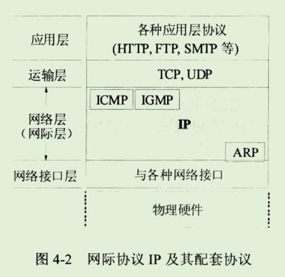

```
本章讨论网络互连问题，也就是讨论多个网络通过路由器互联成为一个互连网络(互联网)的各种问题。

在介绍网络层提供的两种不同服务后，就进入本章的核心内容---网际协议IP，这是本书的一个重点内容。
只有深入的掌握了IP协议的主要内容，才能理解因特网是怎么样工作的。

本章还要讨论网际控制报文协议 ICMP 和几种常用的路由选择协议，以及IP多播的概念。
最后简要的介绍虚拟专用网 VPN和网络地址转换NAT。
```

百度百科ARP协议

[百度百科ARP协议](https://baike.baidu.com/item/ARP/609343?fromtitle=ARP%E5%8D%8F%E8%AE%AE&fromid=1742212&fr=aladdin)

## ARP地址解析协议

```
地址解析协议，即ARP(Address Resolution Protocol)，是根据IP地址获取物理地址的一个TCP/IP协议。
主机发送信息时将包含目标IP地址的ARP请求广播到局域网上的所有主机，并接收返回消息，以此确定目标的物理地址;
收到返回消息后将该IP地址和物理地址存入本机ARP缓存中并保留一定时间，下次请求时直接查询ARP缓存以节约资源。
地址解析协议是建立在网络中各个主机互相信任的基础上的，局域网络上的主机可以自主发送ARP应答消息，其他主机收到应答报文时不会检测该报文的真实性就会将其记入本机ARP缓存;
由此攻击者就可以向某一主机发送伪ARP应答报文，使其发送的信息无法到达预期的主机或到达错误的主机，这就构成了一个ARP欺骗。

ARP命令可用于查询本机ARP缓存中IP地址和MAC地址的对应关系、添加或删除静态对应关系等。
相关协议有RARP、代理ARP。NDP用于在IPV6汇总代替地址解析协议。
```

### 功能

```
地址解析协议有互联网工程任务组(IETF)d在1982年11月发布的RFC826中描述指定。

地址解析协议是IPv4中必不可少的协议，而IPv4是使用较为广泛的互联网协议版本(IPv6仍然处在部署的初期)。

OSI模型把网络工作分为7层，IP地址在OSI模型的第三层，MAC地址在第二层，彼此不直接打交道。
在通过以太网发送IP数据包时，需要先封装第三层（32位IP地址）、第二层（48位MAC地址）的报头，但由于发送时只知道目标IP地址，不知道其MAC地址，又不能跨第二、三层，所以需要使用地址解析协议。使用地址解析协议，可根据网络层IP数据包包头中的IP地址信息解析出目标硬件地址（MAC地址）信息，以保证通信的顺利进行。
```

### 原理

```
工作过程
主机A的IP地址为192.168.1.1，MAC地址为0A-11-22-33-44-01；
主机B的IP地址为192.168.1.2，MAC地址为0A-11-22-33-44-02；

当主机A要与主机B通信时，地址解析协议可以将主机B的IP地址(192.168.1.2)解析成主机B的MAC地址，以下为工作流程：

1、根据主机A上的路由表内容，IP确定用于访问主机B的转发IP地址是192.168.1.2。
然后A主机在自己本地ARP缓存中检查主机B的匹配MAC地址。

2、如果主机A在ARP缓存中没有找到映射，她将询问192.169.1.2的硬件地址，从而将ARP请求帧广播到本地网络上的所有主机。
源主机A的IP地址和MAC地址都包括在ARP请求中。
本地网络上的每一台主机都接收到ARP请求并且检查是否与自己的IP地址匹配。
如果主机发现请求的IP地址与自己的IP地址不匹配，它将丢弃ARP请求。

3、主机B确定ARP请求中IP地址与自己的IP地址匹配，则将主机A的IP地址和MAC地址映射添加到本地ARP缓存中。

4、主机B将包含其MAC地址的ARP回去消息直接发送回主机A.

5、当主机A收到从主机B发来的ARP回复消息时，会用主机B的IP和MAC地址映射更新ARP缓存。
本机缓存是有生存期的，生存期结束以后，将再次重复上面的过程。
主机B的MAC地址一旦确定，主机A就能向主机B发送IP通信了。
```

#### ARP缓存

```
ARP缓存是个用来存储IP地址和MAC地址的缓冲区，其本质就是一个IP地址 ->MAC地址的对应表，表中每一个条目分别记录了网络上其他主机的IP地址和对应的MAC地址。
每一个以太网或令牌环网络适配器都有自己单独的表。
当地址解析协议被询问一个已知IP地址节点的MAC地址时，先在ARP缓存中查看，若存在，就直接返回与之对应的MAC地址，若不存在，才发送ARP请求向局域网查询。
```

```
为了使广播量最小，ARP维护IP地址到MAC地址映射的缓存以便将来使用。
ARP缓存可以包含动态和静态项目。
动态项目随时间添加和删除。
每个动态ARP缓存项的潜在生命周期是10分钟。
新加到缓存中的项目带有时间戳，如果某个项目添加后两分钟内没有再使用，则此项目过期并从ARP缓存中删除;
如果某个项目已经在使用，则又收到2分钟的生命周期，一直到10分钟最长生命周期。
静态项目一直保留在缓存中，直到重新启动计算机为止。
```

### ARP命令

```
ARP缓存中包含一个或多个表，它们用于存储IP地址及其经过解析的MAC地址。ARP命令用于查询本机ARP缓存中IP地址-->MAC地址的对应关系、添加或删除静态对应关系等。如果在没有参数的情况下使用，ARP命令将显示帮助信息。
```

#### 常见用法

```
arp -a 或 arp -g
用于查看缓存中的所有项目。
-a -g参数的结果是一样的，多年来-g一直是UNIX平台上用来显示ARP缓存中所有项目的选项，而Windows用的是arp -a（-a可被视为all，即全部的意思），但它也可以接受比较传统的-g选项。
```

```
arp -a Ip
如果有多个网卡，那么使用arp -a加上接口的IP地址，就可以只显示与该接口相关的ARP缓存项目。
arp -s Ip 物理地址
可以向ARP缓存中人工输入一个静态项目。该项目在计算机引导过程中将保持有效状态，或者在出现错误时，人工配置的物理地址将自动更新该项目。
arp -d Ip
使用该命令能够人工删除一个静态项目。
```

### ARP欺骗

```
地址解析协议是建立在网络中各个主机互相信任的基础上的，它的诞生使得网络能够更加高效的运行，但其本身也存在缺陷：

ARP地址转换表是依赖于计算机中高速缓冲存储器动态更新的，而高速缓冲存储器的更新是受到更新周期的限制的，只保存最近使用的地址的映射关系表项，这使得攻击者有了可乘之机，可以在高速缓冲存储器更新表项之前修改地址转换表，实现攻击。

ARP请求为广播形式发送的，网络上的主机可以自主发送ARP应答消息，并且当其他主机收到应答报文时不会检测该报文的真实性就将其记录在本地的MAC地址转换表，这样攻击者就可以向目标主机发送伪ARP应答报文，从而篡改本地的MAC地址表。 

ARP欺骗可以导致目标计算机与网关通信失败，更会导致通信重定向，所有的数据都会通过攻击者的机器，因此存在极大的安全隐患。
```

### RARP

```
地址解析协议是根据IP地址获取物理地址的协议，而反向地址转换协议RARP是局域网的物理机器从网关服务器的ARP表或者缓存上根据MAC地址请求IP地址的协议，其功能与地址解析协议相反。

与ARP相比，RARP的工作流程也相反。
首先是查询主机向网路送出一个RARP Request广播封包，向别的主机查询自己的IP地址。
这时候网络上的RARP服务器就会将发送端的IP地址用RARP Reply封包回应给查询者，这样查询主机就获得自己的IP地址了。 [8] 
```

### 代理ARP

```
地址解析协议工作在一个网段中，而代理ARP（Proxy ARP，也被称作混杂ARP（Promiscuous ARP） [9-10]  ）工作在不同的网段间，其一般被像路由器这样的设备使用，用来代替处于另一个网段的主机回答本网段主机的ARP请求。

例如，主机PC1（192.168.20.66/24）需要向主机PC2（192.168.20.20/24）发送报文，因为主机PC1不知道子网的存在且和目标主机PC2在同一主网络网段，所以主机PC1将发送ARP协议请求广播报文请求192.168.20.20的MAC地址。
这时，路由器将识别出报文的目标地址属于另一个子网（注意，路由器的接口IP地址配置的是28位的掩码），因此向请求主机回复自己的硬件地址（0004.dd9e.cca0）。
之后，PC1将发往PC2的数据包都发往MAC地址0004.dd9e.cca0（路由器的接口E0/0），由路由器将数据包转发到目标主机PC2。
（接下来路由器将为PC2做同样的代理发送数据包的工作）。
代理ARP协议使得子网化网络拓扑对于主机来说时透明的（或者可以说是路由器以一个不真实的PC2的MAC地址欺骗了源主机PC1）。
```

### NDP

```
地址解析协议是IPv4中必不可少的协议，但在IPv6中将不再存在地址解析协议。在IPv6中，地址解析协议的功能将由NDP（邻居发现协议，Neighbor Discovery Protocol）实现，它使用一系列IPv6控制信息报文（ICMPv6）来实现相邻节点（同一链路上的节点）的交互管理，并在一个子网中保持网络层地址和数据链路层地址之间的映射。邻居发现协议中定义了5种类型的信息：路由器宣告、路由器请求、路由重定向、邻居请求和邻居宣告。与ARP相比，NDP可以实现路由器发现、前缀发现、参数发现、地址自动配置、地址解析（代替ARP和RARP）、下一跳确定、邻居不可达检测、重复地址检测、重定向等更多功能。
```

**NDP与ARP的区别**

- IPv4中地址解析协议是独立的协议，负责IP地址到MAC地址的转换，对不同的数据链路层协议要定义不同的地址解析协议。IPv6中NDP包含了ARP的功能，且运行于因特网控制信息协议ICMPv6上，更具有一般性，包括更多的内容，而且适用于各种数据链路层协议；
- 地址解析协议以及ICMPv4路由器发现和ICMPv4重定向报文基于广播，而NDP的邻居发现报文基于高效的[组播](https://baike.baidu.com/item/组播)和[单播](https://baike.baidu.com/item/单播)。


## 简介

```
本章讨论网络互连问题，也就是讨论多个网络通过路由器互连成为一个互连网络(或互联网)的各种问题。
在介绍网络层提供的两种不同服务后，就进入本章的核心内容 --- 网际协议IP，这是本书的一个重要内容。
只有深入的掌握了IP协议的主要内容，才能理解因特网是怎么样工作的。
本章还要讨论网际控制报文协议ICMP和几种常用的路由选择协议，以及IP多播的概念。
最后简要的介绍虚拟专用网VPN和网络地址转换NAT。
```

```
本章最重要的内容是：
1、虚拟互联网络的概念。
2、IP地址与物理地址的关系。
3、传送的分类的IP地址(包括子网掩码)和无分类域间路由选择CIDR。
4、路由选择协议的工作原理。
```

## 1、网络层提供的两种服务

```
在计算机网络领域，网络层应该向运输层提供怎么样的服务("面向连接"还是"无连接")曾引起了长期的争论。
争论焦点的实质就是:在计算机通信中，可靠交付应当由谁来负责？是网络还是端系统？
```

```
有些人认为应当借助于电信网的成功经验，让网络负责可靠交付。
大家知道，传统电信网的主要业务是提供电话服务。
电信网使用昂贵的程控交换机(其软件也非常复杂)，
用面向连接的通信方式，使电信网络能够向用户(实际上就是电话机)提供可靠传输的服务。

因此他们认为，计算机网络也应模仿打电话所使用的面向连接的通信方式。
当两个计算机进行通信时，也应当先建立连接(但在分组交换中是建立一条虚电路VC(Virtual Circuit))，
以保证双方通信所需的一切网络资源。
然后双方就沿着已建立的虚电路发送分组。
这样的分组的首部不需要填写完整的目的主机地址，只需要填写这条虚电路的编号(一个不大的整数)，因而减少了分组的开销。
这种通信方式如果再使用可靠传输的网络协议，就可使所发送的分组无差错按序到达终点，当然也不丢失、不重复。
在通信结束后要释放建立的虚电路。
```


```
图4-1(a)是网络提供虚电路服务的示意图。
主机H1和H2之间交换的分组都必须在事先建立的虚电路上面传送。
```

```
但因特网的先驱者却提出了一种崭新的网络设计思路。
他们认为，电信网提供的端到端可靠传输的服务对电话业务无疑是很合适的，因为电信网的终端(电话机)非常简单，没有智能，也没有差错处理能力。
因此电信网必须负责把用户电话机产生的话音信号可靠的传送到对方的电话机，
使还原后的话音质量符合技术规范的要求。
但计算机网络的端系统是有智能的计算机。
计算机有很强的差错处理的能力(这点和传送的电话机有本质上的差别)。
因此，因特网在设计上就采用了和电信网完全不同的思路。
```

```
因特网采用的设计思路是这样的：
网络层向上只提供简单灵活的、无连接的、尽最大入力交付的数据报服务。

网络在发送分组时不需要先建立连接。
每一个分组(也就是IP数据报)独立发送，与其前后的分组无关(不进行编号)。
网络层不提供服务质量的承诺。
也就是说，所传送的分组可能出错、丢失、重复和失序(即不按序到达终点)，当然也不保证分组交付的时限。
由于传输网络不提供端到端的可靠传输服务，这就使网络中的路由器可以做的比较简单，而且价格低廉(与电信网的交换机相比较)。
如果主机(即端系统)中的进程之间的通信需要是可靠的，那么就由主机中的运输层负责(包括差错处理、流量控制等)。
采用这种设计思路的好处是：网络的造价大大降低，运行方式灵活，能够适应多种应用。
因特网能够发展到今日的规模，充分证明了当初采用这种设计思路的正确性。
图4-1(b)给出了网络提供数据报服务的示意图。
主机H1向H2发送的分组各自独立的选择路由，并且在传送的过程中还可能丢失。
```


```
OSI体系的支持者曾极力主张在网络层使用虚电路服务。
他们也曾推出过网络层虚电路服务的著名标准 --ITU-T的X.25的建议书，但是现在早已成为历史了。

表4-1归纳了虚电路服务与数据报服务的主要区别。
```

## 2、网际协议IP

```
网际协议IP是TCP/IP体系中两个最主要的协议之一，也是最重要的因特网标准协议之一。
与IP协议配套使用的还有三个协议：
地址解析协议ARP(Address Resolution Protocol)
网际控制报文协议ICMP(Internet Control Message Protocol)
网际组管理协议IGMP(Internet Group Management Protocol)

本来还有一个协议叫做逆地址解析协议RARP(Reverse Address Resolution Protocol),是和ARP协议配合使用的。但现在已被淘汰不使用了。
```



```
图4-2画出了这三个协议和网际协议IP的关系。
在这一层中，ARP画在最下面，因为IP经常要使用这个协议。

ICMP和IGMP画在这一层的上部，因为它们要使用IP协议。
这三个协议将在后面陆续介绍。

由于网际协议IP是用来使互连起来的许多计算机网络能够进行通信，
因此TCP/IP体系中的网络层常常称为网际层(internet layer),或IP层。
```

### 1、虚拟互连网络

```
在讨论网际协议IP之前，必须了解什么是虚拟互连网络。
```

```
我们知道，如果要把全世界范围内数以百万计的网络都互连起来，并且能够互相通信，那么这样的任务一定非常复杂。
其中会遇到许多问题需要解决，如：

1、不同的寻址方案
2、不同的最大分组长度
3、不同的网络接入机制
4、不同的超时控制
5、不同的差错恢复方法
6、不同的状态报告方法
7、不同的路由选择技术
8、不同的用户接入控制
9、不同的服务(面向连接服务和无连接服务)
10、不同的管理与控制方式;等等
```

```
能不能让大家都使用相同的网络，这样可使网络互连变得比较简单。答案是不行的。
因为用户的需求是多种多样的，没有一种单一的网络能够适应所有用户的需求。

另外，网络的技术是不断发展的，网络的制造厂家也要经常推出新的网络，在竞争中生存。
因此在市场中总是有很多种不同性能、不同网络协议的网络，供不同的用户选用。
```

```
从一般的概念来讲，将网络互相连接起来要使用一些中间设备。
根据中间设备所在的层次，可以有以下四种不同的中间设备：
1、物理层使用的中间设备叫做转发器(repeater)。(和集线器差不过hub)
2、数据链路层使用的中间设备叫做网桥或桥接器(bridge).
3、网络层使用的中间设备叫做路由器(router).
4、在网络层以上使用的中间设备叫做网关(gateway).
用网关连接两个不兼容的系统需要在高层进行协议的转换。
```

```
当中间设备是转发器或网桥时，这仅仅是把一个网络扩大了，而从网络层的角度看，这仍然是一个网络，一般并不称之为网络互连。
网关由于比较复杂，目前使用的较少。
因此现在我们讨论网络互连时，都是指用路由器进行网络互连和路由选择。
路由器其实就是一台专用计算机，用来在互联网中进行路由选择。
由于历史的原因，许多有关TCP/IP的文献曾经把网络层使用的路由器称为网关(在本书中，有时也这样用)，对此读者加以注意。
```


```
TCP/IP体系在网络互连上采用的做法是在网络层(即IP层)采用了标准化协议，但互相连接的网络则可以是异构的。

图4-3(a)表示有许多计算机网络通过一些路由器进行互连。
由于参加互连的计算机网络都使用相同的网际协议IP(Internet Protocol)，
因此可以把互连以后的计算机网络看成如图4-3(b)所示的一个虚拟互连网络(internet)。
所谓虚拟互连网络也就是逻辑互连网络，它的意思就是互连起来的各种物理网络的异构性本来是客观存在的，但是我们利用IP协议就可以使这些性能各异的网路在网络层上看起来好像是一个统一的网络。
```

```
这种使用IP协议的虚拟互联网可简称为IP网(IP网是虚拟的，但平常不必每次都强调"虚拟"二字)。
使用IP网的好处是：当IP网上的主机进行通信时，就好像在一个单个网络上通信一样，它们看不见互连的各网络的具体异构细节(如具体的编址方案、路由选择协议，等等)。
```

### 2、分类的IP地址

#### 1、IP地址及其表示方法

```
整个的因特网就是一个单一的、抽象的网络。
IP地址就是给因特网上的每一个主机(或路由器)的每一个接口分配一个在全世界范围是唯一的32位标识符。
IP地址的结构使我们可以再因特网上很方便的进行寻址。
IP地址现在由因特网名字和数字分配机构ICANN(Internet Corporation for Assigned Names and Numbers)进行分配。
```

```
IP地址的编址方法共经过了三个历史阶段:
1、分类的IP地址。 这是最基本的编址方法，在1981年就通过了相应的标准协议。

2、子网的划分。
	这是对最基本的编址方法的改进，其标准RFC950在1985年通过。
	
3、构成超网。
	这是比较新的无分类编址方法。1993年提出后很快得到推广应用。
```

```
所谓分类的IP地址 就是将IP地址划分为若干个固定类，
每一类地址都由两个固定长度的字段组成，

其中第一个字段是 网络号(net-id),
它标志主机(或路由器)所连接到的网络。
一个网络号在整个因特网范围内必须是唯一的。

第二个字段是主机号(host-id),
它标志该主机(或路由器)。
一个主机号在它前面的网络号所指明的网络范围内必须是唯一的。
由此可见，一个IP地址在整个因特网范围内是唯一的。
```


```
从图4-5可以看出：
A类、B类和C类地址的网络号字段(在图中这个字段是灰色的)分别为1,2和3字节长，而在网络号字段的最前面有1~3位的类别位，其数值分别规定为0,10,110。

A类、B类和C类地址的主机号字段分别为3个、2个和1个字节长
D类地址(前4位是1110)用于多播(一对多通信)。
E类地址(前4位是1111)保留为以后用。
```

```
这里要指出，由于近年来已经广泛的使用无分类IP地址进行路由选择，A类、B类和C类地址的区分已经成为历史，但由于很多文献和资料都还使用传统的分类IP地址，而且从概念的演讲上更清晰，因此我们在这里还要从分类IP地址讲起。
```


