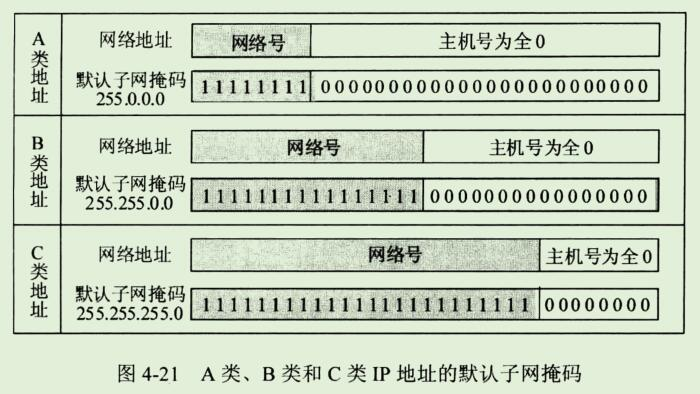
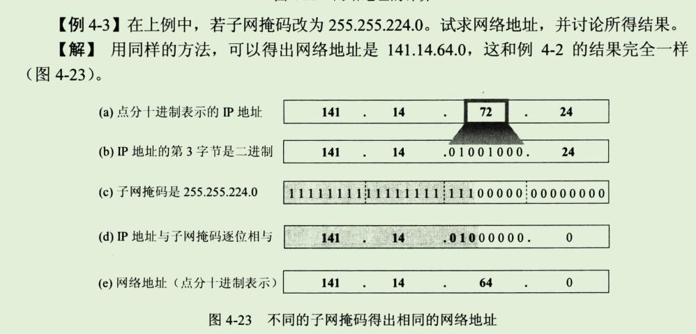
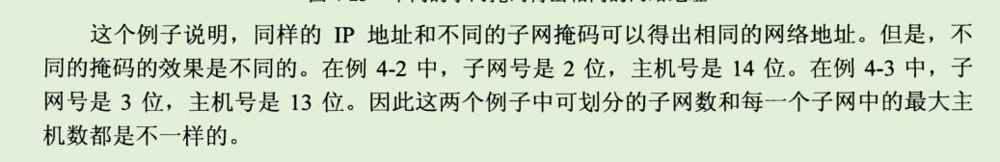

## 3、划分子网和构造超网

### 1、划分子网

#### 1、从两级IP地址到三级IP地址

```
在今天看来，在ARPANET 的早期，IP地址的设计确实不够合理。

第一，IP地址空间的利用率有时很低。

每一个A类地址网络可连接的主机数超过1000万台。
而每一个B类地址网络可连接的主机数也超过6万台。
然而有些网络对连接在网络上的计算机数目有限制，
根本达不到这样大的数值。
例如10BASE-T以太网规定其最大结点数只有1024个。
这样的以太网若使用一个B类地址就浪费6万多个IP地址，
地址空间利用率还不到2%，而其他单位的主机无法使用这些被浪费的地址。

有的单位申请到了一个B类地址网络，但所连接的主机数并不多，可是又不愿意申请一个足够使用的C类地址，理由是考虑到今后可能的发展.

IP地址的浪费，还会使IP地址空间的资源过早的被用完。
```

```
第二，给每一个物理网络分配一个网络号会使路由表变得太大因而时网络性能变坏。

每一个路由器都应当能够从路由表查出怎样到达网络的下一跳路由器。
因此，互联网中的网络数越多，路由器的路由表的项目数也就越多。

这样，即使我们拥有足够多的IP地址资源可以给每一个物理网络分配一个网络号，也会导致路由器中的路由表中的项目数过多。

这不仅增加了路由器的成本(需要更多的存储空间)，而且使查找路由时耗费更多的时间，同时也使路由器之间定期交换的路由信息急剧增加，因而使路由器和整个因特网的性能都下降了。
```

```
第三，两级IP地址不够灵活。

有些情况紧急，一个单位需要在新的地点马上开通一个新的网络。
但是在申请一个新的IP之前，新增加的网络是不可能连接到因特网上工作的。
我们希望有一种方法，使一个单位能随时灵活的增加本单位的网络，而不必事先到因特网管理机构去申请新的网络号。
原来的两级IP无法做到这一点。
```

```
为了解决上述问题，从1985年起在IP地址中又增加了一个"子网号字段"，使两级IP地址变成为三级IP地址，它能够较好的解决上述问题，并且使用起来也很灵活。
这种做法叫做 划分子网(subnetting)，或子网寻址 或 子网路由选择。

划分子网已成为因特网的正式标准协议。
```


划分子网的基本思路如下：

```
1、一个拥有许多物理网络的单位，可将所属的物理网络划分为若干个子网(subnet)。
划分子网纯属一个单位内部的事情。
本单位以外的网络看不见这个网络是由多少个子网组成，因为这个单位对外仍然表现为一个网络。
```

```
2、划分子网的方法是从网络的主机号借用若干位 作为子网号 subnet-id,当然主机号也就相应减少了同样的位数。

于是两级IP地址在本单位内部就变为三级IP地址：
网络号、子网号和主机号。
也可以用以下记法来表示：

```


```
3、凡是从其他网络发送给本单位某个主机的IP数据报，仍然是根据IP数据报的目的网络号找到连接在本单位网络上的路由器。
但此路由器在收到IP数据报后，再按目的网络号和子网号找到目的子网，把IP数据报交付目的主机。
```


```
总之，当没有划分子网时，IP地址是两级结构。
划分子网后IP地址就变成了三级结构。
划分子网只是把IP地址的主机号这部分进行再划分，而不改变IP地址原来的网络号。
```

#### 2、子网掩码

```
现在剩下的问题就是：
假定有一个数据报(其目的地址是145.12.3.10)已经到达了路由器R1。
那么这个路由器如何把它转发到子网145.13.3.0呢？
```

```
我们知道，从IP数据报的首部无法看出源主机或目的主机所连接的网络是否进行了子网的划分。

这是因为32位的IP地址本身以及数据报的首部都没有包含任何有关子网划分的信息。
因此必须另外想办法，这就是使用子网掩码(subnet mask)(见图4-20)。
```


```
图4-20(a)是IP地址为 145.13.3.10 的主机本来的两级IP地址结构。
图4-20(b)是这个两级IP地址的子网掩码。
图4-20(c)是同一地址的三级IP地址结构，也就是说，现在从原来16位的主机号中拿出8位作为子网号，而主机号由16位减少到8位。

请注意，现在子网号为3的网络的网络地址是145.13.3.0 (既不是原来两级IP地址的网络地址 145.13.0.0，也不是简单的子网号3)。
为了使路由器R1能够很方便的从数据报中的目的IP地址中提取出所要找的子网的网路地址，路由器R1就要使用三级IP地址的子网掩码。

图4-20(d)是三级IP地址的子网掩码，它也是32位，由一串1和跟随一串0组成。
子网掩码中的1对应于IP地址中原来二级地址中的16位网络号加上新增的8位子网号，而子网掩码中的0对应于现在的8位主机号。

虽然RFC文档中没有规定子网掩码中的一串1必须是连续的，但却极力推荐在子网掩码中选用连续的1，以免出现可能发生的差错。
```

```
图4-20(e)表示R1把三级IP地址的子网掩码和收到的数据报的目的IP地址145.13.3.10 逐位相"与"(AND)(计算机进行这种逻辑AND运算是很容易的)，
得出了所要找的子网的网络地址145.13.3.0。
```

```
使用子网掩码的好处就是:
不管网络有没有划分子网，只要把子网掩码和IP地址进行逐位的"与"运算(AND),就立即得出网络地址来。
这样在路由器处理到来的分组时就可采用同样的算法。
```

```
归纳一下上述的要点。
从网络145.13.0.0外面看，这就是一个普通的B类网络，其子网掩码为16个连1后面跟上16个连0。

但进入到这个网络后(即到了路由器R1)，就看到了还有许多网络(即划分了子网后的许多网络)，其网络地址是 145.13.x.0(这里的x可以表示为不同的数值)，而这些网络的子网掩码都是24个连1后面跟上8个连0。
总之，在这个B类网络的外面和里面，看到的网络是不一样的。
```

```
这里还要弄清一个问题，这就是：
在不划分子网时，既然没有子网，为什么还要使用子网掩码？
这就是为了更便于查找路由表。
现在因特网的标准规定：所有的网路都必须使用子网掩码，同时在路由器的路由表中也必须有子网掩码这一栏。

如果一个网络不划分子网，那么该网络的子网掩码就使用默认子网掩码。

默认子网掩码中的1的位置和IP地址汇总的网络号字段net-id正好相对应。
因此，若用默认子网掩码和某个不划分子网的IP地址逐位相"与"(AND),就应当能够得出该IP地址的网络地址来。
```

```
这样做可以不用查找该地址的类别位就能知道这是哪一类的IP地址。
显然，
A类地址的默认子网掩码是255.0.0.0，或0xFF000000；
B类地址的默认子网掩码是255.255.0.0，或0xFFFF0000；
C类地址的默认子网掩码是255.255.255.0，或0xFFFFFF00；
```

```
图4-21是这三类IP地址的网络地址和相应的默认子网掩码。
```



```
子网掩码是一个网络或一个子网的重要属性。
在RFC950成为因特网的正式标准后，路由器在和相邻路由器交换路由信息时，必须把自己所在网络(或子网)的子网掩码告诉相邻路由器。
在路由器的路由表中的每一个项目，除了要给出目的网络地址外，还必须同时给出该网络的子网掩码。
若一个路由器连接在两个子网上就拥有两个网络地址和两个子网掩码。
```


```
在表中4-6中，子网数是根据子网号subnet-id计算出来的。
若subnet-id有n位，则共有2^n种可能的排列。
除去全0和全1这两种情况，就得出表中的子网数。

表中"子网号的位数"中没有0,1,15,和16这四种情况，因为这没有意义。
0的话就是B类地址
1的话 只有0,1两位;又因为0就是B类地址,所以是有1有用;只有一个子网也没有意义。

15的话 主机号只有0,1 而全0和全1;代表的是本网络和所有主机;没有意义

16的话 就只有网络号 没有子网号了;
```

```
请读者注意，虽然根据已成为因特网标准协议的RFC950文档，子网号不能为全1或全0，但随着无分类域间路由选择CIDR的广泛使用，现在全1和全0的子网号也可以使用了，但一定要谨慎使用，要弄清你的路由器所用的路由选择软件是否支持全0或全1的子网号这种较新的用法。
```

```
我们可以看出，若使用较少位数的子网号，则每一个子网上可连接的主机数就较多。
凡是若使用较多位数的子网号，则子网的数目较多但每个子网上可连接的主机数就较少。

因此我们可根据具体情况(一共需要划分多少个子网，每个子网中最多有多少个主机)来选择合适的子网掩码。
```

```
通过简单的计算，读者不难得出这样的结论：划分子网增加了灵活性，但却减少了能够连接在网络上的主机总数。
例如，本来一个B类网络最多可连接65534台主机，但表4-6中任意一行的最后两项的乘积一定小于65534.

对A类和C类地址的子网划分也可得出类似的表格，读者可自行算出。
```

**例子**


```
例4-2 
	已知IP地址是141.14.72.24, 子网掩码是255.255.192.0。
	试求网络地址。
	
解
	与一下就可以了
```





```
下面进一步讨论使用了子网掩码以后应怎样查找路由器。
```


### 2、使用子网时分组的转发

```
在划分子网的情况下，分组转发的算法必须做相应的改动。

我们应当注意到，使用子网划分后，路由表必须包含以下三项内容：
目的网络地址、子网掩码和下一跳地址。
```

```
在划分子网的情况下，路由器转发分组的算法如下：

1、从收到的数据报的首部提取目的IP地址D。
2、先判断是否为直接交付。
	对路由器直接相连的网络逐个进行检查：用各网络的子网掩码和D逐位相"与"(AND操作)，看结果是否和相应的网络地址匹配。
	若匹配，则把分组进行直接交付(当然还需要把D转换成物理地址，把数据报封装成帧发送出去)，转发任务结束。
	否则就是间接交付，执行3。
	
3、若路由表中有目的地址为D的特定主机路由，则把数据报传送给路由表中所指明的下一跳路由器;
	否则，执行4。
	
4、对路由表中的每一行(目的网络地址，子网掩码，下一跳地址)，用其中的子网掩码和D逐位相"与"(AND操作)，其结果为N。
若N与该行的目的网络地址匹配，则把数据报传送给该行指明的下一跳路由器;
否则，执行5.

5、若路由表中有一个默认路由，则把数据报传送给路由表中所指明的默认路由器;否则执行6。

6、报告转发分组出错。
```


### 3、无分类编址 CIDR(构成超网)

#### 1、网络前缀

```
划分子网一定程度上缓解了因特网在发展中遇到的困难。
然后在1992年因特网仍然面临三个必须尽早解决的问题，这就是：
1、B类地址在1992年已分配了近一半，眼看很快就将全部分配完毕！

2、因特网主干网上的路由表中的项目急剧增长(从几千个增长到几万个)。

3、整个IPv4的地址空间最终将全部耗尽。在2011年2月3日，IANA宣布IPv4地址已经耗尽了。
```

```
当时预计前两个问题将在1994年变得非常严重。
因此IETF很快的就研究出采用  无分类编址 的方法来解决前两个问题。
IETF认为上面的第三个问题属于更加长远的问题，因此专门成立IPv6工作组负责研究解决新版本IP协议的问题。
```

```
其实早在1987年，RFC1009就指明了在一个划分子网的网络中可同时使用几个不同的子网掩码。
使用变长子网掩码VLSM(Variable Length Subnet Mask)可进一步提高IP地址资源的利用率。
在VLSM的基础上又进一步研究出无分类编址方法，它的正式名字是无分类遇见路由选择CIDR(Classless Inter-Domain Routing,CIDR的读音是 "sider")。

在1993年形成了 CIDR 的RFC文档：RFC1517~1519和RFC1520。
较新的CIDR文档是2006年发表的RFC4632，已把老的文档1519列为陈旧的。
```

```
CIDR最主要的特点有两个：
1、CIDR消除了传统的A类、B类和C类地址以及划分子网的概念，因而可以更加有效的分配IPv4的地址空间，并且可以在新的IPv6使用之前容许因特网的规模继续增长。

CIDR把32位的IP地址划分为两个部分。
前面的部分是"网络前缀"(network-prefix)(或简称为"前缀")，用来指明网络，后面的部分则用来指明主机。

因此CIDR(classless inter-domain routing)使IP地址从三级编址(使用子网掩码)又回到了两级编码，但这已是无分类的两级编址。
它的记法是：
```


```
CIDR 还使用"斜线记法"(slash notation),或称为CIDR记法，即在IP地址后面加上斜线"/"，然后写上网络前缀所占的位数。
```

```

2、CIDR把网络前缀都相同的连续IP地址组成一个"CIDR 地址块"。
我们只要知道CIDR地址块中的任何一个地址，就可以知道这个地址块的起始地址(即最小地址)和最大地址，以及地址块中的地址数。
```


```
当然，这两个主机号是全0和全1的地址一般并不使用。
通常只使用在这两个地址之间的地址。
不难看出，这个地址块共有2^12个地址。
我们可以用 地址块中的最小地址 和 网络前缀的位数 指明这个地址块。

例如，上面的地址块可记为 128.14.32.0/20。
不需要指出地址块的起始地址时，也可把这样的地址块简称为 "/20地址块"。
```

```
为了更方便的进行路由选择，CIDR使用32位的地址掩码(address mask)。
地址掩码由一串1和一串0组成，而1的个数就是网络前缀的长度。
虽然CIDR不使用子网了，但由于目前仍有一些网络还使用子网划分和子网掩码，因此CIDR使用的地址掩码也可继续称为子网掩码。

例如，/20地址块的地址掩码是：
11111111 11111111 11110000 00000000(20个连续的1)。

斜线记法中，斜线后面的数字就是地址掩码中1的个数。
```

```
请读者注意，"CIDR不使用子网"是指CIDR并没有在32位地址中指明若干位作为子网字段。
但分配到一个CIDR地址块的单位，仍然可以在本单位内根据需要划分出一些子网。
这些子网也都只有一个网络前缀和一个主机号字段，但子网的网络前缀比整个单位的网络前缀要长些。
例如，某单位分配到地址块/20，就可以再继续划分为8个子网(即需要从主机号中借用3位来划分子网)。
这时每一个子网的网络前缀就变成了23位(原来的20位加上从主机号借来的3位)，比该单位的网络前缀多了3位。
```

```
斜线记法还有一个好处就是它除了表示一个IP地址外，还提供了其他一些重要信息。
我们举例说明如下。
```


```
由于一个CIDR 地址块中有很多地址，所以在路由表中就利用CIDR地址块来查找目的网络。
这种地址的聚合常称为路由聚合(route aggregation), 它使得路由表中的一个项目可以表示原来传统分类地址的很多个(例如上千个)路由。
路由聚合也称为构成超网(supernetting)。

如果没有采用CIDR，则在1994和1995年，因特网的一个路由表就会超过7万个项目，而使用了CIDR后，在1996年一个路由表的项目才只有3万多个。
路由聚合有利于减少路由器之间的路由选择信息的交换，从而提高了整个因特网的性能。
```

```
CIDR记法有多种形式，例如，地址块10.0.0.0/10可简写为10/10,也就是把点分十进制中低位连续的0省略。
另一种简化表示方法是在网络前缀的后面加一个星号*，如：
00001010 00*

意思是：在星号*之前是网络前缀，而星号*表示IP地址中的主机号，可以是任意值。

前缀位数不是8的整数倍时，需要进行简单的计算才能得到一些地址信息。
```


```
从表4-7可看出，每一个CIDR地址块中的地址数一定是2的整数次幂。
除最后几行外，CIDR地址块都包含了多个C类地址(是一个C类地址的2^n倍，n是整数)，这就是"构成超网"这一名词的来源。
```

```
使用CIDR的一个好处就是可以更加有效的分配IPv4的地址空间，可根据客户的需要分配适当大小的CIDR地址块。
然而在分类地址的环境中，向一个组织分配IP地址，就只能以/8,/16或/24为单位来分配。这就很不灵活。
```


```
图4-25给出的是CIDR地址块分配的例子。
假定某ISP已拥有地址块 206.0.64.0/18(相当于有64个C类网络)。

现在某大学需要800个IP地址。
ISP可以给该大学分配一个地址块206.0.68.0/22，它包括1024(即2^10)个IP地址，相当于4个连续的C类/24地址块，占该ISP拥有的地址空间的1/16。

这个大学然后可自由地对本校的各系分配地址块，而各系还可再划分本系的地址块。
CIDR的地址块分配有时不易看清，这是因为网络前缀和主机号的界限不是恰好出现在整数字节处。
只要写出地址的二进制表示(从图中的地址块的二进制表示中可看出，实际上只需要将其中的一个关键字节转换为二进制的表示即可)，弄清网络前缀的位数，就不会把地址块的范围弄错。
```

```
从图4-25可以清楚的看出地址聚合的概念。
这个ISP共拥有64个C类网络。
如果不采用CIDR技术，则在该ISP的路由器交换路由信息的每一个路由器的路由表中，就需要有64个项目。
但采用地址聚合后，就只需用路由聚合后的一个项目206.0.64.0/18就能找到该ISP。

同理，这个大学共有4个系。
在ISP内的路由器的路由表中，也是需要使用206.0.68.0/22这一个项目。
```

```
从图4-25下面表格中的二进制地址可看出，把四个系的路由聚合为大学的一个路由(即构成超网)，是将网络前缀缩短。
网络前缀越短，其地址块所包含的地址数就越多。
而在三级结构的IP地址中，划分子网是使网络前缀变长。
```


#### 2、最长前缀匹配

```
在使用CIDR时，由于采用了网络前缀这种记法，IP地址由网络前缀和主机号这两个部分组成，因此在路由表中的项目也要有相应的改变。
这时，每个项目由"网络前缀"和"下一跳地址"组成。
但是在查找路由表时可能会得到不止一个匹配结果。
这样就带来一个问题：我们应当从这些匹配结果中选择哪一条路由呢?
```

```
正确的答案是：
应当从匹配结果中选择具有最长网络前缀的路由。
这叫做最长前缀匹配(longest-prefix matching),这是因为网络前缀越长，其地址块就越小，因而路由就越具体(more specific)。

最长前缀匹配又称为最长匹配或最佳匹配。
为了说明最长前缀匹配的概念，我们仍以前面的例子来讨论。
```

```
假定大学下属的四系希望ISP把转发给四系的数据报直接发到四系而不要经过大学的路由器，但又不愿意改变自己使用的IP地址块。

因此，在ISP的路由器的路由表中，至少要有以下两个项目，即206.68.0/22(大学)和206.0.71.128/25(四系)。

现在假定ISP收到一个 数据报，其目的IP地址为D=206.0.71.130。
把D分别和路由表中这两个项目的掩码逐位相"与"(AND操作)。
将所得的逐位AND操作的结果按顺序写在下面。
```


```
不难看出，现在同一个IP地址D可以在路由表中找到两个目的网络(大学和四系)和该地址相匹配。
根据最长前缀匹配的原理，应当选择后者，把收到的数据报转发到后一个目的网络(四系)，即选择两个匹配的地址中更具体的一个。
```


#### 3、使用二叉线索查找路由表

```
使用CIDR后，由于要寻找最长前缀匹配，使路由表的查找过程变得更加复杂了。
当路由表的项目数很大时，怎样设法减少路由表的查找时间就成为一个非常重要的问题。

例如，连接路由器的线路的速率为10Gb/s,而分组的平均长度为2000bit,那么路由器就应当平均每秒钟能够处理500万个分组(常记为5Mpps)。
或者说，路由器处理一个分组的平均时间只有200ns(1ns=10^-9秒)。
因此，查找每一个路由所需的时间应当是非常短的。
可见在路由表中必须使用很好的数据结构和使用先进的快速查找算法，这一直是人们积极研究的热门课题。
```

```
对无分类编址的路由表的最简单的查找算法就是对所有可能的前缀进行循环查找。
例如，给定一个目的地址D。
对每一个可能的网络前缀M，路由器从D中提取前M个位成一个网络前缀，然后查找路由表中的网络前缀。
所找到的最长匹配就对应于要查找的路由。

这种最简单的算法的明显缺点就是查找的次数太多。
最坏的情况是路由表中没有这个路由。
在这种情况下，算法仍要进行32次(具有32位的网络前缀是一个特定主机路由)。
就是要找到一个传统的B类地址(即/16)，也要查找16次。
对于经常使用的默认路由，这种算法都要经历31次不必要的查找。

int netAddr = 255.0.0.0;
int subnetMask = 0; 
for(int i = 32; i>=0; i++) {
	if(i > 0) {
		subnetMask &= (1<<(i-1));
	}
	int networkPrefix = netAddr & subnetMask;
	map.get(networkPrefix);
}
```


```
为了进行更加有效的查找，通常是把无分类编址的路由表存放在一种层次的数据结构中，然后自上而下的按层次进行查找。
这里最常用的就是 二叉线索(binary trie)，它是一种特殊结构的树。

IP地址中从左到右的比特值决定了从根节点逐层向下层延伸的路径，而二叉线索中的各个路径就代表路由表中存放的各个地址。
```


```
图4-26用一个例子来说明二叉线索的结构。
图中给出了5个IP地址。
为了简化二叉线索的结构，可以先找出对应于每一个IP地址的唯一前缀(unique prefix)。

所谓唯一前缀来构造二叉线索。
在进行查找时，只要能够和唯一前缀相匹配就行了。
```

```
从二叉线索的根节点自顶向下的深度最多有32层，每一层对应于IP地址中的一位。
一个IP地址存入二叉线索的规则很简单。
先检查IP地址左边的第一位，如为0，则第一层的节点就在根节点的左下方;
如为1，则在右下方。
然后再检查地址的第二位，构造出第二层的节点。
以此类推，直到唯一前缀的最后一位。

由于唯一前缀一般都小于32位，因此用唯一前缀构造的二叉线索的深度往往不到32层。

图中较粗的折线就是前缀0101在这个二叉线索中的路径。

二叉线索中的小圆圈是中间节点，而在路径终点的小方框是叶节点(也叫做外部节点)。
每个叶节点代表一个唯一前缀。
节点之间的连线旁边的数字表示这条边在唯一前缀中对应的比特是0或1。
```

```
假定有一个IP地址是 10011011 0111010 00000000 00000000，需要查找该地址是否在此二叉线索中。
我们从最左边查起。
很容易发现，查到第三个字符(即前缀10后面的0)时，在二叉线索中就找不到匹配的，说明这个地址不在这个二叉线索中。
```

```
以上只是给出了二叉线索这种数据结构的用法，并没有说明"与唯一前缀匹配"和"与网络前缀匹配"的关系。
一个唯一前缀匹配 != 网络前缀;
比如上图的4-26的第一个ip网络前缀
唯一前缀只有4个 0100
网络前缀有7个  01000110 00000000 00000000 00000000
找到了唯一前缀并不等于找到了网络前缀;

显然，要将二叉线索用于路由表中，还必须使二叉线索中的每一个叶节点包含所对应的网络前缀和子网掩码。
当搜索到一个叶节点时，就必须将寻找匹配的目的地址和该叶节点的子网掩码进行逐位"与"运算，看结果是否与对应的网络前缀相匹配。
若匹配，就按下一跳的接口转发该分组。否则，就丢弃该分组。
```

```
总之，二叉线索只是提供了一种可以快速在路由表中找到匹配的叶节点的机制。
但这是否和网络前缀匹配，还要和子网掩码进行一次逻辑与的运算。
```

```
为了提高二叉线索的查找速度，广泛使用了各种压缩技术。
例如，在图4-26中的最后两个地址，其最前面的4位都是1011。
因此，只要一个地址的前4位是1011，就可以跳过前面4位(即压缩了4个层次)而直接从第5位开始比较。
这样就可以减少查找的时间。
当然，制作经过压缩的二叉线索需要更多的计算，但由于每一次查找路由表时都可以提高查找速度，因此这样做还是值得的。
```


## 4、网际控制报文协议ICMP

```
为了更有效的转发IP数据报和提高交付成功的机会，在网际层使用了网际控制报文协议ICMP(Internet Control Message Protocol)。
ICMP允许主机或路由器报告差错情况和提供有关异常情况的报告。
ICMP是因特网的标准协议。

但ICMP不是高层协议(看起来好像是高层协议，因为ICMP报文时装在IP数据报中的，作为其中的数据部分)，而是IP层的协议。
ICMP报文作为IP层数据报的数据，加上数据报的首部，组成IP数据报发送出去。
ICMP报文格式如图4-27所示。
```


### 1、ICMP报文的种类

```
ICMP报文的种类有两种，即ICMP差错报告报文和ICMP询问报文。
```

```
ICMP(Internet Control Message Protocol)报文的前4个字节是统一的格式，共有三个字段：即类型、代码、检验和。
接着的4个字节的内容与ICMP的类型有关。
最后面的是数据字段，其长度取决于ICMP的类型。

表4-8给出了几种常用的ICMP报文类型。
```


| ICMP报文种类 | 类型的值 | ICMP报文                    |
| ------------ | -------- | --------------------------- |
| 差错报告报文 | 3        | 终点不可达                  |
|              | 4        | 源点抑制(Source quench)     |
|              | 11       | 时间超过                    |
|              | 12       | 参数问题                    |
|              | 5        | 改变路由(Redirect)          |
| 询问报文     | 8或0     | 回送(Echo)请求或回答        |
|              | 13或14   | 时间戳(Timestamp)请求或回答 |

```
现在已不再使用的ICMP报文有"信息请求与回答报文"、"地址掩码请求与回答报文"和"路由器请求与通告报文"，这些报文就没有出现在表4-8中。
```

```
ICMP报文的代码字段是为了进一步区分某种类型中的几种不同的情况。

检验和字段用来检验整个ICMP报文。
我们应当还记得，IP数据报首部的检验和并不检验IP数据报的内容，因此不能保证经过传输的ICMP报文不产生差错。
```

**ICMP差错报告报文共有五种，即：**

```
1、终点不可达 
	当路由器或主机不能交付数据报时就向源点发送终点不可达报文。

2、源点抑制
	当路由器或主机由于拥塞而丢弃数据报时，就向源点发送源点抑制报文，使源点知道应当把数据报的发送速率放慢。
	
3、时间超过
	当路由器收到生存时间为零的数据报时，除丢弃该数据报外，还要向源点发送时间超过报文。
	
4、参数问题
	当路由器或目的主机收到的数据报的首部中有的字段的值不正确时，就丢弃该数据报，并向源点发送参数问题报文。
	
5、改变路由(重定向)
	路由器把改变路由报文发送给主机，让主机知道下次应将数据报发送给另外的路由器(可通过更好的路由)。
```

```
下面对改变路由报文进行简短的解释。
我们知道，在因特网的主机中也要有一个路由表。
当主机要发送数据报时，首先是查找主机自己的路由表，看应当从哪一个接口把数据报发送出去。
在因特网中主机的数量远大于路由器的数量，出于效率的考虑，这些主机不和连接在网络上的路由器定期交换路由信息。
在主机刚开始工作时，一般都在路由表中设置一个默认路由器的IP地址。
不管数据报要发送到哪个目的地址，都一律先将数据报传送给网络上的这个默认路由器，而这个默认路由器知道到每一个目的网络的最佳路由(通过和其他路由器交换路由信息)。

如果默认路由器发现主机 发往某个目的网络的最佳路由不应该经过默认路由器而是应当经过网络上的另一个路由器R时，就用改变路由报文把这情况告诉主机。
于是，该主机就在其路由表中增加一个项目：到某某目的地址应经过路由器R(而不是默认路由器)。
```


```
所有的 ICMP 差错报告报文中的数据字段都具有同样的格式(图4-28)。
把收到的需要进行差错报考的IP数据报的首部和数据字段的前8个字节提取出来，作为ICMP报文的数据字段。

再加上相应的ICMP(internet Control Message Protocol)差错报文的前8个字节，就构成了ICMP差错报文。

提取收到的数据报的数据字段的前8个字节是为了得到运输层的端口号(对于TCP和UDP)以及运输层报文的发送序号(对于TCP)。

这些信息对源点通知高层协议是有用的。
整个ICMP报文作为IP数据报字段发送给源点。
```

```
下面是不应发送ICMP差错报告报文的几种情况：
	1、对ICMP差错报告报文不再发送ICMP差错报文。
	2、对第一个分片的数据报片的所有后续数据报片都不发送ICMP差错报告报文。
	3、对具有多播地址的数据报都不发送ICMP差错报告报文。
	4、对具有特殊地址(如127.0.0.0或0.0.0.0)的数据报不发送ICMP差错报告报文。
```

```
常用的ICMP询问报文有两种，即：
1、回送请求和回答
	ICMP 回送请求报文是由主机或路由器向一个特定的目的主机发出的询问。
	收到此报文的主机必须给源主机或路由器发送ICMP回送回答报文。
	这种询问用来测试目的站是否可达以及了解其有关状态。
	
	
2、时间戳请求和回答
	ICMP时间戳请求报文时请某个主机或路由器回答当前的日期和时间。
	在ICMP时间戳回答报文中有一个32位的字段，其中写入的整数代表从1900年1月1日起到当前时刻一共有多少秒。
	时间戳请求与回答可用来进行时钟同步和测量时间。
```


### 2、ICMP的应用举例

**PING**

```
ICMP的一个重要应用就是分组探测 PING(Packet InterNet Groper),用来测试两个主机之间的连通性。
PING使用了ICMP回送请求与回答报文。
PING是应用层直接使用网络层ICMP的一个例子。
它没有通过运输层的TCP或UDP。
```

```
Windows 操作系统的用户可在接入因特网后转入MS DOS(就是cmd)。

看见屏幕上的提示符后，就键入 ping hostname, 按回车键就可看到结果。
```


```
图4-29给出了从南京的一台PC到新浪网的邮件服务器 mail.sina.com.cn 的连通性的测试结果。
PC一连发出四个ICMP回送请求报文。
如果邮件服务器 mail...... 正常工作而且响应这个ICMP回送请求报文(有的主机为了防止恶意攻击就不理睬外界发送过来的这种报文)。

那么它就发回ICMP回送回答报文。
由于往返的ICMP报文上都有时间戳，因此很容易得出往返时间。

最后显示出的结果：发送到哪个机器(IP地址)，发送的、收到的和丢失的分组数(但不给出分组丢失的原因)。往返时间的最小值、最大值和平均值。
从得到的结果可以看出，第三个测试分组丢失了。
```


**Traceroute**

```
另一个非常有用的应用是 tracetoute(这是UNIX操作系统中名字)，它用来跟踪一个分组从源点到终点的路径。
在Windows 操作系统中这个命令是 tracert。
下面简单介绍这个程序的工作原理。
```

```
Traceroute 从源主机向目的主机发送一连串的IP数据报，数据报中封装的是无法交付的UDP用户数据报。(比如使用非法端口号)

第一个数据报P1的生存时间TTL设置为1。
当P1到达路径上的第一个路由器R1时，路由器R1先收下它，接着把TTL的值减1。
由于TTL等于零了，R1就把P1丢弃了，并向源主机发送一个ICMP时间超过差错报告报文。

源主机急着发送第二个数据P2，并把TTL设置为2.
P2先到达路由器R1,R1收下后把TTL减1再转发给路由器R2。
R2收到P2时TTL为1，但减1后TTL变为零了。
R2就丢弃P2,并向源主机发送一个ICMP时间超过差错报告报文。
这样一直继续下去。
当最后一个数据报刚刚到达目的主机时，数据报的TTL是1。

主机不转发数据报，也不把TTL值减1。
但因IP数据报中封装的是无法交付的运输层的UDP用户数据报，因此目的主机要向源主机发送ICMP终点不可达差错报告报文。
```

```
这样，源主机达到了自己的目的，因此这些路由器和最后目的主机发来的ICMP报文正好给出了源主机想知道的路由信息 -- 到达目的主机所经过的路由器的IP地址，以及到达其中的每一个路由器的往返时间。
```


```
我们还应注意到，从原则上讲，IP数据报经过的路由器越多，所花费的时间也会越多。
但从4-30可看出，有正好相反。

这是因为因特网的拥塞程度随时都在变化，也很难预料到。
因此，完全有这样的可能：经过更多的路由器反而花费更少的时间。
```


## 5、因特网的路由选择协议

本节将讨论几种常用的路由选择协议，也就是讨论路由表中的路由是怎样得出的。

### 1、有关路由选择协议的几个基本概念

#### 1、理想的路由算法

```
路由选择协议的核心就是路由算法，即需要何种算法来获得路由表中的各项目。
```


