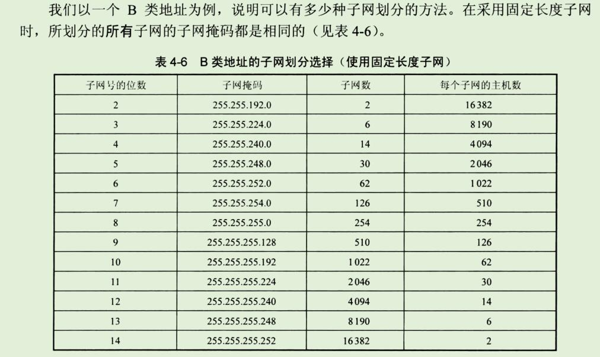
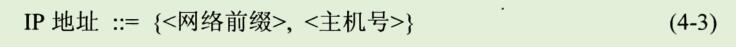
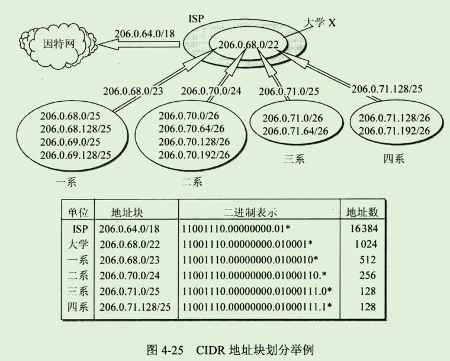
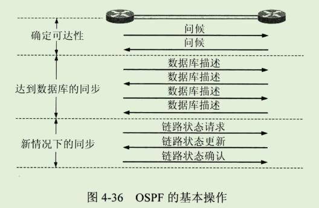
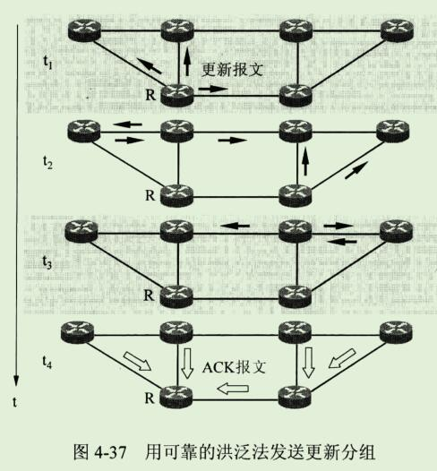
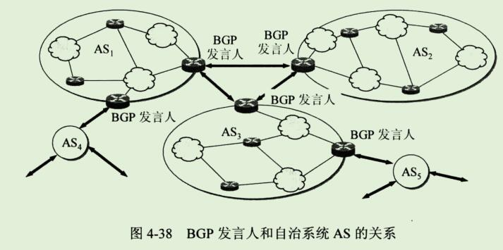
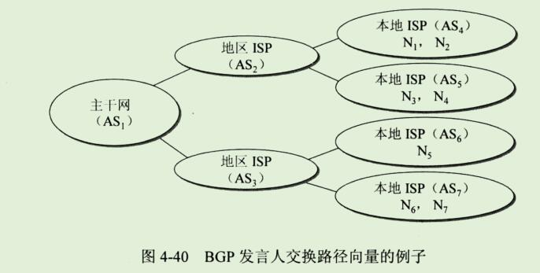
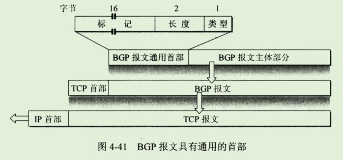
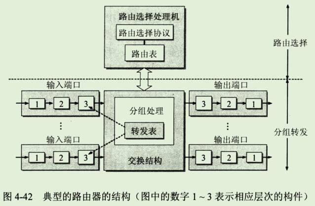

## 3、划分子网和构造超网

### 1、划分子网

#### 1、从两级IP地址到三级IP地址

```
在今天看来，在ARPANET 的早期，IP地址的设计确实不够合理。

第一，IP地址空间的利用率有时很低。

每一个A类地址网络可连接的主机数超过1000万台。
而每一个B类地址网络可连接的主机数也超过6万台。
然而有些网络对连接在网络上的计算机数目有限制，
根本达不到这样大的数值。
例如10BASE-T以太网规定其最大结点数只有1024个。
这样的以太网若使用一个B类地址就浪费6万多个IP地址，
地址空间利用率还不到2%，而其他单位的主机无法使用这些被浪费的地址。

有的单位申请到了一个B类地址网络，但所连接的主机数并不多，可是又不愿意申请一个足够使用的C类地址，理由是考虑到今后可能的发展.

IP地址的浪费，还会使IP地址空间的资源过早的被用完。
```

```
第二，给每一个物理网络分配一个网络号会使路由表变得太大因而时网络性能变坏。

每一个路由器都应当能够从路由表查出怎样到达网络的下一跳路由器。
因此，互联网中的网络数越多，路由器的路由表的项目数也就越多。

这样，即使我们拥有足够多的IP地址资源可以给每一个物理网络分配一个网络号，也会导致路由器中的路由表中的项目数过多。

这不仅增加了路由器的成本(需要更多的存储空间)，而且使查找路由时耗费更多的时间，同时也使路由器之间定期交换的路由信息急剧增加，因而使路由器和整个因特网的性能都下降了。
```

```
第三，两级IP地址不够灵活。

有些情况紧急，一个单位需要在新的地点马上开通一个新的网络。
但是在申请一个新的IP之前，新增加的网络是不可能连接到因特网上工作的。
我们希望有一种方法，使一个单位能随时灵活的增加本单位的网络，而不必事先到因特网管理机构去申请新的网络号。
原来的两级IP无法做到这一点。
```

```
为了解决上述问题，从1985年起在IP地址中又增加了一个"子网号字段"，使两级IP地址变成为三级IP地址，它能够较好的解决上述问题，并且使用起来也很灵活。
这种做法叫做 划分子网(subnetting)，或子网寻址 或 子网路由选择。

划分子网已成为因特网的正式标准协议。
```


划分子网的基本思路如下：

```
1、一个拥有许多物理网络的单位，可将所属的物理网络划分为若干个子网(subnet)。
划分子网纯属一个单位内部的事情。
本单位以外的网络看不见这个网络是由多少个子网组成，因为这个单位对外仍然表现为一个网络。
```

```
2、划分子网的方法是从网络的主机号借用若干位 作为子网号 subnet-id,当然主机号也就相应减少了同样的位数。

于是两级IP地址在本单位内部就变为三级IP地址：
网络号、子网号和主机号。
也可以用以下记法来表示：

```


```
3、凡是从其他网络发送给本单位某个主机的IP数据报，仍然是根据IP数据报的目的网络号找到连接在本单位网络上的路由器。
但此路由器在收到IP数据报后，再按目的网络号和子网号找到目的子网，把IP数据报交付目的主机。
```


```
总之，当没有划分子网时，IP地址是两级结构。
划分子网后IP地址就变成了三级结构。
划分子网只是把IP地址的主机号这部分进行再划分，而不改变IP地址原来的网络号。
```

#### 2、子网掩码

```
现在剩下的问题就是：
假定有一个数据报(其目的地址是145.12.3.10)已经到达了路由器R1。
那么这个路由器如何把它转发到子网145.13.3.0呢？
```

```
我们知道，从IP数据报的首部无法看出源主机或目的主机所连接的网络是否进行了子网的划分。

这是因为32位的IP地址本身以及数据报的首部都没有包含任何有关子网划分的信息。
因此必须另外想办法，这就是使用子网掩码(subnet mask)(见图4-20)。
```


```
图4-20(a)是IP地址为 145.13.3.10 的主机本来的两级IP地址结构。
图4-20(b)是这个两级IP地址的子网掩码。
图4-20(c)是同一地址的三级IP地址结构，也就是说，现在从原来16位的主机号中拿出8位作为子网号，而主机号由16位减少到8位。

请注意，现在子网号为3的网络的网络地址是145.13.3.0 (既不是原来两级IP地址的网络地址 145.13.0.0，也不是简单的子网号3)。
为了使路由器R1能够很方便的从数据报中的目的IP地址中提取出所要找的子网的网路地址，路由器R1就要使用三级IP地址的子网掩码。

图4-20(d)是三级IP地址的子网掩码，它也是32位，由一串1和跟随一串0组成。
子网掩码中的1对应于IP地址中原来二级地址中的16位网络号加上新增的8位子网号，而子网掩码中的0对应于现在的8位主机号。

虽然RFC文档中没有规定子网掩码中的一串1必须是连续的，但却极力推荐在子网掩码中选用连续的1，以免出现可能发生的差错。
```

```
图4-20(e)表示R1把三级IP地址的子网掩码和收到的数据报的目的IP地址145.13.3.10 逐位相"与"(AND)(计算机进行这种逻辑AND运算是很容易的)，
得出了所要找的子网的网络地址145.13.3.0。
```

```
使用子网掩码的好处就是:
不管网络有没有划分子网，只要把子网掩码和IP地址进行逐位的"与"运算(AND),就立即得出网络地址来。
这样在路由器处理到来的分组时就可采用同样的算法。
```

```
归纳一下上述的要点。
从网络145.13.0.0外面看，这就是一个普通的B类网络，其子网掩码为16个连1后面跟上16个连0。

但进入到这个网络后(即到了路由器R1)，就看到了还有许多网络(即划分了子网后的许多网络)，其网络地址是 145.13.x.0(这里的x可以表示为不同的数值)，而这些网络的子网掩码都是24个连1后面跟上8个连0。
总之，在这个B类网络的外面和里面，看到的网络是不一样的。
```

```
这里还要弄清一个问题，这就是：
在不划分子网时，既然没有子网，为什么还要使用子网掩码？
这就是为了更便于查找路由表。
现在因特网的标准规定：所有的网路都必须使用子网掩码，同时在路由器的路由表中也必须有子网掩码这一栏。

如果一个网络不划分子网，那么该网络的子网掩码就使用默认子网掩码。

默认子网掩码中的1的位置和IP地址汇总的网络号字段net-id正好相对应。
因此，若用默认子网掩码和某个不划分子网的IP地址逐位相"与"(AND),就应当能够得出该IP地址的网络地址来。
```

```
这样做可以不用查找该地址的类别位就能知道这是哪一类的IP地址。
显然，
A类地址的默认子网掩码是255.0.0.0，或0xFF000000；
B类地址的默认子网掩码是255.255.0.0，或0xFFFF0000；
C类地址的默认子网掩码是255.255.255.0，或0xFFFFFF00；
```

```
图4-21是这三类IP地址的网络地址和相应的默认子网掩码。
```


```
子网掩码是一个网络或一个子网的重要属性。
在RFC950成为因特网的正式标准后，路由器在和相邻路由器交换路由信息时，必须把自己所在网络(或子网)的子网掩码告诉相邻路由器。
在路由器的路由表中的每一个项目，除了要给出目的网络地址外，还必须同时给出该网络的子网掩码。
若一个路由器连接在两个子网上就拥有两个网络地址和两个子网掩码。
```



```
在表中4-6中，子网数是根据子网号subnet-id计算出来的。
若subnet-id有n位，则共有2^n种可能的排列。
除去全0和全1这两种情况，就得出表中的子网数。

表中"子网号的位数"中没有0,1,15,和16这四种情况，因为这没有意义。
0的话就是B类地址
1的话 只有0,1两位;又因为0就是B类地址,所以是有1有用;只有一个子网也没有意义。

15的话 主机号只有0,1 而全0和全1;代表的是本网络和所有主机;没有意义

16的话 就只有网络号 没有子网号了;
```

```
请读者注意，虽然根据已成为因特网标准协议的RFC950文档，子网号不能为全1或全0，但随着无分类域间路由选择CIDR的广泛使用，现在全1和全0的子网号也可以使用了，但一定要谨慎使用，要弄清你的路由器所用的路由选择软件是否支持全0或全1的子网号这种较新的用法。
```

```
我们可以看出，若使用较少位数的子网号，则每一个子网上可连接的主机数就较多。
凡是若使用较多位数的子网号，则子网的数目较多但每个子网上可连接的主机数就较少。

因此我们可根据具体情况(一共需要划分多少个子网，每个子网中最多有多少个主机)来选择合适的子网掩码。
```

```
通过简单的计算，读者不难得出这样的结论：划分子网增加了灵活性，但却减少了能够连接在网络上的主机总数。
例如，本来一个B类网络最多可连接65534台主机，但表4-6中任意一行的最后两项的乘积一定小于65534.

对A类和C类地址的子网划分也可得出类似的表格，读者可自行算出。
```

**例子**


```
例4-2 
	已知IP地址是141.14.72.24, 子网掩码是255.255.192.0。
	试求网络地址。
	
解
	与一下就可以了
```


```
下面进一步讨论使用了子网掩码以后应怎样查找路由器。
```


### 2、使用子网时分组的转发

```
在划分子网的情况下，分组转发的算法必须做相应的改动。

我们应当注意到，使用子网划分后，路由表必须包含以下三项内容：
目的网络地址、子网掩码和下一跳地址。
```

```
在划分子网的情况下，路由器转发分组的算法如下：

1、从收到的数据报的首部提取目的IP地址D。
2、先判断是否为直接交付。
	对路由器直接相连的网络逐个进行检查：用各网络的子网掩码和D逐位相"与"(AND操作)，看结果是否和相应的网络地址匹配。
	若匹配，则把分组进行直接交付(当然还需要把D转换成物理地址，把数据报封装成帧发送出去)，转发任务结束。
	否则就是间接交付，执行3。
	
3、若路由表中有目的地址为D的特定主机路由，则把数据报传送给路由表中所指明的下一跳路由器;
	否则，执行4。
	
4、对路由表中的每一行(目的网络地址，子网掩码，下一跳地址)，用其中的子网掩码和D逐位相"与"(AND操作)，其结果为N。
若N与该行的目的网络地址匹配，则把数据报传送给该行指明的下一跳路由器;
否则，执行5.

5、若路由表中有一个默认路由，则把数据报传送给路由表中所指明的默认路由器;否则执行6。

6、报告转发分组出错。
```


### 3、无分类编址 CIDR(构成超网)

#### 1、网络前缀

```
划分子网一定程度上缓解了因特网在发展中遇到的困难。
然后在1992年因特网仍然面临三个必须尽早解决的问题，这就是：
1、B类地址在1992年已分配了近一半，眼看很快就将全部分配完毕！

2、因特网主干网上的路由表中的项目急剧增长(从几千个增长到几万个)。

3、整个IPv4的地址空间最终将全部耗尽。在2011年2月3日，IANA宣布IPv4地址已经耗尽了。
```

```
当时预计前两个问题将在1994年变得非常严重。
因此IETF很快的就研究出采用  无分类编址 的方法来解决前两个问题。
IETF认为上面的第三个问题属于更加长远的问题，因此专门成立IPv6工作组负责研究解决新版本IP协议的问题。
```

```
其实早在1987年，RFC1009就指明了在一个划分子网的网络中可同时使用几个不同的子网掩码。
使用变长子网掩码VLSM(Variable Length Subnet Mask)可进一步提高IP地址资源的利用率。
在VLSM的基础上又进一步研究出无分类编址方法，它的正式名字是无分类遇见路由选择CIDR(Classless Inter-Domain Routing,CIDR的读音是 "sider")。

在1993年形成了 CIDR 的RFC文档：RFC1517~1519和RFC1520。
较新的CIDR文档是2006年发表的RFC4632，已把老的文档1519列为陈旧的。
```

```
CIDR最主要的特点有两个：
1、CIDR消除了传统的A类、B类和C类地址以及划分子网的概念，因而可以更加有效的分配IPv4的地址空间，并且可以在新的IPv6使用之前容许因特网的规模继续增长。

CIDR把32位的IP地址划分为两个部分。
前面的部分是"网络前缀"(network-prefix)(或简称为"前缀")，用来指明网络，后面的部分则用来指明主机。

因此CIDR(classless inter-domain routing)使IP地址从三级编址(使用子网掩码)又回到了两级编码，但这已是无分类的两级编址。
它的记法是：
```



```
CIDR 还使用"斜线记法"(slash notation),或称为CIDR记法，即在IP地址后面加上斜线"/"，然后写上网络前缀所占的位数。
```

```

2、CIDR把网络前缀都相同的连续IP地址组成一个"CIDR 地址块"。
我们只要知道CIDR地址块中的任何一个地址，就可以知道这个地址块的起始地址(即最小地址)和最大地址，以及地址块中的地址数。
```


```
当然，这两个主机号是全0和全1的地址一般并不使用。
通常只使用在这两个地址之间的地址。
不难看出，这个地址块共有2^12个地址。
我们可以用 地址块中的最小地址 和 网络前缀的位数 指明这个地址块。

例如，上面的地址块可记为 128.14.32.0/20。
不需要指出地址块的起始地址时，也可把这样的地址块简称为 "/20地址块"。
```

```
为了更方便的进行路由选择，CIDR使用32位的地址掩码(address mask)。
地址掩码由一串1和一串0组成，而1的个数就是网络前缀的长度。
虽然CIDR不使用子网了，但由于目前仍有一些网络还使用子网划分和子网掩码，因此CIDR使用的地址掩码也可继续称为子网掩码。

例如，/20地址块的地址掩码是：
11111111 11111111 11110000 00000000(20个连续的1)。

斜线记法中，斜线后面的数字就是地址掩码中1的个数。
```

```
请读者注意，"CIDR不使用子网"是指CIDR并没有在32位地址中指明若干位作为子网字段。
但分配到一个CIDR地址块的单位，仍然可以在本单位内根据需要划分出一些子网。
这些子网也都只有一个网络前缀和一个主机号字段，但子网的网络前缀比整个单位的网络前缀要长些。
例如，某单位分配到地址块/20，就可以再继续划分为8个子网(即需要从主机号中借用3位来划分子网)。
这时每一个子网的网络前缀就变成了23位(原来的20位加上从主机号借来的3位)，比该单位的网络前缀多了3位。
```

```
斜线记法还有一个好处就是它除了表示一个IP地址外，还提供了其他一些重要信息。
我们举例说明如下。
```


```
由于一个CIDR 地址块中有很多地址，所以在路由表中就利用CIDR地址块来查找目的网络。
这种地址的聚合常称为路由聚合(route aggregation), 它使得路由表中的一个项目可以表示原来传统分类地址的很多个(例如上千个)路由。
路由聚合也称为构成超网(supernetting)。

如果没有采用CIDR，则在1994和1995年，因特网的一个路由表就会超过7万个项目，而使用了CIDR后，在1996年一个路由表的项目才只有3万多个。
路由聚合有利于减少路由器之间的路由选择信息的交换，从而提高了整个因特网的性能。
```

```
CIDR记法有多种形式，例如，地址块10.0.0.0/10可简写为10/10,也就是把点分十进制中低位连续的0省略。
另一种简化表示方法是在网络前缀的后面加一个星号*，如：
00001010 00*

意思是：在星号*之前是网络前缀，而星号*表示IP地址中的主机号，可以是任意值。

前缀位数不是8的整数倍时，需要进行简单的计算才能得到一些地址信息。
```


```
从表4-7可看出，每一个CIDR地址块中的地址数一定是2的整数次幂。
除最后几行外，CIDR地址块都包含了多个C类地址(是一个C类地址的2^n倍，n是整数)，这就是"构成超网"这一名词的来源。
```

```
使用CIDR的一个好处就是可以更加有效的分配IPv4的地址空间，可根据客户的需要分配适当大小的CIDR地址块。
然而在分类地址的环境中，向一个组织分配IP地址，就只能以/8,/16或/24为单位来分配。这就很不灵活。
```




```
图4-25给出的是CIDR地址块分配的例子。
假定某ISP已拥有地址块 206.0.64.0/18(相当于有64个C类网络)。

现在某大学需要800个IP地址。
ISP可以给该大学分配一个地址块206.0.68.0/22，它包括1024(即2^10)个IP地址，相当于4个连续的C类/24地址块，占该ISP拥有的地址空间的1/16。

这个大学然后可自由地对本校的各系分配地址块，而各系还可再划分本系的地址块。
CIDR的地址块分配有时不易看清，这是因为网络前缀和主机号的界限不是恰好出现在整数字节处。
只要写出地址的二进制表示(从图中的地址块的二进制表示中可看出，实际上只需要将其中的一个关键字节转换为二进制的表示即可)，弄清网络前缀的位数，就不会把地址块的范围弄错。
```

```
从图4-25可以清楚的看出地址聚合的概念。
这个ISP共拥有64个C类网络。
如果不采用CIDR技术，则在该ISP的路由器交换路由信息的每一个路由器的路由表中，就需要有64个项目。
但采用地址聚合后，就只需用路由聚合后的一个项目206.0.64.0/18就能找到该ISP。

同理，这个大学共有4个系。
在ISP内的路由器的路由表中，也是需要使用206.0.68.0/22这一个项目。
```

```
从图4-25下面表格中的二进制地址可看出，把四个系的路由聚合为大学的一个路由(即构成超网)，是将网络前缀缩短。
网络前缀越短，其地址块所包含的地址数就越多。
而在三级结构的IP地址中，划分子网是使网络前缀变长。
```


#### 2、最长前缀匹配

```
在使用CIDR时，由于采用了网络前缀这种记法，IP地址由网络前缀和主机号这两个部分组成，因此在路由表中的项目也要有相应的改变。
这时，每个项目由"网络前缀"和"下一跳地址"组成。
但是在查找路由表时可能会得到不止一个匹配结果。
这样就带来一个问题：我们应当从这些匹配结果中选择哪一条路由呢?
```

```
正确的答案是：
应当从匹配结果中选择具有最长网络前缀的路由。
这叫做最长前缀匹配(longest-prefix matching),这是因为网络前缀越长，其地址块就越小，因而路由就越具体(more specific)。

最长前缀匹配又称为最长匹配或最佳匹配。
为了说明最长前缀匹配的概念，我们仍以前面的例子来讨论。
```

```
假定大学下属的四系希望ISP把转发给四系的数据报直接发到四系而不要经过大学的路由器，但又不愿意改变自己使用的IP地址块。

因此，在ISP的路由器的路由表中，至少要有以下两个项目，即206.68.0/22(大学)和206.0.71.128/25(四系)。

现在假定ISP收到一个 数据报，其目的IP地址为D=206.0.71.130。
把D分别和路由表中这两个项目的掩码逐位相"与"(AND操作)。
将所得的逐位AND操作的结果按顺序写在下面。
```


```
不难看出，现在同一个IP地址D可以在路由表中找到两个目的网络(大学和四系)和该地址相匹配。
根据最长前缀匹配的原理，应当选择后者，把收到的数据报转发到后一个目的网络(四系)，即选择两个匹配的地址中更具体的一个。
```


#### 3、使用二叉线索查找路由表

```
使用CIDR后，由于要寻找最长前缀匹配，使路由表的查找过程变得更加复杂了。
当路由表的项目数很大时，怎样设法减少路由表的查找时间就成为一个非常重要的问题。

例如，连接路由器的线路的速率为10Gb/s,而分组的平均长度为2000bit,那么路由器就应当平均每秒钟能够处理500万个分组(常记为5Mpps)。
或者说，路由器处理一个分组的平均时间只有200ns(1ns=10^-9秒)。
因此，查找每一个路由所需的时间应当是非常短的。
可见在路由表中必须使用很好的数据结构和使用先进的快速查找算法，这一直是人们积极研究的热门课题。
```

```
对无分类编址的路由表的最简单的查找算法就是对所有可能的前缀进行循环查找。
例如，给定一个目的地址D。
对每一个可能的网络前缀M，路由器从D中提取前M个位成一个网络前缀，然后查找路由表中的网络前缀。
所找到的最长匹配就对应于要查找的路由。

这种最简单的算法的明显缺点就是查找的次数太多。
最坏的情况是路由表中没有这个路由。
在这种情况下，算法仍要进行32次(具有32位的网络前缀是一个特定主机路由)。
就是要找到一个传统的B类地址(即/16)，也要查找16次。
对于经常使用的默认路由，这种算法都要经历31次不必要的查找。

int netAddr = 255.0.0.0;
int subnetMask = 0; 
for(int i = 32; i>=0; i++) {
	if(i > 0) {
		subnetMask &= (1<<(i-1));
	}
	int networkPrefix = netAddr & subnetMask;
	map.get(networkPrefix);
}
```


```
为了进行更加有效的查找，通常是把无分类编址的路由表存放在一种层次的数据结构中，然后自上而下的按层次进行查找。
这里最常用的就是 二叉线索(binary trie)，它是一种特殊结构的树。

IP地址中从左到右的比特值决定了从根节点逐层向下层延伸的路径，而二叉线索中的各个路径就代表路由表中存放的各个地址。
```


```
图4-26用一个例子来说明二叉线索的结构。
图中给出了5个IP地址。
为了简化二叉线索的结构，可以先找出对应于每一个IP地址的唯一前缀(unique prefix)。

所谓唯一前缀来构造二叉线索。
在进行查找时，只要能够和唯一前缀相匹配就行了。
```

```
从二叉线索的根节点自顶向下的深度最多有32层，每一层对应于IP地址中的一位。
一个IP地址存入二叉线索的规则很简单。
先检查IP地址左边的第一位，如为0，则第一层的节点就在根节点的左下方;
如为1，则在右下方。
然后再检查地址的第二位，构造出第二层的节点。
以此类推，直到唯一前缀的最后一位。

由于唯一前缀一般都小于32位，因此用唯一前缀构造的二叉线索的深度往往不到32层。

图中较粗的折线就是前缀0101在这个二叉线索中的路径。

二叉线索中的小圆圈是中间节点，而在路径终点的小方框是叶节点(也叫做外部节点)。
每个叶节点代表一个唯一前缀。
节点之间的连线旁边的数字表示这条边在唯一前缀中对应的比特是0或1。
```

```
假定有一个IP地址是 10011011 0111010 00000000 00000000，需要查找该地址是否在此二叉线索中。
我们从最左边查起。
很容易发现，查到第三个字符(即前缀10后面的0)时，在二叉线索中就找不到匹配的，说明这个地址不在这个二叉线索中。
```

```
以上只是给出了二叉线索这种数据结构的用法，并没有说明"与唯一前缀匹配"和"与网络前缀匹配"的关系。
一个唯一前缀匹配 != 网络前缀;
比如上图的4-26的第一个ip网络前缀
唯一前缀只有4个 0100
网络前缀有7个  01000110 00000000 00000000 00000000
找到了唯一前缀并不等于找到了网络前缀;

显然，要将二叉线索用于路由表中，还必须使二叉线索中的每一个叶节点包含所对应的网络前缀和子网掩码。
当搜索到一个叶节点时，就必须将寻找匹配的目的地址和该叶节点的子网掩码进行逐位"与"运算，看结果是否与对应的网络前缀相匹配。
若匹配，就按下一跳的接口转发该分组。否则，就丢弃该分组。
```

```
总之，二叉线索只是提供了一种可以快速在路由表中找到匹配的叶节点的机制。
但这是否和网络前缀匹配，还要和子网掩码进行一次逻辑与的运算。
```

```
为了提高二叉线索的查找速度，广泛使用了各种压缩技术。
例如，在图4-26中的最后两个地址，其最前面的4位都是1011。
因此，只要一个地址的前4位是1011，就可以跳过前面4位(即压缩了4个层次)而直接从第5位开始比较。
这样就可以减少查找的时间。
当然，制作经过压缩的二叉线索需要更多的计算，但由于每一次查找路由表时都可以提高查找速度，因此这样做还是值得的。
```


## 4、网际控制报文协议ICMP

```
为了更有效的转发IP数据报和提高交付成功的机会，在网际层使用了网际控制报文协议ICMP(Internet Control Message Protocol)。
ICMP允许主机或路由器报告差错情况和提供有关异常情况的报告。
ICMP是因特网的标准协议。

但ICMP不是高层协议(看起来好像是高层协议，因为ICMP报文时装在IP数据报中的，作为其中的数据部分)，而是IP层的协议。
ICMP报文作为IP层数据报的数据，加上数据报的首部，组成IP数据报发送出去。
ICMP报文格式如图4-27所示。
```


### 1、ICMP报文的种类

```
ICMP报文的种类有两种，即ICMP差错报告报文和ICMP询问报文。
```

```
ICMP(Internet Control Message Protocol)报文的前4个字节是统一的格式，共有三个字段：即类型、代码、检验和。
接着的4个字节的内容与ICMP的类型有关。
最后面的是数据字段，其长度取决于ICMP的类型。

表4-8给出了几种常用的ICMP报文类型。
```


| ICMP报文种类 | 类型的值 | ICMP报文                    |
| ------------ | -------- | --------------------------- |
| 差错报告报文 | 3        | 终点不可达                  |
|              | 4        | 源点抑制(Source quench)     |
|              | 11       | 时间超过                    |
|              | 12       | 参数问题                    |
|              | 5        | 改变路由(Redirect)          |
| 询问报文     | 8或0     | 回送(Echo)请求或回答        |
|              | 13或14   | 时间戳(Timestamp)请求或回答 |

```
现在已不再使用的ICMP报文有"信息请求与回答报文"、"地址掩码请求与回答报文"和"路由器请求与通告报文"，这些报文就没有出现在表4-8中。
```

```
ICMP报文的代码字段是为了进一步区分某种类型中的几种不同的情况。

检验和字段用来检验整个ICMP报文。
我们应当还记得，IP数据报首部的检验和并不检验IP数据报的内容，因此不能保证经过传输的ICMP报文不产生差错。
```

**ICMP差错报告报文共有五种，即：**

```
1、终点不可达 
	当路由器或主机不能交付数据报时就向源点发送终点不可达报文。

2、源点抑制
	当路由器或主机由于拥塞而丢弃数据报时，就向源点发送源点抑制报文，使源点知道应当把数据报的发送速率放慢。
	
3、时间超过
	当路由器收到生存时间为零的数据报时，除丢弃该数据报外，还要向源点发送时间超过报文。
	
4、参数问题
	当路由器或目的主机收到的数据报的首部中有的字段的值不正确时，就丢弃该数据报，并向源点发送参数问题报文。
	
5、改变路由(重定向)
	路由器把改变路由报文发送给主机，让主机知道下次应将数据报发送给另外的路由器(可通过更好的路由)。
```

```
下面对改变路由报文进行简短的解释。
我们知道，在因特网的主机中也要有一个路由表。
当主机要发送数据报时，首先是查找主机自己的路由表，看应当从哪一个接口把数据报发送出去。
在因特网中主机的数量远大于路由器的数量，出于效率的考虑，这些主机不和连接在网络上的路由器定期交换路由信息。
在主机刚开始工作时，一般都在路由表中设置一个默认路由器的IP地址。
不管数据报要发送到哪个目的地址，都一律先将数据报传送给网络上的这个默认路由器，而这个默认路由器知道到每一个目的网络的最佳路由(通过和其他路由器交换路由信息)。

如果默认路由器发现主机 发往某个目的网络的最佳路由不应该经过默认路由器而是应当经过网络上的另一个路由器R时，就用改变路由报文把这情况告诉主机。
于是，该主机就在其路由表中增加一个项目：到某某目的地址应经过路由器R(而不是默认路由器)。
```


```
所有的 ICMP 差错报告报文中的数据字段都具有同样的格式(图4-28)。
把收到的需要进行差错报考的IP数据报的首部和数据字段的前8个字节提取出来，作为ICMP报文的数据字段。

再加上相应的ICMP(internet Control Message Protocol)差错报文的前8个字节，就构成了ICMP差错报文。

提取收到的数据报的数据字段的前8个字节是为了得到运输层的端口号(对于TCP和UDP)以及运输层报文的发送序号(对于TCP)。

这些信息对源点通知高层协议是有用的。
整个ICMP报文作为IP数据报字段发送给源点。
```

```
下面是不应发送ICMP差错报告报文的几种情况：
	1、对ICMP差错报告报文不再发送ICMP差错报文。
	2、对第一个分片的数据报片的所有后续数据报片都不发送ICMP差错报告报文。
	3、对具有多播地址的数据报都不发送ICMP差错报告报文。
	4、对具有特殊地址(如127.0.0.0或0.0.0.0)的数据报不发送ICMP差错报告报文。
```

```
常用的ICMP询问报文有两种，即：
1、回送请求和回答
	ICMP 回送请求报文是由主机或路由器向一个特定的目的主机发出的询问。
	收到此报文的主机必须给源主机或路由器发送ICMP回送回答报文。
	这种询问用来测试目的站是否可达以及了解其有关状态。
	
	
2、时间戳请求和回答
	ICMP时间戳请求报文时请某个主机或路由器回答当前的日期和时间。
	在ICMP时间戳回答报文中有一个32位的字段，其中写入的整数代表从1900年1月1日起到当前时刻一共有多少秒。
	时间戳请求与回答可用来进行时钟同步和测量时间。
```


### 2、ICMP的应用举例

**PING**

```
ICMP的一个重要应用就是分组探测 PING(Packet InterNet Groper),用来测试两个主机之间的连通性。
PING使用了ICMP回送请求与回答报文。
PING是应用层直接使用网络层ICMP的一个例子。
它没有通过运输层的TCP或UDP。
```

```
Windows 操作系统的用户可在接入因特网后转入MS DOS(就是cmd)。

看见屏幕上的提示符后，就键入 ping hostname, 按回车键就可看到结果。
```


```
图4-29给出了从南京的一台PC到新浪网的邮件服务器 mail.sina.com.cn 的连通性的测试结果。
PC一连发出四个ICMP回送请求报文。
如果邮件服务器 mail...... 正常工作而且响应这个ICMP回送请求报文(有的主机为了防止恶意攻击就不理睬外界发送过来的这种报文)。

那么它就发回ICMP回送回答报文。
由于往返的ICMP报文上都有时间戳，因此很容易得出往返时间。

最后显示出的结果：发送到哪个机器(IP地址)，发送的、收到的和丢失的分组数(但不给出分组丢失的原因)。往返时间的最小值、最大值和平均值。
从得到的结果可以看出，第三个测试分组丢失了。
```


**Traceroute**

```
另一个非常有用的应用是 tracetoute(这是UNIX操作系统中名字)，它用来跟踪一个分组从源点到终点的路径。
在Windows 操作系统中这个命令是 tracert。
下面简单介绍这个程序的工作原理。
```

```
Traceroute 从源主机向目的主机发送一连串的IP数据报，数据报中封装的是无法交付的UDP用户数据报。(比如使用非法端口号)

第一个数据报P1的生存时间TTL设置为1。
当P1到达路径上的第一个路由器R1时，路由器R1先收下它，接着把TTL的值减1。
由于TTL等于零了，R1就把P1丢弃了，并向源主机发送一个ICMP时间超过差错报告报文。

源主机急着发送第二个数据P2，并把TTL设置为2.
P2先到达路由器R1,R1收下后把TTL减1再转发给路由器R2。
R2收到P2时TTL为1，但减1后TTL变为零了。
R2就丢弃P2,并向源主机发送一个ICMP时间超过差错报告报文。
这样一直继续下去。
当最后一个数据报刚刚到达目的主机时，数据报的TTL是1。

主机不转发数据报，也不把TTL值减1。
但因IP数据报中封装的是无法交付的运输层的UDP用户数据报，因此目的主机要向源主机发送ICMP终点不可达差错报告报文。
```

```
这样，源主机达到了自己的目的，因此这些路由器和最后目的主机发来的ICMP报文正好给出了源主机想知道的路由信息 -- 到达目的主机所经过的路由器的IP地址，以及到达其中的每一个路由器的往返时间。
```


```
我们还应注意到，从原则上讲，IP数据报经过的路由器越多，所花费的时间也会越多。
但从4-30可看出，有正好相反。

这是因为因特网的拥塞程度随时都在变化，也很难预料到。
因此，完全有这样的可能：经过更多的路由器反而花费更少的时间。
```


## 5、因特网的路由选择协议

本节将讨论几种常用的路由选择协议，也就是讨论路由表中的路由是怎样得出的。

### 1、有关路由选择协议的几个基本概念

#### 1、理想的路由算法

```
路由选择协议的核心就是路由算法，即需要何种算法来获得路由表中的各项目。
一个理想的路由算法应具有如下的一些特点：

1、算法必须是正确的和完整的。
	这里，“正确”的含义是：沿着各路由表所指引的路由，分组一定能够最终到达目的网络和目的主机。
	
2、算法在计算上应简单。
	路由选择的计算不应使网络通信量增加太多的额外开销。
	
3、算法应能适应通信量和网络拓扑的变化，这就是说，要有自适应性。
	当网络中的通信量发生变化时，算法能自适应的改变路由以均衡各链路的负载。
	当某个或某些节点、链路发生故障不能工作，或者修理好了再投入运行时，算法也能及时改变路由。有时称这种自适应性为"稳健性(robustness)"。
	
4、算法应具有稳定性。
	在网络通信量和网络拓扑相对稳定的情况下，路由算法应收敛于一个可以接受的解，而不应使得出的路由不停得变化。
	
5、算法应是公平的。
	路由选择算法应对所有用户(除对少数优先级高的用户)都是平等的。
	例如，若仅仅使某一对用户的端到端时延为最小，但却不考虑其他的广大用户，这就明显的不符合公平性的要求。

6、算法应是最佳的
	路由选择算法应当能够找到最好的路由，使得分组平均时延最小而网络的吞吐量最大。
	虽然我们希望得到"最佳"的算法，但这并不总是最重要的。
	对于某些网络，网络的可靠性有时要比 最小的分组平均时延或最大吞吐量更加重要。
	因此，所谓"最佳"只能是相对于某一种特定要求下得出的较为合理的选择而已。
```

```
实际上一个路由选择算法，应尽可能接近于理想的算法。
在不同的应用条件下，对以上提出的六个方面也可能有不同的侧重。

应当指出，路由选择是个非常复杂的问题，因为它是网络中的所有结点共同协调工作的结果。
其次， 路由选择的环境往往是不断变化的，而这种变化有时无法事先知道，例如，网络中除了某些故障。
此外，当网络发生拥塞时，就特别需要有能缓解这种拥塞的路由选择策略，但恰好在这种条件下，很难从网络的各节点获得所需的路由选择信息。
```


#### 2、分层次的路由选择协议

```
因特网采用的路由选择协议主要是自适应的(即动态的)、分布式路由选择协议。
由于以下两个原因，因特网采用分层次的路由选择协议：

1、因特网的规模非常大。
	如果让所有的路由器知道所有的网络应怎样到达，则这种路由表将非常大，处理起来也太花时间。
	而所有这些路由器之间交换路由信息所需的带宽就会使因特网的通信链路饱和。
	
2、许多单位不愿意外界了解自己单位网络的布局细节和本部门所采用的路由选择协议(这属于本部门内部的事情)，但同时还希望连接到因特网上。


为此，因特网将整个互联网划分为许多较小的自治系统(autonomous system), 一般都记为AS。
RFC 4271 对自制系统AS有下面这样的描述：
---自治系统AS的经典定义是在单一的技术管理下的一组路由器，

而这些路由器使用一种AS内部的路由选择协议和共同的度量，以确定分组在该AS内的路由;
同时还使用一种AS之间的路由选择协议，用以确定分组在AS之间的路由。

自从有了这个经典定义后，使用多种内部路由选择协议和多种度量的AS也是很常见的。

因此，现在对自治系统AS的定义是强调下面的事实：尽管一个AS使用了多种内
部路由选择协议和度量，但重要的是一个AS对其他AS表现出的是一个单一的一致的路由选择策略。
```

```
在目前的因特网中，一个大的ISP就是一个自治系统。
这样，因特网就把路由选择协议划分为两大类，即：

1、内部网关协议IGP(Interior Gateway Protocol) 
	即在一个自治系统内部使用的路由选择协议，而这与在互联网中的其他自治系统选用什么路由选择协议无关。
	目前这类路由选择协议用的最多的是，如RIP何OSPF协议。

2、外部网关协议EGP(External Gateway Protocol)
	若源主机和目的主机处在不同的自制系统中(这两个自治系统可能使用不同的内部网关协议)，当数据报传到一个自治系统的边界时，就需要使用一种协议将路由选择信息传递到另一个自制系统中。
	这样的协议就是外部网关协议 EGP。
	目前使用最多的外部网关协议是BGP的版本4(BGP-4)。
```

```
自治系统之间的路由选择也叫做域间路由选择(interdomain routing)，

而在自治系统内部的路由选择叫做域内路由选择(intradomain routing)。
```


```
图4-31是两个自治系统互联在一起的示意图。
每个自治系统自己决定在本自治系统内部运行哪一个内部路由选择协议(例如，可以是RIP，也可以是OSPF)。
但每个自治系统都要有一个或多个路由器除运行本系统的内部路由选择协议之外，还要运行自治系统间的路由选择协议(BGP-4)。
```

```
这里我们要指出两点：

1、因特网的早期RFC文档中未使用"路由器"而是使用"网关"这一名词。
但是在新的RFC文档中又使用了"路由器"这一名词，因此有的书把IGP和EGP分别改为 IRP(内部路由器协议)和ERP(外部路由器协议)。
为了方便读者查阅RFC文档，本书仍使用RFC原先使用的名字。IGP(interior Gateway Protocol) 和 EGP(external Gateway protocol)。


2、RFC采用的名词IGP和 EGP 是协议类别的名称。
但RFC在使用名词EGP时出现了一点混乱，因为最早的一个外部网关协议的协议名字正好也是EGP。
后来RFC提出的EGP有不少缺点，就这几了一种更好的外部网关协议，叫做边界网关协议BGP(Border Gateway Protocol),用来取代旧的RFC827外部网关协议EGP。
实际上，旧协议EGP和新协议BGP都属于外部网关协议 EGP 这一类别。
因此在遇到名词 EGP时，应弄清它是指旧协议EGP(即RFC827)还是指外部网关协议EGP这个类别。

总之，使用分层次的路由选择方法，可将因特网的路由选择协议划分为：
内部网关协议IGP：具体的协议有多种，如RIP何OSPF等。
外部网关协议EGP：目前使用的协议就是BGP。


对于比较大的自治系统，还可将所有的网络再进行一次划分。
例如，可以构筑一个链路速率较高的主干网和许多速率较低的区域网。
每个区域通过路由器连接到主干网。
在一个区域内找不到目的站时，就通过路由器经过主干网到达另一个区域网，或者通过外部路由器到别的自治系统中去查找。
下面对这两类协议分别进行介绍。
```


### 2、内部网关协议RIP

#### 1、工作原理

```
RIP(Routing Information Protocol)是内部网关协议 IGP 中最先得到广泛使用的协议，它的中文名称很少使用，叫做路由信息协议。

RIP是一种分布式的基于距离向量的路由选择协议，是因特网的标准协议，其最大优点就是简单。
```

```
RIP协议要求网络中的每一个路由器都要维护从它自己到其他每一个目的网络的距离记录(因此，这是一组距离，即"距离向量")。
RIP协议将 "距离"定义如下：

从一路由器到直接连接的网络的距离定义为1。
从以路由器到非直接连接的网络的距离定义为所经过的路由器数加1。
"加1"是因为到达目的网络后就进行直接交付，而到直接连接的网络的距离已经定义为1。
```

```
RIP协议的"距离"也称为"跳数"(hop count)，因为每经过一个路由器，跳数就加1。
RIP认为好的路由就是它通过的路由器的数目少，即"距离短"。
RIP允许一条路径最多只能包含15个路由器。
因此"距离"等于16时即相当于不可达。
可见RIP只适用与小型互联网。
```


```
RIP不能在两个网络之间同时使用多条路由。
RIP选择一条具有最少路由器的路由(即最短路由)，哪怕还存在另一条高速(低时延)但路由器较多的路由。
```

```
本节讨论的RIP协议和下一节要讨论的OSPF协议，都是分布式路由选择协议。
它们的共同特点就是每一个路由器都要不断的和其他一些路由器交换路由信息。

我们一定要弄清以下三个要点，即和
哪些路由交换信息？
交换什么信息？
在什么时候交换信息？
```

```
RIP协议的特点是：
1、仅和相邻路由器交换信息。
	如果两个路由器之间的通信不需要经过另一个路由器，那么这两个路由器就是相邻的。RIP协议规定，不相邻的路由器不交换信息。
	
2、路由器交换的信息是 当前本路由器所知道的全部信息，即自己的路由表。
也就是说，交换的信息是："我到本自治系统中所有网络的(最短)距离"，以及到每个网络应经过的下一跳路由器"。

3、按固定的时间间隔交换路由信息，例如，每隔30秒。
然后路由器根据收到的路由信息更新路由表。
当网络拓扑发生变化时，路由器也及时向相邻路由器通告拓扑变化后的路由信息。(这个触发更新不太懂)
```

```
这里要强调一点：路由器在刚刚开始工作时，只知道到直接连接的网络的距离(此距离定义为1)。

接着，每一个路由器也只和数目非常有限的相邻路由器交换并更新路由信息。
但经过若干次的更新后，所有的路由器最终都会知道到达自治系统中任何一个网络的最短距离和下一跳路由器的地址。

看起来RIP协议有些奇怪，因为"我的路由表中的信息要依赖于你的，而你的信息又依赖于我的"。
然而事实证明，在一般情况下，RIP协议可以收敛(convergence),并且过程也较快。

"收敛"就是在自治系统中所有的结点都得到正确的路由选择信息的过程。
```

```
路由表中最主要的信息就是：到某个网络的距离(即最短距离)，以及应经过的下一跳地址。
路由表更新的原则是找出到每个目的网络的最短距离。
这种更新算法又称为距离向量算法。
下面就是RIP协议使用的距离向量算法。
```

#### 2、距离向量算法

```
对每一个相邻路由器发送过来的RIP报文，进行以下步骤：

1、对地址为X的相邻路由器发来的RIP报文，先修改此报文中的所有项目：
	把"下一跳"字段中的地址都改为X,并把所有的"距离"字段的值加1(见后面的解释1)。
	每个项目都有三个关键数据，即：到目的网络N，距离是d，下一跳路由器是X。
	
2、对修改后的RIP报文中的每一个项目，进行以下步骤：
若原来的路由表中没有目的网络N，则把该项目添加到路由表中(见解释2)。
	否则(即在路由表中有目的网络N，这时就再查看下一跳路由器地址)
若下一跳路由器地址是X，则把收到的项目替换原路由表中的项目(见解释3)。
	否则(即这个项目是，到目的网络N，但下一跳路由器不是X)，
若收到的项目中的距离d小于路由表中的距离，则进行更新(见解释4)，
否则什么也不做(见解释5)。

3、若三分钟还没有收到相邻路由器的更新路由表，则把此相邻路由器标记为不可达的路由器，即把距离置为16(距离为16表示不可达)。

4、返回

上面给出的距离向量算法的基础就是 Bellman-Ford算法(或 Ford-Fulkerson算法)。
这种算法的要点是这样的：
设X是结点A到B的最短路径上的一个结点。
若把路径A->B拆成两段路由 A->X 和 X->B,
则每一段路径 A->X 和 X->B 也都分别是节点A到X和节点x到B的最短路径。
```

```
下面是对上述距离向量算法的五点解释。

解释1：这样做事为了便于进行本路由表的更新。
假设从位于地址X的相邻路由器发来的RIP报文的某一个项目是 "Net2,3,Y",
意思是"我经过路由器Y到网络Net2的距离是3"，那么本路由器就可推断出："我经过X到网络Net2的距离应为3+1=4"。
于是，本路由器就把收到的RIP报文的这一个项目修改为 "Net2,4,X",作为下一步和路由表中原有项目进行比较时使用(只有比较后才能知道是否需要更新)。
读者可注意到，收到的项目中的Y对本路由器是没有用的，因为Y不是本路由器的下一跳路由器地址。

解释2：表明这是新的目的网络，应当加入路由表中。

解释3:为什么要替换呢？因为这是最新的消息，要以最新的消息为准。
到目的网络的距离有可能增大或减小，但也可能没有改变。
--因为你目的网络和下一跳网络都是一样的只有距离不一样,当然要以最新的为准。

解释4：目的网络一样，下一跳的网络不一样，就取跳数最少的作为新的路由表项。

解释5：如果距离变大了，当然不更新了。
```


```
RIP协议让一个自治系统中的所有路由器都和自己相邻路由器定期交换路由信息，并不断更新其路由表，使得每一个路由器到每一个目的网络的路由都是最短的(即跳数最少)。
这里还应注意：虽然所有的路由器最终都拥有了整个自治系统的全局路由信息，但由于每一个路由器的位置不同，它们的路由表当然也应当是不同的。
```


#### 3、RIP协议的报文格式

```
现在较新的RIP版本是1998年11月公布的RIP2，新版本协议本身并无多大变化，但性能上有些改进。
RIP2可以支持变长子网掩码和无分类域间路由选择CIDR。
此外，RIP2还提供简单的鉴别过程支持多播。
```


```
图4-32是RIP2的报文格式，它和RIP1的首部相同，但后面的路由部分不一样。
从图4-32还可看出，RIP协议使用运输层的用户数据报UDP进行传送(使用UDP端口 520)。
```

```
RIP报文由首部和路由部分组成。
RIP的首部占4个字节，其中的命令字段指出报文的意义。
例如，1表示请求路由信息，
2表示对请求路由信息的响应或未被请求而发出的路由更新报文。
首部后面的"必为0"是为了4字节字的对齐。
```

```
ROP2报文中的路由部分由若干个路由信息组成。
每个路由信息需要用20个字节。
地址族标识符(又称为地址类别)字段用来标志所使用的地址协议。
如采用IP地址就令整个字段的值为2(原来RIP也可用于其他非TCP/IP协议的情况)。
路由标记填入自治系统号ASN(Autonomous System Number),这是考虑使RIP有可能收到本自治系统以外的路由选择信息。

再后面指出某个网络地址、该网络的子网掩码、下一跳路由地址以及到此网络的距离。
一个RIP报文最多可包括25个路由，因而RIP报文的最大长度是 4+20*25 = 504 字节。
如超过，必须再用一个RIP报文来传送。
```

```
RIP2还具有简单的鉴别功能。
若使用鉴别功能，则将原来写入第一个路由信息(20字节)的位置用作鉴别。
这时应当将地址族标识符置为全1(即0xFFFF),而路由标记写入鉴别类型，剩下的16字节为鉴别数据。
在鉴别数据之后才写入路由信息，但这时最多只能再放入24个路由信息。
```


```
RIP存在的一个问题是当网络出现故障时，要经过比较长的时间才能将此信息传送到所有的路由器。
我们可以用图4-33的简单例子来说明。
设三个网络通过两个路由器互连起来，并且都已经建立各自的路由表。
图中路由器交换的信息只给出了我们感兴趣的一行内容。
路由器R1中的"1,1,直接"表示"到网1的距离是1，直接交付"。
路由器R2中的"1,2,R1"。
```

```
现在假定路由器R1到网1的链路出了故障，R1无法到达网1。
于是路由器R1把到网1的距离改为16(表示网1不可达)，因而在R1的路由表中的相应项目变为"1,16,直接"。
但是，很可能要经过30秒后R1才把更新信息发送给R2。
然后R2可能已经先把自己的路由表发送给了R1,其中"1,2,R1"这一项。
```

```
R1收到R2的更新报文后，误认为可经过R1到达网1，于是把收到的路由信息"1,2,R1"修改为："1,3,R2"，表明"我到网1的距离是3，下一跳经过R2"，并把更新后的信息发送给R2。

同理，R2接着又更新自己的路由表为"1,4,R1",以为"我到网1距离是4，下一跳经过R1"。

这样的更新一直继续下去，知道R1和R2到网1的距离都增大到16时，R1和R2才知道原来网1是不可达的。RIP协议的这一特点叫做：好消息传播的快，而坏消息转播的慢。

网络出故障的传播时间往往需要较长的时间(例如数分钟)。
这是RIP的一个主要缺点。
```

```
但如果一个路由器发现了更短的路由，那么这种更新信息就传播的很快。

为了使坏消息传播的更快些，可以采取多种措施。
例如，让路由器记录收到某特定路由信息的接口，而不让同一路由信息再通过此接口向反方向传送。
```

```
总之，RIP协议最大的优点就是实现简单，开销较小。
但RIP协议的缺点也较多。
首先，RIP限制了网络的规模，它能使用的最大距离为15(16表示不可达)。
其次，路由器之间交换的路由信息是路由器中的完整路由表，因而随着网络规模的扩大，开销也就增加。
最后，"坏消息传播得慢"，使更新过程的收敛时间过长。
因此，对于规模较大的网络就应当使用下一节所述的 OSPF 协议。

然而目前在规模较小的网络中，使用RIP协议的仍占多数。
```


### 3、内部网关协议OSPF

#### 1、OSPF协议的基本特点

```
这个协议的名字是开放最短路径优先OSPF(Open Shortest Path First)。

它是克服RIP的缺点在1989年开发出来的。
OSPF的原理很简单，但实现起来却较复杂。
"开放"表明OSPF协议不是受某一家厂商控制的，而是公开发表的。
"最短路径优先"是因为使用了 Dijkstra 提出的最短路径算法 SPF。
```

```
请注意：OSPF只是一个协议的名字，它并不表示其他的路由选择协议不是"最短路径优先"。
事实上，所有的在自治系统内部使用的路由选择协议(包括RIP协议)都是要寻找一条最短的路径。

RIP是一种分布式的基于距离向量的路由选择协议。

OSPF 最主要的特征就是使用分布式的链路状态协议(link state protocol),而不是像RIP那样的距离向量协议。
和RIP协议相比，OSPF的三个要点和RIP的都不一样：
像谁发送消息
发送什么消息
什么时候发送消息

1、向本自治系统中所有路由器发送信息。这里使用的方法是洪泛法(flooding),这就是路由器通过所有输出端口向相邻的路由器发送信息。
而每一个相邻路由器又再将此信息发往其所有的相邻路由器(但不再发送给刚刚发来信息的那个路由器)。
这样，最终整个区域中所有的路由器都得到了这个信息的一个副本。
更具体的做法后面还要讨论。
我们应注意，RIP协议是仅仅向自己相邻的几个路由器发送信息。

2、发送的信息就是与本路由器相邻的所有路由器的链路状态，但这只是路由器所知道的部分信息。
所谓"链路状态"就是说明本路由器都和哪些路由器相邻，以及该链路的"度量"(metric)。
OSPF将这个"度量"用来表示费用、距离、时延、带宽，等等。
这些都由网络管理人员来决定，因此较为灵活。
有时为了方便就称这个度量为"代价"。
我们应注意，对于RIP协议，发送的信息是："到所有网络的距离和下一跳路由器"。

3、只有当链路状态发生变化时，路由器才向所有路由器用洪泛法发送此信息。
而不像RIP那样，不管网络拓扑有无发生变化，路由器之间都要定期交换路由表的信息。
```

```
从上述的三个方面可以看出，OSPF和RIP的工作原理相差较大。
由于各路由器之间频繁地交换链路状态信息，因此所有的路由器最终都能建立一个链路状态数据库(link-state database),这个数据库实际上就是全网的拓扑结构图。
这个拓扑结构图在全网范围内是一致的(这称为链路状态数据库的同步)。
因此，每一个路由器都知道全网共有多少个路由器，以及哪些路由器是相连的，其代价是多少，等等。

每一个路由器使用链路状态数据库中的数据，构造出自己的路由表(例如，使用Dijkstra的最短路由算法)。
我们注意到，RIP协议的每一个路由器虽然知道到所有的网络的距离以及下一跳路由器，但却不知道全网的拓扑结构(只有到了下一跳路由器，才能知道再下一跳应当怎样走)。
```

```
OSPF 的链路状态数据库能较快的进行更新，使各个路由器能及时更新其路由表。
OSPF的更新过程收敛的块是其重要优点。
```

```
为了使 OSPF 能够用于规模很大的网络，OSPF将一个自治系统再划分为若干个更小的范围，叫做区域(area)。
图4-34就表示一个自治系统划分为四个区域。
每一个区域都要一个32位的区域标识符(用点分十进制)。
当然，一个区域也不能太大，在一个区域内的路由器最后不超过200个。
```


```
划分区域的好处就是把利用洪泛法交换链路状态信息的范围局限于每一个区域而不是整个的自治系统，这就减少了整个网络上的通信量。

在一个区域内部的路由器只知道本区域的完整网络拓扑，而不知道其他区域的网络拓扑的情况。
为了使每一个区域能够和本区域以外的区域进行通信，OSPF使用层次结构的区域划分。
在上层的区域叫做主干区域(backbone area)。
主干区域的标识符规定为 0.0.0.0。
主干区域的作用是用来连通其他在下层的区域。

从其他区域来的信息都由区域边界路由器(area border router)进行概括。

在图4-34中，路由器R3,R4和R7都是区域边界路由器，而显然，每一个区域至少应当由一个区域边界路由器。

在主干区域内的路由器叫做主干路由器(backbone router),
如R3 R4 R5 R6 R7;
一个主干路由器可以同时是区域边界路由器，如R3,R4,R7。
在主干区域内还要有一个路由器专门和本自治系统外的其他自治系统交换路由信息。
这样的路由器叫作自治系统边界路由器(如图中的R6)。
```

```
采用分层次划分区域的方法虽然使交换信息的种类增多了，同时也使OSPF协议更加复杂了。
但这样做却能使每一个区域内部交换路由信息的通信量大大减少，因而使OSPF协议能够用于规模很大的自治系统中。
这里，我们再一次地看到划分层次在网络设计中的重要性。
```

```
OSPF不用UDP而是直接用IP数据报传送(其IP数据报首部的协议字段值为89)。
OSPF构成的数据报很短。
这样做可减少路由信息的通信量。
数据报很短的另一个好处是可以不必将长的数据报分片传送。
分片传送的数据报只要丢失一个，就无法组装成原来的数据报，而整个数据报就必须重传。
```


```
OSPF 分组使用24字节的固定长度首部(见图4-35)，分组的数据部分可以是五种类型分组中的一种。

下面简单介绍下OSPF(Open Shortest path first)首部各字段的意义。

1、版本 
	当前的版本号是2。
2、类型
	可以是五种类型分组中的一种。
3、分组长度
	包括OSPF首部在内的分组长度，以字节为单位
4、路由器标识符
	标志发送该分组的路由器的接口的IP地址。
5、区域标识符
	分组属于的区域的标识符。
6、检验和
	用来检测分组中的差错
7、鉴别类型
	目前只有两种。 0(不用)和1(口令)
8、鉴别
	鉴别类型为0时就填入0。鉴别类型为1则填入8个字符的口令。
```

```
除了以上的几个基本特点外，OSPF还具有下列的一些特点：
1、OSPF 允许管理员给每条路由指派不同的代价。
例如：高带宽的卫星链路对于非实时的业务可设置为较低的代价，但对于时延敏感的业务就可设置为非常高的代价。
因此，OSPF对于不同类型的业务科计算出不同的路由。
链路的代价可以是1至65535 中的任何一个无量纲的数，因此十分灵活。
商用实现OSPF通常是根据链路带宽来计算链路的代价。
这种灵活性是RIP所没有的。


2、如果到同一个目的网络有多条相同代价的路径，那么可以将通信量分配给这几条路径。
这叫作多路径间的负载平衡(load balancing)。
在代价相同的多条路径上分配通信量是通信量工程中的简单形式。
RIP只能找出到某个网络的一条路径。

3、所有在OSPF路由器之间交换的分组(例如，链路状态更新分组)都具有鉴别的功能，因而保证了仅在可信赖的路由器之间交换链路状态信息。


4、OSPF支持可变长度的子网划分和无分类的编址 CIDR。

5、由于网络中的链路状态可能经常发生变化，因此OSPF让每一个链路状态都带上一个32位的序号，序号越大状态就越新。
OSPF规定，链路状态序号增长的速率不得超过每5秒种1次。
这样，全部序号空间在600年内不会产出重复号。
```

#### 2、OSPF的五种分组类型

```
1、类型1，问候(Hello)分组，
	用来发现和维持邻站的可达性。

2、类型2，数据库描述(Database Descriptoin)分组，
	向邻站给出自己的链路状态数据库中的所有链路状态项目的摘要信息。(可以说是目录;)
	
3、类型3，链路状态请求(Link State Request)分组，
	向对方请求发送某些链路状态项目的详细信息。

4、类型4，链路状态更新(Link State Update)分组，
	用洪泛法对全网更新链路状态。
	这种分组是最复杂的，也是OSPF协议最核心的部分。
	路由器使用这种分组将其链路状态通知给邻站。
	链路状态更新分组共有五种不同的链路状态，这里从略。
	
5、类型5，链路状态确认(Link State Acknowledgment)分组，对链路更新分组的确认。
```

```
OSPF规定，每两个相邻路由器每隔10秒钟要交换一次问候分组。
这样就能确知哪些邻站是可达的。
对相邻路由器来说，"可达"是最基本的要求，因为只有可达邻站的链路状态信息才存入链路状态数据库(路由表就是根据链路状态数据库计算出来的)。

在正常情况下，网络中传送的绝大多数OSPF分组都是问候分组。

若有40秒钟没有收到某个相邻路由器发来的问候分组，则可认为该相邻路由器是不可达的，应立即修改链路状态数据库，并重新计算路由。
```

```
其他的四种分组都是用来进行链路状态数据库的同步。
所谓同步就是指不同路由器的链路状态数据库的内容是一样的。

两个同步的路由器叫做"完全邻接的"(fully adjacent)路由器。

不是完全邻接的路由器表明它们虽然在物理上是相邻的，但其链路状态数据库并没有达到一致。
```

```
当一个路由器刚开始工作时，它只能通过问候分组得知它有哪些相邻的路由器在工作，以及将数据发往相邻路由器所需的"代价"。

如果所有的路由器都把自己的本地链路状态信息对全网进行广播，那么各路由器只要将这些链路状态信息综合起来就可得出链路状态数据库。

但这样开销太大，因此OSPF采用下面的办法。
```

```
OSPF让每一个路由器用数据库描述分组和相邻路由器交换本数据库中已有的链路状态摘要信息。

摘要信息主要就是指出有哪些路由器的链路状态信息(以及其序号)已经写入了数据库。

经过与相邻路由器交换数据库描述分组后，路由器就是用链路状态请求分组，向对方请求发送自己所缺少的某些链路状态项目的详细信息。

通过一系列的这种分组交换，全网同步的链路数据库就建立了。

图4-36给出了OSPF的基本操作，说明了两个路由器需要交换各种类型的分组。
```




```
在网络运行的过程中，只要一个路由器的链路状态发生变化，该路由器就要使用链路状态更新分组，用洪泛法向全网更新链路状态。
OSPF使用的是可靠的洪泛法，其要点见图4-37所示。
```



```
设路由器R用洪泛法发出链路状态更新分组。
图中用一些小的箭头表示更新分组。

第一次先发给相邻的三个路由器。

这三个路由器将收到的分组再进行转发时，要将其上游路由器除外。

可靠的洪泛法是在收到更新分组后要发送确认(收到重复的更新分组只需要发送一次确认)。
图中的空心箭头表示确认分组。

是先发送给邻居；然后邻居发送ACK； 然后邻居再转发给它的邻居；它的邻居再给它发送ACK。
```

```
为了确保链路状态数据库与全网的状态保持一致，OSPF还规定每隔一段时间，如30分钟要刷新一次数据库中的链路状态。
```

```
偶遇一个路由器的链路状态只涉及到与相邻路由器的连通状态，因而整个互联网的规模并无直接关系。
因此当互联网规模很大时，OSPF协议要比距离向量协议RIP好的多。
由于OSPF没有"坏消息传播的慢"的问题，据统计，其响应网络变化的时间小于100ms。
```

```
若N个路由器连接在一个以太网上，则每个路由器要向其他(N-1)个路由器发送链路状态信息，因而共有(N-1)^2 个链路状态要在这个以太网上传送。

OSPF协议对这种多点接入的局域网采用了指定的路由器(designated router)的方法，使广播的信息量大大减少。
指定的路由器代表该局域网上所有的链路向连接到网络上的各路由器发送状态信息。
```


### 4、外部网关协议BGP

````
1989年，公布了新的外部网关协议 --- 边界网关协议BGP。
为了简单起见，后面我们把目前使用最多的版本BGP-4都简写为BGP(border Gateway Protocol)。
````

```
我们首先应当弄清，在不同自治系统AS之间的路由选择为什么不能使用前面讨论过的内部网关协议，如RIP或OSPF?

我们知道，内部网关协议(如RIP或OSPF)主要是设法使数据报在一个AS中尽可能有效的从源站传送到目的站。
在一个AS内部也不需要考虑其他方面的策略。
然而BGP使用的环境却不同。
这主要是因为以下两个原因：
```

```
1、因特网的规模太大，使得AS之间路由选择非常困难。

	连接在因特网主干网上的路由器，必须对任何有效的IP地址都能在路由器表中找到匹配的目的地址。
	目前在因特网的主干网络路由器中，一个路由表的项目数早已超过了5万个前缀。
	如果使用链路状态协议，则每一个路由器必须维持一个很大的链路状态数据库。
	对于这样大的主干网用 Dijkstra 算法计算最短路径时花费的时间也太长。
	另外，由于自治系统AS各自运行自己选定的内部路由选择协议，并使用本AS指明的路径度量，因此，当一条路径通过几个不同的自治系统时，要想对这样的路径计算出有意义的代价是不太可能的。
	
例如，对某AS来说，代价为1000可能表示一条比较长的路由，但对另一AS代价为1000却可能表示不可接受的坏路由。

因此，对于自治系统AS之间的路由选择，要用"代价"作为度量来寻找最佳路由也是很不现实的。
比较合理的做法是在自治系统之间交换"可达性"信息(即"可到达"或"不可到达")。
例如，告诉相邻路由器："到达目的网络N可经过自治系统ASx"。
```


```
第二，AS之间的路由选择必须考虑有关策略。
由于相互连接的网络的性能相差很大，如果根据最短距离(即最小跳数)找出来的路径，可能并不合适。也有的路径的使用代价很高或很不安全。

还有一种情况，如AS1要发送数据报给AS2，本来最好是经过AS3。
但AS3不愿意让这些数据报通过本自治系统的网络，因为"这是他们的事情，和我们没有关系。"。

但另一方面，AS3愿意让某些相邻自治系统的数据报通过自己的网络，特别是对那些付了服务费的某些自治系统更是如此。

因此，自治系统之间的路由选择协议应当允许使用多种路由选择策略。
这些策略包括政治、安全或经济方面的考虑。
例如，我国国内的站点在互相传送数据报时不应经过国外兜圈子，特别是，不要经过某些对我国的安全有威胁的国家。

这些策略都是由网络管理人员对每一个路由器进行设置的，但这些策略并不是自治系统之间的路由选择协议本身。
还可举出一些策略的例子，如："仅在到达下列这些地址时才经过 ASX"，
"ASX和ASY相比时应优先通过ASX"，等等。
显然，使用这些策略是为了找出较好的路径而不是最佳路径。
```

```
由于上述情况，边界网关协议 BGP 只能是力求寻找一条能够到达目的网络且比较好的路由(不能兜圈子)，而并非要寻找一条最佳路由。

BGP采用了路径向量(path vector)路由选择协议，
它与距离向量协议(如RIP)
和链路状态协议(如OSPF)都有很大的区别。
```

```
在配置BGP时，每一个自治系统的管理员要选择至少一个路由器作为该自治系统的"BGP"发言人。
一般说来，两个BGP发言人都是通过一个共享网络连接在一起的，而BGP发言人往往就是BGP边界路由器，但也可以不是BGP边界路由器。
```


```
一个BGP发言人与其他AS的BGP发言人要交换路由信息，就要先建立TCP连接(端口号为179)，然后在此连接上交换BGP报文以建立BGP会话(session)，
利用BGP会话交换路由信息，如增加了新的路由，或撤销过时的路由，以及报告出差错的情况等等。

使用TCP连接能提供可靠的服务，也简化了路由选择协议。
使用TCP连接交换路由信息的两个BGP发言人，彼此成为对方的邻站(neighbor)或对等站(peer)。
```



```
图4-38表示BGP发言人和自治系统的关系的示意图。
在图中画出了三个自治系统中的五个BGP发言人。
每一个BGP发言人除了必须运行BGP协议外，还必须运行该自治系统所使用的内部网关协议，如OSPF或RIP。
```

```
边界网关协议BGP所交换的网络可达性的信息就是要到达某个网络(用网络前缀表示)所要经过的一系列的自治系统。
当BGP发言人互相交换了网络可达性的信息后，各BGP发言人就根据所采用的策略从收到的路由信息中找出到达各自治系统的较好路由。

图4-38表示从图4-38的AS1上的一个BGP发言人构造出的自治系统连通图，它是树形结构，不存在回路。
```


```
在第1章1.2.2节我们已经介绍了当前因特网的多级结构特点(图1-4)。
这种多级结构的网络拓扑决定了BGP路由选择协议的特点。
```



```
图4-40给出了BGP发言人交换路径向量的例子。
自治系统AS2的BGP发言人通知主干网的BGP发言人："要到达网络N1 N2 N3 N4 可经过AS2。"。

主干网在收到通知后，就发出通知："要到达网络N1 N2 N3 N4可沿路径(AS1,AS2)。"
同理，主干网还可发出通知："要到达网络N5 N6 N7 可沿路径(AS1,AS3)"。
```

```
从上面的讨论可看出，BGP协议交换路由信息的结点数量级是 自治系统个数的量级，这比这些自治系统中的网络数少很多。
要在许多自治系统之间寻找一条较好的路径，就是要寻找正确的BGP发言人(或边界路由器)，而在每一个自治系统中BGP发言人(或边界路由器)的数目是很少的。
这样就使得自治系统之间的路由选择不致过分复杂。
```

```
BGP支持无分类域间路由选择CIDR，因此 BGP 的路由表也就应当包括目的网络前缀、下一跳路由器，以及到达该目的网络所要经过的自治系统序列。

由于使用了路径向量的信息，就可以很容易的避免产生兜圈子的路由。
如果一个BGP发言人收到了其他BGP发言人发来的路径通知，它就要检查一下本自治系统是否在此通知的路径中。
如果在这条路径中，就不能采用这条路径(因为会兜圈子)。
```

```
在BGP刚刚运行时，BGP的邻站是交换整个的BGP路由表。
但以后只需要在发生变化时更新有变化的部分。
这样做对节省网络带宽和减少路由器的处理开销方面都有好处。
```

```
在RFC4271中规定了 BGP-4的四种报文：

1、OPEN(打开)报文，用来与相邻的另一个BGP发言人建立关系，使通信初始化。

2、UPDATE(更新)报文，用来通告某一路由的信息，以及列出要撤销的多条路由。

3、KEEPALIVE(保活)报文，用来周期性地证实邻站的连通性。

4、NOTIFICATION(通知)报文，用来发送检测到的差错。

在RFC2918中增加了 ROUTE-REFRESH 报文，用来请求对等端重新通告。
```

```
若两个邻站属于两个不同AS,而其中一个邻站打算和另一个邻站定期的交换路由信息，这就应当有一个商谈的过程(因为很可能对方路由器的负荷已很重，因而不愿意再加重负担)。

因此，一开始向邻站进行商谈时就必须发送OPEN报文。
如果邻站接受这种邻站关系，就用KEEPALIVE 报文响应。
这样，两个BGP发言人的邻站关系就建立了。

一旦邻站关系建立了，就要继续维持这种关系。
双方中的每一方都需要确信对方是存在的，且一直保持这种邻站关系。

为此，这两个发言人彼此要周期性的交换KEEPALIVE报文(一般每隔30秒)。
KEEPALIVE 报文只有19字节长(只用BGP报文的通用首部)，因此不会造成网络上太大的开销。

UPDATE报文时BGP协议的核心内容。
BGP发言人可以用UPDATE报文撤销它以前曾经通知过的路由，也可以宣布新的路由。撤销路由可以一次撤销许多条，但增加新路由时，每个更新报文只能增加一条。
```

```
BGP可以很容易解决距离向量路由选择算法中的"坏消息传播的慢"这一问题。
当某个路由器或链路出故障时，由于BGP发言人可以从不止一个邻站获取路由信息。因此很容易选择出新的路由。
距离向量算法往往不能给出正确的选择，是因为这些算法不能指出哪些邻站到目的站的路由是独立的。
```



```
图4-41 给出了BGP报文的格式。
四种类型的BGP报文具有同样的通用首部，其长度为19字节。
通用首部分为三个字段。

标记(marker)字段为16字节长，用来鉴别收到的BGP报文(这是假定将来有人会发明出合理的鉴别方案)。
当不使用鉴别时，标记字段要置为全1。

长度字段指出包括通用首部在内的整个BGP报文以字节为单位的长度，最小值是19，最大值是4096。

类型字段的值为1到4，分别对应于上述四种BGP报文中的一种。
```

```
OPEN报文共有6个字段，即
1、版本
	(1字节，现在的值是4)
2、本自治系统号
	(2字节，使用全球唯一的16位自治系统号，有ICANN地区登记机构分配)
3、保持时间
	(2字节，以秒计算的保持为邻站关系的时间)
4、BGP标识符
	4字节，通常就是该路由器的IP地址
5、可选参数长度(1字节)
6、可选参数
```

```
UPDATE报文共有5个字段，

1、不可行路由长度
	2字节，指明下一个字段的长度	
2、撤销的路由
	列出所有要撤销的路由
3、路径属性总长度
	2字节，指明下一个字段的长度
4、路径属性
	定义在这个报文中增加的路径的属性
5、网络层可达性属性 NLRI(Network Layer Reachability Infomation)。
	最后这个字段定义发出此报文的网络，包括网络前缀的位数、IP地址前缀。
```

```
KEEPALIVE 报文只有BGP的19字节长的通用首部。

NOTIFICATION 报文有3个字段，即差错代码(1字节)、差错子代码(1字节)和差错数据(给出有关差错的诊断信息)。

RFC2918定义的ROUTE-REFRESH 报文只有4字节长，不采用图4-41所示的BGP报文格式。

在讨论完路由选择之后，我们再来介绍路由器的构成。
```

### 5、路由器的构成

#### 1、路由器的结构

```
路由器是一种具有多个输入端口和多个输出端口的专用计算机，其任务是转发分组。
从路由器某个输入端口收到的分组，按照分组要去的目的地(即目的网络)，把该分组从路由器的某个合适的输出端口转发给下一跳路由器。
下一跳路由器也按照这种方法处理分组，直到该分组到达终点为止。

路由器的转发分组正是网络层的主要工作。

图4-42给出了一种典型的路由器的构成框图。
```



```
从图4-42可以看出，整个路由器结构可划分为两大部分：路由选择部分和分组转发部分。
```

```
路由选择部分也叫做控制部分，其核心构件是路由选择处理机。
路由选择处理机的任务是根据所选定的路由选择协议构造出路由表，同时经常或定期的和相邻路由器交换路由信息而不断的更新和维护路由表。
关于怎样根据路由选择协议构造和更新路由表，我们已在前面4.5.2和4.5.4节讨论过了。
```

```
分组转发部分是本节所要讨论的问题，它由三个部分组成：交换结构、一组输入端口和一组输出端口(请注意：这里的端口就是硬件接口)。
下面分别讨论每一部分的组成。

交换结构(switching fabric)又称为交换组织，它的作用就是根据转发表(forwarding table)对分组进行处理，将某个输入端口进入的分组从一个合适的输出端口转发出去。
交换结构本身就是一种网络，但这种网络完全包含在路由器之中，因此交换结构可看成是"在路由器中的网络"。
```

```
请注意"转发"和"路由选择"是有区别的。

在互联网中，"转发"就是路由器根据转发表把收到的IP数据报从路由器合适的端口转发出去。
"转发"仅仅涉及到一个路由器。

但"路由选择"则涉及到很多路由器，路由表则是许多路由器协同工作的结果。
这些路由器按照复杂的路由算法，得出整个网络的拓扑变化情况，因而能够动态的改变所选择的路由，并由此构造出整个的路由表。

路由表一般仅包含从目的网络到下一跳(用IP地址表示)的映射，
而转发表时从路由表得出的。

转发表必须包含完成转发功能所必须的信息。
这就是说，在转发表的每一行必须包含从要到达的目的网络到输出端口和某些MAC地址信息(如下一跳的以太网地址)的映射。

将转发表和路由表用不同数据结构实现会带来一些好处，这是因为在转发分组时，转发表的结构应当使查找过程最优化，但路由表则需要对网络拓扑变化的计算最优化。

路由表总是用软件实现的，但转发表则甚至可用特殊硬件来实现。
请读者注意，在讨论路由选择的原理时，往往不去区分转发表和路由表的区别，而可以笼统的都是用路由表这一名词。
```


