## 3、划分子网和构造超网

### 1、划分子网

#### 1、从两级IP地址到三级IP地址

```
在今天看来，在ARPANET 的早期，IP地址的设计确实不够合理。

第一，IP地址空间的利用率有时很低。

每一个A类地址网络可连接的主机数超过1000万台。
而每一个B类地址网络可连接的主机数也超过6万台。
然而有些网络对连接在网络上的计算机数目有限制，
根本达不到这样大的数值。
例如10BASE-T以太网规定其最大结点数只有1024个。
这样的以太网若使用一个B类地址就浪费6万多个IP地址，
地址空间利用率还不到2%，而其他单位的主机无法使用这些被浪费的地址。

有的单位申请到了一个B类地址网络，但所连接的主机数并不多，可是又不愿意申请一个足够使用的C类地址，理由是考虑到今后可能的发展.

IP地址的浪费，还会使IP地址空间的资源过早的被用完。
```

```
第二，给每一个物理网络分配一个网络号会使路由表变得太大因而时网络性能变坏。

每一个路由器都应当能够从路由表查出怎样到达网络的下一跳路由器。
因此，互联网中的网络数越多，路由器的路由表的项目数也就越多。

这样，即使我们拥有足够多的IP地址资源可以给每一个物理网络分配一个网络号，也会导致路由器中的路由表中的项目数过多。

这不仅增加了路由器的成本(需要更多的存储空间)，而且使查找路由时耗费更多的时间，同时也使路由器之间定期交换的路由信息急剧增加，因而使路由器和整个因特网的性能都下降了。
```

```
第三，两级IP地址不够灵活。

有些情况紧急，一个单位需要在新的地点马上开通一个新的网络。
但是在申请一个新的IP之前，新增加的网络是不可能连接到因特网上工作的。
我们希望有一种方法，使一个单位能随时灵活的增加本单位的网络，而不必事先到因特网管理机构去申请新的网络号。
原来的两级IP无法做到这一点。
```

```
为了解决上述问题，从1985年起在IP地址中又增加了一个"子网号字段"，使两级IP地址变成为三级IP地址，它能够较好的解决上述问题，并且使用起来也很灵活。
这种做法叫做 划分子网(subnetting)，或子网寻址 或 子网路由选择。

划分子网已成为因特网的正式标准协议。
```


划分子网的基本思路如下：

```
1、一个拥有许多物理网络的单位，可将所属的物理网络划分为若干个子网(subnet)。
划分子网纯属一个单位内部的事情。
本单位以外的网络看不见这个网络是由多少个子网组成，因为这个单位对外仍然表现为一个网络。
```

```
2、划分子网的方法是从网络的主机号借用若干位 作为子网号 subnet-id,当然主机号也就相应减少了同样的位数。

于是两级IP地址在本单位内部就变为三级IP地址：
网络号、子网号和主机号。
也可以用以下记法来表示：

```

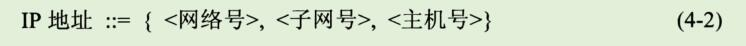

```
3、凡是从其他网络发送给本单位某个主机的IP数据报，仍然是根据IP数据报的目的网络号找到连接在本单位网络上的路由器。
但此路由器在收到IP数据报后，再按目的网络号和子网号找到目的子网，把IP数据报交付目的主机。
```

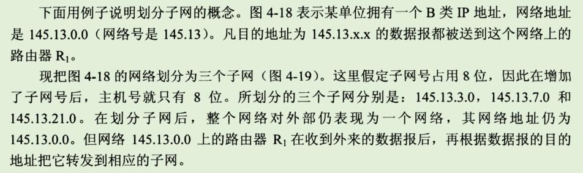

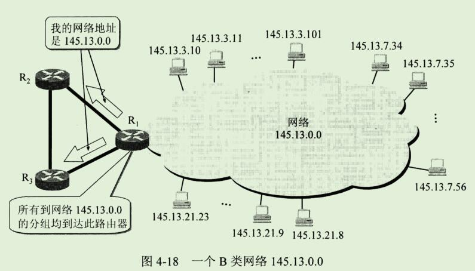

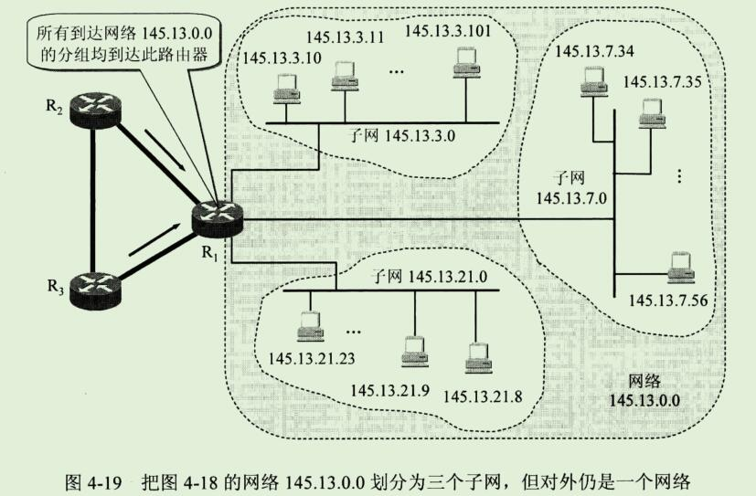

```
总之，当没有划分子网时，IP地址是两级结构。
划分子网后IP地址就变成了三级结构。
划分子网只是把IP地址的主机号这部分进行再划分，而不改变IP地址原来的网络号。
```

#### 2、子网掩码

```
现在剩下的问题就是：
假定有一个数据报(其目的地址是145.12.3.10)已经到达了路由器R1。
那么这个路由器如何把它转发到子网145.13.3.0呢？
```

```
我们知道，从IP数据报的首部无法看出源主机或目的主机所连接的网络是否进行了子网的划分。

这是因为32位的IP地址本身以及数据报的首部都没有包含任何有关子网划分的信息。
因此必须另外想办法，这就是使用子网掩码(subnet mask)(见图4-20)。
```

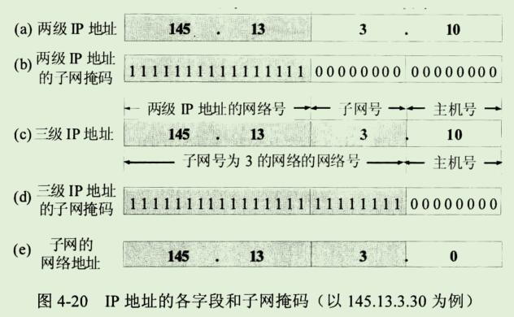


```
图4-20(a)是IP地址为 145.13.3.10 的主机本来的两级IP地址结构。
图4-20(b)是这个两级IP地址的子网掩码。
图4-20(c)是同一地址的三级IP地址结构，也就是说，现在从原来16位的主机号中拿出8位作为子网号，而主机号由16位减少到8位。

请注意，现在子网号为3的网络的网络地址是145.13.3.0 (既不是原来两级IP地址的网络地址 145.13.0.0，也不是简单的子网号3)。
为了使路由器R1能够很方便的从数据报中的目的IP地址中提取出所要找的子网的网路地址，路由器R1就要使用三级IP地址的子网掩码。

图4-20(d)是三级IP地址的子网掩码，它也是32位，由一串1和跟随一串0组成。
子网掩码中的1对应于IP地址中原来二级地址中的16位网络号加上新增的8位子网号，而子网掩码中的0对应于现在的8位主机号。

虽然RFC文档中没有规定子网掩码中的一串1必须是连续的，但却极力推荐在子网掩码中选用连续的1，以免出现可能发生的差错。
```

```
图4-20(e)表示R1把三级IP地址的子网掩码和收到的数据报的目的IP地址145.13.3.10 逐位相"与"(AND)(计算机进行这种逻辑AND运算是很容易的)，
得出了所要找的子网的网络地址145.13.3.0。
```

```
使用子网掩码的好处就是:
不管网络有没有划分子网，只要把子网掩码和IP地址进行逐位的"与"运算(AND),就立即得出网络地址来。
这样在路由器处理到来的分组时就可采用同样的算法。
```

```
归纳一下上述的要点。
从网络145.13.0.0外面看，这就是一个普通的B类网络，其子网掩码为16个连1后面跟上16个连0。

但进入到这个网络后(即到了路由器R1)，就看到了还有许多网络(即划分了子网后的许多网络)，其网络地址是 145.13.x.0(这里的x可以表示为不同的数值)，而这些网络的子网掩码都是24个连1后面跟上8个连0。
总之，在这个B类网络的外面和里面，看到的网络是不一样的。
```

```
这里还要弄清一个问题，这就是：
在不划分子网时，既然没有子网，为什么还要使用子网掩码？
这就是为了更便于查找路由表。
现在因特网的标准规定：所有的网路都必须使用子网掩码，同时在路由器的路由表中也必须有子网掩码这一栏。

如果一个网络不划分子网，那么该网络的子网掩码就使用默认子网掩码。

默认子网掩码中的1的位置和IP地址汇总的网络号字段net-id正好相对应。
因此，若用默认子网掩码和某个不划分子网的IP地址逐位相"与"(AND),就应当能够得出该IP地址的网络地址来。
```

```
这样做可以不用查找该地址的类别位就能知道这是哪一类的IP地址。
显然，
A类地址的默认子网掩码是255.0.0.0，或0xFF000000；
B类地址的默认子网掩码是255.255.0.0，或0xFFFF0000；
C类地址的默认子网掩码是255.255.255.0，或0xFFFFFF00；
```

```
图4-21是这三类IP地址的网络地址和相应的默认子网掩码。
```

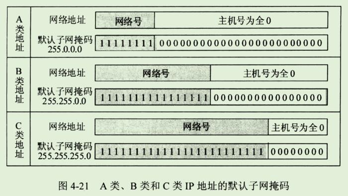

```
子网掩码是一个网络或一个子网的重要属性。
在RFC950成为因特网的正式标准后，路由器在和相邻路由器交换路由信息时，必须把自己所在网络(或子网)的子网掩码告诉相邻路由器。
在路由器的路由表中的每一个项目，除了要给出目的网络地址外，还必须同时给出该网络的子网掩码。
若一个路由器连接在两个子网上就拥有两个网络地址和两个子网掩码。
```

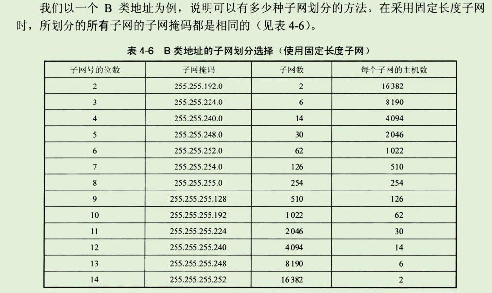

```
在表中4-6中，子网数是根据子网号subnet-id计算出来的。
若subnet-id有n位，则共有2^n种可能的排列。
除去全0和全1这两种情况，就得出表中的子网数。

表中"子网号的位数"中没有0,1,15,和16这四种情况，因为这没有意义。
0的话就是B类地址
1的话 只有0,1两位;又因为0就是B类地址,所以是有1有用;只有一个子网也没有意义。

15的话 主机号只有0,1 而全0和全1;代表的是本网络和所有主机;没有意义

16的话 就只有网络号 没有子网号了;
```

```
请读者注意，虽然根据已成为因特网标准协议的RFC950文档，子网号不能为全1或全0，但随着无分类域间路由选择CIDR的广泛使用，现在全1和全0的子网号也可以使用了，但一定要谨慎使用，要弄清你的路由器所用的路由选择软件是否支持全0或全1的子网号这种较新的用法。
```

```
我们可以看出，若使用较少位数的子网号，则每一个子网上可连接的主机数就较多。
凡是若使用较多位数的子网号，则子网的数目较多但每个子网上可连接的主机数就较少。

因此我们可根据具体情况(一共需要划分多少个子网，每个子网中最多有多少个主机)来选择合适的子网掩码。
```

```
通过简单的计算，读者不难得出这样的结论：划分子网增加了灵活性，但却减少了能够连接在网络上的主机总数。
例如，本来一个B类网络最多可连接65534台主机，但表4-6中任意一行的最后两项的乘积一定小于65534.

对A类和C类地址的子网划分也可得出类似的表格，读者可自行算出。
```

**例子**

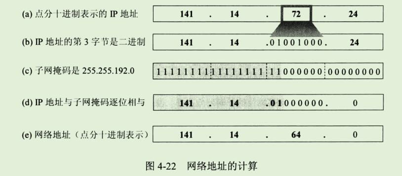

```
例4-2 
	已知IP地址是141.14.72.24, 子网掩码是255.255.192.0。
	试求网络地址。
	
解
	与一下就可以了
```

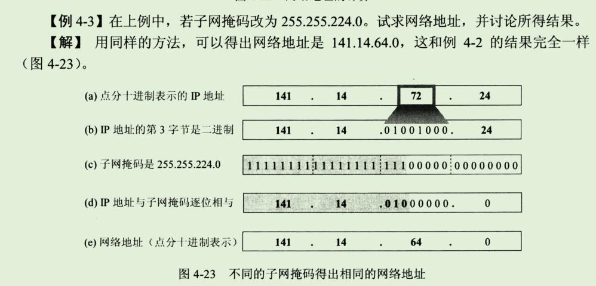

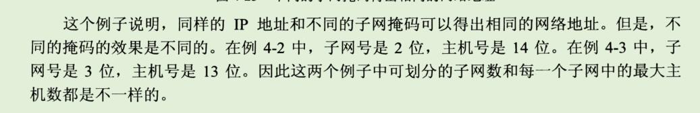

```
下面进一步讨论使用了子网掩码以后应怎样查找路由器。
```


### 2、使用子网时分组的转发

```
在划分子网的情况下，分组转发的算法必须做相应的改动。

我们应当注意到，使用子网划分后，路由表必须包含以下三项内容：
目的网络地址、子网掩码和下一跳地址。
```

```
在划分子网的情况下，路由器转发分组的算法如下：

1、从收到的数据报的首部提取目的IP地址D。
2、先判断是否为直接交付。
	对路由器直接相连的网络逐个进行检查：用各网络的子网掩码和D逐位相"与"(AND操作)，看结果是否和相应的网络地址匹配。
	若匹配，则把分组进行直接交付(当然还需要把D转换成物理地址，把数据报封装成帧发送出去)，转发任务结束。
	否则就是间接交付，执行3。
	
3、若路由表中有目的地址为D的特定主机路由，则把数据报传送给路由表中所指明的下一跳路由器;
	否则，执行4。
	
4、对路由表中的每一行(目的网络地址，子网掩码，下一跳地址)，用其中的子网掩码和D逐位相"与"(AND操作)，其结果为N。
若N与该行的目的网络地址匹配，则把数据报传送给该行指明的下一跳路由器;
否则，执行5.

5、若路由表中有一个默认路由，则把数据报传送给路由表中所指明的默认路由器;否则执行6。

6、报告转发分组出错。
```


### 3、无分类编址 CIDR(构成超网)

#### 1、网络前缀

```
划分子网一定程度上缓解了因特网在发展中遇到的困难。
然后在1992年因特网仍然面临三个必须尽早解决的问题，这就是：
1、B类地址在1992年已分配了近一半，眼看很快就将全部分配完毕！

2、因特网主干网上的路由表中的项目急剧增长(从几千个增长到几万个)。

3、整个IPv4的地址空间最终将全部耗尽。在2011年2月3日，IANA宣布IPv4地址已经耗尽了。
```

```
当时预计前两个问题将在1994年变得非常严重。
因此IETF很快的就研究出采用  无分类编址 的方法来解决前两个问题。
IETF认为上面的第三个问题属于更加长远的问题，因此专门成立IPv6工作组负责研究解决新版本IP协议的问题。
```

```
其实早在1987年，RFC1009就指明了在一个划分子网的网络中可同时使用几个不同的子网掩码。
使用变长子网掩码VLSM(Variable Length Subnet Mask)可进一步提高IP地址资源的利用率。
在VLSM的基础上又进一步研究出无分类编址方法，它的正式名字是无分类遇见路由选择CIDR(Classless Inter-Domain Routing,CIDR的读音是 "sider")。

在1993年形成了 CIDR 的RFC文档：RFC1517~1519和RFC1520。
较新的CIDR文档是2006年发表的RFC4632，已把老的文档1519列为陈旧的。
```

```
CIDR最主要的特点有两个：
1、CIDR消除了传统的A类、B类和C类地址以及划分子网的概念，因而可以更加有效的分配IPv4的地址空间，并且可以在新的IPv6使用之前容许因特网的规模继续增长。

CIDR把32位的IP地址划分为两个部分。
前面的部分是"网络前缀"(network-prefix)(或简称为"前缀")，用来指明网络，后面的部分则用来指明主机。

因此CIDR(classless inter-domain routing)使IP地址从三级编址(使用子网掩码)又回到了两级编码，但这已是无分类的两级编址。
它的记法是：
```

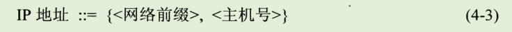

```
CIDR 还使用"斜线记法"(slash notation),或称为CIDR记法，即在IP地址后面加上斜线"/"，然后写上网络前缀所占的位数。
```

```

2、CIDR把网络前缀都相同的连续IP地址组成一个"CIDR 地址块"。
我们只要知道CIDR地址块中的任何一个地址，就可以知道这个地址块的起始地址(即最小地址)和最大地址，以及地址块中的地址数。
```

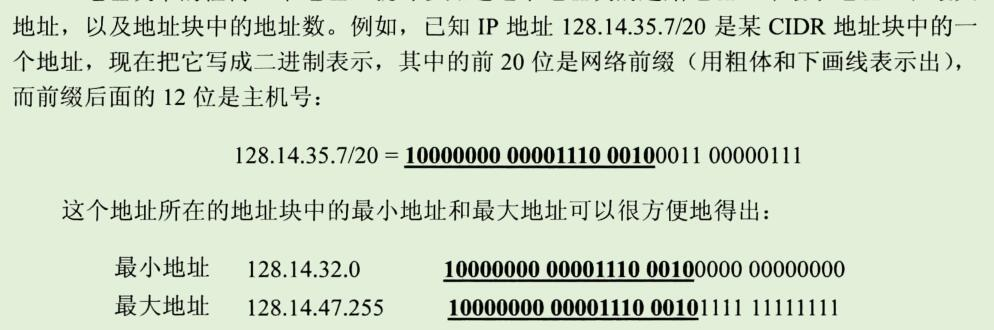


```
当然，这两个主机号是全0和全1的地址一般并不使用。
通常只使用在这两个地址之间的地址。
不难看出，这个地址块共有2^12个地址。
我们可以用 地址块中的最小地址 和 网络前缀的位数 指明这个地址块。

例如，上面的地址块可记为 128.14.32.0/20。
不需要指出地址块的起始地址时，也可把这样的地址块简称为 "/20地址块"。
```

```
为了更方便的进行路由选择，CIDR使用32位的地址掩码(address mask)。
地址掩码由一串1和一串0组成，而1的个数就是网络前缀的长度。
虽然CIDR不使用子网了，但由于目前仍有一些网络还使用子网划分和子网掩码，因此CIDR使用的地址掩码也可继续称为子网掩码。

例如，/20地址块的地址掩码是：
11111111 11111111 11110000 00000000(20个连续的1)。

斜线记法中，斜线后面
```


