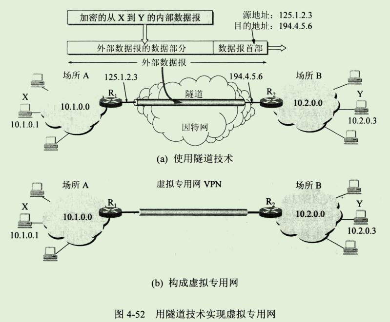

## 6、IP多播

### 1、IP多播的基本概念

```
1988年 steve Deering 首次在其博士学位论文中提出IP多播的概念。
1992年3月IETF在因特网范围首次试验IETF会议声音的多播，当时有20个网点可同时听到会议的声音。
IP多播是需要在因特网上增加更多的智能才能提供的一种服务。

现在IP多播(multicast, 以前曾译为组播)已成为因特网的一个热门课题。
这是由于有许多的应用需要由一个源点发送到许多个终点，即一对多的通信。

例如，实时信息的交付(如新闻、股市行情等)，软件更新，交互式会议等。
随着因特网的用户数目的急剧增加，以及多媒体通信的开展，有更多的业务需要多播来支持。
关于IP多播可参考[W-MCAST]。
```


```
与单播相比，在一对多的通信中，多播可大大节约网络资源。
图4-46(a)是视频服务器用单播方式向90个主机传送同样的视频节目。
为此，需要发送90个单播，即同一个视频分组要发送90个副本。

图4-46(b)是视频服务器用多播方式向属于同一个多播组的90个成员传送节目。
这时，视频服务器只需要把视频分组当作多播数据报来发送，并且只需发送一次。

路由器R1在转发分组时，需要把收到的分组复制成3个副本，分别向R2、R3和R4各转发1个副本。
当分组到达目的局域网时，由于局域网具有硬件多播功能，因此不需要复制分组，在局域网上的多播组成员都能收到这个视频分组。
```

```
当多播组的主机数很大时(如成千上万个)，采用多播方式就可明显的减轻网络中各种资源的消耗。
在因特网范围的多播要靠路由器来实现，这些路由器必须增加一些能够识别多播数据报的软件。
能够运行多播协议的路由器称为 多播路由器(multicast router)。
多播路由器当然也可以转发普通的单播IP数据报。
```

```
为了适应交互式音频和视频信息的多播，从1992年起，在因特网上开始试验虚拟的多播主干网MBONE(Multicast Backbone On the InterNEt)。
MBONE可把分组传播给地点分散但属于一个组的许多主机。
现在多播主干网已经有了相当大的规模。
```

```
在因特网上进行多播就叫做 IP 多播。
IP多播所传送的分组需要使用多播IP地址。
我们知道，在因特网中每一个主机必须有一个全球唯一的IP地址。
如果某个主机现在想接收某个特定多播组的分组，那么怎样才能使这个多播数据报传送到这个主机？
```

```
显然，这个多播数据报的目的地址一定不能写入这个主机的IP地址。
这是因为在同一时间可能有成千上万个主机加入到同一个多播组。
多播数据报不可能在其首部写入这样多的主机的IP地址。
在多播数据报的目的地址写入的是多播组的标识符，然后设法让加入到这个多播组的主机的IP地址与多播组的标识符关联起来。
```

```
其实多播组的标识符就是IP地址中的D类地址。
D类IP地址的前四位是1110，因此D类地址范围是224.0.0.0到239.255.255.255(见本章第4.2.2 节第1小节"IP地址及其表示方法")。
我们就用每一个D类地址标志一个多播组。
这样，D类地址共可标志 2^28个多播组，也就是说，在同一时间可以允许有超过2.6亿的多播组在因特网上运行。
多播数据报也是"尽最大努力交付"，不保证一定能够交付多播组内的所有成员。
因此，多播数据报和一般的IP数据报的区别就是它使用D类IP地址作为目的地址，并且首部中的协议字段值是2，表明使用网际组管理协议IGMP。
```

```
显然，多播地址只能用于目的地址，而不能用于源地址。
此外，对多播数据报不产生ICMP差错报文。
因此，若在PING命令后面键入多播地址，将永远不会收到响应。

D类地址中有一些是不能随意使用的，因为有的地址已经被IANA指派为永久组地址了[RFC 5735]。
例如
```


```
IP 多播可以分为两种。
一种是只在本局域网上进行硬件多播，另一种则是在因特网的范围进行多播。
前一种虽然比较简单，但很重要，因为现在大部分主机都是通过局域网接入到因特网的。
在因特网上进行多播的最后阶段，还是要把多播数据报在局域网上用硬件多播交付多播组的所有成员(如图4-46(b)所示)。
下面就先讨论这种硬件多播。
```


### 2、在局域网上进行硬件多播

```
因特网号码指派管理局IANA 拥有的以太网地址块的高24位为00-00-5E,因此TCP/IP协议使用的以太网多播地址块的范围是从00-00-5E-00-00-00 到 00-00-5E-FF-FF-FF。
在第三章3.4.3节已讲过，以太网硬件地址字段中的第1字节的最低位为1时为多播地址，这种多播地址数占IANA分配到的地址数的一半。
因此IANA拥有的以太网多播地址的范围是从01-00-5E-00-00-00 到 01-00-5E-7F-FF-FF 
为什么mac地址少了一半。。。不清楚；应该是本来就只公开了这一半能使用。

不难看出，在每一个地址中，只有23位可用作多播。
这只能和D类IP地址中的23位有意义对应的关系。

D类IP地址可供分配的有28位，可见在这28位中的前5位不能用来构造以太网硬件地址(图4-47)。

例如，IP多播地址224.128.64.32(即E0-80-40-20)和另一个IP多播地址 224.0.64.32(即E0-00-40-20)转换成以太网的硬件多播地址都试 01-00-5E-00-40-20。
由于多播IP地址与以太网硬件地址的映射关系不是唯一的，因此收到多播数据报的主机，还要在IP层利用软件进行过滤，把不是本主机要接收的数据报丢弃。
```


下面就讨论进行IP多播所需要的协议


### 3、网际组管理协议IGMP和多播路由选择协议

#### 1、IP多播需要两种协议


```
图4-48是在因特网上传送多播数据报的例子。
图中标有IP地址的四个主机都参加了一个多播组，其组地址是226.15.37.123。
显然，多播数据报应当传送到路由器 R1,R2,R3,
而不应当传送到路由器R4，因为与R4连接的局域网上现在没有这个多播组的成员。
```

IGMP

```
图4-48强调了 IGMP 的本地使用范围。
请注意，IGMP并非在因特网范围内对所有多播组成员进行管理的协议。
IGMP不知道IP多播组包含的成员数，也不知道这些成员都分布在哪些网络上，等等。
IGMP协议是让连接在本地局域网上的多播路由器知道本局域网上是否有主机(严格讲，是主机上的某个进程)参加或退出了某个多播组。

IGMP是组播路由器用来维护组播组成员信息的协议，运行于主机和和组播路由器之间。
```

多播路由器

```
显然，仅有IGMP协议是不能完成多播任务的。
连接在局域网上的多播路由器还必须和因特网上的其他多播路由器协同工作，以便把多播数据报用最小代价传送给所有的组成员。
这就需要使用多播路由选择协议。
```

```
然后多播路由器选择协议要比单播路由选择协议复杂的多。
我们可以通过一个简单的例子来说明(图4-49)
```


```
我们假定图4-49中有两个多播组。
多播组1的成员有主机 A,B,C,
而多播组2的成员有主机 D,E,F。
这些主机分布在三个网络上(N1,N2,N3)。

路由器R不应当向网络N3转发多播组1的分组，因为网络N3上没有多播组1的成员。
但是每一个主机可以随时加入或离开一个多播组。

例如，主机G现在加入了多播组1。
从这时起，路由器R就必须也向网络N3转发多播组1的分组。
这就是说，多播转发必须动态的适应多播组成员的变化(这时网络拓扑并未发生变化)。
请注意，单播路由器选择通常是在网络拓扑发生变化时才需要更新路由。
```

```
再看一种情况。
主机E和F都是多播组2的成员。
当E向F发送多播数据报时，路由器R把这个多播数据报转发到网络N3。
但当F向E发送多播数据报时，路由器R则把多播数据报转发到网络N2。
如果路由器R收到来自主机A的多播数据报(A不是多播组2的成员，但是也可以向多播组发送多播数据报)，那么路由器R就应当把多播数据报转发到N2和N3。

由此可见，多播路由器在转发多播数据报时，不能仅仅根据多播数据报中的目的地址，而是还要考虑这个多播数据报从什么地方来和要到什么地方去。

向E发送的组播，要考虑到起点是N2，所以不再转发到N2网络上，而是直接往N3网路转发
```

```
还有一种情况，主机G没有参加任何多播组，但G却可向任何多播组发送多播数据报。

例如，G可向多播组1或2发送多播数据报。
主机G所在的局域网上可以没有任何多播组的成员。

显然，多播数据报所经过的许多网络，也不一定非要有多播组成员。
总之，多播数据报可以由没有加入多播组的主机发出，也可以通过没有组成员接入的网络。

正因为如此，IP多播就成为比较复杂的问题。下面介绍这两种协议的要点。
```


#### 2、网际组管理协议IGMP

```
IGMP已有了三个版本。
1989年公布的RFC1112(IGMPv1)早已成为了因特网的标准协议。
1997年公布的RFC2236(IGMPv2，建议标准)对IGMPv1进行了更新。
2002年10月公布了RFC3376(IGMPv3，建议标准)，宣布RFC2236(IGMPv2)是陈旧的。
```

```
和网际控制报文协议ICMP相似，IGMP使用IP数据报传递其报文(即IGMP报文加上IP首部构成IP数据报)，但它也向IP提供服务。
因此，我们不把IGMP看成是一个单独的协议，而是属于整个网际协议IP的一个组成部分。
```

```
从概念上将，IGMP的工作可分为两个阶段。

第一阶段：当某个主机加入新的多播组时，该主机应向多播组的多播地址发送一个IGMP报文，声明自己要称为该组的成员。
本地的多播路由器收到IGMP报文后，还要利用多播路由选择协议把这种组成员关系转发给因特网上的其他多播路由器。

第二阶段：
组成员关系是动态的。
本地多播路由器要周期性的探询本地局域网上的主机，以便知道这些主机是否还继续是组的成员。
只要有一个主机对某个组响应，多播路由器就认为这个组时活跃的。
但一个组在经过几次的探询后仍然没有一个主机响应，多播路由器就认为本网络上的主机已经都离开了这个组，因此也就不再把这个组的成员关系转发给其他的多播路由器。
```

```
IGMP设计的很仔细，避免了多播控制信息给网络增加大量的开销。
IGMP采用的一些具体措施如下：
下面所有的通信都只是路由器和主机可用

1、在主机和多播路由器之间的所有的通信都使用IP多播。
只要有可能，携带IGMP报文的数据报都用硬件来多播传送。
因此在硬件多播的网络上，没有参加IP多播的主机都不会收到IGMP报文。

2、多播路由器在探询组成员关系时，只需要对所有的组发送一个请求信息的询问报文，而不需要对每一个组发送一个询问报文(虽然也允许对一个特定组发送询问报文)。
默认的询问速率是每125秒发送一次(通信量并不大)。

3、当同一个网络上连接有几个多播路由器时，它们能够迅速和有效的选择其中的一个来探询主机的成员关系。
因此，网络上有多个多播路由器并不会引起IGMP通信量的增大。

4、在IGMP的询问报文中有一个数值N，它指明一个最长响应时间(默认值为10秒)。
当收到询问时，主机在0和N之间随机选择发送响应所需经过的时延。
因此，若一个主机同时参加了几个多播组，则主机对每一个多播组选择不同的随机数。
对应于最小时延的响应最先发送。

5、同一个组内的每一个主机都要监听响应，只要有本组的其他主机先发送了响应，自己就可以不再发送响应了。
这样就抑制了不必要的通信量。(因为是局域网内发送，所以监听不需要消耗资源)


多播路由器并不需要保留组成员关系的准确记录,因为向局域网上的组成员转发数据报是使用硬件多播。
多播路由器只需知道网络上是否至少有一个主机是本组成员即可。
实际上，对询问报文每一个组只须有一个主机发送响应。

如果一个主机上有多个进程都加入了某个多播组，那么这个主机对发给这个多播组的每个多播数据报值接收一个副本，然后给主机中的每一个进程发送一个本地复制的副本。

最后我们还要强调指出，多播数据报的发送者和接收这都不知道(也无法找出)一个多播组的成员有多少，以及这些成员是哪些主机。
因特网中的路由器和主机都不知道哪个应用进程将要向哪个多播组发送多播数据报，因为任何应用进程都可以在任何时候向任何一个多播组发送多播数据报，而这个应用进程并不需要加入这个多播组。

IGMP 有两部分
1、新加入组发送消息
2、定时心跳
```


#### 3、多播路由选择协议

```
虽然在TCP/IP多播协议已成为建议标准，但多播路由选择协议(用来在多播路由器之间传播路由信息)则尚未标准化。

在多播过程中一个多播组中的成员是动态变化的。
例如在收听网上某个广播节目时，随机会有主机加入或离开这个多播组。

多播路由选择实际上就是要找出以源主机为根节点的多播转发树。
在多播转发树上，每一个多播路由器向树的叶节点方向转发收到的多播数据报，但在多播转发树上的路由器不会收到重复的多播数据报(即多播数据报不应在互联网中兜圈子)。
不难看出，对不同的多播组对应于不同的多播转发树。
同一个多播组，对不同的源点也会有不同的多播转发树。

至于这个多播转发树怎么来的，就和路由协议一样同步来的呗
```

```
已有了多种实用的多播路由选择协议，它们在转发多播数据报时使用了以下的三种方法：
```

##### 1、洪泛与剪除

```
1、洪泛与剪除
这种方法适用于较小的多播组，而所有的组成员接入的局域网也是相邻接的。
一开始，路由器转发多播数据报使用洪泛的方法(这就是广播)。
为了避免兜圈子，采用了反向路径广播RPB(Reverse Path Broadcasting)的策略。

RPB的要点是：每一个路由器在收到一个多播数据报时，先检查数据报是否从源点经最短路径传送来的。
进行这种检查很容易，只要从本路由器寻找到源点的最短路径上(之所以叫做反向路径，因为计算最短路径时是把源点当做终点)的第一个路由器是否就是刚才把多播数据报送来的路由器。

若是，就向所有其他方向转发刚才收到的多播数据报(但进入的方向除外)，否则就丢弃而不转发。
如果本路由器有好几个相邻路由器都处在到源点的最短路径上(也就是说，存在几条同样长度的最短路径)，那么只能选择一条最短路径，选择的准则就是看这几条最短路径中的相邻路由器谁的IP地址最小。

图4-50的例子说明了这一概念。
```


```
为了简单起见，在图4-50中的网络用路由器之间的链路来表示。
我们假定各路由器之间的距离都是1。
路由器R1收到源点发来的多播数据报后，向R2和R3转发。
R2发现R1就在自己到源点的最短路径上，因此向R3和R4转发收到的数据报。
R3发现R2不在自己到源点的最短路径上，因此丢弃R2发来的数据报。
其他路由器也这样转发。

R7到源点有两条最短路径：R7->R4->R2->R1->源点；
R7->R5->R3->R1->源点。

我们再假定R4的IP地址比R5的IP地址小，所以我们只使用前一条最短路径。
因此R7只转发R4传过来的数据报，而丢弃R5传过来的数据报。

最后就得出了用来转发多播数据报的多播转发树(图中用粗线表示)，以后就按这个多播转发树来转发多播数据报。
这样就避免了多播数据报兜圈子，同时每一个路由器也不会接收重复的多播数据报。
```

```
如果多播转发树上的某个路由器发现它的下游树枝(即叶节点方向)已没有该多播组的成员，就应把它和下游的树枝一起剪除。
例如，在图4-50中虚线椭圆表示剪除的部分。
当某个树枝有新增加的组成员时，可以再接入到多播转发树上。
```


##### 2、隧道技术(tunneling)

```
隧道技术适用于多播组的位置在地理上很分散的情况。
例如在图4-51中，网1和网2都支持多播。
```


```
现在网1中的主机向网2中的一些主机进行多播。
但路由器R1和R2之间的网络并不支持多播，因而R1和R2不能按多播地址转发数据报。
为此，路由器R1就对多播数据报进行再次封装，即再加上普通数据报首部，使之成为单一目的站发送的单播(unicast)数据报，然后通过"隧道"(tunnel)从R1发送到R2。
```

```
单播数据报到路由器R2后，再由路由器R2剥去其首部，使它又恢复成原来的多播数据报，继续向多个目的站转发。
这种使用隧道技术传送数据报又叫做IP中的IP(IP-in-IP)。
```

##### 3、基于核心的发现技术

```
这种方法对于多播组的大小在较大范围内变换时都合适。
这种方法是对每一个多播组G指定一个核心(core)路由器，给出它的IP单播地址。
核心路由器按照前面讲过的方法创建出对应于多播组G的转发树。
如果有一个路由器R1 向这个核心路由器发送数据报，那么它在途中经过的每一个路由器都要检查其内容。
当数据报到达参加了多播组G的路由器R2时，R2就处理这个数据报。
如果R1发出的是一个多播数据报，其目的地址是G的组地址，R2就向多播组G的成员转发这个多播数据报。

如果R1发出的数据报是一个请求加入多播组G的数据报，R2就把这个信息加到它的路由中，并用隧道技术向R1转发每一个多播数据报的一个副本。

这样，参加到多播组G的路由器就从核心向外增多了，扩大了多播转发树的覆盖范围。
```


```
目前还没有在整个因特网使用的多播路由选择协议。
下面是一些建议使用的多播路由选择协议。

1、	距离向量多播路由选择协议DVMRP(Distance Vector Multicast Routing Protocol)是在因特网上使用的第一个多播路由选择协议。
由于在UNIX 系统中实现RIP的程序叫做routed，所以在routed的前面加表示多播的字母m,叫做mrouted,它使用 DVMRP 在路由器之间传播路由信息。


2、	基于核心的转发树CBT(Core Based Tree)。
这个协议使用核心路由器作为转发树的根节点。
一个大的自治系统AS可划分为几个区域，每一个区域选择一个核心路由器(也叫做中心路由器 center router，或汇聚点路由器 rendezvous router)。

3、	开放最短通路优先的多播扩展MOSPF(Multicast extensions to OSPF)。
这个协议是单播路由选择协议OSPF的扩展，使用与一个机构内。
MOSPF使用多播链路状态路由选择创建出基于源点的多播转发树。
	
4、	协议无关多播-稀疏方式PIM-SM(Protocol Independent Multicast-Sparse Mode)。
这个协议适用于组成员的分布非常集中的情况，例如组成员都在一个机构之内。
PIM-DM不使用核心路由器，而是使用洪泛方式转发数据报。
```


## 7、虚拟专用网VPN和网络地址转换NAT

### 1、虚拟专用网 VPN

```
由于IP地址的紧缺，一个机构能够申请到的IP地址数往往远小于本机构所拥有的主机数。

考虑到因特网并不很安全，一个机构内也并不需要把所有的主机都接入到外部的因特网。
实际上，在许多情况下，很多主机主要还是和本机构内的其他主机进行通信(例如，在大型商场或宾馆中，有很多用于营业和管理的计算机。显然这些计算机并不需要和因特网相连)。

假定在一个机构内部的计算机通信也是采用TCP/IP协议，那么从原则上讲，对于这些仅在机构内部使用的计算机可以由本机构自行分配其IP地址。
这就是说，让这些计算机使用仅在本机构有效的IP地址(这种地址称为 本地地址),
而不需要向因特网的管理机构申请全球唯一的IP地址(这种地址称为全球地址)。
这样就可以大大节约宝贵的全球IP地址资源。
```

```
但是，如果任意选择一些IP地址作为本机构内部使用的本地地址，那么在某种情况下可能会引起一些麻烦。

例如，有时机构内部的某个主机需要和因特网连接，那么这种仅在内部使用的本地地址就有可能和因特网中某个IP重合，这样就会出现地址的二义性问题。
```

```
为了解决这一问题，RFC1918 指明了一些专用地址(private address)。
这些专用地址只能用于一个机构的内部通信，而不能用于和因特网上的主机通信。
换言之，专用地址只能用作本地地址而不能用作全球地址。

在因特网中的所有路由器，对目的地址是专用地址的数据报一律不进行转发。

2010年1月，RFC5735全面给出了所有特殊用途的IPv4地址，但三个专用地址块的指派并无变化，即

1、10.0.0.0 到 10.255.255.255 (或记为10.0.0.0/8,它又被称为24位块)

2、172.16.0.0 到 172.31.255.255 (或记为 172.16.0.0/12，它又被称为20位块)

3、192.168.0.0 到 192.168.255.255 (或记为 192.168.0.0/16，它又被称为16位块)。

上面的三个地址块分别相当于一个A类地址、16个连续的B类地址和256个连续的C类地址。

A类地址本来早已用完了，而上面的地址10.0.0.0 本来是分配给ARPANET 的。
由于ARPANET 已经关闭停止运行了，因此这个地址就用作专用地址。

A类地址 8位网络位 前缀 0;  主机号24位
B类地址 16位网络位 前缀 10;  主机号16位
A类地址 24位网络位 前缀 110;  主机号8位
```

```
采用这样的专用IP地址的互连网络称为专用互联网或本地互联网，或更简单些，就叫做专用网。
显然，全世界可能有很多的专用互连网络具有相同的专用IP地址，但这并不会引起麻烦，因为这些专用地址仅在本机构内部使用。

专用IP地址也叫做可重用地址(reusable address)。
```

```
有时一个很大的机构又许多部门分布在相距很远的一些地点，而在每一个地点都有自己的专用网。
假定这些分布在不同地点的专用网需要经常进行通信。
这时，可以有两种方法。

第一种方法是租用电信公司的通信线路为本机构专用。
这种方法的好处是简单方便，但线路租金太高。

第二种方法是利用公用的因特网作为本机构各专用网之间的通信载体，这样的专用网又称为虚拟专用网VPN(virtual private network)。
```

```
之所以称为"专用网"是因为这种网络是为本机构的主机用于机构内部的通信，而不是用于和网络外非本机构的主机通信。

如果专用网不同网点之间的通信必须经过公用的因特网，但又有保密的要求，那么所有通过因特网传送的数据都必须加密。

"虚拟"表示"好像是"，但实际又不是，因为现在并没有使用专线而是通过公用的因特网来连接分散在各场所(site)的本地网络。

VPN只是在效果上和真正的专用网一样。
一个机构要构建自己的VPN就必须为它的每一个场所购买专门的硬件和软件，并进行配置，使每一个场所的VPN系统都知道其他场所的地址。
```



```
图4-52以两个场所说明如何使用IP隧道技术实现虚拟专用网。

假定某个机构在两个相隔较远的场所建立了专用网A和B，其网络地址分别为专用地址 10.1.0.0 和 10.2.0.0。

现在这两个场所需要通过公用的因特网构成一个VPN。

显然，每一个场所至少要有一个路由器具有合法的全球IP地址。
路由器R1和R2在专用网内部网络的接口地址则是专用网的本地地址。
```


```
在每一个场所A或B内部的通信量都不经过因特网。
但如果场所A的主机X要和另一个场所B额主机Y通信，
就必须经过路由器R1和R2。

主机X向主机Y发送的IP数据报的源地址是10.1.0.1，而目的地址是10.2.0.3。

这个数据报先作为本机构的内部数据报从X发送到与因特网连接的路由器R1。

路由器R1收到内部数据报后，发现其目的网络必须通过因特网才能到达，就把整个的内部数据报进行加密(这样就保证了内部数据报的安全)，

然后重新加上数据报的首部，封装成为在因特网上发送的外部数据报，其源地址是路由器R1的全球地址125.1.2.3，而目的地址是路由器R2的全球地址 194.4.5.6。

路由器R2收到数据报后将其数据部分取出进行解密，恢复出原来的内部数据报(目的地址是 10.2.0.3),交付主机Y。

可见，虽然X向Y发送的数据报是通过了公用的因特网，但在效果上就好像是在本部门的专用网上传送一样。

如果主机Y要向X发送数据报，那么所经过的步骤也是类似的。
```

```
请注意，数据报从R1栓送到R2可能要经过因特网中的很多个网络和路由器。

但从逻辑上看，在R1和R2之间好像是一条直通的点对点链路，图4-52(a)中的"隧道"就是这个意思。

如图4-52(b)所示的、由场所A和B的内部网络所构成的虚拟专用网VPN又称为内联网(intranet 或 intranet VPN，即内联网 VPN)，表示场所A和B都属于同一个机构。

有时一个机构的VPN需要有某些外部机构(通常就是合作伙伴)参加进来。
这样的VPN就称为外联网(extranet 或 extranet VPN，即外联网VPN)。

请注意，内联网和外联网都采用了因特网技术，即都是基于TCP/IP协议的。

还有一种类型的VPN,就是远程接入VPN(remote access VPN)。
我们知道，有的公司可能并没有分布在不同场所的部门，但却有很多流动员工在外地工作。
公司需要和他们保持联系，有时还可能一起开电话或视频会议。
远程记入VPN可以满足这种需求。
在外地工作的员工通过拨号接入因特网，而驻留在员工PC中的VPN软件可以在员工的PC和公司的主机之间建立VPN隧道，因而外地员工与公司通信的内容是保密的，员工们感到好像就是使用公司内部的本地网络。
```


### 2、网络地址转换NAT

```
下面讨论另一种情况，就是在专用网内部的一些主机本来已经分配到了本地IP地址(即仅在本专用网内使用的专用地址)，但现在又想和因特网上的主机通信(并不需要加密)，那么应当采取什么措施呢？
```

```
最简单的办法就是设法再申请一些全球IP地址。
但这在很多情况下是不容易做到的，因为全球IPv4的地址已经所剩不多了。
目前使用的最多的方法是采用网络地址转换。
```

```
网络地址转换NAT(network address translation)方法是在1994年提出的。
这种方法需要在专用网连接到因特网的路由器上安装NAT软件。

装有NAT软件的路由器叫做NAT路由器，它至少有一个有效的外部全球IP地址。

这样，所有使用本地地址的主机在和外界通信时，都要在NAT路由器上将其本地地址转换成全球IP地址，才能和因特网连接。
```


```
图4-53给出了NAT路由器的工作原理。
在图中，专用网192.168.0.0内所有主机的IP地址都试本地IP地址 192.168.x.x。
NAT路由器至少要有一个全球IP地址，才能和因特网相连。
图4-53表示出NAT路由器有一个全球IP地址172.38.1.5(当然,NAT路由器可以有多个全球IP地址)
```


```
NAT路由器收到从专用网内部的主机A发往因特网上主机B的IP数据报：源IP地址是192.168.0.3，而目的IP地址是213.18.2.4。

NAT路由器把IP数据报的源IP地址192.168.0.3，转换为新的源IP地址(即NAT路由器的全球IP地址)172.38.1.5,然后转发出去。

因此，主机B收到这个IP数据报时，以为A的IP地址是172.38.1.5。

当B给A发送应答时，IP数据报的目的IP地址是NAT路由器的IP地址172.38.1.5。

B并不知道A的专用地址192.168.0.3。

实际上，即使知道了，也不能使用，因为因特网上的路由器都不转发目的地址是专用本地IP地址的IP数据报。
当NAT路由器收到因特网上的主机B发过来的IP数据报时，还要进行一次IP地址的转换。

通过NAT地址转换表，就可把IP数据报上的旧的目的IP地址172.38.1.5，转换为新的目的IP地址192.168.0.3(主机A真正的本地IP地址)。

表4-10给出了NAT地址转换表的举例。
表中的前两行数据对应于图4-53中所举例的例子。
第一列"方向"中的"出"表示离开专用网，而"入"表示进入专用网。
表中后两行数据(图4-53中没有画出对应的IP数据报)表示专用网内的另一主机192.168.0.7 向因特网发送了IP数据报，而NAT路由器还有另外一个全球IP地址172.28.1.6。
```

```
由此可见，当NAT路由器具有N个全球IP地址时，专用网内最多可以同时有n个主机接入到因特网。

这样就可以使专用网内较多数量的主机，轮流使用NAT路由器有限数量的全球IP地址。
```

```
显然，通过NAT路由器的通信必须由专用网内的主机发起。
设想因特网上的主机要发起通信，当IP数据报到达NAT路由器时，NAT路由器就不知道应当把目的IP地址转换成专用网内的哪一个本地地址。

这就表明，这种专用网内部的主机不能充当服务器用，因为因特网上的客户无法请求专用网内的服务器提供服务。
```


NAT利用端口

```
为了更加有效地利用NAT路由器上的全球IP地址，现在常用的NAT转换表把运输层的端口号也利用上。
这样，就可以使多个拥有本地地址的主机，共用一个NAT路由器上的全球IP地址，因而可以同时和因特网上的而不同主机进行通信。
```

```
使用端口号的NAT也叫做网络地址与端口号转换NAPT(Network Address and Port Translation)。
但在许多文献中，更常用的还是使用NAT这个更加简洁的缩写词。
图4-11说明了NAPT的地址转换机制。
```


```
从表4-11可以看出，在专用网内主机192.168.0.3 向因特网发送IP数据报，其TCP端口号为30000。
NAPT把源IP地址和TCP端口号都进行转换(如果是使用UDP，则对UDP的端口号进行转换。原理时一样的)。

另一台主机192.168.0.4 也选择了同样的TCP端口号30000。
这纯属巧合(端口号仅在本主机中才有意义)。
现在NAPT把专用网内不同的源IP地址，都转换为同样的全球IP地址。

但对源主机所采用的TCP端口号(不管相同或不同)，则转换为不同的新的端口号。

因此，当NAPT路由器收到从因特网发来的应答时，就可以从IP数据报的数据部分找出运输层的端口号，然后根据不同的目的端口号，从NAPT转换表中找到正确的目的主机。
```

```
应当指出，从层次的角度看，NAPT的机制有些特殊。
普通路由器在转发IP数据报时，对于源IP地址或目的IP地址都是不改变的。
但NAT路由器在转发IP数据报时，一定要更换其IP地址(转换源IP地址或目的IP地址)。

其次，普通路由器在转发分组时，是工作在网络层。
但NAPT路由器还要 查看和转换运输层的端口号，二者本来应当是属于运输层的范畴。
也正因为这样，NAPT曾遭受了一些人的批评，认为NAPT的操作没有严格按照层次的关系。
但不管怎样，NAT(包括NAPT)已成为因特网的一个重要构件。
```


## 本章的重要概念

```
1、tcp/ip体系中的网络层向上只提供简单灵活的、无连接的、尽最大努力交付的数据报服务。
网络层不提供服务质量的承诺，不保证分组交付的时限，所传送的分组可能出错、丢失、重复和失序。
进程之间的通信可靠性由运输层负责。


2、IP网是虚拟的，因为从网络层上看，IP网好像是一个统一的、抽象的网络(实际上是异构的)。
IP层抽象的互联网屏蔽了下层网络很复杂的细节，使我们能够使用统一的、抽象的IP地址处理主机之间的通信问题。

3、在互联网上交付有两种：在本网络上的直接交付(不经过路由器)和其他网络的间接交付(经过至少一个路由器，但最后一次一定是直接交付)。

4、一个IP地址在整个因特网范围内是唯一的。
分类的IP地址包括A类、B类和C类地址(单播地址)，以及D类地址(多播地址)。
E类地址未使用。

5、分类的IP地址由网络号字段(指明网络)和主机号字段(指明主机)组成。
网络字段最前面的类别位指明IP地址的类别。

6、IP地址是一种分等级的地址结构。
IP地址管理机构在分配IP地址时只分配网络号，而主机号则由得到该网络号的单位自行分配。
路由器仅根据目的主机所连接的网络号来转发分组。

7、IP地址标志一台主机(或路由器)和一条链路的接口。
多归属主机同时连接到两个或更多的网络上。
这样的主机同时具有两个或更多的IP地址，其网络号必须是不同的。
由于一个路由器至少应当连接到两个网络，因此一个路由器至少应当由两个不同的IP地址。

8、按照因特网的观点，用转发器或网桥连接起来的若干个局域网仍为一个网络。
所有分配到网络号的网络(不管是范围很小的局域网，还是可能覆盖很大地理范围的广域网)都是平等的。

9、物理地址(即硬件地址)是数据链路层和物理层使用的地址，而IP地址是网路层和以上各层使用的地址，是一种逻辑地址(用软件实现的)，在数据链路层看不见数据报的IP地址。

10、IP数据报分为首部和数据两部分。
首部的前一部分是固定长度，共20字节，是所有IP数据报必须具有的(源地址、目的地址、总长度等重要字段都在固定首部中)。
一些长度可变的可选字段放在固定首部的后面。

11、IP首部中的生存时间字段给出了IP数据报在因特网中所能经过的最大路由器数，可防止IP数据报在互联网中无限制的兜圈子。

12、地址解析协议APR把IP地址解析为硬件地址，它解决同一个局域网上的主机或路由器的IP地址和硬件地址的映射问题。
ARP的高速缓存可以大大减少网络上的通信量。

13、在因特网中，我们无法根据硬件地址寻找到某个网络上的某台主机。
因此，从IP地址到硬件地址的解析是非常必要的。

14、无分类域间路由选择CIDR是解决目前IP地址紧缺的一个好方法。
CIDR记法把IP地址后面加上斜线"/"，然后写上前缀所占的位数。
前缀(或网络前缀)用来指明网络，前缀后面的部分是后缀，用来指明主机。
CIDR把前缀都相同的连续的IP地址组成一个"CIDR地址块"。
IP地址的分配都以CIDR地址块为单位。classless inter domian routing

15、CIDR的32位地址掩码(或子网掩码)由一串1和一串0组成，而1的个数就是前缀的长度。
只要把IP地址和地址掩码逐位进行"逻辑与(AND)"运算，就很容易得出网络地址。

A类地址的默认地址掩码是255.0.0.0。
B类地址的默认地址掩码是255.255.0.0。
C类地址的默认地址掩码是255.255.255.0。

16、路由聚合(把许多前缀相同的地址用一个来代替)有利于减少路由表中的项目，减少路由器之间的路由选择信息的交换，从而提高了整个因特网的性能。

17、"转发"和"路由选择"有区别。
"转发"是单个路由器的动作。
"路由选择"是许多路由器共同协作的过程，
这些路由器互相交换信息，目的是生成路由表，再从路由表导出转发表。
若采用自适应路由选择算法，则当网络拓扑变化时，路由表和转发表都能自动更新。
在许多情况下，可以不考虑转发表和路由表的区别，而都使用路由表这一名词。

18、自治系统(AS)就是在单一技术管理下的一组路由器。
一个自治系统对其他自治系统表现出的是一个单一和一致的路由选择策略。

19、路由选择协议有两大类：
内部网关协议(或自治系统内部的路由选择协议)，
如RIP和OSPF；
外部网关协议(或自治系统之间的路由选择协议)，如BGP-4。

20、RIP是分布式的基于距离向量的路由选择协议，只适用于小型互联网。
RIP按固定的时间间隔与相邻路由器交换信息。
交换的信息是自己当前的路由表，即到达本自治系统中所有网络的(最短)距离，以及到每一个网络应经过的下一跳路由器。

21、OSPF是分布式的链路状态协议，适用于大型互联网。
OSPF只在链路状态发生变化时，才用向本自治系统中的所有路由器，用洪泛法发送与本路由器相邻的所有路由器的链路状态信息。
"链路状态"指明被本路由器都和哪些路由器相邻，以及该链路的"度量"。
"度量"可表示费用、距离、时延、带宽等，可统称为"代价"。
所有的路由器最终都能建立一个全网的拓扑结构图。

22、BGP-4是不同AS的路由器之间交换路由信息的协议，是一种路径向量路由选择协。
BGP力求寻找一条能够到达目的网络(可达)且比较好的路由(不兜圈子)，而并非要寻找一条最佳路由。

23、网际控制报文协议ICMP是IP层的协议。
ICMP报文作为IP数据报的数据，加上首部后组成IP数据报发送出去。
使用ICMP并不是实现了可靠传输。
ICMP允许主机或路由器报告差错情况和提供有关异常情况的报告。
ICMP报文的种类有两种，即ICMP差错报文和ICMP询问报文。

24、ICMP的一个重要应用就是分组网间探测PING，用来测试两台主机之间的连通信。
PING使用了ICMP回送请求和回答报文。

25、与单播相比，在一对多的通信中，IP多播可大大节约网络资源。
IP多播使用D类IP地址。
IP多播需要使用网际组管理协议IGMP和多播路由选择协议。

26、虚拟专用网VPN利用公网的因特网作为本机构各专用网之间的通信载体。
VPN内部使用因特网的专用地址。
一个 VPN至少要有一个路由器具有合法的全球IP地址，这样才能和本系统的另一个VPN通过因特网进行通信。
所有通过因特网传送的数据都必须加密。

27、使用网络地址转换NAT技术，可以在专用网络内部使用专用IP地址，而仅在连接到因特网的路由器使用全球IP地址。
这样就大大节约了宝贵的IP地址。
```


