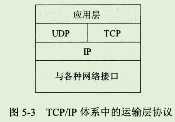

**运输层**

```
本章先概括运输层协议的特点，以及进程之间通信以及端口等重要概念。
然后讲述比较简单的UDP协议。
其余的篇幅都是讨论比较复杂但非常重要的TCP协议 和 可靠传输的原理，包括停止等待协议和ARQ协议。
在详细讲述TCP报文段的首部格式之后，讨论TCP的三个重要问题：
滑动窗口、流量控制和拥塞控制机制。
最后，介绍TCP的连接管理。

运输层是整个网络体系结构中的关键层次之一。
一定要弄清以下一些重要概念：
1、运输层为互相通信的应用进程提供逻辑通信。
2、端口和套接字的意义。
3、无连接的UDP的特点。
4、面向连接的TCP的特点。
5、在不可靠的网络上实现可靠传输到的工作原理，停止等待协议和ARQ协议。
6、TCP的滑动窗口、流量控制、拥塞控制和连接管理。
```

## 1、运输层协议概述

### 1、进程之间的通信

```
从通信和信息处理的角度看，运输层向它上面的应用层提供通信服务，它属于面向通信部分的最高层，同时也是用户功能中的最底层。

当网络的边缘部分中的两个主机使用网络的核心部分的功能进行端到端的通信时，
只有主机的协议栈才有运输层，
而网络核心部分中的路由器在转发分组时都只用到下三层的功能。
```


```
下面通过图5-1的示意图来说明运输层的作用。
设局域网LAN1上的主机A和局域网LAN2上的主机B通过互连的广域网WAN进行通信。
我们知道，IP协议能够把源主机A发送出的分组按照首部中的目的地址送交到目的主机B，那么，为什么还需要运输层呢。

从IP层来说，通信的两端是两个主机。
IP数据报的首部明确的标志了这两个主机IP地址。
但"两个主机之间的通信"这种说法还不够清楚。

这是因为，真正通信的实体是在主机中的进程，是这个主机中的一个进程和另一个主机中的一个进程在交换数据(即通信)。
因此严格的讲，两个主机进行通信就是两个主机中的应用进程互相通信。
IP协议虽然能把分组送到目的主机，但是这个分组还停留在主机的网络层而没有交付主机中的应用进程。

从运输层的角度看，通信的真正端点并不是主机而是主机中的进程。
也就是说，端到端的通信是应用进程之间的通信。
在一个主机中经常有多个应用进程同时分别和另一个主机中的多个应用进程通信。

例如，某用户在使用了浏览器查找某网页的信息时，其主机的应用层运行浏览器客户端进程。
如果在浏览网页时的同时，还要用电子邮件给网站发送反馈意见，那么主机的应用层就还要运行电子邮件的客户进程。

在图5-1中，主机A的应用进程AP1和主机B的应用进程AP3通信，而与此同时，应用进程AP2也和对方应用进程AP4通信。

这表明运输层有一个很重要的功能 ---复用(multiplexing) 和 分用(demultiplexing)。

这里的"复用"是指在发送方不同的应用进程都可以使用同一个运输层协议传送数据(当然需要加上适当的首部)，

而"分用"是指接收方的运输层在剥去报文的首部后能够把这些数据正确交付目的应用程序。
图5-1中两个运输层之间有一个双向粗箭头，写明"运输层提供应用进程间的逻辑通信"。
"逻辑通信"的意思是：从应用层来看，只要把应用层报文交给下面的运输层，运输层就可以把这报文传送到对方的运输层(哪怕双方相距很远，例如几千公里)，
好像这种通信就是沿水平方向直接传送数据。
但事实上这两个运输层之间并没有一条水平方向的物理连接。
数据的传送时沿着图中的虚线方向(经过多个层次)传送的。
"逻辑通信"的意思是"好像是这样通信，但事实上并非真的这样通信"。
```

```
从这里可以看出网络层和运输层有明显的区别。
网络层是为主机之间提供逻辑通信，而运输层为应用进程之间提供端到端的逻辑 通信(见图5-2)。
然后正如后面还要讨论的，运输层还具有网络层无法代替的许多其他重要功能。
```

```
运输层还要对收到的报文进行差错检测。
大家应当还记得，在网络层，IP数据报首部中的检验和字段，值检验首部是否出现差错而不检查数据部分。

根据应用程序的不同需求，运输层需要有两种不同的运输协议，即面向连接的TCP和无连接的UDP，这两种协议就是本章要讨论的主要内容。

我们还应当指出，运输层向高层用户屏蔽了下面网络核心的细节(如网络拓扑、所采用的的路由选择协议等)，它使应用进程看见的就是好像在两个运输层实体之间有一条端到端的逻辑通信信道，但这条逻辑通信信道对上层的表现却因运输层使用的不同协议而有很大的差别。

当运输层采用面向连接的TCP协议时，尽管下面的网络是不可靠的(只提供尽最大努力服务)，但这种逻辑通信信道就相当于一条全双工的可靠信道。
但当运输层采用无连接的UDP协议时，这种逻辑通信信道仍然是一条不可靠信道。
```


### 2、运输层的两个主要协议

```
TCP/IP运输层的两个主要协议都是因特网的正式标准，即
1、用户数据报协议UDP(User datagarm protocol)[RFC 768]
2、传输控制协议TCP(Transmission Control Protocol)[RFC 793]

图5-3给出了这两种协议在协议栈中的位置。
```



```
按照OSI的术语，两个对等运输实体在通信时传送的数据单位叫作 运输协议数据单元TPDU(Transport Protocol Data Unit)。
但在TCP/IP体系中，则根据所使用的协议是TCP或UDP，分别称之为TCP报文段(segment)或UDP用户数据报。
IP层叫IP数据报
数据链路层叫 帧
物理层叫 比特
```

```
UDP在传送数据之前不需要先建立连接。
远地主机的运输层在收到UDP报文后，不需要给出任何确认。
虽然UDP不提供可靠交付，但在某些情况下UDP缺是一种最有效的工作方式。


TCP则提供面向连接的服务。
在传送数据之前必须先建立连接，数据传送结束后要释放连接。
TCP不提供广播或多播服务。
由于TCP要提供可靠的、面向连接的运输服务，因此不可避免的增加了许多的开销，如确认、流量控制、计时器以及连接管理等。
这不仅使协议数据单元的首部增大很多，还要占用许多的处理机资源。
```

```
表5-1给出了一些应用和应用层协议主要使用的运输层协议(UDP或TCP)。
```


### 3、运输层的端口

```
前面已经提到过运输层的复用和分用功能。
应用层所有的应用进程都可以通过运输层再传到IP层(网络层)，这就是复用。

运输层从IP层收到数据后必须交付指明的应用程序。这就是分用。

显然，给应用层的每个应用进程赋予一个非常明确的标志是至关重要的。
```

```
我们知道，在单个计算机中的进程是用进程标识符(一个不大的整数)来标志的。
但是因特网环境下，计算机操作系统所指派的这种进程标识符用来标志运行在应用层的各种应用进程则是不行的。

这是因为在因特网上使用的计算机的操作系统种类很多，而不同的操作系统又使用不同格式的进程标识符。
为了使运行不同操作系统的计算机的应用进程能够互相通信，就必须用统一的方法(而这种方法必须与特定操作系统无关)对TCP/IP体系的应用进程进行标志。
```

```
但是，把一个特定机器上运行的特定进程，指明为因特网上通信的最后的终点还是不可行的。
这是因为进程的创建和撤销都是动态的，通信的一方几乎无法识别对方机器上的进程。

另外，我们往往需要利用目的主机提供的功能来识别终点，而不需要知道具体实现这个功能的进程是哪一个(例如，要和因特网上的某个邮件服务器联系，并不一定要知道这个服务器功能)。
```

```
解决这个问题的方法就是在运输层使用协议端口号(protocol port number)，或通常简称为端口(port)。
这就是说，虽然通信的终点是应用进程，但我们只要把要传送到的报文交到目的主机的某一个合适的目的端口，剩下的工作(即最后交付目的进程)就由TCP来完成。
```

```
请注意，这种在协议栈层间的抽象的协议端口是软件端口，和路由器或交换机上的硬件端口时完全不同的概念。
硬件端口是不同硬件设备进行交互的接口，而软件端口是应用层的各种协议进程与运输实体进行层间交互的一种地址。

不同的系统具体实现端口的方法可以是不同的(取决于系统使用的操作系统)。
```

```
在后面将讲到UDP和TCP的首部格式中，我们将会看到(图5-5和图5-14)它们都有源端口和目的端口这两个重要字段。
当运输层收到IP交上来的运输层报文时，就能够根据其首部中的目的端口号把数据交付应用层的目的应用进程。
```

```
TCP/IP的运输层用一个16位端口号来标志一个端口。
但请注意，端口号只具有本地意义，它只是为了标志本计算机应用层中的各个进程在和运输层交互时的层间接口。
在因特网不同计算机中，相同端口号是没有关联的。
16位的端口号可允许有65535个不同的端口号，这个数目对一个计算机来说是足够用的。
```

```
由此可见，两个计算机中的进程要互相通信，不仅必须知道对方的IP地址(为了找到对方的计算机)，而且还要知道对方的端口号(为了找到对方计算机中的应用进程)。
因特网的计算机通信是采用 客户-服务器方式。
客户在发起通信请求时，必须先知道对方服务器的IP地址和端口号。
因此运输层的端口号共分为下面的两大类。
```

#### 1、服务器端使用的端口号

```
这里又分为两类，最重要的一类叫做熟知端口号(wellknown port number)或系统端口号，数值为 0~1023。

这些数值可在网址 www.iana.org 查到。
IANA把这些端口号指派给了TCP/IP最重要的一些应用程序，让所有的用户都知道。
当一种新的应用程序出现后，IANA必须为它指派一个熟知端口，否者因特网上的其他应用进程就无法和它进行通信。
表5-2给出了一些常用的熟知端口号：
```


```
另一类叫做 登记端口号，数值为 1024~49151。
这类端口号是为没有熟知端口号的应用程序使用的。
使用这类端口号必须在IANA按照规定的手续登记，以防止重复。
```

#### 2、客户端使用的端口号

```
数值为 49152~65535。
由于这类端口号在客户进程运行时才动态选择，因此又叫做短暂端口号。
这类端口号是留给客户进程选择暂时使用。
当服务器进程收到客户进程的报文时，就知道了客户进程所使用的端口号，因而可以把数据发送给客户进程。
通信结束后，刚才已使用过的客户端口号就不复存在，这个端口号就可以供其他客户端进程使用。
```


```
下面将分别讨论UDP和TCP。
UDP比较简单，本章主要的篇幅是讨论TCP。
```


## 2、用户数据报协议UDP

### 1、UDP概述

```
用户数据报协议UDP只在IP的数据报服务之上增加了很少一点的功能，这就是复用和分用的功能以及差错检测的功能。
UDP的主要特点是：

1、UDP是无连接的，即发送数据之前不需要建立连接(当然，发送数据结束时也没有连接可释放)，因此减少了开销和发送数据之前的延迟。

2、UDP使用尽最大努力交付，即不保证可靠交付，因此主机不需要维持复杂的连接状态表(这里面有许多参数)。

3、UDP是面向报文的。
发送方的UDP堆应用程序交下来的报文，在添加首部后就向下交付IP层。
UDP对应用层交下来的报文，既不合并，也不拆分，而是保留这些报文的边界。

这就是说，应用层交给UDP多长的报文，UDP就照样发送，即一次发送一个报文，如图5-4所示。

在接收方的UDP ，对IP交上来的UDP用户数据报，在去除首部后就原封不动的交付上层的应用进程。
也就是说，UDP一次交付一个完整的报文。
因此，应用程序必须选择合适大小的报文。
若报文太长，UDP把它交给IP层后，IP层在传送时可能要进行分片，这会降低IP层的效率。
反之，若报文太短，UDP把它交给IP层后，会使IP数据报的首部的相对长度太大，这也就降低了IP层的效率。
```


```
4、UDP没有拥塞控制，因此网络出现拥塞不会使源主机的发送速率降低。
这对某些实时应用是很重要的。
很多的实时应用(如IP电话、实时视频会议等)要求源主机以恒定的速率发送数据，并且允许在网络发送拥塞时丢失一些数据，但却不允许数据有太大的时延。

UDP正好适合这种要求。

5、UDP支持一对一、一对多、多对一和多对多的交互通信。
6、UDP的首部开销小，只有8个字节，比TCP的20个字节的首部要短。

虽然某些实时应用需要使用没有拥塞控制的 UDP，但当很多的源主机同时都向网络发送高速率的实时视频流时，网络就有可能发生拥塞，结果大家都无法正常接收。
因此，不使用拥塞控制功能的UDP有可能会引起网络严重的拥塞问题。

还有一些使用UDP的实时应用，需要对UDP的不可靠的传输进行适当的改进，以减少数据的丢失。
在这种情况下，应用进程本身可以在不影响应用的实时性的前提下，增加一些提高可靠性的措施，如采用前向纠错或重试已丢失的报文。
```


### 2、UDP的首部格式


```
用户数据报UDP由两个字段：数据字段和首部字段。
首部字段很简单，只有8个字节(图5-5)，由四个字段组成，每个字段的长度都是两个字节。各字节意义如下：

1、源端口：
	源端口号。在需要对方回信时选用。不需要时可用全0。

2、目的端口
	目的端口号。这在终点交付报文时必须要使用到。

3、长度
	UDP用户数据报的长度，其最小值是8(仅有首部)。
	
4、检验和
	检验UDP用户数据报在传输中是否有错。有错就丢弃。
	

```

```
当运输层从IP层收到UDP数据报时，就根据首部中的目的端口，把UDP数据报通过相应的端口，上交最后的终点 ---应用进程。
图5-6是UDP基于端口分用的示意图。
```


```
如果接收方UDP发现收到的报文中的目的端口号不正确(即不存在对应于该端口号的应用进程)，就丢弃该报文，并由网际控制报文协议 ICMP发送"端口不可达"差错报文给发送方。
我们在第4章4.4.2节"ICMP的应用举例"讨论traceroute 时，就是让发送的UDP用户数据故意使用一个非法的UDP端口，结果ICMP就返回"端口不可达"差错报文，因而达到了测试的目的。
```

```
UDP用户数据报首部中检验和的计算方法有些特殊。
在计算检验和时，要在UDP用户数据报之前增加12个字节的伪首部。
所谓"伪首部"是因为这种伪首部并不是UDP用户数据报真正的首部。

只是在计算检验和时，临时添加在UDP用户数据报前面，得到一个临时的UDP用户数据报。
检验和就是按照这个临时的UDP用户数据报来计算的。
伪首部既不向下传送也不向上递交，而仅仅是为了计算检验和。

图5-5的最上面给出了伪首部各字段的内容。
```

```
UDP计算检验和的方法和计算IP数据报首部检验和的方法相似。
但不同的是：IP数据报的检验和只检验IP数据报的首部，但UDP的检验和是把首部和数据部分一起都检验。

在发送方，首先是先把全零放入检验和字段。
再把伪首部以及UDP用户数据报看成是由许多16位的字串接起来。
若UDP用户数据报的数据部分不是偶数个字节，则要填入一个全零字节(但此字节不发送)。
然后按二进制反码计算出这些16位字的和。

将此和的二进制反码写入检验和字段后，就发送这样的UDP用户数据报。
在接收方，把收到的UDP用户数据报连同伪首部(以及可能的填充全零字节)一起，按二进制反码求这些16位字的和，

当无差错时其结果应为全1。
否则就表明有差错出现，接收方就应丢弃这个UDP用户数据报(也可以上交给应用层，但附上出现了差错的警告)。
```

```
图5-7给出了一个计算UDP检验和的例子。
这里假定用户数据报的长度是15字节，因此要添加一个全0的字节。
读者可以自己检验一下接收端是怎样对检验和进行校验的。
不难看出，这种简单的差错检验方法的检错能力并不强，但它的好处是简单，处理起来较快。
```


```
如图5-5所示，伪首部的第3字段是全零;第4字段是IP首部中的协议字段的值，以前已讲过，对于UDP，此协议字段值为17;
第5字段是UDP用户数据报的长度。
因此，这样的检验和，既检查了UDP用户数据报的源端口号和目的端口号以及UDP用户数据报的数据部分，又检查了IP数据报的源IP地址和目的地址。
```


## 3、传输控制协议TCP的概述


